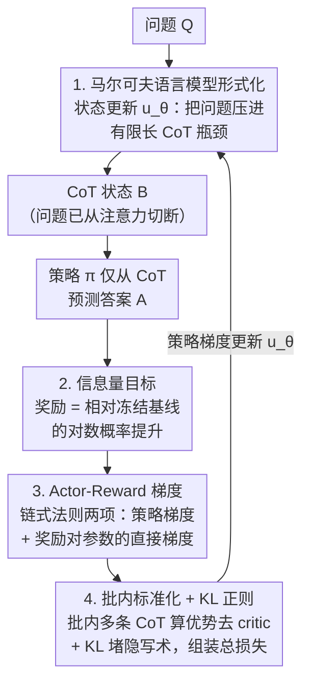

# Markovian Transformers for Informative Language Modeling

**会议**: ICLR 2026  
**arXiv**: [2404.18988](https://arxiv.org/abs/2404.18988)  
**作者**: Scott W. Viteri, Max Lamparth, Peter Chatain, Clark Barrett (Stanford University)
**代码**: [GitHub](https://github.com/scottviteri/MarkovianTraining/)  
**领域**: 优化  
**关键词**: 马尔可夫约束, CoT忠实性, 推理瓶颈, 自编码器类比, GRPO训练, 信息论

## 一句话总结

提出马尔可夫语言模型(MLM)框架，通过**结构约束**（答案预测时移除原始问题，仅从CoT推导）强制CoT成为因果必要的推理瓶颈——类似自编码器的窄潜层，配合GRPO风格策略梯度训练，在GSM8K上从19.6%提升到57.1%，且学到的CoT可跨模型架构（Llama→Mistral/Phi/GPT-2）迁移，证明CoT编码了自然语言推理而非隐写术。

## 研究背景与动机

**CoT忠实性问题普遍存在**：Chain-of-Thought推理虽然提升了LLM性能，但大量研究(Turpin et al., 2023; Lanham et al., 2023)表明CoT不一定忠实反映模型的真实推理过程——扰动CoT文本可能不改变最终答案，说明CoT不是"承重的"(load-bearing)。

**现有优化方法无法根本解决**：STaR(Zelikman et al., 2022)、DeepSeek-R1(Guo et al., 2025)等方法通过微调提升CoT质量，但模型在预测答案时仍可访问原始问题→存在"绕过CoT直接回答"的架构逃逸口。

**信息论视角的缺失**：需要一个框架让CoT成为问题到答案的唯一信息通道，使得破坏CoT必然降低答案质量，提供因果必要性保证而非仅统计相关性。

**结构约束vs优化约束的差距**：纯优化方法（加正则或监督信号）仅软约束CoT质量；而本文追求硬架构约束——从根本上切断"问题→答案"的直连路径。

**自编码器类比的洞察**：将CoT类比为自编码器的窄潜层——所有从输入(Q)到输出(A)的信息必须流经有限带宽的瓶颈(CoT)，迫使模型将推理压缩为可解释的自然语言步骤。

**隐写术风险需要实证排除**：理论上模型可能在CoT中使用人类不可读的编码方式隐藏答案信息(steganography)，需要通过KL惩罚+跨模型迁移实验来实证排除这一可能。

## 方法详解

### 整体框架

把推理过程建模成一条 $A \to B \to C$ 的马尔可夫链：问题 $A$ 先被状态更新函数 $u_\theta$ 压缩成一段 CoT 状态 $B$，模型再**只看 $B$、看不到原始问题**地用策略 $\pi$ 预测答案 $C$。这等价于在问题和答案之间插入一个自编码器式的窄潜层——所有信息必须流经 CoT 这个瓶颈。由于离散文本瓶颈挡住了反向传播，训练只能走强化学习：批内并行采样多条 CoT，用"相对冻结基线的对数概率提升"当奖励，做批内标准化得到优势、再叠加 KL 正则，最后用 GRPO 风格的策略梯度（外加奖励对自身参数的直接梯度）把这段 CoT 训得对预测答案尽可能有信息量。

### 关键设计

**1. 马尔可夫语言模型形式化：从架构上切断问题到答案的直连**

整个框架定义为 $M = (\mathcal{O}, \mathcal{S}, \pi, u, s_1)$，其中观测空间 $\mathcal{O}$ 装的是问题和答案，状态空间 $\mathcal{S}$ 装的是 CoT 推理文本，策略 $\pi: \mathcal{S} \to \Delta(\mathcal{O})$ **只从状态预测下一个观测**，状态更新函数 $u: \mathcal{O} \times \mathcal{S} \to \Delta(\mathcal{S})$ 负责把新观测吸收进状态，$s_1$ 为初始状态。核心约束在于：$\pi$ 预测答案 $o_2$ 时只能读到 CoT 状态 $s_2$，原始问题 $o_1$ 被从注意力通路里彻底移除。这正是它区别于 STaR、DeepSeek-R1 等方法的地方——后者预测答案时仍能看到完整问题，于是存在"绕过 CoT 直接回答"的逃逸口；这里的瓶颈是结构性的硬约束而非损失里的软正则，破坏 CoT 必然降低答案质量。

**2. 信息量目标：让 CoT 相对冻结基线"多带信息"**

CoT 是否承重，要用它对预测答案的边际贡献来衡量。奖励定义为训练模型相对冻结基线的对数概率提升 $R_\theta(\tau) = \sum_{t=1}^{T}\left[\ln\pi_\theta(x_t|s_t) - \ln\pi'(x_t|s'_t)\right]$，对应目标 $J(\theta) = \mathbb{E}_{\tau \sim P, u_\theta, u'}[R_\theta(\tau)]$。最大化 $J(\theta)$ 等于逼着状态更新函数 $u_\theta$ 生成的 CoT 在预测未来观测时信息量充分。从编码理论看这有两条腿：$-\log\pi_\theta(C|B)$ 是给定 CoT 编码答案的代价，$-\log u'(B|A)$ 是 CoT 本身的先验编码代价，训练实际是在找一段让两条腿都便宜的短文本状态 $B$，对应最小描述长度(MDL)的直觉。复杂度上也站得住脚：CoT 多给了 $|B|$ 次前向传播来做推理，模型靠读问题的 $|A|$ 次前向传播解不了难题，就不得不真的用 CoT。

**3. Actor-Reward 梯度：把奖励对自身参数的依赖也用上**

这是本文相对标准 GRPO 的关键改动。由于同一个 Transformer 同时定义了采样分布 $u_\theta$ 和奖励 $R_\theta$，对 $J(\theta)$ 求导时链式法则给出两项：一项是常规的策略梯度（奖励当成常数对采样概率求导），另一项是奖励本身对参数的直接梯度 $\nabla_\theta R_\theta(\tau)$。常规 RL 只用前者，本文两项都用——消融显示去掉直接奖励梯度后多个任务掉点（如 MMLU 从 55.5% 降到 46.6%），说明这一项确实在拉高 CoT 的信息量。

**4. 批内标准化 + KL 正则：去掉 critic 并堵住隐写术**

训练损失拼成三项 $\mathcal{L} = \mathcal{L}_{PG} + \mathcal{L}_{AR} + \mathcal{L}_{KL}$：策略梯度项 $\mathcal{L}_{PG} = -\ln u_\theta(\text{CoT}|q, \text{CoT}_{init}) \cdot A^{detach}$、actor-reward 项 $\mathcal{L}_{AR} = -A$、以及 KL 正则 $\mathcal{L}_{KL} = \beta_{KL} D_{KL}(u_\theta \| u')$（$\beta_{KL}=0.1$）。优势 $A$ 的算法走 GRPO 路线：每批塞 $B$ 份相同的 $(q,a)$ 对，模型生成 $B$ 条多样 CoT，先用未训练模型产的参考 CoT′ 做一次局部减法当基线，再在批内做标准化，于是完全不需要单独的 critic 网络。KL 项把 $u_\theta$ 拽住别离冻结模型太远，作用是阻止模型把答案藏进人类不可读的编码里——配合后文的跨模型迁移实验，从两侧实证排除隐写术。

## 实验关键数据

### 表1: 主实验准确率对比 (Llama 3.1 8B)

| 数据集 | 基线 | Expert Iteration | 无奖励梯度 | **马尔可夫(本文)** | 非马尔可夫 |
|--------|------|-----------------|-----------|-------------------|-----------|
| GSM8K | 19.6% | 61.6% | 62.2% | **57.1%** | 63.3% |
| ARC-Challenge | 36.1% | 65.6% | 79.3% | **79.9%** | 78.6% |
| MMLU | 21.4% | 53.2% | 46.6% | **55.5%** | 68.7% |
| SVAMP | 18.0% | 38.7% | 40.7% | **42.3%** | 43.3% |
| Arithmetic | 1.0% | 76.0% | 81.0% | **98.0%** | 97.0% |
| **平均** | 19.2% | 59.0% | 62.0% | **66.6%** | 70.2% |

### 表2: Wikipedia延续任务扰动脆弱性 ($\Delta\ln P$ = 马尔可夫drop − 非马尔可夫drop)

| 扰动强度 | 字符替换 | 删除 | 数字替换 | 后截断 | 前截断 | **行均值** |
|---------|---------|------|---------|-------|-------|-----------|
| 20% | +0.457 | +0.459 | +0.016 | +0.254 | -0.009 | **+0.235** |
| 40% | +0.849 | +0.836 | +0.025 | +0.368 | +0.121 | **+0.440** |
| 60% | +1.042 | +1.002 | +0.035 | +0.596 | +0.284 | **+0.592** |
| 80% | +1.079 | +1.069 | +0.038 | +1.020 | +0.622 | **+0.766** |
| 100% | +1.084 | +1.263 | +0.039 | +1.258 | +1.262 | **+0.981** |

### 表3: QA任务扰动脆弱性 (准确率Δ，正值=马尔可夫更脆弱)

| 数据集 | 字符替换 | 删除 | 数字替换 | 后截断 | 前截断 | **均值** |
|--------|---------|------|---------|-------|-------|---------|
| ARC | +0.320 | +0.424 | -0.004 | +0.069 | +0.439 | **+0.250** |
| SVAMP | +0.154 | +0.204 | +0.081 | +0.076 | +0.046 | **+0.112** |
| GSM8K | +0.059 | +0.069 | -0.013 | +0.105 | +0.044 | **+0.053** |
| MMLU | +0.056 | +0.124 | +0.004 | +0.038 | -0.001 | **+0.044** |

## 关键发现

- **马尔可夫约束的代价很小**：在5个数据集上，马尔可夫模型平均仅落后非马尔可夫3.6pp(66.6% vs 70.2%)——付出较小的准确率代价换取CoT因果必要性的结构保证。
- **ARC-Challenge和Arithmetic上马尔可夫甚至超越非马尔可夫**：ARC 79.9% vs 78.6%，Arithmetic 98.0% vs 97.0%——表明对某些推理任务，强制信息瓶颈反而有正则化效果。
- **扰动脆弱性单调递增**：随扰动强度从20%到100%，$\Delta\ln P$从+0.235增长到+0.981→马尔可夫的CoT确实承载了更多因果信息。
- **跨模型迁移成功**：Llama生成的CoT对Mistral、Phi-3.5、甚至GPT-2都有信息量→证明CoT编码了自然语言推理步骤而非模型特异的隐写术。
- **Actor-Reward梯度至关重要**：消融实验表明，去掉 $\nabla_\theta R_\theta$ 项后多个任务性能下降（如MMLU从55.5%降至46.6%）。

## 亮点与洞察

- **自编码器类比的精妙**：$Q$=原始数据，$CoT$=潜层，$A$=重建→窄潜层迫使压缩→推理必须经过语言化表达，且编码理论解释(MDL)让这个类比具有数学严谨性。
- **结构 > 优化的方法论贡献**：通过架构约束（移除$q$的注意力通路）而非损失约束确保CoT必要性——这是比FRODO等优化方法更强的保证。
- **跨模型迁移=反隐写术证据**：如果CoT只是加密编码，换decoder就不工作；但GPT-2（参数量远小于训练模型）也能利用→CoT必然是自然语言。
- **算术任务的定性变化**：训练前Llama的CoT只是列出数字和错误总和，训练后出现正确的逐步计算→行为上可观察到的推理能力涌现。

## 局限与展望

- **MMLU差距较大**(55.5% vs 68.7%)→需要知识检索的任务中，CoT瓶颈限制了从问题到答案的信息传递，代价更显著。
- **不保证完全忠实性**：模型可能在读问题的前向传播中已计算答案，然后生成事后合理但非真实路径的CoT——马尔可夫约束保证CoT充分但不保证它反映内部计算。
- **仅在7-8B模型上验证**：更大模型有更强的隐写术编码能力，KL惩罚是否仍足够？
- **缺乏人类评估**：当前通过扰动脆弱性和跨模型迁移间接验证可解释性，尚无直接的人类可读性/有用性评估。
- **训练成本较高**：总计约$20K（H100/H200），单次训练约10小时——对学术组并不友好。

## 相关工作对比

### vs FRODO (Paul et al., 2024)
FRODO使用因果中介分析和两模块训练框架来增加CoT对答案的因果效应，但仍允许模型在生成答案时看到原始问题——是**优化层面**的软约束。本文通过**架构层面**直接移除问题到答案的注意力路径，提供更强的因果必要性保证。实验显示本文在多个数据集上表现更好，且具有跨模型迁移能力这一独特优势。

### vs DeepSeek-R1 / STaR / QuietSTaR
这些方法也利用RL或自训练提升CoT推理质量，但允许模型在生成推理token时看到完整上下文——不强制马尔可夫结构。本文的关键区别在于**信息瓶颈**：答案仅从CoT推导，提供了CoT忠实性的结构保证而非仅性能提升。DeepSeek-R1追求更强的推理能力但不关注CoT的因果必要性；STaR/QuietSTaR通过迭代改进CoT但缺乏防止绕过CoT的架构机制。

### vs Lyu et al. (2023) Faithful CoT
同样考虑限制模型访问原始输入，但将问题重写为形式化语言/代码再执行。本文使用自然语言作为推理状态→保持了跨任务的可解释性和通用性，不依赖外部执行器。

## 评分

- **新颖性**: ⭐⭐⭐⭐⭐ 将自编码器瓶颈思想引入CoT忠实性，理论框架(MLM+MDL)优雅统一
- **实验充分度**: ⭐⭐⭐⭐ 5个QA数据集+Wikipedia+扰动分析+跨模型迁移+消融，但缺少Scale实验和人类评估
- **写作质量**: ⭐⭐⭐⭐⭐ 自编码器类比精准，从定义到算法到实验的逻辑链清晰完整
- **实用价值**: ⭐⭐⭐⭐ 对可解释AI和CoT忠实性有根本方法论意义；实际部署仍需解决效率和scale问题

<!-- RELATED:START -->

## 相关论文

- [\[ICLR 2026\] Distributionally Robust Optimization via Generative Ambiguity Modeling](distributionally_robust_optimization_via_generative_ambiguity_modeling.md)
- [\[NeurIPS 2025\] Optimality and NP-Hardness of Transformers in Learning Markovian Dynamical Functions](../../NeurIPS2025/optimization/optimality_and_np-hardness_of_transformers_in_learning_markovian_dynamical_funct.md)
- [\[ICLR 2026\] Learning to Recall with Transformers Beyond Orthogonal Embeddings](learning_to_recall_with_transformers_beyond_orthogonal_embeddings.md)
- [\[ICLR 2026\] Neural Sum-of-Squares: Certifying the Nonnegativity of Polynomials with Transformers](neural_sum-of-squares_certifying_the_nonnegativity_of_polynomials_with_transform.md)
- [\[ICLR 2026\] Cutting the Skip: Training Residual-Free Transformers](cutting_the_skip_training_residual-free_transformers.md)

<!-- RELATED:END -->
