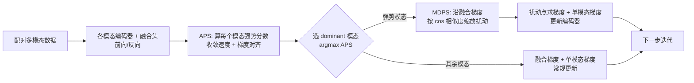

# MASAM: Multimodal Adaptive Sharpness-Aware Minimization for Heterogeneous Data Fusion

**会议**: ICLR 2026  
**OpenReview**: [https://openreview.net/forum?id=AUKeDukcUi](https://openreview.net/forum?id=AUKeDukcUi)  
**代码**: [https://github.com/Orange2107/MASAM-Multimodal-Adaptive-SAM](https://github.com/Orange2107/MASAM-Multimodal-Adaptive-SAM)  
**领域**: 多模态优化 / 平衡多模态学习  
**关键词**: 模态不平衡, Sharpness-Aware Minimization, 损失曲面平坦度, 异构数据融合, 自适应扰动  

## 一句话总结
把单模态里用来找平坦极小值的 SAM 改造成「模态自适应」版本：用一个自适应扰动分数挑出当前最强势的模态、只对它施加沿融合梯度方向的解耦扰动，从而在异构融合中同时缓解模态不平衡、把每个模态的编码器都拽进平坦区。

## 研究背景与动机
- **领域现状**：多模态学习要融合结构化记录、影像、时序信号等异构模态，但异构性导致各模态编码器收敛速度不一，强模态主导训练、弱模态欠优化（即「模态不平衡」），融合后甚至不如单模态。现有解法（G-Blend、OGM、AGM、MLA 等）主要靠**梯度调制**来重新缩放梯度幅值。
- **现有痛点**：这些方法只动梯度大小，**忽略了损失曲面的几何结构**——也就是解的「锐度（sharpness）」。论文用 Hessian trace 实测发现：朴素 late fusion 中收敛更快的 CXR 编码器一开始走向平坦区，但随后被不稳定的 EHR 编码器通过跨模态干扰拽回锐利区，泛化能力被破坏。
- **核心矛盾**：SAM 能在单模态里通过寻找平坦极小值提升泛化，理应能治模态不平衡；但直接搬到多模态会反受其害——(1) **放大不平衡**：SAM 一刀切地压锐度，更偏袒收敛快的强模态；(2) **模态无感扰动**：各模态损失曲面几何不同，SAM 用统一扰动逼所有编码器走同一条轨迹，而且扰动梯度本身被其它模态的耦合干扰污染，方向是偏的（论文 Observation 1 形式化了这一点）。
- **本文目标**：让 SAM「认识模态」，在保留平坦化泛化收益的同时不引入不平衡、不施加不兼容的扰动。
- **核心 idea**：**按模态强势程度差异化优化**——只对强势模态做 SAM 正则、并把扰动方向投影/缩放到与融合目标对齐的方向上，避免污染弱模态。

## 方法详解

### 整体框架
MASAM 在标准 late-fusion 多模态训练（融合损失 $L_{\text{fuse}}$ + 各模态单模态辅助损失 $L_m$）的基础上，每一步插入两个模块：先用 **APS** 算出每个模态的「强势分数」并选出当前 dominant 模态，再用 **MDPS** 给这个 dominant 模态施加一个沿融合梯度、按梯度对齐度缩放的解耦扰动；其余非主导模态正常更新。整体目标是

$$L_{\text{total}} = L_{\text{fuse}} + \lambda_{m_1} L_{m_1} + \lambda_{m_2} L_{m_2}.$$

### 关键设计

**1. 自适应扰动分数 APS：用「学得快不快 + 梯度对不对齐」判定谁是强势模态。** 论文把模态强势拆成两个互补信号。一是**学习速度**，用单模态损失的移动平均反推短期下降量 $\text{Decay}^{(t)}_m = \max(0,\, L^{(t-1)}_m - \text{MA}^{(t)}_m)$，其中 $\text{MA}^{(t)}_m = \beta\,\text{MA}^{(t-1)}_m + (1-\beta)L^{(t)}_m$，下降越快说明这个模态信息被持续高效吸收、贡献越大。二是**梯度对齐度**，强模态携带更多与下游任务相关的共享信息，会主导融合目标的优化轨迹，表现为单模态梯度与融合梯度的余弦相似度高：

$$\gamma^{(t)}_m = \frac{\langle \nabla_{\theta_m} L_{\text{fuse}},\, \nabla_{\theta_m} L_m\rangle}{\|\nabla_{\theta_m} L_{\text{fuse}}\|_2 \cdot \|\nabla_{\theta_m} L_m\|_2}.$$

两者加权合成 $\text{APS}^{(t)}_m = \alpha\,\text{Decay}^{(t)}_m + (1-\alpha)\,\gamma^{(t)}_m$，每步取 $m^\star = \arg\max_m \text{APS}_m$ 作为要被 SAM 约束的强势模态。只压强模态的好处是：既稳住它向平坦区收敛，又不让弱模态被强模态那个偏向的扰动连累。

**2. 模态解耦扰动缩放 MDPS：扰动只沿「共享信息方向」走，且按对齐度自动收放力度。** 融合梯度 $\nabla_{\theta_m} L_{\text{fuse}}$ 可看作引导学习共享表示的方向，所以 MASAM 把扰动施加在这个方向上；但 Observation 1 指出该梯度被各模态耦合污染，照搬 SAM 会误导弱模态。MDPS 的做法是用前面那个余弦相似度 $\gamma_m$ 当缩放系数：

$$\epsilon_m = \rho \cdot \gamma_m \cdot \frac{\nabla_{\theta_m} L_{\text{fuse}}}{\|\nabla_{\theta_m} L_{\text{fuse}}\|_2}.$$

直观上这等价于把单模态损失梯度**投影**到融合梯度方向——当单模态目标与融合目标越一致（$\gamma_m$ 越大）扰动越强，方向冲突时扰动自动萎缩，从而做到「模态解耦」的扰动，避免把弱模态推离它自己的平坦区。

**3. 三分区参数更新 + 收敛保证。** 参数被划成 dominant 模态 $\{\theta_{m^\star}\}$、非 dominant 模态 $\{\theta_m\}_{m\ne m^\star}$ 和其它参数 $\theta_{\text{other}}$。$\theta_{\text{other}}$ 用基础优化器（SGD/Adam）正常更新；dominant 模态在扰动点处取融合梯度再叠加单模态梯度

$$\theta^{t+1}_{m} = \theta^t_m - \eta_t\Big(\nabla_{\theta_m} L_{\text{fuse}}\big(\theta^t_m + \rho_t \gamma^t_m \tfrac{\nabla_{\theta_m} L^t_{\text{fuse}}}{\|\nabla_{\theta_m} L^t_{\text{fuse}}\|_2}\big) + \nabla_{\theta_m} L_m(\theta^t_m)\Big);$$

非主导模态则只用当前参数处的融合梯度 + 单模态梯度更新。论文进一步基于 inexact gradient descent 框架给出 Theorem 1：在标准 Lipschitz 光滑、学习率 $\sum \eta_t = \infty,\ \eta_t \downarrow 0$、$\sum \eta_t \rho_t < \infty$、$\limsup \rho_t < 2/L_{\text{fuse}}$ 等条件下，更新序列收敛到联合目标的稳定点，且这些条件在交叉熵损失 + 近似常数半径下实际可满足。

## 实验关键数据

### 主实验表格
5 个多模态数据集 / 6 个下游任务，4 个随机种子平均（Relative Gain 相对最强 baseline）：

| 任务/数据集 (指标) | Late Fusion | 最强 baseline | MASAM | 相对增益 |
|---|---|---|---|---|
| MIMIC-Phenotype (AUPRC) | 0.475 | 0.481 (InfoREG) | **0.498** | +3.53% |
| MIMIC-Mortality (AUPRC) | 0.567 | 0.585 (MMPareto) | **0.603** | +3.08% |
| CREMA-D (Acc) | 0.660 | 0.770 (AUG) | **0.814** | +5.71% |
| Kinetics-Sounds (Acc) | 0.636 | 0.689 (AUG) | **0.740** | +7.40% |
| UPMC-Food101 (Acc) | 0.907 | 0.928 (MLA) | **0.935** | +0.75% |
| ADNI (mAP) | 0.826 | 0.847 (AUG) | **0.857** | +1.18% |
| UR-FUNNY 三模态 (Acc) | 0.620 | 0.632 (OGM) | **0.644** | +1.90% |

MASAM 在全部 7 列都拿第一；UPMC 上虽然提升幅度小，但配对显著性检验 $p=0.0046<0.005$。

### 消融实验表格
逐组件消融（MIMIC-Phenotype AUPRC / KS Acc，4 种子平均）：

| # | 变体 | APS | MDPS | SAM | Phenotype | KS |
|---|---|---|---|---|---|---|
| – | **MASAM** | ✓ | ✓ | ✓ | **0.498** | **0.740** |
| 1 | w/o APS | ✗ | ✓ | ✓ | 0.484 | 0.724 |
| 2 | w/o MDPS | ✓ | ✗ | ✓ | 0.491 | 0.723 |
| 3 | SAM Only | ✗ | ✗ | ✓ | 0.478 | 0.689 |
| 4 | Late Fusion | ✗ | ✗ | ✗ | 0.475 | 0.636 |

对比 #3(SAM Only) vs #4(Late Fusion)：朴素 SAM 在 Phenotype 上只 +0.63%、几乎无用，印证「直接套 SAM 行不通」。加 APS（MASAM vs #1）带来 +2.89%（Phenotype）/+2.21%（KS），加 MDPS（MASAM vs #2）带来 +1.43%/+2.35%，两模块互补。

### 关键发现
- **平坦度可视化**：MIMIC 上用 Li et al. (2018) 的损失曲面可视化与 Hessian trace，MASAM 让两个模态编码器**同时**收敛到比所有 baseline 更平坦的区域，而梯度调制类方法因忽略几何仍可能停在锐利区。
- **单模态性能解耦评估**：冻结编码器后只训分类头，MASAM 的单模态表现全面超过多模态 baseline，在噪声/缺失严重的 MIMIC 上甚至超过用单模态数据单独训练的 unimodal baseline，说明真正做到了平衡学习。
- **标签噪声鲁棒性**：在 CREMA-D / KS 注入 20%–60% 标签噪声，MASAM 在所有噪声档位都领先，平坦极小值带来的泛化收益在高噪声下尤为明显。

## 亮点与洞察
- **把模态不平衡问题从「梯度幅值」上升到「损失曲面几何」**：先用 Hessian trace 实证强模态会被跨模态干扰拽进锐利区，再据此动机引入 SAM，问题切入角度新颖。
- **APS 与 MDPS 复用同一个量 $\gamma_m$（梯度对齐度）**：既当选模态的判据、又当扰动缩放系数，设计简洁自洽，几乎不引入额外计算。
- **「只扰动强势模态」是反直觉但合理的选择**：通常会想去帮弱模态，但论文论证强模态才是把别人拽进锐利区的源头，稳住它反而解放了弱模态。
- 方法对任意模态数通用（Algorithm 1 支持 M 模态），并在 UR-FUNNY 三模态上验证可扩展。

## 局限与展望
- 框架主要在 late-fusion + 模态专属编码器结构上推导与验证，对早期融合/共享主干/大规模预训练多模态模型是否适用未充分讨论。
- 每步要为各模态额外算单模态梯度、融合梯度对齐及扰动点的二次前反向，开销高于纯梯度调制方法，论文未给出训练成本/吞吐的系统对比。
- APS 假设「学得快 + 梯度对齐 = 强势」，在模态噪声极端不对称或存在模态缺失时该判据是否稳健仍待考察。
- 收敛性分析针对 dominant 模态的更新给出，整体三分区交替更新的全局动态分析较为有限。

## 相关工作与启发
- **平衡多模态学习**：G-Blend、OGM、AGM、MLA、MMPareto、PMR 等大多靠梯度调制；MASAM 的差异化贡献是引入损失曲面几何视角，对后续「几何 + 调制」结合的工作有启发。
- **SAM 及其变体**：源自 Foret et al. (2021)，后续变体多在单模态内改进扰动/锐度估计；本文是把 SAM 系统性迁移到多模态、并指出其失效机理（Observation 1）的早期工作之一。
- 对临床多模态（MIMIC EHR+CXR、ADNI）这类高噪声高缺失场景，「追平坦极小值以换鲁棒性」的思路值得在 DrFuse / MedFuse 等专用模型上进一步嫁接。

## 评分
- **新颖性**: ⭐⭐⭐⭐ — 把模态不平衡重新框定为损失曲面锐度问题、并据此设计模态自适应 SAM，角度清新；APS/MDPS 复用同一对齐度的设计巧妙。
- **实验充分度**: ⭐⭐⭐⭐ — 5 数据集 6 任务 + 三模态扩展 + 平坦度可视化 + 单模态解耦评估 + 噪声鲁棒性 + 敏感性分析，覆盖很全；略欠训练开销对比。
- **写作质量**: ⭐⭐⭐⭐ — 动机由实测 Hessian trace 驱动，Observation 1 + 定理 + 算法表逻辑清晰，公式与符号一致。
- **价值**: ⭐⭐⭐⭐ — 提供了一个即插即用、对模态数通用、在临床等高噪声场景实测有效的优化框架，有较强落地与延伸潜力。

<!-- RELATED:START -->

## 相关论文

- [\[ICLR 2026\] Towards Understanding the Calibration Benefits of Sharpness-Aware Minimization](towards_understanding_the_calibration_benefits_of_sharpness-aware_minimization.md)
- [\[ICLR 2026\] Minor First, Major Last: A Depth-Induced Implicit Bias of Sharpness-Aware Minimization](minor_first_major_last_a_depth-induced_implicit_bias_of_sharpness-aware_minimiza.md)
- [\[ICLR 2026\] Bi-LoRA: Efficient Sharpness-Aware Minimization for Fine-Tuning Large-Scale Models](bi-lora_efficient_sharpness-aware_minimization_for_fine-tuning_large-scale_model.md)
- [\[ICML 2026\] Stability Analysis of Sharpness-Aware Minimization](../../ICML2026/optimization/stability_analysis_of_sharpness-aware_minimization.md)
- [\[ICML 2025\] Tilted Sharpness-Aware Minimization](../../ICML2025/optimization/tilted_sharpness-aware_minimization.md)

<!-- RELATED:END -->
