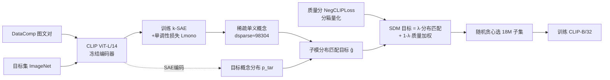

# Matched Data, Better Models: Target Aligned Data Filtering with Sparse Autoencoders

**会议**: ICLR 2026  
**OpenReview**: [https://openreview.net/forum?id=cgmo3v18sx](https://openreview.net/forum?id=cgmo3v18sx)  
**代码**: 待确认  
**领域**: 数据筛选 / 子模优化 / 视觉语言预训练  
**关键词**: 数据选择, 稀疏自编码器, 子模优化, 分布匹配, CLIP, DataComp  

## 一句话总结
用稀疏自编码器把 CLIP 特征拆成"可计数"的单义概念，再把数据筛选建模成"让选中子集的概念分布去逼近目标分布"的子模最大化问题（SDM），在 DataComp-medium 上以更少样本和 5× 更少 GPU 时数逼近 SOTA。

## 研究背景与动机
**领域现状**：网络爬取的图文数据（如 DataComp 128M 对）是 CLIP 等视觉语言模型的燃料，但充满噪声与冗余。主流数据筛选方法（CLIP-Score、NegCLIPLoss、NormSim 等）几乎都是"逐样本打分 + 阈值保留"：给每个样本算一个质量分，超过阈值就留下。

**现有痛点**：逐样本独立评估**看不到只在集合层面才出现的性质**。两个各自高质量的样本放一起可能高度冗余；而一个孤立看起来低质的样本（论文里的例子：一张得分很低的"绿色背景"图）反而可能是模型学习"绿色"这一概念的稀缺来源。只按个体分数取 top，最终数据集在概念层面是失衡的，限制泛化。

**核心矛盾**：要在集合层面平衡概念分布，需要 (1) 能在集合层面识别并**度量每个概念存在多少**，(2) 能选出一个子集让概念分布满足期望性质。但标准 CLIP 表征是**纠缠的**——一个维度混合多个概念，无法量化"某概念在集合里占多少"。

**本文目标**：在不引入任何外部模型/数据的前提下，做出一个考虑分布层面性质、又能和已有质量分融合的可扩展数据筛选框架。

**核心 idea**：**① 先解纠缠成可计数概念**——训练带"单调性"约束的稀疏自编码器（SAE），让每个特征对应一个单义概念且其数值随概念出现量单调增长，于是对集合求和就近似"概念计数"；**② 再做分布匹配**——把"选中子集的概念分布逼近目标分布（如 ImageNet）"证明为子模最大化，从而用带常数因子保证的贪心算法在百万级数据上求解。

## 方法详解

### 整体框架
SDM（Submodular Distribution Matching）三步走：先在冻结的 CLIP 图像嵌入上训练一个带单调性损失的 k-SAE，把稠密特征拆成 ~10 万维稀疏单义概念；接着在目标数据集（如 ImageNet-1K 训练集）上统计这些概念的经验分布 $p^{tar}$；最后把"选子集使其概念分布逼近 $p^{tar}$"转写为一个特征基（feature-based）子模函数的最大化，并融合量化后的质量分，用随机贪心求解。

### 关键设计
**1. 特征基函数（FB function）作为"概念分布"载体：把子集打分变成对概念计数的凹聚合。** 给定设计矩阵 $Z\in\mathbb{R}^{n\times d}_+$ 与单调非降凹函数 $\phi_i$，特征基函数定义为 $f(A)=\sum_{i=1}^d w_i\,\phi_i\!\big(m_i(A)\big)$，其中 $m_i(A)=\sum_{j\in A}z_{ji}$ 是概念 $i$ 在子集 $A$ 里的总量。这套形式之所以关键：$z_{ji}$ 越大表示样本 $j$ 含概念 $i$ 越多（**单调性**），求和 $m_i(A)$ 就天然像"集合里该概念的计数"，类似 TF-IDF 里词频随文档增多而增长；而 $\phi_i$ 的**凹性**带来边际递减——某概念已经充分表示后，再加相似样本贡献很小，这正是抑制冗余、鼓励多样性的数学根源。它是后续把分布匹配接到子模优化的桥梁。

**2. 单调性损失 $L_{mono}$：让 SAE 的激活值不仅"单义"，还要"能当计数用"。** 仅靠 k-SAE 的重建损失能学到单义（monosemantic）特征，但单义 ≠ 单调——一个只在有鸟时激活的神经元，激活值却可能在图里非鸟物体更多时更高，这样数值就不能反映概念"强度"。论文借鉴 peripteral loss 构造对比项：采样异质集 $E$（概念更多）和同质集 $M$（概念少），用稠密空间里的成对相似度之差定义 margin $\Delta(E|M)$，并以无权 FB 函数 $f(A)=\sum_i\log(1+m_i(A))$ 实例化：
$$L_{mono}(E,M)=|\Delta(E|M)|\cdot\log\!\Big(1+\exp\big(\tfrac{1-f(E)-f(M)}{\Delta(E|M)}\big)\Big)$$
它强制 $f(E)-f(M)$ 的符号与大小对齐到 margin。由于 $f$ 是凹的，反复抬高已激活特征收益甚微，最省力的降损方式就是让 $E$ 里的新概念去**点亮新特征**，从而把表征推向"随概念出现量单调增长"。$M$ 由 $E$ 中某元素取最近邻构造，无需已知真实概念集。

**3. 分布匹配 ≡ 子模差（DS）最大化：把 KL 散度最小化变成可优化的子模问题。** 定义直方图经验分布 $p(A)_i=m_i(A)/\sum_j m_j(A)$，目标是选 $A$ 最小化 $D_{KL}(p^{tar}\,\|\,p^{source}(A))$。论文证明（Thm 2.3）这等价于
$$\arg\max_{A}\sum_i p^{tar}_i\log m_i(A)-\log\Big(\sum_j m_j(A)\Big)\triangleq g(A),$$
即一个子模差（DS）函数最大化。DS 最大化无多项式近似算法，于是用 Lemma 2.4 对 $\log\sum_j m_j(A)$ 用 $\log(k\beta b)$ 上界（基数约束下为常数），得到子模下界 $\hat g(A)=\sum_i p^{tar}_i\log m_i(A)-\log(k\beta b)$，从而可用带常数因子保证的随机贪心高效求解；活动正则项压低 $\beta$ 使界更紧。

**4. 与质量分的"分箱"融合：用粗粒度偏好把噪声质量分接进子模目标。** 直接把模块化质量分 $\sum_{a\in A}q(a)$ 加到 $\hat g$ 上虽仍子模，但 $q$ 不随 $|A|$ 递减，会盖过分布匹配项，且逐点 $q$ 噪声大、细微差异不可信。SDM 改为对 $q$ 量化分箱后构造另一个 FB 函数 $q'(A)=\sum_{i\in[\ell]}u_i\log(1+\sum_{j\in A}\mathbb{1}[q(j)\in[b_{i-1},b_i)])$，只用"高/中/低"这种粗偏好（实验里三箱权重 0/0.01/0.99）。最终目标用 $\lambda$ 平衡：
$$\max_{|A|=b}\;\lambda\sum_i p^{tar}_i\log(1+m_i^{src}(A))+(1-\lambda)\sum_i u_i\log\big(1+\textstyle\sum_{j\in A}\mathbb{1}[q(j)\in\text{bin }i]\big)$$
两项形式同构（都是 KL 视角下的分布匹配），整体仍是单调子模，可统一用随机贪心优化。

## 实验关键数据

### 主实验表格（DataComp-medium，单模型 CLIP ViT-L/14，无外部模型）

| 筛选策略 | 子集 | IN1K | IN1K Shifts | VTAB | Retrieval | Avg |
|---|---|---|---|---|---|---|
| No Filter | 128M | 17.6 | 15.2 | 25.9 | 21.9 | 25.8 |
| CLIP-Score | 38M | 27.3 | 23.0 | 33.8 | 25.1 | 32.8 |
| negCLIPLoss (NCL) | 33M | 28.8 | 23.8 | 35.4 | 25.3 | 34.4 |
| NCL ∩ NormSim (IN1K) | 22M | 32.8 | 26.8 | 36.2 | 26.5 | 35.3 |
| NCL ∩ NormSim (Target) | 22M | 32.7 | 26.5 | 37.5 | 26.5 | 35.7 |
| **SDM (ours)** | **18M** | **35.2** | **27.1** | **38.6** | **26.8** | **36.4** |

SDM 用更少样本（18M vs 22M）在 ImageNet-1K 上超过最强 baseline **2.5%**，平均提升 0.7%；在更小子集规模下优势更明显（少 33% 样本仍在 IN 上领先近 2%），论文归因于其降冗余能力。

### 消融实验表格
**单调性损失 $L_{mono}$（MS=单义分↑，MT=单调分↑）**

| 训练损失 | MS(IN1K) | MT(IN1K) | IN1K Acc | Avg |
|---|---|---|---|---|
| $L_{recons}$ | 0.60 | 0.60 | 34.80 | 35.00 |
| $L_{recons}+L_{mono}$ | 0.63 | 0.65 | 35.20 | 36.40 |

**稀疏特征 + 子模性（IN1K / 38 任务平均）**

| | 子模 | 非子模 |
|---|---|---|
| 稀疏(SAE) IN1K | 35.2 | 34.6 |
| 稠密(CLIP) IN1K | 24.1 | 23.7 |
| 稀疏(SAE) Avg | 36.4 | 35.1 |
| 稠密(CLIP) Avg | 29.1 | 28.9 |

稀疏特征是命门：换回稠密 CLIP 特征 IN1K 直接掉 **~12%**、平均掉 9%；去掉 $\log$ 凹项（去子模性）平均掉 1.3%。

### 关键发现
- **跨 backbone/质量分稳健**：在 ViT-L/14、ViT-B/32、DFN-P 三种 backbone 与 CLIPScore/NegCLIPLoss 两种质量分下，SDM 一致优于 NormSim，印证"分布感知 > 逐样本评估"。
- **接外部模型也强**：把 SDM 接到 NCL+DFN+HYPE 集成（并用 CLIP ViT-L/14 + DINOv2 双 SAE 特征），IN1K 39.2%/Avg 39.2%，登 DataComp-medium 排行榜平均第 2；唯一超过它的 Metagradient Descent 在 IN1K 上反而低 12.2% 且算力代价是其 **5×+**。
- **算力账**：SAE 训练 15 A100h（且与候选池大小无关），随机贪心从 128M 选 25M 仅约 1 CPU 时（5 次取交集共 5 CPU 时，可并行）。

## 亮点与洞察
- **概念的"可计数化"是核心洞见**：把单义 + 单调两件事分开看，单义解决"是什么概念"，单调解决"有多少"，只有两者兼具，集合求和才等于概念计数，分布匹配才成立——这一步是把可解释性工具（SAE）真正接入优化目标的关键。
- **优雅的等价证明**：把"概念分布的 KL 最小化"严格写成子模差最大化，再用基数约束把麻烦的归一化项变常数，从而吃到子模优化的常数因子保证和线性可扩展贪心——理论与可扩展性兼得。
- **质量分的"分箱化"很务实**：承认逐点质量分有噪声，只取粗偏好并复用同构的 FB 形式融入，既稳健又不破坏子模结构。
- **副产品反哺可解释性**：$L_{mono}$ 同时把 MS/MT 两个分数都拉高，对 SAE 解释性社区也有借鉴价值。

## 局限与展望
- **依赖目标分布选择**：默认用 ImageNet-1K 当目标，目标集是否代表真实下游任务会直接影响选择质量；当下游极其多样或未知时如何设目标分布仍待探讨。
- **SAE 维度与超参成本**：$d_{sparse}\approx98k$、TopK、$\lambda$、分箱权重等超参较多，迁移到新域需重新调；论文主要在 DataComp-medium 规模验证，更大规模（如 DataComp-xlarge）行为未充分展开。
- **单调性是近似**：$\Delta(E|M)$ 用稠密空间相似度近似真实概念差异，且"概念"本身定义模糊，单调性只是软约束而非严格保证。
- **仍需先有一个好嵌入模型**：方法假设有可用的 CLIP/DINOv2 嵌入，在缺乏强预训练编码器的领域（如某些生物医学图文）适用性受限——尽管论文正以"不需额外训练专用模型"为卖点。

## 相关工作与启发
- **逐样本质量筛选**：CLIP-Score、NegCLIPLoss、NormSim、DFN、HYPE 等都是逐样本打分阈值法，本文的对照系与融合对象。
- **目标感知/子模数据选择**：与 D2 Pruning、few-shot 适配的相似度选择，以及用子模做多样且相关选择的工作同脉，本文贡献是把"分布匹配"与子模在 KL 视角下打通。
- **稀疏自编码器与可解释性**：k-SAE、单义性研究是其特征解纠缠的工具来源，而本文反过来给 SAE 加单调性约束，给可解释性社区提供新评估维度（MT Score）。
- **启发**：把"集合层面分布性质"形式化为可优化目标，是逐样本启发式之外的一条值得推广的数据中心化路线，可迁移到 LLM 预训练语料筛选、RAG 语料构建等场景。

## 评分
- **新颖性**: ⭐⭐⭐⭐⭐ 把 SAE 单义/单调解纠缠 + 子模分布匹配 + 质量分箱三者严格打通，视角与方法都新颖。
- **实验充分度**: ⭐⭐⭐⭐ 主表、跨 backbone、单调性损失、稀疏 vs 子模消融、外部模型融合都齐，唯更大规模与目标分布敏感性可再补。
- **写作质量**: ⭐⭐⭐⭐ 动机图示清晰、定理与算法层次分明，部分定理细节下放附录。
- **价值**: ⭐⭐⭐⭐⭐ 用 5× 更少算力逼近 SOTA，且无需外部模型，对资源受限的大规模数据筛选有很强实用价值。

<!-- RELATED:START -->

## 相关论文

- [\[NeurIPS 2025\] Projecting Assumptions: The Duality Between Sparse Autoencoders and Concept Geometry](../../NeurIPS2025/optimization/projecting_assumptions_the_duality_between_sparse_autoencoders_and_concept_geome.md)
- [\[ICLR 2026\] Evaluating Data Influence in Meta Learning](evaluating_data_influence_in_meta_learning.md)
- [\[ICLR 2026\] Fast Data Mixture Optimization via Gradient Descent](fast_data_mixture_optimization_via_gradient_descent.md)
- [\[ICLR 2026\] Jacobian Aligned Random Forests](jacobian_aligned_random_forests.md)
- [\[ICLR 2026\] Generalization Below the Edge of Stability: The Role of Data Geometry](generalization_below_the_edge_of_stability_the_role_of_data_geometry.md)

<!-- RELATED:END -->
