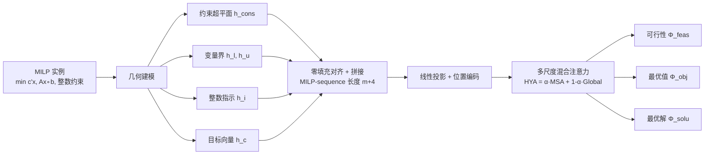

# MILPnet: A Multi-Scale Architecture with Geometric Feature Sequence Representations for Advancing MILP Problems

**会议**: ICLR 2026  
**OpenReview**: [https://openreview.net/forum?id=pkwq3F7gUp](https://openreview.net/forum?id=pkwq3F7gUp)  
**代码**: [https://github.com/ijklkjhggfajhhjkj/Seq_MILP](https://github.com/ijklkjhggfajhhjkj/Seq_MILP)  
**领域**: 组合优化 / Learning to Optimize (MILP 表示学习)  
**关键词**: 混合整数线性规划, MILP, 几何序列表示, 多尺度注意力, Foldable MILP, WL-test, 可行性预测  

## 一句话总结
把 MILP 实例从「二部图」改写成「几何特征序列」，再用多尺度混合注意力建模，从根上绕开 GNN 受 Weisfeiler-Lehman 测试限制而无法区分 Foldable MILP 的表达力瓶颈，并给出可行性/最优解/最优值映射的逼近理论保证。

## 研究背景与动机
- **领域现状**：MILP 是 NP-hard 的核心组合优化问题，传统 Branch-and-Bound / Cutting Plane 在大规模实例上代价爆炸。近年主流做法是把 MILP 实例建成「变量-约束」二部图，用 GNN 做消息传递来预测可行性、最优解或加速求解。
- **现有痛点**：二部图只编码了「变量↔约束」的连接关系，**缺失约束与约束之间的高阶交互**——而这些交互往往才编码了可行域形状、最优解位置等关键信息。
- **核心矛盾**：GNN 的表达力被 WL-test 上界死死卡住。存在一对 **Foldable MILP**：两个非同构实例，一个可行、一个不可行，但 GNN 看来完全一样（Theorem 1，来自 Chen et al. 2023b）。给图注入随机特征（RF 变体）只是「绕过」WL 限制，并没有捕捉 MILP 本身的几何本质，对复杂 Foldable 实例仍然失效。
- **本文目标**：找到一种**超越图范式**的表示，让模型对一般 MILP（尤其 Foldable MILP）做到稳健的可行性预测与高保真表示。
- **核心 idea**：**【计算几何视角】** 把 MILP 看成高维空间里的超平面/半空间（线性约束+变量界）、离散整点集（整数约束）、方向向量（目标函数）的集合，**【序列化】** 把这些几何特征向量各自当作 token 拼成一条序列（首次将 MILP 表示为序列），再用**【多尺度混合注意力】** 同时建模局部与全局几何结构，并配上可证明的逼近理论。

## 方法详解

### 整体框架
MILPnet 分两段（论文 Figure 2）：先把一个 MILP 实例**几何化并序列化**为 MILP-sequence（约束超平面、变量上下界、整数指示、目标向量各成一个 token），再把这条序列喂进**多尺度混合注意力网络**，输出可行性 / 最优目标值 / 最优解三种映射。整套表示建立在可测拓扑空间 $\mathcal{H}_{\text{MILP}}$ 上，从而能给出统一逼近定理。

### 关键设计

**1. 几何化序列表示（MILP-sequence）：把约束当成「点」而不是「图节点」。** 每条线性约束被编码成超平面 token $h^i_{\text{cons}}=(n_i,d_i,b_i)$，其中 $n_i\in\mathbb{R}^n$ 是法向量、$d_i\in\{-1,0,1\}$ 是不等号方向、$b_i$ 是偏置；变量上下界编码为 $h_\ell,h_\℧$，整数约束编码为 0/1 指示向量 $h_i\in\{0,1\}^n$，目标函数编码为系数向量 $h_c\in\mathbb{R}^n$。这些 token 经零填充统一到 $\mathbb{R}^{n+2}$ 后拼成序列 $x=[h^1_{\text{cons}},\dots,h^m_{\text{cons}},h_{i'},h_{\ell'},h_{\℧'},h_{c'}]$，长度恰好 $m+4$。关键在于：约束 token、整点 token、变量界 token 彼此**置换不变**（Theorem 6/7），所以可任意排序，而目标 token 因角色特殊被固定放在序列末尾。正因为约束之间被显式表示为序列上的并列元素，模型能直接学习「约束↔约束」的交互——这正是 GNN 缺失的那一维信息，也是它能区分 Foldable MILP 的根因。

**2. 移位窗口多尺度注意力（MSA）：用不同粒度的滑窗读出可行域的局部拓扑。** 对位置 $i$，以窗口大小 $\eta_k$ 取邻域 $[i_{\min},i_{\max}]$，并**强制把目标 token（位置 $m+4$）并入每个窗口** $\eta_k(i)=\{j\in[i_{\min},i_{\max}]\}\cup\{m+4\}$，确保任意局部约束都能感知整体优化目标。窗口内做标准缩放点积注意力 $\alpha^{\eta_k}_{ij}=\mathrm{softmax}\!\big(Q^{\eta_k}_i\cdot (K^{\eta_k}_j)^\top/\sqrt{d_k}\big)$，再用 $N$ 个不同窗口大小并行计算后取平均得到多尺度表示 $\text{Att}_{\text{multi}}=\frac1N\sum_{k=1}^N\sum_i\sum_{j\in\eta_k(i)}\alpha^{\eta_k}_{ij}V^{\eta_k}_j$。小窗口捕捉相邻约束的局部几何，大窗口（$\eta_k$ 可到 $m+4$）逼近全局视野，多尺度求平均让模型对约束数目/规模变化更鲁棒，是它能跨规模泛化的关键。

**3. 混合注意力（HYA）：可学习地融合局部多尺度与全局注意力。** 用一个可学习标量 $\alpha$ 把多尺度局部注意力与全局注意力线性融合 $\text{Att}_{\text{hybrid}}=\alpha\cdot\text{Att}_{\text{multi}}+(1-\alpha)\cdot\text{Att}_{\text{global}}$，再套残差+LayerNorm 的标准 Transformer block：$\hat z_l=\text{HYA}(z_{l-1})+z_{l-1},\ z_l=\text{MLP}(\text{LN}(\hat z_l))+\hat z_l$。消融显示去掉 HYA 或 MSA 任一支，MSE 立刻从近 0 退化到 0.25（等于随机），说明两者缺一不可。整体时间复杂度 $O\big(h\,d\,(m+4)^2(N+1)\big)$，并提供 stride 稀疏变体把复杂度压到原来的 $1/s$。

**4. 可测空间上的逼近理论：把「能不能逼近」从经验上升为定理。** 作者把 padded 与 non-padded 几何空间证明为同胚（无信息损失），并在可测拓扑空间 $\mathcal{H}_{\text{MILP}}$ 上证明：对任意有限数据集与任意 $\epsilon,\delta>0$，存在 HYA 网络能以任意小误差逼近**可行性映射** $\Phi_{\text{feas}}$（Theorem 2）、**最优目标值映射** $\Phi_{\text{obj}}$（Theorem 3，含有限/无界分类与回归）、以及**最优解映射** $\Phi_{\text{solu}}$（Theorem 4）。训练时直接最小化 $L(\phi)=\mathbb{E}[\|y-F_\phi(x)\|^2]$。这一套保证恰好对应实验里三个 End-to-End 任务，把「序列表示在理论上不丢失可解性信息」讲清楚。

## 实验关键数据

### 主实验表格（Foldable 可行性预测，FOLD(n,m)）

| Method | 类型 | FOLD(20,6) MSE | ErrorN | FOLD(50,30) MSE | ErrorN | Params |
|---|---|---|---|---|---|---|
| GCN | Graph | 0.3073 | 5000 | 0.3556 | 5000 | 1.21M |
| GraphGPS | Graph | 0.2500 | 5000 | 0.2500 | 5000 | 0.66M |
| GCNrf | RF Graph | 0.2498 | 5000 | 0.5223 | 5000 | 1.21M |
| **MILPnet** | **Seq(Ours)** | **0.0005** | **0** | **0.0023** | **12** | **0.60M** |

> 所有图模型 ErrorN 都在 5000（共 5000 个判错样本，等于随机猜）；MILPnet 把 MSE 压低 1–3 个数量级、ErrorN 降到接近 0，且参数量只有 0.56–0.60M，比图模型更小。

大规模泛化（1 小时预训练）：FOLD(200,20) MILPnet MSE=0.0155 / ErrorN=191，FOLD(500,60) MSE=0.1832 / ErrorN=2453，而所有图模型几乎全停在 0.25 / 5000。

真实 MILP 基准（Predict+Search，optimality gap↓）：

| Method | IP gap | SC gap | CA gap | FC gap |
|---|---|---|---|---|
| Random | 36.54 | 1.72 | 2.81 | 1.49 |
| GCN | 0.0389 | 1.1461 | 0.9890 | 0.4257 |
| **MILPnet** | **0.0234** | **0.3483** | **0.0139** | **0.3503** |

MILPnet 在四个真实基准上 gap 最小、总求解时间（ST）也最短，且预测候选解的耗时（PT）明显更低。

### 消融实验表格

| 设置 | FOLD(20,6) MSE/ErrorN | FOLD(50,20) | FOLD(100,20) |
|---|---|---|---|
| MILPnet (full) | 0.0001 / 0 | 0.0001 / 0 | 0.0074 / 6 |
| w/o HYA | 0.2503 / 5036 | 0.2501 / 4999 | 0.2501 / 4987 |
| w/o MSA | 0.2500 / 5051 | 0.2500 / 5008 | 0.2500 / 4995 |

最大窗口 $\eta_{\max}$ 影响：$\eta_{\max}=2$ 或 $3$ 时表现最好，$=4$ 时 FOLD(50,30) ErrorN 从 ~235 涨到 764，说明窗口不是越大越好，过大反而稀释局部几何信号。

### 关键发现
- **几何序列 ≫ 图**：在 Foldable MILP 上图模型整体「无法学习」（曲线不收敛），而 MILPnet 快速收敛到近零 ErrorN，实证支撑 Theorem 2–4。
- **更小更快**：MILPnet 参数更少、推理最快、GPU 显存 < 4GB（FOLD300），并有 stride 稀疏变体进一步降复杂度。
- **可迁移到真实求解**：接入 predict+search 流水线后，在 ML4CO 类 Unfoldable 真实基准上同样取得最小 gap 与最短求解时间。

## 亮点与洞察
- **范式转换而非修补**：不在图上打补丁（随机特征只是绕过 WL），而是换一套「计算几何 + 序列」的表示，从根上消除 WL 表达力瓶颈——这是本文最值得借鉴的思路。
- **理论与任务一一对应**：可行性/最优值/最优解三个逼近定理，正好对齐三个 End-to-End 实验任务，理论不是装饰。
- **置换不变性被认真对待**：约束 token 顺序无关、目标 token 固定末尾，既保持 MILP 本身的对称性，又保留目标的特殊地位。

## 局限与展望
- **代码仓库匿名化**（链接是混淆名），可复现性有待开源后验证。
- **序列长度 $m+4$ 随约束数线性增长，注意力是 $O((m+4)^2)$**：超大规模约束下仍有平方代价，虽提供 stride 稀疏变体，但其精度损失未充分展开。
- **真实基准仍依赖 predict+search 外接启发式**：MILPnet 本身不直接给出可行整数解，端到端「学求解器」程度有限。
- **逼近定理面向有限数据集**：是「存在一个网络能逼近」的存在性结论，与实际可训练性/泛化界之间仍有 gap。

## 相关工作与启发
- **GNN for MILP**（Gasse 2019、Nair 2021、Chen 2023b 等）：本文的直接对手，提供了 Foldable MILP 与 WL 上界的理论靶子。
- **随机特征增强图模型**（Chen 2023b 的 RF 变体）：作为「绕过 WL」的代表 baseline，被本文证明在复杂 Foldable 实例上仍失效。
- **Transformer / 移位窗口注意力**（Swin 式滑窗、GraphGPS）：MSA 借鉴了移位窗口的多尺度思想，但搬到了 MILP 几何序列上。
- **启发**：当一个结构化对象（图、集合、点云）受表达力定理（如 WL、1-WL）限制时，**改换底层表示空间**（这里是几何序列+可测拓扑）往往比在原空间内加 trick 更彻底；这个思路可迁移到其他「图表示力不足」的组合优化或科学计算问题。

## 评分
- **新颖性**: ⭐⭐⭐⭐⭐ 首次把 MILP 表示为几何特征序列、从根上绕开 GNN 的 WL 瓶颈，并配套完整逼近理论，范式层面的创新。
- **实验充分度**: ⭐⭐⭐⭐ 覆盖小/大规模 Foldable、三种 End-to-End 任务、真实基准与多项消融；扣分在真实基准仍依赖外接 search、超大规模可扩展性论证偏弱。
- **写作质量**: ⭐⭐⭐⭐ 几何建模→序列→注意力→定理的逻辑链清晰，公式与图配合好；理论部分密度高、对非优化背景读者门槛偏高。
- **价值**: ⭐⭐⭐⭐ 给「learning to optimize MILP」提供了图之外的可行替代表示，参数更小、推理更快、有理论支撑，对组合优化表示学习方向有实际推动。

<!-- RELATED:START -->

## 相关论文

- [\[ICLR 2026\] A Memory-Efficient Hierarchical Algorithm for Large-scale Optimal Transport Problems](a_memory-efficient_hierarchical_algorithm_for_large-scale_optimal_transport_prob.md)
- [\[ICLR 2026\] Neural Multi-Objective Combinatorial Optimization for Flexible Job Shop Scheduling Problems](neural_multi-objective_combinatorial_optimization_for_flexible_job_shop_scheduli.md)
- [\[ICLR 2026\] Taming Curvature: Architecture Warm-up for Stable Transformer Training](taming_curvature_architecture_warm-up_for_stable_transformer_training.md)
- [\[ICLR 2026\] NeuCLIP: Efficient Large-Scale CLIP Training with Neural Normalizer Optimization](neuclip_efficient_large-scale_clip_training_with_neural_normalizer_optimization.md)
- [\[ICLR 2026\] LMask: Learn to Solve Constrained Routing Problems with Lazy Masking](lmask_learn_to_solve_constrained_routing_problems_with_lazy_masking.md)

<!-- RELATED:END -->
