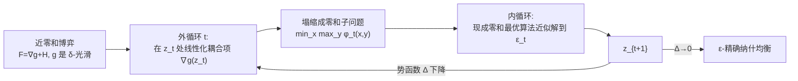

# Monotone Near-Zero-Sum Games: A Generalization of Convex-Concave Minimax

**会议**: ICLR 2026  
**OpenReview**: [https://openreview.net/forum?id=rAeAKiy116](https://openreview.net/forum?id=rAeAKiy116)  
**代码**: [https://github.com/riekenluo/Monotone_Near_Zero_Sum_Games](https://github.com/riekenluo/Monotone_Near_Zero_Sum_Games)  
**领域**: optimization / 凸优化 / 博弈论 / 极小极大优化  
**关键词**: 单调博弈、近似零和博弈、凸-凹极小极大、纳什均衡、梯度复杂度、黑盒规约  

## 一句话总结
本文定义了介于单调零和与一般和之间的新博弈类——**单调 $\delta$-近零和博弈**，并提出 ICL 算法把它黑盒规约为一串零和子问题求解，在博弈"足够接近零和"时首次把非零和博弈的梯度复杂度从 $O(L/\min\{\mu,\nu\})$ 加速到接近零和最优的 $O(L/\sqrt{\mu\nu})$。

## 研究背景与动机

**领域现状**：在紧致凸策略空间上的**单调博弈**是博弈论里少数计算可解的类。最近十年极小极大优化（Lin et al. 2020、Kovalev & Gasnikov 2022、Lan & Li 2023 等）把**单调零和博弈**（即凸-凹极小极大）的梯度复杂度做到了 minimax 最优的 $O\!\left(\frac{L}{\sqrt{\mu\nu}}\log\frac{D^2}{\varepsilon}\right)$，其中 $\mu,\nu$ 是两个玩家的强凸/强凹模数、$L$ 是光滑度、$D$ 是直径。

**现有痛点**：单调**一般和**（general-sum）博弈的复杂度却一直停在 Tseng (1995)、Nemirovski (2004) 的老界 $O\!\left(\frac{L}{\min\{\mu,\nu\}}\log\frac{D^2}{\varepsilon}\right)$。当两个玩家条件数差异大（$\mu\ll\nu$）时，$\sqrt{\mu\nu}$ 远大于 $\min\{\mu,\nu\}$，所以零和与一般和之间存在巨大的理论鸿沟，几十年没人填上。

**核心矛盾**：真实博弈往往**不是严格零和**——下注网站抽佣金、第三方居间收经纪费、竞争中夹带少量合作激励（半合作博弈），都需要放松零和假设。但一旦离开零和，加速技巧就失效：零和的最优算法靠 Catalyst 正则化平滑，可一旦加进正则项，非零和问题就退化成 Stackelberg 博弈，其解会显著偏离纳什均衡，平滑技巧无法直接照搬。

**本文目标**：找一个介于零和与一般和之间的中间类，既能覆盖上述带"小扰动"的实际场景，又能复用零和的快算法，从而部分弥合这道鸿沟。

**核心 idea**：① **用一个光滑参数 $\delta$ 度量博弈离零和有多近**——把效用分解成"零和部分 $h$ + 耦合部分 $g$"，令 $g$ 是 $\delta$-光滑，$\delta=0$ 退化为零和、$\delta=L$ 退化为一般和，中间连续插值；② **迭代线性化耦合项**，把近零和博弈黑盒规约成一串零和子问题，每个子问题直接喂给现成的零和最优算法当 oracle 求解。

## 方法详解

### 整体框架

ICL（Iterative Coupling Linearization，迭代耦合线性化）是一个**外循环 + 内循环**的黑盒规约框架。把博弈算子写成 $F=\nabla g + H$（$g$ 是联合凸的耦合部分、$H$ 是凸-凹零和部分对应的算子），外循环在当前点 $z_t$ 处把"难啃的"耦合项 $g$ 一阶线性化，使整个子问题塌缩成一个标准的强单调**零和**鞍点问题 $\min_x\max_y \varphi_t(x,y)$；内循环用任意现成的零和最优算法把这个子问题近似解到精度 $\varepsilon_t$，得到 $z_{t+1}$，再迭代。整个过程的"黏合剂"是一个势函数 $\Delta(z)$：把它降到 0 等价于找到纳什均衡。

### 关键设计

**1. 近零和参数 $\delta$：用一个标量量化"离零和有多远"。** 论文把两玩家效用 $u_1,u_2$ 重写成对称分解 $g=-\tfrac12(u_1+u_2)$、$h=\tfrac12(-u_1+u_2)$，于是 $u_1=-g-h$、$u_2=-g+h$。这里 $h$ 是天然的凸-凹零和部分（满足 Assumption 1：$h-\tfrac\mu2\|x\|^2$ 对 $x$ 凸、$h+\tfrac\nu2\|y\|^2$ 对 $y$ 凹），$g$ 是联合凸的耦合部分（Assumption 2）。新增的 **Assumption 3** 只要求 $g$ 是 $\delta$-光滑（$\delta\in[0,L]$）。当 $\delta=0$ 时 $g$ 是仿射的、博弈退化为零和；$\delta=L$ 时退化为任意一般和。这个单参数刻画的妙处在于它**只约束耦合项的光滑度而不约束其强度**，于是"近零和"成了一个可连续调节、可被算法显式利用的结构量。

**2. 势函数 $\Delta(z)$：把"找均衡"翻译成"最小化一个可分解的标量函数"。** 论文定义
$$\Delta(z)=\max_{\tilde z}\Big[\underbrace{g(z)-g(\tilde z)}_{\text{联合凸耦合}}+\underbrace{h(x,\tilde y)-h(\tilde x,y)}_{\text{凸-凹零和}}\Big]\ge 0,$$
并证明（Prop. 3–4）在单调博弈中 $z^*$ 是纳什均衡当且仅当 $\Delta(z^*)=0$，且 $2\Delta(z)$ 上界控制了两玩家的总后悔。关键在于 $\Delta$ 干净地**拆成一个联合凸块和一个凸-凹块**——前者对应 $g$、后者对应 $h$。这就给"只线性化耦合项、保留零和项"提供了正确的下手位置：零和块本来就是快算法擅长的，需要被"驯服"的只有联合凸的耦合块。

**3. 耦合线性化：把非零和子问题塌缩成零和鞍点。** 在第 $t$ 步，ICL 只把 $\Delta$ 里的耦合项 $g$ 在 $z_t$ 处做一阶展开 $\langle\nabla g(z_t),\,z-\tilde z\rangle$，再配上一个邻近正则 $\tfrac{1}{2\eta_t}(\|z-z_t\|^2-\|\tilde z-z_t\|^2)$，零和项 $h$ 原样保留。这个 min-max 问题能完全解耦成两个独立子问题，再由 Sion 极小极大定理统一成单一鞍点目标
$$\varphi_t(x,y)=\langle\nabla_x g(z_t),x\rangle+\tfrac{1}{2\eta_t}\|x-x_t\|^2+h(x,y)-\langle\nabla_y g(z_t),y\rangle-\tfrac{1}{2\eta_t}\|y-y_t\|^2.$$
线性项 + 二次邻近项都是简单可加的，所以 $\varphi_t$ 仍是 $\mu,\nu$-强凸强凹的标准**零和**鞍点问题——**任何**零和最优算法（论文实验用 Lifted Primal-Dual）都能当黑盒 oracle 直接解，规约由此完成。

**4. 下降引理 + 步长选取：把 $\delta$ 转化为收敛速度。** 核心是 Lemma 5（下降引理）：当步长 $\eta_t\le 1/\delta$ 时，$\left(\tfrac{1}{2\eta_t}+\tfrac{\min\{\mu,\nu\}}{2}\right)\|z_{t+1}-z^*\|^2\le \tfrac{1}{2\eta_t}\|z_t-z^*\|^2+\varepsilon_t$。这里步长被 $\delta$ 卡住——博弈越接近零和（$\delta$ 越小），就能用越大的步长、外循环收敛越快。取 $\eta=\min\{1/\delta,\,1/\min\{\mu,\nu\}\}$，外循环只需 $\tilde O$ 个迭代，内循环每步复杂度由零和算法给出，组合得**主定理**总梯度复杂度
$$\tilde O\!\left(\Big(\frac{L}{\sqrt{\mu\nu}}+\frac{L}{\min\{\mu,\nu\}}\cdot\min\Big\{1,\sqrt{\tfrac{\delta}{\mu+\nu}}\Big\}\Big)\log^2\frac{D^2}{\varepsilon}\right).$$
$\delta=0$ 时第二项消失、恢复零和最优率 $O(L/\sqrt{\mu\nu})$；当 $\min\{\mu,\nu\}+\delta=o(\max\{\mu,\nu\})$ 时严格优于 Tseng (1995) 的 $O(L/\min\{\mu,\nu\})$——**这是非零和类几十年来复杂度上界第一次被改进**。论文还把结果推广到非强单调情形（Cor. 9）以及带"凸重构"技巧的正则矩阵博弈/半合作博弈应用。

## 实验关键数据

实验目的是**验证理论而非刷 SOTA**：取 Example 1 的"带交易费矩阵博弈"，$n=m=10000$、$\mu=10^{-4}$、$\nu=1$、$\varepsilon=10^{-7}$，稀疏随机矩阵 $\|M\|=1$，交易费 $\rho$ 从 0% 扫到 0.18%。ICL 内循环用 Lifted Primal-Dual，对比 VI 经典方法 OGDA 与 EG。

### 主实验：收敛所需梯度查询次数（单位千次，2-sigma / 10 次独立运行）

| 方法 | $\rho=$0.00% | 0.03% | 0.06% | 0.09% | 0.12% | 0.15% | 0.18% |
|------|------|------|------|------|------|------|------|
| **ICL（本文）** | **9.1** | **22.6** | **42.2** | **65.0** | **75.7** | 113.7 | 123.8 |
| OGDA (Popov 1980) | 93.9 | 93.9 | 93.9 | 93.9 | 93.9 | 94.0 | 94.0 |
| EG (Korpelevich 1976) | 132.9 | 132.9 | 132.9 | 132.9 | 132.9 | 132.9 | 132.9 |

### 关键发现

- **越接近零和越快**：ICL 的查询次数随交易费 $\rho$ 单调上升（9.1k→123.8k），$\rho=0$ 纯零和时只需 9.1k，比 OGDA 快 10 倍以上，印证主定理里 $\min\{1,\sqrt{\delta/(\mu+\nu)}\}$ 项。
- **VI 方法吃不到近零和红利**：OGDA/EG 的查询次数几乎与 $\rho$ 无关（恒定在 ~94k / ~133k），因为它们直接对算子 $F$ 做 VI，看不到零和结构。
- **临界点与理论吻合**：当 $\rho\le 0.12\%$ 时 ICL 严格快于 OGDA；而 Example 1 理论预测的加速条件正是 $\rho\|\mathrm{abs}(M)\|\ll\sqrt{\mu\nu}=1\%$，实验临界值落在该量级内。

## 亮点与洞察

- **一个标量参数撑起一整个新问题类**：用 $\delta$（耦合项光滑度）做插值轴，让"近零和"从一个模糊的直觉变成可证明、可利用的连续结构，$\delta=0/L$ 两端干净退化，理论与应用同时受益。
- **黑盒规约的工程价值**：ICL 不发明新内核，而是把零和领域所有现成最优算法当 oracle 复用——零和算法只要将来更快，近零和也自动变快，方法天然"向前兼容"。这也避开了 Catalyst 正则化在非零和退化成 Stackelberg 的陷阱。
- **凸重构技巧扩大覆盖面**：对耦合项非联合凸的正则矩阵博弈，通过重新分配二次项把问题变回可用，使"带交易费的下注/居间博弈""竞争为主夹带小合作的半合作博弈"等真实场景都被纳入，理论动机和应用动机互相支撑。

## 局限与展望

- **复杂度里有 $\log^2(D^2/\varepsilon)$ 的双对数**，比零和的单对数多一个 log 因子，能否消掉是开放问题。
- **缺下界**：新类没有匹配的下界，证下界可能需要构造非二次函数这类困难工具，何况一般和类本身的下界至今与上界有大鸿沟。
- **仅限两玩家**：多玩家近零和是高度非平凡的推广——三玩家零和本质上不比两玩家一般和容易，连零和的快率都还没推广到多玩家，作者把它留作未来工作。
- 实验规模较小、只覆盖一个应用，更多近零和矩阵博弈/半合作场景的实证仍待补充。

## 相关工作与启发

本文站在两条线交汇处：一条是**极小极大优化**（Nesterov 2005、Nemirovski 2004、Chambolle & Pock 2011、Lin et al. 2020、Kovalev & Gasnikov 2022、Lan & Li 2023），把零和复杂度推到 minimax 最优；另一条是**单调博弈/变分不等式**（Rosen 1965、Tseng 1995）给出一般和的老界。本文的贡献是在两者之间架桥。势函数分解 + 耦合线性化的思路也呼应了变分不等式与半合作博弈（Halpern & Rong 2013、Chen et al. 2017）的传统。**启发**：当一个"困难类"与一个"容易类"之间存在复杂度鸿沟时，引入一个度量"离容易类多近"的结构参数 + 把困难部分迭代线性化成容易子问题的黑盒规约，是一种通用且可复用的加速范式，未必只适用于博弈。

## 评分
- **新颖性**: ⭐⭐⭐⭐⭐ 定义全新的近零和博弈类并首次改进非零和几十年的复杂度上界，问题与方法都有原创性。
- **实验充分度**: ⭐⭐⭐ 作为纯理论论文，实验只为验证理论、规模与场景偏小，但与理论预测高度吻合，达到目的。
- **写作质量**: ⭐⭐⭐⭐ 分解记号、势函数、规约逻辑层层递进，主定理与退化情形交代清晰。
- **价值**: ⭐⭐⭐⭐ 弥合零和与一般和鸿沟的第一步，黑盒规约可随零和算法进步自动受益，对优化与博弈论社区有持久参考价值。
