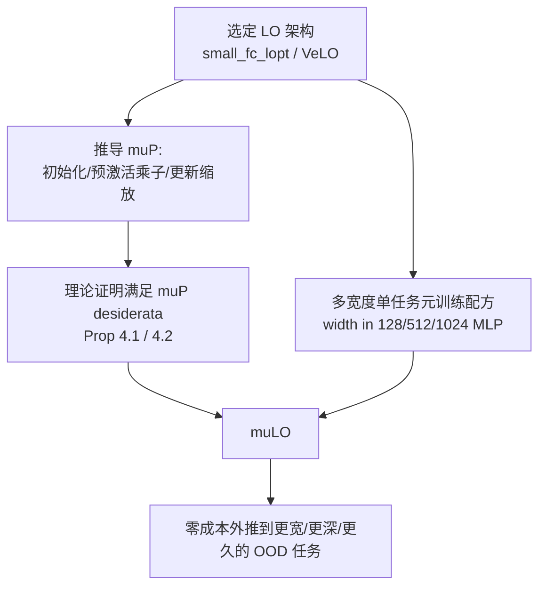

# $\mu$LO: Compute-Efficient Meta-Generalization of Learned Optimizers

**会议**: ICLR 2026  
**OpenReview**: [https://openreview.net/forum?id=f8z2bzOLK2](https://openreview.net/forum?id=f8z2bzOLK2)  
**代码**: [https://github.com/bentherien/mu_learned_optimization](https://github.com/bentherien/mu_learned_optimization)  
**领域**: 优化 / 学习优化器 / 元学习  
**关键词**: 学习优化器(Learned Optimizer)、最大更新参数化($\mu$P)、元泛化、超参数迁移、宽度外推  

## 一句话总结
本文为两种 SOTA 学习优化器（small_fc_lopt 与 VeLO）推导了最大更新参数化（$\mu$P），并配上一套低成本的"多宽度单任务"元训练配方，使得只在小 MLP 上元训练的优化器，能在零额外算力开销下泛化到远超训练规模的更宽、更深、训练更久的未见任务。

## 研究背景与动机
**领域现状**：学习优化器（Learned Optimizers, LOs）用小神经网络替代手工设计的 Adam/SGD，理论上能大幅压缩神经网络的训练 wall-clock 时间。最有名的 VeLO 用了 4000 TPU·月的元训练，在无需调参的前提下超过精调的手工优化器。

**现有痛点**：即便是 VeLO 这样的重量级 LO，也存在严重的**元泛化**（meta-generalization）短板——当被用于优化比元训练时见过的网络**更宽、更深**，或训练**步数更长**的任务时，性能急剧崩塌甚至发散。元训练任务分布天然受限于"可负担的算力"，而下游任务的组合（架构×数据集×目标×规模）是组合爆炸的，靠"把所有规模都塞进元训练分布"的暴力路线被证明不可行（4000 TPU·月仍未解决宽度泛化）。

**核心矛盾**：元训练必须在小任务上做（可负担），但部署要在大任务上（实用）；而标准参数化（Standard Parametrization, SP）下，优化器在小任务上学到的更新规则无法随宽度正确缩放，导致大网络的预激活值爆炸、训练发散。

**本文目标**：把"超参数迁移"领域的 $\mu$P 思想搬到学习优化器上，回答两个问题——现有 LO 架构是否兼容 $\mu$P？在 $\mu$P 下元训练 LO 能否改善元泛化？

**核心 idea**：**用 $\mu$P 把"宽度"这个分布偏移从根上消掉**。$\mu$P（最大更新参数化）是 Yang et al. 提出的、唯一一种让每层都稳定学习特征的 abc-参数化，原本用于 Adam/SGD 的零样本超参迁移。本文把它推广到 LO 的更新公式上，让学习优化器在小宽度上学到的行为可以"免费"外推到大宽度。

## 方法详解

### 整体框架
方法由两部分构成：(1) **$\mu$-参数化的推导**——针对 LO 特有的更新公式（magnitude/direction + tensor-level 学习率），重新设计优化对象（optimizee）网络的初始化方差、前向预激活乘子、以及优化器更新的缩放规则，并从理论上证明满足 $\mu$P desiderata；(2) **低成本元训练配方**——在多个宽度的单一任务（MLP 图像分类）上做 FLOP-matched 的元训练。两者结合，使 $\mu$LO 在元训练后即可零成本迁移到大任务。

### 关键设计
**1. 为 LO 更新公式定制的 $\mu$ 参数化：把"宽度依赖"塞进三处缩放。** $\mu$P 的本质是让任意宽度 $h$ 下每层都"恰好最大程度地学习特征"，这要求对每个权重矩阵 $W \in \mathbb{R}^{n\times m}$ 按它是隐藏层、输入层还是输出层区别对待（依据 $n$=FAN_OUT、$m$=FAN_IN 对宽度的渐近依赖）。具体地，隐藏/输入层权重初始化为 $\mathcal{N}(0, \tfrac{1}{\text{FAN\_IN}})$，输出层初始化为 $\mathcal{N}(0,1)$ 并在前向时把其预激活乘以 $\tfrac{1}{\text{FAN\_IN}}$。最关键的一步是把 LO 的更新公式本身重写——原始 LO 对每个参数输出 magnitude $m$ 和 direction $d$，更新为 $w_t = w_{t-1} - \lambda_W \alpha_1 d\exp(\alpha_2 m)$；本文给隐藏层的更新额外乘上 $\tfrac{1}{\text{FAN\_IN}}$：

$$w_t = \begin{cases} w_{t-1} - \dfrac{1}{\text{FAN\_IN}}\big(\lambda_{W_l}\alpha_1 d\exp(\alpha_2 m)\big) & W_l \text{ 是隐藏层} \\ w_{t-1} - \lambda_{W_l}\alpha_1 d\exp(\alpha_2 m) & \text{其他} \end{cases}$$

这一步把宽度依赖直接编码进 LO 的输出，使得元训练时在小宽度学到的 $m,d$ 行为能正确地随宽度缩放，从而避免大网络预激活爆炸。

**2. 理论保证：证明两种 SOTA LO 架构都满足 $\mu$P desiderata。** 本文并不止于"工程上加缩放因子"，而是把 small_fc_lopt（命题 4.1）和 VeLO（基于 LSTM 生成参数，命题 4.2）分别证明：在优化对象的参数与输入数据"对齐"导致大数定律（LLN）缩放的假设下，上述初始化 + 预激活乘子 + 更新缩放足以构成一个合法的最大更新参数化。这把 LO 从"经验调出来的黑盒"提升为"有迁移理论支撑的优化器"，也是 $\mu$LO 能宣称"宽度外推有理论保证"的根基（而深度/长训练的收益则明确标注为纯经验观察）。

**3. 多宽度单任务元训练配方：用极少算力换强泛化。** 与 $\mu$-transfer 里"在小代理任务上调超参再迁移"不同，LO 通常需要在一个任务分布上元训练。本文对比了两种配方：$\mu$LO$_S$（只在 width=128 的单一 MLP ImageNet 任务上元训练）与 $\mu$LO$_M$（在 width $\in\{128,512,1024\}$ 三个宽度的 MLP 任务上元训练）。实验发现 $\mu$LO$_M$ 在更宽、更长（5000 步）的任务上明显优于 $\mu$LO$_S$，于是把"多宽度"作为配方的固定组件。整套配方极其廉价——$\mu$LO$_M$ 仅用 **100 GPU·小时**元训练，却能稳定训练宽达 8192 的 MLP（对照 8B 参数模型常用 width=4096），与 VeLO 的 4000 TPU·月形成鲜明对比。

## 实验关键数据
评测套件含 35 个任务，覆盖 CIFAR-10/ImageNet 上的 MLP 与 ViT 图像分类、以及 LM1B 上的 decoder-only Transformer 语言建模，系统性地变化宽度、深度、图像尺寸与训练步数。所有 LO 仅在 MLP 任务上元训练；手工优化器 AdamW / $\mu$Adam 则对**每个任务**做 >500 配置的网格调参。元训练 inner-problem 长度为 1000 步，超过即视为分布外（OOD）。

### 主实验表格（平均排名，越低越好，6 个优化器内排名）

| 优化器 | 1k步 Large | 1k步 XL | 1k步 XXL | 3k步 XL | 5k步 XL | 5k步 XXL |
|---|---|---|---|---|---|---|
| AdamW（每任务精调） | 3.00 | 3.60 | 4.40 | 2.60 | 2.40 | 3.80 |
| $\mu$Adam（每任务精调） | 3.40 | 2.20 | 2.20 | 2.40 | 2.60 | 2.60 |
| VeLO$_M$（SP 基线） | 4.60 | 4.00 | 5.00 | 5.40 | 5.40 | 5.80 |
| LO$_M$（SP 基线） | 5.60 | 5.40 | 5.60 | 4.80 | 4.80 | 5.20 |
| **$\mu$VeLO$_M$（本文）** | 2.60 | **1.60** | 1.80 | 2.00 | **1.40** | 2.00 |
| **$\mu$LO$_M$（本文）** | **1.80** | 2.00 | **2.00** | **1.60** | 2.20 | **1.60** |

两个 $\mu$LO 在几乎所有列上稳居第一、第二名；SP 学习优化器基线（VeLO$_M$/LO$_M$）排名最差，常在大宽度任务上彻底无法优化；精调手工优化器占据三四名。

### 消融实验表格（元训练分布配方，最终训练 loss 趋势）

| 配方 | width 增大时 1000 步 | 5000 步（OOD 长训练） |
|---|---|---|
| $\mu$LO$_S$（单宽度 128） | 随宽度尚可但弱于 $\mu$LO$_M$ | 明显落后 |
| **$\mu$LO$_M$（多宽度 128/512/1024）** | 随宽度平滑下降，更优 | 更优，长训练泛化更好 |
| SP LO$_M$（对照） | width>2048 后发散 | 发散 |

### 关键发现
- **宽度外推（核心，有理论支撑）**：$\mu$LO 在宽达 8192 的 MLP、4096 的 LM/ViT 上训练 5000 步（5×元训练 unroll）仍平滑降 loss；SP LO 普遍在 1000 步内发散或停滞。$\mu$LO 甚至超过对每个任务精调 >500 次的 AdamW/$\mu$Adam。
- **深度外推（意外，纯经验）**：把层数从 3 加到 16（宽度仍 1024），$\mu$LO$_M$/$\mu$VeLO$_M$ 稳定优化，而 LO$_M$ 在深 MLP 上立即发散、VeLO$_M$ 在 ViT/Transformer 上发散——尽管 $\mu$P 理论只覆盖宽度。
- **长训练外推（意外，纯经验）**：训练 25000 步（25×元训练最长 unroll），$\mu$LO 稳定降 loss，SP LO 则失败/不稳/8000 步后发散。
- **预激活稳定性验证**：$\mu$LO 与 $\mu$Adam 的逐坐标预激活标准差在各宽度下保持稳定，而 SP 模型的预激活会爆炸，从机理上解释了泛化差异。
- **零额外成本**：以上全部收益相对 SP LO **不增加任何元训练或推理算力**。

## 亮点与洞察
- **把"超参数迁移"和"元泛化"两个看似不同的问题接上**：$\mu$P 原本解决"手工优化器超参随宽度迁移"，本文洞察到 LO 的"宽度元泛化"本质上是同一个缩放问题，于是把 $\mu$P 从超参迁移借力到学习优化器，理论与工程都很自洽。
- **理论 + 经验双轮驱动**：对 small_fc_lopt 和 VeLO 都给出 $\mu$P 合法性证明（命题 4.1/4.2），同时诚实地把深度、长训练的收益标注为"无理论、纯经验"，分寸把握得当。
- **算力对比极具冲击力**：100 GPU·小时 vs VeLO 的 4000 TPU·月，却在大 OOD 任务上反超精调手工优化器，说明"对的参数化"比"暴力堆算力"更关键。
- **意外的深度/长训练泛化**给出可检验假设——$\mu$P 对优化对象激活的稳定作用，可能是宽度之外泛化的共同来源，为后续理论留了钩子。

## 局限与展望
- **元训练任务单一**：只在 MLP 图像分类上元训练，未覆盖 CNN/Transformer 等更多架构的元训练分布，泛化结论的边界仍待拓展。
- **规模上限受学术算力约束**：未评测宽于 8192（MLP）/ 3072·12288（Transformer hidden/FFN）的模型。
- **缺少 oracle 基线**：未加入"在每个宽度都重新扫超参的 SP AdamW"作为更强对照。
- **参数化选择仍开放**：$\mu$P 未必是元训练 LO 的最优参数化（Everett et al. 发现带层级学习率的 SP 在某些设置下胜过 $\mu$P），未来值得比较 CompleteP、单位缩放等其他可迁移参数化对 LO 的影响。

## 相关工作与启发
- **学习优化器谱系**：Andrychowicz 2016 → Metz 2019/2022a(small_fc_lopt) → Metz 2022b(VeLO)，本文直接在后两者上做 $\mu$P 改造。
- **$\mu$P 与超参迁移**：Yang & Hu 2021 提出 $\mu$P，Yang et al. 2022 实现 Adam/SGD 的零样本超参迁移，Yang 2024 的 Depth-$\mu$P 处理深度（但仅适用 block-depth=1 的残差网，故本文不采用）；Dey 2025 的 CompleteP 同时迁移深度与宽度。
- **启发**：本文示范了"把成熟的缩放理论迁移到元学习对象上"是一条高性价比路线——与其在元训练阶段堆算力覆盖所有规模，不如从参数化层面消除分布偏移。对任何"小规模训练→大规模部署"的元学习/AutoML 组件（如学习的学习率调度器、学习的数据增强策略）都有借鉴价值。

## 评分
- **新颖性**: ⭐⭐⭐⭐ —— 首次为 SOTA 学习优化器推导并证明 $\mu$P，把超参迁移与 LO 元泛化优雅地接上，思路清晰且填补了"宽度元泛化"这一长期未解难题。
- **实验充分度**: ⭐⭐⭐⭐ —— 35 任务、3 个泛化轴（宽/深/长）、1120 个网络、5 seeds，且对手工基线做 >500 次精调对照，结论扎实；扣分在元训练分布单一、未测更大规模。
- **写作质量**: ⭐⭐⭐⭐ —— 问题动机、理论命题、经验发现层次分明，对"有理论 vs 纯经验"的边界标注诚实。
- **价值**: ⭐⭐⭐⭐ —— 用 100 GPU·小时换来反超精调 Adam 的大规模泛化，且零额外开销，为低成本可泛化学习优化器指出务实路径，落地价值高。

<!-- RELATED:START -->

## 相关论文

- [\[ICLR 2026\] Celo2: Towards Learned Optimization Free Lunch](celo2_towards_learned_optimization_free_lunch.md)
- [\[ICLR 2026\] Binomial Gradient-Based Meta-Learning for Enhanced Meta-Gradient Estimation](binomial_gradient-based_meta-learning_for_enhanced_meta-gradient_estimation.md)
- [\[ICLR 2026\] Towards Dynamic Interleaving Optimizers](towards_dynamic_interleaving_optimizers.md)
- [\[ICLR 2026\] Evaluating Data Influence in Meta Learning](evaluating_data_influence_in_meta_learning.md)
- [\[ICLR 2026\] Generalizable Heuristic Generation Through LLMs with Meta-Optimization](generalizable_heuristic_generation_through_llms_with_meta-optimization.md)

<!-- RELATED:END -->
