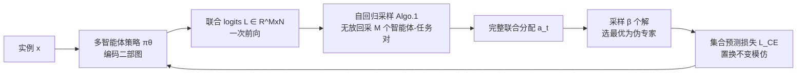

# Multi-Action Self-Improvement for Neural Combinatorial Optimization

**会议**: ICLR 2026  
**OpenReview**: [https://openreview.net/forum?id=6KrETIaOYD](https://openreview.net/forum?id=6KrETIaOYD)  
**代码**: [https://github.com/LTluttmann/macsim](https://github.com/LTluttmann/macsim)  
**领域**: 组合优化 / 神经组合优化 / 多智能体自改进  
**关键词**: 神经组合优化, 自改进, 多智能体, 集合预测损失, 智能体置换对称性, 调度, 路由  

## 一句话总结
MACSIM 把神经组合优化的自改进范式从"单步动作"扩展到"多智能体联合动作",通过并行预测全体智能体-任务分配 + 置换不变的集合预测损失,既显式利用智能体置换对称性提升样本效率与协同能力,又大幅压缩自改进循环里的解生成延迟。

## 研究背景与动机

**领域现状**:端到端构造式神经组合优化(NCO)把 CO 问题建模成序列 MDP,用神经策略逐步构造解。近年的**自改进(self-improvement)**范式成为 SOTA——训练时为每个实例采样大量候选解,挑出最优轨迹当"伪专家",再用模仿学习去逼近它。相比 REINFORCE,它能在动作级训练,从而启用可在每步动态重编码状态的 decoder-only 架构。

**现有痛点**:① **训练昂贵**——每个实例要采样大量候选解,才能抽出一条专家轨迹来更新策略;② **没利用多智能体结构**——在 min-max 路由(多车)、调度(多机)这类需要多个智能体协同的问题里,存在**智能体置换对称性**:不同的智能体-任务分配顺序会得到完全相同的解(图 1)。

**核心矛盾**:自改进用"逐 token 预测"监督单条"最优"轨迹,等于**人为强加了一个任意的智能体顺序**,把其余对称的等价选择当成错误来惩罚。这既降低样本效率,又阻碍模型学到协同行为,损害泛化。

**本文目标**:把自改进扩展到**联合多智能体动作**上,既显式利用对称性,又通过并行生成多智能体动作加速解生成。

**核心 idea**:**多智能体联合策略 + 集合预测损失**——每个决策步一次性预测全体智能体的联合分配,并用对智能体顺序不变的集合损失监督多个等价专家分配。

## 方法详解

### 整体框架
MACSIM 把问题建模成共享奖励的**合作多智能体 MDP**:状态是二部图 $G=\{V,M,E,w\}$(任务 $V$、智能体 $M$、可行分配边 $E$),每一步策略输出的是一个智能体-任务**二部匹配** $a_t=\{a_t^k\}_{k=1}^M$ 而非单个动作。训练沿用两阶段自改进:当前最优策略采 $\beta\gg1$ 个解 → 选最优解的 state-action 对入数据集 → 用集合损失模仿学习更新策略,若验证集提升则替换最优策略。

### 关键设计

**1. 多智能体联合策略:一次前向算出全体兼容度。** 不同于标准自改进假设"每步只有一个最佳动作",MACSIM 学一个直接把状态 $s_t$ 映射到联合分配的策略。它先把二部图编码成智能体嵌入 $H_M\in\mathbb{R}^{M\times d}$ 与任务嵌入 $H_V\in\mathbb{R}^{N\times d}$,再算出兼容度 logits 矩阵 $L\in\mathbb{R}^{M\times N}$,其中 $L_{m,v}$ 表示把任务 $v$ 分给智能体 $m$ 的得分。关键在于:**昂贵的神经策略只跑一次算出 $L$**,后续 $M$ 个动作全靠廉价采样生成,这是相比全自回归模型大幅提速的根源。现有多智能体策略要么只从联合分布采一次(丢掉效率与多步预测增益),要么假设智能体独立、按 marginal 各自采样导致冲突(两个智能体抢同一任务,PARCO 只能事后强行让低概率智能体空等)。

**2. 无冲突的自回归联合采样:用 softmax 分母隐式协同。** 给定 $L$,MACSIM 用链式法则把联合动作分解为顺序采样的无放回过程:$P(a_t\mid L)=\prod_{k=1}^M P(m_{t,k},v_{t,k}\mid a_t^{<k},L)$,每步从当前**可用**智能体-任务对集合 $E_k$ 上按 $P(a_t^k\mid a_t^{<k},L)=\frac{\exp(L_{m_k,v_k})}{\sum_{(m',v')\in E_k}\exp(L_{m',v'})}$ 采样,采完即把对应行列 mask 成 $-\infty$(Algorithm 1)。这个联合 softmax 的**分母依赖所有剩余对**,因此某对 $(m^*,v^*)$ 高 logits 会自动压低其它智能体抢同一任务的概率——协同被天然写进归一化里,无需任何启发式或事后冲突消解。论文证明(Prop.1)该过程是合法概率分布。最终策略写成 $P(\tau\mid s_t;\theta)=\prod_{t=1}^T \pi_\theta(L\mid s_t)\prod_{k=1}^M P(a_t^k\mid a_t^{<k},L)$。

**3. Skip token:允许智能体"等更好的活"。** 强制每步给所有智能体都派活在强耦合问题(如 job-shop,某机器的可用工序随其它机器排产而变)里反而次优。MACSIM 引入一个可学习嵌入 $h_\text{skip}\in\mathbb{R}^d$ 作为透明的"跳过"动作,加进任务嵌入集合 $H_V$,任何智能体任何时刻都能选它来等到下一步(唯一约束:至少一个智能体得选真任务)。每次 skip 给目标值加一个小惩罚,并在训练中**退火趋零**,促使策略随训练越来越倾向直接产出高质量解。

**4. 集合预测损失:从 NLL 到置换不变的 CE 代理。** 朴素的多动作 NLL(式 4)有**梯度冲突**——每一项假设某个分配正确而惩罚其余(包括专家序列里更晚才出现的正确分配)。第一步缓解:固定专家智能体顺序,使选智能体步确定化,把生成过程退化成 **Plackett-Luce 模型**,损失退化为各智能体 marginal 上的 NLL(式 5),消除梯度冲突但仍对专家序列的排列敏感。理想做法是对全部 $M!$ 个顺序平均 PL 损失,但不可行。于是 MACSIM 用一个**代理损失**:放松顺序依赖,把每个智能体-任务对当作独立监督样本,得到对所有智能体求和的交叉熵 $L_\text{CE}=-\sum_{k=1}^M\log\frac{\exp(L_{m_k,v_k})}{\sum_{v'\in V}\exp(L_{m_k,v'})}$(式 6)。其合理性类比 DETR 的二部匹配——先算好预测与真值的匹配,再对每个匹配对独立算损失;由于专家数据本就是合法匹配,无需在损失里再强加单射约束。该代理**置换不变、计算高效**,提供更稳健的训练信号。

## 实验关键数据

在两个调度问题(FJSP 柔性作业车间、FFSP 柔性流水车间)和一个路由问题(min-max 异构容量车辆路由 HCVRP)上评测,对比经典精确/启发式求解器与自改进方法 SLIM。

### 主实验(FJSP,greedy 解码,Obj. 越小越好)

| 方法 | 10×5 Obj./Gap | 20×5 Obj./Gap | 15×10 Obj./Gap | 备注 |
|------|------|------|------|------|
| OR-Tools (CP-SAT) | 96.32 / 0.00% | 188.15 / 0.03% | 143.53 / 0.00% | 每实例 1600–1800s |
| DANIEL (g.) | 106.71 / 10.79% | 197.56 / 5.03% | 161.28 / 12.37% | 神经基线 |
| SLIM (g.) | 103.85 / 7.82% | 194.37 / 3.33% | 154.32 / 7.62% | 标准自改进 |
| **MACSIM (g.)** | **102.21 / 6.12%** | **191.08 / 1.58%** | **149.84 / 4.40%** | 20×5 上接近/超 OR-Tools |

MACSIM 在所有问题与规模上稳定优于神经基线,在 FFSP 上超过所有方法,在 FJSP 上大幅缩小到 OR-Tools 的差距,20×5 实例上甚至反超 OR-Tools。

### 消融实验(Figure 3a / Table 3)

| 消融项 | 结论 |
|--------|------|
| 采样方式 (full vs random/fixed-order) | full(Algo.1 联合采样)在多智能体实例上明显更优,验证自回归联合采样的有效性 |
| Skip token | 大规模实例(协同更难)上收益显著;虽增加生成延迟但大幅提升解质量 |
| 损失函数 | 置换不变的 $L_\text{CE}$ 比 NLL/PL 更稳更快 |

### 关键发现
- **相对 SLIM 的优势随智能体数增长**(Fig.3b):智能体越多,联合预测的协同收益越大。
- **延迟大幅下降**:FFSP 50×4 上 SLIM 生成解约比 MACSIM 慢近 10 倍;MACSIM 构造解所需前向次数只是 SLIM 的一小部分,差距随智能体数继续拉大(Fig.3c)。
- **泛化更好**(Table 2):在小 FJSP 上训练、迁移到更大实例,MACSIM 优于全部神经基线,3 种实例里 2 种超过 OR-Tools——得益于每步重编码状态。

## 亮点与洞察
- **把"对称性"从基线/方差工具升级为生成机制**:POMO/Sym-NCO/DPN 用对称性构造低方差基线,MACSIM 则直接**生成无冲突协同分配**并用集合损失学习,从源头是对称的。
- **一次编码、多步廉价采样**的结构,把自改进里最贵的"采样大量候选解"环节的单解延迟显著压下来,自改进的训练/推理瓶颈同时缓解。
- **借 DETR 的二部匹配视角解释损失合理性**,把"为何能放松单射约束"讲得很干净,是跨领域迁移直觉的好例子。

## 局限与展望
- MACSIM 并非所有神经求解器里最快的——因为像 SLIM 一样做逐步状态重编码,推理比"encode-once"类方法慢,只是换来更好的 OOD 泛化。
- 仅在能转写成"合作多智能体 + 共享奖励 + 顺序无关转移"的二部匹配类问题上验证(调度、min-max 路由),对非合作/异构奖励或无法二部建模的 CO 问题适用性待考。
- Skip token 惩罚退火、$\beta$ 采样规模等超参对性能影响较大,缺少自适应方案。

## 相关工作与启发
- **自改进 NCO**:Pirnay & Grimm (2024)、Corsini et al. (2024) 的 SLIM 是直接对标对象,MACSIM 是其多智能体扩展。
- **对称性利用**:POMO、Sym-NCO(TSP 循环对称构造低方差基线)、DPN(把置换不变基线推广到 min-max VRP)。
- **多智能体策略/冲突消解**:PARCO 事后消冲突、2D-Ptr 单次联合采样——MACSIM 用联合 softmax 在采样过程中天然避冲突。
- **集合预测**:DETR 的二部匹配损失为本文置换不变代理损失提供了理论与直觉支撑。

## 评分
- **新颖性**: ⭐⭐⭐⭐ 把自改进从单动作扩展到多智能体联合动作,集合预测损失 + 无冲突联合采样的组合在 NCO 里是清晰且自洽的新范式。
- **实验充分度**: ⭐⭐⭐⭐ 覆盖调度+路由三类问题、含精确/启发式/神经多类基线、泛化与消融齐全;若再加更大规模与更多非合作问题会更强。
- **写作质量**: ⭐⭐⭐⭐ 动机(对称性矛盾)讲得透,从 NLL→PL→CE 的损失推演层层递进,图 1/2 直观。
- **价值**: ⭐⭐⭐⭐ 同时改善多智能体 CO 的解质量与生成延迟,对调度/路由等实际场景有直接意义,代码开源。

<!-- RELATED:START -->

## 相关论文

- [\[ICLR 2026\] Provable and Practical In-Context Policy Optimization for Self-Improvement](provable_and_practical_in-context_policy_optimization_for_self-improvement.md)
- [\[ICLR 2026\] Neural Multi-Objective Combinatorial Optimization for Flexible Job Shop Scheduling Problems](neural_multi-objective_combinatorial_optimization_for_flexible_job_shop_scheduli.md)
- [\[ICLR 2026\] Toward Principled Flexible Scaling for Self-Gated Neural Activation](toward_principled_flexible_scaling_for_self-gated_neural_activation.md)
- [\[NeurIPS 2025\] Probing Neural Combinatorial Optimization Models](../../NeurIPS2025/optimization/probing_neural_combinatorial_optimization_models.md)
- [\[ICLR 2026\] NExCO: Native Solution Expansion for Diffusion-based Combinatorial Optimization](nexco_native_solution_expansion_for_diffusion-based_combinatorial_optimization.md)

<!-- RELATED:END -->
