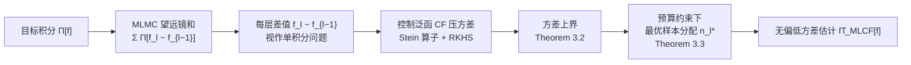

# Multilevel Control Functional

**会议**: ICLR 2026  
**OpenReview**: [https://openreview.net/forum?id=Ahdsg2nkNH](https://openreview.net/forum?id=Ahdsg2nkNH)  
**代码**: 待确认  
**领域**: 蒙特卡洛 / 方差缩减 / 贝叶斯推断  
**关键词**: 控制变量、控制泛函、多层蒙特卡洛、多保真度、Stein 方法、变分推断  

## 一句话总结
本文提出**多层控制泛函（MLCF）**，把非参数 Stein 控制变量（control functionals）嫁接到多层蒙特卡洛（MLMC）的望远镜求和上，在每一层用控制泛函进一步压低相邻保真度模型差值的方差，从而在被积函数与密度光滑、维度不太高时获得比 MLMC 更快的收敛率，并给出了最优样本分配与变分推断扩展。

## 研究背景与动机
- **领域现状**：科学计算与机器学习中大量任务归结为估计难解积分 $\Pi[f]=\int_{\mathcal X} f(x)\pi(x)\,dx$（归一化常数、贝叶斯后验期望、ELBO 梯度等）。标准蒙特卡洛（MC）以 $O(n^{-1/2})$ 收敛、方差大；当被积函数来自昂贵模拟器时，单次评估成本极高，要达到目标精度的总开销往往难以承受。
- **现有痛点**：两条降本主线各有短板。① **控制变量（CV）**——尤其是基于 RKHS 的非参数 Stein 控制泛函（CF）——能在单一积分问题上把方差压得很低，但只作用于"最高保真度"那一层，没有利用模型可调精度的层级结构。② **多层蒙特卡洛（MLMC）**——用一串由粗到细的近似 $f_0,\dots,f_L$ 构造望远镜和 $\Pi[f]=\sum_l \Pi[f_l-f_{l-1}]$，把 $f_{l-1}$ 当作 $f_l$ 的控制变量；但它对每个差值 $f_l-f_{l-1}$ 仍只用朴素 MC 估计，**没有去最小化差值本身的方差**。
- **核心矛盾**：CF 有强力的方差缩减但缺多保真度结构；MLMC 有多保真度结构但每层方差未被进一步压缩。已有的"多层控制变量"工作（如把 Bayesian quadrature 套进 MLMC、用辅助扩散问题或低秩近似做控制变量）大多绑定特定 kernel-分布对或特定 PDE，且无法处理贝叶斯推断里常见的**未归一化密度**，需要领域专家知识。
- **本文目标**：造一个**普适**的方差缩减器，既吃多保真度的层级红利，又在每层施加 Stein 控制变量，且不要求密度归一化、不依赖领域专家。
- **核心 idea**：**在 MLMC 望远镜和的每一层，把该层差值 $f_l-f_{l-1}$ 当成一个独立的单积分问题，用控制泛函再压一遍方差**；再配一个方差上界推导出的最优样本分配，把有限预算按层级"该多采就多采"。

## 方法详解

### 整体框架
MLCF 把 MLMC 的"望远镜求和"和 CF 的"每层方差缩减"叠在一起：对积分 $\Pi[f]=\sum_{l=0}^{L}\Pi[f_l-f_{l-1}]$（约定 $f_{-1}:=0$），不再像 MLMC 那样对每个 $\Pi[f_l-f_{l-1}]$ 用朴素 MC，而是在每层套一个控制泛函估计量 $\hat\Pi_{\mathrm{CF}}^{n_l-m_l}[f_l-f_{l-1}]$。整套估计量写成

$$\hat\Pi_{\mathrm{MLCF}}[f]=\sum_{l=0}^{L}\hat\Pi_{\mathrm{CF}}^{n_l-m_l}[f_l-f_{l-1}].$$

每层把 $n_l$ 个样本拆成两份：$m_l$ 个用来学控制泛函 $s_l-\Pi[s_l]$，剩下 $n_l-m_l$ 个用来做无偏估计。整条流程的关键在于"层级结构 → 每层方差缩减 → 最优预算分配"三者闭环。

### 关键设计

**1. 逐层控制泛函：把"差值"再压一遍方差。** MLMC 已经用 $f_{l-1}$ 当 $f_l$ 的控制变量，但差值 $f_l-f_{l-1}$ 仍有残余方差。MLCF 对每一层差值施加 Langevin Stein 算子 $\mathcal S_\Pi[u](x):=\nabla_x\cdot u(x)+u(x)\cdot\nabla_x\log\pi(x)$ 构造的零均值候选函数族，并在 RKHS（Stein kernel $k_0^l$）里解一个约束最小二乘，得到该层的控制泛函 $s_l-\Pi[s_l]$。整体估计量为
$$\hat\Pi_{\mathrm{MLCF}}[f]=\sum_{l=0}^{L}\frac{1}{n_l-m_l}\sum_{i=m_l+1}^{n_l}\big(f_l(x_{(l,i)})-f_{l-1}(x_{(l,i)})-(s_l(x_{(l,i)})-\Pi[s_l])\big).$$
关键好处是只需 $\pi$ 光滑且 $\pi(x)>0$、$\nabla\log\pi$ 可逐点求值——这正好覆盖贝叶斯推断中**只知道未归一化密度**的场景，因为 Stein 算子用的是 score 而非归一化常数。Figure 1 的直观图显示：经 MLCF 处理后，各层差值曲线变得"更平、更贴近其真值红线"，方差被显著拉低。

**2. 方差上界 + 收敛率分析：解释为什么比 MLMC 快。** 在域正则性、密度/核光滑性（$\pi\in C^{a+1}$、$k_l\in C_2^{b_l+1}$）与样本拟充满性（fill-distance $h_l\le q\,m_l^{-1/d}$）等假设下，给出方差上界
$$\mathbb V[\hat\Pi_{\mathrm{MLCF}}[f]]\le\sum_{l=0}^{L}\frac{\big(r_l\,m_l^{-\tau_l/d}\,\|f_l-f_{l-1}\|_{\mathcal H_+^l}\big)^2}{n_l-m_l},\quad \tau_l:=\min\{a,b_l\}.$$
由于 MLCF 无偏，MSE 即方差。若各层 $m_l/n_l$ 比例固定，则每层收敛率为 $O(n^{-\tau_l/d-1/2})$，**严格快于 MLMC 每层的 $O(n^{-1/2})$**——多出的 $-\tau_l/d$ 来自控制泛函对光滑函数的逼近能力。代价是这一加速依赖低/中维度（$d$ 进入指数 $\tau_l/d$，高维时红利消失）与被积函数/密度的光滑性。

**3. 预算约束下的最优样本分配。** 给定总预算 $\sum_l C_l n_l=T$（$C_l$ 是第 $l$ 层单次评估成本），最小化方差上界得到闭式最优分配
$$n_l^{\mathrm{MLCF}}=R\,(r_l\|f_l-f_{l-1}\|_{\mathcal H_+^l})^{\frac{d}{\tau+d}}\,C_l^{-\frac{d}{2\tau+2d}},$$
其中 $R$ 由预算归一化决定。直觉很顺：**评估越贵的层（$C_l$ 大）采样越少；差值范数越小的层采样越少**——通常高层既贵、差值又小，于是样本量随层级递减。维度越低、$\tau$ 越大时分配对 $C_l$、$\|f_l-f_{l-1}\|$ 越不敏感，对高层的"惩罚"减弱。把最优分配回代上界即得整体 $O(T^{-(2\tau+d)/d})$ 级的预算-误差关系，并能逐项与单层 CF 的上界比较、论证 $B_{\mathrm{MLCF}}<B_{\mathrm{CF}}$。

**4. 变分推断扩展（MLCFRG）。** 把 MLCF 套进重参数化梯度估计：VI 中要估计 ELBO 梯度 $\nabla_\lambda\mathcal L=\sum_l\Pi[f_{\lambda_l}-f_{\lambda_{l-1}}]$（Fujisawa & Sato 的 MLRG 形式）。原来用 MC 得到 MLMCRG，本文换成控制泛函得到 **MLCFRG**：$\hat\nabla^{\mathrm{MLCFRG}}_{\lambda_L}=\sum_l\hat\Pi_{\mathrm{CF}}[f_{\lambda_l}-f_{\lambda_{l-1}}]$。更妙的是 Proposition 3.4 给出 SGD 下的**简化递推**
$$\lambda_{L+1}=\lambda_L+\tfrac{\alpha_L}{\alpha_{L-1}}(\lambda_L-\lambda_{L-1})-\alpha_L\,\hat\Pi_{\mathrm{CF}}[f_{\lambda_L}-f_{\lambda_{L-1}}],$$
把计算从 $O(d\sum_l l\,n_l^3)$ 降到 $O(d\,n_L^3)$、内存从 $O(d\sum_l l\,n_l^2)$ 降到 $O(d\,n_L^2)$（$d$ 为网络参数量），只需保留最高层，使方法在贝叶斯神经网络上可落地。

## 实验关键数据

### 主实验设置与对比

| 实验 | 任务 | 对比方法 | 结论 |
|------|------|----------|------|
| Synthetic（Oates 2019 变体） | $[0,1]^2$ 均匀分布上积分，验证最优样本分配 | MLCF($n^{\mathrm{MLCF}}$)、MLCF($n^{\mathrm{MLMC}}$)、MLMC、CF | MLCF 两种分配都显著优于 MLMC 与 CF（误差对数轴明显低一档） |
| Boundary-value ODE | 一维椭圆 PDE / 随机系数边值问题 | MLCF(QMC/LHS/IID)、MLMC、MLBQ、CF | 同评估成本下 MLCF 最优；实验设计（QMC/LHS）进一步提升 |
| Lotka-Volterra | 真实捕食-被捕食数据的贝叶斯推断（未归一化后验，MCMC 采样） | MLCF、MLMCMC、CF、MCMC | 同预算下 MLCF 全面领先 |
| BNN 变分推断 | wine-quality-red 回归，$d=392/522$ | MLCFRG、MLMCRG、MLMC、MC | MLCFRG 更快收敛到更优 ELBO / 测试对数似然 |

### 关键发现
- **最优分配 vs 借用 MLMC 分配**：样本量小时 MLCF 用 MLMC 的分配 $n^{\mathrm{MLMC}}$ 反而略优（因为 $n^{\mathrm{MLCF}}$ 最小化的是方差上界而非方差本身）；样本量大时 $n^{\mathrm{MLCF}}$ 略胜。实践意义是即便最优分配难算，直接套 MLMC 分配也能拿到大部分收益。
- **普适性**：在 ODE 与 Lotka-Volterra 这两个例子里，论文指出此前的多层控制变量方法"实现非常困难或根本不可行"，而 MLCF 可直接落地。
- **未归一化密度可用**：Lotka-Volterra 用 Stan 的 NUTS 采样、对未归一化后验直接做 MLCF，验证了 Stein 构造对归一化常数的免疫。

## 亮点与洞察
- **一个干净的"嫁接"**：把单积分领域成熟的 CF 与多保真度领域成熟的 MLMC 在望远镜和层面对齐，思路简单却补上了"MLMC 每层差值方差未被压缩"这一直观空白，Figure 1 把动机讲得非常清楚。
- **理论-实践闭环**：方差上界不仅证明收敛率更快，还直接导出预算约束下的闭式样本分配，把"理论加速"翻译成"可执行的采样预算表"。
- **VI 简化递推是工程亮点**：Proposition 3.4 把多层估计塌缩成只依赖最高层的动量式更新，复杂度从随层数线性增长降到常数级，使 MLCF 在高维 BNN 上不再是纸面方法。

## 局限与展望
- **维度诅咒明确写在指数里**：加速量级 $\tau/d$ 随维度 $d$ 增大而衰减，方法定位于"低到中维"问题，高维任务红利有限。
- **依赖光滑性假设**：收敛率证明需要密度与被积函数足够光滑、域满足内锥条件、样本拟充满（quasi-uniform），不光滑或重尾场景外推性未知。
- **每层 $O(m^3)$ 开销**：控制泛函本身有立方成本，本文论证在昂贵被积函数场景下可忽略，但当评估不那么贵时这一成本会变得相关，需配随机优化近似。
- **最优分配需估 RKHS 范数与各层成本**：$n_l^{\mathrm{MLCF}}$ 依赖 $\|f_l-f_{l-1}\|_{\mathcal H_+^l}$ 等难直接获取的量，实践中要靠数据驱动估计；论文也坦言可退而用 MLMC 分配。
- **展望**：作者指出自适应实验设计（adaptive design）是有前景的方向，可与 MLCF 进一步结合。

## 相关工作与启发
- **控制泛函 / Stein 控制变量**（Oates et al. 2017/2019、South et al. 2022、Sun et al. 2023）：MLCF 的"每层方差缩减器"直接来自这一非参数 RKHS 路线，并继承其未归一化密度可用的优点。
- **多层蒙特卡洛**（Giles 2008/2015）：提供望远镜和与多保真度框架，MLCF 视其为"把低保真当控制变量但未压差值方差"的特例。
- **多层 Bayesian quadrature**（Li et al. 2023）：同样想结合 MLMC 与核方法，但绑定特定 kernel-分布对、无法处理未归一化密度，是 MLCF 直接对标并超越的 baseline。
- **多层重参数化梯度 / 变分推断**（Fujisawa & Sato 2021）：MLCFRG 把其 MLRG/MLMCRG 的 MC 估计换成控制泛函，是该线工作的方差缩减升级。
- **启发**：当一个估计问题天然带有"可调精度的层级结构"时，不必在最贵的那一层硬堆样本——先做望远镜分解、再对每个增量单独做方差缩减、最后用方差上界反推预算分配，是一条可迁移到其他昂贵模拟器/多保真度任务的通用配方。

## 评分
- **新颖性**: ⭐⭐⭐⭐ — CF 与 MLMC 的结合在概念上是"对齐两条成熟路线"，单看组件不算颠覆，但补上了 MLMC 每层方差未压的真实空白，并给出无偏性、收敛率、最优分配与 VI 扩展的完整理论包，组合创新扎实。
- **实验充分度**: ⭐⭐⭐⭐ — 从合成、ODE/PDE、真实数据贝叶斯推断到 BNN 变分推断四类任务，覆盖归一化/未归一化、IID/MCMC、积分/梯度多场景，且与 MLMC、MLBQ、CF、MC 等多基线对比；主要以预算-误差曲线呈现，缺更大规模/高维压力测试。
- **写作质量**: ⭐⭐⭐⭐ — 动机图（Figure 1）讲得直观，背景对 CV/CF/MLMC 的铺垫清晰，理论陈述规范；公式密度高、部分推导下放附录，对非该领域读者门槛偏高。
- **价值**: ⭐⭐⭐⭐ — 对科学计算与贝叶斯/变分推断中"昂贵积分 + 可调保真度"的常见场景给出即插即用、可量化收益的方差缩减器，理论与可落地的样本分配/VI 递推兼具，实用价值明确，但受限于低中维与光滑性假设。

<!-- RELATED:START -->

## 相关论文

- [\[ICLR 2026\] Unbiased Gradient Estimation for Event Binning via Functional Backpropagation](unbiased_gradient_estimation_for_event_binning_via_functional_backpropagation.md)
- [\[ICLR 2026\] Conformal Robustness Control: A New Strategy for Robust Decision](conformal_robustness_control_a_new_strategy_for_robust_decision.md)
- [\[ICLR 2026\] Differentiable Model Predictive Control on the GPU](differentiable_model_predictive_control_on_the_gpu.md)
- [\[ICLR 2026\] Dual Optimistic Ascent (PI Control) is the Augmented Lagrangian Method in Disguise](dual_optimistic_ascent_pi_control_is_the_augmented_lagrangian_method_in_disguise.md)
- [\[ICLR 2026\] A Schrödinger Eigenfunction Method for Long-Horizon Stochastic Optimal Control](a_schrödinger_eigenfunction_method_for_long-horizon_stochastic_optimal_control.md)

<!-- RELATED:END -->
