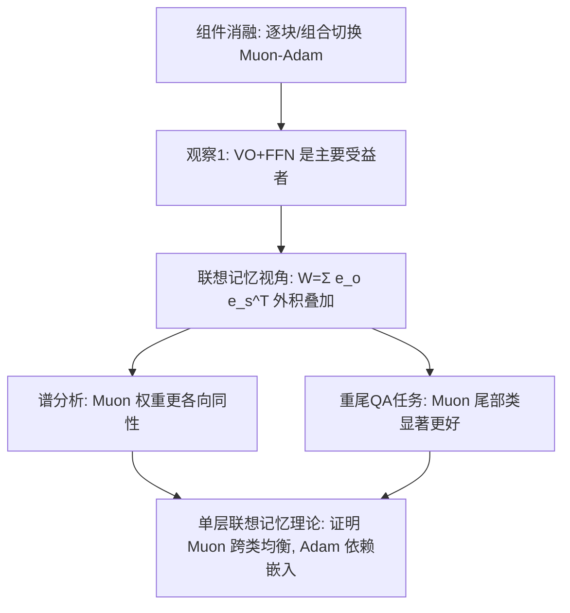

# Muon Outperforms Adam in Tail-End Associative Memory Learning

**会议**: ICLR 2026  
**OpenReview**: [https://openreview.net/forum?id=twbMFL0DMp](https://openreview.net/forum?id=twbMFL0DMp)  
**代码**: 待确认  
**领域**: optimization  
**关键词**: Muon优化器, Adam, 联想记忆, 重尾分布, 奇异谱各向同性, 长尾学习  

## 一句话总结
本文从"联想记忆"视角揭示 Muon 比 Adam 快的机制：Muon 的更新规则把梯度奇异值归一化，正好匹配联想记忆的外积叠加结构，因而能在重尾数据上对低频"尾部"知识做更均衡的学习。

## 研究背景与动机
- **领域现状**：Muon 作为面向矩阵参数的优化器，在各种规模与架构的 LLM 训练上比 Adam 快约 2 倍，其核心做法是用梯度的归一化正交因子（$O_t=U_tV_t^\top$）替代原始梯度，可解释为对谱范数做最速下降。
- **现有痛点**：现有"谱范数最速下降"解释无法说清——为什么对谱范数优化（Muon）就该胜过对无穷范数优化（Adam）；由此推导的收敛性分析也解释不了 Muon 的实测优势。
- **核心矛盾**：人们知道 Muon 更快，却不知道**优势来自 Transformer 的哪个部件**，以及**这些部件的什么结构特征**让 Muon 能更好地优化它们。
- **本文目标**：回答两个问题——(1) 哪些 Transformer 组件最受益于 Muon 的矩阵范数优化？(2) 什么结构特征使 Muon 能更高效地优化这些组件？
- **核心 idea**：**【联想记忆视角】** VO 注意力权重与 FFN 是 LLM 的"联想记忆"存储，可近似为事实外积之和 $W=\sum_i e_{o_i}e_{s_i}^\top$；而真实语料天然重尾（少数头部类极高频、大量尾部类各自稀少）。Muon 把梯度奇异值"抹平"后的更新，恰好对每个正交事实外积赋予相等更新幅度，从而**削弱高频事实的主导、放大低频尾部事实的学习**。

## 方法详解

### 整体框架
论文不提新优化器，而是用"机制拆解 + 理论建模"三步论证 Muon 的优势来源：先做组件消融定位受益部件（VO+FFN），再从权重谱与重尾知识任务两个角度验证"更各向同性 / 更均衡"，最后在单层线性联想记忆模型上给出可证明的均衡性结论。

### 关键设计

**1. 组件消融定位受益部件：把优势锁在 VO+FFN 上。** 作者在 160M NanoGPT 上采用两阶段协议：先"独立块"地只对单个矩阵（$W_Q,W_K,W_V,W_O,W_{in},W_{out}$）用 Muon、其余用 Adam，再做"组合配置"看子集能否恢复完整 Muon。结论是 VO 注意力权重（$W_V,W_O$）与 FFN 收益远大于 QK 权重，且 Muon(VO+FFN) 几乎复现完整 Muon 轨迹（验证损失 3.586 对完整 Muon 3.565，而全 Adam 为 3.924）；进一步消融显示 $W_O$ 比 $W_V$ 更关键。这一定位不是参数量的平凡后果——QK 与 VO 参数量相等，但 VO 影响显著更大（Observation 1）。

**2. 联想记忆外积结构与 Muon 的天然对齐。** 把 VO/FFN 视作线性联想记忆 $W=\sum_{i=1}^K e_{o_i}e_{s_i}^\top$。在 $\ell_2$ 损失 $c_1\|e_{o_1}-We_{s_1}\|^2+c_2\|e_{o_2}-We_{s_2}\|^2$ 下，梯度为 $G=c_1 e_{o_1}e_{s_1}^\top+c_2 e_{o_2}e_{s_2}^\top=\mathrm{diag}(c_1,c_2)$，其中 $c_i$ 反映该事实在当前批次的频率。对 $G=USV^\top=\sum_i s_i u_i v_i^\top$，Muon 抹掉奇异值得到 $O=UV^\top=\sum_i u_i v_i^\top=e_{o_1}e_{s_1}^\top+e_{o_2}e_{s_2}^\top$——**无论 $c_1,c_2$ 多悬殊，两个事实的更新幅度都相等**。由于交叉熵下梯度的奇异值正是编码了知识频率，Muon 通过归一化奇异值，就比依赖梯度幅度的 Adam 更均匀地学习高频与低频事实。

**3. 谱各向同性验证（Observation 2）。** 用归一化奇异能量 $q_i=\sigma_i^2/\sum_j\sigma_j^2$ 定义一组各向同性指标：归一化 SVD 熵 $H_{norm}=-\frac{1}{\log n}\sum_i q_i\log q_i$、有效秩 $\mathrm{eRank}=\exp(-\sum_i q_i\log q_i)$、Top-$k$ 能量占比、奇异值四分位比 $Q_{75/25}$。结果（10 个种子平均）显示 Muon 从训练一开始就让 VO/$W_{out}$ 的奇异谱更各向同性、且对随机初始化几乎无波动（误差棒可忽略），而 Adam 的各向同性在训练中剧烈波动、对初始化敏感——说明 Muon 让"不论频率高低的知识"都以可比幅度被表征。

**4. 单层联想记忆模型的可证明均衡性（Theorem 4.3）。** 抽象出单层模型 $f_W(E_k)=\mathrm{sm}(\tilde E^\top W E_k)$，最小化总体交叉熵 $L(W)=-\sum_k p_k\log[f_W(E_k)]_k$，并把 Adam 在 $\beta_1=\beta_2=0$ 下简化为 SignGD。在嵌入正交（Assumption 4.1）与两类不平衡（Assumption 4.2，定义不平衡比 $r=\min_k p_k/\max_k p_k$）下，定义"某类先达到 $1-\epsilon$ 时最差类的正确概率" $\varrho^\epsilon_{opt}$ 衡量均衡度。结论：Muon 给出 $\varrho^\epsilon_{Muon}\ge 1-\epsilon(1+O(\frac{\log K}{K}))$，**与嵌入无关地保持近乎均衡**；GD 为 $O(\epsilon^{-r}K^{r-1})$ 强烈受 $r$ 支配；Adam（SignGD）则**依赖嵌入结构**——支撑不重叠时能媲美 Muon，重叠时退化到 $O(\epsilon^{-0.7}K^{-0.3})$ 且更新出现明显谱衰减（$\sigma_{min}/\sigma_{max}\le 25\%$）。

## 实验关键数据

### 主实验：组件消融（160M NanoGPT, FineWeb, 10k步验证损失）

| 配置 | 验证损失（越低越好） |
|------|----------------------|
| 全 Muon (All Attn, FFN) | 3.565 |
| 全 Adam | 3.924 |
| Muon(VO+FFN) / Adam(QK) | 3.586 |
| Muon(VO+$W_{in}$) / Adam(QK+$W_{out}$) | 3.678 |
| Muon(VO+$W_{out}$) / Adam(QK+$W_{in}$) | 3.605 |
| Muon(QK) only | 3.893 |
| Muon($W_{out}$) only | 3.702 |

### 重尾知识 QA 任务（合成传记数据, 20万+个体, power-law频率, First-Token-Accuracy）

| 类别 | Muon | Adam | SGD+Mom |
|------|------|------|---------|
| 头部（高频）类 | 近满分 | 近满分 | 近满分 |
| 尾部（低频）类 | **显著更高、收敛更快更稳** | 明显落后 | 最差 |
| Muon(VO+FFN)/Adam(QK) | 尾部大幅提升、缩小头尾差距 | — | — |
| Muon(QK)/Adam(VO+FFN) | 仅有限提升 | — | — |

### 关键发现
- **VO+FFN 几乎=完整 Muon**：QK 对 Muon 整体增益贡献很小（Observation 1），且非 logit 爆炸所致。
- **谱更各向同性且更稳**：Muon 全程更高 SVD 熵/eRank、更低 Top10E/$Q_{75/25}$，误差棒可忽略（Observation 2）。
- **优势随分布趋均匀而消失**：数据越平衡，Muon 与 Adam 的平均 FTA 差距越小，反向印证优势源于重尾不平衡（Observation 3）。
- **任务依赖性自洽**：在主要依赖 QK 的 in-context 线性回归任务上，Muon 尾部表现与 Adam 相当——与"QK 非优势来源"一致。

## 亮点与洞察
- **机制解释而非又一个收敛界**：把"谱范数最速下降"这一笼统解释，落到"VO+FFN=联想记忆、Muon 更新对齐外积结构"的具体可验证机制，回答了"为什么/在哪里"。
- **三层证据闭环**：组件消融（在哪）→ 谱分析+重尾任务（怎样）→ 单层模型定理（为什么），经验与理论彼此印证。
- **可迁移直觉**："抹平奇异值=对每个正交事实等幅更新=保护尾部"，对理解为何矩阵优化器利于知识密集/长尾场景很有启发。

## 局限与展望
- **理论模型理想化**：单层线性联想记忆、嵌入严格正交、两类不平衡、关闭动量、Adam 简化为 SignGD（$\beta_1=\beta_2=0$），与真实多层非线性 Transformer + 完整 Adam 存在距离。
- **规模有限**：核心实验在 160M（附录扩到 0.7B）NanoGPT 与合成 QA 上，超大规模/真实预训练上的尾部知识收益尚待验证。
- **"尾部更好"的下游意义**：尾部知识学习更均衡是否直接转化为下游任务/事实召回的可观收益，论文以 FTA 为代理，更广泛评测仍待补。

## 相关工作与启发
- **Muon 与谱范数最速下降**：Jordan et al. (2024), Bernstein & Newhouse (2024) 给出几何解释，本文补上"机制+部件"层面的回答。
- **联想记忆与知识存储**：Geva et al. (2020)、Bietti et al. (2023)、Meng et al. (2022, ROME) 把 FFN/$W_O$ 视为可线性近似的联想记忆，是本文外积视角的基础。
- **重尾与优化器**：Kunstner et al. (2024) 指出 Adam 在重尾上胜过 SGD；本文进一步指出 Muon 在重尾尾部上再胜 Adam。
- **启发**：若一个优化器的更新方向天然对齐参数的"语义结构"（此处外积叠加），就可能在不平衡数据上获得免费的均衡化——这为针对长尾/知识密集任务设计优化器提供了思路。

## 评分
- **新颖性**: ⭐⭐⭐⭐⭐ 首次从联想记忆外积结构解释 Muon 优势，并精确定位到 VO+FFN，视角新且自洽。
- **实验充分度**: ⭐⭐⭐⭐ 消融/谱分析/重尾QA/多类对照齐全，10 种子 + 0.7B 扩展，但规模与真实预训练验证仍有限。
- **写作质量**: ⭐⭐⭐⭐⭐ 两问题驱动、三 Observation 串起经验与理论，toy example 把核心直觉讲得很清楚。
- **价值**: ⭐⭐⭐⭐ 为"矩阵优化器为何利于长尾知识学习"提供可证明机制，对优化器设计与 LLM 训练实践都有参考价值。

<!-- RELATED:START -->

## 相关论文

- [\[ICML 2026\] Muon in Associative Memory Learning: Training Dynamics and Scaling Laws](../../ICML2026/optimization/muon_in_associative_memory_learning_training_dynamics_and_scaling_laws.md)
- [\[ICLR 2026\] Implicit Bias of Per-sample Adam on Separable Data: Departure from the Full-batch Regime](implicit_bias_of_per-sample_adam_on_separable_data_departure_from_the_full-batch.md)
- [\[ICML 2026\] The Implicit Bias of Adam and Muon on Smooth Homogeneous Neural Networks](../../ICML2026/optimization/the_implicit_bias_of_adam_and_muon_on_smooth_homogeneous_neural_networks.md)
- [\[ICLR 2026\] Error Feedback for Muon and Friends](error_feedback_for_muon_and_friends.md)
- [\[ICLR 2026\] MuonBP: Faster Muon via Block-Periodic Orthogonalization](muonbp_faster_muon_via_block-periodic_orthogonalization.md)

<!-- RELATED:END -->
