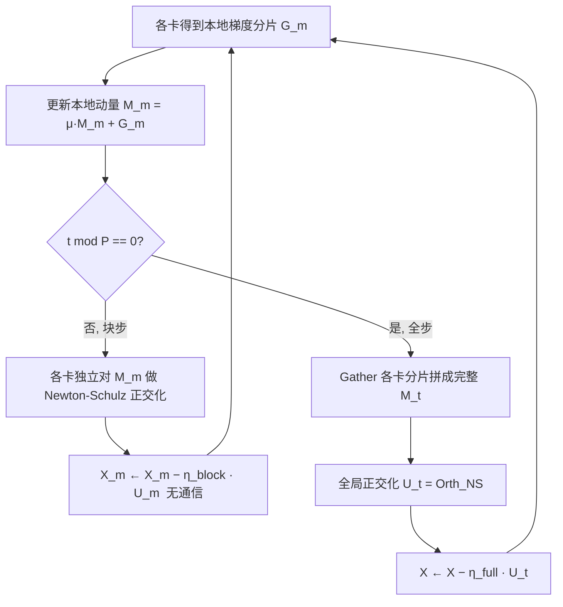

# MuonBP: Faster Muon via Block-Periodic Orthogonalization

**会议**: ICLR 2026  
**OpenReview**: [https://openreview.net/forum?id=mHouLSUQP5](https://openreview.net/forum?id=mHouLSUQP5)  
**代码**: 待确认  
**领域**: optimization  
**关键词**: Muon, 梯度正交化, 模型并行, 通信效率, LLM 预训练, 分布式优化  

## 一句话总结
MuonBP 在张量并行下让每张卡只对本地分片做正交化、每隔 P 步才做一次全局正交化，并用「块步」「全步」两个不同学习率，把 Muon 因正交化跨卡通信带来的吞吐损失抹平——8B 模型上比 Muon 提速约 8% 且效果不降反升。

## 研究背景与动机
- **领域现状**：Muon 把动量梯度先正交化再下降，在 LLM 预训练上比 Adam/AdamW 更省 token、临界 batch 更大，已被验证可扩展到 1T 参数规模，是近年少数能撼动 Adam 地位的优化器。
- **现有痛点**：正交化不是逐坐标操作，而是作用在整个梯度矩阵上。一旦用张量并行/FSDP2 把矩阵按行列切到不同设备，每步就要额外做 all-gather/scatter 把分片拼回完整矩阵再正交化。对 8B Llama 风格模型，这笔通信会带来 **8%–10% 的吞吐下降**——Muon 虽然 token 效率更高，但单步比 Adam 更慢。
- **核心矛盾**：**数据效率**（要全局正交化才稳）与**单步吞吐**（全局正交化要跨卡通信）天然冲突。只在本地分片上正交化（BlockMuon，即 P=∞）能完全省掉通信，但论文从理论和实验都显示它收敛保证更差、模型放大后会失稳（参数范数爆涨）。
- **本文目标**：在保住 Muon 数据效率的前提下，把正交化的通信开销降到接近逐坐标方法（Adam）的水平。
- **核心 idea**：**【块-周期插值】** 大部分步只做本地块正交化（零额外通信），每隔 P 步才 gather 一次做全局正交化兜底稳定性；P 成为在 Muon（P=1）和 BlockMuon（P=∞）之间平滑滑动的旋钮。**【双学习率】** 理论指出块步和全步必须用两个不同步长才能取得最优收敛率。

## 方法详解

### 整体框架
把每个参数/梯度/优化器状态张量切成的「块」精确对齐模型并行的分片布局（TP 按行/列切、FSDP2 按 0 维切），于是「块正交化」永远落在单卡本地、不触发任何跨设备通信。MuonBP 在 P−1 步里让每张卡独立对本地动量分片做 Newton-Schulz 正交化并用 ηblock 更新；每到第 P 步才 gather 出完整动量矩阵做全局正交化并用 ηfull 更新。P 越大越省通信但越接近不稳的 BlockMuon，P=5 在实验中取得最佳平衡。

### 关键设计

**1. 块对齐模型并行分片：让「块步」零通信。** 设计的出发点是观察到逐列/逐行归一化本质就是在 m×1 或 1×n 子矩阵上做正交化，那么对 p×q 子块正交化就是介于两者之间的中间方案。论文把每个块定义为**恰好等于该设备在选定并行布局下持有的那一片分片**：Megatron 列并行层里权重 $W\in\mathbb{R}^{m\times n}$ 按列切到 $c$ 个 TP rank，每 rank 持有 $W^{(j)}\in\mathbb{R}^{m\times(n/c)}$，块就是本地梯度分片 $G^{(j)}$；FSDP2 按 0 维切则块是本地连续切片；TP+FSDP 混合时块是两种切分的交集 $(m/r)\times(n/c)$。这样块正交化天然落在单卡，永远不需要 gather/scatter，同时还顺带省了算力——每步 Newton-Schulz 的 FLOPs 从 $2(2nm^2+m^3)$ 降到 $2(2mnq+mnq^2/p)$（Llama 3 405B 的 MLP 层在 8 路 TP 下加速约 2.36×–9.06×）。

**2. 周期性全局正交化：用一个旋钮兜底稳定性。** 纯块正交化（BlockMuon）虽然每步快，但论文用 Non-Euclidean Trust Region(NTR) 框架证明它的收敛保证最坏会差一个 $\sqrt{rc}$ 因子——块谱范数 $B(X)=\max_{i,j}\|X_{i,j}\|_{op}$ 的光滑常数 $L_B\le rc\,L_{op}$，导致放大后参数范数失控、训练发散。MuonBP 不去调块大小（块大小被网络拓扑锁死、改动代价大），而是引入周期 $P$：$P-1$ 步做块正交化、第 $P$ 步做全局正交化。$P=1$ 还原 Muon，$P\to\infty$ 退化为 BlockMuon，中间值平滑权衡迭代复杂度与单步通信。理论上 MuonBP 的收敛率正比于谐波平均光滑常数 $\bar L_{BP}$，满足 $L_{op}\le\bar L_{BP}\le L_B$，严格夹在 Muon 与 BlockMuon 之间。

**3. 双学习率：块步与全步必须用不同步长。** Theorem 2 的关键结论是：要取得 $\sqrt{2\Delta_0\bar L_{BP}/T}$ 这个最优率，必须用两个步长 $\eta_{full}^*=\frac{1}{L_{op}}\sqrt{2\Delta_0/(T\bar L_{BP})}$ 和 $\eta_{block}^*=\frac{1}{L_B}\sqrt{2\Delta_0/(T\bar L_{BP})}$，二者最优比落在 $1$ 到 $1/\sqrt{rc}$ 之间。若强行用单一步长，最优率会退化为正比于**算术平均** $\bar L_{BP2}=\frac{L_{op}}{P}+\frac{P-1}{P}L_B$，而由谐波均值 $\le$ 算术均值可知 $\bar L_{BP}\le\bar L_{BP2}$（除非 $L_{op}=L_B$ 否则严格小于），即绑定学习率一定更差。实现上配合 Liu et al. 的 AdamW RMS-norm-matching 规则——块步按小分块维度缩放、全步按完整矩阵维度缩放更新。

## 实验关键数据

### 主实验表格（Megatron-LM + ZeRO 层切分 + TP，验证/训练困惑度，越低越好）

| Method | 960M Val | 1.2B Val | 1.2B(3x+大lr) Val | 8B Val | 8B(大lr) Val |
|---|---|---|---|---|---|
| Muon | 15.33 | 14.13 | 12.62 | 12.90 | 13.40 |
| BlockMuon | 20.29 | 16.28 | 13.29 | 13.68 | 24.68 |
| **MuonBP** | **15.12** | **13.78** | **12.45** | **12.77** | **12.97** |
| Adam | 22.51 | – | 15.03 | 14.47 | – |

吞吐（TFLOP/s/GPU）：8B 上 Muon 105.09、MuonBP 113.37、BlockMuon 114.75、Adam 117.30——MuonBP 几乎追平 BlockMuon/Adam，相对 Muon 提速约 8%。8B 时钟时间上，达到目标困惑度 MuonBP 比 Muon 快约 10–13%；同等时间困惑度低约 5–7%。

### 消融实验表格（280M，验证损失随 TP 度与块周期变化，节选）

| Block Period \ TP度 | 2 | 4 | 8 | 16 |
|---|---|---|---|---|
| P=2 | 3.358 | 3.364 | 3.368 | 3.366 |
| P=4 | 3.365 | 3.374 | 3.377 | 3.383 |
| P=8 | 3.373 | 3.401 | 3.405 | 3.413 |
| P=16 | 3.395 | 3.456 | 3.447 | 3.479 |

减小块周期 P 在所有 TP 度上都直接降低损失，且 TP 度越高效果越明显——印证了 P 作为「迭代质量 ↔ 通信成本」旋钮的作用。

### 关键发现
- **BlockMuon 会失稳**：8B 大学习率下 BlockMuon 困惑度暴涨到 24.68（Muon 13.40、MuonBP 12.97），参数范数随训练显著膨胀；必须调小学习率才稳，但那样三种方法又都退化到次优。
- **MuonBP 反超 Muon**：在多数规模上 MuonBP 即使做更少的全局正交化，验证/训练困惑度仍优于 Muon，作者推测是间歇性带来的正则化效应（留作未来工作）。
- **Adam 的劣势随规模缩小**：相对 Muon 的困惑度优势从 960M 的 31.9% 收窄到 8B 的 10.9%，更凸显大规模下「省吞吐」的价值——哪怕 7% 吞吐提升都极有意义。
- 小规模（160M，TP=2/FSDP=4）下各方法吞吐接近（MuonBP 51.40 vs Muon 50.90 TFLOP/s/GPU），因层切分本身 all-gather 已很少；优势在大规模 8B 才充分显现。

## 亮点与洞察
- **把系统瓶颈翻译成优化器超参**：通信开销这个工程问题被转化为一个有理论支撑、可平滑调节的标量旋钮 P，而非靠改网络拓扑或重排张量。
- **理论与系统严丝合缝**：块的定义直接绑定到 TP/FSDP 分片布局，使「块步零通信」成为定义层面的保证而非近似；双学习率结论也直接来自收敛分析，不是经验调参。
- **几乎零成本落地**：只需在已有 Distributed Muon 实现上加「每 P 步 gather 一次 + 两个步长」，超参调整极少，工程友好。

## 局限与展望
- **块大小被拓扑锁死**：理论上存在平衡 $\sqrt{rc}$ 权衡的最优块大小，但实际块大小由 TP/FSDP 度决定，改动会引入额外延迟与张量重排，所以只用 P 而不调块。
- **与 Dion 的对比仅小规模**：只在 160M 上比过 Dion，作者明确表示需要更大规模、并集成进 Megatron-LM 等主流框架后再充分对比。
- **「间歇正则化」未解释**：MuonBP 反超 Muon 的机制只是猜测，缺乏理论分析。
- **P=5 经验选取**：最优 P 依赖网络速度与张量大小，需靠短跑实验确定，没有闭式选择规则。

## 相关工作与启发
- **Muon / 正交化优化器**（Jordan et al. 2024；steepest descent / NTR 视角 Bernstein、Kovalev 2025）：MuonBP 的分析模板与 RMS-norm-matching 学习率迁移（Liu et al. 2025）都建立在这条线上。
- **BlockMuon**（Boreiko et al. 2025，并行工作，即 P=∞）：本文的直接对照与负面教材，论证了「只做块正交化」的不足。
- **通信高效优化**：Dion（低秩动量近似 + 分布式正交化）、Distributed Shampoo（blocking + 间歇预条件 + 层切分）、MuLoCo（梯度量化 + 间歇通信）——MuonBP 借用「间歇通信」思想到模型并行场景，且与这些数据并行技巧正交可叠加。
- 启发：当某个算法操作引入跨设备通信瓶颈时，「把昂贵全局操作周期性化 + 平时用本地近似 + 理论指导差异化步长」是一条可复用的提速范式。

## 评分
- **新颖性**: ⭐⭐⭐⭐ 「块对齐分片 + 周期全局正交化 + 双学习率」组合简洁但切中 Muon 落地的真实痛点，NTR 框架下的收敛插值分析干净。
- **实验充分度**: ⭐⭐⭐⭐ 覆盖 280M 网格搜索到 8B 真实预训练、多并行策略、与 Muon/BlockMuon/Dion/Adam 全面对比；扣分在 Dion 仅小规模、缺更大规模与更多数据集。
- **写作质量**: ⭐⭐⭐⭐ 动机—理论—算法—实验逻辑顺畅，理论结论（双学习率、$\bar L_{BP}$ 插值）与工程做法对应清晰。
- **价值**: ⭐⭐⭐⭐ 直接消除 Muon 在大规模 TP 训练下 8–10% 的吞吐损失且效果不降，对正在采用 Muon 的工业级 LLM 预训练有即插即用的实用价值。

<!-- RELATED:START -->

## 相关论文

- [\[ICLR 2026\] Error Feedback for Muon and Friends](error_feedback_for_muon_and_friends.md)
- [\[ICLR 2026\] Distributionally Robust Linear Regression with Block Lewis Weights](distributionally_robust_linear_regression_with_block_lewis_weights.md)
- [\[ICLR 2026\] How Muon's Spectral Design Benefits Generalization: A Study on Imbalanced Data](how_muons_spectral_design_benefits_generalization_a_study_on_imbalanced_data.md)
- [\[ICLR 2026\] Convergence of Muon with Newton-Schulz](convergence_of_muon_with_newton-schulz.md)
- [\[ICLR 2026\] Faster Gradient Methods for Highly-Smooth Stochastic Bilevel Optimization](faster_gradient_methods_for_highly-smooth_stochastic_bilevel_optimization.md)

<!-- RELATED:END -->
