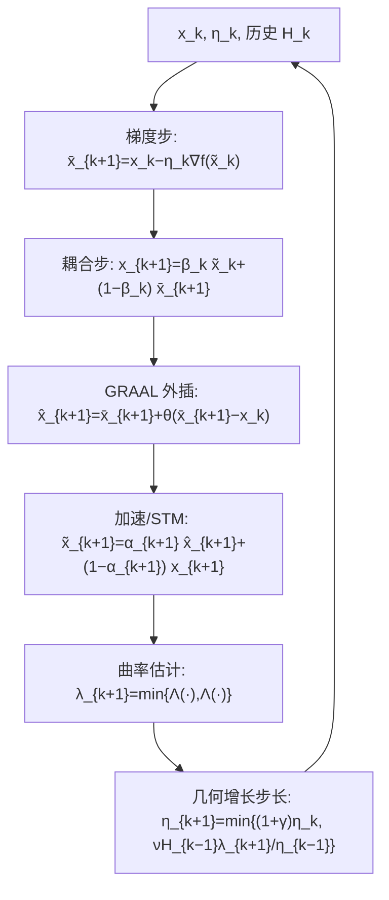

# Nesterov Finds GRAAL: Optimal and Adaptive Gradient Method for Convex Optimization

**会议**: ICLR 2026  
**OpenReview**: [https://openreview.net/forum?id=vPSiCA3CkD](https://openreview.net/forum?id=vPSiCA3CkD)  
**代码**: 未公开  
**领域**: optimization  
**关键词**: 凸优化, 自适应步长, Nesterov 加速, GRAAL, 局部曲率估计, (L0,L1)-smoothness  

## 一句话总结
本文把无需调参、无需线搜索的自适应梯度法 GRAAL 与 Nesterov 加速首次"正确地"融合，得到 Accelerated GRAAL，它能像非加速 GRAAL 一样让步长按**几何（线性）速率**自适应局部曲率，从而在 $L$-光滑和更一般的 $(L_0,L_1)$-光滑下都达到接近最优的迭代复杂度 $O(\sqrt{L\|x_0-x^*\|^2/\epsilon})$。

## 研究背景与动机
**领域现状**：一阶梯度法的核心痛点是步长 $\eta$ 的选取。理论上 $L$-光滑函数下定步长 GD 取 $\eta=1/L$ 得到复杂度 $O(L\|x_0-x^*\|^2/\epsilon)$，而 Nesterov 的加速梯度法（AGD）能改进到最优的 $O(\sqrt{L\|x_0-x^*\|^2/\epsilon})$。但这两者都需要预先知道 Lipschitz 常数 $L$。

**现有痛点**：自适应方法大致三条路线，各有硬伤——(1) 线搜索每步多算几次梯度/函数值却"不前进"，实践中很少用；(2) AdaGrad 类步长 $\eta_k=\eta(\sum_i\|\nabla f(x_i)\|^2)^{-1/2}$ 是**单调不增**的，无法真正贴合局部曲率；(3) 局部曲率估计路线（Malitsky 的 GRAAL、AdGD）效果好，步长可升可降，但**只有非加速版本**，复杂度停在 $O(L\|x_0-x^*\|^2/\epsilon)$。

**核心矛盾**：能不能让 GRAAL 既保留"按几何速率自适应局部曲率"的能力，又获得 Nesterov 加速带来的最优 $\sqrt{\cdot}$ 复杂度？此前 AC-FGM（Li & Lan 2025）与 AdaNAG（Suh & Ma 2025）尝试过加速版自适应方法，但它们的步长**只能次线性增长**（$\eta_{k+1}\le(1+1/k)\eta_k$），自适应能力被严重限制，无法应对很小的初始步长，也拿不到 $(L_0,L_1)$-光滑下的结果。

**本文目标**：开发一个**同时加速、最优、完全自适应**（无超参调优、无线搜索）的算法。

**核心 idea**：**用 GRAAL 的外插步替换加速法里的梯度步，并通过一个额外的耦合步绕开"算步长需要先知道动量系数 $\alpha_k$、而算 $\alpha_k$ 又需要先知道步长"的鸡生蛋难题**，从而把 GRAAL 的几何增长步长规则原封不动地搬进 Nesterov 加速框架。

## 方法详解

### 整体框架
算法的搭建分四块拼装：先用更贴合凸函数的 **Option II（Bregman 散度型）曲率估计器**替换 GRAAL 原本的 Option I；再借 Kovalev & Borodich (2024) 对 Nesterov 加速的新解释，把第 $k$ 步的目标函数替换成缩放后的 $f_k$；接着把 GRAAL 的外插步嵌进来；最后用一个额外耦合步与配套的 $\alpha_k,\beta_k$ 递推化解步长与动量系数互相依赖的循环。

### 关键设计

**1. Option II 曲率估计器：用 Bregman 散度更准地"量"局部 Lipschitz 常数。** GRAAL 步长规则 $\eta_{k+1}=\min\{(1+\gamma)\eta_k,\ \nu\lambda_{k+1}^2/\eta_{k-1}\}$ 依赖对逆局部 Lipschitz 常数 $\lambda$ 的有限差分估计。给定两点 $x,z$，可选 Option I $\lambda=\|x-z\|/\|\nabla f(x)-\nabla f(z)\|$，或 Option II $\lambda=2D_f(x,z)/\|\nabla f(x)-\nabla f(z)\|^2$，其中 $D_f$ 是 Bregman 散度。原版 GRAAL 为兼容更一般的变分不等式（VI）用了 Option I，但当目标是凸可微函数时，Option II 能更充分利用 $f$ 的结构。本文采用 Option II 并定义 $\Lambda(x;z)=2D_f(x;z)/\|\nabla f(x)-\nabla f(z)\|^2$（梯度相等时取 $+\infty$），每步取两个估计的最小值 $\lambda_{k+1}=\min\{\Lambda(x_{k+1};\tilde x_k),\Lambda(x_{k+1};\tilde x_{k+1})\}$，使曲率估计既稳又紧。

**2. 把 Nesterov 加速重写成"缩放目标函数"。** 借用 Kovalev & Borodich (2024) 的解释：在第 $k$ 步不直接对 $f$ 做加速，而是把目标换成 $f_k(x)=\alpha_k^{-1}f(\alpha_k x+(1-\alpha_k)x_k)$，$\alpha_k\in(0,1]$。若对 $f_k$ 做 GD，即 $x_{k+1}=x_k-\eta_k\nabla f_k(x_k)$ 并令 $\overline{x}_{k+1}=\alpha_k x_{k+1}+(1-\alpha_k)x_k$，恰好还原成 STM（一种 AGD 变体）。这种写法把"动量"藏进目标函数的缩放里，让加速与 GRAAL 外插步的组合在代数上大幅简化。

**3. GRAAL 外插 + 额外耦合步，破解步长与 $\alpha_k$ 的循环依赖。** 把 GRAAL 的外插 $\hat x_{k+1}=\overline{x}_{k+1}+\theta(\overline{x}_{k+1}-x_k)$ 与上面的加速解释组合后，理论上需要选 $\alpha_k$ 使 $\eta_k/\alpha_k\le\eta_{k-1}/\alpha_{k-1}+\eta_k$ 取等。但这做不到：算 $\eta_k$ 要先估局部曲率，估曲率要算 $\nabla f_k(\hat x_k)$，而这又需要预先知道 $\alpha_k$——典型的鸡生蛋。AC-FGM/AdaNAG 的妥协是直接预设 $\alpha_k\propto 2/(k+2)$，但这等于放弃了步长的自适应增长。本文的破解办法是引入**额外耦合步** $x_{k+1}=\beta_k\tilde x_k+(1-\beta_k)\overline{x}_{k+1}$，配合 $\alpha_{k+1}=\frac{(1+\gamma)\eta_k}{H_k+(1+\gamma)\eta_k}$、$\beta_{k+1}=\frac{\eta_{k+1}}{\alpha_{k+1}H_{k+1}}$ 与累积量 $H_{k+1}=H_k+\eta_{k+1}$ 的递推，使 $\alpha_k$ 由**已算出的历史步长**决定，从而不再需要预知未来步长。

**4. 几何（线性）增长的步长规则。** 步长更新 $\eta_{k+1}=\min\{(1+\gamma)\eta_k,\ \nu H_{k-1}\lambda_{k+1}/\eta_{k-1}\}$ 的上界项 $(1+\gamma)\eta_k$ 允许步长按**几何速率**放大，这是与 AC-FGM（$\le(1+1/k)\eta_k$）、AdaNAG 的关键区别。几何增长意味着即便把初始步长 $\eta_0$ 取得极小（如 $10^{-10}$），也只在复杂度里多出一个 $\ln[1/(\eta_0 L)]$ 的对数加性项；更重要的是，在 $(L_0,L_1)$-光滑下局部 Lipschitz 常数可能以指数速率变化，唯有几何及以上的增长才能避免复杂度里出现指数因子。

## 实验关键数据
本文是纯理论工作，"实验"以收敛复杂度定理/推论与同类方法的复杂度对比给出，无数值实验。

### 主结果（L-光滑，凸）

| 设置 | 算法 | 迭代复杂度 |
|------|------|-----------|
| $L$-光滑 | GD（定步长） | $O(L\|x_0-x^*\|^2/\epsilon)$ |
| $L$-光滑 | AGD（Nesterov，最优） | $O(\sqrt{L\|x_0-x^*\|^2/\epsilon})$ |
| $L$-光滑 | **Accelerated GRAAL（本文，Cor. 2）** | $O\big(1+\sqrt{L\|x_0-x^*\|^2/\epsilon}+\ln[1/(\eta_0 L)]\big)$ |

本文方法仅以一个**与精度 $\epsilon$ 无关**的对数加性项就达到最优速率，且不需要 $\eta_0\le 1/L$ 之外的任何调参。

### $(L_0,L_1)$-光滑下的对比（Table 1，$D=\|x_0-x^*\|$）

| 参考 | 复杂度 | 最优 | 自适应 |
|------|--------|------|--------|
| Li et al. (2023) | $\sqrt{L_0D^2/\epsilon}\times(1+L_1^2D^2)\exp(O(1)L_1D)$ | ✘ | ✘ |
| Gorbunov et al. (2024) | $\sqrt{L_0D^2/\epsilon}\times\sqrt{1+L_1D}\exp(L_1D)$ | ✘ | ✘ |
| Vankov et al. (2024) | $\sqrt{L_0D^2/\epsilon}+(L_1D)^{5/3}$ | ✔ | ✘ |
| Tyurin (2025) | $\sqrt{L_0D^2/\epsilon}+(L_1D)^2$ | ✔ | ✘ |
| **本文 Cor. 3** | $\sqrt{L_0D^2/\epsilon}+(L_1D)^3$ | ✔ | ✔ |

### 关键发现
- **唯一同时打勾"最优 + 自适应"的算法**：Vankov 与 Tyurin 虽近最优，但前者每步要解一维子问题、后者要调多个参数，都不自适应；本文方法零调参零线搜索。
- **几何步长增长是 $(L_0,L_1)$ 结果的命门**：局部曲率 $\lambda_k$ 最坏会指数级变化，几何增长才能在接近解时把步长追到 $O(1/L_0)$ 而不引入指数因子；AC-FGM/AdaNAG 的次线性增长因此拿不到 $(L_0,L_1)$ 的保证。
- 对比非加速 AdGD 在 $(L_0,L_1)$ 下的 $O(L_0D^2/\epsilon+(L_1D)^6)$，本文凭加速明显更优。
- **初始步长可以"乱取"**：无论 $L$-光滑还是 $(L_0,L_1)$-光滑，只要把 $\eta_0$ 取得足够小（如 $10^{-10}$）即可满足前提条件，代价仅是一个与 $\epsilon$ 无关、对 $\eta_0$ 呈对数依赖的加性项——这正是相比 AC-FGM（需在首步用线搜索找"好"的 $\eta_0$）与 AdaNAG（$\eta_0$ 估太大就显著变差）的实用优势。
- 对比 Vankov (2024) 的 $(L_1D)^{5/3}$，本文 $(L_1D)^3$ 的常数项略大，但本文是其中**唯一无需任何辅助子问题或调参**就达到该量级的算法。

## 亮点与洞察
- **"鸡生蛋"难题的优雅破解**：用额外耦合步 + 由历史步长反推 $\alpha_k$，把"算步长需先知 $\alpha_k$、算 $\alpha_k$ 需先知步长"的死循环拆开，这是把 GRAAL 真正塞进 Nesterov 框架的核心钥匙。
- **几何增长 vs 次线性增长**的对比一针见血地解释了为何前人加速自适应法"半残"：步长涨得太慢就跟不上局部曲率的剧变。
- 一套算法同时覆盖 $L$-光滑与更现实的 $(L_0,L_1)$-光滑（后者由深度网络中 Hessian 范数与梯度范数相关的实验现象催生），且都接近最优。

## 局限与展望
- **纯理论、无数值实验**：复杂度对比令人信服，但缺乏在实际优化问题上对 GRAAL/AC-FGM/AdaNAG 的经验比较来佐证常数因子与实际表现。
- $(L_0,L_1)$ 的加性项 $(L_1D)^3$ 比 Vankov 的 $(L_1D)^{5/3}$ 略差，留有收紧空间。
- 仅针对凸、可微目标；强凸、非光滑、随机/小批量梯度等场景未覆盖。
- 复杂度仅在"加性常数（与 $\epsilon$ 无关）"意义下接近最优，与严格意义的最优速率之间仍隔着这些与问题尺度相关的额外项。
- 作者指出"GRAAL 这一特定外插是否可被其他基算法替代以得到同样结果"仍是**开放问题**。

## 相关工作与启发
- **GRAAL / AdGD**（Malitsky 2020；Malitsky & Mishchenko 2020；Alacaoglu et al. 2023）：本文的非加速基座，提供几何增长步长与局部曲率估计思想。
- **Nesterov 加速 / STM**（Nesterov 1983；Gasnikov & Nesterov 2016；Kovalev & Borodich 2024）：加速的最优性下界与"缩放目标函数"解释。
- **加速自适应法 AC-FGM / AdaNAG**（Li & Lan 2025；Suh & Ma 2025）：直接竞品，因步长次线性增长而自适应受限。
- **$(L_0,L_1)$-光滑**（Zhang et al. 2019；Vankov et al. 2024；Tyurin 2025；Gorbunov et al. 2024）：更现实的光滑性假设及其加速分析。
- **启发**：当"算 A 需先知 B、算 B 需先知 A"时，引入一个由历史量驱动的辅助递推（耦合步）往往能解循环；而自适应步长方法的"增长速率"应被视为一等公民——它决定了能否追上局部曲率的剧烈变化。

## 评分
- **新颖性**: ⭐⭐⭐⭐ — 首个同时做到加速、最优、完全自适应（含 $(L_0,L_1)$）的一阶法，破解循环依赖的耦合步设计巧妙。
- **实验充分度**: ⭐⭐⭐ — 理论复杂度对比扎实且全面，但完全没有数值实验佐证实际表现。
- **写作质量**: ⭐⭐⭐⭐ — 动机层层递进，把"为何前人加速自适应法不够好"讲得很清楚，符号略密集。
- **价值**: ⭐⭐⭐⭐ — 闭合了"GRAAL 能否加速"这一自然且重要的理论问题，对自适应优化研究有指导意义。

<!-- RELATED:START -->

## 相关论文

- [\[ICLR 2026\] A Schrödinger Eigenfunction Method for Long-Horizon Stochastic Optimal Control](a_schrödinger_eigenfunction_method_for_long-horizon_stochastic_optimal_control.md)
- [\[ICLR 2026\] Clipped Gradient Methods for Nonsmooth Convex Optimization under Heavy-Tailed Noise: A Refined Analysis](clipped_gradient_methods_for_nonsmooth_convex_optimization_under_heavy-tailed_no.md)
- [\[ICLR 2026\] Fast Frank–Wolfe Algorithms with Adaptive Bregman Step-Size for Weakly Convex Functions](fast_frankwolfe_algorithms_with_adaptive_bregman_step-size_for_weakly_convex_fun.md)
- [\[ICLR 2026\] Gradient-Normalized Smoothness for Optimization with Approximate Hessians](gradient-normalized_smoothness_for_optimization_with_approximate_hessians.md)
- [\[ICLR 2026\] High Probability Bounds for Non-Convex Stochastic Optimization with Momentum](high_probability_bounds_for_non-convex_stochastic_optimization_with_momentum.md)

<!-- RELATED:END -->
