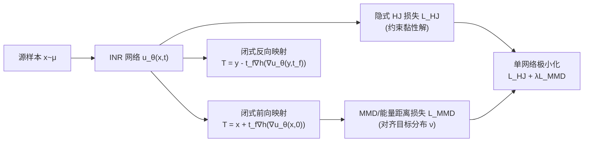

# Neural Hamilton–Jacobi Characteristic Flows for Optimal Transport

**会议**: ICLR 2026  
**OpenReview**: [https://openreview.net/forum?id=YbQxus1KEa](https://openreview.net/forum?id=YbQxus1KEa)  
**代码**: 待确认  
**领域**: optimization  
**关键词**: 最优传输, Hamilton–Jacobi 方程, 特征线法, 黏性解, 神经网络求解 PDE, 双向传输映射  

## 一句话总结
本文把最优传输（OT）映射重写成 Hamilton–Jacobi（HJ）方程黏性解的梯度，借助"特征线法"把动力学积分塌缩成一条直线，于是只用**单个网络、纯极小化损失**就能得到**闭式、双向、且保证最优**的传输映射，彻底甩掉了对抗训练和 ODE 数值积分。

## 研究背景与动机
**领域现状**：用深度学习求解 OT 已分化出几条主线——Kantorovich 对偶/原始-对偶（用 ICNN 参数化势函数）、Benamou–Brenier 的动力学/连续归一化流（CNF）、以及熵正则的随机模型。它们各自把 OT 拆成"势函数 + 传输映射"的优化问题。

**现有痛点**：对偶类方法几乎都依赖两张网络的 **min-max 对抗训练**，不稳定、调参难、显存高；动力学类方法虽然只用单网络，但**训练和推理都要解 ODE/SDE**，计算开销巨大，而且通常只能单向（要反向得重新积分）；很多方法因为掺了正则项，得到的是**有偏映射**，并不真正落在 OT 解上。

**核心矛盾**：HJ 方程的黏性解本就能唯一刻画 OT 映射，理论上最干净，但直接用它有两座大山——解的**非唯一性**（HJ 是病态的，PINN 残差惩罚不保证收敛到黏性解）和动力学形式下**仍要解 ODE**。

**本文目标**：要一个"既要又要"的框架——单网络、纯极小化（无对抗）、闭式双向映射（无数值积分）、且在网络容量足够时**可证明恢复真实 OT 映射**。

**核心 idea**：<u>沿 HJ 方程的特征线，p=∇u 恒定，特征线是直线</u>——这意味着传输点就是这条直线的终点，传输映射天然写成闭式；再用最近提出的**隐式解公式**把黏性解约束成一个可蒙特卡洛估计的损失，既绕开 ODE 积分又压住非唯一性。

## 方法详解

### 整体框架
方法名为 **神经特征流（Neural Characteristic Flow, NCF）**：用一个隐式神经表示 $u_\theta(x,t)$ 逼近 HJ 方程黏性解，传输映射直接由 $\nabla u_\theta$ 的闭式公式给出；训练时同时施加两类损失——"隐式 HJ 损失"逼 $u_\theta$ 成为真正的黏性解，"MMD 损失"逼变换后的样本分布对齐目标分布。整套流程只有一张网络、一个极小化目标，前向/反向映射共用同一个 $u_\theta$。

### 关键设计

**1. 特征线法导出闭式双向映射：把动力学积分塌缩成一条直线。** OT 的动力学形式（Benamou–Brenier）对应一组 HJ 特征常微分方程（CODE）：$\dot x=\nabla h(p)$、$\dot p=0$。关键观察是 $\dot p=0$ 说明 $p=\nabla u$ 沿每条特征轨迹**恒定不变**，于是特征线退化成直线 $x(t)=t\nabla h(p)+x(0)$。终点 $t=t_f$ 恰好就是 OT 映射，因此前向映射直接写成 $T^{\nu*}_\mu(x)=x+t_f\nabla h(\nabla u^*(x,0))$，而反向映射用同一个解在终端时刻取值即得 $T^{\mu*}_\nu(y)=y-t_f\nabla h(\nabla u^*(y,t_f))$。这一步把传统动力学方法里"沿时间数值积分 ODE"的瓶颈彻底消掉——两个方向的映射都是**解析闭式**，且只需一张网络承载，省掉了对偶法的双网络与重新积分反向映射的开销。

**2. 隐式解公式作为训练损失：用一个可蒙特卡洛估计的残差压住 HJ 的病态性。** 直接解 HJ 方程会撞上非唯一、非光滑、梯度不连续等麻烦，PINN 式地惩罚 HJ 残差并不能保证收敛到正确的黏性解。本文改用 Park & Osher 提出的隐式解公式 $u(x,t)=-th(\nabla u)+t\nabla u^\top\nabla h(\nabla u)+g(x-t\nabla h(\nabla u))$，并把其中难以解析的初值函数 $g$ 替换成 $u_\theta$ 在 $t=0$ 的取值，得到加权残差损失 $L_{HJ}(u_\theta)=\iint \big(u_\theta+th(\nabla u_\theta)-t\nabla u_\theta^\top\nabla h(\nabla u_\theta)-u_\theta(x-t\nabla h(\nabla u_\theta),0)\big)^2 d\varrho(x)dt$。权重测度 $\varrho$（有界域上取均匀分布，或集中在样本覆盖区域）让这个残差能用蒙特卡洛采样高效估计，从而在整个空间上把 $u_\theta$ 钉死在黏性解上——实验里这正是它显著强于 HJ-PINN 的原因。

**3. MMD 能量距离损失对齐分布：给 HJ 解注入分布信息。** HJ 方程本身不编码源/目标分布，要恢复期望的 OT 映射，得让初值函数 $g$ 反映两个分布的关系，但有限样本下 $g$ 没有解析形式。本文用最大均值差异（MMD）来约束变换后的样本分布与目标对齐：$L_{MMD}(u_\theta)=\mathrm{MMD}(T^\nu_\mu[u_\theta]_\sharp\mu,\nu)^2$，并采用负距离核 $k(x,y)=-\|x-y\|_2$，此时 MMD 退化为擅长高维的**平方能量距离**。总损失 $L_{HJ}+\lambda L_{MMD}$ 里两项分工明确：MMD 拉对分布、HJ 保证在众多能匹配分布的映射中唯一挑出真正的 OT 映射——理论上作者证明了当总损失为 0 且映射雅可比正定时，$T[u_\theta]$ 恰为真实 OT 映射（一致性定理），并在高斯设定下给出稳定性界 $\|u_\theta-u^*\|+\|T-T^*\|\le C(L_{HJ}^{1/3}+L_{MMD}^{1/4})$。

**4. 类条件传输扩展：在各类支撑集内分别满足 HJ 方程。** 把框架推广到类条件 OT——对 $K$ 个有标签的类各自做源到目标的传输，保留标签一致性。做法是保持隐式 HJ 损失不变（全局映射在每个类支撑集内都满足 HJ 方程），只把 MMD 损失改成逐类平均 $\frac1K\sum_k E(T^\nu_\mu[u_\theta]_\sharp\mu_k,\nu_k)$。类间边界虽可能出现传输映射相交导致的不可微区域，但梯度只在各类支撑集内部计算，映射在这些区域仍可表达，因此该扩展天然适配域适应与类条件生成。

## 实验关键数据

### 主实验：高斯分布上的 UVP（↓，越低越好）
评估指标为未解释方差百分比（UVP），衡量估计映射的 $L^2$ 误差（按 $\mathrm{Var}(\nu)$ 归一化），维度 $d$ 从 2 升到 64。

| Method | d=2 | d=4 | d=8 | d=16 | d=32 | d=64 |
|---|---|---|---|---|---|---|
| NOT | 77.25 | 125.42 | 114.06 | 176.09 | 182.29 | 196.83 |
| WGAN-QC | 1.60 | 5.90 | 31.04 | 59.31 | 113.24 | 141.41 |
| LS | 5.81 | 9.78 | 15.96 | 25.23 | 41.45 | 55.36 |
| MM-v1 | 0.16 | 0.17 | 0.17 | 0.21 | 0.37 | 0.42 |
| MM:R | 0.012 | 0.048 | 0.012 | 0.20 | 0.35 | 0.60 |
| HJ-PINN | 0.080 | 0.069 | 0.16 | 0.46 | 0.58 | 1.68 |
| **NCF** | **0.010** | 0.021 | 0.086 | 0.15 | 0.44 | 0.86 |
| **NCF-Adaptive** | **0.010** | 0.022 | 0.090 | 0.16 | **0.31** | **0.41** |

低维下 NCF 全场最低；高维（d=32/64）因单网络同时承载双向映射、容量被压到对手一半而略降，稍放大网络的 NCF-Adaptive 即把高维误差拉回最优且参数仍少于 MM-v1/MM:R。

### 应用实验：颜色迁移（EMD ↓ / HI ↑）

| Method | Winter-Summer EMD/HI | Monet-Photo EMD/HI | Gogh-Photo EMD/HI |
|---|---|---|---|
| NOT | 0.0008 / 0.8002 | 0.0008 / 0.8210 | 0.0008 / 0.8247 |
| MM-v1 | 0.0014 / 0.7295 | 0.0011 / 0.7722 | 0.0007 / 0.8265 |
| **NCF** | **0.0005 / 0.8914** | **0.0004 / 0.9174** | **0.0003 / 0.9117** |

在更复杂、多模态的真实颜色分布上，NCF 三个域两个指标全面领先，相对高斯设定下的优势进一步放大。

### 类条件实验：Fashion MNIST → MNIST（Accuracy ↑ / FID ↓）

| Metric | NOT | GNOT | Discrete OT | AugCycleGAN | MUNIT | **NCF** |
|---|---|---|---|---|---|---|
| Accuracy(%) ↑ | 10.96 | 83.22 | 10.67 | 12.03 | 8.93 | **83.42** |
| FID ↓ | 7.51 | 5.26 | >100 | 26.35 | 7.91 | 18.27 |

NCF 类标签保持准确率最高（83.42%）；FID 偏高主要由 VAE 解码器引入的差异所致——若把 FID 算在 NCF 输出与 VAE 解码图之间，结果低至 2.73，说明传输映射本身质量很高。

### 关键发现
- **隐式 HJ 损失 > PINN 残差**：与 HJ-PINN 的对照（消融）显示，隐式解公式损失在所有维度都更准、能真正逼近黏性解，2D 上 HJ-PINN 出现交叉、混乱的传输路径。
- **单网络双向是双刃剑**：低维省参增益明显，高维需略增容量（NCF-Adaptive）补偿。
- **稳定 & 省资源**：相比 MM:R 的 min-max 不稳定、MM-v1 的高显存长训练，NCF 训练更快、更稳、更省显存。

## 亮点与洞察
- **把"解 ODE"变成"取直线终点"**：特征线 $\dot p=0$ 让动力学塌缩成解析闭式，是整套效率优势的源头，思路极其干净。
- **黏性解的正确刻画**：用隐式解公式而非 PINN 残差，从根上解决了 HJ 方程病态导致的"恢复不到正确解"问题，并配上一致性 + 稳定性双定理。
- **单网络承担双向 + 多种代价 + 类条件**：一个 $u_\theta$ 同时给出前向、反向、并扩展到一般代价函数和类条件传输，工程上极简。
- **可证明最优**：Table 1 里它是唯一同时满足"单网络/极小化/双向/直接采样/保证最优"全勾的方法。

## 局限与展望
- **高维容量瓶颈**：单网络同时学双向映射在 d=32/64 上需手动放大网络（NCF-Adaptive）才能保持精度，说明双向共享的容量分配仍待更优策略。
- **推理需梯度评估**：映射要算 $\nabla u_\theta$，推理延迟高于直接参数化映射的 NOT（虽随维度升高差距缩小）。
- **理论局限于二次代价/高斯**：一致性与稳定性证明主要在二次代价、$\Omega=\mathbb R^d$、高斯设定下成立，一般代价与一般分布的理论保证仍是开放问题。
- **依赖 VAE 隐空间**：MNIST 类实验在 β-VAE 隐空间做传输，端到端像素级 OT 与解码引入的偏差未完全解耦。

## 相关工作与启发
- **对偶/原始-对偶 OT**（MM-v1、MM:R、ICNN、WGAN-QC）：本文的反例靶子，证明绕开 min-max 也能更准更稳。
- **动力学 OT / CNF**（Benamou–Brenier、OT-Flow、Onken et al.）：本文继承其单网络优点，但用特征线法消掉 ODE 积分。
- **HJ-PINN / 物理信息网络**（Raissi et al.）：本文的关键消融对手，说明残差惩罚不足以恢复黏性解，隐式解公式才是正解。
- **类条件/弱 OT**（GNOT, Asadulaev et al. 2024）：提供类条件 MMD 损失形式，本文在其上展示更优的无交叉传输。
- **启发**：把"病态 PDE 的黏性解"转写成"特征线的闭式 + 可蒙特卡洛的隐式残差"，是一类可迁移到其它 HJ/HJB 控制问题（如均场控制、随机最优控制）的通用范式。

## 评分
- **新颖性**: ⭐⭐⭐⭐⭐ —— 用特征线法 + 隐式解公式把 OT 重写成单网络纯极小化，并给出可证明最优性，路线相当原创。
- **实验充分度**: ⭐⭐⭐⭐ —— 覆盖 2D toy、高维高斯（带闭式真值）、颜色迁移、类条件 MNIST 多场景，且有 HJ-PINN 消融；但高维单网络瓶颈与一般代价的实证略欠。
- **写作质量**: ⭐⭐⭐⭐ —— 理论推导清晰，Table 1 对比一目了然，定理与方法衔接顺畅。
- **价值**: ⭐⭐⭐⭐ —— 为 OT 求解提供了稳定、高效、可证明的新工具，对生成建模、域适应、颜色迁移等下游有直接价值。

<!-- RELATED:START -->

## 相关论文

- [\[ICLR 2026\] Neural Optimal Transport Meets Multivariate Conformal Prediction](neural_optimal_transport_meets_multivariate_conformal_prediction.md)
- [\[ICLR 2026\] HOTA: Hamiltonian Framework for Optimal Transport Advection](hota_hamiltonian_framework_for_optimal_transport_advection.md)
- [\[ICLR 2026\] A Memory-Efficient Hierarchical Algorithm for Large-scale Optimal Transport Problems](a_memory-efficient_hierarchical_algorithm_for_large-scale_optimal_transport_prob.md)
- [\[ICLR 2026\] Elastic Optimal Transport: Theory, Application, and Empirical Evaluation](elastic_optimal_transport_theory_application_and_empirical_evaluation.md)
- [\[ICLR 2026\] A Scalable Constant-Factor Approximation Algorithm for $W_p$ Optimal Transport](a_scalable_constant-factor_approximation_algorithm_for_w_p_optimal_transport.md)

<!-- RELATED:END -->
