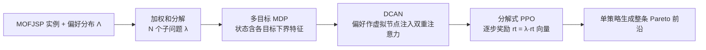

# Neural Multi-Objective Combinatorial Optimization for Flexible Job Shop Scheduling Problems

**会议**: ICLR 2026  
**OpenReview**: [https://openreview.net/forum?id=YAgOaYedLQ](https://openreview.net/forum?id=YAgOaYedLQ)  
**代码**: [https://github.com/ai-for-decision-making-tue/Neural_Multi-Objective_CO_for_FJSP](https://github.com/ai-for-decision-making-tue/Neural_Multi-Objective_CO_for_FJSP)  
**领域**: optimization  
**关键词**: 神经组合优化, 柔性作业车间调度, 多目标优化, 分解策略, 偏好条件注意力, PPO  

## 一句话总结
用**单个**偏好条件化的注意力网络 + 分解式 PPO，一次训练就能为多目标柔性作业车间调度（MOFJSP）生成覆盖各种 trade-off 的整条 Pareto 前沿，效果和速度都远超进化算法。

## 研究背景与动机
**领域现状**：神经组合优化（NCO）在单目标柔性作业车间调度（FJSP，主要优化 makespan）上已经做得很好，能用深度强化学习学出高质量调度策略且推理飞快。但现实工厂里往往要同时权衡多个互相冲突的指标——拖期（tardiness）、流程时间（flowtime）、成本（cost）等——而**多目标 FJSP（MOFJSP）几乎没人用 NCO 碰过**。

**现有痛点**：传统做法各有硬伤。把多目标加权求和当单目标解，得不到不同权衡下的备选方案，而合适权重又随实例和规模变化、难以事先确定；想直接对每个偏好各解一遍，可单目标 FJSP 本身就是 NP-hard，太贵；主流的多目标进化算法（NSGA-II、MOEA/D）则严重依赖手工调参和算子设计，且规模一大就慢得没法用。

**核心矛盾**：已有的多目标 NCO 方法基本都为路由问题（TSP/VRP）设计，**搬不到调度上**。路由用回合级稀疏奖励、实例级梯度、静态坐标状态，而调度决策视野长（操作数量多）会导致奖励延迟、图结构完全不同、需要分步奖励和更丰富的动态状态特征；少数针对 MOFJSP 的早期工作要么用简陋的向量状态、把动作限制成几条派遣规则，要么**每个偏好都要训一个单独的 actor 网络**，成本极高且只能处理固定的目标组合。

**本文目标**：用**一个**神经网络解通用 MOFJSP——支持任意目标及其任意组合，推理时直接喂偏好向量即可适配，无需重训。

**核心 idea**：**【分解 + 偏好条件化单网络】** 把 MOFJSP 按加权和分解成一组带不同偏好的子问题，设计一个把偏好向量当"虚拟节点"注入注意力的网络（DCAN），再用为多目标定制的分解式 PPO 训练，让单一策略随偏好变化输出整条 Pareto 前沿。

## 方法详解

### 整体框架
方法分三块：(1) 把 M 个目标用加权和分解成 N 个标量化子问题 $g(x|\lambda)=\sum_i \lambda_i f_i(x)$，每个偏好向量 $\lambda$ 对应前沿上一个权衡点；(2) 把调度建成多目标 MDP，每步选一个"操作-机器"对 $(O_{ij},M_k)$，并为每类目标设计基于"下界/上界"的分步奖励与状态特征；(3) 用偏好条件注意力网络 DCAN 学一个条件策略 $\pi_\theta(s,\lambda)$，配合分解式 PPO 训练，使单网络在不同 $\lambda$ 下生成对应权衡的解。

### 关键设计

**1. 基于下界的分步奖励，把"延迟奖励"难题拆成平滑信号**：调度决策视野很长，若只在回合末给目标值会造成奖励严重延迟。本文沿用并推广 DAN 的做法，对每个目标维护一个随调度单调变化的"质量度量" $H(\cdot)$，奖励定义为相邻两步度量之差 $r_t = H(s_t)-H(s_{t+1})$，给出比直接用目标值更平滑的学习信号。关键洞察是：只要目标在调度过程中**非递减**，就能用完成时间下界递推 $C(O_{ij},s_t)=C(O_{i(j-1)},s_t)+\min_{k\in M_{ij}}p^k_{ij}$ 来构造度量——makespan 取 $\max C$，拖期取 $\sum\max(C(O_{in_i},s_t)-D_i,0)$，流程时间维护下界 $F$，成本则用最低机器成本作下界；对**非递增**的提前完工（earliness），改为维护上界、同样用 $r_t$ 奖励上界下降。这套"下界/上界"配方因此可推广到几乎所有单调目标，也顺带把对应下界塞进状态特征，让策略能直接监控影响奖励的量。

**2. 加权和分解式 PPO，让逐步奖励在理论上对齐回合目标**：训练目标是找一个在实例分布 $\mathcal{S}$ 和偏好分布 $\Lambda$ 上都好的条件策略，即 $\pi^*_\theta=\arg\max_\pi \mathbb{E}_{\lambda\sim\Lambda,s_0\sim\mathcal{S}}[\sum_t \gamma^t \sum_i \lambda_i r_{t,i}]$。每步先拿向量奖励 $r_t$，再用当前偏好标量化成 $r_t=\lambda^\top r_t$ 喂给 PPO（clipped + GAE）。选加权和而非 Tchebycheff 分解有两个理由：加权和下逐步奖励之和恰好收敛到加权和的回合奖励（线性可加，理论对齐），而 Tchebycheff 非线性非可加做不到；且经验上加权和在 NCO 里反而和 Tchebycheff 持平甚至更好。训练时每 $N_B$ 回合换一批实例、**每个实例每回合都重采一个新偏好** $\lambda$，用海量实例 × 多样子问题防止过拟合到特定子问题。

**3. DCAN：把偏好当"人工节点"注入双重条件注意力**：作者先给一个直白基线 WI-DAN——把偏好向量直接拼到操作/机器特征上（$h_{O_{ij}}=[h_{O_{ij}}\|\lambda]$）再送进 DAN。更核心的是 DCAN，它在 DAN 的双重注意力（操作消息块 + 机器消息块）里各引入一个由偏好初始化的**虚拟嵌入** $h_\lambda$，像一个额外节点参与注意力。操作块更新为 $h^{l+1}_{O_{ij}}=\sigma\big(\sum_{p=j-1}^{j+1}\alpha_{(O_{ij},O_{ip})}Wh^l_{O_{ip}}+\alpha_{(O_{ij},\lambda_{ij})}Wh^l_{\lambda_{ij}}\big)$，注意力分数 $e_{(a,b)}=\text{LeakyReLU}(a^\top[Wh_a\|Wh_b])$；机器块类似，但分数额外拼入机器间"强度"度量 $c$，而偏好与机器间没有天然强度就取所有 $c$ 的均值。这些偏好虚拟节点**自身也在每层被更新**，从而逐层、按当前权衡动态调制操作-机器注意力——这正是 DCAN 比简单拼接的 WI-DAN 更能"吃透"不同子问题的原因。Critic 则为每个目标各输出一个价值估计（loss 在各目标分量上求和），让信用分配更细，但实验显示和单值 critic 差别不大，说明 critic 任务比 actor 简单得多。

## 实验关键数据

### 主实验表格
合成实例上以 CP-SAT 超体积为基准报告 gap（越低越好），下表摘录 makespan-costs 组合（greedy 推理）：

| 规模 | NSGA-II | MOEA/D | Hyper | WI-DAN | **DCAN** | DCAN(sample) |
|------|---------|--------|-------|--------|----------|--------------|
| 10×5 | 13.30% | 20.42% | 27.98% | 15.81% | 14.55% | 8.01% |
| 20×5 | 12.53% | 21.14% | 16.61% | 9.17% | **8.14%** | 6.09% |
| 15×10 | 26.33% | 39.73% | 23.85% | 17.23% | **16.44%** | 13.42% |
| 20×10 | 26.43% | 42.93% | 9.32% | 6.82% | **5.44%** | 4.07% |

tardiness-costs 的 20×10 上 DCAN greedy 仅 4.53%、sample 2.25%，而 NSGA-II/MOEA/D 高达 30.83%/50.24%。运行时间上，DCAN greedy 几秒级（20×10 约 6.6s），进化算法则要 1700–2900s，快约两到三个数量级。

### 消融实验表格
DCAN vs WI-DAN vs 超网络（Hyper，对应 Lin et al. 2022 / Su et al. 2024 风格的"每偏好一网络"）：

| 对比项 | Hyper | WI-DAN | **DCAN** |
|--------|-------|--------|----------|
| gap（越低越好） | 最高 | 居中 | **最低** |
| Pareto 集规模 | 偏小 | 居中 | **最大** |
| 网络数量 | 每偏好 1 个 | 单网络 | **单网络** |

### 关键发现
- **规模越大优势越明显**：在 20×10 上 DRL 策略 gap 比 MOEA/D 好约 50%，且对 CP-SAT 的差距随实例增大而缩小。
- **DCAN 一致优于 WI-DAN**，尤其 3 目标问题上能再降好几个百分点，并稳定生成**更大的 Pareto 集**，印证条件注意力更会利用分解子问题。
- **采样推理（每子问题采 10 个解）**进一步提升超体积和前沿规模，代价是更长但仍很短的运行时。
- **强泛化**：方法无需改动即可解 JSSP、柔性流水车间 FFSP，并能直接扩展到 4 目标（makespan-flowtime-earliness-costs），以及在 mk/rdata/edata/vdata 等标准 benchmark 上验证。

## 亮点与洞察
- **"偏好即虚拟节点"是个很优雅的条件化机制**：不改主干、不额外开网络，仅在注意力里加一个会被逐层更新的偏好节点，就把权衡信息渗透进每一步决策，比简单特征拼接（WI-DAN）和每偏好一网络（超网络）都更省更强。
- **"单调目标 → 下界/上界 → 分步奖励"是可复用的配方**：把延迟奖励问题转化为单调度量差分，覆盖 makespan/tardiness/earliness/flowtime/cost 五类常见目标，并能推广到任意非增/非减目标，是 NCO 调度的通用工程范式。
- **加权和分解的理论对齐有实证支撑**：逐步奖励之和收敛到回合加权和奖励，既解释了为何选加权和、也回应了 Tchebycheff "理论上能抓非凸前沿但实测不占优"的现象。

## 局限与展望
- **加权和分解理论上抓不到非凸 Pareto 前沿**：虽然实测加权和不输 Tchebycheff，但对强非凸前沿仍存在结构性盲区。
- **成本目标的定义偏构造化**：cost 被人为定义成与处理时间反相关，且在 rdata/edata/vdata 上因机器处理时间相同而退化为常数，真实有效目标数被削减，benchmark 的多目标性受限。
- **仍以 CP-SAT 超体积为"上界基准"**，DCAN 与之尚有几个百分点差距，且未在大规模真实工业排程（如半导体/铝业的超大实例）上验证。
- **偏好分布与采样策略对前沿覆盖度的影响**未深入分析，子问题数量（101/105）也是人工设定。

## 相关工作与启发
- **单目标 FJSP 的 NCO 谱系**：Song et al. (2022) 首个端到端 DRL + 异构图，Wang et al. (2023) 的 DAN（自注意力 + 交叉注意力）是当前 SOTA 架构，本文 DCAN/WI-DAN 都建立在 DAN 之上。
- **多目标路由 NCO**：Li et al. (2021) 分解 + 每子问题一网络、Lin et al. (2022) 用超网络映射权重到 actor 参数、Wang/Chen/Fan (2024–2025) 走单模型偏好条件化路线——这些思路启发了本文，但因路由用回合奖励 + 静态坐标状态而无法直接迁移到调度。
- **多目标进化算法**：MOEA/D（Zhang & Li 2007）的分解思想是本文加权和分解的理论母体，NSGA-II 则作为主要 baseline。
- **启发**：把"偏好条件注意力 + 分步下界奖励 + 分解式 PPO"这套组合拳推广到带时间窗/资源约束的更复杂排程、动态/随机 MOFJSP，或与 CP/启发式做 learning-to-search 混合，都很有想象空间。

## 评分
- **新颖性**: ⭐⭐⭐⭐ 首个用单网络解通用 MOFJSP 的 NCO 方法，"偏好作虚拟节点"的条件注意力和分步下界奖励配方都有原创性，填补了多目标调度 NCO 的空白。
- **实验充分度**: ⭐⭐⭐⭐ 覆盖多种规模、2/3/4 目标组合、多个标准 benchmark，并验证了 JSSP/FFSP 泛化，对比进化算法、超网络、CP-SAT，消融清晰；略欠真实工业大规模实例。
- **写作质量**: ⭐⭐⭐⭐ 动机层层递进、方法与理论动机（为何选加权和）交代充分，公式与算法伪代码完整易跟。
- **价值**: ⭐⭐⭐⭐ 实用导向强——一次训练即可推理时按偏好生成整条 Pareto 前沿且快两三个数量级，对制造业多准则排程有直接落地价值。

<!-- RELATED:START -->

## 相关论文

- [\[ICLR 2026\] Multi-Action Self-Improvement for Neural Combinatorial Optimization](multi-action_self-improvement_for_neural_combinatorial_optimization.md)
- [\[ICLR 2026\] Gradient-Based Diversity Optimization with Differentiable Top-$k$ Objective](gradient-based_diversity_optimization_with_differentiable_top-k_objective.md)
- [\[ICLR 2026\] Toward Principled Flexible Scaling for Self-Gated Neural Activation](toward_principled_flexible_scaling_for_self-gated_neural_activation.md)
- [\[ICML 2026\] Accelerated Multiple Wasserstein Gradient Flows for Multi-objective Distributional Optimization](../../ICML2026/optimization/accelerated_multiple_wasserstein_gradient_flows_for_multi-objective_distribution.md)
- [\[NeurIPS 2025\] Rethinking Neural Combinatorial Optimization for Vehicle Routing Problems with Different Constraint Tightness Degrees](../../NeurIPS2025/optimization/rethinking_neural_combinatorial_optimization_for_vehicle_routing_problems_with_d.md)

<!-- RELATED:END -->
