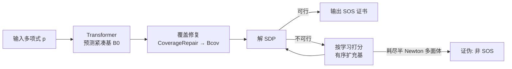

# Neural Sum-of-Squares: Certifying the Nonnegativity of Polynomials with Transformers

**会议**: ICLR 2026  
**OpenReview**: [https://openreview.net/forum?id=PAV5zYn0Hn](https://openreview.net/forum?id=PAV5zYn0Hn)  
**代码**: [https://github.com/ZIB-IOL/Neural-Sum-of-Squares](https://github.com/ZIB-IOL/Neural-Sum-of-Squares)  
**领域**: 学习增强优化 / Sum-of-Squares 编程 / 计算代数  
**关键词**: SOS 证书, 半定规划(SDP), 单项式基, Transformer, Algorithms with Predictions  

## 一句话总结
用 Transformer 预测多项式的「紧凑单项式基」来大幅缩小 SOS 证书对应的半定规划(SDP)规模，再配一套带正确性保证的修复+扩展回退机制，使非负性证明相比 SOTA 求解器加速 100×~2000×。

## 研究背景与动机
- **领域现状**：判定一个多项式是否处处非负是 NP-hard 问题，广泛出现在非凸优化、控制、机器人等领域。一个充分条件是 Sum-of-Squares(SOS)：若 $p(x)=\sum_i h_i(x)^2$ 则必非负。Parrilo 证明 SOS 可化为半定规划——$p$ 是 SOS 当且仅当存在 PSD 矩阵 $Q$ 使 $p(x)=z(x)^\top Q\, z(x)$，其中 $z(x)$ 是单项式向量。
- **现有痛点**：SDP 的维度随单项式基的大小**二次增长**。标准做法取「半次数以内的全部单项式」作为基 $z(x)$，规模极大；现有基约简方法(Newton 多面体剪枝、对角一致性检查、TSSOS 的项稀疏)虽能裁掉一些冗余单项式，但**给出的基仍远非最小**，且 Newton 多面体本身的构造在高维高次时也很昂贵。
- **核心矛盾**：基越小 SDP 越快，但找近最小基本身是困难的(真正最小基的复杂度仍是开放问题)；而机器学习虽能找到更小的基，预测却**不精确**——漏掉关键单项式会让本该可行的 SDP 变得不可行，破坏正确性。
- **本文目标**：把「基选择」当作预测任务，用学习方法找到比规则法更紧凑的基，同时**不牺牲证明的正确性保证**(有 SOS 一定找得到，没有则在全基上证伪)。
- **核心 idea**：**[学习放在上游 + 验证保正确]** 训练 Transformer 预测紧凑基以缩小 SDP，把不可靠的 ML 预测包进一个「覆盖修复 + 有序扩展 + SDP 验证」的回退管线里，落入 Algorithms-with-Predictions 框架——预测准则快，预测错最多多付常数倍代价。

## 方法详解

### 整体框架
给定多项式 $p$，先用 Transformer 预测一个紧凑单项式基 $B_0$；检查它是否满足 SOS 基的必要结构条件(覆盖性)，不满足则贪心修复得到 $B_{cov}$；用 $B_{cov}$ 解 SDP，若可行即得证书，若不可行则按学习打分有序地逐步扩充基、反复解 SDP，直到找到可行解或耗尽候选(此时证伪)。整条管线的正确性由「最坏情况退化为全基的标准 Newton 多面体方法」兜底。

### 关键设计

**1. 逆向采样造数据 + 序列化预测：把基选择变成可监督的生成任务。** 训练需要「多项式 $p$ ↔ 近最小基 $B$」的配对，但正向求近最小基本身就难，于是作者反过来构造：先采一个单项式集合 $B\subseteq M_d$，再采一个 $Q\succeq 0$，直接令 $p(x)=z_B(x)^\top Q\,z_B(x)$——这样 $B$ 天然是 $p$ 的合法 SOS 基，且通过让 $Q$ 覆盖稠密满秩/稀疏/块对角/低秩四类结构、并改变变量数、次数、项数，得到逼近理论下界(Lemma 7/8 给出的最小基下界)的近最小基,共生成超 1 亿条样本。预测端把多项式 tokenize 成「系数(C前缀)+各变量指数(E前缀)」序列，Transformer 自回归地用 SEP 分隔逐个吐出基单项式直到 EOS，即 $\mathrm{TRANSFORMER}(p)\mapsto B\subseteq \tfrac12 N(p)\cap\mathbb{Z}^n_{\ge0}$；单项式 embedding 把每个 token 映成向量、显著缩短序列长度，也是跨变量数泛化的关键。

**2. 覆盖性必要条件 + 贪心修复：先保证基"装得下"多项式再去解 SDP。** Lemma 2 给出任意合法 SOS 基必须满足的结构约束：$p$ 的单项式支撑必须被基的两两乘积覆盖，即 $S(p)\subseteq B\cdot B$，其中 $B\cdot B=\{m_i m_j: m_i,m_j\in B\}$。例如 $p=4x_1^4+12x_1^2x_2^2+9x_2^4+1$ 的支撑含 $x_2^4$，若预测基 $B=\{1,x_1^2,x_1x_2\}$ 的两两乘积里没有 $x_2^4$ 就一定不可行。这一步无需解 SDP 即可廉价地发现"漏项"，对漏掉的支撑用 `COVERAGEREPAIR` 贪心地加入「能补上最多缺失项」的单项式(如补 $x_2^2$ 以覆盖 $x_2^4$)，直到 $S(p)\subseteq B\cdot B$ 成立，得到可送求解的 $B_{cov}$。

**3. 置换打分驱动的有序扩展 + 复杂度保证：把不确定的预测变成有界代价的搜索。** 若 $B_{cov}$ 仍解不出可行 SDP，需要从候选池 $\tfrac12 N(p)$ 继续加单项式。作者利用「Transformer 对变量置换不等变」这一性质设计打分：对多项式做 $L$ 个随机变量置换 $\{\pi_1,\dots,\pi_L\}$ 各跑一次模型，按单项式在(还原置换后的)预测里出现的频率打分 $\mathrm{SCORE}(u,p)=\frac1L\sum_{i=1}^L \mathbf{1}[u\in\pi_i^{-1}(B_{\pi_i})]$(默认 $L=4$，超过 8 收益递减)。把候选按分数降序排在 $B_{cov}$ 之后，依调度 $m_1<\cdots<m_k=|\tfrac12 N(p)|$ 逐级取前 $m_t$ 个解 SDP，可行即停。理论上：设单 SDP 代价 $\Theta(m^\omega)$，定义覆盖秩 $\eta$ 为「使前 $j$ 个单项式构成合法基」的最小下标，最坏退化为全基(最多 $O(k)$ 倍标准代价)；采用几何扩展(每次 ×$\rho$)时只需至多 $1+\lceil\log_\rho(\eta/m_1)\rceil$ 次 SDP，从而即使预测完全错误也只多付常数倍代价，预测越准早停越快。

## 实验关键数据

### 主实验：与基方法对比(平均基大小 / 求解时间 s，节选 dense & sparse)

| 结构 | $n$ | $d$ | $m$ | $\lvert B^*\rvert$ | Ours 基 | Newton 基 | Ours 时间 | Newton 时间 | 加速 |
|------|----|----|----|----|----|----|----|----|----|
| dense | 8 | 20 | 30 | 28 | 38 | 32 | 3.4 | 309.4 | 91× |
| dense | 6 | 20 | 60 | 58 | 89 | 236 | 18.3 | 1629.6 | 89× |
| sparse | 8 | 20 | 30 | 26 | 27 | 28 | 0.62 | 15.3 | 25× |
| sparse | 6 | 20 | 60 | 56 | 73 | 233 | 7.39 | 1606.4 | **217×** |

加速覆盖 0.7×~300×+；全基方法(Full)在大实例上普遍超时。仅在最小实例($n=4,d=6$)上略逊于 Newton。

### 大规模 / SOTA 求解器对比(平均时间 s，"–"=OOM/超时)

| 配置 | Ours | SumOfSquares.jl | TSSOS | Chordal |
|------|------|------|------|------|
| 6 变量, 度 20 | 5.64 | 119.98 | 86.53 | 105.54 |
| 8 变量, 度 20 | **1.46** | 3037.85 | 2674.50 | 3452.98 |
| 6 变量, 度 40 | 42.8 | – | – | – |
| 100 变量, 度 10 | 18.3 | – | – | – |

8 变量度 20 上较 SoS.jl/TSSOS 加速 >2000×；最大实例上所有 baseline 都 OOM/超时，本方法 60 秒内完成。

### 关键发现
- **加速来自缩基而非更快求解器**：本方法与 baseline 用同一 SDP 求解器(MOSEK/SCS)，加速完全源于更紧凑的基把 SDP 维度压下来；基越小($\lvert B\rvert$ 越接近 $\lvert B^*\rvert$)，加速越显著(稀疏 6 变量度 20 达 217×)。
- **可扩展到此前不可解的规模**：100 变量度 10、6 变量度 40 这类实例，所有传统求解器 OOM/超时，本方法均在分钟级完成，真正把 SOS 编程的实用边界往外推。
- **正确性零妥协**：得益于覆盖修复 + 有序扩展，即便预测漏项也不会误判，最坏退化为标准全基方法，速度换来的不是精度损失。

### 消融与机理分析

| 维度 | 关键发现 |
|------|----------|
| 纯 Transformer 预测(无修复) | 稀疏/块对角成功率 85–95%；稠密/低秩失败率高(复杂实例近 100%)——凸显修复必要性 |
| 修复策略 | 贪心修复以极小开销拿到高 exact-match；置换修复降低 insufficient 但增 superset；**组合修复** insufficient 率最低 |
| 时间分布 | 除最小问题(SDP 占 55%)外，SDP 求解占 75–80% 总时间，Transformer 推理+修复开销可控 |
| 分布偏移 | 仅在度 12 上训练，仍能预测度 20 的基(单项式 embedding 带来组合泛化) |
| 架构无关性 | 固定 5 小时训练预算下 LSTM/Mamba 也可用，Mamba 与 Transformer 竞争力相当 |

## 亮点与洞察
- **把 ML 用在"上游选基"而非"直接判定"**：与同期用 LLM 直接做 SOS 推理的工作正交，预测错也不影响正确性，是 Algorithms-with-Predictions 在计算代数上的首个落地。
- **覆盖性必要条件**($S(p)\subseteq B\cdot B$)是廉价的"预检"——不用解 SDP 就能发现并修补漏项，把昂贵验证留到最后。
- **利用模型缺陷反而成了特性**：Transformer 对变量置换不等变本是弱点，作者用多置换投票把它变成稳健的单项式打分信号。
- 单项式 embedding 让模型在变量数、未见次数上都能组合泛化，是跨规模迁移的关键。

## 局限与展望
- 纯预测在**稠密/低秩**多项式上失败率高(最复杂时近 100%)，重度依赖修复兜底，紧凑性收益在这些结构上打折。
- 置换打分需对每个实例跑 $L$ 次 Transformer，并依赖"不等变"这一并非可控的性质。
- 真正最小基的计算复杂度仍开放，方法只能逼近理论下界而非保证最小。
- 一次性训练成本(1 亿样本)需要靠大量实例的求解加速来摊销，对低频/小规模使用者性价比有限。
- 未来可探索等变更强或更适配的序列模型(Mamba 已显竞争力)与控制/机器人中的实际约束 SOS 问题。

## 相关工作与启发
- **SOS 理论根基**：Parrilo(2003)、Lasserre(2001) 把多项式优化转成 SDP；本文站在其上做上游基约简。
- **规则法基约简**：Newton 多面体剪枝(Reznick 1978)、对角一致性(Lofberg 2009)、TSSOS/Chordal 项稀疏(Wang et al.)——本文用学习预测替代/补充这些启发式。
- **Algorithms with Predictions**(Roughgarden 2021)：为「整合不精确预测同时保最坏情况保证」提供理论框架，是本文回退机制的理论母体。
- **计算代数 × ML**：复用 Kera et al.(2025b) 的多项式 tokenization 与序列生成，启发把更多符号计算/代数判定问题包装成"预测+验证"管线。

## 评分
- **新颖性**: ⭐⭐⭐⭐⭐ 首个把学习增强算法用到 SOS 编程、且"预测放上游+验证保正确"的范式干净漂亮，覆盖性预检与置换打分都是有巧思的设计。
- **实验充分度**: ⭐⭐⭐⭐ 200+ benchmark、四类结构、对比 SOTA 求解器、含修复/分布偏移/架构消融与理论复杂度分析，证据扎实；稠密/低秩上的局限也如实暴露。
- **写作质量**: ⭐⭐⭐⭐⭐ 用统一的 running example 贯穿全文，方法、引理、修复过程都讲得清楚直观。
- **价值**: ⭐⭐⭐⭐⭐ 在保证正确性的前提下把 SOS 证明加速 2~3 个数量级，并解出原本 OOM/超时的实例，对控制/机器人/多项式优化有直接实用价值。

<!-- RELATED:START -->

## 相关论文

- [\[ICLR 2026\] Learning to Recall with Transformers Beyond Orthogonal Embeddings](learning_to_recall_with_transformers_beyond_orthogonal_embeddings.md)
- [\[ICLR 2026\] Markovian Transformers for Informative Language Modeling](markovian_transformers_for_informative_language_modeling.md)
- [\[ICLR 2026\] Cutting the Skip: Training Residual-Free Transformers](cutting_the_skip_training_residual-free_transformers.md)
- [\[ICML 2026\] Towards Understanding Adam Convergence on Highly Degenerate Polynomials](../../ICML2026/optimization/towards_understanding_adam_convergence_on_highly_degenerate_polynomials.md)
- [\[NeurIPS 2025\] Least Squares Variational Inference](../../NeurIPS2025/optimization/least_squares_variational_inference.md)

<!-- RELATED:END -->
