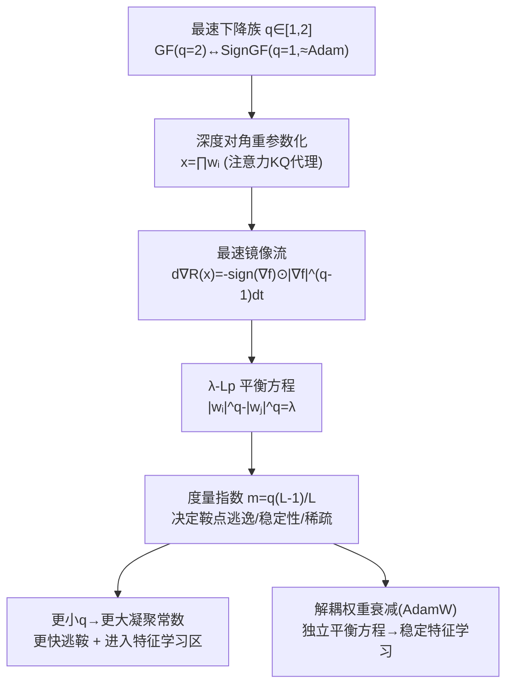

# Never Saddle for Reparameterized Steepest Descent as Mirror Flow

**会议**: ICLR 2026  
**OpenReview**: [https://openreview.net/forum?id=YgudIlQ9nC](https://openreview.net/forum?id=YgudIlQ9nC)  
**代码**: 待确认  
**领域**: optimization  
**关键词**: 最速下降, 镜像流, 隐式偏置, 鞍点逃逸, 特征学习, AdamW, 权重衰减, 对角线性网络  

## 一句话总结
本文提出"最速镜像流(steepest mirror flow)"统一框架，把重参数化下的 SignGF(≈Adam)到 GF(≈SGD)的整族最速下降算法都纳入镜像流视角，从几何上解释了为何更陡的下降能更快逃离鞍点、更好地学到稀疏特征，从而说明了 Adam/AdamW 在微调任务上常优于 SGD 的两个机制。

## 研究背景与动机
**领域现状**：在过参数化、高度非凸的深度学习目标里，优化器的选择不只是收敛快慢的问题——不同算法会收敛到泛化性、稀疏性、鲁棒性截然不同的解。一个被广泛使用的几何视角是：梯度流(GF)下的过参数化可以诱导出一个"镜像流(mirror flow)"，从而改变优化真正发生的有效几何，并解释隐式正则、对称性与平衡约束如何塑造最终解。

**现有痛点**：然而几乎所有这类理论都围绕梯度下降/梯度流展开，而现代微调实践恰恰是另一番景象——小学习率的 (S)GD 常常表现不佳，反倒是 Adam/AdamW 更稳更强。为什么自适应方法在微调里这么好用、它们偏爱什么样的解，理论上还说不清楚。

**核心矛盾**：微调为避免灾难性遗忘必须用小学习率，但已有理论指出 GF 想逃离鞍点需要"时间重标定"即大学习率——这两件事直接打架。换句话说，在小学习率微调场景下，GF 视角根本无法解释优化器是怎么逃出鞍点、学到特征的。

**本文目标**：把镜像流分析从梯度流推广到整族最速下降算法，刻画优化几何如何决定学习动力学、隐式偏置与稀疏性，并据此解释 Adam/AdamW 优于 SGD 的根源。

**核心 idea**：**用一个参数 $q\in[1,2]$ 把 GF($q=2$)和 SignGF($q=1$，Adam 的代理)连成一条最速下降族，证明重参数化把它们都诱导成"最速镜像流"，而几何里的"度量指数(metric exponent)"决定了鞍点逃逸难度——越陡($q$ 越小)逃得越快、越能进入特征学习区。**

## 方法详解

### 整体框架
本文研究的是**重参数化 + 最速下降**两件事叠加后诱导出的动力学。出发点是 $L_p$ 范数下的最速流 $dx_t=-\mathrm{sign}(\nabla_x f)\odot|\nabla_x f|^{q-1}dt$（其中 $\frac1p+\frac1q=1$，$q=2$ 是 GF，$q=1$ 是 SignGF）。当把目标里的变量 $x$ 写成深度对角重参数化 $x=g(w)=\prod_{i=1}^L w_i$（这是注意力中 $KQ$ 乘积的对角代理），最速流就被改写成一个"最速镜像流"$d\nabla_x R(x_t)=-\mathrm{sign}(\nabla_x f)\odot|\nabla_x f|^{q-1}dt$，其中勒让德函数 $R$ 完全由重参数化保留的平衡方程决定。整套分析的难点在于：GF 活在有内积的 Hilbert 空间，而一般最速下降只有范数、活在 Banach 空间，失去了内积结构，需要重新建立收敛与几何刻画。

### 关键设计

**1. 最速镜像流与 Banach 空间下的收敛保证：把 Adam 装进镜像流框架**。本文把整族最速下降统一写成关于 $L_p$ 范数的最速流 $dx_t=-\mathrm{sign}(\nabla_x f)\odot|\nabla_x f|^{q-1}dt$，$q$ 从 1 到 2 平滑插值 SignGF 与 GF。由于丢掉了内积，传统镜像流的隐式偏置刻画(Theorem 3.4)在 $p\neq2$ 时不再成立，本文转而用"逆 Hessian 有正下界"的凝聚性(inverse $\mu$-coercivity，$x^\top\nabla^2 R^{-1}(x)x\ge\mu\|x\|^2$)来建立收敛：只要 $R$ 可分且逆 $\mu$-凝聚、梯度有界，损失就以 $\int_0^\infty\|\nabla f\|^2 dt\le (f(x_0)-f(x_\infty))/(\mu B^{2-q})$ 衰减，强凸时还能给出线性收敛率。关键洞察是——这个凝聚常数 $\mu$ 恰好对应"逃离鞍点集有多难"，从而把抽象收敛理论和具体的鞍点逃逸现象绑在了一起。

**2. $\lambda$-$L_p$ 平衡方程与度量指数：几何如何决定逃鞍速度**。深度对角重参数化天然带有额外鞍点集 $S$（多个 $w_i$ 同时为零处），小初始化天然贴着 $S$。本文证明最速下降会保持一个推广的平衡不变量 $|w_i|^q-|w_j|^q=(|w_{i,0}|^q-|w_{j,0}|^q)\exp(-q\int_0^t\alpha_s ds)$，称为 $\lambda$-$L_p$-balanced。把它代回去就能解析地写出镜像流的度量，$L=2$ 时 $\nabla^2 R_{L_p,2}(x)=1/\sqrt{4|x|^q+\lambda^2}$，并定义"度量指数"$m=q\frac{L-1}{L}$。核心结论是：相同初始化对不同 $p$ 对应的有效 $\lambda$ 差异巨大——按 Corollary 4.10，初始化 $w_1=0,w_i=\lambda$ 时凝聚常数 $\mu=\lambda^{q(L-1)}$，**$q$ 越小、$\lambda$ 越大，凝聚常数越大、逃鞍越快**。直观上(图 3)，越小的 $q$ 让参数能更快"绕出"原点，这正是 SignGF 比 GF 快的几何根源；而大度量指数($m>1$)则意味着初始指数级减速甚至有限时间爆炸的全局不稳定。

**3. 度量指数划定 GF 与 SignGF 的稳定性鸿沟**。Lemma 4.13 在 $\lambda=0$ 时给出 $R_{L_p,L}$ 的显式形式：$m=1$ 时是熵型 $\sum x_j\log x_j$，$m\neq1$ 时是幂型；并且只有当 $m=q\frac{L-1}{L}\le1$ 时 $R$ 才是合法 Bregman 函数。由此得到 Corollary 4.14 的关键分水岭：对 GF($p=2$)只有 $L=2$ 才合法，而对 SignGF($p=\infty$)所有深度 $L\ge2$ 都合法。这意味着 GF 在更深网络上平衡初始化时根本不满足光滑性条件、动力学会冲出边界变得不稳定；SignGF 则被 Bregman 函数的边界"框住"，全局稳定。换言之，**更陡的下降(SignGF)在深网络里既能逃鞍又保持稳定，这是 GF 做不到的**。

**4. 解耦权重衰减(AdamW)诱导不同的流形正则，稳住特征学习**。本文进一步用流形上的正则刻画权重衰减的几何效应：解耦权重衰减在平衡初始化下诱导的流形正则为 $\frac{L}{L(2-q)+q}\sum|x_i|^{2-q\frac{L-1}{L}}$。由此 Example 4.17 给出反直觉结论：对 SignGF($q=1$)要诱导 $L_1$ 稀疏需要 $L\to\infty$，即**解耦权重衰减要靠更深的重参数化才会变稀疏**；这与耦合权重衰减恰好相反——耦合下高深度会导致极端稀疏甚至性能崩塌(Kolb et al.)。Table 1 系统对比了 $L=2$ 与 $L=\infty$、耦合与解耦下的正则形式($L_1$/log/幂型)。关键含义是：AdamW 用一套独立于 GF 的平衡方程，把 $\lambda$ "足够快"地压到 0 来开启特征学习，却不会把动力学推进高指数($m>1$)的不稳定区，从而稳定地学特征——这正是 AdamW 优于 SGD 的第二个机制。

## 实验关键数据

### 主实验：微调验证精度
在标准视觉/语言微调任务上对比小学习率 SGD、调优大学习率 SGD 与小学习率 Adam（95% 置信区间）：

| 模型 | 微调任务 | SGD (lr≪1) | SGD (lr>0) | Adam (lr≪1) |
|------|----------|-----------|-----------|-------------|
| ResNet-18 | CIFAR-10 | 19.15 ± 2.82 | 93.60 ± 0.38 | **95.19 ± 0.21** |
| ResNet-18 | Flowers | 1.22 ± 0.53 | 62.13 ± 1.10 | **80.50 ± 1.38** |
| ViT-large | CIFAR-10 | 73.27 ± 3.68 | 99.07 ± 0.35 | **99.28 ± 0.07** |
| ViT-large | Flowers | 1.03 ± 0.82 | 98.94 ± 0.05 | **99.37 ± 0.08** |
| Bert-base | MRPC | 43.87 ± 24.02 | 84.80 ± 1.00 | **85.95 ± 0.64** |

小学习率 SGD 几乎学不动(被鞍点困住)，而小学习率 Adam 即便对比调优后的大学习率 SGD 也全面占优。

### 消融实验：几何预测与稀疏行为

| 实验设置 | 观测 | 对应理论 |
|----------|------|----------|
| 对角线性网回归 ($k=300,n=100,L=3$) | GF 小 lr 逃鞍显著慢于 SignGF，深度越大越明显 | Thm 4.2 / Cor 4.10 |
| 二分类 ($k=80$，稀疏真值) | 深度越高 $L_\infty$-margin 越能恢复稀疏真值 | Cor 4.13 |
| ResNet-18 微调后 Hessian top-50 特征值 | Adam 负特征值更少更弱(更彻底离开鞍点)，SGD 小 lr 困在鞍点 | 鞍点逃逸机制 |
| ResNet-50 / ImageNet 重参数化训练 | AdamW 仅在很深重参数化+足够大权重衰减下才稀疏 | Table 1 / Example 4.17 |

### 关键发现
- 微调里"鞍点逃逸"是核心挑战，且 Adam 式陡下降在小学习率下也能逃鞍并稳定学特征；
- 解耦(AdamW)与耦合权重衰减表现出预测中的稀疏-稳定权衡：解耦要更深才稀疏，耦合则深度一高就极端稀疏/不稳；
- 几何诱导的 margin 依赖深度，超出了以往与深度无关的 $L_\infty$-margin 刻画。

## 亮点与洞察
- **把"为什么 Adam 在微调里赢"归因到纯几何机制**：不靠大学习率、不靠噪声扰动，单凭最速下降族的几何(度量指数/凝聚常数)就能逃鞍，这是与已有逃鞍机制不同的新解释。
- **统一视角的张力很美**：一个 $q\in[1,2]$ 同时把收敛速度、隐式稀疏偏置、稳定性、权重衰减效应都串起来，且揭示"相同初始化对不同 $p$ 对应天差地别的有效 $\lambda$"这一容易被忽略的点。
- **耦合 vs 解耦权重衰减的稀疏方向相反**——SignGF 下解耦反而需要更深才稀疏，纠正了"权重衰减一定促稀疏"的朴素直觉。

## 局限与展望
- 理论核心建立在**深度对角线性重参数化**上(注意力 $KQ$ 的对角简化代理)，真实非对角、非线性网络的动力学是否完全遵循同样的度量指数规律仍需进一步验证；
- 分析针对连续时间流(学习率 $\to0$)，离散步长、随机性与动量的完整刻画只在附录部分触及；
- $L_p$ 最速流的解在 Filippov 意义下不唯一，隐式偏置在 $p\neq2$ 时无法像 GF 那样精确刻画，只能做定性结论(逃鞍/稳定/稀疏)，定量隐式偏置仍是开放问题。

## 相关工作与启发
- **镜像流与重参数化**(Li et al. 2022; Woodworth et al. 2020)：本文把仅适用于 Hilbert 空间梯度流的镜像流理论推广到 Banach 空间的最速流，是对该脉络的实质性扩展。
- **最速下降与 max-margin**(Tsilivis et al. 2025; Zhang et al. 2024 对 Adam)：已有 $L_\infty$-margin 刻画与深度无关，本文指出真实 margin 通过度量指数依赖深度，补全了几何视角。
- **重参数化诱导稀疏**(Ziyin & Wang 2022; Kolb et al. 2025)：本文区分了耦合/解耦权重衰减在稀疏方向上的相反行为，是对这条线的重要澄清。
- **启发**：优化器设计可以被看成"挑选几何/度量指数"的问题——想要稳定的特征学习，与其调学习率，不如从重参数化深度与权重衰减形式上去调有效几何。

## 评分
- **新颖性**: ⭐⭐⭐⭐⭐ 首次把整族最速下降(含 Adam 代理)纳入 Banach 空间的镜像流框架，并用度量指数统一解释逃鞍/稀疏/稳定，视角原创。
- **实验充分度**: ⭐⭐⭐⭐ 从对角线性网到 ResNet/ViT/Bert 微调与 ImageNet 稀疏训练都有验证，覆盖面好；但主体仍是理论驱动，真实大模型上的机制验证偏少。
- **写作质量**: ⭐⭐⭐⭐ 理论脉络清晰、图示直观(度量指数/平衡曲线)，但 Banach 空间、Legendre/Bregman、凝聚性等概念密集，门槛较高。
- **价值**: ⭐⭐⭐⭐⭐ 给"Adam 为何在微调里优于 SGD"提供了可证明的几何机制，对理解自适应优化器与重参数化设计有实质指导意义。

<!-- RELATED:START -->

## 相关论文

- [\[ICML 2026\] Mirror Descent Under Generalized Smoothness](../../ICML2026/optimization/mirror_descent_under_generalized_smoothness.md)
- [\[ICLR 2026\] Saddle-to-Saddle Dynamics Explains A Simplicity Bias Across Neural Network Architectures](saddle-to-saddle_dynamics_explains_a_simplicity_bias_across_neural_network_archi.md)
- [\[ICLR 2026\] High-dimensional Mean-Field Games by Particle-based Flow Matching](high-dimensional_mean-field_games_by_particle-based_flow_matching.md)
- [\[ICML 2025\] Learning Mixtures of Experts with EM: A Mirror Descent Perspective](../../ICML2025/optimization/learning_mixtures_of_experts_with_em_a_mirror_descent_perspective.md)
- [\[ICML 2026\] Bregman meets Lévy: Stochastic Mirror Descent with Heavy-Tailed Noise in Continuous and Discrete Time](../../ICML2026/optimization/bregman_meets_lévy_stochastic_mirror_descent_with_heavy-tailed_noise_in_continuo.md)

<!-- RELATED:END -->
