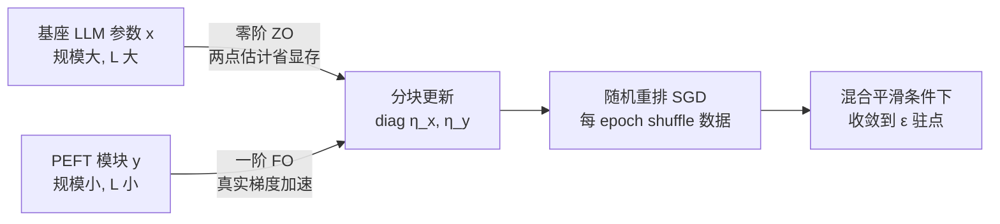

# New Hybrid Fine-Tuning Paradigm for LLMs: Algorithm Design and Convergence Analysis Framework

**会议**: ICLR 2026  
**OpenReview**: [https://openreview.net/forum?id=avgMb57IP5](https://openreview.net/forum?id=avgMb57IP5)  
**代码**: 待确认  
**领域**: 优化理论 / LLM 微调  
**关键词**: 混合微调, 零阶优化, 一阶优化, PEFT, 广义平滑, 随机重排 SGD, 收敛分析  

## 一句话总结
本文提出一种"混合微调"范式——用零阶优化更新庞大的基座 LLM、用一阶梯度更新轻量 PEFT 模块，并针对两类参数平滑度差异巨大的现象提出"混合平滑条件"，首次给出广义平滑下随机重排 SGD 在多学习率下的最优收敛保证。

## 研究背景与动机
**领域现状**：当前 LLM 微调主要有两条路线。一是全参数微调（含零阶全参微调 ZO-FT，用有限差分估计梯度以省显存），二是参数高效微调（PEFT，如 Prompt/Prefix/LoRA，只调一小撮参数、冻结基座）。

**现有痛点**：两条路线各有硬伤。全参微调（即便是零阶版本）要么计算/显存昂贵，要么因缺乏真实梯度信息而收敛极慢；PEFT 虽然便宜，却被多篇工作（Gudibande et al. 2023; Ghosh et al. 2024）指出"学不进新知识"，性能天花板偏低。

**核心矛盾**：想同时拿到全参微调的"学新知识能力"和 PEFT 的"高效率"，就必须让基座 LLM 和 PEFT 模块同时更新——但这两类参数的优化地形天差地别。作者通过可视化（图 1）发现两个关键事实：(a) 梯度 Lipschitz 常数 $L$ 在训练中**动态变化**、随梯度范数近似线性增长；(b) 基座 LLM 的 $L$ 远大于随机初始化的 LoRA 模块，二者**异构**。传统 $L$-平滑（$\nabla^2 f \preceq L I_d$）假设单一、静态的常数，根本刻画不了这种地形，导致经典 SGD 收敛分析在此失效。

**本文目标**：(1) 设计能兼得二者优点的微调算法；(2) 建立能准确刻画该异构地形的理论框架，给出严格收敛保证。

**核心 idea**：**[ZO 调基座 + FO 调 PEFT]** 用零阶优化更新基座（避开全梯度、省显存），用一阶梯度更新小巧的 PEFT（加速收敛），并为两类参数配**不同学习率**；理论上用"混合平滑条件"统一刻画动态性与异构性。

## 方法详解

### 整体框架
把参数空间显式切成两块：基座 LLM 参数 $x\in\mathbb{R}^{d_x}$ 与 PEFT 模块参数 $y\in\mathbb{R}^{d_y}$，目标是最小化经验损失 $f(x,y)=\frac1n\sum_{i=1}^n f(x,y;i)$。每一步对 $x$ 用零阶梯度估计、对 $y$ 用真实一阶梯度，并用一个分块对角的学习率矩阵 $\mathrm{diag}(\eta_x,\eta_y)$ 同时更新，整套流程跑在标准的随机重排 SGD 框架里。算法的"工程实现很直观，难点全在收敛证明"，因此本文的真正贡献是把这套混合更新放进一个新的平滑度刻画下证明其最优性。

### 关键设计

**1. 混合更新规则：ZO 与 FO 的分工协作。** 算法核心是一条分块更新式 $\begin{bmatrix} x_{t,i}\\ y_{t,i}\end{bmatrix} \leftarrow \begin{bmatrix} x_{t,i-1}\\ y_{t,i-1}\end{bmatrix} - \begin{bmatrix}\eta_x & 0\\ 0 & \eta_y\end{bmatrix}\begin{bmatrix}\hat\nabla_x f\\ \nabla_y f\end{bmatrix}$。其中基座方向用两点零阶估计 $\hat\nabla_x f(x,y;\xi)=\frac{f(x+\mu v,y;\xi)-f(x,y;\xi)}{\mu}\,v$（$v\sim\mathcal N(0,I_{d_x})$，$\mu$ 为扰动步长），只需两次前向、无需对庞大基座反传，因此**显存开销与纯 FO-PEFT 持平**；而 PEFT 方向 $\nabla_y f$ 用真实反传梯度，把零阶估计固有的高方差、慢收敛限制在小参数块内。这种分工让"学新知识"的活由能动整个基座的 ZO 来干，"快"的活由信息充分的 FO 来干。

**2. 混合平滑条件：刻画动态且异构的地形。** 为了让收敛分析能落地，作者把广义平滑（Zhang et al. 2019; Li et al. 2024）推广到分块形式。定义：存在两个非负、非降的次二次函数 $\ell_x,\ell_y$，使得对所有 $(x,y)$ 有 $\begin{bmatrix}\ell_x(\|\nabla f\|)I_{d_x} & 0\\ 0 & \ell_y(\|\nabla f\|)I_{d_y}\end{bmatrix}\succeq \nabla^2 f(x,y)$。这一条件同时抓住两件事：平滑界**随当前梯度范数变化**（对应动态 $L$），且 $x$ 块与 $y$ 块**各有各的平滑函数**（对应异构 $L$）。标准 $L$-平滑只是其中 $\ell_x=\ell_y=L$ 的退化特例。它解释了一个关键实验现象（图 2）：若给基座配大学习率会发散爆炸，配小学习率又让 PEFT 收敛奇慢——唯有"基座小步、PEFT 大步"的非对称学习率才兼顾稳定与速度。

**3. 多学习率下随机重排 SGD 的最优收敛保证。** 在 coercive、下有界、二阶可微（假设 1）与有界方差（假设 2）下，作者证明了主定理：当两路学习率分别取 $\eta_x\le\min\{O(\frac{1}{L_x n d_x}),\,O(\frac{1}{\sqrt{T}nL_{x,\max}})\}$、$\eta_y\le\min\{O(\frac{1}{L_y n}),\,O(\frac{1}{\sqrt{T}nL_{y,\max}})\}$，且 epoch 数 $T\ge O(\epsilon^{-2}/\delta+\epsilon^{-4}/n)$ 时，以至少 $1-\delta$ 概率有 $\frac1T\sum_{t<T}\mathbb E\|\nabla f(x_t,y_t)\|^2\le\epsilon^2$。总梯度复杂度 $nT\ge O(\epsilon^{-2}n/\delta+\epsilon^{-4})$ 在 $\epsilon$ 足够小时**达到已知下界**（Arjevani et al. 2023），与广义平滑及 $L$-平滑非凸情形的最优上界一致。学习率上界中 $\eta_x,\eta_y$ 的不对称形式从理论上印证了"两路必须用不同学习率"的经验观察。作者强调，这是**首个**把随机重排引入广义平滑优化分析的工作。

## 实验关键数据
设置沿用 ZO-Bench（Zhang et al. 2024）：3 个 LLM（OPT-1.3b、Vicuna-7b、Llama-2-7b）× 6 个 NLP 任务（SST-2、RTE、WSC、WiC、COPA、WinoGrande），每任务采样 1000 训练 / 1000 评测 / 100 开发样本，最大 20000 步、统一 SGD，对比 Prompt/Prefix/LoRA 三类 PEFT 的 FO 版与 Hybrid 版。

### 主实验表格（Hybrid 对应 FO 的逐对比较，节选 OPT-1.3b 与 Llama-2-7b）

| 模型 | 方法 | SST-2 | RTE | WSC | WiC | COPA | WinoG. |
|------|------|-------|-----|-----|-----|------|--------|
| Llama-2-7b | FO-Prompt | 95.6 | 59.9 | 36.5 | 58.5 | 88.0 | 67.2 |
| Llama-2-7b | **Hybrid-Prompt** | **95.9** | 59.9 | **61.5** | **64.4** | 88.0 | **68.9** |
| Llama-2-7b | FO-LoRA | 94.6 | 62.1 | 60.6 | 61.6 | 84.0 | 68.5 |
| Llama-2-7b | **Hybrid-LoRA** | — | **62.5** | 60.6 | **61.7** | **88.0** | — |
| OPT-1.3b | FO-Prompt | 91.3 | 52.3 | 44.2 | 57.5 | 74.0 | 57.8 |
| OPT-1.3b | **Hybrid-Prompt** | **91.7** | **62.5** | **57.7** | **63.3** | **77.0** | **59.9** |

- 逐对比较中，Hybrid 在 **54 组里赢 41 组（≈76%）**。
- 按"FO-PEFT 整体 vs Hybrid 整体"分组对比，Hybrid 在 **18 组里赢 17 组（≈94.5%）**。
- 相对全参微调（FO-FT 与 ZO-FT），Hybrid 在 **18 组中 13 组（≈72.2%）** 同时超过两种全参微调（图 3）。

### 消融与效率

| 维度 | 结论 |
|------|------|
| 学习率配置（图 2） | 基座大 lr → 发散；基座小 lr → PEFT 收敛极慢；非对称（基座 $10^{-6}$ / PEFT $10^{-3}$）→ 稳定且更快 |
| 收敛速度（图 4） | Hybrid 较 ZO-FT 收敛更快，验证 FO 梯度对 PEFT 的加速作用 |
| 显存开销（表 2） | Hybrid 相比其 FO-PEFT 对照**无额外显存开销**（基座走零阶免反传） |

### 关键发现
混合微调几乎不增加任何显存预算，却能同时压过 PEFT 与全参微调；非对称学习率不是调参 trick，而是混合平滑地形的必然要求。

## 亮点与洞察
- **理论与现象闭环**：先用图 1/图 2 把"动态 + 异构平滑"和"必须非对称学习率"这两个现象观测清楚，再用混合平滑条件与主定理把它们严格证明出来，理论解释了实践、实践动机了理论。
- **复杂度最优**：把随机重排 SGD 的最优样本复杂度从标准平滑类扩展到更一般的混合广义平滑类，并匹配已知下界，理论分量扎实。
- **零成本升级**：ZO 调基座意味着相比纯 FO-PEFT 不增显存，却换来基座可学新知识，工程上是近乎免费的性能提升。

## 局限与展望
- 实验规模止于 7B 量级模型与小样本（每任务 1000 条），更大模型 / 全量数据下混合范式的增益与零阶方差是否仍可控有待验证。
- 零阶两点估计在高维基座下方差天然偏大，论文靠"小学习率"压制，但收敛常数对维度 $d_x$ 的依赖（学习率含 $1/d_x$）意味着超大模型可能需要更精巧的估计器或方差缩减。
- 框架假设 coercive、有界方差等较标准但偏理想的条件，且分析针对 SGD；是否能推广到 Adam 等自适应优化器（实践中更常用）未涉及。

## 相关工作与启发
- **零阶 LLM 微调**：MeZO（Malladi et al. 2023）、ZO-Bench（Zhang et al. 2024）等用有限差分省显存，本文把零阶限定在基座、一阶留给 PEFT，是对纯 ZO 路线"慢"的针对性修补。
- **广义平滑优化**：$(L_0,L_1)$-平滑（Zhang et al. 2019）、Li et al. 2024 等揭示神经网络损失非 $L$-平滑，本文把它推广到分块异构形式。
- **随机重排 SGD**：Mishchenko et al. 2020、Khaled & Richtárik 2020 等给出 RR 的最优率，本文首次把 RR 与广义平滑结合分析。
- **启发**：当一个系统里存在尺度/平滑度差异巨大的子模块时，与其追求统一超参，不如显式承认异构、为每块定制更新规则与学习率——这一思路可迁移到 MoE、多模态对齐、模型合并等混合参数训练场景。

## 评分
- **新颖性**: ⭐⭐⭐⭐ "ZO 基座 + FO PEFT"的混合范式 + 分块混合平滑条件 + 首个广义平滑下 RR-SGD 分析，组合新颖且动机清晰。
- **实验充分度**: ⭐⭐⭐ 覆盖 3 模型 × 6 任务 × 3 类 PEFT 较系统，且配显存/收敛消融；但模型规模与数据量偏小，缺更大尺度验证。
- **写作质量**: ⭐⭐⭐⭐ 用图 1/图 2 把抽象的平滑度问题讲得直观，理论与实验衔接顺畅。
- **价值**: ⭐⭐⭐⭐ 提供了一个近乎零显存成本、理论有保证的微调升级路径，对优化理论与实用微调都有参考意义。

<!-- RELATED:START -->

## 相关论文

- [\[ICML 2026\] Learning a Zeroth-Order Optimizer for Fine-Tuning LLMs](../../ICML2026/optimization/learning_a_zeroth-order_optimizer_for_fine-tuning_llms.md)
- [\[ICCV 2025\] Zeroth-Order Fine-Tuning of LLMs in Random Subspaces](../../ICCV2025/optimization/zeroth-order_fine-tuning_of_llms_in_random_subspaces.md)
- [\[ICLR 2026\] A Convergence Analysis of Adaptive Optimizers under Floating-Point Quantization](a_convergence_analysis_of_adaptive_optimizers_under_floating-point_quantization.md)
- [\[ICLR 2026\] FZOO: Fast Zeroth-Order Optimizer for Fine-Tuning Large Language Models towards Adam-Scale Speed](fzoo_fast_zeroth-order_optimizer_for_finetuning_large_language_models_towards_ad.md)
- [\[ICLR 2026\] Arbitrary-Order Block SignSGD for Memory-Efficient LLM Fine-Tuning](arbitrary-order_block_signsgd_for_memory-efficient_llm_fine-tuning.md)

<!-- RELATED:END -->
