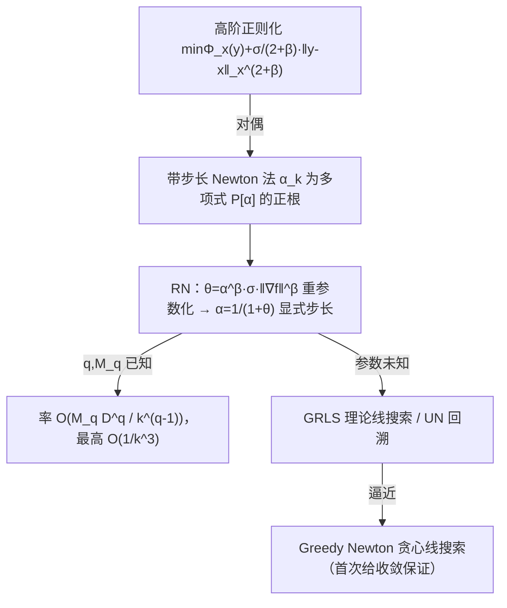

# Newton Method Revisited: Global Convergence Rates up to $O(1/k^3)$ for Stepsize Schedules and Linesearch Procedures

**会议**: ICLR 2026  
**OpenReview**: [https://openreview.net/forum?id=0eM74HjPQA](https://openreview.net/forum?id=0eM74HjPQA)  
**代码**: 待确认  
**领域**: optimization  
**关键词**: Newton 方法, 二阶优化, 全局收敛率, 步长策略, 线搜索, Hölder 连续, 局部 Hessian 范数  

## 一句话总结
本文用"三阶导 Hölder 连续"这个非常规视角重新分析带步长的 Newton 法，提出一族可显式计算的步长策略（RN），把经典 Newton 法的全局收敛率从 $O(1/k^2)$ 一举推到 $O(1/k^3)$，并给出无需预知光滑常数的线搜索/回溯版本（GRLS、UN），顺带首次证明了实践常用的贪心 Newton 线搜索的收敛保证。

## 研究背景与动机
**领域现状**：二阶方法（Newton 法）因不受问题条件数影响、具仿射不变性、局部二次收敛（精度每步翻倍）而长期是科学计算的基石。但经典 Newton 法 $x_{k+1}=x_k-[\nabla^2 f(x_k)]^{-1}\nabla f(x_k)$ 在远离最优点时会发散，必须靠步长策略、线搜索、信赖域或 Levenberg-Marquardt 正则来"全局化"。

**现有痛点**：最简单的全局化手段是带步长的 Newton 法 $x_{k+1}=x_k-\alpha_k[\nabla^2 f(x_k)]^{-1}\nabla f(x_k)$。Nesterov-Nemirovski (1994) 的阻尼步长给出 $O(k^{-1/2})$；Hanzely et al. (2022) 发现"步长 ↔ 局部范数下的三次正则"的对偶关系，把率提到 $O(k^{-2})$。但对于 Hessian Hölder 连续的函数，最优率下界是 $\Omega(k^{-7/2})$，现有步长策略与之仍有明显差距。

**核心矛盾**：一阶方法早有 Chebyshev / Polyak / Silver 等非平凡步长能逼近最优率，可二阶方法的步长策略却长期卡在 $O(k^{-2})$——人们默认 Newton 法是"纯二阶"方法，没人想到去用三阶导信息分析它。

**本文目标**：寻找更高效的 Newton 步长策略，把全局率推过 $O(k^{-2})$，同时保持"简单方法"的鲁棒性与少超参优势，并处理光滑常数未知的现实场景。

**核心 idea**：**[换分析视角]** 不再把 Newton 法当二阶方法分析，而是假设函数的**三阶导是 Hölder 连续**，从而借用三阶张量方法的收敛机理，得到逼近 $O(k^{-3})$ 的率；**[换正则阶数]** 把 Hanzely (2022) 的三次正则推广到局部 Hessian 范数下的更高阶正则，对应步长是一个高阶多项式的根——并证明这个根唯一、落在 $(0,1]$、且可显式算出。

## 方法详解

### 整体框架
方法建立在"步长 ↔ 正则化对偶"之上：在局部 Hessian 范数 $\|\cdot\|_x=\|\cdot\|_{\nabla^2 f(x)}$ 下，给 Newton 步加一个 $2+\beta$ 阶正则项，等价于给 Newton 方向配一个特定步长 $\alpha_k$。本文先解出这个步长（算法 RN），再针对"光滑参数未知"分别给出理论线搜索 GRLS、实用回溯 UN，并把它们的率统一到 $O(M_q D^q / k^{q-1})$，其中 $q=p+\nu\in[2,4]$。

### 关键设计

**1. 步长—正则对偶 + 高阶正则化：把"加正则"翻译成"配步长"。** Hanzely et al. (2022) 证明，在局部 Hessian 范数下，给二阶 Taylor 近似 $\Phi_x(y)=f(x)+\langle\nabla f(x),y-x\rangle+\frac12\|y-x\|_x^2$ 加三次正则等价于 Newton 法配某步长。本文把正则阶数从 3 推广到任意 $2+\beta$：求解 $T_{\sigma,\beta}(x)=\arg\min_y\{\Phi_x(y)+\frac{\sigma}{2+\beta}\|y-x\|_x^{2+\beta}\}$ 等价于一步 $x_{k+1}=x_k-\alpha_k[\nabla^2 f(x_k)]^{-1}\nabla f(x_k)$，其中 $\alpha_k\in(0,1]$ 是多项式 $P[\alpha]=1-\alpha-\alpha^{1+\beta}\sigma\|\nabla f(x_k)\|_x^{*\beta}$ 的唯一正根。在局部范数下，不同正则模型的极小点落在同一条直线上，几何上天然对齐，这正是后续分析能简洁推进的原因。

**2. $\theta$ 重参数化：让高阶多项式的根变得可显式计算。** 高阶正则的步长本应是高阶多项式的根、没有解析式，这是把率推过 $O(k^{-2})$ 的最大技术障碍。本文引入隐式正则常数 $\theta\overset{def}{=}\alpha^\beta\sigma\|\nabla f(x)\|_x^{*\beta}\ge 0$，多项式立刻塌缩为 $P_\theta[\alpha]=1-\alpha-\alpha\theta$，于是步长有了极简闭式 $\alpha=\frac{1}{1+\theta}$。$\theta$ 与 $\alpha$ 一一对应，全部理论可只用 $\theta$ 表述。这个换元的妙处在于：它把恼人的 $\alpha^{1+\beta}$ 项（直接处理会在分析中层层传播、无法照搬 Doikov et al. 2024 的证明）封装进单个 $\theta$，从而复用 $l_2$ 范数下三阶张量法的证明骨架。由此得到算法 **RN（Root Newton）**：每步算 Newton 方向 $n_k$、局部梯度范数 $g_k=\|\nabla f(x_k)\|_x^*$、设足够大的正则 $\theta_k=(9M_q)^{1/(q-1)}g_k^{(q-2)/(q-1)}$，再取 $\alpha_k=1/(1+\theta_k)$ 走一步。

**3. 三阶导 Hölder 连续假设 + 统一率 $O(M_q D^q/k^{q-1})$：率随光滑阶数提升。** 关键是用 Definition 1 的广义 Hölder 连续 $\|\nabla^p f(x)-\nabla^p f(y)\|_{op}\le L_{p,\nu}\|x-y\|_x^\nu$ 统一刻画光滑性（$p\in\{2,3\}$、$\nu\in[0,1]$），令 $q=p+\nu\in[2,4]$、$M_q=L_{p,\nu}$。Theorem 2 量化了保证单步下降所需的正则量 $\theta_k$，Lemma 2 把单步下降 $f(x_k)-f(x_{k+1})\ge c_5\frac{\|\nabla f(x_{k+1})\|_x^{*2}}{\|\nabla f(x_k)\|_x^{*(q-2)/(q-1)}}$ 转成全局率。最终 Theorem 4 给出 RN 的全局率 $f(x_k)-f^*\le 9M_q D\big(\tfrac{4D(q-1)}{\gamma k}\big)^{q-1}+\|\nabla f(x_0)\|_{x_0}^* D\,e^{-k/4}$，即 $O(M_q D^q/k^{q-1})$。当三阶导 Hölder 连续（$q$ 接近 4）时率逼近 **$O(1/k^3)$**，首次超越 Hanzely (2022) 的 $O(k^{-2})$；当 $q=2$（标准 Lipschitz）时退化回常数步长情形。

**4. 处理未知光滑参数：GRLS 理论线搜索、UN 回溯与贪心 Newton 的桥接。** 现实中 $(q,M_q)$ 往往未知，而同一函数可满足多组 $L_{p,\nu}$。GRLS（Gradient-Regulated Line Search）不依赖 Theorem 2，而是直接沿 Newton 方向选点最大化下降界：$x_{k+1}=\arg\min_{y=x_k-\alpha n_{x_k},\,\alpha\in[0,1]}\frac{f(y)-f(x_k)}{\|\nabla f(y)\|_x^{*2}}$，其率自动取所有 $q$ 的最优 $\min_{q\in[2,4]}O(M_q D^q/k^{q-1})$（Corollary 1），如同事先知道最优参数。当步长很小时 $\nabla f(y)\approx\nabla f(x_k)$，GRLS 的目标退化为 $\min_y f(y)$——这正是实践常用的 **Greedy Newton (GN)** 贪心线搜索，于是 Corollary 2 首次给出 GN 的收敛保证。为了得到完全可执行的方法，**UN（Universal Newton）** 用回溯实现：从偏小的 $\theta_k$ 估计起步、按 $\rho>1$ 逐步放大正则直到满足理论下降条件 $\langle\nabla f(x_k^{j_k}),n_k\rangle\ge\frac{1}{2\alpha_{k,j_k}\theta_{k,j_k}}\|\nabla f(x_k^{j_k})\|_x^{*2}$，Lemma 3 证明前 $k$ 步总回溯次数 $N_k\le 2k+\log_\rho(\cdot)$ 有界，Theorem 5 给出与 RN 匹配的率，且效果如同预知最优参数。

## 实验关键数据

### 主实验对比

| 对比组 | 参与方法 | 关键观察 |
|---|---|---|
| 无线搜索的高阶方法 | RN、AICN (Hanzely 2022)、GRN (Doikov 2024)、阻尼 Newton(调优固定步长)、一阶 GM | RN 与 AICN 表现相近，GRN 略逊；一阶 GM 单步快但每步收敛慢 |
| 带光滑常数估计 | UN、Super-universal Newton (Doikov 2024)、阻尼 Newton(固定调优) | **UN 收敛快于 Super-universal Newton**；正则指数 $\beta$ 对整体性能影响不大 |
| 隐式线搜索 | GRLS、Armijo、Greedy Newton (GN) | logistic 回归与多面体可行性问题上，GRLS 与 GN 步长几乎不可区分、均快于 Armijo 与固定步长 |

测试函数/任务：非凸 Rosenbrock 函数（$d=40$，5 次随机初始化取均值±标准差）、logistic 回归、polytope feasibility。

### 关键发现
- **Rosenbrock（强非凸、出名难）**：GRLS 在所有线搜索过程中表现最好，跑出领先收敛曲线，说明该理论线搜索的优势能延伸到非凸场景。
- **GRLS ≈ GN**：两者步长几乎相同（Figures 2c/3c），从实验上验证了式 (17) 的近似——这也是能给 GN 套上收敛保证的依据；但 GN 的判据更简单，实践中更可取。
- **UN 的 $\beta$ 不敏感**：UN 与 super-universal Newton 共有的正则指数 $\beta$ 对整体性能影响很小，意味着 UN 几乎免调参。

## 亮点与洞察
- **"用三阶导分析二阶法"是反直觉但极有效的视角切换**：Newton 法被默认是二阶方法，本文却用三阶导 Hölder 连续把它接到三阶张量方法的收敛机理上，直接拿到 $O(1/k^3)$，是把率推过 $O(k^{-2})$ 的真正钥匙。
- **$\theta$ 重参数化是"以简驭繁"的范本**：一个隐式标量同时吸收 $\beta$ 和 $\sigma$，把高阶多项式的根变成 $1/(1+\theta)$ 的闭式，既绕开了 $\alpha^{1+\beta}$ 的分析噩梦，又让算法无需额外线搜索就能精确算步长。
- **解释了"为什么 Greedy Newton 好用"**：本文首次为这个 folklore 方法给出收敛保证，理论价值超出新方法本身——这正是与 Doikov et al. (2024) 的关键区别（后者不解释任何已有方法）。
- **坚持"简单方法"哲学**：少超参、鲁棒、仿射不变，便于与采样/动量/梯度裁剪等技巧组合，而加速方法往往多序列、多超参、难调难组合。

## 局限与展望
- **依赖凸性与有限直径假设**：理论建立在凸函数、初始水平集有限直径 $D<\infty$、以及 Assumption 1（相邻 Hessian 在梯度方向变化有界 $\gamma$）之上；Rosenbrock 实验虽是非凸，但理论保证不覆盖一般非凸。
- **率仍未触最优**：三阶导 Hölder 连续下的可达下界是 $\Omega(k^{-5})$，本文的 $O(k^{-3})$ 离最优仍有间隔——作者也明确把"是否存在更好步长"留作开放问题。
- **理论线搜索 GRLS 不实用**：GRLS 隐式且需沿方向求解，实际要靠 GN 近似或 UN 回溯；GN 的收敛保证又依赖额外假设（局部范数下梯度不增超常数因子 $c$）。
- **每步成本仍是 Newton 量级**：需要 Hessian 求逆/求解线性系统，高维场景下与一阶方法的"单步便宜"形成权衡，文中也观察到一阶 GM 单步更快。

## 相关工作与启发
- **直接前身**：Hanzely et al. (2022)（AICN，三次正则↔步长对偶，$O(k^{-2})$）与 Doikov et al. (2024)（$l_2$ 范数高阶正则、super-universal Newton）。本文在局部 Hessian 范数下推广前者的正则阶数、借用后者的证明技巧但需重做（局部范数下 $\alpha^{1+\beta}$ 不能直接套用）。
- **正则化 Newton 谱系**：Nesterov-Polyak (2006) 三次正则、Mishchenko (2023)、Doikov-Nesterov (2024)、Nesterov (2021) 三阶张量法——本文把"二阶 Newton"与"三阶张量"两条线索接在一起。
- **一阶步长策略的启发**：Young (1953, Chebyshev)、Polyak (1987)、Altschuler-Parrilo (2023, Silver stepsize)、Grimmer et al. (2025) 的半加速步长，正是促使作者去问"Newton 法是否也有更好步长"的动机来源。
- **启发**：在局部范数/对偶视角下重参数化以"抹平"难处理的高次项，是把复杂正则方法落地成可显式计算算法的通用招法；同时，为已被广泛使用的 folklore 启发式补上理论保证，往往比单纯提出新方法更有学术价值。

## 评分
- **新颖性**: ⭐⭐⭐⭐⭐ —— "用三阶导 Hölder 连续分析二阶 Newton 法"是反直觉且此前无人涉足的视角，$\theta$ 重参数化把高阶多项式根化为闭式，首次把 Newton 步长率推过 $O(k^{-2})$ 到 $O(1/k^3)$，并首次给 Greedy Newton 证明收敛。
- **实验充分度**: ⭐⭐⭐ —— 在 Rosenbrock、logistic 回归、polytope feasibility 上覆盖了三类对比（无线搜索/带常数估计/隐式线搜索）且验证了 GRLS≈GN 的核心论断，但问题规模偏小、以小型凸/经典非凸基准为主，缺大规模或真实深度学习任务，符合理论论文定位。
- **写作质量**: ⭐⭐⭐⭐ —— 贡献清单清晰，Table 1 把各步长策略的率/假设/出处一表打尽，与 Hanzely (2022)、Doikov (2024) 的逐点对比到位；唯公式与符号密度高，对二阶优化背景较薄的读者门槛不低。
- **价值**: ⭐⭐⭐⭐ —— 既给出新方法（RN/UN/GRLS）又解释了实践常用的 Greedy/Armijo 线搜索，理论与实用兼顾；对二阶优化、正则化 Newton、张量方法研究者有直接参考价值，且方法简单、少超参、易与其他技巧组合，落地友好。

<!-- RELATED:START -->

## 相关论文

- [\[ICLR 2026\] Convergence of Muon with Newton-Schulz](convergence_of_muon_with_newton-schulz.md)
- [\[ICLR 2026\] Hinge Regression Tree: A Newton Method for Oblique Regression Tree Splitting](hinge_regression_tree_a_newton_method_for_oblique_regression_tree_splitting.md)
- [\[ICLR 2026\] The Potential of Second-Order Optimization for LLMs: A Study with Full Gauss-Newton](the_potential_of_second-order_optimization_for_llms_a_study_with_full_gauss-newt.md)
- [\[ICLR 2026\] Taming Curvature: Architecture Warm-up for Stable Transformer Training](taming_curvature_architecture_warm-up_for_stable_transformer_training.md)
- [\[ICLR 2026\] On the Surprising Effectiveness of a Single Global Merging in Decentralized Learning](on_the_surprising_effectiveness_of_a_single_global_merging_in_decentralized_lear.md)

<!-- RELATED:END -->
