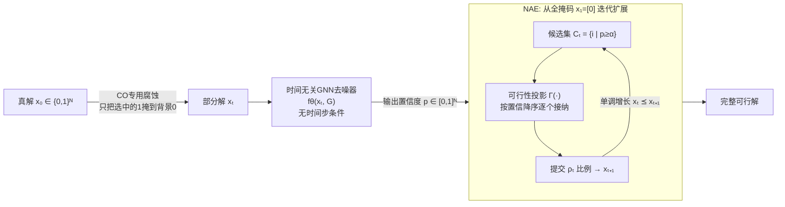

# NExCO: Native Solution Expansion for Diffusion-based Combinatorial Optimization

**会议**: ICLR 2026  
**OpenReview**: [https://openreview.net/forum?id=084SvT55yk](https://openreview.net/forum?id=084SvT55yk)  
**代码**: [https://github.com/yuuuuwang/NExCO](https://github.com/yuuuuwang/NExCO)  
**领域**: 神经组合优化 / 扩散模型 / 图神经网络  
**关键词**: Neural Combinatorial Optimization, Masked Diffusion, Adaptive Expansion, TSP/MIS/CVRP, Time-agnostic Denoiser  

## 一句话总结
NExCO 把「自适应扩展」从外挂在全局预测器上的包装器，重写成 CO 专用掩码扩散模型自身的内在解码机制：扩散的每一个中间态都是合法的部分解，模型通过逐步「解掩」高置信度变量并做可行性投影来构造完整解，在 TSP/MIS/CVRP 上同时拿到约 50% 的质量提升和最高 4× 的推理加速。

## 研究背景与动机
**领域现状**：神经组合优化（NCO）用学习型求解器替代手工启发式，主流分两个极端范式。局部构造（Local Construction, LC）像自回归一样一个变量一个变量地建解，天然保证可行但视野短、规模差（O(n) 次调用）；全局预测（Global Prediction, GP）一次性吐出整张概率热图，效率高、有全局观，但产出的平滑分布解码时噪声大、容易违反约束。为弥合两者，COExpander 提出的自适应扩展（Adaptive Expansion, AE）范式按实例自适应地决定每步提交多少变量，兼顾局部可行与全局感知。

**现有痛点**：但 AE 当前的实现只是「外挂」——把一个外部 GP 预测器（如 Fast T2T）包一层迭代壳。这带来两个根本缺陷：(i) 解的质量被骨干预测器封顶，骨干多差解就多差；(ii) 推理代价是 $O(D_s \cdot C_{GP})$，每轮扩展都要重新调一次全局预测器，比原生 GP 求解器贵得多（包 Fast T2T 后变 $O(D_s \cdot T_s)$）。

**核心矛盾**：现有扩散求解器（DIFUSCO、T2T、Fast T2T）虽然迭代细化的形式很像「构造式扩展」，但它们仍停留在 GP 范式：用均匀比特翻转（bit-flip）腐蚀，中间态会迅速漂离可行流形（TSP 里出现大量违反度约束、形成子环的边），所以中间态根本不能当部分解用，只能丢掉、最后一步靠启发式解码。**矛盾在于**：扩散过程明明产生了一长串中间态，却只用了最后一个。

**本文目标**：让自适应扩展「原生化」——把它编码成生成模型的内在解码原则，而非外部包装器。原生 AE 要满足两点：扩展进度与步长由模型置信度和约束驱动、不依赖固定时间表或外部 GP；中间态本身就是约束感知的合法部分解，变量提交通过可行性投影强制保证。

**核心 idea**：作者注意到语言模型里的**掩码扩散模型（MDM）**恰好提供了「有意义的中间态 + 免时间表训练 + 高效并行解码」三个特性，与 NCO 需求高度吻合。于是 **本文把 CO 解码重铸为掩码扩散的逐步解掩过程**：用一个 CO 专用、单向（1→0）的腐蚀过程保证中间态永远是可行部分解，配一个**去时间步条件的时间无关去噪器**，再用**原生自适应扩展（NAE）** 的解码策略，把扩散轨迹本身变成构造式求解。

## 方法详解

### 整体框架
给定图实例 $G$，把真解 $x_0\in\{0,1\}^N$ 通过「只对选中的 1 做掩码、置回背景态 0」腐蚀成部分解 $x_t$；一个时间无关 GNN 去噪器 $f_\theta(x_t, G)$ 不看时间步、直接对每个变量预测置信度。推理时从全掩码状态 $x_1=[0]$ 出发，反复「取高置信候选 → 可行性投影 → 提交一部分」，让部分解单调长大直到收敛成完整可行解。整条管线由「CO 专用腐蚀（前向）+ 时间无关去噪器（模型）+ 时间无关优化一致性（训练）+ NAE（推理）」四块拼成。

### 关键设计
**1. CO 专用单向腐蚀：把 [MASK] 和 0 合并成同一个背景态。** 直接把语言模型的三态 MDM 搬到 CO 会出问题——CO 的解极度不平衡（绝大多数变量是 0），三态掩码让去噪器被海量负样本主导、偏向预测 0；作者在 MIS 上观察到三态 MDM 的验证 cost 反而随训练下降（与「独立集应越扩越大」的目标相悖）。解法是把 [MASK] 与 0 统一为一个背景态（数值上都记作 0），前向过程只保留「活跃态 1 → 背景态 0」这一条单向（吸收式）通道：

$$q(x_t\mid x_0) = (1-t)\cdot x_0 + t\cdot \mathbf{0}$$

这样只有「被选中的 1」会随 $t$ 增大被丢回背景，腐蚀永不引入假阳性，任何中间态都是真解的一个合法子集、贴着可行流形走，从而可以直接拿来做构造式解码。

**2. 时间无关去噪器：从「时间步条件」改成「掩码模式条件」。** 既然单向腐蚀下「当前还活着的 1 占多少」本身就直接反映了信噪比/腐蚀程度，时间步 $t$ 就成了冗余信息。作者干脆去掉时间步嵌入，设计 $f_\theta(x_t, G)$ 只依赖当前腐蚀态和图实例，用各向异性 GNN（节点/边带任务特征，$x_t$ 作二元属性，消息传递 + 注意力池化）输出每个变量属于最优解的概率 $p\in[0,1]^N$。相比常规去噪器唯一的改动就是删掉时间步嵌入——这与大语言扩散模型「随机掩码、无显式时间步条件即可扩展训练」的成功如出一辙，把这一原则从 token 序列迁移到了图结构 CO。

**3. 时间无关优化一致性训练（TOC）：让所有腐蚀态都映射到同一个最优解。** 由于单向腐蚀是单调的，对任意 $0<t<t'<1$ 都有 $\mathrm{supp}(x_{t'})\subseteq\mathrm{supp}(x_t)$，每个 $x_t$ 都是 $x^*$ 的合法子集，于是可以丢掉时间步、跨腐蚀级别直接强制一致性：

$$\mathcal{L}_{\mathrm{TOC}}(\theta) = \mathbb{E}_{t'>t}\Big[d\big(f_\theta(x_{t'}, G), x^*\big) + d\big(f_\theta(x_t, G), x^*\big)\Big]$$

其中 $d(\cdot,\cdot)$ 取二元交叉熵或任务相关差异。训练等价于「从多个不同稀疏度的部分解里重建同一个 $x^*$」；因为腐蚀不引入假阳性，每个 $x_t$ 都贴着可行流形，监督信号天然与约束对齐，避免了均匀扩散里「中间态不真实、模型还要去纠正伪影」的浪费。参考解 $x^*$ 可来自小规模精确求解器或大规模高质量启发式，实验证明即便用次优标签训练也能保持竞争力。

**4. 原生自适应扩展推理（NAE）：把扩散轨迹当成单调构造解码器。** 推理从全掩码 $x_1=\mathbf{0}$ 起步，每步去噪器给出置信向量 $p_t=f_\theta(G, x_{t-1})$；超过阈值 $\alpha$ 的变量组成候选集 $C_t$，由可行性投影 $\Gamma(\cdot)$ 投到可行子集 $S_t$，再保留其中 $\rho_t$ 比例的变量提交、更新 $x_t$。可行性投影对所有任务用同一个「三段式模板」：按置信度降序排序 → 顺序检查 → 仅当满足一个轻量布尔可行谓词时才接纳该变量，形式上即

$$S_t = \arg\max_{x^{(i)}\subseteq C_t,\, x\in\Omega}\ \sum_i p_t^{(i)} x^{(i)}$$

迁移到新任务只需重定义那个布尔谓词（TSP：保持度为 2 且无子环；MIS：选点时邻居全未激活；CVRP：插边不超载），投影管线本体不变。作者还给出有限步收敛证明（Proposition 1）：在单调投影、严格可扩展、解规模有界三个温和假设下，NAE 产生单调序列并在至多 $N_{\max}$ 步内收敛。关键是 NAE 整条轨迹只调一次去噪器/阶段，复杂度 $O(T_s)$，渐近优于 COExpander 包装器的 $O(D_s\cdot T_s)$。

## 实验关键数据
覆盖三类经典 NP-hard 问题：TSP、MIS、CVRP。指标为解质量（Length/Size、相对参考解的 Drop）与单实例时间。

### 主实验表格
TSP（贪心解码，节选）：

| 方法 | 类型 | TSP-500 Drop↓ | TSP-500 Time | TSP-1000 Drop↓ | TSP-1000 Time |
|---|---|---|---|---|---|
| Fast T2T (Ts=5,Tg=5) | GP | 0.39% | 1.41s | 0.58% | 5.81s |
| COExpander (Ds=3,Ts=5) | AE | 0.52% | 0.61s | 0.95% | 2.26s |
| **NExCO (Ds=5)** | NAE | **0.28%** | **0.33s** | **0.63%** | **1.31s** |
| **NExCO (Ds=7)** | NAE | **0.25%** | 0.43s | **0.52%** | 1.68s |

TSP-500 上 NExCO 把 Drop 从 0.39% 压到 0.25%（1.5× 提升），同时 1.41s→0.43s（约 3× 加速）。

MIS（节选）：

| 方法 | 类型 | RB-[200-300] Drop↓ | RB-[800-1200] Drop↓ / Time | ER-[700-800] Drop↓ / Time |
|---|---|---|---|---|
| Fast T2T | GP | 2.54% | 8.51% / 2.76s | 9.31% / 1.22s |
| COExpander | AE | 2.39% | 4.36% / 2.05s | 5.62% / 1.53s |
| **NExCO (Ds=7)** | NAE | **1.66%** | **4.07% / 1.00s** | **4.20% / 0.56s** |

ER 图上 Drop 从 9.31%（Fast T2T）降到 4.20% 且 >2× 加速。

CVRP（GP 类扩散求解器因容量约束复杂从未扩展到 CVRP）：

| 方法 | 类型 | CVRP-50 Drop↓ | CVRP-100 Drop↓ | CVRP-200 Drop↓ |
|---|---|---|---|---|
| Sym-NCO | LC | 1.95% | 2.37% | 2.86% |
| COExpander | AE | 3.85% | 4.19% | 4.58% |
| **NExCO (Ds=5)** | NAE | **0.85%** | **1.40%** | **2.45%** |

CVRP-50 上把 COExpander 的 3.85% 直接打到 0.85%。

### 消融实验表格
参考解质量鲁棒性（用 2-Opt 扰动真解得到次优标签，TSP-500）：

| 标签/模型 | 标签 Drop | 训练后 Drop↓ |
|---|---|---|
| 2-Opt 扰动标签 | 1.65% / 3.35% | — |
| NExCO (Ds=5) | — | 0.31% |
| NExCO (Ds=7) | — | 0.25%~0.26% |

即便监督标签本身有 1.65%~3.35% 的差距，NExCO 仍能收敛到 0.25%~0.31%，说明不依赖精确最优标签。

### 关键发现
- **扩展步数是清晰的质量–效率旋钮**：增加 $D_s$（扩展轮数）单调降低 Drop，而推理时间近似线性增长，整条「绿色曲线」始终压在 Fast T2T/COExpander/Sym-NCO 的帕累托前沿之外。
- **阈值 $\alpha$ 呈倒 U 型**：中等阈值最优，过高（太保守、提交太少）或过低（太激进、引入噪声）都会变差。
- **跨尺度泛化最强**：在 TSP-500 上训练泛化到 TSP-1000 仅 0.58% gap；TSP-1000 训的模型在 TSP-500 上拿 0.37%，甚至超过直接在 TSP-500 上训的基线。

## 亮点与洞察
- **范式重定位而非堆模块**：把 AE「外挂 GP」的工程包装升维成「扩散解码原则本身」，复杂度从 $O(D_s\cdot T_s)$ 直接降到 $O(T_s)$，质量却不被外部骨干封顶——这是把效率提升与质量提升用同一处设计同时拿下的典范。
- **「合并背景态」是被实验逼出来的关键洞见**：作者先发现三态 MDM 在 MIS 上验证 cost 走错方向（因类别极不平衡 + 局部约束缺全局先验），才提出把 [MASK] 与 0 统一，使中间态永远贴着可行流形——这是把 CO 结构先验注入扩散腐蚀过程的漂亮一招。
- **可行性投影做成任务无关模板**：三段式（排序→顺序检查→布尔谓词接纳）让迁移到新 CO 问题只需写一个谓词，工程上极易复用。
- **有理论支撑**：单向吸收腐蚀 + 单调投影直接给出有限步（≤$N_{\max}$）收敛证明，让「构造式解码必然终止于可行解」不再是经验直觉。

## 局限与展望
- **仍需高质量参考解监督**：TOC 训练要求每实例一个一致的 $x^*$，大规模实例上依赖启发式标签（虽鲁棒，但质量上限仍受标签影响）。
- **可行性谓词需人工逐任务定义**：虽然投影模板通用，但每个新 CO 问题仍要手写约束谓词，未做到完全自动；对约束更复杂或非二元决策的问题（如带时间窗、多目标）能否同样轻量化未验证。
- **阈值 $\alpha$ 与扩展时间表 $\{\rho_t\}$ 是超参**：虽宣称「自适应」，步长比例 $\rho_t$ 仍可设为固定或均匀时间表，真正的实例级动态步长程度有多大、相比手调的收益边界，论文论证有限。
- **评测集中在三类标准学术问题**：TSP/MIS/CVRP 上验证充分，但工业级带约束的真实调度/路由问题（异构约束、大规模动态）上的表现仍待检验。

## 相关工作与启发
- **GP 扩散求解器谱系**：DIFUSCO（离散扩散 + 热图解码）、T2T / Fast T2T（优化一致性、梯度细化），是本文直接对标与超越的对象；NExCO 指出它们都「浪费了扩散轨迹」。
- **AE 范式与 COExpander**：本文承认 AE 思想（自适应决策粒度、实例级全局感知）的价值，但把其「外挂式」实现作为主要批判与改进靶点。
- **语言模型里的掩码扩散（MDM）**：Austin et al.、LLaDA/Nie et al.、Ou et al. 等把「逐步解掩 + 免时间表训练 + 并行解码」做成自回归的有力替代，是 NExCO「时间无关去噪 + 有意义中间态」的直接灵感来源——一个把 NLP 生成范式成功反哺到图结构组合优化的范例。
- **启发**：这条「先把外挂模块内化为生成模型的内在解码机制、再借此同时砍复杂度与提质量」的思路，对其他「预测器 + 后处理启发式」式的结构化预测任务（如布局、调度、图匹配）有迁移潜力。

## 评分
- **新颖性**: ⭐⭐⭐⭐⭐ 把 AE 从外挂包装器重铸为掩码扩散的内在解码原则，「合并背景态 + 时间无关一致性 + NAE」三件套构成自洽的新框架，范式级创新而非增量。
- **实验充分度**: ⭐⭐⭐⭐ TSP/MIS/CVRP 三任务多尺度 + 跨尺度泛化 + 标签鲁棒性 + 双超参分析，覆盖全面；唯工业级复杂约束问题与真正实例级动态步长的论证略欠。
- **写作质量**: ⭐⭐⭐⭐⭐ 动机链条（GP 浪费轨迹 → 三态 MDM 走错方向 → 合并背景态 → 时间无关 → NAE）层层递进，表 1 范式对比一目了然，理论与实验衔接清晰。
- **价值**: ⭐⭐⭐⭐⭐ 同时拿下约 50% 质量提升与最高 4× 加速、复杂度从 $O(D_s T_s)$ 降到 $O(T_s)$，且首次把扩散求解器扩展到 CVRP，对神经组合优化社区有较强推动力与可复用性（含开源代码）。

<!-- RELATED:START -->

## 相关论文

- [\[ICLR 2026\] Diffusion-DFL: Decision-focused Diffusion Models for Stochastic Optimization](diffusion-dfl_decision-focused_diffusion_models_for_stochastic_optimization.md)
- [\[ICLR 2026\] Multi-Action Self-Improvement for Neural Combinatorial Optimization](multi-action_self-improvement_for_neural_combinatorial_optimization.md)
- [\[ICLR 2026\] HeuriGym: An Agentic Benchmark for LLM-Crafted Heuristics in Combinatorial Optimization](heurigym_an_agentic_benchmark_for_llm-crafted_heuristics_in_combinatorial_optimi.md)
- [\[ICLR 2026\] ConRep4CO: Contrastive Representation Learning of Combinatorial Optimization Instances across Types](conrep4co_contrastive_representation_learning_of_combinatorial_optimization_inst.md)
- [\[ICLR 2026\] Combinatorial Bandit Bayesian Optimization for Tensor Outputs](combinatorial_bandit_bayesian_optimization_for_tensor_outputs.md)

<!-- RELATED:END -->
