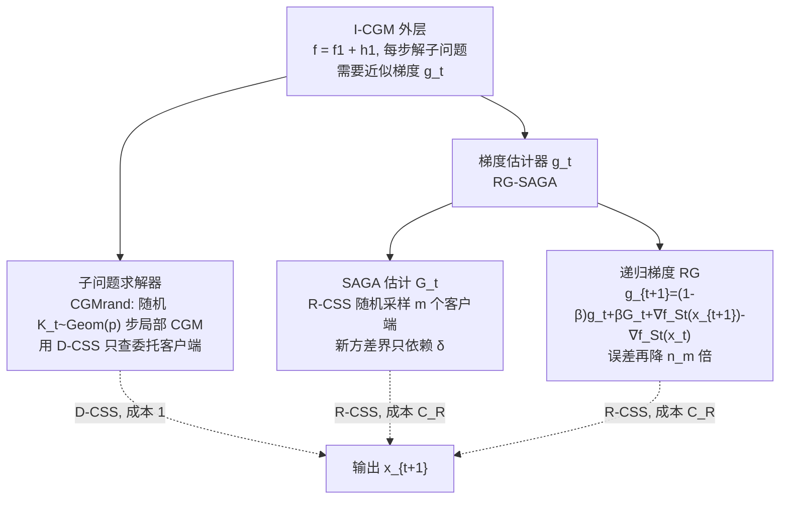

# Non-Convex Federated Optimization under Cost-Aware Client Selection

**会议**: ICLR 2026  
**OpenReview**: [https://openreview.net/forum?id=FnaDv6SMd9](https://openreview.net/forum?id=FnaDv6SMd9)  
**代码**: 待确认  
**领域**: optimization / federated-learning  
**关键词**: 联邦优化, 客户端选择, 通信复杂度, 方差缩减, SAGA, 非凸优化  

## 一句话总结
为联邦优化提出一个把「不同客户端选择策略对应不同通信成本」显式建模的代价感知框架，并基于不精确复合梯度法 (I-CGM) 配上新的 RG-SAGA 梯度估计器，得到在该模型下非凸优化通信与本地计算复杂度均最优的方法。

## 研究背景与动机
**领域现状**：联邦学习里通信是主要瓶颈，不同算法采用截然不同的客户端选择策略——有的每轮只随机采样一小撮客户端 (如 SAG/SAGA)，有的需要周期性地和全部客户端做全同步算全梯度 (如 SARAH 系)，还有的混合两者。SARAH 系方法能利用本地与全局目标的「不相似度」$\delta$（统计/半监督场景下 $\delta$ 往往很小），在通信轮数上有显著理论收益。

**现有痛点**：现有比较优化方法的指标（如通信轮数）**不区分这些选择策略**，而它们在实际中的成本差别很大——随机采样部分客户端便宜，强制全同步在客户端不可靠、间歇掉线的 cross-device 场景下昂贵甚至不可行。于是「SARAH 系到底是不是比 SAGA 系更省通信」其实没法公平回答：SARAH 复杂度依赖小的 $\delta$ 但要全同步，SAGA 系不用全同步但复杂度依赖可能大得多的个体光滑常数 $L_{\max}$。

**核心矛盾**：想同时拿到「只依赖小 $\delta$ 的通信复杂度」和「不做周期性全同步」——前者是 SARAH 的优势，后者是 SAGA 的优势，二者此前不可兼得。

**本文目标**：建立一个能给不同客户端选择策略标上不同成本的统一模型，并在其中设计一个**通信和本地计算双双最优**的一阶方法。

**核心 idea**：**[成本感知建模]** 把客户端选择拆成三种带不同代价的策略（任意选 A-CSS、随机选 R-CSS、委托选 D-CSS），用它们各自的代价 $C_A\ge C_R\ge 1$ 来计费；**[算法构造]** 在不精确复合梯度法骨架上，用「只依赖 $\delta$ 的 SAGA 方差界 + 递归梯度 (RG) 技术」把估计误差再压一个 $n_m$ 因子，从而避开全同步还能吃到相似性红利。

## 方法详解

### 整体框架
方法由三层拼成：最外层是**不精确复合梯度法 (I-CGM)**——把目标 $f$ 拆成委托函数 $f_1$ 加残差 $h_1=f-f_1$，每步用近似梯度 $g_t\approx\nabla f(x_t)$ 解一个带二次正则的子问题；中间层是**子问题求解器**，用几何分布随机步数的局部复合梯度迭代来满足精度条件并省本地计算；底层是**梯度估计器**，先把 SAGA 改造成只依赖相似度 $\delta$ 的版本，再套上递归梯度 (RG) 技术得到误差更小的 RG-SAGA。三层各自对应不同的客户端选择策略和成本。

### 关键设计

**1. 成本感知的联邦优化模型：给三种客户端选择策略明码标价**。论文把「服务器如何挑选参与轮次的客户端集合 $S_r$」抽象成三种策略并各配一个成本：A-CSS（任意选，最强，可拼出全同步，成本 $C_A$）、R-CSS（从 $\binom{[n]}{m}$ 均匀随机采样，对应 cross-device 的部分参与，成本 $C_R$）、D-CSS（只查固定的委托客户端集合 $S_D$，本文取单一委托客户端 $S_D=\{1\}$，成本 1）。它们满足自然关系 $1\le C_R\le C_A$。在这个模型里，「算全梯度」必须把 $[n]$ 切成 $\lceil n/m\rceil=n_m$ 份用 A-CSS 顺序通信，于是成本天然反映出全同步的昂贵。这套计费让原本被通信轮数指标掩盖的策略差异显形，也给「公平比较各家算法」提供了统一坐标系（Table 1 据此把 GD/FedAvg/Scaffold/SABER 等全部重排）。

**2. 不精确复合梯度法 + 几何随机局部步数：用便宜的委托客户端解子问题**。I-CGM 把问题写成 $f=f_1+h_1$，每轮在点 $x_t$ 处用近似梯度 $g_t$ 构造子问题 $F_t$（光滑项 $f_1$ 加二次正则 $\psi_t(x)=\langle g_t-\nabla f_1(x_t),x-x_t\rangle+\frac\lambda2\|x-x_t\|^2$），用经典复合梯度迭代 $y^t_{k+1}=\frac{1}{\lambda+L_1}\big(L_1 y^t_k+\lambda x_t+\nabla f_1(x_t)-g_t-\nabla f_1(y^t_k)\big)$ 求解。关键在于：若用固定 $K$ 步，需要 $K\simeq L_1 T/\lambda$ 才能满足精度条件 (6)，因为 $y^t_K$ 和 $x_t$ 不重合无法 telescope；改成让步数 $\hat K_t\sim\mathrm{Geom}(p)$ 服从几何分布后，期望本地查询数降到 $\mathbb E[K_t]=1/p\simeq L_1/\lambda$，省掉了 $T$ 倍本地计算。由于子问题只涉及委托函数 $f_1$，整段求解只用便宜的 D-CSS（成本 1），不碰昂贵的全同步。

**3. 只依赖 $\delta$ 的 SAGA 方差界：让部分参与也能吃相似性红利**。SAGA 把每个客户端最近一次梯度 $b^t_i$ 存下来，每轮只更新被采样集合 $S_t$ 内的那几个，估计器 $G_t=b^t_{S_t}-b^{t-1}_{S_t}+b^{t-1}$ 是 $\nabla f(x_t)$ 的条件无偏估计，且服务器端只需维护聚合向量 $b^t$、每个客户端只存一个向量，内存开销极小、天然适配部分参与（不用全同步）。论文给出**新的方差界**（Lemma 4.1）：$\sum_t\sigma_t^2$ 被 $\delta_m^2:=\frac{q_m}{m}\delta^2$ 控制（$q_m=\frac{n-m}{n-1}$），即只依赖相似度 $\delta$ 而非个体光滑常数 $L_{\max}$，首次说明 SAGA 也能像 SARAH 一样利用函数相似性。但该界里 $G_1^2$ 的系数可能大于 1，不满足 I-CGM 误差条件 (7) 中系数须严格小于 1 的要求，所以还不能直接塞进 I-CGM——这正是下一步 RG 要解决的。

**4. 递归梯度 (RG) 技术：给任意无偏估计器再压一个 $n_m$ 因子**。RG 对任何条件无偏的 $G_t$ 做递归加权：$g_{t+1}=(1-\beta)g_t+\beta G_t+\nabla f_{S_t}(x_{t+1})-\nabla f_{S_t}(x_t)$，融合了递归梯度更新与动量。这个式子是个统一框架：$\beta=0$ 退化成 SARAH，$G_t$ 取 SAGA 时恢复 ZeroSARAH 结构，特定取法又变成 STORM。关键收益在 Corollary 5.3：对 RG-SAGA 取 $\beta\simeq 1/n_m$，误差界相比原始 SAGA **改进一个 $n_m$ 因子**，把对 $n_m$ 的线性依赖压掉。最终 Theorem 6.1 给出 I-CGM-RG-SAGA 的通信复杂度 $O\big(C_A n_m+C_R\frac{(\Delta_1+\sqrt{n_m}\delta_m)F^0}{\varepsilon^2}\big)$、本地复杂度 $O\big(n_m+\frac{(\Delta_1+\sqrt{n_m}\delta_m+L_1)F^0}{\varepsilon^2}\big)$——其中昂贵的 $C_A n_m$ 项只来自开头一次全梯度初始化（且可用 R-CSS 近似进一步去掉），主迭代全走便宜的 $C_R$，从而拿到该模型下已知最优的双复杂度。

值得一提的是 I-CGM 外层的收敛分析（论文中对任意估计器成立）要求估计误差满足 $\sum_t\Sigma_t^2\le\frac{1}{32}\sum_t G_t^2+(\lambda+\Delta_1)^2\sum_t\chi_t^2$ 这一条件 (7)，此时取 $\lambda\simeq\Delta_1$ 可得 $\mathbb E[\|\nabla f(\bar x_T)\|^2]\le 32\frac{(\lambda+\Delta_1)^2}{\lambda-\Delta_1}\frac{F^0}{T}$，即 $T=O(\Delta_1 F^0/\varepsilon^2)$ 步收敛——这正是要把估计器误差里 $G_t^2$ 的系数压到 $<1$ 的原因，也解释了为何单独的 SAGA 方差界（系数可能 $>1$）必须经 RG 改造才能并入。RG-SVRG 是平行的实例化，其通信复杂度 $O\big(C_A n_m+\frac{(C_R\Delta_1+\sqrt{C_A C_R n_m}\delta_m)F^0}{\varepsilon^2}\big)$ 中 $C_A$ 还会污染含 $\varepsilon$ 的项，因此整体略逊于 RG-SAGA，这也是论文主推 RG-SAGA 的原因。

## 实验关键数据

### 主实验设置与对比方法
所有实验设 $C_A=C_R=1$（即便 A-CSS 和 R-CSS 同样便宜，本文方法依然胜出，更能凸显算法本身优势）。对比对象：SCAFFOLD、FedAvg（带采样）、SABER-full（带 PAGE）、SABER-partial、GD、Scaffnew，以及自家 I-CGM-RG-SAGA 与 I-CGM-RG-SVRG。

### 任务一：带 log-sum 罚的二次极小化

| 设定 | 取值 |
|------|------|
| 维度/客户端 | $d=1000$, $n=100$, $m=\sqrt n$ |
| 常数 | $\Delta_1\approx\delta\approx 5$, $L_{\max}\approx 100$ |
| 观察 | I-CGM-RG-SAGA 在通信与本地计算上均最高效；SCAFFOLD 因本地复杂度与 GD 相当，**无法充分利用 $\delta$-相似性** |

### 任务二：非凸正则 logistic 回归（LIBSVM）

| 数据集 | $\delta$ vs $L_1$ | 结论 |
|--------|------------------|------|
| mushrooms | $\delta\ll L_1$ | I-CGM-RG-SAGA 通信最省 |
| duke | $\delta\approx L_1$ | I-CGM-RG-SAGA 仍通信最省 |

设 $m=1$、$n=10$，沿迭代实测本地 $L_1$ 与 $\delta$，验证理论里「复杂度依赖小 $\delta$ 而非 $L_{\max}$」的论断。

### 关键发现
- SVRG 系方法每轮期望通信轮数约为其他方法两倍（$\frac mn n+m$），印证 SAGA 变体更省通信。
- 即使在 $C_A=C_R$ 最不利于「省全同步」的设定下，RG-SAGA 仍全面领先；当 $C_A>C_R$ 时优势进一步放大（Appendix J.1.1）。
- 用 R-CSS 近似初始梯度 $G_0\approx\nabla f(x_0)$（省掉开头全同步）在实践中往往也工作良好（Figure J.1），说明 $C_A n_m$ 那项在工程上可进一步摊薄。
- 深度学习任务（神经网络训练）放在 Appendix J 作补充验证。

## 亮点与洞察
- **指标层面的贡献被低估**：真正的核心不只是新算法，而是「给客户端选择策略明码标价」这个建模视角——它把一堆此前没法公平对比的方法塞进同一张 Table 1，让「全同步贵 vs 部分参与便宜」从口头共识变成可计费的复杂度项。
- **RG 是一个可复用的「误差放大器逆操作」**：它不绑定具体估计器，对任意条件无偏估计器都能套，SAGA/SVRG/SARAH/ZeroSARAH/STORM 在它框架下统一，工程上意味着换个底层估计器就能复用同一套分析。
- **三层各取所需的成本拆分**：子问题求解走最便宜的 D-CSS、梯度估计走中等的 R-CSS、只在初始化用一次最贵的 A-CSS——这种「把昂贵操作隔离到一次性步骤」的设计哲学对成本敏感的分布式系统有普适借鉴意义。
- **把 SARAH 与 SAGA 的优点拼起来**：SAGA 的免全同步 + 新方差界的 $\delta$-依赖，恰好补上了 SAGA 系长期被 $L_{\max}$ 拖累的短板。

## 局限与展望
- **强理论、弱规模**：实验停留在 $n=100$ 级合成/小型 LIBSVM 任务，神经网络只在附录，缺乏真实大规模 cross-device 联邦系统的验证。
- **委托客户端假设**：D-CSS 依赖「存在始终可靠高效的委托客户端」且本文只取单个委托客户端 $S_D=\{1\}$，这在客户端高度异构/不可信场景下未必成立。
- **常数巨大**：Theorem 6.1 里系数（如 $113\sqrt{n_m}\delta_m$、$256$、$112n_m$）极大，理论最优在实践中的甜区需要调参确认。
- **成本模型简化**：$C_A,C_R$ 被当成固定标量，现实中通信成本随网络状况、设备掉线动态变化，更细的随机/时变成本模型是自然延伸。
- **凸/强凸情形未覆盖**：分析聚焦非凸驻点，凸或满足 PL 条件下能否取得同样的策略分离最优率仍是开放问题。

## 相关工作与启发
- **方差缩减谱系**：SAGA (Defazio 2014)、SVRG (Johnson & Zhang 2013)、SARAH (Nguyen 2017)、PAGE (Li 2021a)、STORM (Cutkosky & Orabona 2019)、ZeroSARAH (Li 2021b)，本文 RG 把它们统一在一个递归+动量表达式下。
- **相似性/不相似度建模**：Karimireddy 2020/2021、Khaled & Jin 2023、Jiang 2024a/b 提出 $\Delta_{\max}$、$\delta$ 等相似性常数；本文聚焦更小的 $\Delta_1$（仅委托函数）和平均 $\delta$。
- **联邦优化复杂度模型**：SABER (Mishchenko 2024)、FedRed (Jiang 2024a)、CE-LGD (Patel 2022) 等，本文的代价感知模型给这些方法提供了重新对齐的统一标尺。
- **启发**：「把系统侧异质成本写进优化复杂度」这一思路可推广到带宽异构、隐私预算、能耗约束等更多联邦/分布式场景的算法设计与公平评测。

## 评分
- **新颖性**: ⭐⭐⭐⭐ 代价感知客户端选择模型 + RG 通用降误差技术都是有分量的新贡献，把比较框架和算法一起重做。
- **实验充分度**: ⭐⭐⭐ 实验主要验证理论（小规模合成 + 小型 LIBSVM），缺大规模真实联邦系统与充分的神经网络对比，规模偏弱。
- **写作质量**: ⭐⭐⭐⭐ 动机递进清晰、Table 1 对比一目了然、定理与引理层层递进；但常数繁多、大量内容塞进附录，正文略密。
- **价值**: ⭐⭐⭐⭐ 既给联邦优化提供了更公平的评测坐标系，又拿到该模型下最优双复杂度，对理论社区有较强参考价值。

<!-- RELATED:START -->

## 相关论文

- [\[ICLR 2026\] High Probability Bounds for Non-Convex Stochastic Optimization with Momentum](high_probability_bounds_for_non-convex_stochastic_optimization_with_momentum.md)
- [\[ICLR 2026\] Unified Analyses for Hierarchical Federated Learning: Topology Selection under Data Heterogeneity](unified_analyses_for_hierarchical_federated_learning_topology_selection_under_da.md)
- [\[ICML 2026\] Cost-Aware Stopping for Bayesian Optimization](../../ICML2026/optimization/cost-aware_stopping_for_bayesian_optimization.md)
- [\[ICLR 2026\] Globally Aware Optimization with Resurgence](globally_aware_optimization_with_resurgence.md)
- [\[ICLR 2026\] Clipped Gradient Methods for Nonsmooth Convex Optimization under Heavy-Tailed Noise: A Refined Analysis](clipped_gradient_methods_for_nonsmooth_convex_optimization_under_heavy-tailed_no.md)

<!-- RELATED:END -->
