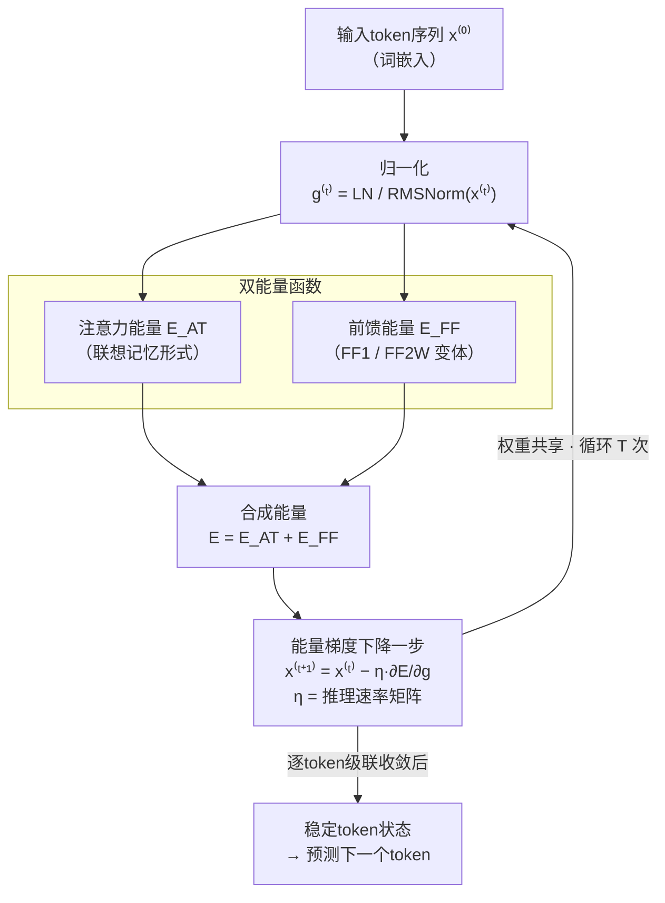

# NRGPT: An Energy-based Alternative for GPT

**会议**: ICLR 2026  
**arXiv**: [2512.16762](https://arxiv.org/abs/2512.16762)  
**代码**: 无  
**领域**: 优化  
**关键词**: 能量基模型, GPT, 自回归, 梯度下降推理, 渐近稳定性

## 一句话总结

提出NRGPT（eNeRgy-GPT），对标准GPT进行最小修改使其成为能量基模型：设计注意力能量和前馈能量函数，使每层前向传播等价于token在能量landscape上的梯度下降步，证明了渐近能量下降和稳定收敛性质，在ListOps/Shakespeare/OpenWebText上验证了与标准GPT可比的性能。

## 研究背景与动机

**领域现状**：GPT架构是自回归语言建模的主流范式，通过next-token prediction实现文本生成。能量基模型（EBM）则是另一重要范式，将推理视为在能量景观上的动力学过程——低能量对应合理样本、高能量对应异常样本。两者看似完全不同，但近年来越来越多的研究暗示它们之间存在深层联系。

**现有痛点**：
1. **GPT与EBM的联系不明确**：Von Oswald等人证明了ICL可能是梯度下降，但仅考虑线性Transformer（无softmax），过度简化
2. **Energy Transformer不适用于GPT设定**：ET为BERT-like掩码补全设计——掩码token快速演化以匹配缺失部分，而GPT中没有掩码，每个token需要演化为序列中的下一个token
3. **EBM for LLM的现有工作**：如EBT将能量计算放在标准Transformer前向传播的输出端，而非将前向传播本身视为能量优化过程
4. **缺乏将GPT前向传播直接转化为能量landscape探索的理论框架**

**核心矛盾**：如何在不改变训练范式（自监督next-token prediction）的前提下，让GPT的推理过程具有EBM的理论优势（可解释性、系统化解空间探索、自然的对齐机制）？

**本文方案**：对平行Transformer（GPT-J风格）进行最小修改——让注意力和前馈网络分别成为两个能量函数的梯度，从而使每一层的前向传播变成能量梯度下降的一步。

## 方法详解

### 整体框架

NRGPT把GPT-J风格的平行Transformer改写成一个权重共享的循环架构：单个模块反复应用 $T$ 次，替代传统 $T$ 层各自独立权重的堆叠。关键的视角转换在于，让注意力和前馈网络分别成为两个能量函数的梯度，这样每一次模块应用就等价于token表示在能量landscape上做一步梯度下降 $x^{(t+1)} = x^{(t)} - \eta^{(t)} \frac{\partial E}{\partial g^{(t)}}$，其中 $g^{(t)} = \text{LN}(x^{(t)})$ 是经LayerNorm/RMSNorm归一化后的表示，$\eta$ 是推理速率矩阵（inference rate matrix）。每个token都被看成一颗在自己能量景观上滚动的粒子，反复迭代直到收敛，最终的稳定状态即用于预测下一个token。训练范式完全不变，仍是自监督next-token prediction，只是把前向传播本身重新解释成了能量优化过程。

### 关键设计

**1. 双能量函数：让注意力与前馈各自成为某个能量的梯度**

NRGPT没有另起炉灶定义新算子，而是反推出两个能量函数，使其梯度恰好长得像标准Transformer的注意力和MLP。注意力能量借鉴Dense Associative Memory的形式，写作 $E_A^{\text{AT}} = -\frac{1}{\beta} \sum_h \alpha_h \log [ \sum_{B<A} \exp(\beta \cdot g_B^\top J_h g_A) ]$，其中 $J_h = [W^K_h]^\top W^Q_h$ 把Key和Query投影合并成单个交互矩阵，$\alpha_h$ 是可学习的头权重，$\beta$ 是温度。对 $g_A$ 求梯度后得到的更新结构与多头注意力高度对应——原始的输出投影 $[W^P_h]^\top W^V_h$ 在能量视角下变成 $\alpha_h \eta J_h^\top$。前馈部分给出两个变体：FF1取 $E^{\text{FF}} = -\|\sigma(Wg_A)\|^2$，其梯度对应只含单个权重矩阵的前馈更新；FF2W取 $E^{\text{FF}} = -g_A^\top W^2 \sigma(W^1 g_A)$，梯度展开后含两个权重矩阵，更贴近标准的双层MLP。两者都保证了"前向即下降"这一核心性质，区别只在表达力与参数量的取舍。

**2. 能量下降与渐近稳定性：用因果掩码把收敛性逐token递推出来**

光有能量函数还不够，必须保证反复应用真的在把能量推低。Proposition 2.1给出充分条件：当推理速率取 $\eta = c \cdot \text{diag}(\gamma)$（$c > 0$，$\gamma$ 来自LayerNorm的缩放参数）时，更新规则保证渐近能量下降 $\dot{E}_A < 0$；若不带LayerNorm即 $g = x$，则Proposition 2.2进一步放松条件，只要 $\eta$ 的对称部分 $\eta_+ = (\eta + \eta^\top)/2$ 半正定即可，反对称部分 $\eta_-$ 不受约束。真正精彩的是收敛性论证如何借力因果注意力掩码：由于token $A$ 的能量 $E_A$ 只依赖 $B \leq A$ 的token，第一个token的能量单调下降且有下界，必然收敛到不动点；它稳定之后，第二个token的能量也随之单调下降，如此沿序列递归推进，最终所有token都渐近收敛到稳定状态。这种"逐token级联收敛"正是NRGPT区别于一般EBM的渐近稳定性现象。

**3. 与标准Transformer的结构对应：最小改动换来能量解释**

整套设计的落点是"最小修改"——NRGPT在结构上几乎就是一个权重共享的GPT，只是每个组件被重新赋予能量梯度的含义。注意力输出矩阵从 $[W^P]^\top W^V$ 变为 $\alpha \eta J^\top$，前馈第二层权重从独立的 $W^2$ 绑定为 $W^1 \eta^\top$，层间从"不同层不同权重"改为"权重共享 + 循环应用"，推进机制从逐层传播变成能量landscape上的梯度下降。正因为改动如此之小，NRGPT能直接复用GPT的训练流程，却额外获得了可解释性、解空间系统化探索、以及天然对齐机制等EBM的理论优势。

## 实验结果

### 主实验：ListOps嵌套数学运算

测试最大值、中位数、模20求和三种嵌套运算：

| 模型 | 学习转变点（参数量） | 最终准确率 |
|:---|:---:|:---:|
| GPT_Rec_parallel | 2.3×10⁴ | ~100% |
| NRGPT_H_FF1 | 2.4×10⁴ | ~100% |
| NRGPT_H_FF2W | 2.98×10⁴ | ~100% |

NRGPT各变体在ListOps上与基线性能匹配，学习转变点非常接近。

### OpenWebText语言建模

| 模型 | 参数量 | Val Loss (mean±std) | Val Loss (min) |
|:---|:---:|:---:|:---:|
| GPT (12层) | 124M | 2.921±0.005 | 2.915 |
| GPT_Rec_parallel | 85M | 3.454±0.037 | 3.411 |
| NRGPT_H_FF2W | 90M | 3.467±0.073 | 3.404 |

**关键发现**：NRGPT在参数量少34M的情况下达到了与循环GPT基线可比的验证损失（3.404 vs 3.411）。

### 消融：抗过拟合特性

| 模型 | Shakespeare训练集Loss | 验证集Loss | 过拟合程度 |
|:---|:---:|:---:|:---:|
| GPT | 极低 | 较高 | 严重（大模型） |
| GPT_Rec_parallel | 较低 | 较高 | 中等 |
| **NRGPT** | 中等 | **与验证相当** | **轻微** |

在Shakespeare数据集上，NRGPT在大参数量时表现出显著的抗过拟合特性——最佳验证损失与GPT基线相当，但训练集过拟合程度明显更低。这可能是因为能量landscape的梯度下降过程天然具有正则化效果。

## 论文评价

### 优点

1. **理论优雅**：通过最小修改建立GPT与EBM的严格联系，能量下降和渐近稳定性的证明利用了因果掩码的结构，非常漂亮
2. **开辟新方向**：将推理视为能量优化为LLM提供了全新视角，可能带来对齐（通过能量正则化）、可解释性（通过能量landscape分析）等应用
3. **抗过拟合现象**有趣且有实际价值

### 不足

1. 当前规模仅验证到124M参数，与现代LLM的规模差距巨大，可扩展性尚不明确
2. 权重共享约束使NRGPT比标准GPT参数效率更低（需要更多循环步数补偿）
3. 推理速率 $\eta$ 的约束较强（$\eta = c \cdot \text{diag}(\gamma)$），限制了模型的表达力
4. 验证损失与标准GPT仍有差距（3.404 vs 2.915），尽管参数量不同

### 评分

⭐⭐⭐⭐

**推荐理由**：在GPT与EBM之间建立了迄今最紧密的理论联系，渐近稳定性的证明特别精彩。虽然当前实验规模有限，但理论贡献足以开辟新的研究方向——如何利用能量landscape的显式优化来改进LLM的对齐、鲁棒性和可解释性。

<!-- RELATED:START -->

## 相关论文

- [\[ICLR 2026\] ConRep4CO: Contrastive Representation Learning of Combinatorial Optimization Instances across Types](conrep4co_contrastive_representation_learning_of_combinatorial_optimization_inst.md)
- [\[ICLR 2026\] A Tale of Two Geometries: Adaptive Optimizers and Non-Euclidean Descent](a_tale_of_two_geometries_adaptive_optimizers_and_non-euclidean_descent.md)
- [\[ICLR 2026\] SPREAD：基于采样的高效自适应扩散 Pareto 前沿精化](spread_sampling-based_pareto_front_refinement_via_efficient_adaptive_diffusion.md)
- [\[ICLR 2026\] Neural Sum-of-Squares: Certifying the Nonnegativity of Polynomials with Transformers](neural_sum-of-squares_certifying_the_nonnegativity_of_polynomials_with_transform.md)
- [\[ICLR 2026\] Elastic Optimal Transport: Theory, Application, and Empirical Evaluation](elastic_optimal_transport_theory_application_and_empirical_evaluation.md)

<!-- RELATED:END -->
