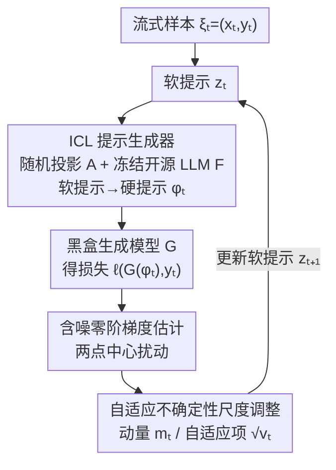

# Online Black-Box Prompt Optimization with Regret Guarantees under Noisy Feedback

**会议**: ICLR 2026  
**OpenReview**: [https://openreview.net/forum?id=7MzaG8dHRv](https://openreview.net/forum?id=7MzaG8dHRv)  
**代码**: https://github.com/fangjj2000/ICLR_AOZPT_2026  
**领域**: 零阶优化 / 在线学习 / 黑盒提示优化  
**关键词**: 黑盒提示调优, 零阶优化, 在线学习, 局部 regret, 不确定性尺度

## 一句话总结
本文提出 AOZPT，首个把黑盒提示优化放进**在线学习 + 含噪反馈**场景的零阶方法：用一个自适应不确定性尺度调整机制压住「生成模型输出噪声 + 零阶梯度高方差」这两类不确定性，并在非凸设定下证明可达到**亚线性 regret**，在文本和图像生成任务上比离线/在线基线更稳更好。

## 研究背景与动机

**领域现状**：当只能通过 API 调用商用生成模型、拿不到内部表示和梯度时，调优只能落在输入侧的「黑盒提示优化」上。主流做法（BBT、RLPrompt、BDPL、ZOPO 等）几乎都是**离线**的：在一个固定数据集上反复评估、用贝叶斯优化 / 进化算法 / 强化学习把提示优化到收敛。

**现有痛点**：离线范式有两个硬伤。其一，它假设数据分布静止，无法适应实时变化的数据流——客服、电商推荐、情感陪伴这类系统每来一批新交互就得在全量数据上重训，代价高且响应慢。其二，它普遍**忽略生成模型输出的随机性**：即便参数和输入都固定，采样温度、随机种子也会让同一个提示得到不同输出，这种随机性在优化视角下就是噪声，会污染对提示好坏的评估。

**核心矛盾**：要做在线，就得用「来一个样本更新一次」的轻量梯度方法；但提示是离散自然语言、没有可微梯度，只能用零阶优化（ZOO）靠有限次函数评估去近似梯度，而零阶估计本身**方差极高**。于是问题叠加成「生成噪声 + 零阶方差」两重不确定性，直接套用现成的贝叶斯 / 进化方法（需要频繁更新代理模型或评估大量样本）在在线流式场景下不可行。

**本文目标**：在流式数据上做黑盒提示优化，要求 (1) 每轮只用当前样本增量更新、不重训；(2) 抑制两重不确定性让更新稳定；(3) 给出可证明的 regret 保证。

**切入角度**：把零阶优化和在线非凸学习缝在一起——用滑动窗口的局部 regret（local regret）作为在线非凸的评价标准，再借鉴 Adam 类自适应优化的「动量 + 自适应分母」思想，但把它重新设计成专门压制不确定性的尺度调整项。

**核心 idea**：用一个**自适应不确定性尺度调整**机制，把历史含噪零阶梯度的指数加权均值（动量）除以其平方的指数加权均值（自适应项），在每个维度上自动缩放梯度幅度，从而同时吃掉生成噪声和零阶方差，并证明这样能换来亚线性 regret。

## 方法详解

### 整体框架

AOZPT 在每一轮 $t$ 处理一个流式样本 $\xi_t=(x_t,y_t)$，目标是优化提示 $\phi$ 使损失 $f^t(\phi^t)=\ell(G(\phi^t;x_t),y_t)$ 最小（$G$ 是黑盒生成模型）。由于 $\phi$ 是离散文本无法求导，整条管线绕道「软提示」来做：维护一个低维连续向量 $z_t\in\mathbb{R}^d$（软提示），经随机投影矩阵 $A$ 升维后喂给一个**冻结的开源 LLM** $F$，由 $F$ 生成语义化的离散硬提示 $\phi_t=F(Az_t+\phi_0;\xi_t)$；硬提示再送进黑盒生成模型 $G$ 拿到损失。优化只发生在低维软提示 $z_t$ 上：用含噪两点零阶估计器近似梯度，再过一道自适应不确定性尺度调整后更新 $z_t$，形成闭环。

### 关键设计

**1. ICL 提示生成器：把离散提示优化偷换成连续软提示优化**

痛点很直接——提示 $\phi$ 是自然语言，含大量离散结构，梯度类方法根本无从下手。本文复用 InstructZero 的思路：不去直接优化离散硬提示，而是优化一个低维连续软提示 $z_t\in\mathbb{R}^d$，再让一个冻结的开源 LLM 把它「翻译」成高质量硬提示。具体地，用随机投影矩阵 $A\in\mathbb{R}^{D\times d}$（$D\gg d$）把 $z_t$ 投到 LLM 的高维 embedding 空间，与基础提示拼接后输入 $F$ 生成 $\phi_t=F(Az_t+\phi_0;\xi_t)$。这一步的价值在于两点：把不可微的离散优化转成可做零阶估计的低维连续优化（$d$ 远小于 $D$，零阶方差随维度增长，低维很关键），同时借开源 LLM 的语言理解能力保证生成的硬提示语义通顺，而不是乱码式扰动。

**2. 含噪零阶梯度估计：在没有梯度的黑盒上用两点扰动近似方向导数**

软提示连续了，但 $G$ 仍是黑盒、且输出带随机性。本文把生成模型的随机性显式建模为 $\delta(z_t)$，带噪目标记作 $f^t_\delta(z_t)=f^t(z_t)+\delta(z_t)$。对软提示 $z$ 用**两点中心随机梯度估计**：

$$\hat\nabla_z f^t_\delta(z_t)=\frac{f^t_\delta(z_t+\mu u_t)-f^t_\delta(z_t-\mu u_t)}{2\mu}\,u_t,$$

其中 $\mu$ 是平滑参数，$u_t$ 从单位球面 $S^d=\{u\in\mathbb{R}^d:\|u\|_2=1\}$ 采样。每轮只需把 $z_t\pm\mu u_t$ 分别走一遍「LLM 生成硬提示 → $G$ 出损失」即可，契合在线「一样本一更新」的预算。但正因为只用两次评估、且评估本身被 $\delta$ 污染，这个估计是**含噪且高方差**的，单独用它更新会抖得很厉害——这正是下一个设计要解决的。

**3. 自适应不确定性尺度调整：用滑动窗口的动量/自适应项同时压噪声与方差**

这是全文的核心机制。它借 Adam 的「一阶动量 / 二阶自适应」骨架，但改造成在滑动窗口上、专门对付不确定性的版本。更新式为

$$z_{t+1}\leftarrow z_t-\eta\cdot\frac{m_t}{\sqrt{v_t}+\epsilon},$$

其中动量项 $m_t=\frac{1}{W}\sum_{i=0}^{w-1}\alpha^i\,\hat\nabla_z f^{t-i}_\delta(z_{t-i})$ 是最近 $w$ 步含噪零阶梯度的指数加权均值，让更新方向更平滑稳定；自适应项 $v_t=\frac{1}{M}\sum_{i=0}^{w-1}\beta^i\,[\hat\nabla_z f^{t-i}_\delta(z_{t-i})]^2$ 是历史梯度平方的指数加权均值（$0<\alpha,\beta<1$，$W,M$ 为归一化常数）。把 $v_t$ 放进分母，等于按各维度梯度的历史能量逐维缩放步长：某个方向噪声/方差大、平方累积高，就自动收小步长，反之放大。这样「生成噪声」和「零阶方差」两类不确定性都被压进同一个尺度因子里，而不是靠固定学习率硬扛。与普通 Adam 的区别在于它用**有限滑动窗口**而非全历史累积，既贴合在线场景的非平稳性，又是后面 regret 证明里能把窗口长度 $w$ 当旋钮来控误差的关键。

### 损失函数 / 训练策略

理论保证用滑动窗口**局部 regret** 衡量在线非凸优化质量。指数加权滑窗平均函数为 $F^t_{w,\alpha}(z_t)=\frac{1}{W}\sum_{i=0}^{w-1}\alpha^i f^{t-i}(z_{t-i})$，局部 regret 定义为其梯度范数的累积：

$$R(T)\triangleq\sum_{t=1}^{T}\big\|\nabla_z F^t_{w,\alpha}(z_t)\big\|_2^2.$$

在 Lipschitz 梯度、$f$/噪声/梯度有界等假设下，论文用两条引理分别界定含噪零阶梯度的范数（Lemma 4.7）和它与真实梯度的偏差（Lemma 4.8），最终（Theorem 4.9）把 regret 拆成三项 $R(T)\le E_1+E_2+E_3$：$E_1$ 是标准一阶梯度误差，$E_2$ 是零阶方差与生成噪声的累积项（可由窗口长度 $w$ 调控），$E_3$ 是自适应算法的常见项。整理后得

$$R(T)=O\!\left(\frac{T}{W}+\frac{T M^{1/2}}{W}\right),$$

并指出当 $\alpha,\beta\to1^-$、$\beta\le\alpha\le\beta^{1/2}$ 且 $w=T^{1/2}$ 时，该界可压成**关于 $T$ 亚线性**——即平均 regret 随时间趋于零，给出了在线黑盒提示优化首个带噪声的收敛性证明。

## 实验关键数据

任务覆盖文本生成（CNN/DailyMail 摘要用 F1、GSM8K 数学用准确率）和图文生成（Anime / Painting 用美学评分 Aesthetic Score Predictor，基于 CLIP embedding）。软提示由 Vicuna-7B/13B 生成；下游黑盒模型包括 Llama-3.1-8B、GPT-3.5-turbo、Qwen2.5-14B（文本）与 Dreamlike-2.0、Stable Diffusion v1.5（图像），每组 3 个随机种子。主对比对象 ZO-OGD 是去掉自适应机制的在线零阶基线，另有 MP / ICL / BDPL / RLPrompt / SFT / Promptist 等改自离线设定的经典基线。

### 主实验

| 任务 / 数据集 | 模型 | 指标 | AOZPT | ZO-OGD | 最强经典基线 |
|------|------|------|------|------|------|
| 摘要 CNN/DailyMail | Qwen2.5-14B | F1 | **24.767** | 22.034 | 23.064 (ICL) |
| 数学 GSM8K | Llama-3.1-8B | Acc | **69.733** | 65.067 | 66.867 (RLPrompt) |
| 数学 GSM8K | Qwen2.5-14B | Acc | **92.933** | 92.533 | 89.000 (BDPL) |
| 图像 Anime | SD v1.5 | 美学 | **5.930** | 5.892 | 5.710 (ICL) |
| 图像 Painting | SD v1.5 | 美学 | **6.313** | 6.287 | 6.103 (SFT) |

AOZPT 在多数「数据集×模型」组合下取得最佳，且**稳定超过 ZO-OGD**，直接验证自适应不确定性尺度调整带来的增益。注意横向比较需谨慎：不同模型/任务难度不可直接比大小，GPT-3.5-turbo 上 GSM8K 经典基线 MP（69.2）反而高于若干方法，说明黑盒提示优化的收益与底座模型强相关。

### 消融实验

| 配置 | 作用 | 说明 |
|------|------|------|
| Full（AOZPT） | 完整 | 软提示 + 含噪零阶 + 自适应尺度 |
| w/o 自适应尺度调整 | 退化为 ZO-OGD | 主表中 ZO-OGD 普遍低于 AOZPT，验证该机制是稳定性来源 |
| w/o 开源 LLM 生成 | 去 ICL 生成器 | Table 10 显示开源 LLM 对生成高质量硬提示必要 |
| 数据漂移强度 (10/50/75/150) | 鲁棒性 | Table 6 中在线算法在各漂移水平下美学评分更高 |
| vs 其他自适应梯度算法 | 机制对比 | Table 12 比较本文尺度调整与常见自适应优化器 |

### 关键发现
- 贡献最大的模块是自适应不确定性尺度调整：去掉它（即 ZO-OGD）在几乎所有设置上掉点，且方差（标准差）更大，印证它主要买的是「稳定性」而非单纯峰值性能。
- 开源 LLM 生成器不可省：直接优化离散提示或去掉语义生成会显著降质，说明软提示→硬提示的语言化是有效性前提。
- 在线优势在数据漂移下最明显：分布越非平稳，在线增量更新相对离线重训的收益越大，呼应动机里客服/陪伴/教育等实时场景。

## 亮点与洞察
- **把 Adam 重新解释成「不确定性压制器」**：同样是动量/自适应分母，本文不再把它当通用加速器，而是论证 $\sqrt{v_t}$ 分母恰好按维度吸收零阶方差与生成噪声，并把窗口长度 $w$ 变成 regret 界里可调的误差旋钮——这个「机制↔理论」的对应很巧。
- **首个给在线黑盒提示优化带噪声 regret 保证**：以往黑盒提示工作几乎只报实验，本文在非凸 + 含噪 + 零阶三重困难下给出亚线性界，理论上把「为什么这个尺度调整有效」讲清楚了。
- **低维软提示是零阶可行的隐藏前提**：零阶方差随维度爆炸，借随机投影把优化压到低维 $d$ 才让两点估计在在线预算内可用，这个迁移技巧可用到其他黑盒 API 调优场景。

## 局限与展望
- **依赖一个本地开源 LLM 做生成器**：软提示→硬提示要额外跑 Vicuna-7B/13B，部署上并非纯 API 轻量，且生成质量受这个开源模型上限约束。
- **「噪声」建模较粗**：把生成随机性统一抽象成有界 $\delta(z)$，真实场景中温度、采样策略、对抗扰动带来的噪声结构各异，有界假设是否处处成立存疑（⚠️ 以原文假设为准）。
- **在线场景为模拟流式数据**：实验用固定数据集切成流来近似在线，真实非平稳分布/概念漂移下的表现仍待更贴近生产的验证；提升幅度在强底座（如 Qwen2.5-14B）上较小，收益空间受底座挤压。
- 改进方向：自适应调整 $\mu$、$w$、$\alpha/\beta$ 而非固定超参；探索多点/方差缩减零阶估计进一步压方差；把噪声建模做成分布感知而非简单有界。

## 相关工作与启发
- **vs InstructZero (Chen et al., 2023)**：本文直接复用其「软提示→冻结 LLM 生成硬提示」的生成器，但 InstructZero 是离线贝叶斯优化，本文换成在线零阶 + 自适应尺度，并补上 regret 理论。
- **vs ZO-OGD（在线零阶基线）**：两者都做在线零阶，区别在本文多了自适应不确定性尺度调整这一层；实验显示该层是稳定性与多数增益的来源。
- **vs 离线黑盒方法（BBT / RLPrompt / BDPL / ZOPO）**：它们在静态数据上优化、需重训才能适应新分布；本文主打增量更新与实时适应，针对非平稳数据流。
- **vs 在线非凸学习（Hazan 2017 local regret、Aydore 2019 dynamic local regret）**：本文沿用滑窗局部 regret 框架，但把分析对象换成**含噪零阶**梯度，新增两条引理处理零阶+噪声的双重不确定性。

## 评分
- 新颖性: ⭐⭐⭐⭐⭐ 首个把黑盒提示优化做成在线 + 含噪并给出 regret 保证，机制与理论结合扎实
- 实验充分度: ⭐⭐⭐⭐ 覆盖文本/图像多任务多模型 + 数据漂移消融，但在线为模拟流式、强底座增益偏小
- 写作质量: ⭐⭐⭐⭐ 动机—机制—理论链条清晰，理论部分符号略密
- 价值: ⭐⭐⭐⭐ 为实时、黑盒、分布漂移场景的提示优化提供可证明的稳定方案

<!-- RELATED:START -->

## 相关论文

- [\[AAAI 2026\] Instance Generation for Meta-Black-Box Optimization through Latent Space Reverse Engineering](../../AAAI2026/optimization/instance_generation_for_meta-black-box_optimization_through_latent_space_reverse.md)
- [\[ICLR 2026\] Convergence of Regret Matching in Potential Games and Constrained Optimization](convergence_of_regret_matching_in_potential_games_and_constrained_optimization.md)
- [\[ICLR 2026\] Error Feedback for Muon and Friends](error_feedback_for_muon_and_friends.md)
- [\[ICLR 2026\] Improving Online-to-Nonconvex Conversion for Smooth Optimization via Double Optimism](improving_online-to-nonconvex_conversion_for_smooth_optimization_via_double_opti.md)
- [\[ICLR 2026\] Non-Convex Federated Optimization under Cost-Aware Client Selection](non-convex_federated_optimization_under_cost-aware_client_selection.md)

<!-- RELATED:END -->
