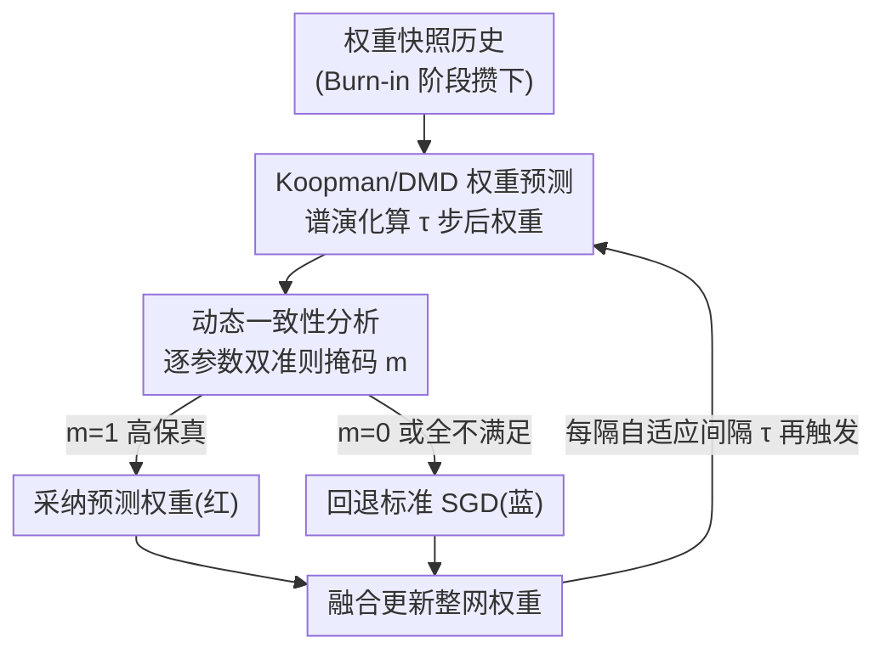

# Predictive Differential Training Guided by Training Dynamics

**会议**: ICLR 2026  
**OpenReview**: [https://openreview.net/forum?id=zSTgrLkpRi](https://openreview.net/forum?id=zSTgrLkpRi)  
**代码**: https://github.com/aicip/PDT  
**领域**: 训练优化 / 收敛加速  
**关键词**: Koopman 算子, 动态模态分解, 权重预测, 差分学习, 训练加速

## 一句话总结
把 DNN 的训练过程当成一个高维权重空间上的非线性动力系统，用 Koopman/DMD 直接预测几个 epoch 之后的权重来跳过 SGD 迭代，并通过一套"动态一致性分析"掩码只采纳那些局部动态与全局动态一致的高保真预测权重，从而作为即插即用插件给各种优化器（SGD/Adam/LAMB 等）提速 10–40%、且不掉精度。

## 研究背景与动机

**领域现状**：现代 DNN 训练的主力仍是 SGD 及其变体（Momentum、RMSprop、Adam、LAMB 等）。这些一阶/二阶优化器本质上是**迭代式**的——必须一步步算梯度、改权重，反复直到收敛，这种"迭代负担"正是训练昂贵的根源。"差分学习"（differential learning，即网络不同部分用不同学习率/更新方式，如 Adam 给每个参数自适应学习率）改进了"怎么更新参数"，但没有触及"迭代过程本身"这个限制。

**现有痛点**：控制论社区近年提出一个全新视角——如果说训练好的网络是作用在输入上的静态非线性系统，那么"训练过程"本身就是作用在高维权重空间上的离散非线性动力系统（权重随每个 epoch 演化）。基于 Koopman 算子理论（KOT）可以用数据驱动方式刻画这套动态，进而**直接预测几个 epoch 之后的权重**、跳过耗时的 SGD 迭代，这类方法被称为"预测式训练"（predictive training）。但实际一用就出问题：没有真实梯度下降，收敛无法保证，对权重空间的扰动极其敏感，误差会跨迭代累积。

**核心矛盾**：现有预测式训练对预测权重**全盘接受**，不检查预测是否"高保真"。而当网络参数量从百万到十亿级别时，Koopman 预测的质量在整个权重空间上**高度不均匀**——有的参数处于稳定、可预测的演化阶段，有的正经历剧烈跳变/振荡。把低质量预测也用上去，尤其在更大更复杂的模型上，极易触发梯度爆炸，导致预测式训练随网络规模增大而失效（论文 Fig. 2 显示在 2/4/6 层全连接网络上，非选择性预测层数一多就崩）。

**本文目标**：让预测式加速能**稳定地扩展到大模型**，同时还能作为轻量插件兼容现有优化器、不引入外部 checkpoint 数据集或逐权重推理开销。

**切入角度**：既然预测质量不均匀，那预测式学习就必须是"选择性"的——只挑那些**局部动态与全局动态对齐**的参数来加速。判断依据来自一个观察：DMD 提取的是整个系统动态的主导模式，处于稳定可预测阶段的参数会与这些全局模式一致，而正在快速跳变/不稳定的参数则会偏离 DMD 背后的"全局线性动态"假设。

**核心 idea**：把"差分学习"思想注入预测式训练，提出 **预测差分训练（PDT）**——用一套基于动态一致性分析的掩码，从 Koopman/DMD 预测出的权重里只选出"高保真"子集去加速，其余参数回退到标准 SGD。正如"水涨船高"，一小撮高保真预测权重就能带动整个网络更快收敛。

## 方法详解

### 整体框架

PDT 的目标是回答三个问题：**何时**启用预测、**怎样**把预测和已有优化器整合、**哪些**参数该被加速更新。整条流水线是在标准优化（OPT）的循环里"见缝插针"地放入预测块（Pred），作为即插即用的增强。

流程上：训练先进入 **Burn-in 阶段**，用基线优化器正常训练若干 epoch，攒下足够多的权重快照历史；之后每隔一个自适应间隔 $\tau$ 触发一次预测——对最近的权重快照矩阵 $W_i, W_{i+1}$ 做 DMD，得到 Koopman 算子的有限维近似 $A$ 的谱分量（特征值 $\Lambda$、模态 $\Phi$），用谱演化一步算出 $\tau$ 步后的预测权重 $w^{pred}_{i+\tau}$；再用**动态一致性分析**对每个参数独立打掩码 $m$，掩码为 1 的位置采纳红色的高保真预测权重、为 0 的位置用蓝色的标准 SGD 权重，两者拼成本步更新。若掩码里没有任何元素满足准则，则该步完全退化为标准 SGD。由于 DMD 预测的算力大致等于一次 GD 操作，而预测只在 epoch 级别偶尔发生（远少于每个 epoch 内多次的 batch 级 GD），整体开销可被收敛加速抵消。

### 关键设计

**1. Koopman/DMD 权重预测：把训练当动力系统，直接跳过 SGD 算未来权重**

这一步解决的是"如何不跑梯度下降就拿到几个 epoch 后的权重"。把权重演化 $w_{i+1}=T(w_i)$ 看作离散动力系统，Koopman 算子 $K$ 在可观测函数空间上是**线性**（虽无限维）的，可对纯点谱按特征值/特征函数分解：$g(x_{i+\tau})=\sum_k \lambda_k^{\tau}\phi_k(x_i)c_k$。由于网络权重本身完全可观测，论文直接取观测函数为恒等映射 $w_i=g(w_i)$。实际用**动态模态分解（DMD）**求 $K$ 的有限维近似 $A$：把权重快照排成两个矩阵满足 $W_{i+1}\approx A W_i$，最小二乘解为 $A=W_{i+1}W_i^{\dagger}=W_{i+1}V\Sigma^{-1}U^{T}$（$W_i=U\Sigma V^T$ 为 SVD）。但 $A$ 是 $N\times N$（$N$ 为参数量，百万到十亿级）直接求不现实，于是用 Standard DMD 把动态投影到低秩子空间，不显式构造 $A$ 就拿到特征值 $\Lambda$ 和高维模态 $\Phi$，最终预测权重为

$$w^{pred}_{i+\tau}=\Phi\Lambda^{\tau}\Phi^{\dagger}w_i$$

其中 $\Phi^{\dagger}w_i$ 把当前状态投影到 DMD 模态上得到 Koopman 模幅。和 Introspection/WNN/NiNo 这类需要**预训练一个外部预测器**（逐权重回归或图网络、依赖 checkpoint 元训练分布、推理开销随模型增大）的学习式预测不同，DMD 只需要权重快照本身、不引入任何外部数据集，天然适合做轻量插件。

**2. PDT 训练框架：Burn-in 攒历史 + 自适应间隔 + 预测/SGD 选择性融合的即插即用结构**

光有预测还不够，要解决"何时预测、怎么和优化器合体"。框架先用 Burn-in 阶段（论文实验里默认从第 5 个 epoch 起预测、用过去 5 个 epoch 一个 epoch 间隔的快照）积累足够长的演化历史，让 DMD 有可靠的拟合数据；之后以自适应间隔 $\tau$ 周期性插入预测块。关键在于预测块只是"叠加"在基线优化循环之上——预测出的权重不是无条件替换，而是经过掩码后只把高保真部分（红）和标准 SGD 权重（蓝）按位拼接成最终更新（正如方法开头六变量玩具例子展示的：只给 $x,y,z$ 三个变量提速、$u,v,w$ 用更新后的值正常优化，53 步降到 25 步，加速约 53%）。正因为是这种"插件叠加"而非"替换优化器"的设计，PDT 才能无缝兼容 SGD、Adam、RMSprop、Shampoo、LAMB 等一大票优化器，且只在 epoch 级别偶尔触发、保持计算高效。

**3. 动态一致性分析：双准则掩码只采纳"高保真"预测，是 PDT 不爆炸的核心**

这是全文最核心的贡献，针对"预测质量在权重空间上高度不均匀、全盘接受会爆炸"这一痛点。它对**每个参数独立**评估两条准则，都满足才把掩码置 1：

其一是 **加速有效性准则（acceleration effectiveness）**：预测带来的位移必须比单步优化更大才值得加速，同时又不能太离谱，于是夹在单步位移和 $\tau$ 倍单步位移之间：

$$\lVert w^{opt}_{i+1}-w^{opt}_i\rVert < \lVert w^{pred}_{i+\tau}-w^{opt}_i\rVert \le \tau\lVert w^{opt}_{i+1}-w^{opt}_i\rVert$$

下界保证预测确实比单步走得远（加速有意义），上界用 $\tau$ 倍作为天花板防止步子迈太大、保证稳定收敛。

其二是 **动态一致性准则（dynamic consistency）**：预测带来的权重变化方向必须和局部基于梯度的演化方向一致，即全局 DMD 捕捉的时间演化要和当前局部优化轨迹同向。逐元素地要求

$$\mathrm{sign}(w^{pred}_{i+k,j}-w^{opt}_{i,j})=\mathrm{sign}(w^{opt}_{i+1,j}-w^{opt}_{i,j}),\quad k=1,\dots,\tau$$

注意这是个**刚性**准则：它不只要求最终预测方向对，而是要求预测轨迹的**每一个中间步** $k$ 都和局部优化方向同向（增长趋势一致）。满足双准则的参数被判定处于"可预测的稳定演化阶段"，可安全加速；不满足的参数可能正经历快速跳变、振荡或不稳定，偏离了全局线性动态假设，必须回退到梯度更新。这套机制概念上类似自适应学习率方法（Adagrad 盯稀有特征、Momentum 盯近期速度最大的权重、Adam 综合两者），但它是从动力系统一致性出发选出"该加速谁"。

### 一个完整示例

以六变量玩具函数 $f(x,y,z,u,v,w)=x^2+y^2+\sin z+u^2-\cos v+w^2+xy+y\sin z+uvw$（学习率 0.01）说明"水涨船高"的直觉：标准 GD 要 53 步才把 loss 降到阈值 0.1 以下。若手动把 $x,y,z$ 的学习率调成 3 倍、$u,v,w$ 用更新后的 $x,y,z$ 值正常优化，轨迹方向不变但只需 25 步（加速约 53%）。把完整 PDT 用到同一问题上则 27 步达到阈值——说明只要**策略性地挑出一个子集加速**，就能带动整体收敛，而 PDT 的掩码正是自动完成这个"挑子集"的过程。

### 损失函数 / 训练策略

PDT 不改原训练目标，沿用基线优化器自己的损失。关键超参为：预测步数 $\tau$、预测间隔 $T_i$、起始 epoch $T_0$、过去快照数 $h$。实验默认配置为从第 5 个 epoch 起预测、用过去 5 个 epoch（一个 epoch 间隔）的快照预测未来 5 步，论文在附录中验证了对这些超参以及不同 batch size/学习率/优化器的鲁棒性。

## 实验关键数据

### 主实验

跨架构（FCN 3.9M → AlexNet 57M → ResNet-50 25.6M → ViT-Base 86.4M → ViT-Huge 632M）、跨数据集（CIFAR-10 → ImageNet-1K）、跨范式（监督 → 自监督）验证。核心指标是 TTB-Loss（达到基线最优训练 loss 的墙钟时间）与 TTB-Acc（达到基线最优验证精度的墙钟时间），所有运行时间都**含 PDT 自身的全部开销**（SVD、多步预测、掩码生成），5 个随机种子取均值。

| 模型 | 优化器 | TTB-Loss 降幅 | TTB-Acc 降幅 |
|------|--------|--------------|--------------|
| FCN | SGD | 39.59% | 31.81% |
| AlexNet | SGD | 37.00% | 34.67% |
| ResNet-50 | SGD-M | 19.36% | 24.14% |
| ViT-Base | AdamW | 10.20% | 17.88% |
| ViT-Huge | AdamW | 9.88% | 10.86% |

可见小模型上提速最猛（接近 40%），随规模增大提速幅度收窄但始终为正（ViT-Huge 仍省约 10%），印证大模型训练动态本身更难预测。

### 优化器通用性 + 自监督泛化

固定 AlexNet/CIFAR-10，换 7 种优化器，PDT 都能缩短到达基线最优 loss 的时间，且最终精度多数还略有提升：

| 优化器 | 基线最终精度 | PDT 最终精度 | TTB-Loss 降幅 |
|--------|-------------|-------------|--------------|
| SGD | 0.7930 | 0.7978 | 19.67% |
| Momentum | 0.6672 | 0.7298 | 41.06% |
| Adam | 0.7952 | 0.8050 | 14.87% |
| AdamW | 0.8031 | 0.8149 | 28.36% |
| RMSprop | 0.7996 | 0.8108 | 15.35% |
| Shampoo | 0.8012 | 0.8101 | 16.03% |
| LAMB | 0.8034 | 0.8140 | 44.24% |

自监督上选 SimSiam（ResNet-18 backbone，CIFAR-10）：PDT 把 TTB-Loss 从 9611s 降到 4923s（降 48.78%），最终验证精度从 0.7285 提到 0.7685，说明优势能迁移到训练动态与监督学习根本不同（stop-gradient + 负余弦相似）的范式。

### 消融与对照实验

论文用三组对照凸显"原则化掩码"的必要性：

| 对照策略 | 结果 | 说明 |
|---------|------|------|
| 随机选子集提学习率（同掩码比例） | 无法匹配 PDT、常致训练不稳 | 证明"挑哪些参数"不能瞎挑 |
| 随机选 Koopman 预测权重（同掩码比例） | 频繁梯度爆炸、出 NaN 不可恢复 | 证明随机采纳预测会发散 |
| 按验证 loss 趋势切换预测/SGD | 初期略占优、后期 loss 暴涨且退回 SGD 也救不回 | 证明仅靠验证 loss 触发切换不够 |

### 关键发现

- **掩码比例曲线**揭示训练规律：早期 loss landscape 平缓、梯度方向稳定，更多权重通过掩码（高比例）；后期接近极小值、梯度震荡，可预测权重骤减。大模型/大数据集（ResNet-50/ViT on ImageNet）的掩码比例下降比小模型（FCN/AlexNet on CIFAR-10）更陡，说明其训练动态内在更复杂、更难预测。
- **双准则缺一不可**：加速有效性（Eq. 6）和动态一致性（Eq. 7）必须同时满足，附录消融验证了二者结合的必要性。
- PDT 对超参（$\tau$、$T_i$、$T_0$、$h$）和训练配置（batch size、学习率、优化器）整体鲁棒。

## 亮点与洞察

- **把训练当动力系统这个视角本身就很"啊哈"**：跳过 SGD 直接预测未来权重在概念上极有诱惑力，但之前一直因为预测质量不均、误差累积而在大模型上崩——PDT 的贡献不是发明预测，而是用一把简单到可解释的"双不等式 + 符号一致"尺子把不可靠的预测筛掉，这正是它能 scale 到 ViT-Huge 的关键。
- **"水涨船高"的差分思想可迁移**：只加速一个高保真子集就能带动整网收敛，这个直觉（玩具例子里只提速 3/6 个变量就快 53%）可启发其他"部分加速"的设计，比如选择性更新、分层提前停止。
- **零外部依赖的插件形态很实用**：不需要像 NiNo/WNN 那样预训练预测器、攒 checkpoint 数据集，也没有逐权重推理开销，DMD 只吃自己的权重快照，几乎可以白嫖地套在任何优化器外面。
- 符号一致性准则要求**每个中间步**都同向（而非只看终点），这种"刚性"是防止预测轨迹中途拐弯导致发散的廉价而有效的护栏。

## 局限与展望

- **预测开销随模型增大而吃紧**：虽然 epoch 级触发能摊薄成本，但 DMD 的 SVD 在十亿参数量级仍不便宜，提速幅度也从小模型的 ~40% 衰减到 ViT-Huge 的 ~10%，对超大模型收益边际递减。作者建议用 streaming DMD 降低构造轨迹矩阵的内存与算力。
- **掩码比例后期骤降**意味着训练越往后 PDT 越接近纯 SGD，加速主要发生在早中期；接近收敛时几乎帮不上忙。
- **依赖全局线性动态假设**：DMD 假设权重演化能被低秩线性算子刻画，对高度混沌/非平稳的训练阶段，能通过掩码的参数会很少，加速空间有限。
- 论文主要在视觉骨干 + CIFAR/ImageNet 上验证，NLP 仅在附录做了跨域评估；对超大语言模型、长训练周期下的稳定性与收益还需更多证据。

## 相关工作与启发

- **vs 学习式权重预测（Introspection / WNN / NiNo）**：它们训练一个外部预测器（逐权重回归或图网络）来预测未来权重，效果受元训练分布制约、推理开销随模型增大、还要 checkpoint 数据集；PDT 用 DMD 直接从自身快照算，无外部依赖、无逐权重推理开销，更适合做轻量插件。
- **vs 非选择性 Koopman 预测式训练（Tano et al. 2020 等）**：它们全盘接受预测权重，网络一大就梯度爆炸（Fig. 2）；PDT 的核心差异就是加了动态一致性掩码做选择性加速，把可 scale 性补上。
- **vs 自适应学习率（Adagrad / Momentum / Adam）**：这些方法也是"差别对待不同参数"，但仍是迭代式的、没有触及"跳过迭代"；PDT 从动力系统一致性出发选择加速对象，是对"该提速谁"的另一种回答。

## 评分
- 新颖性: ⭐⭐⭐⭐⭐ 把"训练即动力系统 + Koopman 预测"这条之前在大模型上失效的路，用一把简单可解释的动态一致性尺子救活并 scale 到 ViT-Huge
- 实验充分度: ⭐⭐⭐⭐ 跨架构/数据集/范式/优化器都验证、5 种子、含全开销计时，但对超大 LLM 和长训练周期覆盖较浅
- 写作质量: ⭐⭐⭐⭐ 动机递进清晰、玩具例子直观，公式与准则交代到位
- 价值: ⭐⭐⭐⭐ 零外部依赖、即插即用、稳定提速 10–40% 不掉精度，工程上很有吸引力，超大模型收益递减是主要顾虑

<!-- RELATED:START -->

## 相关论文

- [\[ICLR 2026\] Difference Predictive Coding for Training Spiking Neural Networks](difference_predictive_coding_for_training_spiking_neural_networks.md)
- [\[ICLR 2026\] Seesaw: Accelerating Training by Balancing Learning Rate and Batch Size Scheduling](seesaw_accelerating_training_by_balancing_batch_size_and_learning_rate_schedulin.md)
- [\[ICLR 2026\] Rapid Training of Hamiltonian Graph Networks using Random Features](rapid_training_of_hamiltonian_graph_networks_using_random_features.md)
- [\[ICML 2026\] Muon in Associative Memory Learning: Training Dynamics and Scaling Laws](../../ICML2026/optimization/muon_in_associative_memory_learning_training_dynamics_and_scaling_laws.md)
- [\[ICLR 2026\] Taming Curvature: Architecture Warm-up for Stable Transformer Training](taming_curvature_architecture_warm-up_for_stable_transformer_training.md)

<!-- RELATED:END -->
