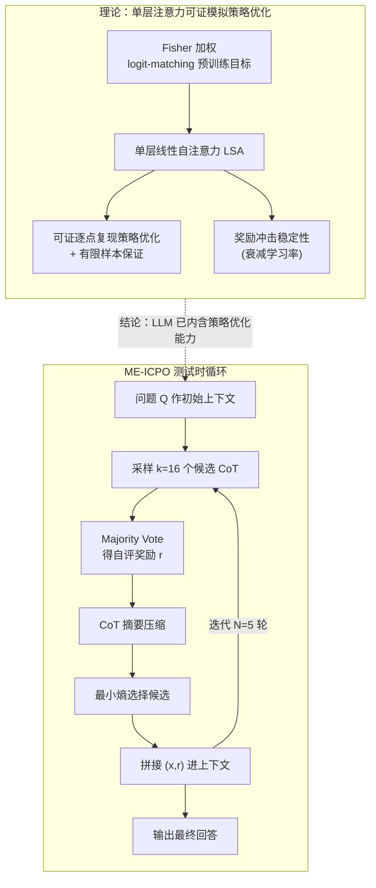

# Provable and Practical In-Context Policy Optimization for Self-Improvement

**会议**: ICLR 2026  
**arXiv**: [2603.01335](https://arxiv.org/abs/2603.01335)  
**代码**: [https://github.com/UNCSciML/ICPO](https://github.com/UNCSciML/ICPO)  
**领域**: 优化  
**关键词**: 上下文学习, policy optimization, 测试时缩放, 自我反思, mathematical reasoning

## 一句话总结
提出 In-Context Policy Optimization (ICPO) 框架，理论证明单层线性自注意力 Transformer 经充分预训练后可在上下文中模拟策略优化算法，并设计实用的 ME-ICPO 算法通过最小熵选择和自评估奖励实现测试时多轮自反思，在数学推理任务上取得显著提升（AIME 2024 上 Qwen2.5-Math-7B 从 11% 提升到 30%）。

## 研究背景与动机

**领域现状**：测试时扩展（test-time scaling）已成为提升 LLM 推理能力的重要范式——模型在推理时通过多轮自反思逐步改进回答，无需更新参数。代表方法包括 Chain-of-Thought、Tree-of-Thoughts、Best-of-N、Self-Refine 等。

**现有痛点**：(a) 自反思能力为何从预训练中涌现？现有工作（如 Park et al. 2024）直接假设 LLM 具有后验采样/策略优化能力，但未解释这种能力的来源；(b) in-context learning 的理论分析主要集中在监督学习（线性回归）和值函数学习（TD learning），尚无关于策略优化的理论；(c) 已有方法如 Tree-of-Thoughts 需要多步搜索，计算开销大。

**核心矛盾**：在上下文中怎样利用历史尝试和奖励反馈来优化自身的输出策略？理论上 Transformer 能否在不更新参数的情况下实现这种策略优化？

**本文目标** (1) 为 LLM 的自反思/自改进行为提供理论基础；(2) 设计一个实用的测试时扩展算法。

**切入角度**：将自反思形式化为 K-臂 bandit 问题中的策略优化——agent 生成回答（action），获得奖励（reward），然后在上下文中积累历史 $\{(\mathbf{x}_1, r_1), ..., (\mathbf{x}_t, r_t)\}$ 来优化下一步行为。

**核心 idea**：Transformer 的自注意力机制天然具有模拟 FTRL 策略优化的归纳偏置，经充分预训练后可在上下文中执行策略优化。

## 方法详解

### 整体框架
本文要回答两个问题：LLM 的自反思能力为什么能从预训练中涌现，以及怎样把这套机制变成一个真正能用的测试时算法。ICPO 把自反思形式化成一个 K-臂老虎机（bandit）：模型对同一问题先生成回答 $\mathbf{x}_t$，拿到奖励 $r_t$（来自自评估或外部信号），把这一对 $(\mathbf{x}_t, r_t)$ 接进上下文历史，再让模型读着越来越长的历史去生成更好的回答 $\mathbf{x}_{t+1}$，如此循环，全程不更新任何参数。

论文沿"可证明 → 实用"两段推进。理论部分把分析对象收窄到单层线性自注意力（Linear Self-Attention, LSA）Transformer，证明它在合适的预训练后能逐字复现一个基于 FTRL（Follow-The-Regularized-Leader）的策略优化（policy optimization）算法——也就是说，自注意力的前向计算本身就等价于在上下文里跑一步策略优化。实用部分据此导出 ME-ICPO（Minimum-Entropy ICPO），一个纯推理时、靠最小熵选择和自评估奖励驱动的多轮自反思循环。下图左半（理论链）解释"为什么单层注意力就能做策略优化"，右半给出"实际怎么跑"的 ME-ICPO 循环。

### 关键设计

**1. Fisher 加权 logit-matching 预训练目标：把"学会策略优化"变成一个监督损失**

要让 Transformer 在上下文里执行策略优化，第一步是给它一个能学到这种行为的预训练信号。本文用的损失是让模型预测的 logit $\hat{\mathbf{s}}_{\tau,t+1}$ 去匹配 FTRL 教师算法给出的目标 logit $\mathbf{s}_{\tau,t+1}^{\text{PO}}$：

$$\mathcal{L}(\theta) = \frac{1}{2} \mathbb{E}_{\tau \in \mathcal{D}} \Big[\sum_t \| \text{Proj}(\hat{\mathbf{s}}_{\tau,t+1} - \mathbf{s}_{\tau,t+1}^{\text{PO}}) \|_{\Gamma}^2\Big]$$

这里两处细节是关键：$\Gamma$ 取策略的 Fisher 信息矩阵做加权，$\text{Proj}$ 把常数偏置投影掉（因为 softmax 策略对 logit 加常数不敏感，这部分不该进损失）。Fisher 加权的意义由 Theorem 4.1 给出——它让这个二次损失正比于策略之间的 KL 散度，于是"匹配 logit"和"匹配策略分布"是一回事，也就解释了为什么直接用一个标准的监督损失，就足以教会 Transformer 自反思，而不需要任何额外的强化学习机制。

**2. 单层注意力就能复现策略优化：可证明性与有限样本保证**

光有损失还不够，得证明这个损失确实能被一层注意力达到、而且不需要海量数据。Theorem 4.2（population equivalence，总体等价性）证明存在最优参数 $\theta^*$，使 LSA 在所有可能的历史输入上都精确复现目标策略优化算法的输出——不是近似，而是逐点相等。Theorem 4.3 进一步给出有限样本下的保证：达到目标精度所需的轨迹数是 $\tilde{O}(N^2 K / c_\lambda^2)$（$N$ 为轮数、$K$ 为臂数、$c_\lambda$ 为正则强度相关常数）。这两条合起来构成本文对"LLM 自反思能力从何而来"的核心回答：单层自注意力的归纳偏置天然就承载了策略优化，并不需要深层堆叠——这也与 Lin et al. (2023) 需要 $\tilde{O}(\sqrt{T})$ 层模拟值函数方法形成对比。

**3. 奖励冲击稳定性（Reward Shock Stability）：噪声奖励不会带偏整条轨迹**

实践中自评估奖励是有噪声的，所以必须知道一次坏奖励会不会污染后续所有轮次。Theorem 4.8 分析了 ICPO 循环对单次奖励扰动 $\delta_r$ 的敏感度，证明只要学习率取 $\eta_t = c/t$ 这种随时间衰减的形式，扰动对策略的影响就会随轮次推进而衰减到零：

$$\mathbb{E}\big[\|\Delta \hat{\mathbf{p}}_{t+1}^s\|_2\big] \leq \frac{a(1+C_b)}{s} \Big(\frac{t}{s}\Big)^{b-1} |\delta_r|$$

这条界给了一个直接的实用结论：用带噪的自评估奖励驱动多轮自反思在理论上是安全的，单次失误会被后续轮次自动稀释，而不是雪球式放大。它也正是下面 ME-ICPO 敢用噪声 Majority Vote 奖励的底气。

**4. ME-ICPO：把理论原则落成一套可跑的测试时循环**

理论说明了"奖励引导 + 衰减学习率"为什么有效，ME-ICPO 把它实例化成不更新参数的纯推理循环（即上图右半），并专门处理直接套用 ICPO 框架时的两个现实难题：上下文越滚越长、以及自评估奖励不可靠。每一轮里，模型先用当前上下文历史 $\mathcal{H}_{t-1}$ 采样 $k=16$ 个候选回答（每个是一整条解题 CoT，而非单步动作）；用 Majority Vote 选出多数答案 $\hat{a}_t$，并以"是否与多数答案一致"作为每个候选的自评估奖励 $r_j^{(t)} = \mathbb{1}[a_j^{(t)} = \hat{a}_t]$，缓解奖励噪声；把候选的 CoT 摘要压缩以控制上下文长度；最后做**最小熵选择**——不是挑奖励最高的候选，而是挑那个能让模型后续回答的熵 $H(\widetilde{\mathcal{H}}_j^{(t)})$ 最小的候选接进上下文。如此迭代 $N=5$ 轮后输出最终回答。最小熵选择对应离线强化学习的"悲观主义"原则：高奖励可能只是偶然，而低熵意味着模型对某个方向已经形成稳定共识，沿这个方向走最不容易被坏奖励带偏、也最不会被引向随机乱答。

## 实验关键数据

### 主实验

| 模型 | Benchmark | Base Mean@16 | w/ ME-ICPO Mean@16 | 提升 |
|------|-----------|-------------|-------------------|------|
| Qwen2.5-Math-7B | AIME 2024 | 11.04 | **30.42** | +19.38 |
| Qwen2.5-Math-7B | AMC | 41.42 | **47.06** | +5.64 |
| Qwen2.5-Math-7B | MATH-L5 | 30.58 | **38.71** | +8.13 |
| Qwen2.5-Math-1.5B | AIME 2024 | 6.46 | **9.79** | +3.31 |
| Qwen2.5-Math-1.5B | MATH-L1 | 49.27 | **57.06** | +12.38 |

在 AIME 2024 上的提升最为显著：7B 模型 +19.38，1.5B 模型 +3.31。ME-ICPO 的 Mean@16 可以超过基线模型的 Maj@k 上限。

### 消融实验

| 配置 | AIME 2024 Accuracy (%) |
|------|----------------------|
| w/o Reward | 19.30 |
| w/o Entropy | 5.77 |
| w/o Entropy & Reward | 6.21 |
| **ME-ICPO (full)** | **30.05** |
| ME-ICPO Oracle | 38.19 |

### 关键发现
- **最小熵选择是最关键组件**：去掉后精度从 30.05% 暴跌至 5.77%，比不做任何操作（6.21%）还差——说明没有合理的选择策略，随机上下文反而有害
- **奖励信号也很重要**：去掉后从 30.05% 降至 19.30%
- **理论验证实验**：LSA 的策略匹配误差快速收敛到数值精度，单次奖励冲击的影响确实随时间衰减
- ME-ICPO 的 Mean@16 可超越基线的 Maj@k 上限——这意味着 in-context 策略优化确实学到了超越简单投票的信息

## 亮点与洞察
- **理论-实践闭环**：从线性自注意力的理论分析出发，推导出实用算法设计原则（奖励引导 + 最小熵选择），再在实际 LLM 上验证——完整的研究闭环
- **最小熵选择的洞察**：不选择奖励最高的候选，而是选择让模型最确信的候选。这在自评估奖励噪声大的场景下尤为重要——高奖励可能是偶然，但低熵意味着模型对某个方向有稳定共识
- **单层就够的理论结论**：与 Lin et al. (2023) 需要 $O(\sqrt{T})$ 层不同，ICPO 仅需单层 LSA，且不随上下文长度增长而需要更多层——更贴近实际 LLM 的长上下文场景

## 局限与展望
- 理论分析基于线性自注意力和线性 bandit 假设，与实际 LLM 和数学推理问题有巨大差距
- ME-ICPO 每轮需采样 16 个候选回答，多轮迭代的计算开销仍然可观
- 自评估奖励基于 Majority Vote，当模型系统性出错时 MV 本身可能给出错误信号
- 仅在数学推理任务上验证，未验证代码生成、逻辑推理等其他领域
- CoT 摘要可能丢失关键推理步骤信息

## 相关工作与启发
- **vs Self-Refine/Reflexion**: 这些工作通过自然语言反馈进行自反思，但没有理论解释为什么有效；ICPO 提供了策略优化视角的理论基础
- **vs Tree-of-Thoughts**: ToT 在每一步搜索，ME-ICPO 每轮优化整个 CoT——更粗粒度但计算效率更高
- **vs TTRL**: TTRL 在测试时进行梯度更新，ME-ICPO 纯 in-context 无参数更新——更轻量
- **vs Best-of-N**: BoN 最终选最好的一个，ME-ICPO 利用多轮迭代积累上下文信息逐步改进——理论上更有优势

## 评分
- 新颖性: ⭐⭐⭐⭐⭐ 首次从策略优化角度为 LLM 自反思提供理论分析，最小熵选择设计新颖
- 实验充分度: ⭐⭐⭐⭐ 理论验证充分，但 LLM 实验仅限数学任务和 Qwen 系列
- 写作质量: ⭐⭐⭐⭐ 理论推导严谨，但理论到实践的过渡可以更紧密
- 价值: ⭐⭐⭐⭐ 为测试时扩展提供理论基础，最小熵选择策略有实用价值

<!-- RELATED:START -->

## 相关论文

- [\[ICLR 2026\] Multi-Action Self-Improvement for Neural Combinatorial Optimization](multi-action_self-improvement_for_neural_combinatorial_optimization.md)
- [\[ICLR 2026\] Toward Principled Flexible Scaling for Self-Gated Neural Activation](toward_principled_flexible_scaling_for_self-gated_neural_activation.md)
- [\[ICML 2025\] Provable In-Context Vector Arithmetic via Retrieving Task Concepts](../../ICML2025/optimization/provable_in-context_vector_arithmetic_via_retrieving_task_concepts.md)
- [\[ICLR 2026\] COLD-Steer: Steering Large Language Models via In-Context One-step Learning Dynamics](cold-steer_steering_large_language_models_via_in-context_one-step_learning_dynam.md)
- [\[ICML 2026\] On the Provable Suboptimality of Momentum SGD in Nonstationary Stochastic Optimization](../../ICML2026/optimization/on_the_provable_suboptimality_of_momentum_sgd_in_nonstationary_stochastic_optimi.md)

<!-- RELATED:END -->
