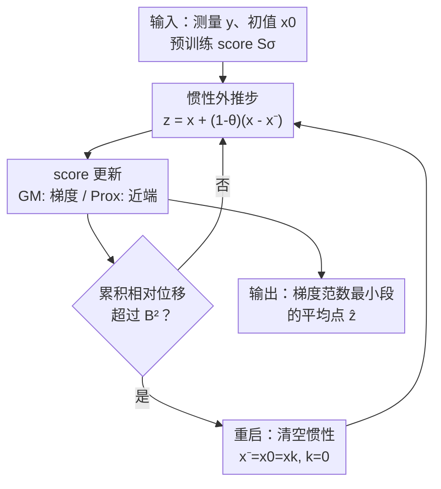

# Provably Accelerated Imaging with Restarted Inertia and Score-based Image Priors

**会议**: ICLR 2026  
**OpenReview**: [https://openreview.net/forum?id=8pQsiFyTQi](https://openreview.net/forum?id=8pQsiFyTQi)  
**代码**: https://github.com/Hopkins-CIG/RISP  
**领域**: 优化算法 / 成像逆问题 / 扩散模型先验  
**关键词**: 成像逆问题, RED, 惯性加速, 重启机制, score-based 先验

## 一句话总结
针对 RED 类成像重建算法收敛慢的问题，本文提出 RISP——给迭代加上「惯性步 + 重启机制」，在不要求先验凸性的前提下把收敛率从 $O(n^{-1/2})$ 证明性地提升到 $O(n^{-4/7})$，在大尺度成像上实测最高提速 24×，同时保持重建质量。

## 研究背景与动机
**领域现状**：成像逆问题（去模糊、补全、超分、MRI 等）本质上是病态的，需要图像先验来正则化。近年主流是把图像去噪器当先验塞进迭代算法，其中 RED（Regularization by Denoising）是代表：它用噪声残差 $x-D_\sigma(x)$ 近似隐式正则项的梯度。借助 Tweedie 公式，当 $D_\sigma$ 是 MMSE 去噪器时，这个残差正比于先验的 score $S(x)=-(x-D_\sigma(x))/\sigma^2$，于是 RED 天然能接入扩散模型的预训练 score 网络，重建质量很强。

**现有痛点**：RED 本质是迭代优化，往往需要大量迭代才收敛，在需要实时处理或大规模数据的场景下运行时间难以接受。社区花了大量精力去设计更精巧的去噪先验来提升质量，却很少认真处理「收敛加速」——加速基本靠启发式的动量，缺乏理论保证。

**核心矛盾**：学习型先验通常让目标函数变成非凸的，而经典的加速技术（如 Nesterov 动量）大多建立在凸性假设之上，直接搬过来既不保证加速、也可能因为惯性累积而过冲（overshoot）、跑离驻点。已有工作虽然实验上验证了惯性的有效性，但始终拿不出「显式加速率」的收敛证明。更糟的是，已有结论表明在一般 Lipschitz 梯度条件下，惯性根本无法改善最坏情况收敛率。

**本文目标**：在非凸 score 先验下，构造一个既能用上惯性加速、又能严格证明比 RED 更快的算法，并给出连续时间层面的解释。

**切入角度**：作者注意到非凸优化的最新进展依赖「Hessian 利普希茨连续」这一更强的二阶条件来获得加速，而这个条件在很多成像问题里恰好成立（所有 AWGN 下的线性逆问题都满足）。配合一个「重启」机制清空累积惯性、抑制过冲，就有希望把加速率证出来。

**核心 idea**：用「重启惯性（restarted inertia）」替换 RED 的纯梯度迭代——平时靠惯性冲得快，一旦累积位移超阈值就重启清零惯性、退回局部梯度更新，从而在不要求先验凸性的前提下拿到可证明的加速。

## 方法详解

### 整体框架
RISP（Restarted Inertia with Score-based Priors）是 RED 的原理性扩展。它要解决的问题是「RED 收敛太慢」，整体思路是：在 RED 的每步迭代前插入一个惯性外推步把更新推快，再叠加一个重启判据，当累积相对位移超过阈值时把惯性清零，防止非凸地形下的过冲。算法跑完后不是直接返回最后一步，而是返回梯度范数最小那段的平均点。

RISP 给出两个实例：**RISP-GM**（梯度版，沿用 RED-GM 的 $\nabla f$ 形式）和 **RISP-Prox**（近端版，用 $\mathrm{prox}_{\eta f}$ 处理数据保真项）。二者共用同一套「惯性 + 重启」骨架，差别只在如何处理数据保真项 $f$。

### 关键设计

**1. 惯性外推步：用动量把慢迭代推快**

RISP 针对的痛点是 RED 纯梯度迭代收敛慢。它的做法是在每步 score 更新之前先做一个惯性外推：$z_k = x_k + (1-\theta)(x_k - x_{k-1})$，其中 $\theta\in(0,1]$ 控制惯性强度，再在外推点 $z_k$ 上做更新。RISP-GM 的更新是 $x_{k+1} = z_k - \eta(\nabla f(z_k) - S(z_k))$，RISP-Prox 则是 $x_{k+1} = \mathrm{prox}_{\eta f}(z_k + \eta S(z_k))$。当 $\theta=1$ 时惯性项消失，RISP 退化回普通 RED，所以 RISP 是 RED 的严格超集。和原版 RED 相比，这里有个干净的实现：RISP 直接把预训练 score $S$ 当作正则项的负梯度用，省去了 RED 里 $\tau(x-D_\sigma(x))$ 那套权重凑配，理论分析和工程实现都更顺。

**2. 重启机制：清空累积惯性，压住非凸过冲**

只加惯性会出事——在非凸地形里累积的惯性会让迭代过冲、甚至冲离驻点，这正是已有工作证不出加速率的根源。RISP 的关键补丁是一个重启判据：当自上次重启以来的累积相对位移超过阈值时触发重启，
$$\text{if}\quad k\sum_{t=0}^{k-1}\|x_{t+1}-x_t\|^2 > B^2,\quad\text{then}\quad x_{-1}=x_0=x_k,\ k=0$$
其中 $B>0$ 是用户设定常数。触发后惯性被清零，算法被迫退回依赖局部梯度的更新，从而抑制过冲、把迭代拉回驻点附近。直觉上，重启相当于给「滚下山的重球」周期性地刹一次车：平时靠惯性冲得远，快要冲过头时就归零重来。正是这个重启让加速率在非凸 score 先验下变得可证。

**3. 可证明的加速收敛率：从 $O(n^{-1/2})$ 提到 $O(n^{-4/7})$**

这是全文的理论核心。作者先给出 RED-GM 的基线：在 score 是梯度场（Assumption 1）、$f$ 梯度利普希茨且 $S$ 利普希茨（Assumption 2）下，取 $\eta=1/L$，$n$ 步后输出点满足 $\|\nabla F(\hat x)\|\le A_0/\sqrt{n}=O(n^{-1/2})$，与经典非凸梯度下降一致。在此基础上额外引入「Hessian 利普希茨连续」二阶条件（Assumption 3，AWGN 下所有线性逆问题都满足），可证 RISP-GM 达到
$$\|\nabla F(\hat z)\|\le 82\varepsilon = O(n^{-4/7}),\quad \varepsilon = 2^{4/7}\Delta_F^{4/7}L^{2/7}\rho^{1/7}n^{-4/7}+L^2\rho^{-1}n^{-4}$$
对 RISP-Prox（额外需要 $f$ 凸、$g$ 弱凸的 Assumption 4，线性 AWGN 问题成立），通过精心设的参数 $\eta=1/(8L)$、$B=\sqrt{\varepsilon/(4\rho)}$、$\theta=4(\varepsilon\rho\eta^2)^{1/4}$、$K=\theta^{-1}$，同样得到 $O(n^{-4/7})$ 的率。关键之处在于：整套分析**不要求 score 先验是凸的**，因此能容纳深度神经网络参数化的先验——这正是经典凸加速技术做不到的。⚠️ 各常数（82、45 等）及 $\varepsilon$ 表达式以原文为准。

**4. 连续时间与 heavy-ball ODE 的桥接**

为给加速一个更本质的解释，作者推导了 RISP 的连续时间极限。在 Assumption 1 下，惯性部分由二阶重球常微分方程刻画：
$$\ddot x_t + \alpha \dot x_t + \nabla F(x_t) = 0,\quad \alpha := \lim_{\eta\to 0}\theta(\eta)/\sqrt{\eta}$$
其解可看成在 $F$ 地形上滚动、受摩擦 $\alpha$ 约束的重球。但纯重球 ODE 不含重启，于是作者进一步给出「连续 RISP」（Algorithm 3）：系统沿重球动力学演化，直到满足重启判据时把速度项 $\dot x$ 归零。这个连续系统统一了两个离散实例——RISP-GM 是它的欧拉离散，RISP-Prox 对应前向-后向离散（近端步算后向梯度）。连续版同样证出 $O(T^{-4/7})$ 的率（Theorem 3），且不要求梯度利普希茨，只靠 Hessian 利普希茨保证停机时梯度范数小。这层桥接既解释了加速从何而来，也能启发设计其他离散加速算法。

## 实验关键数据

实验围绕三个目标：在满足假设的线性逆问题上验证加速理论；在违反部分假设的非线性问题上检验鲁棒性；在大尺度成像上展示实用效率。score 先验统一用 $g_\sigma(x)=\sigma^{-2}/2\,\|x-N_\sigma(x)\|^2$，$N_\sigma$ 为 DRUNet（梯度步去噪器，满足全部假设）。

### 主实验

| 任务 | 设置 | 关键结果 |
|------|------|----------|
| 去模糊（线性） | 梯度范数 vs 迭代 | RISP 200 步内梯度范数降 5 个数量级，RED 仅降 3 个 |
| MRI（线性） | PSNR vs 迭代 | RISP 达到相同 PSNR 约比 RED 快 5× |
| Rician 去噪（非线性） | PSNR vs 运行时 | RISP-Prox 160 ms 达 31.55 dB，RED-GM 需约 10× 时间才追平 |
| 逆散射（大尺度 1024×1024） | PSNR vs 运行时 | RISP 20 min 即恢复清晰细节；RED 跑满 480 min 仍模糊 |

逆散射任务压缩比仅约 8.2%，极度病态，back-projection 只有 13.41 dB；RISP-GM 20 min 达 28.54 dB，而 RED-GM 480 min 才 25.81 dB。

### 消融与分析

| 配置 | 现象 | 说明 |
|------|------|------|
| RISP（含重启） | 稳定快速收敛 | 惯性 + 重启协同 |
| 仅惯性 / θ=1 | 退化为 RED | 失去加速 |
| θ 取值 0.2 | 对该选择鲁棒 | 重启机制增强了稳定性，弱化超参敏感 |
| 大尺度 vs 小尺度 | 大尺度提速更明显（≥24×） | 单步代价高时，减少迭代数对运行时收益更大 |

### 关键发现
- **重启是加速可证的关键**：没有重启，惯性累积导致过冲、证不出加速率；加上重启后非凸 score 先验下也能拿到 $O(n^{-4/7})$。
- **加速不牺牲质量**：PSNR 曲线显示 RISP 用更少迭代达到与 RED 相当的 PSNR，重建图像更干净、边缘保持更好。
- **提速随问题规模放大**：大尺度逆散射上提速至少 24×，作者归因于「单步代价越高，减少迭代数带来的运行时收益越大」。
- **超出理想设定仍鲁棒**：Rician 去噪数据保真项非凸（违反 RISP-Prox 的 Assumption 4），RISP-Prox 仍然收敛。

## 亮点与洞察
- **惯性 + 重启的组合拳**：单独加惯性在非凸下会过冲、证不出加速，单纯重启又失去动量收益；二者结合既快又稳，且把「可证明加速」从凸世界搬进了非凸 score 先验世界，这是最巧的地方。
- **score 即负梯度的干净接口**：RISP 直接把预训练 score 当正则项负梯度用，省掉 RED 的权重凑配，理论与实现同时变简洁，还天然兼容扩散模型的预训练 score 网络。
- **离散↔连续的统一视角**：用一个带重启的重球 ODE 同时解释 GM 与 Prox 两个离散实例（欧拉 vs 前向-后向离散），这种「连续模型生离散算法」的范式可迁移到设计其他加速器。
- **二阶条件换加速**：在一般 Lipschitz 梯度下惯性无法改善最坏率，但成像问题大多满足 Hessian 利普希茨，作者正是抓住这个结构性条件把加速兑现出来——提示我们「领域特有的二阶光滑性」是值得利用的杠杆。

## 局限与展望
- **依赖利普希茨正则性**：加速保证建立在梯度/Hessian 利普希茨条件上，把一些问题（如 Poisson 去噪）排除在外。
- **引入新超参**：惯性权重 $\theta$ 与重启阈值 $B$ 需要调，虽然实验显示在较宽范围内鲁棒，实践中仍可能要手动调参。
- **score 先验需满足结构假设**：要靠梯度步去噪器 + 利普希茨激活才能保证 $S$ 是梯度场且 Hessian 利普希茨，限制了可直接套用的去噪器类型。
- **可延伸方向**：作者指出框架与分析有望推广到 PnP（近端算子直接替换为去噪器的那类方法）；连续 RISP 也可作为通用模板启发更多离散加速算法。

## 相关工作与启发
- **vs RED / PnP**：同样用去噪器/score 当先验、求 MAP 估计，但本文聚焦「收敛加速」这一被忽视的维度，给出显式加速率而非靠启发式动量，并把 score 当负梯度直接用，接口更干净。
- **vs 已有惯性 RED/PnP（Kamilov 2018、He 2019、Tan/Wu/Chow 2024 等）**：那些工作实验上验证了惯性有效，但缺少带显式加速率的收敛分析；本文用重启机制 + Hessian 利普希茨条件补上了可证明加速这一块。
- **vs 扩散模型求解器（DPS 等）**：扩散求解器走的是从后验 $p(x|y)$ 采样的路线，本文走优化求 MAP 的路线；二者共享 Tweedie 公式这一桥梁，意味着预训练扩散 score 网络可直接接入 RISP。
- **vs 凸加速（Nesterov）**：经典加速依赖凸性，本文在非凸 score 先验下靠「重启 + 二阶光滑」实现加速，适用面更广。

## 评分
- 新颖性: ⭐⭐⭐⭐⭐ 把可证明加速从凸世界扩展到非凸 score 先验，惯性+重启组合干净有力
- 实验充分度: ⭐⭐⭐⭐ 覆盖线性/非线性/大尺度多任务，与理论吻合；但主要对比 RED 系，横向 baseline 略窄
- 写作质量: ⭐⭐⭐⭐⭐ 理论与直觉（重球+刹车）讲得清晰，离散↔连续视角统一
- 价值: ⭐⭐⭐⭐⭐ 大尺度成像 24× 提速且不掉质量，理论与实用兼具

<!-- RELATED:START -->

## 相关论文

- [\[ICLR 2026\] Landing with the Score: Riemannian Optimization through Denoising](landing_with_the_score_riemannian_optimization_through_denoising.md)
- [\[ICLR 2026\] Egalitarian Gradient Descent: A Simple Approach to Accelerated Grokking](egalitarian_gradient_descent_a_simple_approach_to_accelerated_grokking.md)
- [\[ICLR 2026\] Incorporating Expert Priors into Bayesian Optimization via Dynamic Mean Decay](incorporating_expert_priors_into_bayesian_optimization_via_dynamic_mean_decay.md)
- [\[CVPR 2026\] Semi-Supervised Conformal Prediction With Unlabeled Nonconformity Score](../../CVPR2026/optimization/semi-supervised_conformal_prediction_with_unlabeled_nonconformity_score.md)
- [\[CVPR 2026\] DABO: Difficulty-Aware Bayesian Optimization with Diffusion-Learned Priors](../../CVPR2026/optimization/dabo_difficulty-aware_bayesian_optimization_with_diffusion-learned_priors.md)

<!-- RELATED:END -->
