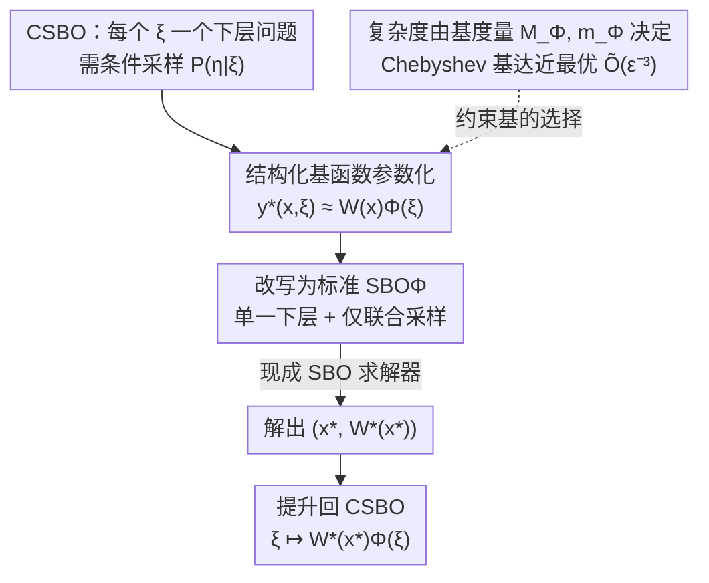

# Reducing Contextual Stochastic Bilevel Optimization via Structured Function Approximation

**会议**: ICLR 2026  
**OpenReview**: [https://openreview.net/forum?id=3qzgB7QIDl](https://openreview.net/forum?id=3qzgB7QIDl)  
**代码**: https://github.com/mbscry/CSBO-reduction  
**领域**: 优化理论 / 双层优化  
**关键词**: 上下文随机双层优化、双层优化、函数逼近、Chebyshev 多项式、样本复杂度

## 一句话总结
本文用一组表达力足够的基函数把上下文相关的下层解 $y^\star(x,\xi)$ 参数化成 $W(x)\Phi(\xi)$，从而把难解的上下文随机双层优化（CSBO）化归为一个标准随机双层优化（SBO）问题，既摆脱了对条件采样 oracle 的依赖，又把 CSBO 的样本复杂度从 $\tilde O(\epsilon^{-4})$ 一举改进到与 SBO 持平的近最优 $\tilde O(\epsilon^{-3})$。

## 研究背景与动机
**领域现状**：很多现实优化任务是双层结构——上层的决策 $x$ 依赖下层的最优解，而下层最优解又随上层的不确定性变化。把这种"下层问题随上下文 $\xi$ 变化"的结构形式化，就得到上下文随机双层优化（CSBO）：

$$\min_{x}\ F(x)\triangleq\mathbb{E}_{(\xi,\eta)\sim P_{(\xi,\eta)}}\big[f(x,\,y^\star(x,\xi),\,\xi,\eta)\big]\quad\text{s.t.}\quad y^\star(x,\xi)=\arg\min_{y}\ \mathbb{E}_{\eta\sim P_{\eta|\xi}}\big[g(x,y,\xi,\eta)\big].$$

其中上层 $f$ 可对 $x$ 非凸，下层 $g$ 对 $y$ 需 $\mu$-强凸以保证 $y^\star(x,\xi)$ 唯一。它涵盖了元学习、个性化联邦学习、逆优化、RLHF、带边信息的鲁棒优化等一大类任务。

**现有痛点**：CSBO 公认难解，根子在于每个采样到的上下文 $\xi$ 对应一个**各自独立**的下层问题。把 SBO 算法朴素搬过来，要在每个迭代点 $x_t$ 上解 $\Theta(\epsilon^{-2})$ 个不同 $\xi$ 的下层问题来估计超梯度 $\nabla F(x_t)$，样本复杂度从 SBO 的 $\tilde O(\epsilon^{-4})$ 膨胀到 $\tilde O(\epsilon^{-6})$（带方差缩减也只到 $\tilde O(\epsilon^{-5})$）。Hu et al. (2023b) 用多级蒙特卡洛把它压到 $\tilde O(\epsilon^{-4})$，但要求存在并已知一个对所有 $\xi$ 都接近 $y^\star(x,\xi)$ 的参考点 $y_0(x)$，实际中常不成立。

**核心矛盾**：除了样本低效，所有现有 CSBO 方法还共享一个更隐蔽的硬伤——它们都需要从条件分布 $P_{\eta|\xi}$（给定 $\xi$ 后 $\eta$ 的分布）采样。可在逆优化、联邦学习这类场景里，联合分布 $P_{(\xi,\eta)}$ 的样本容易拿到，但数据是离线的、或受隐私约束，**根本没法做条件采样**。于是 CSBO 与 SBO 之间在复杂度和可用性上都横亘着一道鸿沟。

**本文目标**：能不能只用联合分布 $P_{(\xi,\eta)}$ 的 i.i.d. 样本，就把 CSBO 的复杂度做到与 SBO 一样的 $\tilde O(\epsilon^{-3})$？

**切入角度**：CSBO 的全部困难都来自 $x$ 与 $\xi$ 通过 $y^\star(x,\xi)$ 的耦合。作者的观察是：若能用一个**对上下文独立的系数 + 对上下文的固定基函数**把这个解显式参数化，耦合就被"拆开"了——下层解只剩对 $x$ 的依赖，对 $\xi$ 的依赖被吸收进确定的基里。

**核心 idea**：把下层解写成 $y^\star(x,\xi)\approx W(x)\Phi(\xi)$（线性系数 $\times$ 非线性基），用这一步把 CSBO 改写成一个**只有单一下层**的标准 SBO，再调用任何现成 SBO 求解器；并证明这个化归既不损失超梯度精度、又能用关于基的几个简单度量刻画出近最优样本复杂度。

## 方法详解

### 整体框架
方法是一个"化归—求解—提升"的三段管线，核心是把对上下文 $\xi$ 的依赖从优化变量里"挤"进一组事先选好的基函数。具体地：用特征映射 $\Phi[N]:\Xi\to\mathbb{R}^N$ 把下层解参数化为

$$y_{\Phi[N]}(W(x),\xi)\triangleq W(x)\,\Phi[N](\xi),\qquad W(x)\in\mathbb{R}^{d_y\times N},$$

其中 $W(x)$ 是**上下文无关**的系数矩阵，$\Phi[N]$ 负责捕捉对 $\xi$ 的非线性依赖。把它代入原问题，得到一个改写后的 SBO（记作 $\text{SBO}_{\Phi[N]}$）：上层仍是 $\min_x \mathbb{E}_{(\xi,\eta)}[f_\Phi(x,W^\star(x),\xi,\eta)]$，下层变成 $W^\star(x)=\arg\min_W \mathbb{E}_{(\xi,\eta)}[g_\Phi(x,W,\xi,\eta)]$。关键的两点是：下层最优解 $W^\star(x)$ 现在**只依赖 $x$**（单一下层问题），且因为 $y_\Phi$ 对 $W$ 是线性的，下层目标对 $W$ 仍保持强凸（只要基不病态）；同时上下两层的期望都变成对**联合分布** $P_{(\xi,\eta)}$ 取，彻底消除了条件采样需求。随后用任意现成 SBO 算法解出 $(x^\star,W^\star(x^\star))$，再通过 $\xi\mapsto y_{\Phi}(W^\star(x^\star),\xi)$ 把解"提升"回 CSBO。

### 关键设计

**1. 结构化基函数参数化：把上下文依赖从优化变量挤进固定基里**

CSBO 难就难在 $x$ 和 $\xi$ 通过 $y^\star(x,\xi)$ 纠缠，导致"每个 $\xi$ 一个下层问题"。本设计直接断掉这层纠缠：令 $y^\star(x,\xi)\approx W(x)\Phi[N](\xi)$，把对上下文的非线性依赖全部塞给**事先选定、与优化无关**的基 $\Phi[N]$，只把上下文无关的系数矩阵 $W(x)$ 留作优化对象。这样原本无穷多个（连续 $\xi$）或 $m$ 个（离散 $\xi$）下层问题被合并成**对 $W$ 的单一下层问题**，且 $g_\Phi(x,W,\xi,\eta)=g(x,W\Phi(\xi),\xi,\eta)$ 的两层期望都对联合分布 $P_{(\xi,\eta)}$ 取，再不需要 $P_{\eta|\xi}$ 的条件采样。由于 $y_\Phi$ 对 $W$ 线性，下层强凸性得以保留（前提是基不病态），所以化归后的问题仍满足现成 SBO 求解器所需的结构假设。这与"用神经网络逼近下层"的做法形成对照：神经网络虽表达力强，但非线性+过参数化让误差界既不紧也不可解释，而线性系数 $\times$ 经典基既保结构又能给出明确误差界。

**2. 化归保真：解改写后的 SBO 就等于解原 CSBO**

参数化只是手段，必须证明"解 $\text{SBO}_\Phi$ 得到的解提升回去仍是 CSBO 的合格解"，否则化归无意义。作者先界定超梯度误差（Proposition 4.1）：

$$\big\|\nabla F(x)-\nabla F_{\Phi_\epsilon}(x)\big\|\le K\cdot\mathbb{E}_\xi\big\|y_{\Phi_\epsilon}(W^\star(x),\xi)-y^\star(x,\xi)\big\|,$$

即只要参数化解在期望意义下逼近真解，改写目标 $F_\Phi$ 的超梯度就逼近真目标 $F$ 的超梯度；常数 $K$ 只依赖 $f,g$ 的 Lipschitz 与强凸常数。难点是 $W^\star(x)$ 由隐式优化定义、右端不好直接界，于是再用下层强凸+最优性把"在 $W^\star$ 处的逼近误差"换成"在任意便于刻画的 $W$ 处的逼近误差"（Proposition 4.2，差一个 $2L_{g,1}/\mu$ 因子）。当基满足**表达力**定义（Definition 3.4，即对任意 $\epsilon$ 存在 $W^\dagger$ 使 $\mathbb{E}_\xi\|y_\Phi(W^\dagger(x),\xi)-y^\star(x,\xi)\|^2$ 小到 $\tfrac{\epsilon^2\mu}{4K^2 L_{g,1}}$）时，两段拼起来给出主结论 Theorem 4.3：**只要 $(x^\star,W^\star(x^\star))$ 是 $\text{SBO}_\Phi$ 的 $\tfrac{\epsilon}{\sqrt2}$-稳定解，提升后的 $(x^\star,\xi\mapsto y_\Phi(W^\star,\xi))$ 就是 CSBO 的 $\epsilon$-稳定解**。这意味着任何现成 SBO 求解器都能"即插即用"地解 CSBO；而且若基诱导的 $\xi\mapsto y_\Phi$ 光滑，一个 $\xi$ 上的梯度步会泛化到其邻域，天然防止对上下文特定噪声过拟合。

**3. 用两个简单基度量刻画样本复杂度：把"基好不好"翻译成可验证的条件**

表达力只保证逼近误差小，但达到它可能需要基的维度 $N_\Phi(\epsilon)$ 很大，导致下层高维或病态。作者不直接拿 $N_\Phi$ 当复杂度代理，而是定义两个更细的度量：

$$M_\Phi(\epsilon)=\max\Big(1,\ \sup_{\xi\in\Xi}\|\Phi_\epsilon(\xi)\|\Big),\qquad m_\Phi(\epsilon)=\min\big(1,\ \lambda_{\min}(\Sigma_{\Phi_\epsilon})\big),$$

其中 $\Sigma_{\Phi_\epsilon}=\mathbb{E}_\xi[\Phi_\epsilon(\xi)\Phi_\epsilon(\xi)^\top]$ 是特征协方差。$M_\Phi$ 上界了特征的最大幅值，$m_\Phi$ 通过协方差最小特征值刻画特征的非退化程度——$m_\Phi>0$ **当且仅当**改写后下层保持强凸（称这类基为 well-conditioned）。把这两个量代进 Guo et al. (2021) 的 Lipschitz/方差常数，得到 Theorem 4.4：

$$\text{样本复杂度}=\tilde O\Big(\epsilon^{-3}\cdot \text{poly}\big(M_\Phi(\epsilon),\ 1/m_\Phi(\epsilon)\big)\Big).$$

直观地，只要基的幅值 $M_\Phi$ 增长慢（步长不必大幅缩小）、且条件数 $1/m_\Phi$ 退化慢（下层强凸性不塌），复杂度就被牢牢控住。**任何满足 $M_\Phi(\epsilon)=\tilde O(1)$ 且 $1/m_\Phi(\epsilon)=\tilde O(1)$ 的表达力基都给出近最优 $\tilde O(\epsilon^{-3})$**——这就把抽象的"选什么基"具体成两个可逐一验证的标量条件。

**4. Chebyshev 多项式：一个真能满足上述条件、达到近最优复杂度的具体基**

度量条件再漂亮，也得有基真的满足。作者用一个反例先敲警钟：单项式基 $(1,\xi,\xi^2,\dots)$ 虽然 $N_\Phi(\epsilon)=O(\ln\epsilon^{-1})$ 增长极慢，但在均匀分布下其协方差恰是 Hilbert 矩阵，导致 $m_\Phi(\epsilon)=\Theta(\sqrt{N_\Phi}\,\sqrt2^{-4N_\Phi})$ 指数级退化，$\epsilon\to0$ 时迅速病态。相比之下，Chebyshev 多项式基天然有界（$|T_k|\le1$ 故 $M_\Phi\le\sqrt{N_\Phi}$），且 $1/m_\text{Chebyshev}(\epsilon)=O(N_\text{Chebyshev}(\epsilon))$ 保持良态。Theorem 4.5 给出充分条件——(c.1) $P_\xi$ 密度有正下界或 $\Xi$ 有限、(c.2) $\Xi$ 有界、(c.3) $G(x,y,\xi)=\mathbb{E}_{\eta|\xi}[g]$ 对 $(y,\xi)$ 解析——此时 Chebyshev 基满足 $M_\Phi(\epsilon)=\tilde O(1)$、$1/m_\Phi(\epsilon)=\tilde O(1)$。证明利用了解析函数的 Chebyshev 级数在 Bernstein 椭圆内**指数收敛**这一经典结论，并将其推广到多元解析函数，得到 $N_\Phi$ 关于 $\epsilon^{-1}$ 次多项式增长。综合 Theorem 4.3/4.4，Corollary 4.6 给出最终结果：用 Chebyshev 基把 CSBO 化归为 $\text{SBO}_\Phi$ 并求解，只需 $\tilde O(\epsilon^{-3})$ 样本，**比现有 CSBO 方法快一个数量级，并匹配非凸随机优化下界（差对数因子）**。这些条件在元学习、带边信息的 Wasserstein DRO、税收设计、奖励塑形等大量场景自然成立。

## 实验关键数据

### 主实验：样本复杂度与 oracle 假设对比
论文核心是理论，Table 1 横向对比了各方法对采样 oracle 的要求与 CSBO 样本复杂度：

| 方法 | 采样 oracle | CSBO 样本复杂度 | 适用范围 |
|------|------------|----------------|----------|
| Guo et al. (2021) | 条件 $P_{\eta\|\xi}$ | $O(m\epsilon^{-3})$ | 仅离散有限 $\Xi$（基数 $m$） |
| Hu et al. (2023b) | 条件 $P_{\eta\|\xi}$ | $\tilde O(\epsilon^{-4})$ | 需已知参考点 $y_0(x)$ |
| **本文** | **仅联合 $P_{(\xi,\eta)}$** | $\tilde O\!\big(\epsilon^{-3}\,\text{poly}(M_\Phi,1/m_\Phi)\big)$；Chebyshev 下 $\tilde O(\epsilon^{-3})$ | 连续/离散，无需条件采样 |

本文是唯一只靠联合采样、且在温和条件下达到与 SBO 同阶 $\tilde O(\epsilon^{-3})$ 的方法。

### 数值验证：逆优化与超参数优化
实证对比对象是 STOCBIO[N]——把上下文空间 $\Xi$ 等分成 $N$ 个区间、每区间当一个独立子问题，得到含 $N$ 个子问题的 SBO 近似；本文方法记 $R_\Phi[N]$，用特征映射 $\Phi[N]$ + STOCBIO[1] 解化归问题。两者在固定 $N$ 下内存完全相同（均 $d_x+Nd_y$），保证公平比较。

| 任务 | 设置 | 关键发现 |
|------|------|----------|
| 逆优化（静态交通分配 STA） | 两边单 OD 网络，估计边容量 | $N=3$ 个基函数即给出合理解；$N=5$ 时三种基都把最优性间隙压到 3% 以内，而 STOCBIO 要到 $N=50$ 才达到同等精度 |
| 超参数优化（MNIST，30% 标签污染，温度连续分布） | 上层加权训练点最小化验证损失，下层对每个温度 $\xi$ 求正则化训练解 | $R_\text{Chebyshev}[5]$ 收敛最快、最终训练/验证损失最低；加更多基函数只有边际增益 |

### 关键发现
- **基的选择决定成败**：Chebyshev 与 Fourier 表现近似且良态；单项式（monomial）基随 $N$ 增大因病态（Hilbert 矩阵）而表达力跟不上，$N$ 大时反而变差——印证了 Theorem 4.4"复杂度由 $M_\Phi,1/m_\Phi$ 而非 $N_\Phi$ 主导"的论断。
- **共享结构带来效率**：STOCBIO 把相邻上下文区间独立、冗余地优化，$N$ 越大收敛越慢；本文学全局系数 $W(x)$，能把资源自动分配到 $y^\star$ 随 $\xi$ 剧烈变化的难区域，因而以更少样本、更低内存追平甚至超过 partition 基线。
- **小 $N$ 即够用**：仅 3–5 个基函数就逼近了需要 STOCBIO 用 50 个子问题才达到的精度，体现了参数化逼近相对暴力离散化的样本/内存优势。

## 亮点与洞察
- **"把变量挤进基"是一个可迁移的解耦思路**：面对"决策随上下文连续变化"的嵌套优化，与其对每个上下文单独求解，不如把上下文依赖塞进固定基、只优化上下文无关系数——这把无穷多子问题塌缩成一个，并顺带消掉条件采样。这个套路在任何"按上下文条件化"的优化里都值得一试。
- **用协方差最小特征值当"基质量探针"很巧妙**：$m_\Phi=\lambda_{\min}(\Sigma_{\Phi_\epsilon})$ 把"下层是否还强凸"翻译成一个可估计的标量，让"换一个基行不行"变成可验证的问题，而不是靠经验。
- **经典逼近论被精准嫁接到优化复杂度**：Chebyshev 级数对解析函数的指数收敛是老结论，本文把它和双层优化的超梯度误差链在一起，得到端到端的近最优样本复杂度，体现了"用对的数学工具能把复杂度白白省一个数量级"。
- **理论与实证互证**：单项式基病态的反例既在理论里（Hilbert 矩阵）也在实验里（$N$ 大反而变差）同时出现，说明复杂度度量 $M_\Phi,m_\Phi$ 抓住的是真实现象而非纸面常数。

## 局限与展望
- **强假设**：下层须 $\mu$-强凸、$f/g$ 各阶导数 Lipschitz、且（用 Chebyshev 时）$G$ 对 $(y,\xi)$ **解析**。解析性在很多实际损失上未必成立，非光滑/弱凸下层不在覆盖范围内。
- **基是预先固定的**：作者也指出在线学习实例相关的基（让参数化更贴合具体问题）是更优方向，当前固定 Chebyshev/Fourier 在 $y^\star$ 不解析或高度各向异性时表达力可能受限。
- **维度依赖隐藏在 poly 项里**：$\tilde O(\epsilon^{-3})$ 的 poly$(M_\Phi,1/m_\Phi)$ 因子对高维上下文 $d_\xi$ 大时的实际开销（基张量积维度爆炸）讨论不足。
- **实验规模偏小**：逆优化只用两边单 OD 网络、超参实验是 MNIST 线性分类，缺乏大规模或真实联邦学习/RLHF 上的验证，"近最优"在更现实的高维场景能否兑现仍待考。

## 相关工作与启发
- **vs Hu et al. (2023b)（CSBO + 多级蒙特卡洛）**：他们靠 MLMC 加速、但每个样本 $\xi$ 不带 warm start 地重解下层，且需条件采样与参考点 $y_0(x)$；本文把所有上下文的下层合并成单一问题、只用联合采样、并把复杂度从 $\tilde O(\epsilon^{-4})$ 改进到 $\tilde O(\epsilon^{-3})$。
- **vs Guo et al. (2021)（离散 $\Xi$ 的 SBO）**：他们在有限基数 $m$ 上达到 $\tilde O(m\epsilon^{-3})$，复杂度随上下文数线性增长且不适用连续 $\xi$；本文复杂度不显式依赖 $m$，连续/离散统一处理。
- **vs 上下文优化（CO）/ 神经网络代理**：本文参数化可看作 $\xi$ 上的结构化线性策略（经非线性基 $\Phi(\xi)$ 提升表达力），但决策来自双层耦合而非直接最小化期望成本；相比神经网络代理（Patel et al. 2022 等），经典正交多项式带来可解释、可证的紧误差界，这是 NN 难以给出的。
- **启发**：当一个困难优化的全部复杂度来自"两个变量通过某个隐式解耦合"，先问能不能用"结构化参数化"把其中一个依赖显式化，往往能把问题降到一个已被充分研究、有现成高效求解器的标准形式。

## 评分
- 新颖性: ⭐⭐⭐⭐⭐ 把经典逼近论（Chebyshev 指数收敛）嫁接到 CSBO，给出"参数化即化归"的干净框架并白省一个数量级复杂度。
- 实验充分度: ⭐⭐⭐ 理论扎实，但数值实验规模偏小（两边网络 / MNIST），高维真实场景验证不足。
- 写作质量: ⭐⭐⭐⭐⭐ 动机—化归保真—复杂度度量—具体基四步推进，定理环环相扣，逻辑清晰。
- 价值: ⭐⭐⭐⭐ 为一大类含上下文的双层优化提供了即插即用、免条件采样的近最优工具，理论意义明确。

<!-- RELATED:START -->

## 相关论文

- [\[ICLR 2026\] Towards Efficient Optimizer Design for LLM via Structured Fisher Approximation with a Low-Rank Extension](towards_efficient_optimizer_design_for_llm_via_structured_fisher_approximation_w.md)
- [\[ICLR 2026\] Faster Gradient Methods for Highly-Smooth Stochastic Bilevel Optimization](faster_gradient_methods_for_highly-smooth_stochastic_bilevel_optimization.md)
- [\[ICML 2025\] Efficient Curvature-Aware Hypergradient Approximation for Bilevel Optimization](../../ICML2025/optimization/efficient_curvature-aware_hypergradient_approximation_for_bilevel_optimization.md)
- [\[ICLR 2026\] Submodular Function Minimization with Dueling Oracle](submodular_function_minimization_with_dueling_oracle.md)
- [\[ICLR 2026\] Bilevel Optimization with Lower-Level Uniform Convexity: Theory and Algorithm](bilevel_optimization_with_lower-level_uniform_convexity_theory_and_algorithm.md)

<!-- RELATED:END -->
