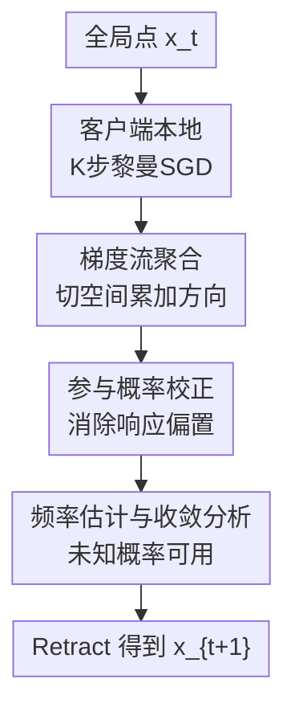

# Riemannian Federated Learning via Averaging Gradient Streams

**会议**: ICLR 2026  
**OpenReview**: [https://openreview.net/forum?id=oEtrDiFOFF](https://openreview.net/forum?id=oEtrDiFOFF)  
**代码**: https://github.com/zhenwei-huang/RFedAGS.git  
**领域**: 黎曼优化 / 联邦优化  
**关键词**: 黎曼联邦学习、梯度流聚合、任意部分参与、非IID数据、收敛分析  

## 一句话总结

这篇论文提出 RFedAGS，在黎曼流形上的联邦学习中不再平均客户端最终模型点，而是把本地随机梯度经向量传输搬回服务器切空间后做加权平均，从而在任意部分参与和非IID数据同时存在时仍能给出收敛保证，并在 PCA、双曲结构预测、SPD Fréchet mean 等任务上优于现有 Riemannian FL 方法。

## 研究背景与动机

**领域现状**：联邦学习的基本范式是服务器维护一个全局模型，客户端只在本地数据上做若干步更新，再把更新结果发回服务器聚合。
在欧氏空间里，FedAvg 可以直接对客户端模型参数做加权平均；在机器学习问题带有几何约束时，参数往往位于 Stiefel、Grassmann、双曲空间、SPD 矩阵流形等黎曼流形上，此时“两个模型点相加再除以二”并不是合法操作。
已有 Riemannian FL 工作通常借助指数映射、指数逆映射、平行传输或投影，把欧氏 FedAvg 的直觉搬到流形上。

**现有痛点**：这些搬法有两个核心难题。
第一，许多流形上指数逆映射和平行传输没有闭式解，比如 Stiefel 流形上常要用迭代近似，服务器聚合的计算负担很重。
第二，已有理论大多只能处理比较理想的情形：全客户端参与、客户端数据接近 IID，或者每轮只做一步本地更新。
一旦同时出现部分客户端不在线、参与概率不均、各客户端数据分布不同、本地更新步数 $K>1$，局部模型会向各自局部目标漂移，传统“平均终点”的聚合很容易偏向错误方向。

**核心矛盾**：黎曼几何约束和联邦系统约束在服务器聚合处叠加了起来。
几何上，服务器不能直接线性平均多个流形点；系统上，参与客户端不是均匀随机的一小批，而可能以未知且不相同的概率响应。
如果仍用普通平均，期望方向不再等价于全局目标 $F(x)=\frac{1}{N}\sum_i f_i(x)$ 的梯度，而会变成某个按参与概率重加权的目标 $\tilde F$ 的梯度。
这意味着算法看似在做联邦优化，实际上可能在优化一个偏置问题。

**本文目标**：作者希望设计一个适用于一般黎曼流形的联邦优化算法。
它需要允许每个客户端做多步本地随机梯度更新，允许非IID数据，允许任意部分参与，并且服务器不知道真实参与概率时也能通过估计来校正偏置。
同时，算法还要避免依赖指数逆映射这类昂贵或不可得的几何算子。

**切入角度**：作者观察到，欧氏 FedAvg 的参数增量可以写成本地梯度序列的平均，而不一定非要理解成“客户端终点模型的平均”。
在黎曼流形上，虽然不同切空间中的梯度不能直接相加，但可以用向量传输把每个本地梯度搬回当前全局点 $x_t$ 的切空间 $T_{x_t}M$。
这样服务器聚合的对象就从非线性的流形点，换成了同一个线性切空间里的“梯度流”。

**核心 idea**：用“平均梯度流”替代“平均客户端终点”，并用参与概率的倒数权重修正任意部分参与带来的偏置。

## 方法详解

### 整体框架

RFedAGS 解决的问题是黎曼流形上的期望型联邦优化：
$$
\min_{x\in M} F(x)=\frac{1}{N}\sum_{i=1}^N f_i(x),\qquad f_i(x)=\mathbb{E}_{\xi\sim D_i}[f_i(x;\xi)].
$$
每轮通信开始时，服务器把当前全局点 $x_t$ 广播给所有客户端；每个客户端从 $x_t$ 出发，在本地流形上做 $K$ 步随机 Riemannian gradient 更新，并在这个过程中把每一步梯度经向量传输搬回 $T_{x_t}M$，累加成一条 gradient stream。
响应服务器的客户端上传这条切空间向量，服务器再按参与概率校正后的权重平均这些 gradient streams，并通过 retraction 回到流形上得到 $x_{t+1}$。

和 Riemannian tangent mean 类方法相比，RFedAGS 的关键差别是服务器不再处理客户端最终点 $x^j_{t,K}$。
传统 tangent mean 大致需要计算 $\operatorname{Exp}_{x_t}^{-1}(x^j_{t,K})$ 后再平均，这个量包含多次非线性映射的组合，既难算也难分析。
RFedAGS 直接把每一步局部梯度拉回 $T_{x_t}M$ 后相加，保留了欧氏空间里“增量等于梯度和”的线性结构。

### 关键设计

**1. 梯度流聚合：把点平均改成切空间方向平均**

这篇论文最核心的设计是把服务器聚合对象从“本地最终模型点”改成“本地梯度流”。
客户端 $j$ 在第 $t$ 轮第 $k$ 步先计算 mini-batch 黎曼随机梯度 $\eta^j_{t,k}$，再用 retraction 做本地更新 $x^j_{t,k+1}=R_{x^j_{t,k}}(-\alpha_t\eta^j_{t,k})$。
由于 $\eta^j_{t,k}$ 位于 $T_{x^j_{t,k}}M$，不同客户端、不同本地步的梯度处在不同切空间，不能直接相加。
作者因此用向量传输 $T_{\tilde\eta^j_{t,k}}$ 把梯度搬回 $T_{x_t}M$，其中 $\tilde\eta^j_{t,k}$ 满足 $R_{x^j_{t,k}}(\tilde\eta^j_{t,k})=x_t$。

客户端上传的不是 $x^j_{t,K}$，而是
$$
\zeta^j_{t,K}=\alpha_t\sum_{k=0}^{K-1}\frac{1}{B_t}\sum_{b\in B^j_{t,k}}T_{\tilde\eta^j_{t,k}}\bigl(\operatorname{grad} f_j(x^j_{t,k};\xi^j_{t,k,b})\bigr).
$$
服务器在随机采样场景下可写成 $x_{t+1}=R_{x_t}\bigl(-\frac{1}{|S_t|}\sum_{j\in S_t}\zeta^j_{t,K}\bigr)$。
这个写法把复杂的“平均流形点”变成了“平均同一切空间里的向量”，所以它既避免了指数逆映射的依赖，也让后续下降引理能像欧氏 FedAvg 那样围绕梯度和展开。
在非IID数据下，这一点尤其重要：平均客户端终点容易被局部最优点拉偏，而平均梯度流更直接地聚合了朝全局目标下降的方向信息。

**2. 参与概率校正：让任意部分参与仍指向原始全局目标**

部分参与不是简单少几个客户端的问题，而是会改变期望优化目标。
如果每个客户端 $i$ 以固定但可能不同的概率 $p_i$ 响应服务器，直接对响应集合 $S_t$ 做 $1/|S_t|$ 平均时，论文证明期望方向等价于 $\sum_i \tilde p_i\operatorname{grad} f_i(x)$，其中 $\tilde p_i$ 由所有客户端参与概率共同决定。
当 $p_i$ 不相等时，通常不存在常数 $\chi$ 使得 $\sum_i \tilde p_i\operatorname{grad} f_i(x)=\chi\operatorname{grad}F(x)$。
也就是说，未校正的算法会优化一个重加权目标 $\tilde F=\sum_i\tilde p_i f_i$，而不是原问题。

RFedAGS 的修正很直接：如果知道真实参与概率，服务器对每个响应客户端使用 $1/(p_iN)$ 权重：
$$
 x_{t+1}=R_{x_t}\left(-\varpi\sum_{i\in S_t}\frac{1}{p_iN}\zeta^i_{t,K}\right).
$$
因为 $\mathbb{E}[\mathbf{1}_{S_t}(i)/(p_iN)]=1/N$，校正后的期望方向重新对齐 $\operatorname{grad}F(x)$。
这不是一个小的实现细节，而是论文理论成立的前提：它把任意部分参与从“带偏采样”变成了“无偏但有方差的梯度流聚合”。

**3. 频率估计与概率误差假设：未知参与统计也能落入理论框架**

真实系统里服务器通常不知道 $p_i$，只能观察客户端过去是否响应。
论文采用频率估计：第 $t$ 轮使用过去 $t-1$ 轮中客户端 $i$ 的参与频率 $q^i_t$ 作为 $p_i$ 的近似，并在当前轮之前计算它，从而保持 $q^i_t$ 与当前参与集合 $S_t$ 的独立性。
算法实际更新时把上式中的 $p_i$ 替换成 $q^i_t$。

理论上，作者把这个近似误差抽象为 Assumption 3.8：$|1/q^i_t-1/p_i|\le \sqrt{G}\alpha_t$，同时 $q^i_t$ 有正的上下界。
这个假设看起来强，但论文进一步用 Bernoulli 大数定律、Hoeffding 不等式和 Chebyshev 不等式说明：当 $q^i_t$ 是历史频率，且步长形如 $\alpha_t=O(t^{-a})$，$a\in(1/2,1]\cup\{0\}$ 时，该条件以高概率成立。
所以 RFedAGS 并不是要求系统事先给出参与统计，而是把“在线估计概率”纳入了收敛分析。

**4. 一套覆盖衰减步长与固定步长的黎曼联邦下降分析**

算法分析的核心是建立 RFedAGS 版本的下降引理。
由于聚合量 $R_{x_t}^{-1}(x_{t+1})$ 已经写成切空间里的梯度流和，作者可以分别控制四类误差：本地多步更新和非IID导致的 agent drift、概率估计误差、部分参与方差、mini-batch 随机梯度噪声。
论文中的 $Q(K,B_t,\alpha_t,\varpi)$ 正是这四类误差的合并项。

在一般非凸目标下，衰减本地步长满足 $\sum_t\alpha_t=\infty$ 且 $\sum_t\alpha_t^2<\infty$ 时，RFedAGS 有全局收敛性质，至少有 $\liminf_t\mathbb{E}\|\operatorname{grad}F(x_t)\|^2=0$。
若 $\alpha_t=\alpha_0/(\beta+t)^p$，$p\in(1/2,1]$，则加权平均梯度范数平方达到次线性速率：$p=1$ 时为 $O(1/\log T)$，$p\in(1/2,1)$ 时为 $O(1/T^{1-p})$。
在 RPL 条件下，论文还能给出期望最优性 gap 的 $O(1/t)$ 收敛。
固定步长时，RFedAGS 不保证精确收敛到驻点，而是以次线性或线性形式收敛到驻点/解的邻域；邻域大小由步长和上述误差项控制。

### 损失函数 / 训练策略

RFedAGS 本身不是针对某个固定神经网络损失的模型，而是一类黎曼联邦随机优化算法。
每个客户端优化本地目标 $f_i(x)$，本地 mini-batch 梯度满足无偏性 $\mathbb{E}_{\xi_i}[\operatorname{grad}f_i(x;\xi_i)]=\operatorname{grad}f_i(x)$，并假设 mini-batch 方差受 $\sigma_L^2/B_t$ 控制。
全局目标始终是 $F(x)=\frac{1}{N}\sum_i f_i(x)$，而不是参与概率重加权后的目标。

训练策略上有三个关键超参。
$K$ 控制每轮通信中的本地更新步数，$B_t$ 控制每步 mini-batch 大小，$\alpha_t$ 和 $\varpi$ 分别是本地步长与服务器全局步长。
理论里要求常见的稳定条件，例如 $\alpha_t\varpi K L_g\le 1$。
实验中全局步长设为 $1$，并主要比较固定步长和分段衰减步长；频率估计默认用于未知参与概率场景。

## 实验关键数据

### 主实验

论文在三个典型流形学习问题上验证 RFedAGS：Stiefel 流形上的 PCA、双曲流形上的 hyperbolic structured prediction、SPD 流形上的 Fréchet mean computation。
对比方法包括 RFedAvg、RFedSVRG、RFedProj 和 ZO-RFedProj；其中 RFedProj / ZO-RFedProj 只适用于紧嵌入子流形，不能覆盖双曲和 SPD 场景。
原文主要以曲线呈现结果，下面表格总结的是各任务的设置与主要结论。

| 任务 | 流形 | 数据 | 对比方法 | 主要结论 |
|------|------|------|----------|----------|
| PCA | Stiefel | 合成非IID数据、CIFAR10 | RFedAvg、RFedSVRG、RFedProj、ZO-RFedProj | RFedAGS 在解精度和 CPU 时间上整体更好 |
| HSP | 双曲 Lorentz 模型 | WordNet mammal subtree | RFedAvg、RFedSVRG | RFedAGS 到真实双曲点的距离更低，曲线收敛更快 |
| FMC | SPD 矩阵流形 | PATHMNIST 协方差描述子 | RFedAvg、RFedSVRG | RFedAGS 在 Fréchet mean 目标上持续优于两个基线 |
| LRMC 附录实验 | Grassmann | 合成矩阵、MovieLens 1M | RSD、RCG、LRBFGS | 合适 $K$ 下 RFedAGS 与集中式黎曼优化器 RMSE 接近 |

在 PCA 主实验中，合成数据设置为 $(r,d)=(5,100)$、$N=40$、每客户端 $S=100$，参与概率 $p_i\sim U(0,1)$，本地步数 $K=5$。
CIFAR10 设置为 $(r,d)=(4,3072)$、$N=50$、每客户端 $S=1000$，也采用非IID划分和不均匀参与。
论文曲线显示 RFedAGS 在这两类数据上都比现有 RFL 算法更快下降，并达到更低的 optimality gap。

### 消融实验

附录围绕 RFedAGS 的核心假设做了多组分析实验，尤其是聚合方式、参与方案、数据异质性和本地步数的影响。
这些消融比主实验更能说明方法为什么有效。

| 配置 / 变量 | 实验对象 | 观察到的结果 | 说明 |
|-------------|----------|--------------|------|
| AGS-AP vs AGS-RS | MNIST 上的 principal eigenvector computation | AGS-AP 得到更低的原目标 gap；AGS-RS 更像是在优化重加权目标 $\tilde F$ | 概率校正不是可选技巧，而是避免偏置的关键 |
| 随机采样 vs 任意参与 | 相同预期参与率 $0.3/0.5/0.7$ | 两种方案表现几乎一致 | 任意参与模型包含常见随机采样作为特例 |
| 使用真实概率 vs 频率估计 | 有 straggler 的参与场景 | 频率估计曲线与真实概率曲线非常接近 | 历史频率足以在实验中近似真实参与统计 |
| 数据异质性增强 | IID、轻度 non-IID、重度 non-IID MNIST | 异质性越强，解质量越差 | agent drift 仍是 FL 难点，但 RFedAGS 能在该设置下稳定工作 |
| 本地步数 $K$ 变化 | 固定步长 PEC | 较大 $K$ 初期更快，后期邻域误差更大 | 与定理中误差项随 $K$ 增大的解释一致 |

附录还报告了低秩矩阵补全的 MovieLens 1M 结果。
当子空间维度 $r=3,5,7$ 时，RFedAGS 随着 $K$ 从 $2$ 增至 $16$，测试 RMSE 逐步接近集中式 RSD/RCG/LRBFGS。
例如 $r=7$ 时，RFedAGS 的 RMSE 从 $7.966\times 10^{-1}$ 降到 $7.468\times 10^{-1}$，集中式 LRBFGS 约为 $7.382\times 10^{-1}$。
这说明在适当通信-本地计算折中下，联邦黎曼算法可以接近集中式几何优化器的效果。

### 关键发现

- 梯度流聚合比 tangent mean / 终点平均更适合多步本地更新，因为它把分析对象保持在 $T_{x_t}M$ 的线性空间里。
- 不校正参与概率时，算法可能系统性偏向高参与率客户端，实验中确实表现为优化了重加权目标而不是原目标。
- 频率估计在实践中和真实概率非常接近，这支撑了论文把未知参与统计纳入 RFedAGS 的设计选择。
- 数据异质性和更大的本地步数都会放大 agent drift；RFedAGS 不能让这个问题消失，但它给出了清晰的误差分解和可调节的步长策略。
- RFedAGS 的适用范围比 RFedProj / ZO-RFedProj 更广，因为它只要求一般 retraction 和有界 vector transport，不依赖紧嵌入子流形上的正交投影。

## 亮点与洞察

- **把 FedAvg 的本质重新解释为梯度流平均**：论文没有执着于“流形上怎么平均点”，而是回到欧氏 FedAvg 的增量展开，发现服务器真正需要的是本地梯度序列形成的方向。
这个视角很漂亮，因为它同时解决了计算可行性和理论可分析性两个问题。

- **任意参与偏置讲得很清楚**：Theorem 2.1 明确说明普通响应集合平均会优化 $\tilde F$ 而不是 $F$。
这比只说“参与不均会有 bias”更有说服力，也让 $1/(p_iN)$ 校正的必要性非常明确。

- **理论贡献不只是在黎曼符号上复刻欧氏分析**：多步本地更新、向量传输、retraction smoothness、概率估计误差都进入同一个下降框架。
最终误差项能对应到 agent drift、估计误差、部分参与、随机梯度噪声，读者可以直接看出每个系统因素如何影响收敛。

- **算法对一般流形更友好**：避免指数逆映射尤其重要。
很多实际矩阵流形上，指数映射理论优雅但工程上昂贵；用一般 retraction 和 vector transport 能更自然地接入 Manopt 等优化工具箱。

- **对后续联邦几何学习有迁移价值**：很多带约束模型、双曲嵌入、低秩表示、SPD 协方差学习都面临“局部设备 + 几何参数”的组合。
RFedAGS 的思想可以迁移为：优先聚合同一切空间里的方向信息，而不是强行定义跨客户端模型点均值。

## 局限与展望

- 当前任意参与模型采用 time-invariant statistic，也就是每个客户端的参与概率 $p_i$ 固定不随时间变化。
真实设备可用性往往有日夜周期、网络拥塞、任务相关掉线等时间变化，论文也把 time-varying participation 作为未来方向。

- 频率估计在长期稳定参与分布下合理，但在冷启动阶段或参与概率突变时会滞后。
如果系统中客户端数量很大、低参与率客户端很多，$q^i_t$ 的估计方差也可能让 $1/q^i_t$ 权重变得不稳定。

- 理论依赖一组标准但仍较强的黎曼随机优化假设，包括迭代点落在紧的 totally retractive set、随机梯度有界或方差受控、vector transport 有界等。
这些假设在紧流形上自然一些，但在非紧双曲空间或 SPD 空间上，实际训练是否始终保持在良好区域仍需要工程约束。

- 实验主要是经典几何学习任务，而不是大规模深度网络端到端训练。
这对验证优化理论很合适，但若要证明 RFedAGS 在现代大模型或深度 manifold layers 上的实用性，还需要更大规模系统实验。

- RFedAGS 上传的是 gradient stream 向量而不是最终模型点，通信量仍是一个切向量大小。
论文表明复杂度相对已有 RFL 方法更有优势，但在超高维流形参数下，压缩、量化或隐私保护版本仍值得继续研究。

## 相关工作与启发

- **vs FedAvg / local SGD**：FedAvg 在欧氏空间里直接平均客户端模型，RFedAGS 则把它的参数增量解释为本地梯度序列平均，并将这一解释推广到黎曼流形。
区别在于 RFedAGS 需要处理切空间不一致和 retraction，但保留了 FedAvg 的本地多步通信效率。

- **vs RFedSVRG / RFedAvg on manifolds**：Li & Ma 等方法使用指数映射、指数逆映射和平行传输，理论上更贴近经典黎曼几何，但对某些流形计算不友好。
RFedAGS 使用一般 retraction 与有界 vector transport，并且第一次系统处理了任意部分参与和非IID数据同时存在的场景。

- **vs RFedProj / ZO-RFedProj**：投影型方法适合紧嵌入子流形，并可用于 Stiefel 等问题，但无法自然覆盖双曲流形和 SPD 流形。
RFedAGS 的抽象层级更高，适用范围更宽，不过也因此依赖更一般的黎曼优化假设。

- **vs Euclidean arbitrary participation FL**：Wang & Ji 等工作研究未知参与统计下的欧氏 FedAvg 偏置校正。
RFedAGS 可看作把这一思想推广到流形约束参数，同时解决“梯度如何跨切空间聚合”的几何问题。

- **启发**：当一个非欧氏联邦算法难以分析时，不一定要先定义模型点均值。
更稳妥的路线可能是把每个客户端的更新拆成可传输、可累加、可无偏校正的局部方向，再用 retraction 把服务器更新送回流形。

## 评分

- 新颖性: ⭐⭐⭐⭐⭐ 从“平均点”转向“平均梯度流”的视角抓住了黎曼 FedAvg 的核心难点，并和任意参与校正自然结合。
- 实验充分度: ⭐⭐⭐⭐ 覆盖 Stiefel、双曲、SPD、Grassmann 多类流形和多个消融，但缺少更大规模深度学习系统实验。
- 写作质量: ⭐⭐⭐⭐ 理论结构清楚、偏置来源解释有力；不足是证明和常数较重，实验曲线中的具体数值不如表格直观。
- 价值: ⭐⭐⭐⭐⭐ 对黎曼优化、联邦学习和几何机器学习交叉方向很有价值，尤其适合作为后续非欧氏 FL 算法设计的基线。

<!-- RELATED:START -->

## 相关论文

- [\[ICLR 2026\] Riemannian Zeroth-Order Gradient Estimation with Structure-Preserving Metrics for Geodesically Incomplete Manifolds](riemannian_zeroth-order_gradient_estimation_with_structure-preserving_metrics_fo.md)
- [\[ICLR 2026\] FedDAG: Clustered Federated Learning via Global Data and Gradient Integration for Heterogeneous Environments](feddag_clustered_federated_learning_via_global_data_and_gradient_integration_for.md)
- [\[ICLR 2026\] DADA: Dual Averaging with Distance Adaptation](dada_dual_averaging_with_distance_adaptation.md)
- [\[ICLR 2026\] Byzantine-Robust Federated Learning with Learnable Aggregation Weights](byzantine-robust_federated_learning_with_learnable_aggregation_weights.md)
- [\[ICLR 2026\] Strongly Convex Sets in Riemannian Manifolds](strongly_convex_sets_in_riemannian_manifolds.md)

<!-- RELATED:END -->
