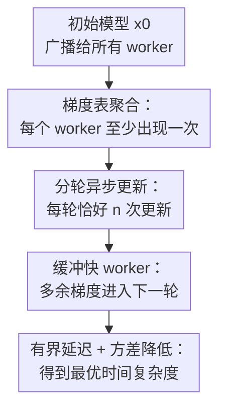

# Ringleader ASGD: The First Asynchronous SGD with Optimal Time Complexity under Data Heterogeneity

**会议**: ICLR2026  
**OpenReview**: [https://openreview.net/forum?id=5wqTal0EuC](https://openreview.net/forum?id=5wqTal0EuC)  
**代码**: 待确认  
**领域**: 异步 SGD 优化理论 / 数据异质联邦优化  
**关键词**: 异步优化、随机梯度下降、数据异质性、时间复杂度、延迟控制  

## 一句话总结
Ringleader ASGD 用“梯度表 + 分轮缓冲 + 每轮每个 worker 恰好更新一次”的异步机制，在非凸随机优化和任意数据异质场景下避免快设备主导训练，并在固定计算时间模型中达到并行一阶随机方法的最优时间复杂度。

## 研究背景与动机
**领域现状**：分布式训练和联邦学习通常要在大量 worker 上并行计算随机梯度。经典同步 SGD 每轮等所有 worker 返回一个梯度再更新，理论上干净，但在硬件速度、网络状态和设备可用性差异很大的系统里会被最慢 worker 卡住。异步 SGD 的直觉正好相反：谁先算完谁先提交，服务器不用等待，从而让快设备持续工作。

**现有痛点**：这个直觉在数据同分布时已经不容易证明最优，在数据异质时更麻烦。若每个 worker 的本地目标 $f_i$ 来自不同分布，朴素异步更新会让快 worker 贡献更多梯度，模型被频繁拉向快 worker 的局部数据分布；慢 worker 的梯度不仅更少，而且常常更 stale。于是算法看似没有等待，实际上用“偏向快设备的数据分布”换来了进度。

**核心矛盾**：数据异质场景需要每次更新都保留所有 worker 的信息，否则全局目标 $f(x)=\frac{1}{n}\sum_{i=1}^n f_i(x)$ 会被局部目标污染；异步系统又希望快 worker 不空转、不丢弃计算。已有方法往往只能满足一部分：Naive Minibatch SGD 保证无偏但同步等待最慢设备；IA2SGD 用梯度表包含所有 worker，但没有有效控制慢 worker 的延迟；Malenia SGD 达到最优时间复杂度，却是同步算法，并且会在同步边界丢弃进行中的计算。

**本文目标**：作者要解决的是一个很具体的理论缺口：在平滑非凸随机优化、worker 数据分布任意异质、worker 计算时间异质的条件下，是否存在一个真正异步、无需数据相似性假设、无需让 worker 闲置、也不丢弃梯度计算的 SGD 方法，并且时间复杂度能匹配 Tyurin 与 Richtárik 给出的并行一阶随机方法下界。

**切入角度**：论文的观察是，异步方法的失败不只是“有延迟”，而是“快 worker 的延迟小、出现频率高，慢 worker 的表项长期落后”。因此不能简单地像 Ringmaster ASGD 那样丢弃过旧梯度，因为在异质数据下慢 worker 一旦被丢弃，其本地分布信息就从全局更新里消失。更合适的做法是让快 worker 的多余梯度先进入缓冲区，等待算法结构允许时再使用。

**核心 idea**：Ringleader ASGD 把 IA2SGD 的梯度表、Ringmaster ASGD 的延迟控制和 Malenia SGD 的分轮收集思想合在一起：每轮先确保所有 worker 至少出现一次，再异步地按 worker 完成顺序做 $n$ 次更新，多出来的快 worker 梯度不立即更新也不丢弃，而是缓冲到下一轮。

## 方法详解
Ringleader ASGD 面向如下分布式随机优化问题：

$$
\min_{x\in\mathbb{R}^d} f(x)=\frac{1}{n}\sum_{i=1}^n f_i(x),\quad f_i(x)=\mathbb{E}_{\xi_i\sim D_i}[f_i(x;\xi_i)].
$$

每个 worker $i$ 有自己的数据分布 $D_i$，并且计算一个随机梯度需要 $\tau_i$ 秒。固定计算时间模型中假设 $0<\tau_1\le\tau_2\le\cdots\le\tau_n$，其中 $\tau_n$ 是最慢 worker 的时间，$\tau_{avg}=\frac{1}{n}\sum_i\tau_i$ 是平均计算时间。论文关心的不是“迭代几步”，而是“墙钟时间多久能找到 $\mathbb{E}\|\nabla f(x)\|^2\le\varepsilon$ 的点”。

### 整体框架
Ringleader ASGD 的服务器维护每个 worker 的梯度累积表 $(G_i,b_i)$：$G_i$ 是当前表中 worker $i$ 的梯度和，$b_i$ 是这些梯度的数量。一次更新用的是所有 worker 表项的平均：

$$
\bar g^k=\frac{1}{n}\sum_{i=1}^n \bar g_i^k,
\quad
\bar g_i^k=\frac{1}{b_i^k}\sum_{j=1}^{b_i^k} g_{i}^{k,j},
\quad
x^{k+1}=x^k-\gamma \bar g^k.
$$

算法按 round 运行，每个 round 恰好做 $n$ 次模型更新。第一阶段只收集梯度，直到每个 worker 至少有一个梯度进入主表；第二阶段按 worker 新梯度到达的顺序依次更新模型，并保证每个 worker 在这一轮最多收到一次新模型。若已经在本轮更新过的快 worker 又发来梯度，该梯度被放入临时表 $(G_i^+,b_i^+)$，等下一轮开始时转入主表。

### 关键设计
**1. 梯度表聚合：让每一步都看见所有本地分布**

朴素异步 SGD 在收到某个 worker 的梯度后立即更新，形式上类似 $x^{k+1}=x^k-\gamma\nabla f_{i_k}(x^{k-\delta_k};\xi)$。如果快 worker 更频繁到达，$i_k$ 的分布就不是均匀的，更新方向会偏向快 worker 的 $f_i$。Ringleader ASGD 的第一层修正是采用梯度表：每次更新都用 $\frac{1}{n}\sum_i G_i/b_i$，也就是每个 worker 先在本地平均，再在 worker 维度均匀平均。

这个设计直接对应数据异质场景的关键要求：不假设 $f_i$ 彼此相似，也不要求 worker 的数据分布接近全局分布。只要每个表项都包含 worker $i$ 的最新一批梯度，更新估计量在结构上就始终覆盖所有本地目标。与 IA2SGD 相比，Ringleader ASGD 继承了“表中每个 worker 都有位置”的优点，但不会让表项随着快慢差异无限变旧。

**2. 分轮异步更新：用 round 结构把延迟压到 $2n-2$**

单纯维护梯度表还不够，因为慢 worker 的表项可能长期不更新，服务器却不断用快 worker 的新表项推进模型。Ringleader ASGD 因此把时间切成 round：Phase 1 等到每个 worker 至少提交一个梯度；Phase 2 做恰好 $n$ 次更新，并且每个 worker 在本轮只获得一次新模型。这样一个 worker 从某个旧模型开始计算，到它的梯度被用于表中更新，期间最多跨过有限数量的服务器更新。

论文证明了一个清楚的延迟界：任意 worker、任意迭代的延迟都满足 $\delta_i^k\le 2n-2$。这个界不依赖 worker 速度比例，也不依赖数据分布相似性。它的意义在于把异步算法最难处理的 stale gradient 变成一个可控残差项，使得收敛证明可以在平滑性假设下闭合。

**3. 缓冲快 worker：不让异步优势变成丢弃计算**

Ringmaster ASGD 在同分布场景中可以通过丢弃过旧梯度来控制延迟，但这在数据异质场景下很危险：慢 worker 的梯度若被丢弃，它代表的本地分布信息就会从更新中消失。Ringleader ASGD 的选择是“缓冲而不是丢弃”。在 Phase 2 中，如果已经更新过的快 worker 又发来新梯度，服务器不立刻用它触发更新，而是把它累积到临时表 $(G_i^+,b_i^+)$。

这样做同时解决两个问题。第一，worker 不需要停下来等待，因此“无 idle worker”的异步属性保留了；第二，额外计算没有浪费，而是在下一轮成为有效梯度。更重要的是，快 worker 多算出的梯度会形成更大的本地小批量，降低随机噪声，而不会改变 worker 维度上的均匀权重。

**4. 新平滑性假设：在异质表项上控制全局梯度偏差**

为了分析“每个 worker 的梯度可能在不同旧点 $y_i$ 上计算”的估计器，论文引入了一个介于全局平滑和逐个本地函数平滑之间的假设：存在 $L>0$，使得

$$
\left\|\nabla f(x)-\frac{1}{n}\sum_{i=1}^n \nabla f_i(y_i)\right\|^2
\le
\frac{L^2}{n}\sum_{i=1}^n \|x-y_i\|^2.
$$

这个条件比只要求 $f$ 是 $L_f$-smooth 更强，但比要求每个 $f_i$ 都用同一个最坏常数 $L_{max}$ 控制更弱。论文给出关系 $L_f\le L\le \sqrt{\frac{1}{n}\sum_i L_{f_i}^2}\le L_{max}$，并说明当所有 $f_i$ 相同的时候 $L=L_f$。因此最终复杂度中的 $L$ 不是随意引入的常数，而是专门为异质梯度表分析服务的平滑度量。

### 一个完整示例
假设有 4 个 worker，计算速度从快到慢分别是 $\tau_1<\tau_2<\tau_3<\tau_4$。所有 worker 从 $x^0$ 开始计算。Phase 1 中，worker 1 可能已经返回多个梯度，worker 2 和 3 也各返回若干个，但服务器不会更新，直到 worker 4 的第一个梯度到达。此时主表可能是 $b=(4,2,1,1)$，更新方向为四个 worker 本地平均梯度的均匀平均，而不是 8 个梯度的简单平均。

进入 Phase 2 后，假设 worker 4 刚完成 Phase 1，服务器先用当前主表做一次更新，把 $x^1$ 发给 worker 4。随后 worker 1 很快又发来梯度，但 worker 1 已经不在“本轮待更新集合”里，这个梯度就进入临时表而不是立刻更新。等 worker 2、3、1 分别完成当前计算时，服务器依次把它们的新梯度加入主表、做更新、发回新模型。四个 worker 都收到一次新模型后，本轮结束，临时表转为下一轮主表。

这个例子里，快 worker 1 没有空等，也没有被强行停止；慢 worker 4 仍然每轮至少进入一次更新；服务器每次更新仍然按 worker 均匀聚合。算法牺牲的是“每个快梯度立刻触发更新”的贪心性，换来的是数据异质下的无偏结构和可证明延迟界。

### 损失函数 / 训练策略
论文的训练目标是标准非凸随机优化中的 $\varepsilon$-stationarity：找到随机迭代点使得 $\mathbb{E}\|\nabla f(x)\|^2\le\varepsilon$。在有界方差假设下，每个 worker 的随机梯度满足

$$
\mathbb{E}_{\xi_i}[\nabla f_i(x;\xi_i)]=\nabla f_i(x),
\quad
\mathbb{E}_{\xi_i}\|\nabla f_i(x;\xi_i)-\nabla f_i(x)\|^2\le\sigma^2.
$$

理论步长设为

$$
\gamma=\min\left\{\frac{1}{8nL},\frac{\varepsilon B}{10L\sigma^2}\right\},
\quad
B=\inf_k\left(\frac{1}{n}\sum_{i=1}^n \frac{1}{b_i^k}\right)^{-1}.
$$

这里 $B$ 是每轮各 worker 本地批量大小的调和平均下界。它进入复杂度的原因很直观：快 worker 在等待慢 worker 的过程中会积累更多梯度，虽然 worker 级别权重仍然均匀，但本地平均的方差会下降。论文证明在固定计算时间模型中，每 $n$ 次更新耗时不超过 $2\tau_n$，并且 $B\ge \tau_n/(2\tau_{avg})$。结合迭代复杂度后，得到时间复杂度

$$
O\left(\frac{L\Delta}{\varepsilon}\left(\tau_n+\tau_{avg}\frac{\sigma^2}{n\varepsilon}\right)\right),
$$

当 $L=O(L_f)$ 时匹配已有并行随机一阶方法下界。论文还在附录中把算法扩展到任意变化的计算时间模型：Phase 1 不再只等每个 worker 一个梯度，而是等到调和平均批量满足 $B_k\ge\max\{1,\sigma^2/(n\varepsilon)\}$，从而匹配 Tyurin 的 universal computation model 下界。

## 实验关键数据

### 主实验
论文的实验是 toy simulation，目的不是刷大规模模型指标，而是验证理论趋势。设置为 MNIST 和 Fashion-MNIST 图像分类，100 个 client，使用 Dirichlet concentration $\alpha=0.1$ 构造强 non-IID 数据；模型是两层 MLP `Linear(d,128) -> ReLU -> Linear(128,10)`，client minibatch size 为 4，报告完整数据上的梯度范数平方 $\|\nabla f(x_k)\|^2$ 随墙钟时间变化。每种方法在固定时间预算内扫步长，运行 30 个随机种子，报告 median 和 IQR。

| 对比维度 | Ringleader ASGD | Malenia SGD | IA2SGD |
|--------|------------------|-------------|--------|
| 执行方式 | 异步，每轮 $n$ 次 sequential update | 同步，Phase 2 单次广播更新 | 异步，到达即更新表 |
| 数据异质下是否需要 similarity 假设 | 不需要 | 不需要 | 不需要 |
| 是否达到理论最优时间复杂度 | 是，当 $L=O(L_f)$ | 是 | 否 |
| worker 是否持续工作 | 是 | 是，但同步阶段会丢弃进行中计算 | 是 |
| 实验曲线结论 | 在 MNIST / Fashion-MNIST 上下降最快 | 理论同阶但实践更慢 | 明显受 stale table 影响 |

### 消融实验
论文没有给出传统意义上“去掉模块 A”的消融表，而是通过与相邻算法的机制对照来支撑设计必要性：IA2SGD 可以看作去掉 Ringleader 的分轮延迟控制；Malenia SGD 可以看作保留 Phase 1 但把 Phase 2 改成同步单次更新并丢弃进行中计算；Naive Minibatch SGD 则保留无偏 minibatch 但让快 worker 等待最慢 worker。

| 配置 / 方法 | 关键复杂度或现象 | 说明 |
|------|------------------|------|
| Naive Minibatch SGD | $O\left(\frac{L_f\Delta}{\varepsilon}(\tau_n+\tau_n\frac{\sigma^2}{n\varepsilon})\right)$ | 方差项也乘 $\tau_n$，快 worker 的额外计算没有转化为时间收益 |
| IA2SGD | 与 Naive Minibatch SGD 同阶 | 有梯度表但缺少延迟控制，异步执行没有带来最优时间复杂度 |
| Malenia SGD | $O\left(\frac{L_f\Delta}{\varepsilon}(\tau_n+\tau_{avg}\frac{\sigma^2}{n\varepsilon})\right)$ | 理论最优但同步，Phase 2 只有一次全局更新且会丢弃未完成工作 |
| Ringleader ASGD | $O\left(\frac{L\Delta}{\varepsilon}(\tau_n+\tau_{avg}\frac{\sigma^2}{n\varepsilon})\right)$ | 异步、无 idle、无 discarded work；与下界只差平滑常数 $L$ vs $L_f$ |

### 关键发现
- Ringleader 的收益主要体现在高噪声项：同步 minibatch 的随机噪声项受最慢 worker 时间 $\tau_n$ 控制，而 Ringleader 把这一项替换成平均计算时间 $\tau_{avg}$。
- 理论上 Ringleader ASGD 和 Malenia SGD 同阶，但实验中 Ringleader 更快，因为 Phase 2 中它做 $n$ 次模型更新，而 Malenia 只做一次同步更新。
- IA2SGD 说明“异步 + 梯度表”本身不够；若不限制表项延迟，慢 worker 的旧梯度仍会拖累收敛。
- 当随机噪声很低时，异步结构的优势会变弱，因为较少梯度评估已经足以推进优化，Naive Minibatch SGD 的等待成本相对不再那么主导。

## 亮点与洞察
- 把“异步最优”问题放在时间复杂度而不是迭代复杂度上讨论很关键。并行训练里更多迭代不一定更慢，真正要比较的是 worker 计算时间如何被算法利用。
- 论文最巧的地方是没有把快 worker 当成需要压制的噪声源，而是把它们的额外梯度转化为本地小批量方差降低。这样既保留异步系统的资源利用率，也避免快 worker 在数据异质下获得更大目标权重。
- 梯度表的 worker 级均匀平均是处理 arbitrary heterogeneity 的核心。它提醒我们，在联邦优化里“样本级多算多得”并不总是合理，尤其当 client 数据分布不代表全局分布时。
- 新的 Assumption 2 是一处值得复用的理论工具。它直接刻画“全局点 $x$ 的梯度”和“不同 worker 在不同旧点 $y_i$ 上的局部梯度平均”之间的偏差，比硬套 $L_{max}$ 更细，也比只说 $f$ smooth 更能服务异步分析。
- Ringleader 和 Malenia 的关系也很有启发：同步最优算法不一定是异步最优算法的反面，很多时候同步算法的收集规则可以保留，真正需要改的是更新和缓冲方式。

## 局限与展望
- 理论仍建立在通信瞬时完成的 computation-only model 上。作者解释这是该系列下界和上界共享的标准模型，但真实系统中的通信压缩、带宽争用、server-to-worker 广播延迟仍需要额外机制处理。
- 最优性表述依赖 $L=O(L_f)$。虽然论文证明 $L_f\le L\le L_{max}$，但在某些高度异质的目标族里，$L$ 可能明显大于全局平滑常数，此时与下界之间仍有常数外的间隙。
- 实验规模偏 toy，只在 MNIST / Fashion-MNIST 的两层 MLP 上验证趋势。对于大模型训练、真实联邦设备掉线、非平稳 client 参与等场景，仍需要系统实验来判断缓冲表的内存、调度和通信开销。
- 步长设定为了匹配理论速率仍需要 $\varepsilon$、$B$、$\sigma^2$ 等量进入表达式。论文说算法结构本身比 Malenia 更 parameter-free，但实际调参仍是部署中的关键问题。
- 后续可以把 Ringleader 的延迟控制与通信压缩、局部多步更新、client sampling 或隐私约束结合起来，形成更接近联邦学习实际系统的版本。

## 相关工作与启发
- **vs Naive Minibatch SGD**: Naive Minibatch SGD 每轮等待所有 worker，梯度估计无偏但时间被 $\tau_n$ 统治；Ringleader 保留每个 worker 均匀贡献，同时让快 worker 的额外计算降低噪声项。
- **vs IA2SGD**: IA2SGD 也维护最新梯度表，因此不需要数据相似性假设；Ringleader 的区别在于用 round 和缓冲机制控制表项延迟，使慢 worker 不会长期停留在过旧模型上。
- **vs Malenia SGD**: Malenia 是异质数据下已有的同步最优方法；Ringleader 继承它“先收集足够梯度”的思想，但 Phase 2 改为异步顺序更新，避免丢弃进行中计算，并在实验中获得更多实际更新机会。
- **vs Ringmaster ASGD**: Ringmaster 解决的是同分布数据下的异步最优问题，可以通过丢弃 stale 梯度控制延迟；Ringleader 面向数据异质，不能随便丢弃慢 worker 的信息，因此用缓冲替代丢弃。
- **对优化理论的启发**: 这篇论文把“无同步、无空转、无丢弃、无相似性假设、最优时间复杂度”几个目标同时放进一个算法结构里，说明异步优化的理论瓶颈并不必然来自异步本身，而更多来自更新频率与数据权重之间的失衡。

## 评分
- 新颖性: ⭐⭐⭐⭐⭐ 首次在数据异质场景下给出达到最优时间复杂度的异步 SGD，并且不依赖 similarity 假设。
- 实验充分度: ⭐⭐⭐ 理论论文的实验足以验证趋势，但任务和模型规模较小，系统层面证据仍有限。
- 写作质量: ⭐⭐⭐⭐⭐ 论文的问题定位、算法与 IA2SGD / Malenia / Ringmaster 的关系讲得非常清楚，复杂度表也直接点出贡献边界。
- 价值: ⭐⭐⭐⭐⭐ 对异步联邦优化和分布式训练理论都很有价值，尤其澄清了数据异质下“快 worker 多贡献”为什么不能简单等同于加速。

<!-- RELATED:START -->

## 相关论文

- [\[ICLR 2026\] Unified Analyses for Hierarchical Federated Learning: Topology Selection under Data Heterogeneity](unified_analyses_for_hierarchical_federated_learning_topology_selection_under_da.md)
- [\[ICLR 2026\] Birch SGD: A Tree Graph Framework for Local and Asynchronous SGD Methods](birch_sgd_a_tree_graph_framework_for_local_and_asynchronous_sgd_methods.md)
- [\[ICLR 2026\] Decentralized Nonconvex Optimization under Heavy-Tailed Noise: Normalization and Optimal Convergence](decentralized_nonconvex_optimization_under_heavy-tailed_noise_normalization_and_.md)
- [\[AAAI 2026\] Data Heterogeneity and Forgotten Labels in Split Federated Learning](../../AAAI2026/optimization/data_heterogeneity_and_forgotten_labels_in_split_federated_learning.md)
- [\[AAAI 2026\] Tackling Resource-Constrained and Data-Heterogeneity in Federated Learning with Double-Weight Sparse Pack](../../AAAI2026/optimization/tackling_resource-constrained_and_data-heterogeneity_in_federated_learning_with_.md)

<!-- RELATED:END -->
