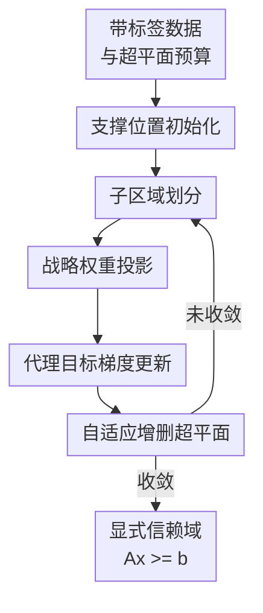

# Scalable and Adaptive Trust-Region Learning via Projection Convex Hull

**会议**: ICLR2026  
**OpenReview**: [https://openreview.net/forum?id=Kjcs0xJxdg](https://openreview.net/forum?id=Kjcs0xJxdg)  
**代码**: 有（论文称已开源）  
**领域**: 优化 / 可信区域学习  
**关键词**: 凸包学习、信赖域、混合整数优化、超平面预算、约束学习

## 一句话总结
这篇论文提出 Projection Convex Hull（PCH），把难解的凸包信赖域学习 MINLP 转成带权重投影的可微代理优化，迭代学习少量支撑超平面，从而在高维数据中得到既紧、又可解释、还能直接嵌入下游优化模型的多面体信赖域。

## 研究背景与动机
**领域现状**：凸包是描述数据支持域的一种经典几何对象，在分类、约束学习和决策优化里都很自然：如果正样本代表“可靠 / 可行 / 训练分布内”的区域，那么一个包含所有正样本的凸区域就可以作为信赖域，告诉模型哪些输入仍处在数据支持范围内。传统 QuickHull 这类计算几何算法能在低维空间精确构造凸包，但输出通常是顶点或面片驱动的几何结构，不太像机器学习里可控、可训练、可压缩的模型。

**现有痛点**：第一个痛点是维度灾难。精确凸包在维度升高时面片数量可能指数增长，PH 15 8 这种只有 8 维的例子里 QuickHull 的复杂度已经膨胀到 $2.30\times10^7$ 个超平面量级，直接无法作为实际信赖域。第二个痛点是结构不可控。很多方法要么只能给出隐式区域，要么不能明确限制超平面数量；而在约束学习里，最终最好是显式的 $Ax\ge b$，这样才能嵌入 MILP / MIP 或其他决策模型。第三个痛点是边界不够紧。只要求排除负样本会留下很多等价解，同样的二值分类目标可以对应很松的多面体，也可以对应贴近正样本凸包的多面体，但信赖域真正需要的是后者。

**核心矛盾**：精确求“用最多 $S$ 个超平面包住所有正样本、尽量排除负样本、还要边界贴紧”的问题可以写成混合整数非线性规划（MINLP），但二进制分配变量和超平面归一化会让它在高维大样本上不可承受。反过来，如果直接用神经网络或普通分类损失近似，又容易丢掉“所有正样本必须在区域内”和“输出显式线性约束”这两个信赖域最关键的性质。

**本文目标**：作者要解决的是一个带预算的多面体信赖域学习问题：给定带标签数据 $D=\{(x_i,y_i)\}$，学习一个由 $S$ 个半空间交成的凸区域 $C=\{x\in\mathbb{R}^d\mid a_s^\top x\ge b_s, s=1,\dots,S\}$，使所有正样本都在 $C$ 里，同时尽量把负样本排除到区域外，并且让区域边界尽可能贴近正样本支持集。

**切入角度**：论文的关键观察是，复杂边界虽然全局可能非线性，但在局部常常可以由一个支撑超平面近似。与其一次性求全局 MINLP，不如把“哪个负样本由哪个超平面排除”变成局部子区域分配，再让每个超平面只处理自己附近最有信息量的正负样本。这样就把全局组合搜索转成了多个局部、可微、可迭代的超平面更新。

**核心 idea**：用“子区域划分 + 战略权重投影 + 梯度更新 + 自适应增删超平面”近似原本的 MINLP 最优支撑面，让少量可解释超平面组成紧凑信赖域。

## 方法详解
PCH 的方法可以理解为一个带几何约束的交替优化过程。它不是先学习一个分类器再事后抽规则，而是直接学习多面体本身：每个超平面都被放在正样本凸包的支撑位置，局部样本通过带宽筛选分配给不同超平面，样本权重经过投影保持理论上需要的矩条件，然后超平面法向量用代理目标做梯度更新。最后，所有活跃超平面的交集就是信赖域。

### 整体框架
输入是二分类数据集和一个超平面预算 $S$，输出是显式多面体 $C=\{x\mid Ax\ge b\}$。算法先用改进 PinCHD 初始化若干支撑超平面；每一轮都把超平面偏置设成 $b^\star(a_s)=\min_{x\in D^+}a_s^\top x$，保证该超平面贴住正样本侧；然后围绕每个超平面构造局部子区域，在这个子区域里更新权重和法向量；如果某些超平面已经不再贡献边界就剪掉，如果还有负样本残留在当前 hull 里且预算允许，就添加新的超平面继续细化。

### 关键设计
**1. 从 MINLP 到可微代理：把全局组合问题拆成局部支撑面学习**

论文先从一个更理想但难解的 MINLP 出发。目标是在所有正样本满足 $a_s^\top x_i-b_s\ge0$ 的前提下，让每个被某个超平面分离的负样本满足 $a_s^\top x_i-b_s\le-\xi_s$，并通过二进制变量 $z_i^s$ 表示“负样本 $i$ 是否由超平面 $s$ 排除”。这个形式很好地表达了信赖域学习的目标，却把样本分配、超平面选择、边界紧致性都混在一起，直接求解会被二进制变量拖垮。

PCH 的理论处理是先证明：如果全局 MINLP 的最优解是 $(A^\star,b^\star)$，那么其中每一个超平面 $(a_s^\star,b_s^\star)$ 都可以看成一个局部子问题的最优支撑面。这个局部子问题只需要处理所有正样本 $D^+$ 和分配给该超平面的负样本 $D_-^s$：它最大化分离间隔 $\xi_s$，同时保证正样本全被包住。这样，原问题的关键难点就从“同时决定所有二进制分配和所有面”变成“怎样构造一个局部工作集，并让可微目标在这个工作集上逼近支撑面最优条件”。

作者给出的代理目标是一个软划分损失。对局部数据 $D_s$ 中的样本，定义左右软分裂概率

$$
p_i^L=\frac{1}{1+e^{\beta(a^\top x_i-b)/\|a\|}},\quad
p_i^R=\frac{1}{1+e^{\beta(b-a^\top x_i)/\|a\|}}.
$$

代理目标用加权标签均值的平方来衡量两侧分裂质量：

$$
f(a,b)=-\frac{1}{2}\frac{(\sum_i\omega_i p_i^L y_i)^2}{\sum_i\omega_i p_i^L}
-\frac{1}{2}\frac{(\sum_i\omega_i p_i^R y_i)^2}{\sum_i\omega_i p_i^R}.
$$

直观上，这个目标鼓励超平面把局部正负样本分到不同侧；更重要的是，论文证明在合适权重 $\omega_i$ 下，MINLP 的最优支撑面会成为该代理目标的驻点。这个结论不是说代理目标全局凸或一定能找回全局最优，而是说明它抓住了原 MINLP 最优解必须满足的一组局部结构条件，因此用它做梯度更新不是纯启发式。

**2. 子区域划分：只让每个超平面看见真正相关的边界样本**

如果每个超平面都看全量数据，PCH 仍然会退化成昂贵的全局优化，而且不同超平面之间会互相抢同一批样本。论文用子区域 $D_s$ 来实现 divide-and-conquer：给定当前法向量 $a_s$，先把偏置固定在正样本支撑位置 $b^\star(a_s)=\min_{x\in D^+}a_s^\top x$，然后只选取落在该超平面附近带状区域里的样本，并要求这些样本相对其他超平面仍处在当前 hull 内。

形式上，局部工作集为

$$
D_s=\{x\in D\mid -m_s\le a_s^\top x-b^\star(a_s)\le m_s,\ A_{-s}^\top x\ge b_{-s}\}.
$$

这里 $A_{-s},b_{-s}$ 表示除第 $s$ 个超平面外的其他约束。这个条件有两个效果：一是只关注当前面附近、最可能影响边界紧致性的样本；二是避免一个已经被其他面排除的远处负样本继续干扰当前面的学习。带宽 $m_s$ 由正样本的 order statistic 自适应确定，至少纳入 $d$ 个最容易出错或最靠近边界的正样本，从而避免局部样本太少导致权重约束不可行。

这个设计的价值在于，它把“凸包整体边界”转成了若干个局部支撑面的学习问题。每个超平面处理的是自己附近的支撑样本和残留负样本，所以计算复杂度随 $n,S,d$ 近似线性扩展，而不是像精确凸包或 MIP 那样随维度和二进制变量快速爆炸。

**3. 战略权重投影：用权重把代理目标拉回支撑面几何**

代理目标能否真的像 MINLP 的局部支撑面问题，关键取决于样本权重。论文给出一组矩条件，例如 $\sum_i\omega_i=2$、$\sum_i\omega_i y_i=0$、$\sum_i\omega_i p_i^R=1$、$\sum_i\omega_i p_i^L p_i^R y_i=0$，用于保证代理目标在偏置方向上的驻点性质；同时，法向量方向还需要满足类似固定点的关系：

$$
a=\sum_i\omega_i p_i^Lp_i^Ry_i x_i.
$$

直接求这样的权重不现实，所以 PCH 把权重更新设计成一个投影优化问题：先沿着分离间隔 $\xi(\omega)$ 的梯度走一步，再把权重投影回可行集合。分离间隔定义为当前法向量上最靠内的正样本与最靠外的局部负样本之间的归一化差距：

$$
\xi(\omega)=\frac{\min_{x_i\in D^+}a(\omega)^\top x_i-\max_{x_i\in D_s^-}a(\omega)^\top x_i}{\|a(\omega)\|}.
$$

投影集合不仅包含线性矩条件 $C\omega=d$ 和非负性 $\omega\ge0$，还包含正负样本各自的 isotonic cone：越靠近边界的样本应得到越大的权重。这一点非常像支持向量思想，但它不是简单地挑最近点，而是通过 PAVA 等投影操作维持一个有序、非负、满足矩条件的权重分布。这样权重既服务理论驻点条件，又符合“边界附近样本更重要”的几何直觉。

**4. 自适应结构调整：在紧致性和超平面预算之间动态取舍**

PCH 不把超平面数量固定死，而是在预算 $S$ 内动态调整活跃结构。剪枝规则很直接：如果某个超平面对应的子区域里所有样本都已经在非负侧，它不再负责排除有用负样本，就可以删掉，避免冗余面让 hull 变得复杂。添加规则则针对当前 hull 仍然包住的负样本：如果还有负样本没有被排除且预算未满，就用改进 PinCHD 选一个可靠负样本作为锚点，初始化新的支撑超平面。

改进 PinCHD 的细节很关键。原始 PinCHD 对负样本选择敏感，如果选到位于 $\mathrm{conv}(D^+)$ 内部或很不可靠的负样本，投影过程会退化。本文要求新增超平面的负锚点同时满足两个条件：它仍在当前多面体 $C$ 内，说明确实是当前 hull 的漏洞；它属于至少一个局部子区域，说明它靠近已有边界而不是孤立噪声点。随后算法把这个负锚点向正样本凸包投影，得到支撑方向 $a$，再设 $b=\min_{x\in D^+}a^\top x$。这让新面一开始就具备几何意义，而不是随机加入一个不稳定约束。

### 一个完整示例
可以把 PCH 想成在二维里逐步“削掉”负样本。假设正样本形成一个近似三角形区域，初始只有几个粗糙的支撑线。第一轮中，每条线先移动到刚好碰到正样本的位置；然后算法为每条线选一条带状邻域，例如上边界线只看靠近上侧的正样本和仍被 hull 包住的上方负样本。权重投影会让最靠近这条线的正负样本权重变大，梯度更新就把法向量转向更能排除这些负样本的位置。

如果更新后某条线附近已经没有需要排除的负样本，它会被剪掉；如果右上角仍有一簇负样本被当前三角形包住，算法会从这簇负样本中挑一个仍在 hull 内、也属于局部子区域的点，用改进 PinCHD 初始化一条新的支撑线。几轮之后，原来粗糙的大三角形被逐步调整成更贴近正样本凸包的多边形。这个过程对应论文图 2 的可视化：PCH 不是一次性算出所有面，而是在局部边界上反复分配样本、更新权重、旋转超平面、增删结构。

### 损失函数 / 训练策略
训练时每轮主要做四件事。第一，重新计算所有偏置 $b_s=b^\star(a_s)$，让每个超平面保持支撑正样本的状态。第二，按 Equation 7 更新每个子区域 $D_s$。第三，针对每个子区域更新权重：沿 $\partial \xi(\omega)/\partial \omega$ 做一步梯度上升，再通过 $P_F(\omega)=P_S(P_{K_{\pi+}}(P_{K_{\pi-}}(P_+(\omega))))$ 投影回非负、单调和线性约束的交集。第四，对代理目标 $f(a,b)$ 做一步梯度下降更新法向量，并执行剪枝 / 添加超平面。

论文明确承认这是一个近似实现：完整理论上可能需要让 $f(a,b)$ 收敛、Dykstra 投影也充分收敛，但这样太慢。实际算法只做一步权重梯度、一步代理目标梯度和一轮投影。经验结果显示，这个近似足够稳定，并把总体复杂度控制在 $O(InSd)$，其中 $I$ 是迭代轮数、$n$ 是样本数、$S$ 是超平面预算、$d$ 是维度。

## 实验关键数据

### 主实验
论文在合成几何数据和真实表格数据上比较 PCH、QuickHull（QH）、CGHC、DCH、PinCHD 和 DeepHull。指标是 trust-region accuracy 与模型复杂度，前者同时考虑分类准确率和正样本覆盖率，后者主要看超平面数量。

| 数据集 / 维度 | 指标 | QH | CGHC | DeepHull | PCH | 主要结论 |
|--------|------|------|------|------|------|------|
| PH 15 2 / 低维 | 信赖域准确率 | 100.00 | 99.71 | 97.01 | 100.00 | PCH 达到精确凸包级准确率 |
| PH 15 8 / 低维但更高面数 | 模型复杂度 | 2.30E+7 | 15 | 15 | 15 | QH 面数爆炸，PCH 保持预算内结构 |
| PH 15 100 / 高维 | 信赖域准确率 | 不可扩展 | 57.20 | 64.39 | 99.95 | 高维 polyhedral 任务上 PCH 优势最明显 |
| NLC N 100 / 高维非线性凸 | 信赖域准确率 | 不可扩展 | 68.89 | 75.39 | 99.01 | 用有限超平面仍能逼近非线性凸边界 |
| Spambase / 真实数据 | 信赖域准确率 | 不可扩展 | 86.70 | 91.55 | 94.41 | 真实表格数据上 PCH 也更稳 |
| HIV / 真实数据 | 信赖域准确率 | 不可扩展 | 不可扩展 | 99.55 | 99.94 | 大规模真实任务中保持高覆盖与排除能力 |

### 消融实验
论文正文没有把所有消融数字放进主表，而是在附录 G.9 汇报额外的梯度基线和关键组件消融；正文则给出超平面预算、噪声、非线性凸 / 非凸区域等补充分析。可以从这些分析里读出几个核心结论：PCH 的收益不是来自单个普通分类损失，而是来自“支撑偏置 + 子区域 + 权重投影 + 自适应结构”的组合。

| 配置 / 分析项 | 关键指标 | 说明 |
|------|---------|------|
| 完整 PCH | PH 15 100 准确率 99.95，复杂度 15 | 在 100 维 polyhedral 数据上仍用预算内超平面恢复紧致信赖域 |
| CGHC | PH 15 100 准确率 57.20，复杂度 15 | 同样有超平面预算，但 MIP / 结构学习在高维上明显退化 |
| PinCHD | PH 15 100 准确率 57.95，复杂度 1499 | 仅靠投影式基线会产生大量超平面，紧凑性差 |
| DeepHull | NLC N 100 准确率 75.39，复杂度 150 | 隐式深度凸区域不保证显式线性约束和正样本全覆盖 |
| 预算敏感性分析 | 附录 G.4 / Figure 15 | 超平面预算增加时边界更紧，但 PCH 仍能在有限预算下保持高准确率 |
| 噪声鲁棒性分析 | 附录 G.3 | 在注入噪声的 polyhedral 数据上，PCH 的局部更新与剪枝机制有助于避免结构失控 |

### 关键发现
- PCH 最突出的结果是高维可扩展性：PH 15 100 上 QH 和 DCH 无法扩展，CGHC / PinCHD / DeepHull 都只有 57% 到 64% 左右，而 PCH 达到 99.95%。这说明它不仅学到了分类边界，还保持了正样本覆盖与边界紧致。
- 模型紧凑性同样重要。PH 15 8 中 QH 的复杂度达到 $2.30\times10^7$，DCH 也达到 $6.18\times10^6$，PCH 只用 15 个超平面；这正是信赖域要能嵌入下游优化模型的关键。
- 在选择性分类中，PCH 作为过滤器通常能提高 CART / MLP 的表现。例如 Spambase 上 CART 从 91.10 提升到 PCH† 的 93.27，MLP 从 93.16 提升到 PCH† 的 93.59。
- 在约束学习中，PCH 不只是提高可行率，也减少决策模型复杂度。MLP 约束学习里，No rule 的可行率为 88.00、二进制变量数为 205；PCH† 达到 94.00，同时二进制变量数降到 35。

## 亮点与洞察
- **把信赖域学习重新拉回几何本质**：论文没有把 convex hull 当作普通分类器，而是始终围绕“包住所有正样本、排除负样本、边界要紧、约束要显式”来设计目标。这个问题设定对安全约束学习和 prescriptive optimization 比单纯 accuracy 更贴近真实需求。
- **理论与算法之间的桥搭得比较清楚**：从 MINLP 到 hyperplane-wise subproblem，再到带权代理目标和驻点条件，虽然最终算法仍是近似交替更新，但至少解释了为什么这个 surrogate 与原始紧致凸包目标有关，而不是随便写一个 loss。
- **权重投影是很值得借鉴的 trick**：很多方法会说“边界样本更重要”，但 PCH 用线性矩条件、非负性和 isotonic cone 把这个直觉变成了可执行的投影步骤。这种“用投影把学习过程限制在有几何意义的权重空间里”的思路，可以迁移到其他基于局部支撑点的约束学习问题。
- **输出形式对下游优化友好**：PCH 最终给出的就是 $Ax\ge b$，这比隐式神经 hull 更容易解释、检查和嵌入 MIP。论文在 constraint learning 里展示二进制变量数下降，也说明结构可控本身就是一种性能。

## 局限与展望
- PCH 仍然学习的是单个凸多面体。面对明显非凸、由多个分离可行岛组成的真实信赖域时，一个凸 hull 可能会把中间不可行区域也包进去。论文在 NLNC 数据上能做近似，但未来更自然的方向是多凸集分解或 mixture of convex trust regions。
- 理论结果主要说明存在合适权重时 MINLP 最优超平面是代理目标驻点，但实际算法只做一步梯度和一轮投影，并不保证找到这些权重或全局最优。也就是说，理论支撑的是结构合理性，不是完整收敛保证。
- 子区域带宽、超平面预算、学习率、投影近似步数都会影响效果。论文给了实验设置和附录分析，但在真实高噪声数据中，如何自动选择这些超参仍然是工程挑战。
- 所有正样本必须被 hull 包住是一把双刃剑。如果正样本标签里有异常点，信赖域会被迫扩张；未来可以考虑带置信度的软覆盖、鲁棒凸包或主动清洗机制。
- 下游实验集中在表格数据和约束学习场景，尚未展示在更复杂的高维表示空间中，例如视觉 embedding、LLM safety feature space 或离线 RL 状态空间里的表现。

## 相关工作与启发
- **vs QuickHull / 经典凸包算法**: QuickHull 追求精确几何凸包，低维可靠但高维面数爆炸；PCH 牺牲精确性，换取有限超平面预算、标签监督和可训练性，更适合机器学习信赖域。
- **vs CGHC / MIP-based convex hull approximation**: CGHC 能显式控制超平面数量，但依赖整数变量，规模和维度上不稳定；PCH 通过代理目标和梯度更新绕开二进制枚举，在高维实验中明显更可扩展。
- **vs PinCHD / projection-based methods**: PinCHD 给了投影式构造支撑面的灵感，但单独使用会产生大量超平面且对负样本选择敏感；PCH 把它改造成初始化和新增面机制，并用后续权重投影与剪枝稳定结构。
- **vs DeepHull / neural convex approximation**: DeepHull 这类方法可以在高维近似凸区域，但输出不是清晰的 $Ax\ge b$，也不天然保证正样本全覆盖；PCH 的优势是显式、可嵌入、可解释，劣势是表达能力仍受凸多面体假设限制。
- **对后续研究的启发**: 很多可信 ML 问题都需要一个“数据支持域”而不是一个普通分类器。PCH 提醒我们，支持域学习可以把几何约束、优化可解性和学习目标放在同一个框架里处理，而不是训练完模型后再用启发式规则补安全边界。

## 评分
- 新颖性: ⭐⭐⭐⭐☆ 从 MINLP 驻点条件推导到可微代理和权重投影，组合上有鲜明的几何优化特色。
- 实验充分度: ⭐⭐⭐⭐☆ 合成几何、真实表格、选择性分类和约束学习覆盖较全面，但正文消融数字略分散，部分关键组件依赖附录。
- 写作质量: ⭐⭐⭐⭐☆ 问题动机、理论链条和算法流程清楚，公式较多但主线可读；附录承担了不少实现细节。
- 价值: ⭐⭐⭐⭐⭐ 显式 $Ax\ge b$ 信赖域对约束学习、安全过滤和决策优化很实用，高维可扩展结果也足够有说服力。

<!-- RELATED:START -->

## 相关论文

- [\[ICLR 2026\] Nesterov Finds GRAAL: Optimal and Adaptive Gradient Method for Convex Optimization](nesterov_finds_graal_optimal_and_adaptive_gradient_method_for_convex_optimizatio.md)
- [\[ICLR 2026\] Derandomized Online-to-Non-convex Conversion for Stochastic Weakly Convex Optimization](derandomized_online-to-non-convex_conversion_for_stochastic_weakly_convex_optimi.md)
- [\[ICLR 2026\] A Scalable Constant-Factor Approximation Algorithm for $W_p$ Optimal Transport](a_scalable_constant-factor_approximation_algorithm_for_w_p_optimal_transport.md)
- [\[ICLR 2026\] Convex Dominance in Deep Learning I: A Scaling Law of Loss and Learning Rate](convex_dominance_in_deep_learning_i_a_scaling_law_of_loss_and_learning_rate.md)
- [\[ICLR 2026\] Fast Frank–Wolfe Algorithms with Adaptive Bregman Step-Size for Weakly Convex Functions](fast_frankwolfe_algorithms_with_adaptive_bregman_step-size_for_weakly_convex_fun.md)

<!-- RELATED:END -->
