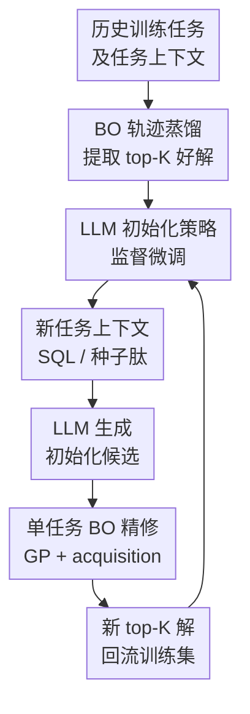

# Scaling Multi-Task Bayesian Optimization with Large Language Models

**会议**: ICLR2026  
**OpenReview**: [https://openreview.net/forum?id=ekmUkRYnkN](https://openreview.net/forum?id=ekmUkRYnkN)  
**代码**: https://github.com/Yimeng-Zeng/BOLT  
**领域**: 优化 / 贝叶斯优化 / LLM for Optimization  
**关键词**: 多任务贝叶斯优化, 大语言模型, 初始化迁移, 黑盒优化, 自增强微调  

## 一句话总结
BOLT 把大量历史贝叶斯优化轨迹蒸馏进 LLM，让 LLM 为新任务生成高质量初始解，再交给标准单任务 BO 继续搜索，从而在数据库查询计划优化和抗菌肽设计中突破传统多任务 BO 随任务数增加而收益饱和的问题。

## 研究背景与动机
**领域现状**：多任务贝叶斯优化的典型目标，是在反复遇到一批相关黑盒优化任务时，把已经优化过的任务经验迁移到新任务上。传统做法通常把迁移能力塞进共享 surrogate：例如在输入和任务联合空间上建多输出 GP，或者用共享神经特征提取器再接 GP / Bayesian linear regression 头，让新任务一开始就继承旧任务的统计结构。

**现有痛点**：这类 shared-surrogate 方法在十几个或几十个任务上常能带来收益，但一旦训练任务扩展到几百乃至上千个，收益很容易变平。原因不只是计算变慢，还包括任务相似性难以由一个统一核函数或共享特征表示完全捕捉；如果 surrogate 同时承担“跨任务记忆”和“当前任务不确定性建模”两件事，模型容量、任务核、专家数量、近似 GP 训练都会成为瓶颈。

**核心矛盾**：多任务 BO 真正需要的是“用历史任务给新任务一个好起点”，而不一定需要在测试时维护一个复杂的跨任务 surrogate。尤其在查询计划和肽序列这类结构化搜索空间中，任务本身有可读上下文：SQL 查询文本、种子肽序列、约束描述等。LLM 擅长从上下文生成结构化字符串，BO 擅长在局部连续潜空间里做样本高效搜索；二者的能力其实可以解耦。

**本文目标**：论文想回答三个具体问题。第一，能否让 LLM 只负责生成新任务的初始化候选，而不介入 BO 的 surrogate 和 acquisition？第二，当历史 BO 任务从几十个扩到上千个时，LLM 初始化质量是否还能持续提升？第三，这种 LLM 微调和采样带来的额外成本，在真实高预算 BO 工作负载里是否足够小。

**切入角度**：作者没有把 LLM 设计成一个“全程替代 BO 的优化器”，也没有让它在每一步充当 surrogate 或 acquisition optimizer。BOLT 的观察很朴素：每个已完成 BO 任务里都有一批 top-K 高质量解，它们天然构成“任务上下文 → 好解”的监督数据。只要把这些 pair 持续微调进 LLM，LLM 就会逐步学会对新任务直接吐出更像好解的候选。

**核心 idea**：用 BO 产生高质量训练样本，用 LLM 学会任务条件化的初始化策略，再用单任务 BO 精修；跨任务知识不放进测试时 surrogate，而是前置到初始化阶段。

## 方法详解

### 整体框架
BOLT 可以看成一个外循环和一个内循环。外循环负责把已完成任务的 BO 轨迹整理成 LLM 微调数据，让模型逐轮变成更强的初始化器；内循环面对一个新任务时，先让当前 LLM 根据任务上下文生成候选，再用标准单任务 BO 在这些候选基础上继续优化。

这种设计的关键在于“初始化-only transfer”：测试时的 surrogate 仍然是当前任务自己的 GP / 近似 GP，不需要把上千个历史任务塞进同一个多任务模型。历史经验通过 LLM 的参数影响初始候选集，之后 BO 的 acquisition、约束处理、latent-space 搜索都可以沿用既有算法。

更形式化地说，训练任务为一组目标函数 $f_1,\ldots,f_T$，每个任务有上下文 $C[f_t]$，优化目标是找到 $x_t^*=\arg\min_{x\in X} f_t(x)$。BOLT 从每个已完成 BO 轨迹中抽取 top-K 观测，把它们转成 LLM 监督微调样本：系统提示描述领域任务，用户提示给出 $C[f_t]$，assistant 回复高质量解 $x$。微调后的 LLM $\pi$ 接收新任务上下文，生成初始化集 $X_{init}=\pi(C[f_t])$，再由 BO 在预算 $B$ 内继续选择 $X_{next}=\arg\max_x \alpha(x; GP)$。

### 关键设计

**1. 初始化-only transfer：把跨任务迁移从 surrogate 中拆出来**

传统 MTBO 往往让 surrogate 同时学习输入空间结构、任务间相关性和当前任务不确定性。BOLT 反过来问：如果历史任务的主要价值只是告诉新任务“哪些区域更可能有好解”，那这些知识未必要在测试时通过 task kernel 或 shared feature extractor 表达。于是 BOLT 只让 LLM 产生初始化候选，候选被真实 oracle 评估后，当前任务的 GP 从这些点出发正常拟合后验。

这个拆分带来两个直接好处。其一，测试时 BO 不再随历史任务数线性或更糟地膨胀，训练任务从几十个扩到 1426 个数据库任务时，内循环仍是普通单任务 BO。其二，BOLT 可以插到不同 BO 实现前面：论文主实验用 constrained LOL-BO 和 latent-space BO，附录还展示了 global BO + BOLT 初始化同样能提升，说明它不是某个 acquisition 或某个 surrogate 的专属技巧。

**2. 轨迹蒸馏微调：用 BO 的 top-K 解教 LLM 学任务条件化生成**

BOLT 的训练数据不是人工标注，也不是从论文或网页里抓来的“优化知识”，而是由 BO 自己在每个任务上搜索出的高质量解。对任务 $t$，作者从优化轨迹 $D_t^*$ 中抽取 top-K 观测，将 $(C[f_t], x, y)$ 改写成 prompt-solution pair。微调目标是常规自回归负对数似然：

$$
L=-\sum_{i=1}^{|x|}\log \pi(x_i\mid C, x_{<i}).
$$

这一步看似简单，但它准确利用了 LLM 的优势：SQL 查询计划和肽序列都能表示成字符串，任务上下文也天然是字符串。LLM 不需要理解 BO 的 acquisition 数学细节，只要学会“给定这个查询 / 这条种子肽，历史上类似上下文的好解长什么样”。随着更多 BO 任务完成，训练集里好解的覆盖面和质量一起提高，初始化器就会越来越强。

**3. 外循环闭环与自增强：让更好的 BO 输出继续喂回 LLM**

BOLT 的外循环不是一次性训练。初始化阶段先用普通 BO 解一批任务，得到第一版微调模型；后续每一批新任务用当前 LLM 初始化 BO，BO 搜索得到更好的 top-K 解，再追加进微调集，得到下一版 BOLT-T。这个闭环形成了一个正反馈：LLM 给 BO 更好的起点，BO 用更少探索找到更好的解，这些解又让 LLM 的初始化分布更接近高价值区域。

论文还额外研究了 self-augmentation。已经微调过的 LLM 可以在所有训练任务上生成更多候选，作者用真实 oracle 评分，只保留超过阈值的自生成样本继续微调。数据库查询计划上，BOLT-1138 经过自增强后 Best@50 从 78.16 秒降到 61.46 秒，接近 BOLT-1426 的 61.54 秒。这说明当 LLM 已经学到较强任务条件化分布后，不一定每轮都要付出完整 BO 轨迹成本；用 oracle 筛过的自生成解也能推动模型前进。

**4. 结构化空间兼容：LLM 在序列空间提议，BO 在 latent space 精修**

两个实验域都不是普通低维连续优化。数据库查询计划是 join order 和 operator 组成的离散结构，抗菌肽是氨基酸序列并带有与种子肽至少 75% 相似的约束。BOLT 让 LLM 直接生成可读序列，再通过已有 VAE 把结构化对象映射到连续 latent space，之后用 LOL-BO / GP acquisition 搜索。

这种“序列空间生成 + 潜空间搜索”的组合很关键。只靠 LLM few-shot 采样，候选数少时已经很强；但 BO 还能在 LLM 找到的高质量 basin 周围继续优化。只靠 BO 从随机或 BAO 初始化出发，则会在高维结构化空间里花很多 oracle calls 找方向。BOLT 正好让 LLM 负责全局、任务条件化的粗定位，让 BO 负责局部、样本高效的精修。

### 一个完整示例
以数据库查询计划优化为例，一个任务上下文就是一条 SQL 查询。最初没有微调的 BOLT-0 甚至不一定稳定输出正确格式的 query plan，因此第一批任务仍由普通 BO 从 BAO 的 50 个候选计划初始化，在 4000 次 oracle call 预算内搜索低延迟计划。每个任务结束后，系统取该查询的 top-K 计划，构造为“用户输入 SQL，assistant 输出高性能计划”的训练样本。

当模型训练到 BOLT-1426 后，面对一条验证 SQL，它先采样 50 个 query plans。这些计划被真实数据库执行或估计延迟打分，形成 BO 的初始数据集。实验中，在前 10 个验证查询上，BOLT-1426 的初始化-only summed runtime 为 7.43 秒，而标准 STBO 初始化为 8.23 秒、直接复用历史最佳解为 9.18 秒；如果继续跑 BO，BOLT-1426 + BO 可到 6.43 秒。这个例子说明 BOLT 不是简单记忆一个全局好计划池，而是根据 SQL 上下文生成对当前任务更合适的起点。

抗菌肽任务类似。任务上下文是一条 extinct seed peptide，LLM 需要生成至多 25% 修改、仍保持相似性约束的候选肽。BOLT-600 在 20 个验证种子上，初始化阶段 1000 个样本的 summed predicted MIC 为 92.10，而 STBO / MTBO 初始化为 625.95；这意味着 LLM 已经能在几乎不跑 BO 的情况下把搜索带到低 MIC 区域。

### 损失函数 / 训练策略
LLM 微调使用 GPT-4O-MINI-0718 的监督微调 API。数据库任务采用 OpenAI 自动 batch size，肽设计任务使用固定 batch size 10；两类任务都训练 2 个 epoch，默认学习率 multiplier 为 1.8。为了减少格式错误，生成后会过滤掉不属于整数串或合法氨基酸字母的字符。

内循环 BO 用 constrained LOL-BO、BoTorch 和 GPyTorch 实现。数据库查询计划使用 batch size 1、预算 4000 oracle calls，并在 64 维 query-plan VAE latent space 中优化；抗菌肽任务使用 batch size 50、预算 20000 oracle calls，并在 256 维 peptide VAE latent space 中优化。数据库 VAE 预训练后固定，肽 VAE 会每 10 个优化 step 和 surrogate 一起更新。

外循环微调频率由成本权衡决定。论文没有每完成一个任务就微调，而是在数据库任务上微调 4 次，在抗菌肽任务上微调 7 次。这样做牺牲了一些黑盒评估效率，但显著降低了 LLM 微调的货币成本和工程复杂度。

## 实验关键数据

### 主实验
论文在两个高通量任务族上评估：2933 个数据库查询计划优化任务，其中 99 个验证查询；1000 条 extinct seed peptides，其中最后 100 条作为验证。指标都是越低越好：数据库看 summed query runtime，肽设计看 predicted MIC。

| 任务 | 关键设置 | BOLT 结果 | 对比基线 | 主要结论 |
|------|----------|-----------|----------|----------|
| 数据库查询计划优化 | 50 个 LLM 初始化计划，4000 次 BO oracle calls | BOLT 随训练任务扩到 1426 仍持续提升，最终 few-shot 初始化可超过 BAO / STBO 起点 | STBO、DKT/FSBO、POGPE/SGPE、Optformer、LLAMBO | DKT/FSBO 在约 20 个任务后收益趋缓，BOLT 没有同样饱和 |
| 抗菌肽设计 | 1000 个 LLM 初始化肽，20000 次 BO oracle calls | BOLT-600 在初始化阶段就远优于 STBO / MTBO 初始化 | STBO、DKT/FSBO、Optformer、LLAMBO | LLM 能把种子肽上下文转成低 MIC 候选，BO 继续精修 |
| few-shot 优化 | 只看 LLM 采样的前 k 个候选 | BOLT 在少量样本下可匹配或超过完整 BO run | PostgreSQL、BAO、完整 STBO / MTBO | 训练足够后，LLM 本身已成为强 few-shot optimizer |

更细的初始化数据能看出尺度效应。在数据库前 10 个验证查询上，BOLT-1426 的 50-shot 初始化 summed runtime 为 7.4340 秒，STBO / MTBO 初始化为 12.0967 秒；在抗菌肽 20 个验证任务上，BOLT-600 的 1000-shot summed MIC 为 92.1007，STBO / MTBO 为 625.9521。

| 域 | oracle calls / 初始化样本数 | BOLT 早期版本 | BOLT 大规模版本 | STBO / MTBO 初始化 | 趋势 |
|----|----------------------------|----------------|------------------|--------------------|------|
| DB 前 10 验证查询 | 50 | BOLT-50: 10.3764 s | BOLT-1426: 7.4340 s | 12.0967 s | 任务数越多，初始化越强 |
| DB 前 10 验证查询 | 1 | BOLT-50: 53.2584 s | BOLT-1426: 13.9788 s | 15.1161 s | 大规模后 one-shot 也有竞争力 |
| Peptide 20 验证任务 | 1000 | BOLT-50: 97.1403 MIC | BOLT-600: 92.1007 MIC | 625.9521 MIC | LLM 初始化显著优于随机 / 常规初始化 |
| Peptide 20 验证任务 | 100 | BOLT-50: 112.9047 MIC | BOLT-600: 100.5810 MIC | 1551.4898 MIC | 低预算下优势更明显 |

### 消融实验
| 配置 | 关键指标 | 说明 |
|------|----------|------|
| BOLT-1426 + BO | DB 前 10 查询 summed runtime 6.43 s | LLM 初始化后继续跑 BO，是表中最佳结果 |
| BOLT-1426 init only | 7.43 s | 只用 50 个 LLM 样本，不跑 BO，已经强于 STBO 初始化 |
| STBO | 8.23 s | 标准单任务 BO 初始化，不使用历史任务知识 |
| Previous solutions | 9.18 s | 直接复用历史任务最佳解，弱于 BOLT，说明上下文条件化很重要 |
| TR perturbations | 8.62 s | 围绕历史最佳解做 latent trust-region 扰动，仍不如 BOLT |

自增强和数据质量消融进一步说明，BOLT 依赖的不是单纯“更多样本”，而是更高质量、上下文对齐的样本。

| 消融 | 指标 | 结果 | 解释 |
|------|------|------|------|
| Self-augmentation | DB Best@50 | BOLT-1138 no SA: 78.16 s → BOLT-1138 + SA: 61.46 s | 自生成候选经 oracle 筛选后可替代部分 BO 轨迹成本 |
| 数据质量替换 | DB Best@50 | BOLT-1138: 78.16 s，BOLT-1138*: 64.03 s，BOLT-1426: 63.68 s | 新一轮更好 BO 解本身有价值，更多且更好的数据最好 |
| 上下文打乱 | DB Best@50 | aligned: 61.54 s，shuffled: 402.61 s | LLM 不是背全局好解池，而是依赖任务上下文 |
| 开源模型 | DB Best@50 | GPT-4O-MINI: 61.54 s，Qwen2.5-7B: 62.04 s，Llama3.1-8B: 155.55 s | 方法可迁移到开源模型，但模型能力差异明显 |

### 关键发现
- BOLT 的主要收益出现在“优化开始前”：LLM 生成的初始化点已经比 BAO、随机初始化或历史最佳解池更接近好区域，后续 BO 是在更高起点上继续提高。
- shared-surrogate MTBO 的收益会较早饱和，而 BOLT 随训练任务规模从几十到上千仍能获得额外提升；这正是初始化-only transfer 的核心卖点。
- 上下文对齐非常关键。打乱 SQL context 和 plans 的对应关系后，Best@50 runtime 从 61.54 秒恶化到 402.61 秒，证明模型学到的是任务条件化映射。
- 自增强在 LLM 已经足够强时很有效，但它依赖 oracle 过滤；没有真实评分，只让模型自说自话并不能保证优化质量。
- BOLT 的 LLM 开销相对 BO 内循环很小：数据库全工作负载里，BOLT 的微调和采样约为 STBO 总计算的 1% 量级，主成本仍是每个任务 15-20 GPU-hour 的 BO。

## 亮点与洞察
- 最巧妙的点是把“迁移”从 surrogate 里拿出来。很多 MTBO 方法自然会往更复杂的任务核、更大的 shared feature extractor 或更多 GP experts 上堆，但 BOLT 选择只迁移初始化，这让测试时优化器保持简单，也更容易扩到上千任务。
- 论文把 LLM 当成结构化候选生成器，而不是万能优化神谕。LLM 负责读 SQL / 肽序列上下文并吐出合法字符串，BO 负责用 oracle 反馈做不确定性驱动搜索；这个分工比让 LLM 每一步模拟 acquisition 更稳。
- BOLT 的闭环很像“用搜索教生成模型，再用生成模型帮搜索”。这种模式可以迁移到很多昂贵黑盒任务：编译优化、芯片设计、材料配方、prompt / agent workflow 搜索，只要任务有文本化上下文、解可以序列化、oracle 可评分。
- 上下文打乱实验很有说服力。它排除了“LLM 只是记住一堆平均不错的候选”的解释，说明任务描述确实参与了生成决策。
- 计算分析务实。论文没有只报模型效果，还把 LLM fine-tuning tokens、API 成本、local GPU-hour 等价、初始化推理成本都列出来，支撑“额外开销可摊销”的主张。

## 局限与展望
- BOLT 要求同一任务族共享输入 / 解空间，并且任务能被一个有信息量的上下文 $C[f_t]$ 描述。对于跨数据集超参优化这类任务，如果“任务差异”主要藏在数据分布而不是短文本里，BOLT 不一定合适。
- 它依赖大量已完成 BO 轨迹作为训练燃料。冷启动阶段 BOLT-0 基本不可用，仍需先用普通 BO 跑出一批高质量样本；如果每个任务极贵、任务数量又少，外循环收益可能难以摊销。
- 实验域虽然一个偏系统、一个偏生物设计，但都满足“解是字符串、上下文是字符串”的条件。对于连续控制、机器人策略、复杂仿真参数这类不易自然语言序列化的解空间，是否仍能保持优势需要额外验证。
- 自增强需要 oracle 对生成样本打分。若 oracle 本身很贵，自增强虽然比完整 BO 便宜，但仍不是免费的；若 oracle 是代理模型，还会引入 model bias。
- LLM fine-tuning 的数据治理和安全问题在生物设计中更敏感。抗菌肽优化有公共健康价值，但同类方法也可能被用于更危险的生物序列搜索，需要领域专家审查和安全边界。
- 后续可以探索更细的外循环调度：何时微调、每个任务保留几个 top-K、如何平衡 BO 轨迹样本和 self-augmentation 样本、是否能用不确定性或 diversity 选择更有教学价值的样本。

## 相关工作与启发
- **vs DKT / FSBO / shared-GP MTBO**: 它们把跨任务知识放在 surrogate 或共享特征里，适合中等规模任务迁移；BOLT 把跨任务知识放在 LLM 初始化策略里，测试时仍用单任务 BO，因此更容易从上千个任务继续获益。
- **vs POGPE / SGPE**: GP expert ensemble 通过多个历史任务专家组合预测新任务，但专家数增加会带来明显计算负担；BOLT 把历史任务压缩进 LLM 参数，推理时只采样一批候选，摊销成本更低。
- **vs Optformer**: Optformer 试图学习完整优化轨迹，受上下文长度和长序列建模限制；BOLT 不预测整个过程，只预测初始化候选，让 BO 继续负责序贯决策。
- **vs LLAMBO**: LLAMBO 用 LLM 做 surrogate 和 acquisition 相关步骤，推理 token 成本高且在实验中进展有限；BOLT 的 LLM 只在开始时采样候选，后续不在 BO 每一步调用 LLM。
- **vs OPRO / LLM as optimizer**: 这些方法强调通过 prompt 迭代让 LLM 自身优化；BOLT 更像一个 hybrid system，用 BO 的真实轨迹监督 LLM，再用 LLM 加速 BO，反馈信号更扎实。
- **启发**: 对于许多工程优化任务，与其设计一个越来越复杂的统一代理模型，不如先问“历史任务最有用的部分是不是一个好初始化”。如果答案是肯定的，BOLT 这种解耦式迁移可能比端到端多任务 surrogate 更容易落地。

## 评分
- 新颖性: ⭐⭐⭐⭐⭐ 把 LLM 用作多任务 BO 的初始化策略而非测试时 surrogate，思路简单但抓住了扩展瓶颈。
- 实验充分度: ⭐⭐⭐⭐⭐ 两个真实高通量域、多个 MTBO / LLM baseline、few-shot、self-augmentation、上下文打乱和计算成本分析都比较完整。
- 写作质量: ⭐⭐⭐⭐ 论文主线清晰，算法图和附录细节充分；但部分关键数值分散在正文、图和附录表中，读者需要来回对照。
- 价值: ⭐⭐⭐⭐⭐ 对结构化黑盒优化很有启发，尤其适合有大量相似任务、可文本描述上下文、解可序列化的系统优化和科学设计场景。

<!-- RELATED:START -->

## 相关论文

- [\[ICLR 2026\] Adaptive Acquisition Selection for Bayesian Optimization with Large Language Models](adaptive_acquisition_selection_for_bayesian_optimization_with_large_language_mod.md)
- [\[ICLR 2026\] HBO: Hierarchical Balancing Optimization for Fine-Tuning Large Language Models](hbo_hierarchical_balancing_optimization_for_fine-tuning_large_language_models.md)
- [\[ICLR 2026\] Generative Bayesian Optimization: Generative Models as Acquisition Functions](generative_bayesian_optimization_generative_models_as_acquisition_functions.md)
- [\[ICLR 2026\] DiffBED: Scaling Bayesian Experimental Design to High-Dimensions](diffbed_scaling_bayesian_experimental_design_to_high-dimensions.md)
- [\[ICLR 2026\] GIT-BO: High-Dimensional Bayesian Optimization with Tabular Foundation Models](git-bo_high-dimensional_bayesian_optimization_with_tabular_foundation_models.md)

<!-- RELATED:END -->
