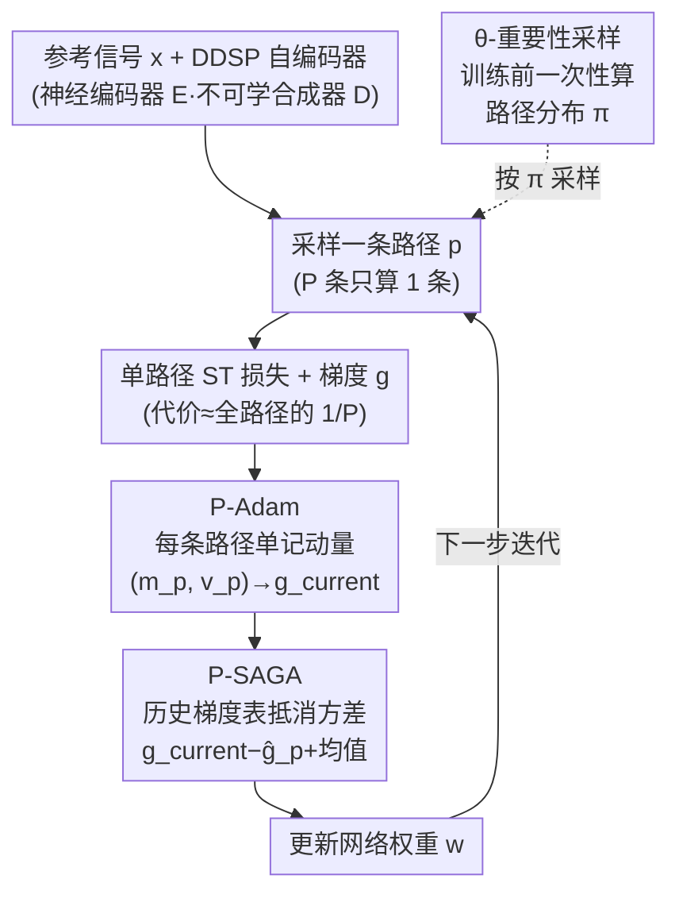

# SCRAPL: Scattering Transform with Random Paths for Machine Learning

**会议**: ICLR 2026  
**arXiv**: [2602.11145](https://arxiv.org/abs/2602.11145)  
**代码**: 有 (Python包，[项目网站](https://christhetree.github.io/scrapl/))  
**领域**: 信号处理 / 时间序列  
**关键词**: 散射变换, 随机路径采样, DDSP, 重要性采样, 方差缩减

## 一句话总结

针对多变量散射变换(ST)作为可微损失函数时因路径数P过多导致计算代价过高的问题，提出SCRAPL——每步仅随机采样一条路径并通过P-Adam（路径自适应动量）、P-SAGA（路径随机平均梯度）和θ-重要性采样三种方差缩减技术来稳定梯度，在无监督声音匹配任务上以接近全路径ST的精度、MSS级别的低计算成本实现了Pareto最优。

## 研究背景与动机

**领域现状** 散射变换(ST)是一种基于小波的非线性算子，将高分辨率输入分解为多条路径(path)的低分辨率系数。ST距离被行为学研究证实是声音感知差异的良好预测器，联合时频散射(JTFS)更是人类听觉皮层谱时域感受野的理想化模型。这使得ST距离成为音频生成、深度逆问题等领域中理论上最优的感知损失函数。

**现有痛点** 理论虽好但实践不可行：JTFS包含数百条路径，每条路径是一次多变量小波卷积——计算全部P条路径的前向和反向传播代价极高（约为单路径的P倍）。以粒度合成器匹配实验为例，全JTFS训练比多尺度频谱损失(MSS)慢25倍。这导致ST虽然是更好的损失函数，但在实际神经网络训练中几乎无法使用。另一方面，MSS虽然计算高效，但其梯度在输入输出时间失配、或合成器涉及谱时域调制的情况下不具有信息量——不能替代ST。

**核心矛盾** ST损失的质量优势与计算代价之间的矛盾。朴素的随机路径采样（每步只算一条路径）可以将计算量降P倍，但采样方差太大导致训练不收敛。

**切入角度** ST损失本质上是P个路径损失的求和（有限和结构），这与随机优化中经典的有限和场景完全对应——因此可以借用SAGA等方差缩减技术。但路径之间不是独立同分布的（不同路径对应不同的时频调制模式），不能直接套用标准算法。

**核心idea** 将散射变换的树状结构转化为随机优化问题，通过架构感知的方差缩减技术让每步只计算一条路径也能稳定收敛。

## 方法详解

### 整体框架

SCRAPL在标准神经网络训练循环中替换全路径ST损失：每一步只从P条路径中随机抽取一条，只计算该路径的损失和梯度，把单步代价压到全路径的约 $1/P$。为了弥补单路径梯度的高方差，引入三个互补的优化技术——其中 θ-重要性采样在训练**前**一次性算好一个非均匀的路径采样分布 $\pi$（让信息量大的路径被更频繁抽到），另外两个则活在训练**每一步**里：P-Adam 给每条路径单独记动量、对抗路径间的梯度尺度差异，P-SAGA 用历史梯度表把单路径采样的方差显式抵消掉。三者叠起来，让"每步只算一条路径"也能像全路径一样稳定收敛。

### 关键设计

**1. P-Adam：给每条路径单独记一套动量，对抗路径间的梯度尺度差异**

朴素随机路径采样不收敛的第一个根源，是标准 Adam 的矩估计被"串味"了。Adam 用指数滑动平均把连续迭代的梯度 $(m, v)$ 平滑下来，这隐含假设相邻几步看到的是同分布的梯度；但 SCRAPL 每步随机抽一条路径，不同路径对应不同时频调制尺度，梯度分布差异很大，把它们混进同一套 $(m, v)$ 会让更新方向飘忽。P-Adam 的做法是为每条路径 $p$ 单独维护 $(m_p, v_p)$，只有这条路径被采到时才更新它的矩。更关键的是衰减系数随路径上次被采样的时间间隔自适应：用 $(k-\tau_p)/P$（$\tau_p$ 是路径 $p$ 上次被采到的步数，$P$ 是总路径数）来调指数衰减——间隔越久衰减越快，避免一条很久没被采到的路径用陈旧的历史矩污染当前更新；偏差校正的指数也相应从 Adam 的 $\beta^k$ 改成 $\beta^{k/P}$，以匹配"每条路径平均每 $P$ 步才被采一次"的节奏。

**2. P-SAGA：用历史梯度表把单路径采样的方差显式抵消掉**

单路径采样方差大的本质，是不同路径的梯度彼此差异大，而每步只看一条等于用一个高方差样本去估计全路径求和。注意到 ST 损失正是 $P$ 条路径损失的求和（有限和结构），这与随机优化里 SAGA 加速 SGD 的经典场景完全对应。SCRAPL 把 SAGA 搬到路径维度而非样本维度：维护每条路径最近一次的 P-Adam 更新值 $\hat g_p$ 以及已访问路径集 $\Gamma$，当前步的实际更新量取

$$g_{\text{used}} = \hat g_{p} - \hat g_{p}^{\text{old}} + \frac{1}{|\Gamma|}\sum_{q\in\Gamma}\hat g_q,$$

即"当前路径的新梯度 − 该路径存档的旧梯度 + 所有已访问路径的梯度均值"。前两项的差捕捉这条路径相对其历史的增量、第三项补上全局平均，二者合起来在期望上仍指向全路径梯度，却把路径间差异带来的方差抵消掉，收敛曲线随之平稳。与样本维度 SAGA 的关键区别在于：这里的存档表大小正比于路径数 $P$（约几百）而非数据集大小 $N$，内存开销可控，方法才落地可用。

**3. θ-重要性采样：按损失景观曲率把采样预算偏向信息量大的路径**

即便方差被缩减，均匀采样仍会把大量预算浪费在对当前合成器无关的路径上——例如一个慢 AM 合成器，只有低频调制路径才携带有用梯度。θ-IS 在训练前一次性算出一个非均匀采样分布 $\pi$，让信息量大的路径被更频繁抽到。它利用 DDSP 自编码器的结构：解码器 $D$ 是不可学但可微的合成器、编码器 $E_x$ 是神经网络，于是可以对每个合成器参数维度 $u$ 和每条路径 $p$ 求 ST 损失对该参数的敏感度，再用 Hessian 向量积的 Power Iteration 近似出该处损失景观的最大特征值，作为"重要性" $C_{u,p}$——曲率越大说明这条路径对该参数越敏感、梯度越有信息量。把 $C_{u,p}$ 沿参数维度聚合归一化即得路径概率 $\pi_p$。整个计算在路径与参数维度上都可并行，且只在训练前做一次，几乎不增加训练期开销。

### 损失函数 / 训练策略

SCRAPL损失是全路径ST损失的无偏估计（Proposition 3.1证明，通过链式法则和期望的线性性）。在DDSP范式下，编码器CNN操作于常数Q变换(CQT)上，解码器为不可学的合成器。JTFS配置：J=12, Q1=8, Q2=2, J_fr=3, Q_fr=2，共约315-483条路径。训练使用AdamW，不加额外超参数。

## 实验关键数据

### 主实验（粒度合成器声音匹配）

| 方法 | 合成器参数L1‰↓ | 计算成本(ms) | 说明 |
|------|----------------|-------------|------|
| 监督P-loss | 20.5±0.2 | 0.5 | 理论上限 |
| 全JTFS | 42.4 | 1731 | 最佳无监督，但极慢 |
| **SCRAPL(+θ-IS)** | **65.7±4.2** | **89.8** | 精度接近JTFS，速度接近MSS |
| MSS Log+Linear | 259.1±1.7 | 19.1 | 完全无法匹配slope参数 |
| PANNs Wavegram | 158.9±4.4 | 29.3 | 只能匹配density |
| MS-CLAP | 165.9±8.2 | 75.6 | 只能匹配density |

### 消融实验

| 配置 | 参数L1‰↓ | 收敛步数↓ | 验证曲线方差↓ |
|------|---------|----------|-------------|
| SCRAPL(仅采样) | 99.7±8.2 | 10906±1170 | 5.30±0.25 |
| +P-Adam | 87.4±14.5 | 8006±697 | 6.98±0.25 |
| +P-SAGA | 73.8±13.4 | 7296±683 | **3.46±0.15** |
| **+θ-IS** | **65.7±4.2** | **6014±642** | **3.27±0.12** |
| 全JTFS | 42.4 | 1442 | 5.66 |

### 关键发现

- SCRAPL（即使没有任何额外优化技术）已经超越所有非JTFS方法——证明ST路径的随机采样本身就是一个可行的策略
- P-SAGA是方差缩减的关键组件（统计显著，p<0.01），θ-IS对总变差和收敛速度有统计显著改善
- 在chirplet合成器实验中，θ-IS将θ_AM参数误差降低25-55%、θ_FM降低14-80%，收敛时间减少23-50%
- Roland TR-808真实鼓机实验中，SCRAPL在时间对齐和失配(meso)场景下表现一致，而MSS在失配时严重退化——验证了ST距离的时间不变性优势
- θ-IS采样概率的可视化确认了对不同合成器配置确实学到了不同的路径分布，且高概率路径与合成器参数范围吻合

## 亮点与洞察

- 将长期被视为"太贵不实用"的散射变换损失函数变成了实际可用的训练工具——这对音频/信号处理社区意义重大，类似于从全batch梯度到SGD的转变
- 数学上的严谨性令人印象深刻：Proposition 3.1证明了无偏性，P-Adam和P-SAGA的公式推导清晰且不引入额外超参数
- θ-重要性采样的设计体现了"领域知识指导采样"的思想：不是盲目采样所有路径，而是根据合成器参数的损失景观曲率来分配采样预算——结合了信号处理的领域理解和机器学习的随机优化技巧
- 实验设计刻意选择了非确定性合成器（粒度合成在微观层面有随机时间位移），这恰好是MSS梯度失效而ST距离保持有效的场景——动机和实验高度一致

## 局限与展望

- 目前仅在音频/DDSP场景验证——SCRAPL作为通用算法理论上可用于计算机视觉（2D旋转平移散射）和其他使用ST的领域，但缺乏交叉验证
- θ-IS的初始化计算需要Hessian向量积的Power Iteration，对大规模模型可能仍有一定开销
- TR-808实验中SCRAPL未能恢复鼓声的衰减部分——可能是低频路径在采样分布中被低估，指向重要性采样的自适应更新（训练过程中动态调整π而非只初始化一次）
- 当前理论分析仅证明了无偏性，收敛速率的严格分析（尤其在非凸情况下）留待未来工作

## 相关工作与启发

- **vs pGST (剪枝图散射)**：pGST是固定的特征选择（保留~10%路径），SCRAPL更激进地每步只用1条路径但配合方差缩减——本质区别在于pGST丢弃了路径信息，SCRAPL在期望中保留了全部信息
- **vs MSS (多尺度频谱损失)**：MSS是DDSP的标准损失但在非确定性/失配场景下梯度无信息量；SCRAPL让JTFS（有理论保证的感知损失）在MSS的计算预算内变得可用
- **思路可迁移**：有限和结构的随机优化+架构感知的重要性采样，可推广到任何具有树状分解结构的损失函数

## 评分

- 新颖性: ⭐⭐⭐⭐ 散射变换随机优化的首次系统研究，P-Adam/P-SAGA的路径自适应设计是非平凡的改造
- 实验充分度: ⭐⭐⭐⭐ 三个DDSP任务（粒度/chirplet/TR-808）+详细消融+与全路径对比+统计显著性检验
- 写作质量: ⭐⭐⭐⭐⭐ 数学严谨（含完整证明），算法伪代码清晰，实验图表信息量密集
- 价值: ⭐⭐⭐⭐ 让一类高质量但不实用的感知损失函数变得实用——对可微数字信号处理领域有直接影响

<!-- RELATED:START -->

## 相关论文

- [\[ICLR 2026\] FrontierCO: Real-World and Large-Scale Evaluation of Machine Learning Solvers for Combinatorial Optimization](frontierco_real-world_and_large-scale_evaluation_of_machine_learning_solvers_for.md)
- [\[ICLR 2026\] Jacobian Aligned Random Forests](jacobian_aligned_random_forests.md)
- [\[ICLR 2026\] Exploring Diverse Generation Paths via Inference-time Stiefel Activation Steering](exploring_diverse_generation_paths_via_inference-time_stiefel_activation_steerin.md)
- [\[ICLR 2026\] Rapid Training of Hamiltonian Graph Networks using Random Features](rapid_training_of_hamiltonian_graph_networks_using_random_features.md)
- [\[AAAI 2026\] Personalized Federated Learning with Bidirectional Communication Compression via One-Bit Random Sketching](../../AAAI2026/optimization/personalized_federated_learning_with_bidirectional_communication_compression_via.md)

<!-- RELATED:END -->
