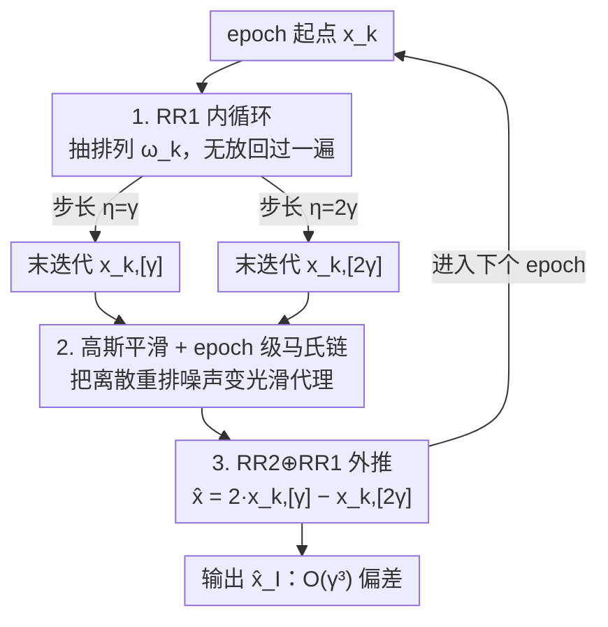

# Shuffling the Data, Stretching the Step-Size: Sharper Bias in Constant Step-Size SGD

**会议**: ICLR 2026  
**OpenReview**: [https://openreview.net/forum?id=QQZ53UtXgf](https://openreview.net/forum?id=QQZ53UtXgf)  
**领域**: 优化理论 / 随机优化  
**关键词**: 常步长SGD, 随机重排, Richardson-Romberg外推, 变分不等式, 偏差分析

## 一句话总结
本文把两个经典启发式——**随机重排（Random Reshuffling, RR1）** 与 **Richardson–Romberg 外推（RR2）**——首次严格地组合进一个统一算法，证明在拟强单调变分不等式（VIP）上二者协同可以把常步长 SGD 的渐近偏差从 $O(\gamma)$ 一路压到 $O(\gamma^3)$，同时保持 RR1 带来的 $O(\gamma^2)$ 均方误差，理论与实验都验证了这种"1+1>2"的协同。

## 研究背景与动机

**领域现状**：从对抗鲁棒性、GAN 训练到多智能体学习，大量机器学习任务都可以写成有限和的 min–max 优化，或更一般的**变分不等式问题（VIP）**：求 $x^*$ 使 $\langle F(x^*), x-x^*\rangle \ge 0$，其中 $F(x)=\frac1n\sum_i F_i(x)$。求解这类问题的主力工具是**常步长随机梯度法**，因为它调参简单、能快速抹掉初始化依赖、早期收敛快。

**现有痛点**：常步长 $\gamma$ 的致命缺陷是**收敛会停在一个非零误差上**。即便对有唯一解 $x^*$ 的强凸问题，SGD 最后一步迭代典型地满足
$$\mathrm{MSE}(\mathrm{SGD}) = \limsup_{k\to\infty} \mathbb{E}\|x_k-x^*\|^2 = O(\gamma), \quad \mathrm{bias}(\mathrm{SGD}) = \limsup_{k\to\infty}\|\mathbb{E}[x_k]-x^*\| = O(\gamma).$$
也就是说迭代稳定在离最优解约一个步长的距离处，既有方差也有系统性偏差。

**核心矛盾**：实践中人们用两个独立的启发式去缓解它。**RR1（无放回采样，每个 epoch 恰好访问每个样本一次）** 能把 MSE 从 $O(\gamma)$ 锐化到 $O(\gamma^2)$；但因为 $\mathrm{bias}(\hat x)\le\sqrt{\mathrm{MSE}(\hat x)}$ 只是个平凡上界，**RR1 并不保证偏差阶数也变好**——偏差能否改进一直是未解问题。另一边，**RR2 外推**用两个步长 $\gamma, 2\gamma$ 跑同一算法再线性组合，让领头的偏差项相消：若 $\mathrm{bias}(\gamma)=\Delta\gamma+O(\gamma^\kappa)$，则 $x_{\mathrm{extr}}-x^* = 2x^\gamma_\infty - x^{2\gamma}_\infty - x^* = O(\gamma^\kappa)$。RR2 单用能拿到 $O(\gamma^{3/2})$ 偏差，但它和 RR1 是"正交"的两条线，从未被严格合并。

**本文目标**：回答一个自然的问题——当**常步长、随机重排、Richardson 外推**三者同时作用时，会涌现什么新现象？能否把偏差推到理想的 $O(\gamma^3)$？

**切入角度**：困难在于 RR1 引入的是一个**有偏的、由排列驱动的离散噪声 oracle**，而现有外推分析几乎都假设无偏或连续分布的扰动，二者不兼容。作者的观察是：重排噪声虽然在**单步**尺度上破坏时齐性，但在 **epoch 尺度**上恰好恢复时齐——一个 epoch 跑完后下一迭代的分布只依赖于 epoch 起点和抽到的排列，与排列内部位置无关。

**核心 idea**：在 epoch 层面把 RR1 看成一条**时齐马尔可夫链**，用连续状态马氏链工具建立 LLN/CLT，再用谱张量技术证明外推能在重排诱导的有偏 oracle 下依然消偏，从而得到 $O(\gamma^3)$ 偏差。

## 方法详解

### 整体框架

算法 `SGD-RR2⊕RR1`（Algorithm 1）是一个**两层结构**：内层是带随机重排的 SGD（RR1），外层是 Richardson–Romberg 外推（RR2）。在每个 epoch $k$，算法**并行地**用两个步长 $\eta=\gamma$ 和 $\eta=2\gamma$ 各跑一遍重排 pass：先抽一个 $[n]$ 上的随机排列 $\omega_k$，按这个顺序对 $n$ 个样本做内循环更新
$$x^{i+1}_{k,[\eta]} = x^i_{k,[\eta]} - \eta\,\mathrm{PreProcess}\big(\mathrm{StochOracle}(x^i_{k,[\eta]}, \omega_k[i])\big),$$
其中 `StochOracle` 在最小化问题里返回随机梯度、在一般 VI 里返回算子值 $F_{\omega_k[i]}$，而 `PreProcess` 给梯度加一个**标定过的高斯平滑** $U_k\sim\mathcal{N}(0,\gamma^2 n\sigma_*^2 I)$。两条 pass 各自的末迭代成为下个 epoch 的起点；在 epoch 末，外层用两步长的末迭代做一次外推：
$$\hat x_{k+1} = 2\,x^n_{k,[\gamma]} - x^n_{k,[2\gamma]},$$
让两条轨迹各自 $O(\gamma)$ 的领头偏差相消。整套流程把"低层 RR1 训练 + 高层 RR2 黑盒精修"这个工程上常见的分工，第一次做成了有理论保证的统一算法。

### 关键设计

**1. RR1 内循环：用无放回采样把偏差的高阶项压低**

针对常步长 SGD 偏差停在 $O(\gamma)$ 这个痛点，第一步先把 RR1 单独的收敛刻画清楚。作者证明（Theorem 4.1），在 $\lambda$-弱 $\mu$-拟强单调假设下，只要 $\gamma\le\gamma_{\max}$，Perturbed SGD-RR1 的迭代**指数收敛**到一个邻域：
$$\mathbb{E}\|x^0_{k+1}-x^*\|^2 \le \Big(1-\tfrac{\gamma n\mu}{2}\Big)^{k+1}\|x^0_0-x^*\|^2 + \frac{8n\gamma^2 L_{\max}^2}{\mu^2}\sigma_*^2 + \frac{8\lambda}{\mu}.$$
在拟强单调（$\lambda=0$）这一已经涵盖强凸的情形下，邻域是 $O(\gamma^2\sigma_*^2)$——比有放回 SGD 的 $O(\gamma\sigma_*^2)$ 邻域小一个量级。更关键的是偏差的精细刻画（Lemma 4.5）：
$$\mathrm{bias}(\text{Perturbed SGD-RR1}) = \limsup_{k\to\infty}\|\mathbb{E}[x_k]-x^*\| = C(x^*)\gamma + O(\gamma^3).$$
对比经典 SGD 的 $\mathrm{bias}(\mathrm{SGD})=C(x^*)\gamma+O(\gamma^{1.5})$，可见 RR1 **保留了同样的一阶项 $C(x^*)\gamma$，但把高阶修正从 $O(\gamma^{1.5})$ 改善到 $O(\gamma^3)$**。这个"一阶项不变、高阶项更干净"的结构正是后续外推能奏效的前提——因为 RR2 要消的就是那个 $C(x^*)\gamma$ 领头项，而它在两个步长下精确成比例。

**2. epoch 级马氏链视角 + 高斯平滑：把离散重排噪声变成可分析的光滑代理**

重排的麻烦在于：一个 epoch 跑完后累积梯度估计是**有偏**的，且噪声是**离散的、与排列绑定**的，经典的无偏 oracle 马氏链理论用不上。作者的解法分两步。其一，引入标定高斯扰动 `PreProcess`，把离散重排噪声平滑成一个**保持方差、矩与偏差阶数不变**的良态代理（实践中对大数据集这一步影响可忽略，但理论上让马氏链工具得以施展）。其二，利用前面提到的"单步非时齐、epoch 时齐"现象：把一个 epoch 的端点映射写成 $x_{k+1}=H(x_k,\omega_k)+U_k$，$U_k\sim\mathcal{N}(0,\Sigma)$，则 epoch 级序列 $(x_k)_{k\ge0}$ 是一条**时齐马尔可夫链**，转移核为
$$P(x,A) = \frac{1}{n!}\sum_{\omega\in S_n}\int_A \phi\big(y; H(x,\omega), \Sigma\big)\,dy.$$
通过验证不可约、非周期与正 Harris 常返，作者证明该链有**唯一不变分布 $\pi_\gamma$**、在全变差下几何收敛（Theorem 4.3），并进一步用 Birkhoff–Khinchin 遍历定理建立 epoch 迭代的**大数定律（LLN）与中心极限定理（CLT）**（Theorem 4.4）：
$$\frac{1}{T}\sum_{t=0}^{T-1}\ell(x_t)\xrightarrow{a.s.}\mathbb{E}_{x\sim\pi_\gamma}[\ell(x)], \quad T^{-1/2}\sum_{t=0}^{T-1}\big(\ell(x_t)-\mathbb{E}_{\pi_\gamma}[\ell(x)]\big)\xrightarrow{d}\mathcal{N}(0,\sigma^2_{\pi_\gamma}(\ell)).$$
这套马氏链刻画不仅给出几何遍历性，还让我们能对轨迹上的统计量做一致估计——这是把外推从"经验技巧"升级为"有渐近保证的去偏器"的理论基座。

**3. RR2⊕RR1 协同：用谱分析在有偏 oracle 下做立方级消偏**

有了 RR1 的偏差展开 $C(x^*)\gamma+O(\gamma^3)$，外推就能精确相消领头项。难点在于：重排诱导的 oracle 是**有偏的**，标准外推分析（假设无偏/连续扰动）失效。作者靠两个超出直接推广的技术克服：其一是对**整 pass 算子的谱研究**（Lemma F.2），它把 RR1 的全 pass 映射与多步 extragradient 文献联系起来，需要对重排各 pass 间的谱性质做非平凡处理；其二是一个**组合引理**（Lemma E.2），用来界定无放回采样下有限和子集的**四阶矩**，比有放回情形的对应结果复杂得多。最终（Theorem 4.6），算法输出满足
$$\text{Last-iterate:}\ \|\mathbb{E}[x_k]-x^*\| \le c(1-\rho)^k + O(\gamma^3), \quad \text{Averaged:}\ \Big\|\mathbb{E}\big[\tfrac{1}{k}\textstyle\sum_{m=1}^k x_m\big]-x^*\Big\| \le \frac{c/\rho}{k}+O(\gamma^3),$$
其中 $\rho\in(0,1)$、$c<\infty$。这就是**结构化非单调 VIP 上第一个 $O(\gamma^3)$ 偏差保证**：组合方法严格优于两个启发式各自单用（RR1 单用偏差仍 $O(\gamma)$、RR2 单用 $O(\gamma^{3/2})$），且同时保住了 RR1 带来的 $O(\gamma^2)$ MSE。

### 损失函数 / 训练策略

算法不引入新的损失函数，只改采样与外推策略。关键超参是步长 $\gamma\le\gamma_{\max}$，其中 $\gamma_{\max}=\min\big\{\tfrac{1}{3nL_{\max}}, \tfrac{\sqrt{1+6\mu^2 L_{\max}^2}-1}{12nL_{\max}^2}\big\}$；高斯平滑方差标定为 $\gamma^2 n\sigma_*^2$，与解处梯度二阶矩 $\sigma_*^2=\frac1n\sum_i\|F_i(x^*)\|^2$ 挂钩。外推有两种实现：epoch 末末迭代外推（line 9，理论上偏好），或对 epoch 平均做外推（line 10，Polyak–Ruppert 式，方差更优）。

## 实验关键数据

实验聚焦强单调设定，在两玩家零和博弈（强凸–强凹二次型）上对比四种变体——经典有放回 SGDA、SGDA-RR1、SGDA-RR2、以及二者组合 SGDA-(RR2+RR1)，每条曲线报告 5 次 trial 平均的相对误差 $\log\big(\|x_k-x^*\|^2/\|x_0-x^*\|^2\big)$。

### 主实验：不同启发式的相对误差对比

| 条件数 $\kappa=L/\mu$ | 算法变体 | 收敛行为 | 终态相对误差（量级） |
|------|------|------|------|
| $\kappa=1$ | SGDA / RR1 / RR2 / **(RR2+RR1)** | 线性收敛到邻域 | RR2+RR1 邻域最小 |
| $\kappa=5$ | 四变体同上 | 同上 | RR2+RR1 显著更小 |
| $\kappa=10$ | 四变体同上 | 收敛更慢但趋势一致 | RR2+RR1 可达 $\sim10^{-8}$，优于其余三者 |

核心观察（Figure 2）：组合方法 RR2⊕RR1 **线性收敛到解的更小邻域**，即便只用末迭代（last iterate）也比单用 SGDA / RR1 / RR2 达到更小的相对误差，验证了 Algorithm 1 偏差被改善的理论结论。

### 消融 / 分析：CLT 集中性验证

| 配置 | 观测量 | 现象 |
|------|------|------|
| $T=100$ | $\frac{1}{\sqrt T}\sum_t f_t$ 直方图 | 围绕博弈值 0 集中，但分布较宽 |
| $T=500$ | 同上 | 集中度提高 |
| $T=1000$ | 同上 | 最集中，逼近真值 0 |
| $\gamma=0.1$ vs $\gamma=0.001$（$T=500$） | 步长效应 | 小步长 $\gamma=0.001$ 集中度明显更高 |

这组实验（Figure 3）直接验证 Theorem 4.4 的 CLT：归一化平均评估随迭代数 $T$ 增大而越发集中于博弈值，且步长越小集中度越高，与 $\sqrt T$ 标度下的渐近正态刻画吻合。

### 关键发现
- **协同效应是真实的**：组合方法不只是"两个 trick 叠加"，而是把偏差阶数从单用时的 $O(\gamma)$（RR1）/ $O(\gamma^{3/2})$（RR2）一举推到 $O(\gamma^3)$，且条件数依赖与原始 SGDA 持平（不像前作 Emmanouilidis 2024 的 SEG 变体那样条件数更差）。
- **末迭代也够用**：理论虽偏好末迭代，但实验显示即便用末迭代，组合方法仍优于其余变体——说明改进来自偏差本身而非平均化。
- **步长越小越集中**：CLT 集中度对步长敏感，$\gamma=0.001$ 比 $\gamma=0.1$ 明显更紧，符合常步长方法"小步长换小偏差"的直觉。

## 亮点与洞察
- **"epoch 时齐"是点睛之笔**：重排在单步尺度上破坏时齐性，但作者敏锐地发现一个完整 reshuffled pass 后分布只依赖起点与排列、与排列内位置无关，于是把混乱的离散噪声搬到 epoch 尺度就成了干净的时齐马氏链——这个视角切换是整套分析能跑通的关键。
- **高斯平滑的"无害去偏"**：用标定高斯扰动把离散排列噪声变成连续光滑代理，且保持方差/矩/偏差阶数不变，是一种"为了能用工具而引入、但不改变结论"的巧妙桥梁；论文还指出对大数据集这步在实践中可省。
- **可迁移性**：把"低层重排训练 + 高层外推精修"做成有保证的两层算法，这个范式可推广到 Q-learning、双时间尺度随机逼近等同样用常步长的场景；马氏链 + 谱分析 + 高阶矩界的组合工具箱也可复用于其他有偏 oracle 的分析。

## 局限与展望
- **高斯平滑的精确依赖未厘清**：扰动方差对数据集规模的精确依赖被留作 future work，作者只给了"实践中影响可忽略"的经验说明和一个无需该步的简略 sketch。
- **实验偏理论验证**：主实验都在合成的强单调二次型博弈上做，虽附录提到 Wasserstein GAN 的消融，但缺少大规模真实深度学习任务上的端到端验证。
- **假设仍有门槛**：需要 Lipschitz 连续、$\lambda$-弱 $\mu$-拟强单调以及解处有限二阶/四阶矩；$O(\gamma^3)$ 偏差的最强结论只在拟强单调（$\lambda=0$）下成立，弱单调（$\lambda>0$）仍带不可消的 $8\lambda/\mu$ 项。
- **改进方向**：把组合框架推广到自适应步长、动量方法，或在不加高斯平滑的前提下直接处理离散重排噪声，都是自然延伸。

## 相关工作与启发
- **vs Emmanouilidis et al. (2024)**：前作只用 RR1、基线是 SEG、要求 $F$ 强单调，偏差阶 $O(\gamma+\gamma^3)$（一阶项仍在），且条件数比 vanilla-SEG 差。本文用 RR1⊕RR2、基线是 SGDA、放宽到拟强单调，偏差阶达 $O(\gamma^3)$（领头项被外推消掉），条件数与 vanilla-SGDA 持平——机制从"EG 结构 + RR1"换成"偏差相消（RR1⊕RR2）"。
- **vs Vlatakis-Gkaragkounis et al. (2024)**：他们单用 RR2 在 VIP 上拿到 $O(\gamma^{3/2})$ 偏差（其声称的 $O(\gamma^2)$ 依赖额外噪声假设，本文设定不满足）。本文证明叠上 RR1 后能进一步到 $O(\gamma^3)$，是对外推单打独斗的严格超越。
- **vs 经典外推分析（Dieuleveut 2020 等）**：这些工作假设无偏或连续扰动 oracle，无法覆盖重排诱导的离散有偏噪声；本文用高斯平滑 + 谱张量技术专门处理了这个有偏 oracle，填补了空白。

## 评分
- 新颖性: ⭐⭐⭐⭐⭐ 首次严格证明 RR1 与 RR2 在非单调 VIP 上的协同，得到第一个 $O(\gamma^3)$ 偏差保证
- 实验充分度: ⭐⭐⭐ 合成博弈上的验证扎实且与理论吻合，但缺大规模真实任务
- 写作质量: ⭐⭐⭐⭐ 动机层层递进，定理与直觉（epoch 时齐、偏差相消）解释清晰
- 价值: ⭐⭐⭐⭐ 为常步长随机方法的"实践启发式 → 可证明改进"搭了一座桥，工具箱可复用

<!-- RELATED:START -->

## 相关论文

- [\[ICLR 2026\] Fast Frank–Wolfe Algorithms with Adaptive Bregman Step-Size for Weakly Convex Functions](fast_frankwolfe_algorithms_with_adaptive_bregman_step-size_for_weakly_convex_fun.md)
- [\[ICML 2026\] Adaptive Sharpness-Aware Minimization with a Polyak-type Step size: A Theory-Grounded Scheduler](../../ICML2026/optimization/adaptive_sharpness-aware_minimization_with_a_polyak-type_step_size_a_theory-grou.md)
- [\[ICLR 2026\] High-dimensional limit theorems for SGD: Momentum and Adaptive Step-sizes](high-dimensional_limit_theorems_for_sgd_momentum_and_adaptive_step-sizes.md)
- [\[ICML 2026\] Gradient Descent with Large Step Size Restores Symmetry in Deep Linear Networks with Multi-Pathway](../../ICML2026/optimization/gradient_descent_with_large_step_size_restores_symmetry_in_deep_linear_networks_.md)
- [\[ICLR 2026\] Seesaw: Accelerating Training by Balancing Learning Rate and Batch Size Scheduling](seesaw_accelerating_training_by_balancing_batch_size_and_learning_rate_schedulin.md)

<!-- RELATED:END -->
