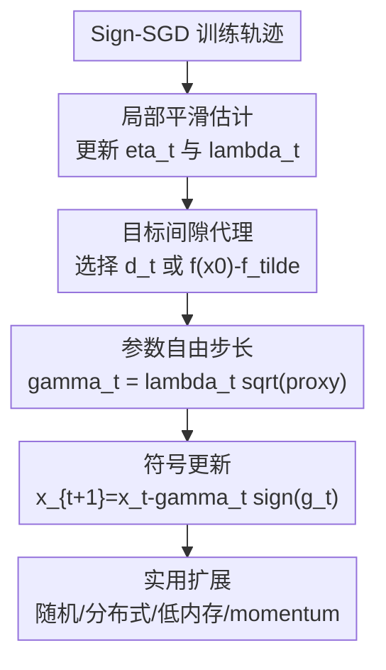

# Sign-SGD via Parameter-Free Optimization

**会议**: ICLR2026  
**OpenReview**: [https://openreview.net/forum?id=yDLD3D95w3](https://openreview.net/forum?id=yDLD3D95w3)  
**代码**: https://github.com/brain-lab-research/ALIAS  
**领域**: optimization  
**关键词**: 参数自由优化, Sign-SGD, 步长自适应, 大模型训练, 梯度压缩  

## 一句话总结

这篇论文提出 ALIAS，一个不需要手动调学习率的参数自由 Sign-SGD 系列算法，通过逐轮估计目标间隙和局部平滑常数来自动给出 sign 更新步长，在 LLaMA 预训练、Swin 微调和多种基准上接近或超过调参后的 Sign-SGD / AdamW，同时把网格搜索学习率的总训练成本降下来。

## 研究背景与动机

**领域现状**：Sign-SGD 的吸引力来自两个方向。一方面，在分布式训练里，worker 只传梯度符号，服务器用 majority vote 聚合，可以显著压缩通信；另一方面，在单机大模型训练里，Sign-SGD 不像 AdamW 那样保存一阶、二阶矩估计，优化器状态更轻。随着 LLM 和视觉模型规模上升，这种“只看方向、不存完整统计量”的优化器重新变得实用。

**现有痛点**：Sign-SGD 的实际效果高度依赖步长 $\gamma$。经典理论里，若目标函数在 $\ell_\infty$ 范数下平滑，Sign-SGD 的平均梯度一范数可以写成类似

$$
\frac{1}{T}\sum_{t=0}^{T-1}\|\nabla f(x_t)\|_1 \leq \frac{\Delta^*}{\gamma T} + \frac{\gamma L_\infty}{2},
$$

其中 $\Delta^*=f(x_0)-f(x^*)$，$L_\infty$ 是对应平滑常数。让右边最小的步长大致需要 $\gamma\propto \sqrt{\Delta^*/(L_\infty T)}$。问题是这两个量在真实神经网络训练里都不知道，尤其 $f(x^*)$ 和局部平滑性随训练过程变化，很难预先给出可靠数值。

**核心矛盾**：Sign-SGD 本来想降低内存和通信成本，但如果每个任务仍然要为学习率做昂贵的 grid search，省下的单次训练成本会被多次试跑吞掉。大模型预训练尤其如此：一次错误学习率可能就是数小时到数天的 GPU 消耗，手动调参还会让“sign 优化器是否真的省钱”变得不清楚。

**本文目标**：作者希望构造一种参数自由 Sign-SGD：不依赖预先知道 $\Delta^*$、$L_\infty$，不需要 restart 或额外搜索过程；还能覆盖确定性梯度、随机梯度和分布式训练；最后在实际 LLM / ViT 训练里保持 Sign-SGD 的性能和一部分内存优势。

**切入角度**：论文没有把参数自由优化照搬到普通 SGD，而是抓住 Sign-SGD 理论中最关键的两个未知量。分子 $\Delta^*$ 用训练过程里可积累的下降证据或已知下界替代，分母 $L_\infty$ 用相邻梯度变化和相邻点距离形成的局部平滑估计替代。这样，步长不是外部超参，而是由当前训练轨迹“自举”出来。

**核心 idea**：用逐轮估计的 $\Delta^*$ 代理和局部 $L_\infty$ 代理替代 Sign-SGD 最优步长里的未知常数，让 sign 更新自动获得接近调参学习率的训练动态。

## 方法详解

### 整体框架

论文的主算法叫 ALIAS（Automatic Local per-Iteration Approximation of the Stepsize）。它仍然执行 Sign-SGD 的基本更新 $x_{t+1}=x_t-\gamma_t\operatorname{sign}(\nabla f(x_t))$，但把固定或手调的 $\gamma_t$ 换成每一步自动计算的值。每轮先拿到梯度，再更新局部平滑累积量 $\eta_t$，再选择目标间隙代理 $d_t$ 或 $f(x_0)-\tilde f$，最后用 $\gamma_t=\lambda_t\sqrt{d_t}$ 或 $\gamma_t=\lambda_t\sqrt{f(x_0)-\tilde f}$ 走一步 sign descent，其中 $\lambda_t=1/\sqrt{\eta_t}$。

这篇论文不是单一算法小修，而是一组围绕 ALIAS 的变体：基础版提供理论主线；随机梯度版用随机样本下的相邻梯度差估计局部平滑；分布式版保留 Sign-SGD 的符号聚合视角；memory-efficient 版只保存上一轮梯度符号和极值，尽量恢复 Sign-SGD 的低内存优势；Adam-style momentum 版则面向实际深度学习训练，把 momentum 和 sign 更新结合起来。

### 关键设计

**1. 局部平滑估计：把未知的 $L_\infty$ 从训练轨迹里攒出来**

Sign-SGD 最优步长的分母依赖 $L_\infty$，但全局平滑常数既难估计也过于保守。ALIAS 的做法是观察相邻两步梯度变化：如果 $x_{i+1}$ 和 $x_i$ 很近，但梯度一范数变化很大，说明局部曲率强，步长应该收小；反之则可以更大胆。具体地，基础版用

$$
\eta_t=\eta_{t-1}+\frac{\|\nabla f(x_t)-\nabla f(x_{t-1})\|_1}{\|x_t-x_{t-1}\|_\infty},\qquad \lambda_t=\frac{1}{\sqrt{\eta_t}}.
$$

这个形式很像 AdaGrad-Norm：不是每次重新估计一个孤立的 $L_\infty$，而是把历史局部变化累积进分母。它的好处是保守性随训练过程自然增长，避免早期梯度变化剧烈时步长过大，也避免要求用户提前知道某个不可观测的全局常数。论文理论上证明，在凸且 $L_\infty$-smooth 的设定下，这种估计可以给出接近已知 $L_\infty$ 时的收敛保证，只是会多出与初始局部估计质量有关的因子。

**2. 目标间隙代理：把 $f(x_0)-f(x^*)$ 换成可计算的下降证据**

步长分子里的 $\Delta^*=f(x_0)-f(x^*)$ 同样未知。ALIAS 给了两种选择。Option I 从一个很小的初始估计 $d_0$ 出发，每轮利用已经发生的 sign 更新和新梯度内积构造下降证据：

$$
\tilde d_t=\sum_{i=0}^{t-1}\gamma_i\langle \nabla f(x_{i+1}),\operatorname{sign}(\nabla f(x_i))\rangle,
\qquad d_t=\max(d_{t-1},\tilde d_t).
$$

直觉上，这个量是在问：沿着此前 sign 方向走过的路，至少揭示了多大的目标函数尺度？取最大值让估计单调不降，避免因为局部噪声让步长忽大忽小。Option II 则更直接：如果经验风险最小值有自然下界，例如分类或语言模型训练 loss 通常可用 $\tilde f=0$ 作为粗下界，就直接用 $f(x_0)-\tilde f$。论文也指出，在很多机器学习任务里，对 $f(x^*)$ 的适应性没有对 $L_\infty$ 的适应性那么关键，所以 Option II 往往是更实用的选择。

**3. 随机与分布式扩展：保留 Sign-SGD 的训练场景，而不只停在精确梯度理论**

如果算法只能在 full gradient oracle 下工作，它对大模型训练价值有限。论文把局部平滑估计改成随机梯度版本：在第 $t$ 步，用随机 realization 下的梯度差来构造 $L_\infty$ 代理，并用 $\operatorname{sign}(g_{\xi_t}(x_t))$ 做更新。关键是理论分析里要处理随机性和当前点的依赖关系，因此作者使用下一次随机 realization 来测局部变化，从而让相关随机变量满足可分析的独立结构。

该版本的收敛结果只能到达一个由梯度噪声方差决定的邻域，这和原始 Sign-SGD 的随机收敛行为一致；如果理论上使用逐步增大的 mini-batch，则可以进一步控制方差项。分布式设定则沿用 Sign-SGD 的自然优势：节点上传符号，聚合时做 majority vote。论文把 ALIAS 的步长估计放进这一框架，说明参数自由步长和符号通信并不冲突，至少在理论描述上可以同时存在。

**4. 低内存与 momentum 变体：把理论自适应推进到可训练大模型的形态**

基础 ALIAS 为了估计 $\|\nabla f(x_t)-\nabla f(x_{t-1})\|_1$，需要保存上一轮完整梯度，这会削弱 Sign-SGD 最重要的低内存卖点。memory-efficient ALIAS 交换范数结构，用

$$
\eta_t=\eta_{t-1}+\frac{\|\nabla f(x_t)-\nabla f(x_{t-1})\|_\infty}{\|x_t-x_{t-1}\|_1}
$$

近似 $L_1$-smoothness 相关量。实际实现里，上一轮完整梯度也不保存，只保存上一轮梯度的最大值和最小值，用当前梯度极值给 $\|\nabla f(x_t)-\nabla f(x_{t-1})\|_\infty$ 构造一个上界近似。这样额外状态从一整个梯度张量降到两个标量加上一轮符号，内存占用回到和基础 Sign-SGD 接近的水平。

深度学习实验里，单纯 sign 更新常常不如带 momentum 的优化器稳定。论文因此给出 ALIAS Adam version：把 sign descent 与 Adam-style momentum、权重衰减和可选 cosine schedule 结合。严格说，带 cosine schedule 的版本不再是最纯粹的“完全无调度”形态，但实验上它回答了另一个实际问题：如果把 ALIAS 的参数自由尺度估计嵌入现代训练 recipe，它能不能和调参后的 AdamW / Prodigy 正面对比。结果显示这个 momentum 版是论文最强的工程变体。

### 一个完整示例

假设我们要用 Sign-SGD 训练一个 LLaMA-like 语言模型。传统做法会先选若干 learning rate，例如 $10^{-4}$、$3\times10^{-4}$、$10^{-3}$，每个配 cosine schedule 试跑，再根据验证 loss 选一个。这些试跑本身已经消耗大量 GPU 时间。

ALIAS 的训练从一个起点 $x_0$ 开始。第 0 步得到梯度后，它先用相邻梯度变化初始化局部平滑估计；如果采用 Option II，就用 $f(x_0)-0$ 作为目标间隙代理。之后每一步，若模型进入曲率更陡的区域，$\eta_t$ 增大，$\lambda_t$ 变小，实际步长自动收缩；若训练进入相对平缓区域，步长不会因为一个固定 schedule 被机械压低，而是由历史曲率累积决定。附录中的步长曲线显示，ALIAS Adam version 在常数外部步长下也会产生类似 cosine schedule 的有效步长动态，这解释了它为什么能少做学习率搜索却接近 tuned cosine baseline。

### 损失函数 / 训练策略

理论分析以优化问题 $\min_{x\in\mathbb{R}^d} f(x)$ 为对象，主要评价准则是平均梯度一范数是否达到 $\epsilon$ 精度，即 $\frac{1}{T}\sum_t\|\nabla f(x_t)\|_1$ 或带随机权重的对应形式。确定性分析假设目标函数在 $\ell_\infty$ 范数下平滑、凸且有有限下界；随机分析假设随机梯度无偏、坐标方差有界，并满足随机函数的 $L_\infty$-smoothness。

实验训练则采用更贴近深度学习的 recipe。LLaMA 预训练在 C4 数据集上进行，主要报告 130M 和 350M 参数模型；多数对比方法使用 tuned learning rate、weight decay、momentum 和 cosine schedule。ALIAS 基础版不做学习率调参；ALIAS Adam version 使用 sign descent with momentum，并和 AdamW、Prodigy、DOG、D-Adaptation、MOMO 等参数自由或自适应优化器比较。Swin Transformer 微调在 Tiny ImageNet 上进行，训练 50 epoch，batch size 256，带标准 ImageNet-style augmentation、gradient clipping 和 tuned weight decay。

## 实验关键数据

### 主实验

| 任务 | 方法 | 是否手调学习率/调度 | 指标 | 结果 |
|------|------|--------------------|------|------|
| LLaMA 130M 预训练 | SIGN-SGD (wd, lr, cosine sc) | 是 | Validation Loss / PPL | 2.980 / 19.693 |
| LLaMA 130M 预训练 | ALIAS (wd) | 否 | Validation Loss / PPL | 3.006 / 20.169 |
| LLaMA 130M 预训练 | AdamW (wd, beta, lr, cosine sc) | 是 | Validation Loss / PPL | 2.929 / 18.698 |
| LLaMA 130M 预训练 | Prodigy (wd, beta, cosine sc) | 部分调度 | Validation Loss / PPL | 2.930 / 18.727 |
| LLaMA 130M 预训练 | ALIAS Adam version (wd, beta, cosine sc) | 使用固定 ALIAS 尺度 + 调度 | Validation Loss / PPL | 2.918 / 18.504 |
| LLaMA 350M 预训练 | SIGN-SGD (wd, lr, cosine sc) | 是 | Validation Loss / PPL | 2.819 / 16.760 |
| LLaMA 350M 预训练 | ALIAS (wd) | 否 | Validation Loss / PPL | 2.821 / 16.793 |
| LLaMA 350M 预训练 | ALIAS Adam version (wd, beta, cosine sc) | 使用固定 ALIAS 尺度 + 调度 | Validation Loss / PPL | 2.707 / 14.984 |

基础 ALIAS 在 130M 模型上略逊于调参后的 cosine Sign-SGD，但已经接近：validation loss 从 2.980 到 3.006，perplexity 从 19.693 到 20.169。到了 350M 模型，ALIAS 与 tuned Sign-SGD 几乎持平，2.821 vs 2.819。带 momentum 的 ALIAS Adam version 则是实证最强版本，在 130M 和 350M 上都优于 AdamW、Prodigy 和 tuned sign baselines。

| 任务 | 方法 | 指标 | 结果 |
|------|------|------|------|
| Tiny ImageNet / Swin-T 微调 | SIGN-SGD (wd, beta, lr, cosine sc) | Final accuracy | 78.885 |
| Tiny ImageNet / Swin-T 微调 | AdamW (wd, beta, lr, cosine sc) | Final accuracy | 77.612 |
| Tiny ImageNet / Swin-T 微调 | Prodigy (wd, beta, cosine sc) | Final accuracy | 77.944 |
| Tiny ImageNet / Swin-T 微调 | ALIAS Adam version (wd, beta) | Final accuracy | 77.433 |
| Tiny ImageNet / Swin-T 微调 | ALIAS Adam version (wd, beta, cosine sc) | Final accuracy | 79.161 |
| ALGOPERF MRI 重建 | AdamW | SSIM | 0.723 |
| ALGOPERF MRI 重建 | ALIAS Adam version | SSIM | 0.724 |
| ALGOPERF MPP | AdamW | mAP | 0.254 |
| ALGOPERF MPP | ALIAS Adam version | mAP | 0.242 |

视觉实验说明 ALIAS Adam version 不只是语言模型上的特例：在 Tiny ImageNet 上，它以 79.161 的最终精度超过 tuned Sign-SGD、AdamW 和 Prodigy。ALGOPERF 的 MRI / 分子性质预测更像泛化补充，ALIAS 在 MRI 上略超 AdamW，在 MPP 上低于 AdamW 但优于其他几个参数自由方法。

### 消融实验

| 配置 | 关键指标 | 说明 |
|------|---------|------|
| SIGN-SGD (wd, lr, cosine sc) | 2.980 / 19.693 | 130M LLaMA，调参 cosine baseline |
| ALIAS (wd, lambda_t as in equation 3) | 3.015 / 20.389 | memory-efficient 范数交换版本，仍需理论上的完整梯度差 |
| ALIAS (wd, equation 3, me) | 3.019 / 20.471 | 实际低内存近似版，只保存符号和梯度极值 |
| memory-efficient ALIAS | 0.41 GB / 0.007 s | 内存与 SIGN-SGD 相同量级，迭代时间接近 AdamW |
| ALIAS basic | 1.22 GB / 0.01 s | 比 AdamW 少内存，但高于 Sign-SGD |
| ALIAS Adam version | 1.91 GB / 0.03 s | 性能最强，但状态和计算更重 |
| Prodigy | 3.5 GB / 0.05 s | 内存和单步时间都明显更高 |

memory-efficient ALIAS 的效果略低于基础 ALIAS，但代价很有意义：内存从 1.22 GB 降到 0.41 GB，和 Sign-SGD 持平。论文还报告近似的 $\ell_\infty$ 差值平均约比真实值高 50%，因为它按设计是上界；这会让有效步长偏小，解释了 performance degradation 为什么不大但稳定存在。

| 消融问题 | 设置 | Validation Loss |
|----------|------|-----------------|
| 对外部 $L_\infty$ 常数是否敏感 | $L_\infty=0$ | 3.006 |
| 对外部 $L_\infty$ 常数是否敏感 | $L_\infty=50$ | 3.006 |
| 对外部 $L_\infty$ 常数是否敏感 | $L_\infty=100$ | 3.007 |
| 对外部 $L_\infty$ 常数是否敏感 | $L_\infty=500$ | 3.005 |
| 对外部 $L_\infty$ 常数是否敏感 | $L_\infty=1000$ | 3.006 |
| 对 $d_0$ 是否敏感 | $d_0=1$ | 2.918 |
| 对 $d_0$ 是否敏感 | $d_0=10^{-3}$ | 2.918 |

这组实验支撑了论文的两个主张：第一，理论里因为不预知 $L_\infty$ 引入的额外因子，在实际训练中影响很小；第二，ALIAS Adam version 对初始距离估计 $d_0$ 并不敏感。

| Batch size | SIGN-SGD Validation Loss | ALIAS Validation Loss | 观察 |
|------------|--------------------------|-----------------------|------|
| 512 | 2.980 | 3.006 | 标准噪声水平 |
| 256 | 2.986 | 3.013 | 两者都轻微变差 |
| 128 | 2.992 | 3.021 | ALIAS 未出现额外崩坏 |
| 64 | 2.999 | 3.029 | 噪声更大时仍保持相近差距 |

batch size 降低会提高随机梯度噪声。ALIAS 的退化幅度与 SIGN-SGD 类似，说明它的局部平滑估计并没有因为随机性显著失稳，这和随机理论里“收敛到由方差控制的邻域”是吻合的。

### 关键发现

- 参数自由基础版 ALIAS 的定位很清楚：它不是在每个表上都击败 tuned baseline，而是在不做学习率搜索的情况下接近 tuned Sign-SGD，尤其 350M LLaMA 上几乎持平。
- ALIAS Adam version 是工程表现最强的版本。它在 130M LLaMA 上达到 2.918 / 18.504，在 350M 上达到 2.707 / 14.984，并在 Tiny ImageNet 上达到 79.161 accuracy。
- 低内存版牺牲了一点 perplexity，但把 memory footprint 拉回到 0.41 GB，与 Sign-SGD 相同量级，保留了符号优化器最初的卖点。
- 论文报告端到端速度约有 $1.5\times$ 提升，这里的提升主要来自避免 grid-search learning rate，而不是单步计算一定更快。基础 ALIAS 单步 0.01 s，比 Sign-SGD 的 0.004 s 慢，但少掉多次试跑后总成本更低。
- 与 DOG、D-Adaptation、MOMO、Prodigy 等参数自由优化器相比，ALIAS Adam version 在 LLaMA 130M 上 validation loss 最低：2.918 vs MOMO 2.925、D-Adaptation 2.927、Prodigy 2.930、DOG 2.939。

## 亮点与洞察

- **把 Sign-SGD 的调参问题写成可估计的理论缺口**。论文没有泛泛说“自动调学习率”，而是明确指出 Sign-SGD 最优步长依赖 $\Delta^*$ 和 $L_\infty$，再分别设计估计器。这个切入让算法和理论主张对得很紧。
- **局部平滑估计是最关键的工程直觉**。大模型训练中全局 Lipschitz 常数几乎没有实用意义，但相邻梯度变化能反映当前训练区域的粗糙程度。ALIAS 把这个量累积到分母里，实际上是在让学习率 schedule 从训练轨迹中长出来。
- **低内存版很好地暴露了 sign optimizer 的核心 trade-off**。若要准确估计局部曲率，需要保存更多梯度信息；若要保持 Sign-SGD 的低内存，则只能用符号和极值近似。这篇论文没有回避这个矛盾，而是给出基础版、近似版和实证差距。
- **实验结论对大模型训练者比较实在**。作者没有只在凸 logistic regression 上验证参数自由理论，而是直接测 LLaMA 130M / 350M、Swin-T、MRI 和 GNN 任务。即使其中最强版本仍用了现代训练 recipe，它也说明 ALIAS 的尺度估计可以嵌入真实训练系统。
- **可迁移思路不局限于 Sign-SGD**。如果某个优化器的理论最优超参可以分解成“目标尺度 / 局部曲率”这类结构，那么类似 ALIAS 的轨迹估计思路可能也能用于其他压缩优化器、低精度优化器或通信受限训练。

## 局限与展望

- 理论主要建立在凸、smooth 和近似 stationarity 的框架上，而神经网络训练本质是非凸问题。作者解释了凸分析对优化器设计仍有参考价值，但这仍然意味着理论和 LLaMA / Swin 实验之间存在明显 gap。
- 基础 ALIAS 为了估计局部平滑常数需要保存上一轮完整梯度，内存优势不如原始 Sign-SGD。memory-efficient 版解决了这个问题，但使用上界近似导致有效步长偏小，实验上也有轻微性能损失。
- 随机梯度理论只能保证收敛到由方差控制的邻域；要在理论上消除方差项需要增大 mini-batch。实际实验并没有采用这种逐步增大 mini-batch 的策略，因此理论最强版本和工程实现仍不完全一致。
- ALIAS Adam version 的最好结果常常搭配 cosine schedule、momentum、weight decay 等训练技巧。它在工程上很有价值，但读者需要区分“基础 ALIAS 完全参数自由”和“ALIAS Adam version 嵌入现代 recipe 后表现最强”这两件事。
- 实验规模已经覆盖 350M 参数 LLaMA，但还没有证明在数十亿参数、长上下文、多节点高通信压力训练中同样稳定。尤其 distributed ALIAS 的系统层收益，还需要更直接的多机吞吐和通信测量。
- 未来可以进一步研究低内存局部平滑估计：例如是否能用 block-wise 极值、低秩 sketch 或量化统计量，比只存全局 max/min 更准确，同时仍保持接近 Sign-SGD 的状态开销。

## 相关工作与启发

- **vs 原始 Sign-SGD**: 原始方法用固定步长和符号梯度，分布式时通过 majority vote 做符号聚合。本文保留 sign 更新，但把步长从手调超参改成由 $\Delta^*$ 和 $L_\infty$ 代理自动计算，因此主要贡献不是新的压缩算子，而是让 Sign-SGD 更少依赖学习率搜索。
- **vs AdamW**: AdamW 的优势是训练稳定、调参经验成熟，但需要保存一阶和二阶动量。ALIAS 基础版和低内存版更接近低状态优化器，ALIAS Adam version 则在加入 momentum 后与 AdamW 正面对比，并在 LLaMA 与 Tiny ImageNet 表格中取得更好结果。
- **vs Prodigy / D-Adaptation / DOG / MOMO**: 这些方法也是参数自由优化方向的代表，但多以普通梯度优化或 Adam-style 适配为中心。本文的差异是专门围绕 Sign-SGD 的理论步长结构设计估计器，因此同时服务于符号更新、低内存和通信压缩场景。
- **vs AdaGrad-Norm**: AdaGrad-Norm 通过累积梯度范数来自适应 Lipschitz-like 尺度。ALIAS 的 $\eta_t$ 也有类似累积味道，但它累积的是相邻梯度差除以相邻点距离，更直接对应局部平滑常数，而不是梯度本身大小。
- **对低精度训练的启发**: 如果未来训练更依赖 1-bit、sign 或量化梯度，超参搜索成本会成为主要阻碍。ALIAS 提供了一个思路：压缩优化器不应只压缩通信/状态，也应压缩调参流程。

## 评分

- 新颖性: ⭐⭐⭐⭐☆ 把参数自由优化专门接到 Sign-SGD 的未知步长结构上，问题选得准，算法也有理论闭环；但核心形式仍借鉴了 AdaGrad-Norm 式累积和已有参数自由思想。
- 实验充分度: ⭐⭐⭐⭐☆ 覆盖 LLaMA 130M/350M、Swin-T、ALGOPERF、内存时间和多组消融，已经比多数优化器理论论文实用；不足是分布式场景缺少系统级实验。
- 写作质量: ⭐⭐⭐⭐☆ 主线清晰，理论、变体和实验对应关系比较完整；但算法版本较多，基础 ALIAS、memory-efficient ALIAS、ALIAS Adam version 与是否 cosine schedule 的边界需要读者仔细分辨。
- 价值: ⭐⭐⭐⭐⭐ 对想用 Sign-SGD 降低内存/通信成本的大模型训练很有参考价值，尤其是“少做学习率搜索也能接近 tuned baseline”这一点直接对应真实训练成本。

<!-- RELATED:START -->

## 相关论文

- [\[NeurIPS 2025\] Problem-Parameter-Free Decentralized Bilevel Optimization](../../NeurIPS2025/optimization/problem-parameter-free_decentralized_bilevel_optimization.md)
- [\[ICLR 2026\] Celo2: Towards Learned Optimization Free Lunch](celo2_towards_learned_optimization_free_lunch.md)
- [\[ICLR 2026\] Cutting the Skip: Training Residual-Free Transformers](cutting_the_skip_training_residual-free_transformers.md)
- [\[ICLR 2026\] DNT: a Deeply Normalized Transformer that can be trained by Momentum SGD](dnt_a_deeply_normalized_transformer_that_can_be_trained_by_momentum_sgd.md)
- [\[ICLR 2026\] Bayesian Parameter Shift Rules in Variational Quantum Eigensolvers](bayesian_parameter_shift_rules_in_variational_quantum_eigensolvers.md)

<!-- RELATED:END -->
