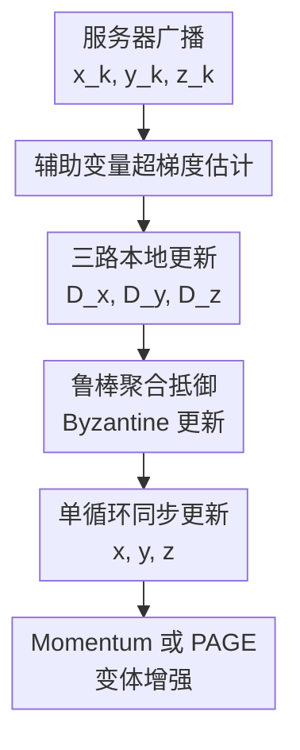

# Single-Loop Byzantine-Resilient Federated Bilevel Optimization

**会议**: ICLR 2026  
**OpenReview**: [https://openreview.net/forum?id=AzaE6Dcz1C](https://openreview.net/forum?id=AzaE6Dcz1C)  
**代码**: 无  
**领域**: 联邦双层优化 / 拜占庭鲁棒优化  
**关键词**: 联邦双层优化, 拜占庭鲁棒性, 单循环算法, 超梯度估计, 鲁棒聚合

## 一句话总结
这篇论文研究有拜占庭客户端时的联邦双层优化，先给出由上下层异质性共同决定的渐近误差下界，再提出单循环算法 BR-FedBi 及 Momentum/PAGE 变体，用辅助变量估计超梯度并结合鲁棒聚合，在理论上达到最优拜占庭鲁棒性或最优样本复杂度，实验上明显优于需要子循环的 BILANTINE。

## 研究背景与动机

**领域现状**：联邦双层优化（Federated Bilevel Optimization, FBO）把带层级结构的学习问题放到多客户端场景中，例如联邦元学习、超参数优化、模仿学习和联邦强化学习。典型形式是上层变量 $x$ 依赖下层最优解 $y^*(x)$，目标为 $\min_x \Phi(x)=\frac{1}{n}\sum_i f_i(x,y^*(x))$，其中 $y^*(x)$ 又来自下层问题 $\min_y \frac{1}{n}\sum_i g_i(x,y)$。这类问题的难点不只是分布式通信，还包括如何有效计算超梯度。

**现有痛点**：拜占庭鲁棒联邦学习已有很多 robust aggregation 方法，但大多服务于单层优化；直接搬到双层优化会遇到两个额外麻烦。第一，双层问题里的全局超梯度不是简单的本地超梯度平均，因为它包含全局 Hessian 逆向量积。第二，已有最相关方法 BILANTINE 依赖近似隐式微分（AID）和子循环计算，每轮要多次通信、反复交换梯度，在攻击者能观察并构造恶意更新时，通信越频繁也意味着暴露面越大。

**核心矛盾**：FBO 想要的是准确的全局超梯度，拜占庭鲁棒性想要的是在部分客户端任意作恶时仍能稳健聚合，而数据异质性又让 honest 客户端之间的梯度天然不一致。即使没有算法设计失误，异质性与攻击比例 $\alpha$ 也会带来不可消除的渐近误差；在双层结构里，这个误差不仅来自上层目标，还会通过下层解和 Hessian 项被放大。

**本文目标**：作者要回答两个问题：一是拜占庭攻击在联邦双层优化中造成的渐近误差下界到底是多少；二是能否设计一个不依赖重型子循环的单循环算法，既达到这个下界意义上的最优鲁棒性，又保持通信和样本效率。

**切入角度**：论文从 SOBA 类单循环双层优化出发，引入一个辅助变量 $z$ 来近似 Hessian-inverse-vector product，把原本难算的超梯度拆成三个可同步推进的变量更新：上层变量 $x$、下层变量 $y$、辅助线性系统变量 $z$。然后把每一类客户端上报的更新都交给满足 $(\alpha,c)$-robustness 的鲁棒聚合器，而不是让服务器信任普通平均。

**核心 idea**：用“$x/y/z$ 三变量单循环 + 鲁棒聚合”的方式替代“内层子循环 + 频繁超梯度通信”，并用 Momentum 消除方差相关的渐近误差，用 PAGE 进一步降低样本复杂度。

## 方法详解

### 整体框架

论文先形式化 honest clients 的双层目标：服务器希望最小化 $\Phi_H(x)=\frac{1}{|H|}\sum_{i\in H} f_i(x,y^*(x))$，其中 $y^*(x)$ 是 honest 下层目标 $g_H(x,y)=\frac{1}{|H|}\sum_{i\in H}g_i(x,y)$ 的最优解。系统中最多有比例 $\alpha<1/2$ 的客户端是 Byzantine attackers，它们可以观察 honest 梯度并向服务器发送任意向量。BR-FedBi 的每轮流程是：服务器广播 $(x_k,y_k,z_k)$，honest 客户端本地计算三类随机梯度/海森项组合，服务器分别对 $x$、$y$、$z$ 的更新做鲁棒聚合，再同时更新三个变量。

算法族有三个层次。BR-FedBi 是基础单循环算法，强调通信和计算效率，并在样本复杂度上随 honest 客户端数线性加速。BR-FedBiM 在此基础上加入 Polyak momentum，把渐近误差中的随机方差项压掉，从而匹配论文给出的拜占庭鲁棒下界。BR-FedBiP 用 PAGE 概率梯度估计降低方差，在均方平滑假设下达到一般随机双层优化里的最优样本复杂度 $O(\epsilon^{-1.5})$。

### 关键设计

**1. 辅助变量超梯度估计：把全局 Hessian 逆问题变成可联邦更新的 $z$ 变量**

双层优化的超梯度一般可以写成隐式微分形式：$\nabla \Phi_H(x)=\nabla_x f_H(x,y^*)-\nabla_{xy}g_H(x,y^*)[\nabla_{yy}g_H(x,y^*)]^{-1}\nabla_y f_H(x,y^*)$。问题在于，联邦场景下服务器拿不到 honest 全局 Hessian 的精确逆，而且拜占庭客户端会污染任何直接上报的超梯度。论文的处理是引入辅助变量 $z^*(x)$ 来近似 $-[\nabla_{yy}g_H(x,y)]^{-1}\nabla_y f_H(x,y)$，等价于解全局线性系统 $\nabla_{yy}g_H(x,y)z+\nabla_y f_H(x,y)=0$。

这样一来，超梯度可被改写为 $\frac{1}{|H|}\sum_{i\in H}\nabla_x f_i(x,y)+\nabla_{xy}g_H(x,y)z$。每个 honest 客户端只需计算三类本地量：$D_{x,i}=\nabla_{xy}G_i(x_k,y_k;\xi_i)z_k+\nabla_xF_i(x_k,y_k;\zeta_i)$，$D_{y,i}=\nabla_yG_i(x_k,y_k;\xi_i)$，$D_{z,i}=\nabla_{yy}G_i(x_k,y_k;\xi_i)z_k+\nabla_yF_i(x_k,y_k;\zeta_i)$。这三类量分别服务于上层变量、下层变量和线性系统变量，避免了 AID/ITD 那种每轮先把下层或线性系统“解到足够准”再更新上层的内循环。

**2. 三路鲁棒聚合：把拜占庭防御放到 $x/y/z$ 每个通道上**

在普通联邦学习里，鲁棒聚合通常只面对一类模型梯度；但这篇论文里的攻击者可以同时污染上层方向、下层方向和辅助变量方向。如果只保护 $x$ 的超梯度而放任 $y$ 或 $z$ 被污染，后续超梯度估计仍会被拖偏，因为 $y$ 决定下层近似解，$z$ 决定 Hessian 逆向量积。BR-FedBi 因此对 $D_x,D_y,D_z$ 分别调用鲁棒聚合规则 $AGG(\cdot)$，再执行 $x_{k+1}=x_k-\eta_x AGG(D_{x,1},...,D_{x,n})$、$y_{k+1}=y_k-\eta_y AGG(D_{y,1},...,D_{y,n})$、$z_{k+1}=z_k-\eta_z AGG(D_{z,1},...,D_{z,n})$。

论文的理论分析建立在 $(\alpha,c)$-robustness 标准上：当攻击者比例为 $\alpha$ 时，聚合输出与 honest 平均之间的偏差可由 honest 更新的离散程度控制，鲁棒系数 $c$ 刻画聚合器的强弱。这个抽象覆盖 Krum、Median、Trimmed Mean、CWMed、CWTM、RFA 等常见聚合器，因此算法不是绑定某个特定防御，而是给出一个可插拔的理论框架。对 $z$ 还额外做投影，把 $z_{k+1}$ 限制在半径 $R$ 的 $\ell_2$ ball 内，目的是保持线性系统近似和 $x/z$ 更新的有界性，方便收敛证明。

**3. 下界与 Momentum 匹配：区分“算法误差”和“不可消除误差”**

论文先证明了算法无关的下界：在满足基本平滑、强凸和方差假设的 FBO 问题中，只要存在拜占庭比例 $\alpha$ 和数据异质性，就总能构造实例让任意算法留下非零渐近误差。更一般的 $(\delta,B)$-dissimilarity 下界包含上层异质性项和下层梯度/Hessian 异质性项；在简化的 Assumption 4 下，Corollary 1 给出双层版本的不可消除误差阶，直观上形如 $\Omega(\alpha^2(\delta_f^2+\delta_g^2))$。这点很关键：BR-FedBi 系列不是声称能完全消除攻击影响，而是要把可消除的优化/方差误差压下去，剩下的正好是理论下界允许的部分。

基础 BR-FedBi 的收敛上界中还含有随机方差项；它在通信复杂度和线性加速上很漂亮，但未必达到最优拜占庭鲁棒性。BR-FedBiM 引入 Polyak momentum，对 $x/y/z$ 三路估计都维护动量，使历史信息平滑掉 stochastic gradient 的额外方差。论文证明 BR-FedBiM 的渐近项匹配 Corollary 1 的下界，因此达到 optimal Byzantine resilience；在无攻击或同质设置下，它也能恢复接近常规 FBO 的 $O(1/K)$ 收敛行为。

**4. PAGE 变体：用概率梯度估计换取最优样本复杂度**

BR-FedBiP 的目标不是单纯提高 worst-case 精度，而是把样本复杂度降到随机双层优化已知的最优量级。每轮服务器采样 Bernoulli 指示变量 $c_k\sim Be(p)$ 并广播给客户端：当 $c_k=1$ 时，客户端用较大 batch 重新计算 vanilla mini-batch 估计；当 $c_k=0$ 时，用小 batch 计算当前点与上一点的差分修正，即 $v_k=v_{k-1}+\nabla h(u_k;b)-\nabla h(u_{k-1};b)$ 这类 PAGE 更新，其中 $u_k=(x_k,y_k,z_k)$，$h$ 可以对应 $\nabla_xF,\nabla_yF,\nabla_yG,\nabla_{xy}Gz,\nabla_{yy}Gz$。

这个设计的意义是把“每轮都大 batch 降方差”的成本，换成“偶尔刷新 + 多数轮差分校正”。在均方平滑假设下，论文证明若选择合适的 $p,b,b'$，BR-FedBiP 可达到 $O(\epsilon^{-1.5})$ 样本复杂度，与一般期望型随机双层优化的最优复杂度一致。由于每轮仍然把三路 PAGE 估计送入鲁棒聚合，它没有牺牲拜占庭防御框架，只是在 honest 端降低估计方差。

### 一个完整示例

以联邦超表示学习为例，25 个客户端共同训练一个模型，其中 18 个 honest、7 个 Byzantine。每个客户端把训练集分成下层训练集和上层验证集：下层变量 $y$ 是最后一层分类器，上层变量 $x$ 是前面的表示网络参数。某轮开始时，服务器广播当前 $(x_k,y_k,z_k)$；honest 客户端用自己的训练 batch 计算 $\nabla_yG_i$ 和 Hessian-vector 项，用验证 batch 计算 $\nabla_xF_i$ 与 $\nabla_yF_i$；Byzantine 客户端则可能执行 ALIE、IPM、BF 或随机噪声攻击，故意发送偏离 honest 方向的 $D_x,D_y,D_z$。

服务器不会对 25 个向量做简单平均，而是对每个通道分别使用 Krum、Median、RFA、CWTM 或 CWMed 这样的聚合器。例如在 $x$ 通道，聚合器根据向量之间的几何关系或坐标统计量排除异常更新，得到稳健的上层方向；$y$ 通道推进最后一层分类器的下层最优近似；$z$ 通道推进 Hessian 逆向量积近似。这样 1 轮通信就同时前进三个子问题，而 BILANTINE 这类子循环方法要多次通信才能完成类似的内层求解和超梯度近似。

### 损失函数 / 训练策略

理论部分假设下层目标对 $y$ 强凸，梯度和 Hessian 满足 Lipschitz 条件，随机梯度/Hessian 无偏且方差有界，并用 gradient/Hessian dissimilarity 描述 honest 客户端间的异质性。BR-FedBi 的学习率满足 $\eta_y=c_y\eta_x$、$\eta_z=c_z\eta_x$ 这类耦合设置，保证 $x,y,z$ 三个时间尺度一起收敛。其通信复杂度为 $O(\epsilon^{-1})$，且在基础版本中样本复杂度可随 honest 客户端数量呈线性加速。

实验训练使用 SGD。MNIST 上采用 2-layer MLP，隐藏层 200，学习率约为 $\{\eta_y,\eta_z,\eta_x\}=\{0.1,0.02,0.01\}$；CIFAR-10 上采用两层卷积加两层全连接的 CNN，学习率约为 $\{0.1,0.05,0.03\}$。Momentum 系数设置为 $\{0.5,0.5,0.5\}$，PAGE 概率系数在主实现中使用 $p=0.5$，附录另一组 imbalanced loss tuning 任务中使用与理论选择匹配的 $p=0.2$。实验测试 4 类攻击：A Little is Enough（ALIE）、Inner Product Manipulation（IPM）、Bit Flipping（BF）和 Random Noise（RN），并覆盖 Krum、Median、Trimmed Mean、CWMed、CWTM、RFA 等聚合器。

## 实验关键数据

### 主实验

论文主要在 hyper-representation 任务上比较 BR-FedBi、BR-FedBiP、BR-FedBiM 与 BILANTINE。MNIST 使用异质数据；CIFAR-10 使用同质数据，且作者报告 BILANTINE 在 CIFAR-10 上经大量超参搜索仍无法收敛，因此 CIFAR-10 表只比较本文三种单循环方法。

| 数据集 / 设置 | 聚合器 | 方法 | ALIE | IPM | Worst | 结论 |
|--------|------|------|------|------|------|------|
| MNIST 异质 | Median | BILANTINE | 73.74 | 46.02 | 46.02 | 子循环基线在 IPM 下明显崩溃 |
| MNIST 异质 | Median | BR-FedBiP | 83.24 | 82.24 | 81.36 | 单循环 + PAGE 在多攻击下稳定 |
| MNIST 异质 | Median | BR-FedBiM | 79.53 | 82.51 | 79.53 | Momentum 变体 worst-case 明显高于基线 |
| MNIST 异质 | RFA | BILANTINE | 66.96 | 32.02 | 19.96 | RFA 下某些攻击使基线跌到接近失效 |
| MNIST 异质 | RFA | BR-FedBiM | 72.76 | 81.95 | 72.76 | Momentum 变体在 worst-case 上最高 |
| CIFAR-10 同质 | Median | BR-FedBi | 60.61 | 59.36 | 43.70 | 基础单循环受某些攻击影响更大 |
| CIFAR-10 同质 | Median | BR-FedBiP | 63.39 | 62.04 | 59.36 | PAGE 明显提高 worst-case |
| CIFAR-10 同质 | Median | BR-FedBiM | 63.12 | 62.68 | 62.67 | Momentum 变体在该聚合器下最稳 |

另一组 imbalanced-data loss tuning 实验也支持类似结论。以 MNIST 异质数据为例，在 RFA 聚合器下，BILANTINE 的 worst accuracy 为 19.96，而 BR-FedBi、BR-FedBiP、BR-FedBiM 分别达到 70.83、70.80、72.76；在 Median 聚合器下，BR-FedBiP 的 worst accuracy 为 81.36，而 BILANTINE 为 46.02。这说明收益不是单一聚合器或单一攻击类型造成的偶然现象。

### 消融实验

| 配置 / 分析项 | 关键指标 | 说明 |
|------|---------|------|
| BR-FedBi vs BILANTINE 通信 | 单循环每 epoch 约 3 次通信，子循环约 8 次通信 | 3 次分别对应 $x/y/z$ 三个变量更新，避免每轮内层子问题反复通信 |
| MNIST 200 epochs 总时间 | BILANTINE 约 6590-7701 秒；BR-FedBi 约 3102-3139 秒 | 单循环方法总 wall-clock time 大约减半 |
| MNIST ALIE 达到 50% top-1 | BILANTINE 常为 326-1073 秒；BR-FedBi 多数为 77-119 秒 | 早期收敛速度优势非常明显 |
| 攻击者数量变化 $f=3,5,7,10$ | 在 MNIST 异质 BF 攻击下，BR-FedBiM + CWMed 从 82.68/82.50/82.24 到 80.98 | 攻击者增多时 Momentum 变体仍保持高精度 |
| BR-FedBiP 样本复杂度 | 理论复杂度 $O(\epsilon^{-1.5})$ | PAGE 不是单纯经验 trick，而是服务于最优样本复杂度 |

### 关键发现

- BR-FedBi 系列最稳定的收益来自“单循环 + 三路鲁棒聚合”的结构性改变，而不是某个特定聚合器。论文测试了 Krum、Median、RFA、CWMed、CWTM、Trimmed Mean，整体趋势都指向单循环方法优于 BILANTINE。
- BR-FedBiM 在 worst-case accuracy 上经常最稳，和理论上消除方差相关渐近误差、达到最优拜占庭鲁棒性相吻合。CIFAR-10 上尤其明显，Median 聚合器下 BR-FedBiM 的 Worst 为 62.67，高于 BR-FedBiP 的 59.36 和 BR-FedBi 的 43.70。
- BR-FedBiP 的价值更偏样本效率和方差降低，在 MNIST Median/RFA 等设置里也能取得很好的 worst-case accuracy。它适合数据量大、随机梯度噪声明显的场景。
- BILANTINE 的主要弱点是子循环带来的通信与计算负担，且 CIFAR-10 上未能稳定收敛。这个结果支持论文的核心论点：在拜占庭场景里，少通信、少内循环不仅省时间，也会带来更稳的训练过程。

## 亮点与洞察

- **先给下界再给算法**：很多鲁棒联邦优化论文只展示一个防御算法，这篇先证明双层场景的不可消除误差下界，再说明 BR-FedBiM 的上界能匹配它。这样“最优拜占庭鲁棒性”不是口号，而是有下界支撑的 tightness 结论。
- **把双层超梯度拆成三个鲁棒通道**：$x/y/z$ 三变量设计很干净。它把下层求解、线性系统近似和上层超梯度放在同一个循环里推进，同时给每个通道独立上鲁棒聚合，避免某一个未防护通道成为攻击入口。
- **单循环在安全问题里也有意义**：单循环通常被理解为效率优化，但在拜占庭联邦学习中，减少子循环通信也减少了攻击者观察和污染训练过程的机会。论文把效率和鲁棒性放在同一个设计里，视角比较自然。
- **算法族分工明确**：BR-FedBi 解决基础效率和线性加速，BR-FedBiM 对准最优鲁棒下界，BR-FedBiP 对准最优样本复杂度。三个版本不是简单堆模块，而是各自对应理论目标。
- **可迁移到其他分布式双层任务**：只要任务能写成上层验证/目标与下层训练/适应问题，例如联邦元学习、个性化推荐超参、分布式表示学习，就可以考虑用 $z$ 辅助变量和三路鲁棒聚合来替代子循环超梯度计算。

## 局限与展望

- 理论收敛依赖较强的 gradient/Hessian dissimilarity 异质性假设。作者也承认，能否在更弱的 $(\delta,B)$-dissimilarity 假设下建立同样 tight 的上界仍是开放问题。
- 下层强凸假设对理论分析很重要，但深度模型最后一层以外的实际训练通常是非凸的。实验把最后 fully connected layer 作为下层变量，一定程度上贴合假设，但离通用深度双层任务还有距离。
- 实验任务集中在 hyper-representation 和 imbalanced-data loss tuning，数据集主要是 MNIST/CIFAR-10。对于更大规模联邦模型、更真实的非 IID 客户端划分、异步客户端掉线等系统问题，论文还没有覆盖。
- 鲁棒聚合器被作为可插拔组件处理，但不同聚合器在高维、强异质、攻击自适应场景下的鲁棒系数和实际性能差异很大。后续可以研究针对 $x/y/z$ 三个通道分别选择不同聚合器，而不是三路共用同一策略。
- PAGE 和 Momentum 变体都带来额外状态和超参，例如 $p$、batch size、动量系数。理论给了量级选择，但实际部署中还需要自动调参或自适应机制。

## 相关工作与启发

- **vs BILANTINE**: BILANTINE 是最接近的拜占庭鲁棒联邦双层优化方法，采用 AID/sub-loop 计算超梯度，每轮需要更多通信。本文用 SOBA 风格辅助变量做单循环更新，通信更少，并给出下界匹配的最优鲁棒性分析。
- **vs SOBA / SimFBO**: SOBA 及其联邦扩展关注单循环双层优化的效率，但不处理拜占庭攻击。本文把 SOBA 的 $z$ 辅助变量思想接入 robust aggregation，并分析异质性与攻击者共同造成的渐近误差。
- **vs Byzantine-robust single-level FL**: Krum、Median、RFA、CWTM 等方法通常防御单层梯度污染。本文说明双层问题的误差来源还包括下层目标和 Hessian 相关项，因此不能只把单层聚合器套在最终超梯度上。
- **vs NNM / Momentum Screening 等异质鲁棒学习**: 这些工作关心异质数据下的最优拜占庭鲁棒下界。本文把类似思想推进到双层结构，强调下层异质性也会进入下界和 breakdown 条件。
- **启发**: 对有嵌套结构的联邦学习问题，鲁棒性设计应当跟计算图结构对齐。哪里有状态会影响最终超梯度，哪里就应该有对应的鲁棒聚合和误差分析。

## 评分

- 新颖性: ⭐⭐⭐⭐⭐ 这是较早系统处理拜占庭鲁棒联邦双层优化下界、单循环算法和最优鲁棒性的工作，问题切得很准。
- 实验充分度: ⭐⭐⭐⭐ 覆盖多攻击、多聚合器、MNIST/CIFAR-10 和 wall-clock，但大规模真实联邦任务仍偏少。
- 写作质量: ⭐⭐⭐⭐ 理论主线清楚，算法族目标明确；部分公式在排版上较密，读者需要一定双层优化背景。
- 价值: ⭐⭐⭐⭐⭐ 对联邦元学习、超参优化和分布式双层学习的安全训练很有参考价值，尤其是 $x/y/z$ 三路鲁棒聚合这个框架可复用性强。

<!-- RELATED:START -->

## 相关论文

- [\[NeurIPS 2025\] A Single-Loop First-Order Algorithm for Linearly Constrained Bilevel Optimization](../../NeurIPS2025/optimization/a_single-loop_first-order_algorithm_for_linearly_constrained_bilevel_optimizatio.md)
- [\[ICLR 2026\] Byzantine-Robust Federated Learning with Learnable Aggregation Weights](byzantine-robust_federated_learning_with_learnable_aggregation_weights.md)
- [\[ICLR 2026\] Reducing Contextual Stochastic Bilevel Optimization via Structured Function Approximation](reducing_contextual_stochastic_bilevel_optimization_via_structured_function_appr.md)
- [\[ICLR 2026\] On the Surprising Effectiveness of a Single Global Merging in Decentralized Learning](on_the_surprising_effectiveness_of_a_single_global_merging_in_decentralized_lear.md)
- [\[ICML 2026\] Delayed Momentum Aggregation: Communication-efficient Byzantine-robust Federated Learning with Partial Participation](../../ICML2026/optimization/delayed_momentum_aggregation_communication-efficient_byzantine-robust_federated_.md)

<!-- RELATED:END -->
