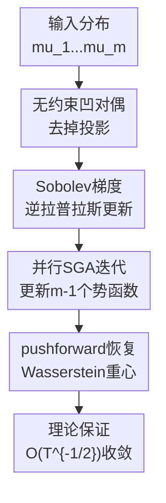

# Sobolev Gradient Ascent for Optimal Transport: Barycenter Optimization and Convergence Analysis

**会议**: ICLR 2026  
**OpenReview**: [https://openreview.net/forum?id=IjL1xEoxXi](https://openreview.net/forum?id=IjL1xEoxXi)  
**论文**: [OpenReview](https://openreview.net/forum?id=IjL1xEoxXi)  
**代码**: 补充材料  
**领域**: 最优传输 / 重心优化  
**关键词**: Wasserstein重心, Sobolev梯度上升, 无约束对偶, 精确最优传输, 收敛分析  

## 一句话总结

这篇论文把精确 Wasserstein barycenter 写成一个无约束的凹对偶问题，并在 $\dot H^1$ Sobolev 几何中直接做梯度上升，从而省掉昂贵的 $c$-concavity 投影，同时给出与经典非光滑凸优化同阶的全局 $O(T^{-1/2})$ 收敛保证。

## 研究背景与动机

**领域现状**：Wasserstein barycenter 是最优传输里对“平均”的自然推广：给定多个概率分布 $\mu_1,\ldots,\mu_m$ 和权重 $\alpha_i$，希望找到一个分布 $\nu$，让它到所有输入分布的加权二阶 Wasserstein 距离之和最小。这个概念在图像、形状、视频帧压缩、测度值聚类和可扩展 Bayesian inference 中都很有用，因为它能保留分布的几何结构，而不是只在欧氏向量空间里做逐坐标平均。

**现有痛点**：难点在于“精确 barycenter”很贵。线性规划形式理论上直接，但在大网格上时间和空间都吃不消；primal 侧的 Wasserstein gradient descent 每轮要算多个 OT map，边际分布一多就很重；multi-marginal OT 的 dual 形式避免了部分 primal 计算，却会引入 $O(m^2)$ 个约束；近年的 WDHA 能在 exact barycenter 上表现很好，但理论版本需要昂贵的凸/光滑投影，实际实现又把投影替成更便宜的 conjugate envelope，导致“可证明算法”和“真正运行的算法”之间存在落差。

**核心矛盾**：Kantorovich dual potential 通常要限制在 $c$-concave 函数上，否则传统推导会担心对偶可行性和收敛性；但把每一步都投影回 $c$-concave 集合又是算法复杂度和理论复杂度的主要来源。也就是说，现有 exact barycenter 方法被夹在两个要求之间：要保留 exact OT 的尖锐几何，又要避免为 dual feasibility 付出高代价。

**本文目标**：作者想回答一个很直接的问题：在 regular grid 上计算 2D/3D 精确 Wasserstein barycenter 时，能不能完全去掉 $c$-concavity projection，只保留一个简单的一阶 Sobolev gradient ascent，并且仍然证明它会全局收敛？这个目标拆开看有三层：先为 barycenter 找到一个无约束凹 dual；再写出可计算的 $\dot H^1$ 梯度；最后把非光滑凸优化里的 subgradient rate 搬到这个无限维 Sobolev 空间问题中。

**切入角度**：论文从二边际 OT 的一个观察切入：即使 potential $f$ 不是 $c$-concave，目标 $I(f)=\int f d\mu+\int f^c d\nu$ 的一阶变分仍然存在，而且梯度计算只依赖 $f^c$，而 $f^{ccc}=f^c$。这意味着 double $c$-transform 对梯度方向并没有改变，更多是在维护约束外观。作者把这个观察推广到 barycenter dual，于是把“每轮投影”改成“直接在无约束 dual 空间里上升”。

**核心 idea**：用无约束凹对偶 + Sobolev 逆拉普拉斯梯度，替代需要 $c$-concavity 投影的 barycenter dual optimization。

## 方法详解

### 整体框架

这篇论文的方法不是一个神经网络结构，而是一个优化问题重写和对应算法。输入是 $m$ 个定义在同一紧致区域 $\Omega$ 上、并在 regular grid 上离散化的概率密度 $\mu_1,\ldots,\mu_m$，输出是它们的精确 Wasserstein barycenter。核心流程是：先把 barycenter primal 目标改写成只含 $m-1$ 个 dual potentials 的无约束凹最大化问题；再对每个 potential 计算 $\dot H^1$ 梯度；每轮用 Poisson 方程的解做更新；最后用学到的 dual potential 诱导 pushforward measure，恢复 barycenter。

原始 barycenter 问题是

$$
B(\nu)=\sum_{i=1}^{m}\frac{\alpha_i}{2}W_2^2(\mu_i,\nu),
$$

需要在概率测度 $\nu$ 上做最小化。本文的关键改写是只保留 $f_1,\ldots,f_{m-1}$，并令

$$
f_{mix}=-\sum_{i=1}^{m-1}\frac{\alpha_i}{\alpha_m}f_i.
$$

于是 barycenter 被写成如下无约束 dual 最大化：

$$
D(f_1,\ldots,f_{m-1})=
\sum_{i=1}^{m-1}\alpha_i\int_{\Omega} f_i^c d\mu_i
+\alpha_m\int_{\Omega} f_{mix}^c d\mu_m.
$$

这里的“无约束”很重要：$f_i$ 不需要每轮被投影成 $c$-concave。作者证明 $D$ 对所有变量 jointly concave，并且在输入分布绝对连续时与 primal barycenter 问题强对偶。若 $(\tilde f_1,\ldots,\tilde f_{m-1})$ 是最优解，则 barycenter 可以由任意一个边际的 pushforward 得到：

$$
\tilde\nu=(T_{\tilde f_i^c})_\#\mu_i=(T_{\tilde f_{mix}^c})_\#\mu_m.
$$

### 关键设计

**1. 无约束凹对偶：把 barycenter 从“测度最小化”转成“势函数最大化”**

传统 exact barycenter 计算常在 primal 测度空间里处理 $\nu$，或者在 dual 空间里维护一堆可行性约束。本文的第一步是把所有对 barycenter measure 的依赖压进 $c$-transform 里，只优化 $m-1$ 个 potential。这个改写的漂亮之处在于，最后一个 potential 不是独立变量，而是由 $f_{mix}=-\sum_i(\alpha_i/\alpha_m)f_i$ 自动补齐，使所有边际在同一个 barycenter 上对齐。

这个形式直接继承了 Kantorovich dual 的几何含义：$f_i^c$ 诱导从 $\mu_i$ 到 barycenter 的 transport map，$f_{mix}^c$ 负责第 $m$ 个边际。作者进一步证明 $D$ 是 jointly concave，并且最优值等于 primal 的 $\min_\nu B(\nu)$。因此算法不是在求某个正则化近似，也不是在求一个经验 heuristic，而是在解 exact Wasserstein barycenter 的一个等价凹 dual。

**2. 去掉 $c$-concavity 投影：利用 $f^{ccc}=f^c$ 保持梯度不变**

很多 OT dual 算法会在梯度步后做 double $c$-transform，即 $f\leftarrow f^{cc}$，目的是把 potential 拉回 $c$-concave 类。问题在于这个操作并不是 $\dot H^1$ 意义下的正交投影，所以它不能像普通投影梯度法那样自然给出 $\|f^{cc}-g\|\le \|f-g\|$ 之类的收缩性质；理论证明因此变得别扭，计算上也多了一步昂贵操作。

本文的观察是：梯度只依赖 $f^c$，而对任意连续 $f$ 有 $f^{ccc}=f^c$。换句话说，先把 $f$ 做成 $f^{cc}$ 再算梯度，和直接用原来的 $f$ 算梯度，在关键的 $c$-transform 部分是一致的。于是作者干脆把约束拿掉，直接优化连续函数上的 relaxed dual，并利用强对偶证明这样不会改变最优值。这一步是全文最关键的算法简化：它把“投影保持可行”改成了“对偶本身无约束且可证明”。

**3. Sobolev梯度：用 Poisson 方程把测度残差变成平滑更新方向**

普通 $L^2$ 梯度在 OT 这类问题上通常数值不稳定，因为残差是两个 pushforward 密度之差，局部尖峰和网格噪声会直接进入更新。本文沿用 Jacobs 与 Léger 的 $\dot H^1$ 几何，把 first variation 通过 Riesz representation 转成 Sobolev 梯度。对于二边际 OT，梯度由 Neumann Poisson 问题给出：

$$
-\Delta g=\mu-(T_{f^c})_\#\nu,
\qquad \frac{\partial g}{\partial n}=0.
$$

在 barycenter dual 里，对第 $i$ 个 potential 的 first variation 是

$$
\delta D_{f_i}=-\alpha_i\left((T_{f_i^c})_\#\mu_i-(T_{f_{mix}^c})_\#\mu_m\right),
$$

因此 Sobolev 梯度就是

$$
\nabla_{f_i}D=(-\Delta)^{-1}\delta D_{f_i}.
$$

直观上，它在比较“第 $i$ 个边际推到当前 barycenter 的结果”和“第 $m$ 个边际通过 mixed potential 推到当前 barycenter 的结果”，两者不一致的地方就是该 potential 应该调整的方向。逆拉普拉斯相当于对残差做 Sobolev 平滑，让更新方向更符合 transport potential 的几何结构。

**4. 全局收敛分析：把非光滑 subgradient rate 搬到 barycenter dual**

SGA 的迭代本身非常朴素：每一轮对所有 $i=1,\ldots,m-1$ 并行更新

$$
f_i^{(t)}=f_i^{(t-1)}+\eta_{t-1}\nabla_{f_i}D(f_1^{(t-1)},\ldots,f_{m-1}^{(t-1)}).
$$

难点不在写出这行更新，而在证明没有投影以后它不会跑偏。作者把 $D$ 看成定义在乘积 Hilbert 空间 $(\dot H^1)^{m-1}$ 上的 concave functional，然后沿用非光滑凸优化里 subgradient descent 的望远镜式分析。只要迭代轨迹保持连续，并且 Sobolev 梯度范数被 $M$ 控制，就可以得到 best iterate 的 dual gap 上界。

当总迭代轮数 $T$ 预先固定、步长取常数 $\eta\propto 1/(M\sqrt T)$ 时，论文得到

$$
D(\tilde f)-D(f^{best})\le
M\left(\sum_{i=1}^{m-1}\|f_i^{(0)}-\tilde f_i\|_{\dot H^1}^2\right)^{1/2}\frac{1}{\sqrt T}.
$$

如果不知道 $T$，用 $\eta_t\propto 1/\sqrt t$，则多一个 $\log T$ 因子。这个结果的意义是，本文不是只报告“无投影在实验里能跑”，而是证明了无投影版本在 exact barycenter dual 上仍有全局收敛率，并且常数步长情形与经典 Euclidean 非光滑凸优化的最优阶一致。

### 一个完整示例

可以把 2D synthetic 实验看成一个具体流程。输入是 4 个支撑在不同形状上的二维密度，每个密度离散在 $1024\times1024$ 网格上，并给定一组权重，比如 $(1/4,1/6,1/4,1/3)$。传统 exact 方法要么从 barycenter measure 侧迭代并反复求 OT map，要么像 WDHA 那样在 dual 更新之外还维护 projection 或 envelope 操作。

SGA 的做法更直接：初始化 $f_1,f_2,f_3$，第 4 个 potential 由 $f_{mix}=-(\alpha_1f_1+\alpha_2f_2+\alpha_3f_3)/\alpha_4$ 得到；每轮分别计算 $(T_{f_i^c})_\#\mu_i$ 与 $(T_{f_{mix}^c})_\#\mu_4$ 的差异；解 3 个 Poisson 方程得到 Sobolev 梯度；再并行更新这 3 个 potential。300 轮后，用这些 potential 诱导出的 pushforward measure 就是 barycenter 估计。

这个例子能看出本文算法为什么简洁：每轮的重操作主要是 fast $c$-transform、pushforward 和 FFT-based Poisson solver，复杂度是 $O(mn\log n)$，其中 $n$ 是网格大小；没有额外的 $c$-concavity projection，也没有 $O(m^2)$ 约束图结构。实验里同样 300 轮，SGA 既得到更小的 barycenter functional value，也比 WDHA、CWB、DSB 更快。

### 损失函数 / 训练策略

本文没有神经网络训练损失，优化目标就是 barycenter 的无约束 dual functional $D$。实现上，每轮需要三件事：先通过 fast $c$-transform 得到 $f_i^c$ 和 $f_{mix}^c$；再用诱导 map $T_h=id-\nabla h$ 计算 pushforward density；最后解 Neumann Poisson 方程得到 $\dot H^1$ 梯度。

论文分析了两类步长。若总轮数 $T$ 已知，理论上常数步长对应最干净的 $O(T^{-1/2})$ 上界，实验中 2D synthetic 使用 $\eta_t=0.1$。若 $T$ 不预先固定，可以用 annealing 步长，例如 $\eta_t=0.5/\sqrt t$ 或 3D 插值里的 $\eta_t=5\times10^{-3}/\sqrt t$，但理论上会多一个 $\log T$ 因子。附录还给了 SGA-AdaGrad 变体，在手写数字实验中表现与 SGA 几乎一致。

## 实验关键数据

### 主实验

| 场景 | 指标 | SGA | WDHA | CWB | DSB |
|------|------|-----|------|-----|-----|
| 2D synthetic, 权重 $(2/3,0,0,1/3)$ | barycenter value $\times10^3$ ↓ | **3.917** | 3.940 | 4.202 | 3.926 |
| 2D synthetic, 权重 $(1/3,1/4,1/6,1/4)$ | barycenter value $\times10^3$ ↓ | **5.923** | 5.952 | 6.153 | 5.936 |
| 2D synthetic, 权重 $(0,0,1/3,2/3)$ | barycenter value $\times10^3$ ↓ | **1.646** | 1.649 | 1.821 | 1.648 |
| 手写数字 2, 10 张 $500\times500$ 图像 | barycenter value ↓ | **$5.992\times10^{-3}$** | $6.049\times10^{-3}$ | $6.463\times10^{-3}$ | $6.021\times10^{-3}$ |
| Gaussian 截断分布 | 到真值 barycenter 的 $W_2^2$ ↓ | **0.4636** | 20.3449 | 21.7867 | 0.4925 |

| 场景 | 指标 | SGA | WDHA | CWB | DSB |
|------|------|-----|------|-----|-----|
| 2D synthetic, 权重 $(2/3,0,0,1/3)$ | 时间秒数 ↓ | **298** | 625 | 1346 | 3643 |
| 2D synthetic, 权重 $(1/3,0,0,2/3)$ | 时间秒数 ↓ | **221** | 569 | 1328 | 3679 |
| 2D synthetic, 权重 $(1/3,1/4,1/6,1/4)$ | 时间秒数 ↓ | **700** | 1064 | 2290 | 5003 |
| 手写数字 2 | 时间秒数 ↓ | **406** | 415 | 430 | 670 |
| Gaussian 截断分布 | barycenter functional ↓ | 89.0074 | 102.0016 | 109.4954 | 89.0247 |

### 消融实验

| 配置 | 关键指标 | 说明 |
|------|---------|------|
| SGA parallel, 常数步长 | 2D synthetic 多数组合均为最低 barycenter value | 主算法；并行更新所有 $m-1$ 个 potential，理论收敛结论直接覆盖 |
| SGA annealing, $\eta_t=0.5/\sqrt t$ | 权重 $(1/4,1/6,1/4,1/3)$ 下 value 为 5.288，优于 WDHA 的 5.323 | 不需要预设总轮数，但理论上有额外 $\log T$；固定 300 轮时有些视觉结果尚未完全收敛 |
| SGA-AdaGrad | 手写数字 value $5.992\times10^{-3}$，时间 409 秒 | 自适应步长版本；和常数步长 SGA 几乎同精度，但没有成为主理论对象 |
| WDHA | 3D ball-cube 插值在相同步长设置下发散 | 说明去掉投影后的 SGA 并没有牺牲稳定性，反而在该 3D 设置里更稳 |
| 二边际 SGA 的残差诊断 $r_t$ | 多个 pair 从 $t=100$ 到 $t=300$ 持续下降 | 附录用 $\|\mu-(T_{f^c})_\#\nu\|_{\dot H^{-1}}$ 支持梯度有界和收敛趋势 |

### 关键发现

- SGA 在 2D synthetic 的 12 组权重实验里几乎都取得最小 barycenter functional value，同时通常只需要 WDHA 大约一半的时间、CWB 三分之一左右的时间、DSB 七分之一左右的时间。
- 在视觉质量上，SGA 和 WDHA 作为 exact 方法都比 entropic CWB/DSB 更锐利；差别主要体现在 SGA 更简单、更快，并且有全局收敛证明。
- 3D ball-cube 插值中 POT 的 2D barycenter 工具不可用，SGA 仍能在 $200\times200\times200$ 网格上运行；同一设置下 WDHA 发散，凸显 SGA 的数值稳定性。
- 真实视频帧压缩实验里，SGA 得到的 barycenter 同时保留移动目标轨迹和较清晰的静态背景，比几种对比方法更像一个可用的“视频摘要”。
- Gaussian 实验有解析真值，SGA 到真 barycenter 的 $W_2^2$ 误差最低，并且学到的 optimal map 相对 $L^2$ 误差也低于 WDHA。

## 亮点与洞察

- 这篇论文最亮的地方是把“去投影”从工程 trick 变成了理论对象。很多算法会先在实现里偷懒省掉昂贵步骤，再事后解释经验效果；本文反过来重写 dual，使省掉 projection 后的算法本身就是可证明的。
- Sobolev 梯度的使用很自然也很关键。它不是随便换一个优化器，而是用 Poisson 方程把 pushforward residual 转成 potential 的平滑更新方向，既匹配 OT 几何，又能用 FFT 在 regular grid 上高效求解。
- 理论贡献和算法贡献咬合得很好。无约束凹 dual 提供算法简化，joint concavity 和 strong duality 保证没有换问题，Hilbert 空间中的 subgradient 分析给出全局 rate；这三件事缺一件，论文说服力都会弱很多。
- 对 exact barycenter 社区来说，这篇论文给了一个很有启发的思路：有些看似必须维护的 dual feasibility 约束，可能可以通过选择更合适的对偶表达被整体吸收，而不是每轮靠投影修补。

## 局限与展望

- SGA 主要面向 2D/3D regular grid 上的密度。网格大小随维度指数增长，所以它并没有解决高维分布 barycenter 的 curse of dimensionality。
- 论文依赖 fast $c$-transform、FFT-based Poisson solver 和 regular grid 上的 pushforward 计算。若换成非均匀网格，需要分别替换为 parametric Legendre transform、多重网格 Poisson solver 和更复杂的 Jacobian 处理，成本会明显上升。
- 收敛定理需要迭代轨迹连续、梯度范数有界等假设。作者给了合理解释和经验诊断，但这些条件在实际离散化实现中如何系统验证，仍然是理论和数值分析之间的缝隙。
- 实验集中在二维图像、三维几何插值、视频帧和 Gaussian sanity check。对于更复杂的真实 3D point cloud、医学体数据或大规模多边际场景，还需要更充分的工程评估。
- 后续可以探索两条路线：一是把 SGA 和 multigrid / adaptive mesh 结合，扩展到非均匀网格；二是把无约束 dual 思路迁移到 signed barycenter、partial OT barycenter 或其他非正则化 OT 聚合问题。

## 相关工作与启发

- **vs 线性规划 barycenter**: LP 直接求 exact barycenter，优点是问题形式清楚，缺点是大网格上复杂度太高。SGA 保留 exact 目标，但把计算压到 $O(mn\log n)$ 每轮，更适合 2D/3D 高分辨率网格。
- **vs primal Wasserstein gradient descent**: primal 方法直接在 barycenter measure 上更新，通常每轮要算多个 OT map。SGA 完全在 dual potential 上工作，通过 pushforward residual 对齐不同边际，避免了反复显式求完整 OT map 的负担。
- **vs WDHA**: WDHA 也是 exact barycenter 的强基线，并结合 primal-dual 结构；但其理论算法含投影，实际算法用替代 envelope。SGA 的优势是结构更单纯，理论和实现更一致，同时实验中更快、更稳。
- **vs CWB / DSB 等 entropic barycenter**: entropic 方法可扩展、实现成熟，但求的是正则化近似，视觉上容易更平滑。SGA 追求 exact barycenter，因此在需要高精度、锐利几何细节的应用里更有吸引力。
- **vs Jacobs & Léger 的二边际 Sobolev OT**: 本文借鉴了 $\dot H^1$ gradient 的数值稳定性，但把它从二边际 OT 推到 multi-distribution barycenter，并给出新的无约束 barycenter dual 和全局收敛分析。

## 评分

- 新颖性: ⭐⭐⭐⭐⭐ 无约束凹 barycenter dual 加去投影 SGA 是很干净的理论和算法组合。
- 实验充分度: ⭐⭐⭐⭐ 覆盖 synthetic、3D、真实视频、手写数字和 Gaussian 真值，但更大规模真实 3D 应用还可以继续加强。
- 写作质量: ⭐⭐⭐⭐ 论文主线清楚，定理和算法对应紧密；部分证明与符号对非 OT 读者门槛较高。
- 价值: ⭐⭐⭐⭐⭐ 对 exact Wasserstein barycenter 计算很有价值，尤其适合需要高精度几何平均而又不能接受 entropic blur 的场景。

<!-- RELATED:START -->

## 相关论文

- [\[ICLR 2026\] A Convergence Analysis of Adaptive Optimizers under Floating-Point Quantization](a_convergence_analysis_of_adaptive_optimizers_under_floating-point_quantization.md)
- [\[ICLR 2026\] HOTA: Hamiltonian Framework for Optimal Transport Advection](hota_hamiltonian_framework_for_optimal_transport_advection.md)
- [\[ICLR 2026\] Neural Optimal Transport Meets Multivariate Conformal Prediction](neural_optimal_transport_meets_multivariate_conformal_prediction.md)
- [\[ICLR 2026\] Elastic Optimal Transport: Theory, Application, and Empirical Evaluation](elastic_optimal_transport_theory_application_and_empirical_evaluation.md)
- [\[ICLR 2026\] Hyperparameter Trajectory Inference with Conditional Lagrangian Optimal Transport](hyperparameter_trajectory_inference_with_conditional_lagrangian_optimal_transpor.md)

<!-- RELATED:END -->
