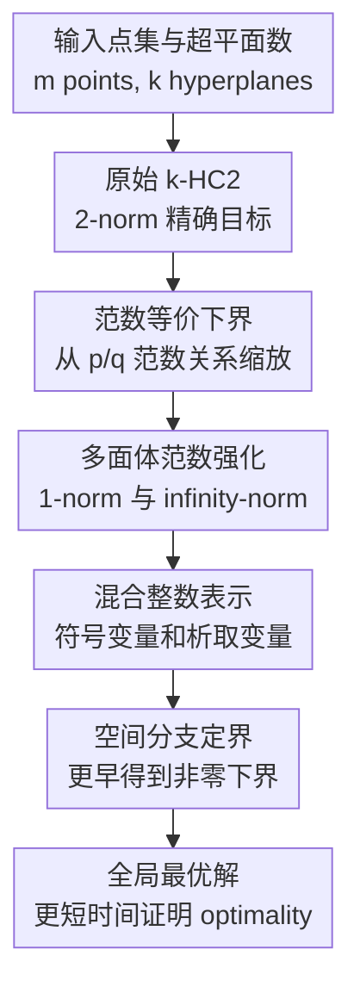

# Solving the 2-norm k-hyperplane clustering problem via multi-norm formulations

**会议**: ICLR 2026  
**OpenReview**: [https://openreview.net/forum?id=VJAqqtVXfD](https://openreview.net/forum?id=VJAqqtVXfD)  
**代码**: https://github.com/stefanoconiglio/khc-multinorm  
**领域**: 优化 / 聚类  
**关键词**: k-超平面聚类, 全局优化, 空间分支定界, 多范数松弛, 混合整数规划  

## 一句话总结

这篇论文把 2-norm k-超平面聚类的非凸精确求解问题，转化为一个由 2-norm、1-norm 和 $\infty$-norm 约束共同强化的多范数混合整数模型，使空间分支定界更早得到非零下界，并在 LowDim/HighDim 基准上把中位求解时间最高加速约 $41\times$。

## 研究背景与动机

**领域现状**：k-Hyperplane Clustering（k-HC）要用 $k$ 个超平面拟合一组点，每个点被分配给离它最近的超平面。它可以看作 k-means 的“中心点”被替换成“线/平面/超平面”，常见于线面检测、分段仿射模型拟合、PCA/稀疏成分分析、LiDAR 几何结构识别等场景。经典 k-HC2 使用欧氏距离，也就是点到超平面的 2-norm 距离，因为这种距离对数据旋转不敏感，几何意义最自然。

**现有痛点**：问题难点不在于写出目标函数，而在于把它全局求解。给定超平面 $H_j=\{x\in\mathbb{R}^n:x^\top w_j=\gamma_j\}$ 后，点 $a_i$ 到该超平面的 2-norm 距离包含 $|a_i^\top w_j-\gamma_j|/\|w_j\|_2$。分母里的 $w_j$ 让模型非凸，且当 $w_j=0$ 时表达式退化。已有 MI-QCQP 精确模型可以描述这个问题，但交给空间分支定界（SBB）求全局最优时，下界长期停在 0，分支树很难剪枝。

**核心矛盾**：2-norm 是几何上最想要的距离，但 2-norm 约束 $\|w_j\|_2\ge 1$ 的可行域补集是球形结构。用常见的凸包/McCormick 外逼近做 SBB 时，根节点会把 $w_j=0$ 也包含进松弛里，于是目标 $\sum_i d_i^2$ 可以取 0。换句话说，模型的几何表达很自然，但它给求解器的初始松弛太弱。

**本文目标**：作者不是提出一个更快的启发式，而是要保留 k-HC2 的欧氏距离目标，同时让精确求解器更快证明全局最优。具体目标包括：构造合法的强化 formulation；证明强化约束来自其他范数时仍然是原问题的有效松弛/下界；分析何时可以在线性或多项式数量的 SBB 节点内得到非零下界；最后验证这些理论强化能否在真实求解器中转化为明显加速。

**切入角度**：关键观察是点到超平面的 $p$-norm 距离由 $w$ 的对偶范数控制。虽然目标要解的是 2-norm 版本，但 1-norm 和 $\infty$-norm 的约束具有多面体结构，可以用混合整数线性方式表达。作者利用不同范数之间的等价不等式，把这些多面体范数约束作为 2-norm 模型的有效强化项，而不是直接把问题改成另一个距离度量。

**核心 idea**：用经过缩放的 1-norm / $\infty$-norm formulation 为 2-norm k-HC2 增加多面体范数约束，让 SBB 在保留原始欧氏聚类目标的同时拥有更强的下界和更可分支的几何结构。

## 方法详解

### 整体框架

这篇论文的流程可以理解为“先从范数等价关系拿到合法下界，再把下界对应的多面体约束塞回原始 2-norm 精确模型”。输入是 $m$ 个点 $a_i\in\mathbb{R}^n$ 和超平面数量 $k$；输出不是一个近似聚类，而是带全局最优证书的 k-HC2 解。真正变化发生在 formulation 层：原始模型仍保留 $\|w_j\|_2\ge 1$，但额外加入 $\|w_j\|_1\ge 1$、$\|w_j\|_\infty\ge 1/\sqrt{n}$ 或二者同时加入，从而改变 SBB 松弛的几何形状。

具体说，作者先定义广义问题 $k\text{-}HC(p,c)$：它仍最小化每个点到最近超平面的平方残差，但约束从 $\|w_j\|_2\ge 1$ 扩展为 $\|w_j\|_{p'}^2\ge c$，其中 $p'$ 是 $p$ 的对偶范数。随后证明不同 $p$ 与 $q$ 的版本之间可以通过缩放常数形成目标值下界。对本文最重要的情形是 $q=1$ 和 $q=\infty$，因为它们对应的对偶约束分别是 $\|w_j\|_\infty$ 或 $\|w_j\|_1$ 类型，能够用混合整数线性结构刻画。

### 关键设计

**1. 范数缩放下界：把“换范数”变成可证明的松弛**

作者没有简单地说“1-norm 更好算，所以改用 1-norm”。那样会改变问题本身，也无法保证解出的东西和 k-HC2 有什么关系。本文先建立一个一般性定理：若两个范数满足 $\alpha(p,q)\|x\|_p\le \beta(p,q)\|x\|_q\le \delta(p,q)\|x\|_p$，那么适当缩放后的 $k\text{-}HC(q,c')$ 的最优值会落在 $k\text{-}HC(p,c)$ 的下方，并且有明确的乘性近似因子。

这个结论的实际作用是给 formulation 强化提供“合法性证明”。当目标问题是 $k\text{-}HC(2,1)$ 时，作者可以放心使用 $k\text{-}HC(\infty,1)$ 和 $k\text{-}HC(1,1/\sqrt{n})$ 产生的约束，因为它们对应的 feasible region 是 2-norm 约束的松弛，目标值也是原问题目标值的下界。对单个 1-norm 或 $\infty$-norm 松弛，论文给出 $\frac{1}{n}OPT(k\text{-}HC(2,1))\le OPT(\cdot)\le OPT(k\text{-}HC(2,1))$；这说明强化约束不是拍脑袋加的，而是有明确近似含义。

**2. 多范数 relaxation：同时利用 1-norm 与 $\infty$-norm 的几何互补性**

单独加入 $\|w_j\|_1\ge 1$ 或 $\|w_j\|_\infty\ge 1/\sqrt{n}$ 都是有效松弛，但二者刻画的外部区域形状不同。本文进一步把二者同时施加，得到 $k\text{-}HC(multi,1)$：

$$
\|w_j\|_1\ge 1,\qquad \|w_j\|_\infty\ge \frac{1}{\sqrt n},\qquad j\in[k].
$$

这等价于要求 $\|w_j\|_{multi}=\min\{\|w_j\|_1,\sqrt n\|w_j\|_\infty\}\ge 1$。难点在于 $\|\cdot\|_{multi}$ 不是普通 $p$-norm，不能直接套用前面的定理。作者为此构造了隐含距离 $\max\{d_\infty(a_i,H_j),\frac{1}{\sqrt n}d_1(a_i,H_j)\}$，并证明它由范数 $\max\{\|x\|_\infty,\frac{1}{\sqrt n}\|x\|_1\}$ 诱导，再通过新的 congruence inequality 得到 $\frac{1}{\sqrt n}OPT(k\text{-}HC(2,1))\le OPT(k\text{-}HC(multi,1))\le OPT(k\text{-}HC(2,1))$。这个因子比单个松弛的 $1/n$ 更强，说明多范数组合在理论下界上确实更紧。

**3. 多面体约束的 MILP 表示：让求解器能沿着正确变量分支**

理论松弛只有能被求解器有效利用才有价值。对 $\|w_j\|_1\ge 1$，作者引入 $w^+_{jh}$、$w^-_{jh}$ 和二进制符号变量 $s_{jh}$，用 $w^+_{jh}-w^-_{jh}=w_{jh}$ 表示正负部分，并通过 $w^+_{jh}\le s_{jh}$、$w^-_{jh}\le 1-s_{jh}$ 保证二者互斥，最后用 $\sum_h(w^+_{jh}+w^-_{jh})\ge 1$ 表达 1-norm 下界。

对 $\|w_j\|_\infty\ge 1/\sqrt n$，作者把它写成“至少一个坐标幅值足够大”的析取结构。利用符号对称性，论文选择一侧析取，用二进制变量 $u_{jh}$ 表示第 $h$ 个坐标被选中，并加入 $\sum_h u_{jh}=1$。这样如果某个 $u_{jh}=1$，对应的 $w_{jh}\ge 1/\sqrt n$ 会被激活。这个设计的妙处在于它不仅强化了根节点松弛，还给 SBB 一个非常清楚的离散分支入口：先分支这些符号/坐标选择变量，就能更快排除 $w=0$ 这类导致零下界的伪解。

**4. SBB 节点复杂度分析：解释为什么 $\infty$-norm 强化常常最快**

原始 2-norm formulation 的核心缺陷是，基于凸包外逼近的 SBB 在很长一段时间里无法把 $w_j=0$ 从松弛中排除。论文在常见 midpoint branching 假设下证明，求解原始 $k\text{-}HC(2,1)$ 至少要生成 $2^{k(n-1)}$ 个分支节点后才得到非零下界；在此之前目标下界都是 0，基本无法剪枝。

加入多面体范数后，几何结构发生变化。若施加 $\|w_j\|_1\ge 1$ 并先在 $s_{jh}$ 上分支，完整描述这些 1-norm 多面体约束仍有指数级结构，但叶节点已经满足多面体约束，不再像 2-norm 球那样依赖求解器容差慢慢逼近。更关键的是 $\|w_j\|_\infty\ge 1/\sqrt n$：若先在 $u_{jh}$ 上分支，只需 $k(n-1)$ 个节点就足以得到非零下界。这个线性节点数解释了实验里 $(k\text{-}HC(2,1),(1,1/\sqrt n))$ 经常比 multi 版本还快：multi 虽然下界更紧，但多了 1-norm 相关分支和变量，求解开销可能抵消一部分收益。

### 一个完整示例

假设有一组三维点需要用 $k=2$ 个平面拟合。原始 k-HC2 会为每个平面学习 $w_1,w_2$ 和 $\gamma_1,\gamma_2$，并用二进制变量 $x_{ij}$ 决定点 $a_i$ 分给哪个平面。目标是最小化所有点的平方距离 $\sum_i d_i^2$，但只靠 $\|w_j\|_2\ge 1$ 时，SBB 根节点的凸松弛可能允许 $w_1=w_2=0$，从而得到一个没有意义的 0 下界。

本文的强化做法会额外要求每个 $w_j$ 至少满足一种可离散化的“足够大”条件。若采用 $\infty$-norm 强化，在 $n=3$ 时每个平面会有三个选择变量 $u_{j1},u_{j2},u_{j3}$，表示哪个坐标必须达到 $1/\sqrt 3$。SBB 先决定这些 $u$ 变量，相当于快速把“法向量至少有一个坐标足够大”这件事固定下来。这样 $w_j=0$ 不再能混在松弛里骗出 0 下界，后续的连续变量分支才有剪枝价值。

### 损失函数 / 训练策略

这篇论文没有神经网络训练，所谓“损失”就是混合整数优化目标：

$$
\min \sum_{i=1}^{m} d_i^2.
$$

其中 $x_{ij}\in\{0,1\}$ 表示点 $a_i$ 是否分给第 $j$ 个超平面，约束 $\sum_j x_{ij}=1$ 保证每个点只分给一个超平面。距离变量 $d_i$ 通过 big-M 型不等式绑定到被选中的超平面：当 $x_{ij}=1$ 时，$d_i$ 至少覆盖 $|a_i^\top w_j-\gamma_j|$；当 $x_{ij}=0$ 时，用上界 $d^U$ 放松该超平面的距离约束。

求解策略是使用 Gurobi 10 的空间分支定界，时间上限为跨 12 个线程总计 168000 秒，硬件为 2.6GHz Intel Core i7-9750H、32GB RAM。论文比较四个 formulation：原始 $(k\text{-}HC(2,1))$，加入 $\infty$-norm 对应约束的 $(k\text{-}HC(2,1),(1,1/\sqrt n))$，加入 1-norm 对应约束的 $(k\text{-}HC(2,1),(\infty,1))$，以及同时加入二者的 $(k\text{-}HC(multi,1))$。

## 实验关键数据

### 主实验

论文在两个合成基准上评估：LowDim 主要覆盖低维线/平面聚类设置，HighDim 覆盖维度或簇数更高的实例。下表来自所有四个 formulation 都成功求解的实例子集，因此比较的是同一批问题上的中位时间和相对加速。

| 数据集 | formulation | 中位时间(s) | 相对原始模型加速 | 显著性 |
|--------|-------------|-------------|------------------|--------|
| LowDim | $(k\text{-}HC(2,1))$ | 169.9 | $1\times$ | - |
| LowDim | $(k\text{-}HC(2,1),(1,1/\sqrt n))$ | 4.15 | $40.9\times$ | $1.1\times 10^{-4}$ |
| LowDim | $(k\text{-}HC(2,1),(\infty,1))$ | 6.10 | $27.9\times$ | $1.1\times 10^{-4}$ |
| LowDim | $(k\text{-}HC(multi,1))$ | 5.00 | $34.0\times$ | $1.1\times 10^{-4}$ |
| HighDim | $(k\text{-}HC(2,1))$ | 208.6 | $1\times$ | - |
| HighDim | $(k\text{-}HC(2,1),(1,1/\sqrt n))$ | 18.20 | $11.5\times$ | $5.6\times 10^{-9}$ |
| HighDim | $(k\text{-}HC(2,1),(\infty,1))$ | 20.65 | $10.1\times$ | $7.5\times 10^{-9}$ |
| HighDim | $(k\text{-}HC(multi,1))$ | 37.35 | $5.6\times$ | $8.7\times 10^{-4}$ |

更细的求解数量也很关键。LowDim 上，三个强化 formulation 能把 21 个原始模型超过 46 小时仍未解出的实例压到 2 小时以内；对所有四者都能解出的 20 个实例，速度分别约为 41、28、34 倍。HighDim 上，最佳强化 formulation 比原始模型多解出 10 个实例。

### 消融实验

这里的“消融”不是删除神经网络模块，而是比较不同范数约束对求解器行为的贡献。原文的 HighDim 节点统计显示，强化约束确实减少了 SBB 树规模，而不仅是偶然加快了某些实例。

| 配置 | HighDim 求解数 | HighDim 平均 SBB 节点数 | 说明 |
|------|---------------|-------------------------|------|
| 原始 $(k\text{-}HC(2,1))$ | 31 | 7,987,723.07 | 只靠 2-norm 约束，早期下界弱 |
| 加 $\infty$-norm 对应约束 $(1,1/\sqrt n)$ | 41 | 3,201,881.49 | 求解数最多，节点数明显下降 |
| 加 1-norm 对应约束 $(\infty,1)$ | 40 | 2,741,496.67 | 平均节点数最低，速度也稳定提升 |
| multi-norm 同时加入二者 | 37 | 4,632,264.51 | 下界理论更紧，但变量/分支开销更大 |

### 关键发现

- 最直接的结论是：多面体范数强化能显著改善全局求解，而不仅是改善启发式初值。LowDim 上最高约 $40.9\times$ 中位加速，HighDim 上也有 $11.5\times$ 中位加速。
- $(k\text{-}HC(2,1),(1,1/\sqrt n))$ 在总体求解表现上最突出，尤其 HighDim 求解数从 31 增至 41。这与 Proposition 4 一致：$\infty$-norm 约束对应的 $u_{jh}$ 分支只需线性数量节点即可得到非零下界。
- multi-norm 的理论下界因子更强，但实验速度不一定最好。这提示 formulation 强度和求解开销之间并非单调关系：更紧的松弛如果引入更多二进制变量、约束和分支选择，也可能让求解器变慢。
- LowDim 结果还顺带证明了 Amaldi & Coniglio 2013 中若干启发式解的最优性，说明本文方法不仅能找解，还能补上历史结果缺少的 optimality certificate。

## 亮点与洞察

- 这篇论文最巧的地方是没有把“换范数”当成替代目标，而是把不同范数 formulation 当成原始 2-norm 问题的下界生成器。这样既保留了欧氏距离的建模意义，又拿到了多面体范数的计算优势。
- 理论分析非常贴近求解器行为。很多优化论文只给 formulation 和实验，本文进一步解释为什么原始模型要等指数级节点才出现非零下界，以及为什么 $\infty$-norm 的析取结构能把这个过程降到线性规模。
- multi-norm 的实验没有被包装成“总是最好”，反而如实展示了更强 relaxation 与额外求解开销之间的张力。这个结论对实际建模很有启发：给 MIP/MINLP 加强约束时，不能只看下界紧不紧，还要看分支变量是否让树结构更清楚。
- 方法可迁移到其他带范数归一化或点到子空间距离的非凸聚类问题。只要原问题的困难来自某个光滑但非多面体的范数约束，就可以尝试寻找等价/近似的多面体范数约束，用它们增强精确 formulation。

## 局限与展望

- 实验规模仍然偏小，时间上限虽然很长，但数据是合成的 LowDim/HighDim 实例。对大规模真实点云、图像线段检测或高维子空间聚类，纯 SBB 仍可能面临规模瓶颈。
- multi-norm relaxation 在理论上更紧，但实际并非最优选择。这说明当前 formulation 还没有自动决定“该加哪些范数约束”的机制，后续可以研究自适应约束选择或 solver-aware formulation selection。
- 论文主要依赖 Gurobi 10 的 SBB 行为和特定分支假设。不同求解器、不同 branching priority、不同 presolve 策略下，节点复杂度优势能否完全复现，还需要进一步系统评估。
- 作者在结论中提到一个有价值方向：把 exact SBB 与 projective clustering / subspace approximation 的 coreset 技术结合。前者保证优化精确性，后者先压缩数据规模，可能形成“数据近似但优化全局精确”的混合路线。

## 相关工作与启发

- **vs Bradley & Mangasarian 的 k-plane clustering 启发式**: 早期方法把 k-means 思路迁移到超平面聚类，适合快速找可用解，但通常不给全局最优证书。本文目标不同，它面向精确求解，通过 formulation 强化让 SBB 更快证明 optimality。
- **vs Amaldi & Coniglio 的 MI-QCQP formulation**: 后者已经给出 k-HC2 的精确数学规划模型，但原始 2-norm 约束导致 SBB 下界非常弱。本文保留这个主模型，并从 1-norm / $\infty$-norm 版本引入额外约束，核心贡献是强化而非重写问题定义。
- **vs 常见范数替换技巧**: 机器学习里常用 1-norm、2-norm、$\infty$-norm 替换来得到不同正则化效果。本文的范数切换更微妙，因为点到超平面距离中的范数出现在分母且涉及对偶范数，所以必须做缩放和下界证明，不能简单平替。
- **对聚类/优化研究的启发**: 许多非凸聚类模型的难点并非目标无法表达，而是 relaxation 让求解器看不到有效下界。与其只追求更强启发式，不如从几何上分析“为什么松弛包含坏点”，再设计能早早排除坏点的离散结构。

## 评分

- 新颖性: ⭐⭐⭐⭐☆ 用多范数 formulation 强化 2-norm k-HC2 的思路很有辨识度，尤其是把范数等价、对偶距离和 SBB 节点分析连在一起。
- 实验充分度: ⭐⭐⭐⭐☆ LowDim/HighDim、时间、求解数、显著性和节点数都比较完整，但真实大规模数据验证仍偏少。
- 写作质量: ⭐⭐⭐⭐☆ 数学逻辑清晰，定理与实验能互相解释；不过公式密集，对非优化背景读者门槛较高。
- 价值: ⭐⭐⭐⭐☆ 对全局优化和精确聚类求解很有参考价值，也给“如何让 MINLP formulation 对 solver 更友好”提供了可复用范式。

<!-- RELATED:START -->

## 相关论文

- [\[ICML 2025\] Clipping Improves Adam-Norm and AdaGrad-Norm when the Noise Is Heavy-Tailed](../../ICML2025/optimization/clipping_improves_adam-norm_and_adagrad-norm_when_the_noise_is_heavy-tailed.md)
- [\[ICLR 2026\] CogFlow: Bridging Perception and Reasoning through Knowledge Internalization for Visual Mathematical Problem Solving](cogflow_bridging_perception_and_reasoning_through_knowledge_internalization_for_.md)
- [\[ICML 2026\] Conflicting Biases at the Edge of Stability: Norm versus Sharpness Regularization](../../ICML2026/optimization/conflicting_biases_at_the_edge_of_stability_norm_versus_sharpness_regularization.md)
- [\[ICLR 2026\] Scalable Second-Order Riemannian Optimization for K-means Clustering](scalable_second-order_riemannian_optimization_for_k-means_clustering.md)
- [\[AAAI 2026\] GHOST: Solving the Traveling Salesman Problem on Graphs of Convex Sets](../../AAAI2026/optimization/ghost_solving_the_traveling_salesman_problem_on_graphs_of_convex_sets.md)

<!-- RELATED:END -->
