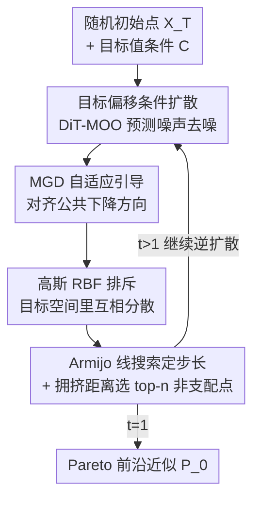

# SPREAD：基于采样的高效自适应扩散 Pareto 前沿精化

**会议**: ICLR 2026  
**OpenReview**: [https://openreview.net/forum?id=4731mIqv89](https://openreview.net/forum?id=4731mIqv89)  
**代码**: https://github.com/safe-autonomous-systems/moo-spread  
**领域**: 多目标优化 / 扩散模型 / Pareto 前沿  
**关键词**: 多目标优化, 条件扩散模型, 多梯度下降, Pareto 前沿, 多样性

## 一句话总结
SPREAD 把条件 DDPM 当作多目标优化（MOO）的求解器：先用 Diffusion Transformer 学一个以"目标值"为条件的扩散过程，再在每一步逆扩散里注入一个"多梯度下降方向 + 高斯 RBF 排斥力"的引导项，让一批候选点既快速收敛到 Pareto 最优、又均匀铺开覆盖整条 Pareto 前沿，在在线、离线、贝叶斯三种设定下都匹配或超过专用 SOTA。

## 研究背景与动机

**领域现状**：多目标优化要在多个相互冲突的目标之间找出一整条 Pareto 前沿——一组互不支配的折中解。经典做法包括进化算法、标量化（scalarization）以及多梯度下降（MGD）配合多起点（multi-start，用多个随机初值各跑一遍）。

**现有痛点**：这些方法在高维、大规模或评估代价昂贵的场景下都吃力。MGD 多起点能保证收敛到 Pareto 驻点，但本身不促进多样性，多个起点可能挤到前沿的同一小段；为了在特定场景提速，人们又造了一堆领域专用算法（离线 MOO、贝叶斯 MOO、联邦 MOO），通用性却被牺牲掉了。

**核心矛盾**：MOO 同时要"收敛"（每个点都尽量逼近 Pareto 前沿）和"多样"（这批点要铺满整条前沿），而纯梯度法天然偏向前者、容易模式坍缩；通用性与效率之间也存在 trade-off。

**本文目标**：要一个**统一**框架，既能处理大规模高维问题，又能在不同资源约束设定（在线/离线/贝叶斯）下复用，同时兼顾收敛速度与前沿覆盖度。

**切入角度**：作者注意到 DDPM 的"迭代精化"本质（从噪声逐步去噪到高质量样本）和 MOO"逐步把候选解推向前沿"的过程高度同构——既然扩散模型每一步都在重塑样本，那就在每一步逆扩散里直接塞进 MOO 的方向信号。

**核心 idea**：用一个以目标值为条件的扩散模型生成候选解，并在逆扩散的每一步用"MGD 公共下降方向（管收敛）+ 高斯 RBF 排斥（管多样）"联合引导去噪轨迹，把生成、收敛、铺开三件事捏进同一个采样循环。

## 方法详解

### 整体框架

SPREAD 在"在线设定"（能直接访问目标函数 $F$）下的流程是：先用拉丁超立方采样在决策空间里采 $N$ 个点训练一个条件 Diffusion Transformer（DiT-MOO），让它学会"给定目标值、预测加在决策变量上的噪声"；推理时从 $n$ 个随机初始点 $X_T$ 出发，逐步逆扩散，但每一步在标准去噪之上再叠一个引导更新——这个引导既让每个点沿其 MGD 公共下降方向走（往前沿靠），又让这批点在目标空间里相互排斥（铺开）；步长用 Armijo 回溯线搜索定，每步结束再用拥挤距离从历史并集里挑出 top-$n$ 非支配点维护一个 Pareto 存档，最终输出 $P_0$。

### 关键设计

**1. 目标偏移条件化的条件扩散：让"去噪"天然朝支配方向走**

普通条件扩散只是按条件生成样本，没有理由让生成的解比初始点更优。SPREAD 的做法是在条件上做手脚：训练时给每个样本 $x_i$ 配的条件不是它真实的目标向量，而是一个**正向偏移**后的值

$$c_i = F(x_i) + \Xi, \quad \Xi \in (0, \infty)^m,$$

其中 $\Xi$ 是任意一个分量全为正的偏移向量（可全局固定，也可逐点/逐 batch 变化）；而采样时却用**未偏移**的真实目标值 $F(x_i)$ 作条件。直觉是：模型学到的是"比这个（偏大的）目标值更好的解长什么样"，所以拿真实（更小）目标值去查，它会吐出比当前点更优的解。论文用 Theorem 1 把这点说实：设采样器与真条件分布的总变差距离不超过 $\tau$，固定初始 $x_T$ 并令条件 $c_T = F(x_T)$，则采出的 $x_0$ 以至少 $1-\tau$ 的概率支配 $x_T$（$P(x_0 \prec x_T) \ge 1-\tau$）。这把"条件扩散一步生成"直接变成了"大概率改进当前解"的算子，是整个框架收敛性的根基。

**2. MGD 启发的自适应引导：在每一步逆扩散里注入公共下降方向**

光靠条件化还不够稳，作者在每个逆扩散步的去噪结果上再加一个梯度引导项。先做标准 DDPM 去噪得到 $X'_t$，再用引导方向 $\tilde{h}_t$ 修正：

$$X_{t-1} \leftarrow X'_t - \eta_t \tilde{h}_t(X'_t), \qquad \tilde{h}^i_t = h^i_t + \gamma^i_t \delta_t.$$

这里 $g^i_t = g(x'^i_t)$ 是第 $i$ 个点的 MGD 公共下降方向（即 $\min_{\lambda \in \Delta_m} \|\sum_j \lambda_j \nabla f_j\|^2$ 解出的聚合梯度），主方向 $h^i_t$ 被要求与 $g^i_t$ 尽量同向——通过最大化平均内积 $\frac{1}{n}\sum_i \langle g^i_t, h^i_t\rangle$ 实现，从而继承 MGD"同时改善所有目标"的下降性质；$\delta_t$ 是叠加的随机扰动，$\gamma^i_t$ 控制扰动强度。Theorem 2 给出当多样性权重 $\nu_t=0$ 时 $\gamma^i_t$ 的取法：若存在 $b_{i,j}=\langle \nabla f_j, \delta_t\rangle < 0$，取 $\gamma^i_t = \rho \min_{j: b_{i,j}<0}(-a_{i,j}/b_{i,j})$（$0<\rho<1$，$a_{i,j}=\langle\nabla f_j, h^i_t\rangle>0$），否则取任意正数 $\zeta$，这样能保证 $-\tilde{h}^i_t$ 仍是所有目标的公共下降方向。换句话说，扰动被"卡"在不破坏下降性的范围内，既加了随机探索又不丢收敛保证。步长 $\eta_t$ 用 Armijo 回溯线搜索自适应确定，避免步子过猛、贴合局部曲率。

**3. 高斯 RBF 排斥：把多样性写进引导的优化目标里**

只追下降方向必然导致这批点挤成一团（模式坍缩，前沿覆盖差）。SPREAD 在求主方向 $h^i_t$ 时同时压低一个目标空间里的高斯 RBF 排斥能量。记一步更新后各点的目标值 $y^i_t$，排斥函数为

$$\Gamma_t(Y_t) = \frac{2}{n(n-1)} \sum_{1\le i<j\le n} \exp\!\Big(-\frac{\|y^i_t - y^j_t\|^2}{2\sigma^2}\Big),$$

$\sigma$ 是长度尺度——两个点在目标空间越近，这一对的指数项越大，最小化 $\Gamma_t$ 就等价于把彼此推开。于是主方向由一个联合子问题给出：

$$ (h^i_t)_{i=1}^n = \arg\min_{(u^i)} \Big( -\frac{1}{n}\sum_i \langle g^i_t, u^i\rangle + \nu_t\, \Gamma_t\big(F(X'_t - \eta_t((u^i) + \gamma_t^T\delta_t))\big)\Big),$$

第一项拉所有点往 MGD 方向收敛、第二项靠 $\nu_t$ 加权把它们在目标空间推散，实际用固定步数的几步梯度下降近似求解以控制开销。$\nu_t$ 就是收敛与覆盖的旋钮：$\nu_t=0$ 退化成纯下降（Theorem 2 适用但覆盖差），适中的 $\nu_t$ 才能铺满前沿。最后再叠一层拥挤距离（crowding distance）选 top-$n$ 非支配点维护存档，进一步偏好稀疏区域的解。

### 损失函数 / 训练策略
训练沿用标准 DDPM 噪声预测损失 $L_s(\theta) = \mathbb{E}\big[\|\epsilon - \hat{\epsilon}_\theta(X_t, t, C)\|^2\big]$，方差表用 cosine schedule，条件 $C = F(X) + \Xi$。在线设定训练 1000 epoch（早停 100），时间步 $T=5000$。**向资源受限设定的扩展**靠替换目标即可：离线 MOO 用预收集数据集训一个代理 $\tilde{F}$，把算法里的 $F$ 全换成 $\tilde{F}$、训练集设为 $D$；贝叶斯 MOO 用迭代更新的高斯过程代理，并借 CDM-PSL 的数据抽取策略 + 模拟二进制交叉（SBX）作为逃离局部最优的辅助机制——同一套采样循环换个目标来源就复用。

## 实验关键数据

### 主实验（在线 MOO，超体积 HV ↑ / Δ-spread ↓，5 次平均）
合成基准 ZDT/DTLZ（$d=30$）+ 真实工程任务 RE，baseline 为 PMGDA、STCH、MOO-SVGD、HVGrad，各跑 5000 次迭代、每法产 200 个点。

| 任务 | 指标 | SPREAD | 最强 baseline |
|------|------|--------|---------------|
| RE21 (m=2) | HV | **70.10** | 48.14 (PMGDA) |
| RE33 (m=3) | HV | **133.76** | 43.06 (PMGDA) |
| RE34 (m=3) | HV | **243.15** | 210.07 (PMGDA) |
| DTLZ7 (m=3) | HV | **18.07** | 17.82 (PMGDA) |
| RE41 (m=4) | HV | **1008.75** | 936.17 (HVGrad) |
| ZDT3 (m=2) | Δ-spread | **0.53** | 0.90 (MOO-SVGD) |
| RE21 (m=2) | Δ-spread | **0.44** | 1.00 (多数) |

ZDT1-3 等双目标合成题上 SPREAD 与最优持平；三目标上 6 题中 4 题取得最佳 HV；四目标 RE41 取得全场最高 HV，且 Δ-spread 在多数题上最优——目标数越多优势越明显。

### 消融实验（Table 3，去掉多样性机制）

| 配置 | 现象 | 说明 |
|------|------|------|
| Full SPREAD | HV/Δ-spread 双优 | 完整模型 |
| w/o diversity（$\tilde{h}=g$） | 多题 Δ-spread = $+\infty$ | 退成纯 MGD，解坍缩成一点 |
| w/o repulsion（去掉 RBF） | 多题 Δ-spread = $+\infty$，HV 大跌（如 ZDT1 5.72→4.25、DTLZ7 18.07→12.84） | 没有排斥力就无法铺开 |
| w/o perturbation（去掉 $\gamma\delta$） | 影响较温和（如 RE21 HV 70.10→69.01） | 扰动主要做局部探索 |

### 关键发现
- **排斥力是多样性的命门**：去掉 diversity 或 repulsion 都会让解坍缩到单点（Δ-spread = +∞），说明把多样性写进引导子问题的目标函数是 SPREAD 不坍缩的核心。
- **DDPM 自带的随机性也贡献多样性**：w/o diversity 在个别题上 Δ-spread 反而不差，作者归因于式 (9) 注入 $X'_t$ 的扩散随机项本身就有铺开效果。
- **可扩展性 trade-off 漂亮**：随目标数 $m$ 和样本数 $n$ 增大，PMGDA 计算时间增长最快，SPREAD 远低于 PMGDA、仅略高于 MOO-SVGD/HVGrad/STCH，却在 HV 和 Δ-spread 上稳定领先——效率与性能的折中占优（要计入 SPREAD 独有的训练耗时仍成立）。
- **离线/贝叶斯设定同样领先**：离线 MOO 在 Off-MOO-Bench 上 SPREAD 平均排名 Synthetic 3.50、RE 1.83，均为全场最佳且优于生成式对手 ParetoFlow、PGD-MOO；贝叶斯设定下在有限评估预算内的 log-hypervolume 曲线也优于专用方法。

## 亮点与洞察
- **把 MOO 的两个目标拆给条件扩散的两个机件**：条件偏移负责"改进/收敛"（Theorem 1 保证大概率支配），RBF 排斥负责"铺开/多样"，两者在同一个采样循环里叠加，思路干净且各有理论支撑。
- **"卡住扰动"的 Theorem 2 很巧**：随机扰动通常会破坏下降性，作者用 $\gamma^i_t = \rho\min(-a_{i,j}/b_{i,j})$ 把扰动幅度限制在所有目标方向导数仍为负的区间，既保留探索又不丢公共下降方向。
- **一套循环换目标即跨设定**：在线/离线/贝叶斯只是把 $F$ 换成真函数 / 代理 $\tilde{F}$ / 高斯过程，主算法不变，可迁移性强——这种"插拔目标源"的设计可借鉴到其他生成式优化器。

## 局限与展望
- **必须有目标梯度**：MGD 引导依赖每个目标函数连续可微且能取梯度，离线/贝叶斯下靠代理模型梯度逼近，代理质量直接决定方向准确度。
- **额外训练开销**：相比纯梯度 baseline，SPREAD 要先训 DiT-MOO，小问题上这笔固定成本可能不划算；$T=5000$ 步逆扩散也偏重。
- **超参较多**：$\nu_t$（收敛↔覆盖）、$\rho$（扰动幅度）、$\sigma$（RBF 尺度）、偏移 $\Xi$ 等都需调，论文虽给了消融但实际部署调参成本不低；子问题用"几步梯度下降近似求解"，其逼近误差对最终前沿质量的影响未充分量化。
- 可探索：自适应调度 $\nu_t$（前期重收敛、后期重铺开）、用更少时间步的快速采样器（DDIM 类）压缩推理成本。

## 相关工作与启发
- **vs ParetoFlow / PGD-MOO（生成式 MOO）**：ParetoFlow 用 flow-matching + 多目标预测器引导，PGD-MOO 训一个支配关系偏好分类器做扩散引导；SPREAD 直接把目标值作为条件、用逐步 MGD 引导 + 显式排斥力，**不需要单独的偏好分类器**就同时拿到收敛与铺开。
- **vs MGD / PMGDA / MOO-SVGD（梯度法）**：经典 MGD 多起点不促多样，PMGDA 概率性采多个下降方向、MOO-SVGD 用 Stein 变分梯度搬运粒子；SPREAD 把 MGD 方向当作 DDPM 去噪过程中的自适应引导信号，相当于让扩散轨迹"驮着"梯度信息走，兼得生成模型的全局结构学习与梯度法的局部收敛。
- **vs CDM-PSL（贝叶斯 MOO）**：SPREAD 在贝叶斯设定下复用了 CDM-PSL 的数据抽取策略并加 SBX 逃逸，但底座是统一的条件扩散 + 引导循环，而非为贝叶斯专门设计。

## 评分
- 新颖性: ⭐⭐⭐⭐⭐ 把条件偏移、MGD 引导、RBF 排斥三件事统一进逆扩散循环，并配两条定理，角度新且自洽
- 实验充分度: ⭐⭐⭐⭐ 覆盖在线/离线/贝叶斯三设定 + 合成与工程基准 + 可扩展性与消融，较全面；超参敏感性主要靠附录
- 写作质量: ⭐⭐⭐⭐ 方法与定理表述清晰，但核心采样子问题与多个超参的直觉需对照附录才完整
- 价值: ⭐⭐⭐⭐ 提供了一个跨设定通用的生成式 MOO 框架，对大规模/昂贵多目标问题有实用潜力

<!-- RELATED:START -->

## 相关论文

- [\[ICML 2026\] Diversity-Driven Offline Multi-Objective Optimization via Nested Pareto Set Learning](../../ICML2026/optimization/diversity-driven_offline_multi-objective_optimization_via_nested_pareto_set_lear.md)
- [\[AAAI 2026\] Pareto-Grid-Guided Large Language Models for Fast and High-Quality Heuristics Design in Multi-Objective Combinatorial Optimization](../../AAAI2026/optimization/pareto-grid-guided_large_language_models_for_fast_and_high-quality_heuristics_de.md)
- [\[ICLR 2026\] Gradient-Based Diversity Optimization with Differentiable Top-$k$ Objective](gradient-based_diversity_optimization_with_differentiable_top-k_objective.md)
- [\[ICLR 2026\] Neural Multi-Objective Combinatorial Optimization for Flexible Job Shop Scheduling Problems](neural_multi-objective_combinatorial_optimization_for_flexible_job_shop_scheduli.md)
- [\[ICLR 2026\] Clipped Gradient Methods for Nonsmooth Convex Optimization under Heavy-Tailed Noise: A Refined Analysis](clipped_gradient_methods_for_nonsmooth_convex_optimization_under_heavy-tailed_no.md)

<!-- RELATED:END -->
