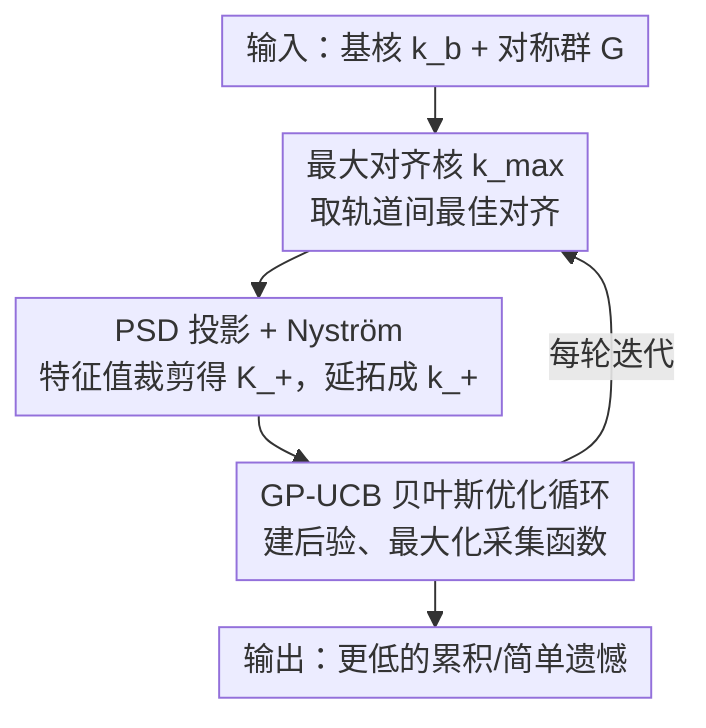

# Symmetry-Aware Bayesian Optimization via Max Kernels

**会议**: ICLR 2026  
**OpenReview**: [https://openreview.net/forum?id=zUbBaWAM1Q](https://openreview.net/forum?id=zUbBaWAM1Q)  
**代码**: https://github.com/abardou/max-kernel  
**领域**: 贝叶斯优化 / 高斯过程 / 对称性先验  
**关键词**: 贝叶斯优化, 不变核, 群对称, 最大对齐核, PSD 投影

## 一句话总结
当黑盒目标函数在某个群 $G$ 作用下不变时，本文不再像主流做法那样对群轨道做"平均"得到不变核，而是取轨道间的"最大对齐"相似度 $k_{\max}$，再用特征值裁剪 + Nyström 扩展把它救成一个合法的（半正定）GP 核 $k_+^{(D)}$，在不增加渐进开销的前提下显著降低了贝叶斯优化的累积遗憾，且群越大优势越明显。

## 研究背景与动机

**领域现状**：贝叶斯优化（BO）是优化"昂贵、有噪声、黑盒"目标函数的标准框架——它给目标函数放一个高斯过程（GP）先验 $f \sim \mathcal{GP}(0, k)$，核函数 $k$ 决定了 GP 的协方差结构、也就编码了我们对目标的先验假设。很多真实问题（分子性质预测、无线网络设计、粒子堆积）里，目标函数已知在某个群 $G$ 的作用下不变，即 $f^\star(x) = f^\star(gx)$ 对所有 $g \in G$ 成立。Ginsbourger 等人证明：要让 GP 先验也是 $G$-不变的，它的协方差函数必须同样 $G$-不变。于是问题变成：怎么从一个普通基核 $k_b$ 和群 $G$ 构造出一个不变核？

**现有痛点**：主流答案是"轨道平均核"$k_{avg}(x,x') = \frac{1}{|G|^2}\sum_{g,g'\in G} k_b(gx, g'x')$——对一对点的所有群变换组合求平均。它确实不变、也有干净的函数空间解释，因此成了对称 BO 的默认现成核。但平均会"稀释"信息：当两个点在某个特定变换下能完美对齐、在其余大多数变换下都对不上时，平均把那一个真正有意义的对齐淹没在一大堆不相似的项里。直觉例子是带旋转不变性的图像：同一只猫的两张旋转图，只有"那一个"正确旋转角能让它们对齐，其余角度看起来都很不一样，平均后相似度被拉低。

**核心矛盾**：另一条久负盛名的思路是取"最大对齐"——只保留两个轨道间最好的那个匹配，即 $k_{\max}(x,x') = \max_{g,g'\in G} k_b(gx, g'x')$，这在结构化数据的卷积/最佳匹配核里早有先例。但 max 核有个致命问题：它一般**不是半正定（PSD）**的，而 BO 背后的标准 GP 机制（求逆、采样）都要求核 PSD。正是这个障碍，长期以来挡住了 max 核进入 BO。

**本文目标**：把"最大对齐"这个直觉上更优的相似度结构搬进 BO，同时绕开它非 PSD 的障碍，且不能增加每轮迭代的渐进计算开销。

**核心 idea**：用一次 max 核的 PSD 投影（特征值裁剪）+ Nyström 扩展，得到一个合法、$G$-不变、且在 $k_{\max}$ 本就 PSD 时与之重合的核 $k_+^{(D)}$——既保留了 max 核"高对比度轨道对齐"的几何，又能直接插进 GP-UCB 的 BO 循环。

## 方法详解

### 整体框架

方法要解决的是"如何把非 PSD 的最大对齐核改造成可直接用于 BO 的合法 GP 核"。整条流水线是：用户给定一个普通基核 $k_b$（如 RBF、Matérn）和已知对称群 $G$ → 在有限设计集 $D$ 上构造最大对齐核 $k_{\max}$ 的 Gram 矩阵 → 对该矩阵做特征值裁剪投影到 PSD 锥得到 $K_+$ → 用 Nyström 扩展把核延拓到新点、得到合法核 $k_+^{(D)}$ → 把 $k_+^{(D)}$ 当成普通 GP 核插进标准 GP-UCB 循环（建 Gram 矩阵、求后验、最大化采集函数选下一个查询点）。

整个改造只在"核"这一层动手脚，BO 的其余部分（采集函数、优化预算）完全不变，因此可以即插即用地替换掉现成的 $k_{avg}$。

### 关键设计

**1. 最大对齐核 $k_{\max}$：用轨道间最佳匹配代替平均，保留真正有意义的相似度**

针对"平均稀释信息"这个痛点，本文回到一个被 BO 长期忽视的思路：相似度应取两个轨道间**最好**的那次对齐，而非对所有变换求平均。形式上 $k_{\max}(x,x') = \max_{g,g'\in G} k_b(gx, g'x')$。作者先论证它是个"真核"——构造一个把每个点映到其轨道代表的映射 $\phi_G$（满足 $\phi_G(x)=\phi_G(gx)$ 且 $\|\phi_G(x)-\phi_G(x')\|_2 = \min_{g,g'}\|gx-g'x'\|_2$），令 $f(x)=h(\phi_G(x))$，$h\sim\mathcal{GP}(0,k_b)$，则 $f$ 是 $G$-不变的 GP 且其协方差恰为 $k_{\max}$（Proposition 1）。这说明 $k_{\max}$ 天然就是一类合法 $G$-不变 GP 的协方差。

为什么 max 比 avg 好？作者用引理点破：对任意基核，$k_{avg}$ 与 $k_{\max}$ 在某条轨道上相等，当且仅当基核本身就已经等于 $k_{\max}$——也就是说平均**永远**复现不了 max 的几何（除非退化到平均根本多余）。一个闭式例子更直观：平面旋转不变 + RBF 基核下，$k_{\max}(x,x')=\exp(-(\|x\|_2-\|x'\|_2)^2/2l^2)$，只要两点范数相等就给出最大相似度 1，精确捕捉了"同半径即同值"的旋转不变性；而 $k_{avg}(x,x') = \exp(-\tfrac{\|x\|_2^2+\|x'\|_2^2}{2l^2}) I_0(\tfrac{\|x\|_2\|x'\|_2}{l^2})$（$I_0$ 为修正贝塞尔函数）的等相似度曲线是扭曲的球，甚至会把两个同范数的点判为高度不相似。几何上更准的核，让采集函数不再重复探索"对称等价、其实已探索过"的点，对未探索区域的不确定性建模也更可信。

**2. PSD 投影 + Nyström 扩展：一步把非 PSD 的 max 核救成合法 GP 核，且不增加渐进开销**

$k_{\max}$ 虽然对称且不变，却一般不 PSD，无法直接喂给 GP。本文的补救是一个标准但关键的两步操作。第一步在有限设计集 $D=\{x_1,\dots,x_n\}$ 上取 Gram 矩阵 $K=k_{\max}(D,D)$，做特征分解 $K=Q\Lambda Q^\top$，把负特征值裁剪为 0：

$$K_+ = Q\,\max(0,\Lambda)\,Q^\top$$

这是把 $K$ 投影到 PSD 锥（即最近的半正定矩阵）。第二步用 Nyström 扩展把核延拓到 $D$ 以外的新点，得到最终使用的核：

$$k_+^{(D)}(x,x') = k_{\max}(x,D)\,K_+^{\dagger}\,k_{\max}(D,x')$$

其中 $K_+^{\dagger}$ 是 Moore-Penrose 伪逆。这个构造等价于 $k_+^{(D)}(x,x')=\phi(x)^\top\phi(x')$，特征 $\phi(x)=K_+^{\dagger/2}k_{\max}(D,x)$，因此 PSD 立即成立。它还有两条好性质：当 $k_{\max}$ 本就 PSD（$K\succeq 0$）时 $K_+=K$，$k_+^{(D)}$ 与 $k_{\max}$ 在 $D$ 上完全重合；并继承了 $k_{\max}$ 的逐变元 $G$-不变性。作者进一步在附录把这个有限样本构造对应到一个不依赖 $D$ 的内在定义 $k_+(x,x')=\sum_i \max(0,\lambda_i)\phi_i(x)\phi_i(x')$（算子谱层面的投影），并证明有限投影 + Nyström 在 iid 采样下会以谱（Hilbert-Schmidt）层面收敛到 $k_+$。

**3. 与轨道平均核同阶的每轮开销：让"更好的几何"几乎免费**

一个方法只有不显著变贵才有现成替换价值。关键观察是：计算 $K_+$ 和 $K_+^{\dagger}$ 所需的那次特征分解/SVD，本来就和 BO 为构建采集函数而对 Gram 矩阵求逆的代价是同一量级（$O(n^3)$），所以 PSD 投影这一步**没有**抬高渐进开销。结果是 $k_+^{(D)}$ 每轮 BO 迭代的渐进复杂度与 $k_{avg}$ 相同（见复杂度表）；唯一变贵的是单次跨点核求值（$O(n|G|^*)$ vs 平均核的 $O(|G|^*)$），但只要采集优化的候选点数 $m \lesssim n$，这点差异可忽略。换句话说，max 核带来的更优几何几乎是免费的。

### 损失函数 / 训练策略
本文不是训练式方法，没有损失函数。BO 用 GP-UCB 作为采集函数，每个核 $k\in\{k_b, k_{avg}, k_+^{(D)}\}$ 共用相同的采集与优化预算，结果在 10 个随机种子上取平均。

## 实验关键数据

实验回答两个问题：(Q1) $k_+^{(D)}$ 是否比 $k_{avg}$ 降低遗憾？(Q2) 性能如何随群大小 $|G|$ 和维度变化？对比对象是不处理对称的基核 $k_b$ 与轨道平均核 $k_{avg}$（Brown 等 2024 的现成做法）。

### 主实验

合成函数报累积遗憾（越低越好），真实任务报"负的最佳奖励"（越低越好）。

| Benchmark | $\|G\|$ | $k_b$ | $k_{avg}$ | $k_+^{(D)}$ |
|-----------|------|-------|-----------|------------|
| Ackley2d | 8 | 382.7 ± 5.7 | 128.2 ± 10.4 | **126.4 ± 3.6** |
| Griewank6d | 64 | 3840.3 ± 177.7 | 3067.4 ± 841.9 | **1832.6 ± 146.3** |
| Rastrigin5d | 3,840 | 3568.5 ± 91.3 | 1583.5 ± 341.9 | **813.4 ± 70.6** |
| Radial2d | ∞ | 388.6 ± 20.3 | 480.9 ± 76.4 | **199.7 ± 11.6** |
| Scaling2d | ∞ | 1820.6 ± 1135.4 | 3361.8 ± 742.9 | **25.4 ± 6.4** |
| WLAN8d（真实） | 24 | −65.0 ± 3.2 | −51.8 ± 1.7 | **−74.4 ± 0.7** |
| PartPack6d（真实） | ∞ | −0.79 ± 0.10 | −0.69 ± 0.01 | **−0.92 ± 0.10** |

$k_+^{(D)}$ 在**每一个**任务上都拿到最好结果，最高改进约 50%。这正面回答了 Q1。

### 群大小消融 / 谱分析

| 观察维度 | 现象 | 说明 |
|----------|------|------|
| 小群（Ackley2d, $\|G\|=8$） | $k_{avg}$ 与 $k_+^{(D)}$ 打平 | 群小时平均和最大对齐差距不大 |
| 大群（Griewank6d/Rastrigin5d） | $k_+^{(D)}$ 累积遗憾平均比 $k_{avg}$ 低 40% / 49% | 群越大优势越明显 |
| 连续群（Radial2d/Scaling2d, $\|G\|=\infty$） | $k_{avg}$ 退化到比 $k_b$ 还差，$k_+^{(D)}$ 仍强 | 平均在连续群下会被严重稀释 |
| 经验谱衰减 | $k_{avg}$ 的特征值衰减与 $k_+^{(D)}$ 相近、有时更快 | 与遗憾表现**相反** |

### 关键发现
- **群越大优势越大**：随 $|G|$ 增长（如超八面体群 $|G|=2^d d!$），$k_{avg}$ 性能持续退化、甚至跌破不处理对称的 $k_b$，而 $k_+^{(D)}$ 几乎不受群大小影响，展现出对群规模的鲁棒性。
- **谱理论解释不了这个增益（反直觉）**：主流 BO 理论认为核的特征值衰减越快、遗憾上界越紧。但实验里 $k_{avg}$ 的谱衰减与 $k_+^{(D)}$ 相近甚至更快，按理论它应该有相近或更好的遗憾界，实际却一致更差。这说明"特征值衰减速率"单独并不能刻画 $k_+^{(D)}$ 的结构优势。
- **作者给出两个猜测**：① 几何而非速率——衰减只说谱缩得多快，却忽略了**哪些**特征函数被强调；$k_{avg}$ 常引入"相似度反转"扭曲搜索几何，而 $k_+^{(D)}$ 保留了高对比度轨道对齐。② 逼近难度——RBF 基核下 $f^\star$ 同属两种核的 RKHS，误设（misspecification）距离均为 0，所以差距并非来自模型误设。

## 亮点与洞察
- **"被嫌弃太久"的 max 核翻案**：max 对齐核因非 PSD 被 BO 拒之门外多年，本文用一步标准的特征值裁剪 + Nyström 就把障碍消掉，且证明在 $k_{\max}$ 本就 PSD 时新核与它重合——这是一个"低风险、高回报、几乎免费"的现成核替换，工程上非常友好。
- **理论与实践的明确矛盾被摆上台面**：作者没有掩盖"谱衰减理论预测它该更差、实际却更好"的反常，而是把它作为一个开放问题点出，提示 BO 遗憾分析可能需要超越纯谱速率、引入几何对齐与逼近难度的视角。这种诚实比硬凑一个解释更有价值。
- **可迁移的设计判断**："不变 vs 如何编码不变"是两件事——光保证核不变（avg 做到了）不够，**怎么**编码轨道对齐同样重要。这个区分可迁移到任何需要把对称先验注入核/表示的场景（图核、集合核、等变学习）。

## 局限与展望
- **理论缺口未补上**：为什么 $k_+^{(D)}$ 更好仍停留在两个猜测（几何对齐、逼近难度），没有给出能解释经验增益的新遗憾界——这是论文自己承认的最大遗憾。
- **依赖已知对称群**：方法假设用户能提供准确的群 $G$；若群未知、近似或只是部分对称，效果如何未探讨。
- **数据依赖的有限构造**：$k_+^{(D)}$ 依赖设计集 $D$，虽然有收敛到内在 $k_+$ 的理论保证，但实际中 $D$ 较小时投影质量、以及 $K_+^{\dagger}$ 在病态谱下的数值稳定性值得关注。
- **可改进方向**：把"几何对齐"形式化为可计算的量并纳入遗憾界；或探索对噪声/近似对称鲁棒的软最大对齐（如温度化的 softmax 对齐）来在 max 与 avg 之间插值。

## 相关工作与启发
- **vs 轨道平均核 $k_{avg}$（Kondor 2008；Brown 等 2024）**：他们对群轨道求平均得到不变核，几何上会稀释/反转相似度；本文取最大对齐并保留高对比度结构，群越大差距越大，且每轮开销同阶。
- **vs 数据增强**：把每个观测的所有变换副本加进数据集来强制对称，但 BO 复杂度随数据量立方增长、对连续群根本不适用；附录显示即便用满全部增强也打不过平均核与 max 核。
- **vs 搜索空间限制（基本域 $S_G$）**：把搜索域限制到一个覆盖整个空间的基本域。这与本文互补——前者解决"在哪搜"，本文解决"用什么核"，即便在基本域上跑 BO 仍需要一个好的不变核。
- **vs 结构化数据的最佳匹配核（Gärtner 2003；Vishwanathan 等 2003）**：最大对齐思路在结构化数据核里早有先例，但都受非 PSD 困扰；本文把 SVM 里的特征值裁剪/翻转补救迁移到 BO，并配上 Nyström 扩展使其能延拓到连续域。

## 评分
- 新颖性: ⭐⭐⭐⭐ 把被弃用的 max 核用一步标准投影救进 BO，思路简洁但确有洞见
- 实验充分度: ⭐⭐⭐⭐ 合成 + 两个真实任务、有限/连续群、群大小消融与谱分析齐备
- 写作质量: ⭐⭐⭐⭐⭐ 动机层层递进，且坦诚指出理论无法解释的反常
- 价值: ⭐⭐⭐⭐ 即插即用、近乎免费的现成核替换，对对称 BO 实践直接有用

<!-- RELATED:START -->

## 相关论文

- [\[ICLR 2026\] From Sorting Algorithms to Scalable Kernels: Bayesian Optimization in High-Dimensional Permutation Spaces](from_sorting_algorithms_to_scalable_kernels_bayesian_optimization_in_high-dimens.md)
- [\[ICML 2026\] Cost-Aware Stopping for Bayesian Optimization](../../ICML2026/optimization/cost-aware_stopping_for_bayesian_optimization.md)
- [\[ICLR 2026\] Globally Aware Optimization with Resurgence](globally_aware_optimization_with_resurgence.md)
- [\[ICLR 2026\] Combinatorial Bandit Bayesian Optimization for Tensor Outputs](combinatorial_bandit_bayesian_optimization_for_tensor_outputs.md)
- [\[CVPR 2026\] DABO: Difficulty-Aware Bayesian Optimization with Diffusion-Learned Priors](../../CVPR2026/optimization/dabo_difficulty-aware_bayesian_optimization_with_diffusion-learned_priors.md)

<!-- RELATED:END -->
