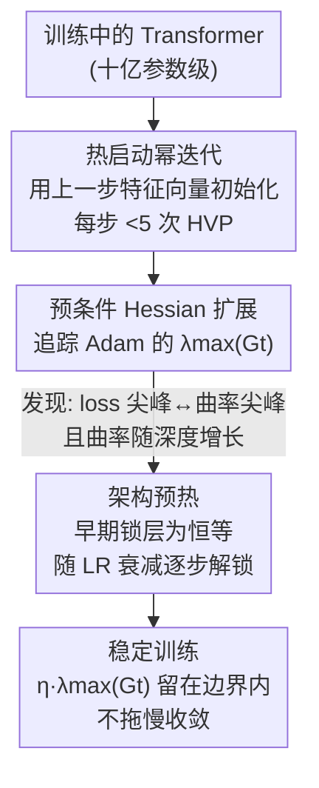

# Taming Curvature: Architecture Warm-up for Stable Transformer Training

**会议**: ICLR 2026  
**OpenReview**: [https://openreview.net/forum?id=DuNf2vPTTK](https://openreview.net/forum?id=DuNf2vPTTK)  
**领域**: LLM效率 / 训练稳定性 / 优化  
**关键词**: 训练稳定性, Edge of Stability, 曲率追踪, Hessian, 渐进深度

## 一句话总结
本文先用「热启动幂迭代」把十亿参数 Transformer 的（预条件）Hessian 最大特征值在线追踪成本压到每步 <5 次 HVP，借此确认训练 loss 尖峰确实伴随曲率飙升、且曲率随深度增长，进而提出「架构预热」——训练早期把多数层冻结为恒等、随学习率衰减再逐步解冻——在不拖慢收敛的前提下显著压制大模型训练的发散与尖峰。

## 研究背景与动机

**领域现状**：训练十亿参数级 Transformer 极易出现瞬时 loss 尖峰甚至彻底发散，白白烧掉算力。业界的稳定化手段大多是经验性的"补丁"：对 logits 做 soft-capping、对 query/key 做 QK-Norm 或 QK-Clip 限制点积幅度、用学习率/批量 warmup 抑制早期更新等。

**现有痛点**：与此并行的 Edge of Stability（EoS）理论其实给出了更本质的视角——梯度方法会被推向"步长 × 曲率"逼近稳定边界的区域，即 $\eta\,\lambda_{\max}(H)\approx 2$（自适应方法则看预条件曲率 $\lambda_{\max}(P_t^{-1/2}HP_t^{-1/2})$，Adam 下阈值约 38）。理论上只要把 $\eta\,\lambda_{\max}$ 压在边界以下就稳，可这套理论此前只在 ≲25M 的小模型上验证过。

**核心矛盾**：要在大模型上用 EoS 理论，就必须**在线**估计曲率（最大特征值），但显式构造 Hessian 内存爆炸，迭代近似又太慢——传统幂迭代每步要从随机向量起步、在高维下与主特征向量的初始对齐只有 $O(1/\sqrt{d})$，需要很多次 Hessian-向量积（HVP）才收敛。于是"曲率可控的稳定化"在大规模训练里一直叫好不叫座。

**本文目标**：(1) 把曲率在线追踪做到十亿参数可行；(2) 用它验证大模型 loss 尖峰是否真由曲率尖峰引起；(3) 据此设计一个能直接塞进现有训练流程、不损性能的稳定化方法。

**切入角度**：作者的关键观察是——Hessian 的**主特征向量是慢变的**。训练相邻两步参数变化很小，那么上一步的主特征向量就是这一步极好的初始猜测，于是幂迭代可以"热启动"，迭代次数大幅下降。

**核心 idea**：先用热启动幂迭代把曲率追踪变便宜，再发现曲率随深度增长且在学习率 warmup 阶段尖峰最猛，因此用"控制有效深度"来托住曲率曲线——早浅晚深，让 $\eta\,\lambda_{\max}(G_t)$ 始终待在稳定包络内。

## 方法详解

### 整体框架

方法分两块、前因后果串成一条线：**先有一把"廉价曲率尺"，再用它指导一套"调深度的稳定化策略"**。第一块是在线曲率追踪器——基于热启动的 HVP 幂迭代，每步只花 <5 次 HVP 就能估出（预条件）Hessian 的最大特征值，并无缝扩展到 Adam 的预条件几何。拿这把尺去量大模型，作者发现两件事：loss 尖峰与预条件曲率尖峰同步出现，且曲率随网络深度上升。第二块「架构预热」正是对症下药——既然 EoS 下稳定阈值与学习率成反比（learning rate warmup 阶段 $\eta$ 升高、阈值收紧），就让网络在早期保持"浅"（低曲率），等学习率开始衰减、阈值放松后再逐步加深，全程把曲率压在稳定边界下。加深的实现不是动态改计算图，而是初始化时把若干 Transformer 层"锁"成恒等映射、按预定 schedule 平滑解锁。

### 关键设计

**1. 热启动幂迭代：把曲率在线追踪从"几十次 HVP"压到"<5 次"**

痛点直接而具体：传统幂迭代每步从随机向量起算，高维下与主特征向量初始夹角接近正交，需要很多次 HVP 才收敛，这让十亿参数模型的逐步曲率追踪在时间上不可承受。作者的修法是利用"主特征向量慢变"这一性质做跨步热启动：第 $k+1$ 步不再随机初始化，而是用第 $k$ 步估出的主特征向量 $v_{1,k}$ 作为幂迭代起点。理论上（Theorem 1）相邻两步主特征向量的夹角被 Hessian 的 Lipschitz 常数 $L_H$、谱隙 $\gamma$ 和参数位移共同上界：

$$\sin\angle(v_{1,k+1}, v_{1,k}) \le \frac{\|H_{k+1}-H_k\|}{\gamma} \le \frac{L_H}{\gamma}\|\theta_{k+1}-\theta_k\|.$$

随训练推进、步长和梯度收缩，$\theta$ 位移变小，上一步特征向量就越来越准。Theorem 2 进一步给出热启动相对随机起步省下的迭代数约为 $\big(\tfrac12\log d - \log(\tfrac{L_H}{\gamma}\|\theta_{k+1}-\theta_k\|)\big)/\log(1/\rho_{k+1})$，只要 $\tfrac{L_H}{\gamma}\|\theta_{k+1}-\theta_k\|\ll d^{1/2}$ 热启动就严格占优。实测每步 $\tau^\star<5$ 次 HVP 即收敛，比现有方法低一个数量级，且精度更高、方差更小。

**2. 预条件 Hessian 扩展：让这把尺量的是自适应优化器真正"看见"的几何**

对 Adam/AdamW 这类自适应优化器，决定稳定性的不是原始 Hessian $H$，而是预条件后的曲率——预条件矩阵 $P_t=\mathrm{diag}(\sqrt{v_t}+\varepsilon)$ 下的有效 Hessian $G_t := P_t^{-1/2}H(\theta_t)P_t^{-1/2}$ 的谱。这一设计的关键洞察是：当 $\beta_2\approx 1$ 时 $P_t$ 变化缓慢，叠加 $H$ 的 Lipschitz 光滑，$G_t$ 沿轨迹同样慢变，于是上面的热启动分析把 $H$ 换成 $G_t$ 后**逐字成立**（式 11 给出对应的特征向量夹角界）。实现上每步幂迭代做一次"$P^{-1/2}$ 缩放 → HVP → $P^{-1/2}$ 缩放"的复合操作，并把上一步特征向量按 $P_t^{1/2}P_{t-1}^{-1/2}$ 做传输再归一化作为热启动初值，整条流程不需要任何新的微分原语。这一步是把"小模型理论"接到"真实 Adam 大模型"的桥——没有它，追踪到的曲率和真正主宰稳定性的量对不上。

**3. 架构预热：用"调有效深度"托住曲率曲线，而非逐层精修**

这是方法的落地核心，针对"曲率随深度增长、且在 LR warmup 阶段尖峰最猛"的观察。思路是：EoS 下稳定阈值 $\propto O(1/\eta)$，LR warmup 时 $\eta$ 攀升、阈值收紧，此时就让网络保持浅（小 $\lambda_{\max}(G_t)$）；等过了峰值学习率、进入衰减、阈值放松，再逐步启用更多层。难点在"如何无缝加深而不引入函数/梯度跳变"。一个朴素做法是只把残差块的两个投影权重 $W_{p1}^l=W_{p2}^l=0$ 锁成恒等，但解锁瞬间——由于注意力/FFN 的其他权重仍是随机初始化的大值——投影哪怕动一点点，Jacobian 扰动 $\|J_{X_l}\Phi_l - I\|\le \|W_{p1}^l\|\,\|J_{X_l}X_{\text{concat}}^l\| + \|W_{p2}^l\|\,\|J_{X_l}X_{\text{hidden}}\|$ 就会陡增，把模型推过稳定阈值、引发尖峰。

作者的修法是把整块所有权重（**RMSNorm 权重除外**，因其从零初始化收敛差）全部置零并从优化器中剔除：锁定时 $X_{\text{concat}}^l=0$、$X_{\text{hidden}}=0$，块严格等于恒等、Jacobian $=I$；解锁时所有路径都从零出发，Jacobian 扰动随新可训练权重平滑偏离零而连续增长，从而保证函数与一阶导在解锁处都连续，避免曲率瞬跳。整套机制不改计算图、不需硬件级算子，能直接嵌入标准 Transformer 训练 recipe。论文还论证它不损表达力：从频谱偏置/F-principle（深网先拟合低频，浅栈早期够用）和 NTK 函数空间视角（早期近线性、低曲率，晚加层即可扩表达力）说明延迟加深不伤最终性能。

### 损失函数 / 训练策略
不改优化目标（标准 AdamW + 交叉熵语言建模）。曲率追踪用 5 次热启动幂迭代。架构预热默认 schedule：训练保持半深度直到 LR warmup 完成，之后每隔 500 步解锁一组、分四组解锁到满深度；实验显示性能对该间隔不敏感。主实验默认 context 1024、embedding 2048、32 头、global batch 1024、weight decay 0.01、2000 步线性 warmup 后线性衰减，规模最大到 3B。

## 实验关键数据

### 主实验
在 FineWeb / DCLM / OLMo-Mix 三个大规模语料、Llama 3 风格 decoder-only Transformer 上，用故意偏大的峰值学习率 $8\times10^{-3}$、16 层 1B 模型对比四个稳定化基线，验证集困惑度（↓）：

| 数据集 | Baseline | QK-Norm | QK-Clip | Softcap | Arch-Warmup（本文） |
|--------|----------|---------|---------|---------|---------------------|
| FineWeb | 发散* | 49.88 | 发散* | 51.41 | **25.02** |
| DCLM | 165.62 | 61.57 | 发散* | 43.38 | **22.64** |
| OLMo-Mix | 发散* | 发散* | 发散* | 发散* | **18.54** |

`*` 表示该 run 发散。架构预热在所有数据集上都未发散、困惑度大幅领先，且收敛更快；其中 QK-Clip 极不稳定，常中途 NaN。

### 消融实验

| 配置 | 现象 | 说明 |
|------|------|------|
| 5 次热启动 HVP | 误差已很低 | 冷启动即使 ≥20 次迭代误差仍更高、方差大 |
| 8 层 vs 16 层 vs 32 层 | 曲率随深度升高 | 16/32 层在 LR warmup 阶段 $\lambda_{\max}(H)$、$\lambda_{\max}(G_t)$ 出现尖峰并越界发散，8 层平稳收敛 |
| 学习率 sweep（$3{\sim}8\times10^{-3}$） | 本文全程稳定 | 普通网络随 $\eta$ 增大迅速曲率升级、不稳；本文保持 $\lambda_{\max}(G_t)$ 有界 |
| 架构预热替代 LR warmup | 收敛持平且更稳 | 去掉 LR warmup、仅靠架构预热，收敛与精调 LR schedule 相当 |

### 关键发现
- **主特征向量确实慢变**：4 层 Transformer 上精确计算逐步主特征向量夹角，典型 <0.1 弧度（≈5.7°），仅个别尖峰，直接印证 Theorem 1，也是热启动成立的前提。
- **曲率随深度增长、尖峰集中在 LR warmup**：8 层曲率低且稳，16/32 层在 warmup 阶段曲率尖峰越过稳定边界而发散——这正是架构预热"早浅晚深"的动机来源。
- **架构预热能拓宽可稳定学习率范围**：在大峰值 $\eta$ 下普通网络发散而本文稳定收敛，等于把 EoS 的稳定区往大学习率方向扩展，且无性能惩罚。
- **架构预热可替代学习率 warmup**：两者作用互补（LR warmup 靠放大稳定裕度、架构预热靠直接压曲率），去掉 LR warmup 仅留架构预热也能拿到相当收敛，且更稳。

## 亮点与洞察
- **"慢变特征向量 → 热启动"是个干净的杠杆**：把一个看似昂贵的在线谱估计问题，靠相邻步复用特征向量降一个数量级成本，并有 Theorem 1/2 的夹角界与省迭代数兜底，理论实证都自洽。
- **抓住"预条件曲率"而非原始 Hessian**：自适应优化器真正受 $G_t$ 主宰，本文把追踪对象正确换成 $G_t$ 且热启动分析逐字迁移，避免了"量错对象"的常见误区。
- **"零初始化全块 + 移出优化器"的解锁技巧很巧**：只零化投影会在解锁瞬间被随机大权重的其他路径反噬出 Jacobian 跳变，把整块归零（留 RMSNorm）才真正保证一阶连续——这个细节是稳定性的关键，可迁移到任何"渐进生长网络"的场景。
- **稳定化不靠逐层补丁而靠"调深度"的整体视角**：相比 QK-Norm/Clip/Softcap 这类局部限幅，控制有效深度是更"整体"的曲率调度，且零计算图手术、易并入现有 recipe。

## 局限与展望
- **理论只给上界，不保证曲率严格随深度单调增**：作者自己指出残差、归一化、参数化都可能让实际曲率低于 Eq.14 的界，结论主要靠经验观察支撑。
- **解锁 schedule 与超参仍是人工设定**：虽说对间隔不敏感，但"半深度起步、每 500 步解一组、共四组"等仍是手调；曲率准则触发解锁的自动化只是提了一句。
- **验证规模与任务范围**：实验集中在最高 3B 的语言建模 decoder，慢变性的精确验证只在 4 层小模型上做（大模型精确 Hessian 不可算）；更大规模、其他模态（扩散等）下是否同样成立有待检验。
- **RMSNorm 从零初始化收敛差是个已知 caveat**：必须把 norm 权重排除在"全块归零"之外，说明该技巧对某些组件并非即插即用。

## 相关工作与启发
- **vs QK-Norm / QK-Clip / Softcap**：它们都是对注意力 logits / 点积做局部限幅来间接压曲率，本文实测在大学习率下它们仍频繁尖峰甚至发散（QK-Clip 常 NaN）；架构预热从"有效深度"整体调度曲率，稳定性与收敛速度都更好。
- **vs 学习率 / 批量 warmup**：LR warmup 靠 $\eta$ 小时放大稳定裕度 $O(1/\eta)$ 来稳早期，本文直接从曲率端入手，二者互补，且实验显示架构预热可单独替代 LR warmup。
- **vs Edge of Stability 理论工作（Cohen et al.）**：前作主要在 ≲25M 小模型上验证 EoS 与预条件曲率，本文最大的增量是把曲率在线追踪做到十亿参数可行，从而在真实大模型上确认"loss 尖峰 = 曲率尖峰"。
- **vs 渐进生长 / function-preserving 网络扩张（Net2Net 等）**：同样是逐步加深，但本文把"加深"明确接到 EoS 稳定阈值上做曲率调度，并给出保证一阶连续的零初始化解锁方案。

## 评分
- 新颖性: ⭐⭐⭐⭐⭐ 把"慢变特征向量热启动 + 预条件曲率 + 调深度稳定化"串成一条干净的因果链，视角新。
- 实验充分度: ⭐⭐⭐⭐ 三数据集、多深度、多学习率、多基线对比齐全，但慢变性精确验证仅 4 层、规模上限 3B。
- 写作质量: ⭐⭐⭐⭐ 理论与方法衔接清晰，解锁技巧的动机讲得透；部分公式排版较密。
- 价值: ⭐⭐⭐⭐⭐ 直击大模型训练发散这一真实痛点，方法零计算图手术、易并入现有 recipe，落地性强。

<!-- RELATED:START -->

## 相关论文

- [\[ICLR 2026\] Predictive Differential Training Guided by Training Dynamics](predictive_differential_training_guided_by_training_dynamics.md)
- [\[ICLR 2026\] MILPnet: A Multi-Scale Architecture with Geometric Feature Sequence Representations for Advancing MILP Problems](milpnet_a_multi-scale_architecture_with_geometric_feature_sequence_representatio.md)
- [\[ICLR 2026\] Newton Method Revisited: Global Convergence Rates up to $O(1/k^3)$ for Stepsize Schedules and Linesearch Procedures](newton_method_revisited_global_convergence_rates_up_to_o1k3_for_stepsize_schedul.md)
- [\[ICLR 2026\] DNT: a Deeply Normalized Transformer that can be trained by Momentum SGD](dnt_a_deeply_normalized_transformer_that_can_be_trained_by_momentum_sgd.md)
- [\[ICML 2025\] Efficient Curvature-Aware Hypergradient Approximation for Bilevel Optimization](../../ICML2025/optimization/efficient_curvature-aware_hypergradient_approximation_for_bilevel_optimization.md)

<!-- RELATED:END -->
