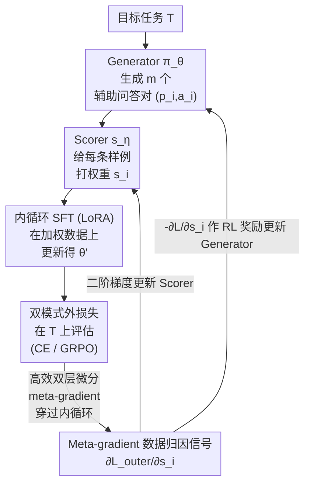

# Test-Time Meta-Adaptation with Self-Synthesis

**会议**: ICLR 2026  
**arXiv**: [2603.03524](https://arxiv.org/abs/2603.03524)  
**代码**: 无  
**领域**: 优化  
**关键词**: 元学习, test-time training, 双层优化, 合成数据, self-adaptation

## 一句话总结

提出 MASS（Meta-Adaptation with Self-Synthesis）框架，通过双层优化元学习让 LLM 在推理时生成问题特定的合成训练数据（Generator）+ 评分筛选（Scorer）+ 加权 SFT 自更新（LoRA），meta-gradient 反向传播穿过内更新以优化数据质量，在 MATH-500 上将 Llama-3.1-8B 从 43.6% 提升至 59.0%。

## 研究背景与动机

**领域现状**：LLM 部署后是静态的，面对新任务/领域无法自适应。Test-time training（TTT）通过在推理时做梯度更新来适应新数据，但朴素实现（用通用数据做 LoRA 更新）容易引入分布漂移，反而降低性能。Self-Instruct / STaR 等方法能让模型自生成合成数据，但无法判断哪些数据真正有利于当前目标任务。

**现有痛点**：

1. 朴素 TTT 使用随机抽取的训练数据做更新 → 与目标问题无关 → 引入漂移（如基线 Base TTT 从 43.6% 降至 41.2%）
2. 模型可以自生成合成数据，但生成质量不可控、与目标任务的相关性未知
3. 缺乏端到端的学习框架来优化"生成什么数据 → 如何筛选 → 如何更新"这一完整流程
4. 高质量任务特定监督稀缺，需要数据高效的自适应策略

**核心矛盾**：模型有能力自生成训练数据，但不知道什么数据真正有用。需要"学会学习"——元学习如何生成和筛选最优的自适应数据。

**本文方案**：将 test-time adaptation 建模为双层优化问题——内层在自生成加权数据上做 SFT LoRA 更新，外层通过 meta-gradient 优化数据生成和评分模块。

## 方法详解

### 整体框架

MASS 把"推理时该用什么数据自适应"建模成一个双层优化问题：底层是一个 Generator $\pi_\theta$ 和一个 Scorer $s_\eta$，前者面对目标任务 $T$ 生成 $m$ 个辅助问题-答案对 $(p_i, a_i)$，后者给每条样例打一个相关性权重 $s_i = s_\eta(T, p_i, a_i)$；上层则在这批加权数据上做一次内循环 SFT（LoRA）得到临时参数 $\theta'$，再用 $\theta'$ 在目标任务上的表现去反推数据该怎么生成、该怎么打分。每一步训练就是"生成 → 打分 → 内循环更新 → 在 $T$ 上算外损失 → meta-gradient 回流更新 $\theta$ 和 $\eta$"这样一个闭环，让模型逐渐学会为自己合成最有用的训练材料。

### 关键设计

**1. Meta-gradient 数据归因信号：判断每条自生成样例到底有没有用**

朴素的自生成数据（Self-Instruct/STaR 那一类）无法回答"这条数据对当前任务到底是帮忙还是添乱"，MASS 直接用外循环损失对样例权重的偏导来量化这件事。它把外损失 $\mathcal{L}_{\text{outer}}$ 对第 $i$ 条样例分数 $s_i$ 的敏感度写成

$$\frac{\partial \mathcal{L}_{\text{outer}}}{\partial s_i} = \left\langle \nabla_{\theta'} \mathcal{L}_{\text{outer}}(\theta'; T), \frac{\partial \theta'}{\partial s_i} \right\rangle$$

这个内积恰好度量"把第 $i$ 条样例的权重往上调，目标任务损失会不会下降"，相当于一个样例级别的因果归因。它有两个去处：一是经由二阶梯度 $\partial \theta'/\partial s_i$ 继续传到 Scorer 参数 $\eta$，让评分器学会给真正有益的样例打高分；二是把符号翻过来，用 $-\partial \mathcal{L}_{\text{outer}}/\partial s_i$ 当作 Generator 的 RL 奖励，以 GRPO 风格的策略梯度更新 $\theta$。这样"生成什么数据"和"如何筛选数据"都被同一个来自目标任务的信号端到端地驱动，而不是靠人工启发式。

**2. 双模式外损失：有标准答案和只有验证器两种部署场景都能训**

外损失的具体形式取决于目标任务能拿到什么监督，MASS 给了两套可切换的实现：

| 场景 | 外损失形式 | 信号来源 |
|------|-----------|---------|
| 有 gold solution | 标准交叉熵 $\text{CE}(R^*, R')$ | 标注答案 |
| 仅有 verifier | GRPO over $k$ 个采样解 | 二元验证结果作奖励 |

有标准解时直接用交叉熵对齐参考解 $R^*$ 与适应后模型的输出 $R'$；只有一个验证器时则对 $k$ 个采样解做 GRPO，把二元的"对/错"判定当奖励。无论哪种设置，回传到 Generator 的策略梯度目标都统一成 clipped PPO 形式

$$\mathcal{L}_{\text{aux}}(\theta) = -\mathbb{E}\left[\frac{1}{m}\sum_{i=1}^m \min\left(\frac{\pi_\theta(y_i|x_i)}{\pi_{\theta_{\text{old}}}(y_i|x_i)}\hat{A}_i, \text{clip}(\cdot, 1\pm\epsilon)\hat{A}_i\right)\right]$$

并额外叠加一项 $\gamma \mathcal{L}_{\text{solve}}$，保证 Generator 在学着造数据的同时不丢掉本身的解题能力。verifier-only 这一路尤其实用，因为它不依赖昂贵的标注答案，方便在大规模部署里直接铺开。

**3. 高效双层微分：让 meta-gradient 真的穿得过内循环**

让梯度穿过内循环 SFT 在实现上是最大的拦路虎——朴素的 reverse-over-reverse 展开要把内循环每一步的中间激活全部存下来，内存直接爆掉。MASS 改用混合模式微分（forward-over-reverse），再配合 block 级重计算和 gradient checkpointing，把显存开销压到可控范围，从而让 meta-gradient 能真正穿过 2 步内循环更新算出来。正是这个工程上的可行性，才使得前两条设计里那套二阶 meta-gradient 信号能落地，而不只是停留在公式上。

## 实验与结果

### 主实验：MATH-500 准确率

| 方法 | MATH-500 准确率 |
|------|:---:|
| Base (Llama-3.1-8B-Instruct) | 43.6% |
| Base TTT (随机训练数据更新) | 41.2% |
| Base TT-SS (自生成数据更新) | 46.6% |
| Solver GRPO (直接 RL 解题) | 49.1% |
| MASSgold (gold solution 外损失) | 54.1% |
| **MASS** (verifier 外损失) | **59.0%** |

关键发现：

- 朴素 TTT 反而降低性能（41.2% < 43.6%）→ 通用数据更新引入漂移
- 无元学习的自生成数据更新（Base TT-SS）仅提升 3.0pp → 生成质量不可控
- MASS 提升 15.4pp（×1.35）→ 元学习数据归因信号是关键
- MASS（verifier only）> MASSgold（gold solution）→ 验证器驱动的探索可能比监督更有效

### 消融实验：各域性能增益

| 数学领域 | Base | MASS | 提升倍率 |
|---------|:---:|:---:|:---:|
| Intermediate Algebra | ~25% | ~48% | **1.92×** |
| Number Theory | ~42% | ~62% | 1.48× |
| Precalculus | ~35% | ~50% | 1.43× |
| Algebra | ~65% | ~78% | 1.20× |
| Counting & Probability | ~50% | ~60% | 1.20× |

MASS 在初始性能最弱的领域提供了最大增益（Intermediate Algebra 1.92×），显示其能有效识别和填补特定领域的知识空白。总体上，MASS 使各领域性能更加均衡。

## 论文评价

### 优点

1. **问题建模优雅**：将"生成什么数据来自适应"建模为双层优化，Generator 和 Scorer 分工明确
2. **Meta-gradient 信号直接**：$\partial \mathcal{L}_{\text{outer}}/\partial s_i$ 提供了数据级别的因果归因信号
3. **数据高效**：每个任务仅生成 12 个辅助样例 + 2 步 LoRA 更新（推理时 6 个 + 1 步）
4. **Verifier-only 设置实用**：不需要 gold solution 也能训练，适合大规模部署
5. **领域自适应显著**：在最弱领域获得最大增益，显示出真正的"学会学习"能力

### 不足

1. 仅在数学推理上验证 → 代码生成、逻辑推理等任务的迁移效果未知
2. 训练仅 100 步 + 使用 1000 个训练样例 → 更大规模训练的 scaling 行为未研究
3. 推理时需要额外的数据生成 + LoRA 更新 → 增加延迟（论文未量化推理开销）
4. Generator 和 Solver 共享同一模型 → 多任务干扰的风险

### 评分

⭐⭐⭐⭐

MASS 将元学习与 test-time training 巧妙结合，用双层优化解决了"自生成数据质量不可控"这一核心痛点。15.4pp 的提升和领域自适应能力令人印象深刻。不过作为 workshop/short paper 级别的工作，实验规模（仅 MATH-500、单一模型）和分析深度（无 scaling 研究、无推理开销分析）还有较大提升空间。框架本身的通用性——将 test-time compute 投入到"学习如何生成有利于自己的训练数据"——是一个很有前景的研究方向。

<!-- RELATED:START -->

## 相关论文

- [\[ICML 2026\] Test time training enhances in-context learning of nonlinear functions](../../ICML2026/optimization/test_time_training_enhances_in-context_learning_of_nonlinear_functions.md)
- [\[CVPR 2025\] Test-Time Augmentation Improves Efficiency in Conformal Prediction](../../CVPR2025/optimization/test-time_augmentation_improves_efficiency_in_conformal_prediction.md)
- [\[ICLR 2026\] Provable and Practical In-Context Policy Optimization for Self-Improvement](provable_and_practical_in-context_policy_optimization_for_self-improvement.md)
- [\[ICLR 2026\] Binomial Gradient-Based Meta-Learning for Enhanced Meta-Gradient Estimation](binomial_gradient-based_meta-learning_for_enhanced_meta-gradient_estimation.md)
- [\[ICLR 2026\] Learning to Solve Orienteering Problem with Time Windows and Variable Profits](learning_to_solve_orienteering_problem_with_time_windows_and_variable_profits.md)

<!-- RELATED:END -->
