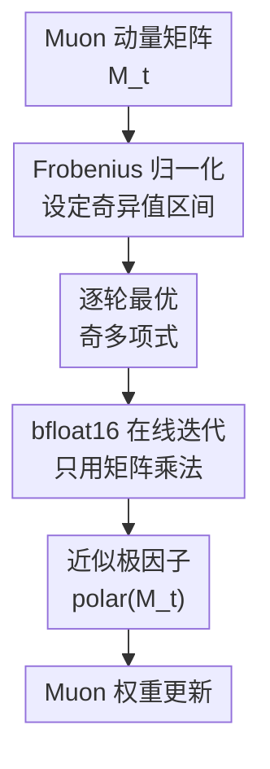

# The Polar Express: Optimal Matrix Sign Methods and their Application to the Muon Algorithm

**会议**: ICLR 2026  
**OpenReview**: [https://openreview.net/forum?id=yRtgZ1K8hO](https://openreview.net/forum?id=yRtgZ1K8hO)  
**代码**: https://github.com/NoahAmsel/PolarExpress  
**领域**: 优化 / 矩阵符号函数 / Muon 优化器  
**关键词**: 矩阵符号函数, 极分解, Muon优化器, Minimax多项式, 低精度训练  

## 一句话总结
Polar Express 把 Muon 中的极分解近似从启发式 Newton-Schulz 系数搜索，改成每轮求解最坏误差最优的奇多项式组合，在保持纯矩阵乘法和 bfloat16 友好的前提下，让 GPT-2 训练中的 Muon 更新方向更快、更稳地逼近有效的极因子。

## 研究背景与动机
**领域现状**：Muon 优化器的核心思想是先对梯度动量矩阵做极分解，再沿着半正交方向更新权重。若动量矩阵 $M=U\Sigma V^\top$，Muon 使用的方向是 $\operatorname{polar}(M)=UV^\top$，这可以看成把所有非零奇异值都映射到 $1$，也就是矩阵符号函数在矩阵优化里的矩形版本。

**现有痛点**：直接用 SVD 计算 $UV^\top$ 在深度学习训练里太贵，也不够 GPU 友好。Muon 因此采用 Newton-Schulz 一类只含矩阵乘法的多项式迭代，但经典 Newton-Schulz 的早期收敛很慢：当初始奇异值离 $1$ 很远时，前很多轮几乎只是在慢慢抬高小奇异值。

**核心矛盾**：深度学习训练并不需要数值线性代数里常见的高精度极分解，它更关心几轮迭代内给出足够好的更新方向；但只追求早期粗精度又容易像 Jordan / You 的启发式系数那样停在某个误差平台，无法真正收敛到极因子。

**本文目标**：作者要设计一种既保留 Muon 所需的纯矩阵乘法、低内存、GPU 高吞吐特性，又能在少数迭代内快速降低误差，并且在迭代继续增加时仍有严格收敛保证的矩阵符号函数方法。

**切入角度**：论文把每一步多项式更新看成在当前奇异值区间 $[\ell_t,u_t]$ 上逼近常数函数 $1$ 的 minimax 问题。与其固定使用同一个 Newton-Schulz 多项式，或用经验目标搜索一串系数，不如每轮都问一个更直接的问题：在给定次数和多项式阶数下，哪一个奇多项式能让最坏奇异值误差最小？

**核心 idea**：Polar Express 用一串逐轮自适应的最优奇多项式组合来近似矩阵符号函数，把 Muon 的极分解子程序从“好用的启发式”推进到“有最坏情形最优性证明的 GPU 友好多项式迭代”。

## 方法详解

### 整体框架
Polar Express 的输入是一个需要极分解近似的矩阵 $M$，输出是 $\operatorname{polar}(M)$ 的低精度近似。方法分为离线和在线两部分：离线阶段根据预设的下界 $\ell$、上界 $u$、迭代轮数 $T$ 和奇多项式阶数 $d$ 预计算每轮系数；在线阶段把这些系数套到当前动量矩阵上，只做矩阵乘法和线性组合。

具体到 Muon，权重更新仍然是 $W_{t+1}=W_t-\lambda\operatorname{polar}(M_t)$，其中 $M_t$ 是梯度动量。Polar Express 只替换 “如何计算 $\operatorname{polar}(M_t)$” 这一步，不改变 Muon 的外层优化规则。

在线迭代的基本形式是 $X_0=M/(\|M\|_F+10^{-2})$，然后每轮应用一个奇多项式 $p_t$：

$$
X_t=p_t(X_{t-1}).
$$

当 $p_t(x)=a_tx+b_tx^3+c_tx^5$ 时，矩形矩阵上的奇次幂不需要显式 SVD，而是通过 $X(X^\top X)^q$ 实现。因此一次五次多项式更新可以写成若干矩阵乘法与线性组合，正好匹配 GPU 上高吞吐的 GEMM 操作。

### 关键设计
**1. 逐轮 minimax 多项式：把“系数调参”改成“最坏误差最优”**

Muon 需要把奇异值从当前区间 $[\ell_t,u_t]$ 尽快推向 $1$。Polar Express 在每轮选择一个奇多项式 $p_t\in P_d^{\mathrm{odd}}$，直接求解

$$
p_t=\arg\min_{p\in P_d^{\mathrm{odd}}}\max_{x\in[\ell_t,u_t]}|1-p(x)|.
$$

这个目标比“训练 loss 上搜索系数”更干净，因为它直接对应极分解近似的谱范数误差。若 $M=U\Sigma V^\top$，则 $p(M)=Up(\Sigma)V^\top$，误差满足 $\|\operatorname{polar}(M)-p(M)\|_2=\max_{\sigma_i}|1-p(\sigma_i)|$。也就是说，标量区间上的均匀逼近问题就是矩阵极分解近似问题本身。

更关键的是，论文证明了这种贪心逐轮选择不是局部凑巧，而是全局最优。设组合多项式 $p^\star=p_T\circ\cdots\circ p_1$，Theorem 3.1 表明它在所有由 $T$ 个 $d$ 阶奇多项式组成的组合里，最小化区间上的最坏误差。这给 Polar Express 一个很强的理论位置：它不是另一组手工 Newton-Schulz 系数，而是在固定迭代预算和多项式阶数下的最优组合。

**2. 区间递推：每轮只需要追踪奇异值上下界**

每轮最优多项式会把当前奇异值区间 $[\ell_t,u_t]$ 映到新的区间 $[\ell_{t+1},u_{t+1}]$。论文利用等振荡性质得到一个很简洁的递推：

$$
\ell_{t+1}=p_t(\ell_t),\qquad u_{t+1}=2-\ell_{t+1}.
$$

这件事让方法非常实用。离线阶段不需要知道每个训练步的真实奇异值分布，只要给一个保守的初始下界和上界，就能预先算好每一轮的多项式系数。在线训练时只读取硬编码系数列表，不需要再跑 Remez 或任何额外优化。

作者默认用 $\|M\|_F$ 做上界归一化并设 $u=1$，对下界则在 bfloat16 场景里取 $\ell=10^{-3}$。这个下界不需要非常准确；实验显示即使和真实最小奇异值相差几个数量级，通常也只是让收敛晚几轮，而不会破坏方法本身。

**3. 五次奇多项式实现：用矩阵乘法保留 Muon 的工程优势**

Polar Express 主要推荐 $d=5$，也就是每轮使用 $p_t(x)=a_tx+b_tx^3+c_tx^5$。对矩形矩阵，$x^3$ 和 $x^5$ 对应的矩阵形式可以写成 $X(X^\top X)$ 和 $X(X^\top X)^2$，因此一次更新可以实现为

$$
X_t=a_tX_{t-1}+b_tX_{t-1}(X_{t-1}^\top X_{t-1})+c_tX_{t-1}(X_{t-1}^\top X_{t-1})^2.
$$

论文给出的 PyTorch 实现还会在高宽比合适时转置矩阵，优先形成较小的 Gram 矩阵，以减少 FLOPs。这样 Polar Express 与 Jordan / You 的 Muon 变体有相近的单轮开销：大家都做五次多项式迭代，差别主要来自系数是否最优和是否会继续收敛。

这个设计也解释了为什么论文没有采用 QDWH、Zolotarev rational iteration 等经典高性能极分解方法。那些方法在数值线性代数里很强，但往往需要矩阵逆、QR 或更复杂的分解；在深度学习训练内循环里，这些操作比矩阵乘法更难吃满 GPU，也更难低精度稳定运行。

**4. 低精度稳定化：为 bfloat16 牺牲一点最优性换实际可用性**

纯理论的最优多项式在有限精度里会遇到两个问题。第一，舍入误差可能让某些奇异值略微超过当前上界 $u_t$，而多项式在区间外可能把这个偏差放大，导致迭代爆掉。作者用 $p_t(x/1.01)$ 替换 $p_t(x)$，相当于给上界留出 1% 的安全余量，最后一轮可不加这个缩放以减少偏差。

第二，最优多项式在区间内会等振荡，某些位置可能把奇异值临时压得很低甚至改变符号，这在 bfloat16 中会造成方向错误。论文借鉴 Chen & Chow 的思路，在早期若 $\ell_t$ 太小，就不直接在 $[\ell_t,u_t]$ 上求极端最优，而是在较厚的区间上求一个稍微保守、振荡更小的多项式。Implementation 2 中这个 “cushion” 会让 $p_t(x)/x$ 保持一个较安全的下界。

这两处修改很小，但很关键：它们让算法能够作为 Muon 的训练内核使用，而不是只在 float64 数值实验中漂亮。最终实现是离线 float64 预计算系数、在线 bfloat16 应用系数，代码短、依赖少、可直接替换已有 Muon 矩阵符号函数实现。

### 损失函数 / 训练策略
Polar Express 本身不是一个带可学习参数的模型，因此没有传统意义上的训练损失。它的“优化目标”是离线构造多项式时的均匀逼近误差，即 $\max_{x\in[\ell_t,u_t]}|1-p_t(x)|$。

用于 GPT-2 训练时，所有 Muon 变体都在相同外层训练设置下比较：矩阵符号函数部分使用 bfloat16，默认五轮 degree-5 多项式迭代；Muon 负责二维及以上参数，embedding、unembedding、位置编码和 RMS norm 等不适合 Muon 的参数仍由 AdamW 处理。这样实验尽量把差异集中在 “极因子近似方法” 上。

## 实验关键数据

### 主实验
论文首先比较不同矩阵符号函数方法嵌入 Muon 后的 GPT-2 训练效果。结果显示，Polar Express 在 GPT-2 Small 和 GPT-2 Large 上都稳定优于 Jordan / You 的启发式多项式版本，并且优势不是某个单点学习率造成的。

| 设置 | 方法 | 最佳学习率 | 最终验证 loss | 说明 |
|------|------|------------|----------------|------|
| GPT-2 Small, FineWeb 1B tokens, 无 weight decay | AdamW | 0.0005 | 4.197 | 非 Muon 基线 |
| GPT-2 Small, FineWeb 1B tokens, 无 weight decay | muon-Jordan | 0.01 | 3.639 | 启发式五次多项式 |
| GPT-2 Small, FineWeb 1B tokens, 无 weight decay | muon-You | 0.01 | 3.629 | 六步启发式系数 |
| GPT-2 Small, FineWeb 1B tokens, 无 weight decay | muon-PolarExp | 0.005 | 3.588 | 本文方法 |
| GPT-2 Large, FineWeb 1B tokens, 无 weight decay | muon-You | 0.02 | 3.399 | 启发式方法 |
| GPT-2 Large, FineWeb 1B tokens, 无 weight decay | muon-Jordan | 0.02 | 3.398 | 启发式方法 |
| GPT-2 Large, FineWeb 1B tokens, 无 weight decay | muon-PolarExp | 0.02 | 3.340 | 本文方法 |

在更长训练上，Polar Express 的优势缩小但仍存在。GPT-2 Large 在 FineWeb 10B tokens、weight decay 0.1 下，muon-Jordan / muon-You / muon-PolarExp 的最佳验证 loss 分别是 2.921、2.919、2.913，说明它不是只在短训练或欠收敛阶段占优。

| 设置 | 方法 | 最佳学习率 | 最终验证 loss | 观察 |
|------|------|------------|----------------|------|
| GPT-2 Large, FineWeb 10B tokens, weight decay 0.1 | muon-Jordan | 0.002 | 2.921 | 长训练仍可用 |
| GPT-2 Large, FineWeb 10B tokens, weight decay 0.1 | muon-You | 0.002 | 2.919 | 与 Jordan 接近 |
| GPT-2 Large, FineWeb 10B tokens, weight decay 0.1 | muon-PolarExp | 0.002 | 2.913 | 小幅但一致领先 |
| GPT-2 Small, FineWeb 10B tokens, 无 weight decay | AdamW | 0.0005 | 3.370 | 非 Muon 基线 |
| GPT-2 Small, FineWeb 10B tokens, 无 weight decay | muon-Jordan | 0.005 | 3.233 | Muon 明显优于 AdamW |
| GPT-2 Small, FineWeb 10B tokens, 无 weight decay | muon-You | 0.005 | 3.234 | 与 Jordan 接近 |
| GPT-2 Small, FineWeb 10B tokens, 无 weight decay | muon-PolarExp | 0.005 | 3.231 | 领先幅度较小 |

### 消融实验
论文的消融重点是：Muon 到底需要多准的极分解？作者用 Polar Express 不同迭代轮数，以及精确 SVD 极因子进行比较。结论很实际：少于 5 轮会明显变差，但超过 6 轮甚至精确 SVD 不再改善验证 loss，而 SVD 会显著增加训练步时间。

| 配置 | 关键指标 | 说明 |
|------|----------|------|
| Polar Express 2-3 轮 | 验证 loss 明显差于 5-6 轮 | 极因子近似过粗，Muon 方向质量不足 |
| Polar Express 5-6 轮 | 达到最佳区间 | 足以处理对优化最重要的奇异方向 |
| Polar Express 10/20/30 轮 | 不再带来验证 loss 改善 | 更高数值精度不等于更好训练 |
| 精确 SVD | 验证 loss 不优于 5-6 轮 Polar Express | 极分解过准没有训练收益 |
| 精确 SVD | 单步时间约翻倍 | 训练内循环不适合用 SVD |

作者还做了一个很有洞察的实验：只改变小奇异值方向的处理方式。若把小于 $10^{-3}\sigma_{\max}$ 的奇异方向截断成 0，甚至反向成 $-1$，训练效果仍然接近真实极因子；这说明 Muon 对极小奇异值方向并不敏感。Polar Express 五轮刚好能把大于约 $10^{-3}$ 的奇异值推近 $1$，这解释了为什么它在数值上还没完全收敛，却已经足够优化。

### 关键发现
- Polar Express 在合成矩阵和 GPT-2 梯度矩阵上的谱范数、Frobenius 范数与 cosine similarity 收敛都优于 Newton-Schulz、Jordan 和 You，尤其是在同样 degree-5、同样迭代次数的公平比较下。
- 经典 Newton-Schulz 具有最终收敛性，但早期迭代太慢；Jordan / You 前期快，但误差会停在平台；Polar Express 同时兼顾前期速度和后期收敛。
- 在语言模型训练里，5 或 6 次迭代是比较合理的工程点，因为继续提高极分解精度不改善 loss，而训练内核的稳定和吞吐更重要。
- 在 CIFAR / ViT 等图像分类补充实验中，Muon 系列整体表现不错，但 Polar Express 的优势没有在所有视觉设置中稳定放大，说明该方法最明确的收益目前仍集中在 LLM 训练与 Muon 的矩阵符号函数子程序上。

## 亮点与洞察
- 最大亮点是把 Muon 里一个看似工程系数调优的问题，重新表述成组合奇多项式的 minimax 逼近问题。这个表述让“为什么这一组系数更好”有了可证明的答案，而不是停留在搜索经验上。
- Theorem 3.1 很漂亮：逐轮贪心求最优多项式，最终组合仍然是全局最坏误差最优。这种结论对实际系统很有价值，因为它允许离线逐步构造系数，而不必一次性解一个巨大的组合优化问题。
- 论文没有盲目追求极分解的高精度，而是认真分析 Muon 真正需要哪部分奇异值方向。小奇异值方向不敏感这一点解释了很多 Muon 经验现象，也给未来优化器设计提供了更清晰的目标。
- 工程上，Polar Express 的形式非常克制：只替换矩阵符号函数计算，不改变 Muon 外层规则；只用矩阵乘法，不引入 QR/SVD；系数可硬编码，在线阶段几乎没有额外控制流。这让理论改进更容易落地。

## 局限与展望
- Polar Express 依赖预设的奇异值下界 $\ell$。虽然论文显示下界错几个数量级通常还能工作，但更自适应、低开销地估计有效谱区间，可能进一步减少迭代轮数或提升稳定性。
- 目前主要收益在 GPT-2 / FineWeb 这类语言模型训练设置中展示。对更大规模模型、不同架构、不同数据配方和更长训练，论文给了积极信号，但仍需要更系统的开放复现。
- 视觉实验里 Polar Express 相比其他 Muon 变体没有稳定大幅领先，说明“更好的极因子近似”并不自动转化为所有任务上的优化收益。任务、模型结构和 Muon 应用到哪些参数上，可能同样关键。
- 论文附录提出了矩形矩阵快速多项式迭代和按 attention head 拆分的 Muon 变体，但在 GPT-2 Small 上没有观察到明显 runtime 收益。更大模型或更高 aspect ratio 的矩阵上，这些想法仍值得继续验证。
- 从优化理论角度看，本文主要保证的是极分解近似误差，而不是完整非凸训练过程的收敛或泛化。把 Polar Express 的近似性质和 Muon 的训练动力学更紧地接起来，是后续理论工作的自然方向。

## 相关工作与启发
- **vs Newton-Schulz**: Newton-Schulz 使用固定 Padé 型奇多项式，优点是简单且最终收敛，缺点是初始阶段对小奇异值推进慢。Polar Express 每轮根据当前区间改系数，因此在同样 degree-5 开销下早期更快，同时保留超指数收敛。
- **vs Jordan / You Muon 系数**: Jordan 和 You 的方法面向 Muon 低精度需求，能很快得到粗略方向，但系数来自启发式搜索，且 Jordan 会停在约 0.3 的误差平台。Polar Express 给出最坏误差最优构造，既能前期快速下降，也能继续逼近真实极因子。
- **vs QDWH / Zolo-pd 等 rational 方法**: 这些方法在传统极分解计算里非常强，常用矩阵逆、QR 或有理函数逼近来获得高精度。Polar Express 放弃这类高精度但不够训练内核友好的操作，选择更适合 GPU 和 bfloat16 的纯多项式路径。
- **vs Chen & Chow / Nakatsukasa & Freund**: 本文继承了自适应缩放、最优逼近和有限精度稳定化的数值线性代数思想，但把它们专门整理成适合 Muon 的奇多项式组合，并证明了组合层面的全局最优性。
- **启发**: 深度学习优化器里的线性代数子程序不一定要照搬传统高精度目标。更好的问题设定可能是：在训练真正敏感的谱区间、固定 GPU 预算和低精度约束下，构造最优近似。

## 评分
- 新颖性: ⭐⭐⭐⭐⭐ 把 Muon 的矩阵符号函数近似提升为可证明最优的组合 minimax 多项式构造，理论和工程结合得很紧。
- 实验充分度: ⭐⭐⭐⭐☆ 语言模型主实验、迭代轮数消融、小奇异值分析和补充视觉实验都比较扎实，但更大模型规模的复现仍有空间。
- 写作质量: ⭐⭐⭐⭐⭐ 论文从 Muon 动机、逼近理论、有限精度实现到训练实验层层推进，读者能清楚看到每个设计为什么必要。
- 价值: ⭐⭐⭐⭐⭐ 对正在快速采用 Muon 的 LLM 训练社区很实用，也为“面向训练内核的数值线性代数”提供了一个范例。

<!-- RELATED:START -->

## 相关论文

- [\[ICLR 2026\] Elastic Optimal Transport: Theory, Application, and Empirical Evaluation](elastic_optimal_transport_theory_application_and_empirical_evaluation.md)
- [\[ICLR 2026\] A Memory-Efficient Hierarchical Algorithm for Large-scale Optimal Transport Problems](a_memory-efficient_hierarchical_algorithm_for_large-scale_optimal_transport_prob.md)
- [\[ICLR 2026\] A Scalable Constant-Factor Approximation Algorithm for $W_p$ Optimal Transport](a_scalable_constant-factor_approximation_algorithm_for_w_p_optimal_transport.md)
- [\[ICLR 2026\] Riemannian Optimization on Relaxed Indicator Matrix Manifold](riemannian_optimization_on_relaxed_indicator_matrix_manifold.md)
- [\[ICLR 2026\] Muon Outperforms Adam in Tail-End Associative Memory Learning](muon_outperforms_adam_in_tail-end_associative_memory_learning.md)

<!-- RELATED:END -->
