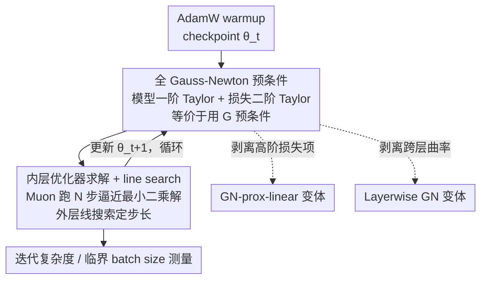

# The Potential of Second-Order Optimization for LLMs: A Study with Full Gauss-Newton

**会议**: ICLR 2026  
**OpenReview**: [https://openreview.net/forum?id=yxEop1S5le](https://openreview.net/forum?id=yxEop1S5le)  
**代码**: https://github.com/natalieabreu/full-gauss-newton  
**领域**: LLM效率 / 优化器  
**关键词**: 二阶优化, Gauss-Newton, 预条件, 临界 batch size, 迭代复杂度

## 一句话总结
这篇论文不设计新优化器，而是用 Jacobian-vector product 在 45M/150M 的 LLaMA 上**真刀真枝地跑完整的 full Gauss-Newton（GN）预条件**，把它当成二阶优化的「性能上界」来回答一个问题：现有 SOAP/Muon/Shampoo 这些用近似 Hessian 的二阶方法到底还差多少——结果发现 full GN 在大 batch 下把达到目标 loss 的迭代步数比 SOAP 砍掉 5.4×、比 Muon 砍掉 16×，而且只用逐层（layerwise）曲率、完全忽略跨层信息，就能几乎追平 full GN。

## 研究背景与动机
**领域现状**：LLM 预训练的串行墙越来越高（动辄数天到数月），优化器成了压缩训练时间的核心抓手。主流仍是一阶方法 Adam/SGD，但近两年二阶方法（Shampoo、SOAP、Muon）势头很猛——Shampoo 拿下 AlgoPerf 基准、比 Adam 快 28%，Muon 被放大到 16B 模型上比 AdamW 快 50%。它们之所以能加速，理论上来自二阶方法更快的收敛率，以及能撑住更大的 batch size（提升数据并行效率）。

**现有痛点**：但这些「二阶」方法其实都没用完整的二阶信息。真正存储或求逆 LLM 的 Hessian（参数量是十亿级）在计算和显存上完全不可行，所以 SOAP/Shampoo/Muon 都退而求其次，用**逐层、计算高效的 Hessian 近似**来做预条件。问题是：这些近似到底牺牲了多少性能？没人量化过。

**核心矛盾**：人们一直在「近似得更便宜」这条线上卷，却始终缺一个参照系——**理想的、完整的二阶方法到底能做到多好**，以及 Hessian 的哪些结构性质（跨层信息？高阶损失项？）才是性能的关键来源。没有这个上界，就无法判断现有方法是已经逼近极限、还是仍有巨大空间。

**本文目标**：(1) 建立完整二阶优化的实际性能上界；(2) 拆解出 Hessian 里哪些结构是必需的——具体看两件事：跨层曲率信息重不重要、损失函数的高阶项重不重要。

**切入角度**：作者不追求便宜，而是不计成本地把 full Gauss-Newton 矩阵当预条件器真跑出来。GN 矩阵是 Hessian 的第一项分解，对交叉熵/MSE 损失天然半正定（PSD），避免了 Newton 法因负曲率发散的问题，是「理想二阶」的合理替身。

**核心 idea**：用 Jacobian-vector product 绕开显式存储 Hessian——把模型做一阶 Taylor 线性化、把损失做二阶 Taylor 展开，则「在这个二次近似上求极小」在数学上**等价于**用 GN 矩阵做预条件；再用一个内层优化器（Muon）去解这个最小二乘子问题，就能在不 materialize 任何 $n\times n$ Hessian 的前提下，得到完整 GN 更新。

## 方法详解

### 整体框架
论文要解决的是「测出二阶优化的性能天花板」，所以整体不是一个新优化器，而是一套**每步都求解一次完整 GN 更新**的训练流程。核心难点是 GN 矩阵 $G := \nabla_\theta f(\theta)^\top \nabla_z^2 L(\theta) \nabla_\theta f(\theta)$ 根本存不下，理想的 Newton/GN 更新 $\theta^* = \theta - G^{-1}g$ 无法直接算。

作者的转化是：在当前参数 $\theta_t$ 处，先把模型 $f$ 做一阶 Taylor 展开得到线性化模型 $f^{(1)}_{\theta_t}$，再把损失在这个线性化模型上做二阶 Taylor 展开得到 $\tilde{L}^{(2)}_{\theta_t}(\theta)$，于是这一步的更新就定义为

$$\theta^* = \arg\min_\theta \tilde{L}^{(2)}_{\theta_t}(\theta)$$

可以证明，这个最小化问题的解等价于用 GN 矩阵做预条件的更新（证明用到 Martens & Sutskever 的等价性，配合 JVP 实现，全程不显式构造 Hessian）。由于这个最小二乘子问题没法直接解，作者再嵌一个**内层优化器**——用 Muon 跑 $N$ 步去逼近 $\theta^*$，然后对外层做一次 **line search** 控制步长，得到真正的 $\theta_{t+1}$，循环到下一步。全局 batch size 记为 $b = N \times b_{\text{inner}}$（内层 batch 乘内层步数，即每次外层更新真正看过的数据量）。

为了隔离 Hessian 里到底哪部分信息重要，作者在主方法旁边挂了两个**结构消解变体**做对照：去掉损失高阶项的 GN-prox-linear，和去掉跨层曲率的 Layerwise GN。整条流程从一个 AdamW warmup checkpoint（5% Chinchilla token）出发，保证所有方法同起点公平比较。

### 关键设计

**1. 全 Gauss-Newton 预条件：用 JVP 把不可行的 $G^{-1}g$ 变成可解的最小二乘**

直接痛点是 LLM 的 Hessian / GN 矩阵存不下、求不了逆。作者用的是一个等价改写：理想 GN 更新 $\theta^* = \theta - G^{-1}g$，等价于在「模型一阶线性化 + 损失二阶展开」后的凸二次目标 $\tilde{L}^{(2)}_{\theta_t}(\theta)$ 上求极小。关键在于这个目标只需要 Jacobian-vector product 就能算梯度和 Hessian-向量乘，**完全不用把 $G$ 显式 materialize**（实现借助 neural-tangents 库做 Taylor 近似）。之所以选 GN 而不是完整 Hessian，是因为 Hessian 对神经网络不保证 PSD，Newton 法会因负曲率产生「不可信更新」甚至发散；而 GN 矩阵是 Hessian 分解的第一项 $\nabla_\theta f^\top \nabla_z^2 L \nabla_\theta f$，丢掉了模型自身的曲率、只保留损失的曲率，对交叉熵/MSE 天然 PSD，因此每步更新都可信。这套实现比标准训练慢约 1.5×，但作者明说这是「概念验证 / 分析工具」，目的是给便宜的近似方法一个可追赶的上界，而非直接拿去用。

**2. 内层优化器 + line search：把「解子问题」这件难事做稳**

GN 子问题 $\arg\min_\theta \tilde{L}^{(2)}_{\theta_t}(\theta)$ 没有闭式解，作者用一个**内层优化器**迭代求解——实测 Muon 当内层优化器明显优于 AdamW，跑 $b_{\text{inner}}=32$（45M）/ $128$（150M）、$N$ 步。但高学习率下 GN 极不稳定，作者发现两个稳定性要素是关键：其一，**line search** 对收敛稳定性「必不可少」，外层用线搜索 $\alpha^* = \arg\min_\alpha L(\theta_t + \alpha(\hat\theta - \theta_t))$ 控制每步走多远；其二，**跨迭代共享信息**——把下一步内层最小化的初始参数设成上一步「线搜索之前」的参数，能进一步提速。这两点与 Martens (2010) 在 Hessian-free 优化里的发现一致（回溯 + 跨步共享信息有帮助）。作者也坦承：内层优化器和跨步共享如此重要，恰说明他们**并没有每步都解出精确的 GN 更新**——也就是说，真正精确的 full GN 性能可能比论文测出来的还要好，当前结果是个偏保守的上界。

**3. 两个结构消解变体：拆出 Hessian 里到底哪部分信息在起作用**

光有一个上界数字还不够，作者要回答「哪些结构性质是必需的」，于是设计两个对照变体，各自精准抹掉一类信息。**GN-prox-linear**：不用损失的二阶 Taylor 展开，而是直接在线性化模型上最小化**完整损失** $\arg\min_\theta \tilde{L}_{\theta_t}(\theta)$（对凸损失仍是凸问题，与核化分类相关）——它保留了损失的高阶项，因此和 GN 的差距就揭示了「高阶损失项到底有没有用」。**Layerwise GN**：对每一层单独做 Taylor 展开、单独解二阶子问题 $\theta_{l,t+1} = \arg\min_{\theta_l}\tilde{L}^{(2)}_{\theta_{l,t}}(\theta_l)$，固定其他层不动，最后把各层更新合并再做一次全局 line search——它**完全忽略跨层曲率信息**，因此和 full GN 的差距就揭示了「跨层 Hessian 信息到底有多重要」。这两个变体是本文「分析」属性的精髓：不是为了更好，而是为了做受控的「剥离实验」。

### 损失函数 / 训练策略
模型：45M 与 150M 参数的 LLaMA，数据集 C4，序列长 1024，按 Chinchilla-optimal token 量训练（150M 跑 3B token）。基线 AdamW / Muon / SOAP 都做了学习率、weight decay、weight averaging decay 及各自 $\beta/\mu$ 的超参扫描。学习率调度试了 global cosine、global+inner cosine、constant+inner cosine 三种：小/中 batch 用 global cosine 最好，大 batch 下 constant+inner cosine 对 GN 有帮助。正则化分内层（优化器 weight decay + 对参数更新 $\ell_2$ 范数的损失项）和外层（line search）两类。注意 GN-prox-linear 不需要 line search、且内层用 global cosine 反而更好。

## 实验关键数据

### 主实验：迭代复杂度（达到 loss 3.25 所需步数，大 batch 区）
batch 选在各方法临界 batch 之上（AdamW/Muon 用 40M token，SOAP/GN 用 240M token），使得再加 batch 也不再减少步数。

| 方法 | 达到 loss 3.25 的步数 | 相对 GN 的差距 |
|------|----------------------|----------------|
| Gauss-Newton（本文上界） | **54** | 1× |
| Layerwise GN | 78 | 1.4× |
| SOAP | 292 | 5.4× |
| Muon | ~864（16× GN） | 16× |
| AdamW | 更慢 | — |

GN 在前 10 步进展极快：10 步后 loss 已低于 3.75，而其他方法基本还卡在起点附近。layerwise 仅比 full GN 多 1.4× 步数，却仍比 SOAP 快 3.4×。

### 固定 token 量 / 大 batch 表现（150M，3B token）

| 配置 | 结果 | 说明 |
|------|------|------|
| GN @ batch 120M | loss **3.45**，仅 20 步优化 | 大 batch 下依然强 |
| AdamW @ batch 1.2M | loss 3.4 | 小 batch 才能到的水平 |
| AdamW @ batch 120M | loss >4.4 | 大 batch 直接崩 |
| SOAP vs GN @ batch ≤4M | 接近 | 小 batch 下 GN 优势不明显 |
| SOAP vs GN @ batch >4M | GN 显著领先 | 优势全在大 batch 区 |

### 消融 / 结构分析

| 配置 | 关键现象 | 揭示的结论 |
|------|---------|-----------|
| Full GN | 54 步、临界 batch 持续延伸到 40M+ | 完整二阶上界，临界 batch 近最优扩展 |
| GN-prox-linear（保留高阶损失项） | 与 GN 几乎重合 | **高阶损失项对加速不是必需的** |
| Layerwise GN（去掉跨层曲率） | 78 步，逼近 full GN | **逐层 Hessian 信息已足够拿到大部分收益** |
| SOAP（现有最优近似） | 与理想 layerwise oracle 仍差 3.4× | 现有近似方法与上界之间存在显著 gap |

### 关键发现
- **高阶损失项可以丢**：GN-prox-linear 保留了损失的高阶信息却和 GN 几乎一样，说明二阶（GN）已经够用，更高阶的损失曲率对收敛速度不是关键。
- **跨层曲率大部分可以丢**：layerwise GN 完全忽略跨层信息，仅多 1.4× 步数，意味着「把每层的 Hessian 近似做得更准」这条路（正是 SOAP/Shampoo 的方向）理论上能拿到接近 full GN 的收益。
- **临界 batch size 大幅扩展**：full GN 在 40M token 仍在持续降步数，而 AdamW 在 4M、SOAP/Muon 在 12M 左右就趋平，GN 的数据并行效率近最优。
- **优势区在大 batch**：小 batch（≤4M）下 GN 和 SOAP 接近，全部增益都来自大 batch 区——与「预条件收益在大 batch 才显现」的已有理论一致。

## 亮点与洞察
- **把「上界」当一等公民来做**：论文最巧的不是算法而是定位——主动放弃便宜，花 1.5× 的代价跑出完整 GN，给整个二阶优化社区立了一个可追赶的标尺，回答了「现有近似还差多少」这个一直悬而未决的问题。
- **JVP + 内外双层优化绕开 Hessian**：用「模型一阶线性化 + 损失二阶展开 + 内层 Muon 求解最小二乘」把不可行的 $G^{-1}g$ 变成可跑的子问题，这套构造可复用到任何想测「理想二阶」的场景。
- **两个受控剥离实验**：GN-prox-linear 和 layerwise GN 不是为了更好，而是像做对照组一样分别抹掉「高阶损失项」和「跨层信息」，干净地把两个因子的贡献拆开——这种「为分析而设计变体」的范式很值得借鉴。
- **给优化器研究指了方向**：layerwise 几乎追平 full GN，等于告诉做近似优化器的人——别纠结跨层信息，把单层 Hessian 近似做准就够了。

## 局限与展望
- **规模小**：只做到 150M 参数、3B token，离真实 LLM（十亿级）还差几个数量级，结论能否外推到大模型未验证。
- **不是实用优化器**：当前实现比标准训练慢约 1.5×，作者明确说这是概念验证/分析工具，不能直接用于生产训练。
- **拿到的可能不是精确 GN**：内层优化器和跨步共享信息如此关键，说明每步未必解出精确 GN 更新——测出的上界偏保守，真正的 full GN 可能更强。
- **只用了 $G^{-1}$ 作预条件**：作者承认对完整二阶优化可能有更好的用法（如阻尼、不同的逆近似），留作未来工作。
- **超参/正则策略未必最优**：虽然做了大量扫描，但 GN 高学习率下的稳定性高度依赖 line search 和调度选择，仍有调优空间。

## 相关工作与启发
- **vs SOAP / Shampoo**: 它们用计算高效的逐层 Hessian 近似（Shampoo 维护左右两个预条件矩阵），本文不做近似、直接跑完整 GN，结果显示 SOAP 与理想 layerwise oracle 仍差 3.4×——给了这条近似路线一个明确的改进上限。
- **vs Muon**: Muon 用 Newton-Schulz 正交化做更新、可看作不带预条件累积的 Shampoo；本文反而把 Muon 当成内层优化器去解 GN 子问题，是「用一阶/近似二阶方法去逼近完整二阶」的巧妙复用。
- **vs Hessian-free 优化（Martens 2010）**: 经典 Hessian-free 用共轭梯度（CG）解未收敛的 Newton 步、面向分类/自编码器；本文同样靠 Hessian-vector/JVP 避免显式 Hessian，但聚焦 LLM，且用专为 LLM 设计的 Muon/Adam 替代 CG，并印证了 Martens 关于「跨迭代共享信息 + 回溯」的发现。

## 评分
- 新颖性: ⭐⭐⭐⭐⭐ 不是新算法而是新定位——首次把 full GN 当性能上界量化二阶优化的潜力，视角独特。
- 实验充分度: ⭐⭐⭐⭐ 迭代复杂度 + 临界 batch + 两个结构剥离变体，分析很完整；但规模止于 150M，外推性存疑。
- 写作质量: ⭐⭐⭐⭐⭐ 问题动机清晰、三条结论层层递进，把「为什么做上界」讲得很透。
- 价值: ⭐⭐⭐⭐⭐ 给二阶优化器研究立了标尺并指明方向（把单层 Hessian 近似做准即可），实践指导意义强。

<!-- RELATED:START -->

## 相关论文

- [\[ICLR 2026\] Scalable Second-Order Riemannian Optimization for K-means Clustering](scalable_second-order_riemannian_optimization_for_k-means_clustering.md)
- [\[AAAI 2026\] FedPM: Federated Learning Using Second-order Optimization with Preconditioned Mixing of Local Parameters](../../AAAI2026/optimization/fedpm_federated_learning_using_second-order_optimization_with_preconditioned_mix.md)
- [\[ICML 2025\] Sassha: Sharpness-aware Adaptive Second-order Optimization with Stable Hessian Approximation](../../ICML2025/optimization/sassha_sharpness-aware_adaptive_second-order_optimization_with_stable_hessian_ap.md)
- [\[ICLR 2026\] Convergence of Regret Matching in Potential Games and Constrained Optimization](convergence_of_regret_matching_in_potential_games_and_constrained_optimization.md)
- [\[NeurIPS 2025\] Second-Order Optimization Under Heavy-Tailed Noise: Hessian Clipping and Sample Complexity](../../NeurIPS2025/optimization/second-order_optimization_under_heavy-tailed_noise_hessian_clipping_and_sample_c.md)

<!-- RELATED:END -->
