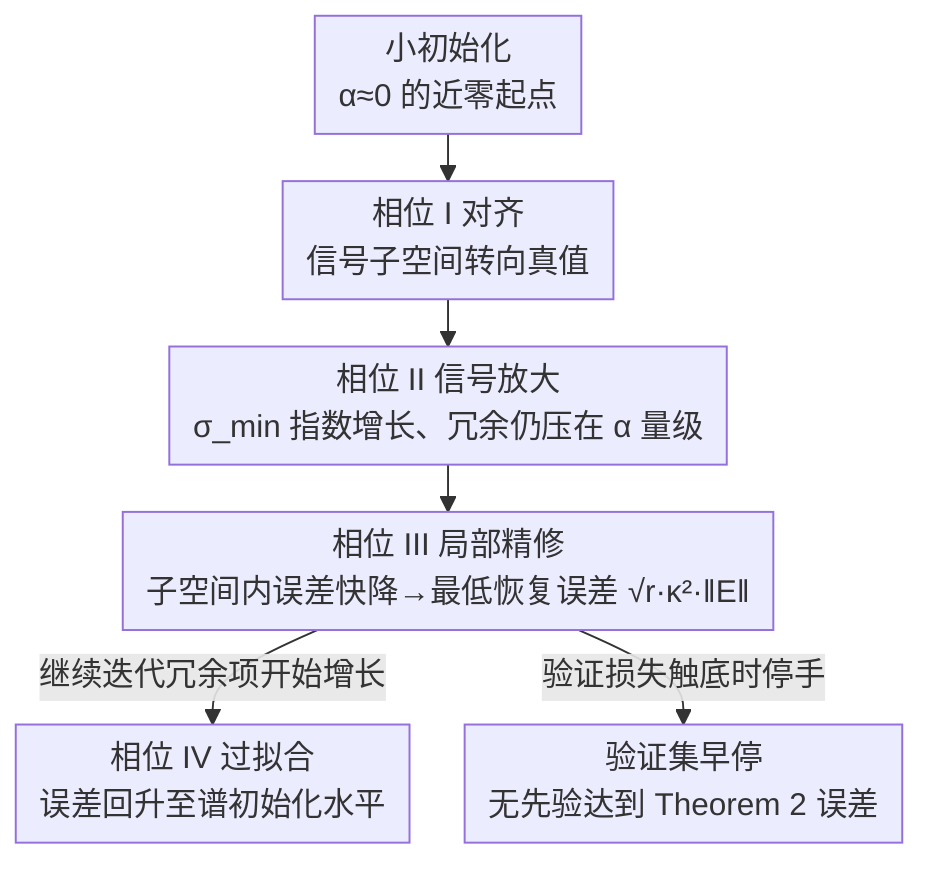

# The Power of Small Initialization in Noisy Low-Tubal-Rank Tensor Recovery

**会议**: ICLR 2026  
**OpenReview**: [https://openreview.net/forum?id=6lobo2PXdl](https://openreview.net/forum?id=6lobo2PXdl)  
**代码**: 待确认  
**领域**: 优化理论 / 低秩张量恢复 / 隐式正则化  
**关键词**: 低 tubal-rank 张量恢复, 因子化梯度下降, 小初始化, 过参数化, minimax 最优, 早停

## 一句话总结
在带噪声、过估计 tubal-rank 的低秩张量恢复中，本文证明把因子化梯度下降（FGD）的初始化尺度取到接近 0（小初始化），就能让最终恢复误差只依赖于真实 tubal-rank $r$、而与被高估的秩 $R$ 无关，从而逼近信息论 minimax 下界，并用验证集早停在无任何先验的情况下达到该误差。

## 研究背景与动机

**领域现状**：高光谱图像、视频、传感器阵列这类多维数据在张量形式下天然低秩，许多反问题（图像补全、压缩成像、背景建模、CT 重建）都能写成"从少量含噪线性测量 $y=\mathcal{M}(\mathcal{X}^\star)+s$ 中恢复低秩张量"。在 t-SVD / t-product 框架下，秩用 tubal-rank 刻画。直接做核范数最小化需要反复算 t-SVD，维度一大就很贵；于是更流行的做法是借鉴矩阵的 Burer–Monteiro 分解，把大张量写成两个小因子张量的 t-product $\mathcal{U}*\mathcal{U}^\top$，再对因子做因子化梯度下降（FGD），大幅省算力。

**现有痛点**：FGD 需要知道真实 tubal-rank $r$，可现实中 $r$ 往往未知，只能取一个偏大的估计秩 $R>r$（即"过参数化 / over-rank"）。问题在于：当测量被稠密噪声（如高斯噪声）污染时，过参数化会放大误差。Liu et al. (2024b) 证明谱初始化下 FGD 的恢复误差随高估秩 $R$ 线性增长——$R$ 估得越离谱，误差越大；而且过参数化还会让收敛从线性退化为亚线性，明显变慢。

**核心矛盾**：误差对 $R$ 的依赖来自"过参数化方向"上累积的噪声分量。谱初始化给的是一个能量已经铺满整个 $R$ 维因子空间的起点，噪声在所有 $R$ 个方向上同时被拟合，于是误差自然带上 $R$。要想让误差只认真实秩 $r$，就得想办法让多出来的 $R-r$ 个冗余方向"长不起来"。

**本文目标**：能否在带噪声的过参数化低秩张量恢复中，得到一个**只依赖真实 tubal-rank $r$、与高估秩 $R$ 无关**的误差上界，并且这个误差在实践中可被无先验地达到？

**切入角度**：作者观察到一个反直觉现象（图 1）——把初始化尺度取到近乎为 0 时，FGD 会先线性收敛到与"已知精确秩"相同的低误差，停在那里一段时间，之后误差才慢慢爬升回谱初始化的水平。这说明小初始化制造了一个"低误差窗口"，关键是要在数学上刻画这个窗口何时出现、何时关闭。

**核心 idea**：用小初始化代替谱初始化，使信号方向先快速放大、冗余方向长期被压在初始化量级，再配合验证集早停在低误差窗口内停手——这样恢复误差只依赖 $r$，逼近 minimax 最优。

## 方法详解

### 整体框架

本文不是提出新算法，而是**为"小初始化 + FGD + 早停"这套朴素流程建立一套四阶段分析框架，给出迄今最紧的误差上界**。算法本身极简：把对称半正定的真张量记作 $\mathcal{X}^\star=\mathcal{X}*\mathcal{X}^\top$（$\mathcal{X}\in\mathbb{R}^{n\times r\times k}$），用 $\mathcal{U}\in\mathbb{R}^{n\times R\times k}$ 做过参数化分解，最小化

$$\min_{\mathcal{U}}\ f(\mathcal{U})=\frac{1}{4m}\big\|y-\mathcal{M}(\mathcal{U}*\mathcal{U}^\top)\big\|^2,$$

FGD 更新为 $\mathcal{U}_{t+1}=\mathcal{U}_t-\eta\cdot\big(\frac{1}{m}\mathcal{M}^*\mathcal{M}(\mathcal{U}_t*\mathcal{U}_t^\top-\mathcal{X}^\star)-\mathcal{E}\big)*\mathcal{U}_t$，其中初始点每个元素 i.i.d. 采自 $\mathcal{N}(0,\alpha^2/R)$，$\alpha$ 是初始化尺度，$\mathcal{E}=\frac{1}{m}\mathcal{M}^*(s)$ 是噪声项。

分析的核心动作是把因子 $\mathcal{U}_t$ **分解成"信号项"和"过参数化项"**：借助真张量列空间 $\mathcal{V}_{\mathcal{X}}$，对 $\mathcal{V}_{\mathcal{X}}^\top*\mathcal{U}_t$ 做 t-SVD 得到对齐子空间 $\mathcal{W}_t$，则

$$\mathcal{U}_t=\underbrace{\mathcal{U}_t*\mathcal{W}_t*\mathcal{W}_t^\top}_{\text{信号项}}+\underbrace{\mathcal{U}_t*\mathcal{W}_{t,\perp}*\mathcal{W}_{t,\perp}^\top}_{\text{过参数化项}}.$$

三个标量量刻画动力学：信号强度 $\sigma_{\min}(\mathcal{U}_t*\mathcal{W}_t)$、冗余能量 $\|\mathcal{U}_t*\mathcal{W}_{t,\perp}\|$、信号与真值的子空间对齐度 $\|\mathcal{V}_{\mathcal{X}_\perp}^\top*\mathcal{V}_{\mathcal{U}_t*\mathcal{W}_t}\|$。整条 FGD 轨迹被切成四个相位，误差最低点出现在第三相位，第四相位误差回升——这正是早停要拦截的地方。

### 关键设计

**1. 小初始化：让恢复误差与高估秩 $R$ 解耦**

这一条直接打掉"误差随 $R$ 线性增长"的痛点。谱初始化的起点能量铺满全部 $R$ 个因子方向，噪声被所有方向同时拟合；小初始化（实验里 $\alpha=10^{-10}$）则让所有方向都从近零出发，梯度动力学使真实信号占据的 $r$ 个方向因为有真值"引力"而指数放大，而多余的 $R-r$ 个方向缺乏放大源、长期停留在初始化量级 $\alpha$。在最低误差相位，过参数化项 $\|\mathcal{U}_t*\mathcal{W}_{t,\perp}\|^2$ 几乎可忽略，误差由子空间内分量主导。借助列空间投影 $\mathcal{V}_{\mathcal{X}}$ 的一个关键不等式

$$\|\mathcal{V}_{\mathcal{X}}^\top*(\mathcal{U}_t*\mathcal{U}_t^\top-\mathcal{X}^\star)\|_F\le \sqrt{r}\,\|\mathcal{V}_{\mathcal{X}}^\top*(\mathcal{U}_t*\mathcal{U}_t^\top-\mathcal{X}^\star)\|,$$

最终误差被控制成 $\|\mathcal{U}_{\hat t}*\mathcal{U}_{\hat t}^\top-\mathcal{X}^\star\|_F\lesssim\sqrt{r}\,\kappa^2\|\mathcal{E}\|$——只含真实秩 $r$、条件数 $\kappa$ 和噪声谱范数 $\|\mathcal{E}\|$，**完全不含 $R$**（Theorem 2）。这是已知第一个与高估张量秩无关的误差界，且对噪声分布不做具体假设，只要 $\|\mathcal{E}\|\le c\kappa^{-2}\sigma_{\min}^2(\mathcal{X})$。Theorem 2 还按 $R=r$、$r<R<3r$、$R\ge 3r$ 三种过估计程度分别给出对初始化尺度 $\alpha$ 的上界和所需迭代步数 $\hat t$，越过估、$\alpha$ 要越小。

**2. 四阶段轨迹分析：刻画"低误差窗口"为何出现又为何关闭**

要证明上面的误差界，必须精确追踪信号项与冗余项随时间的此消彼长，本文为此把 FGD 轨迹切成四个相位：**(I) 对齐相**——对齐度 $\|\mathcal{V}_{\mathcal{X}_\perp}^\top*\mathcal{V}_{\mathcal{U}_t*\mathcal{W}_t}\|$ 下降，信号子空间转向真值，此时信号与冗余都还很小；**(II) 信号放大相**——$\sigma_{\min}(\mathcal{U}_t*\mathcal{W}_t)$ 指数增长直到至少 $\sigma_{\min}(\mathcal{X})/\sqrt{10}$，冗余项仍停在初始化尺度；**(III) 局部精修相**——误差被拆成 $\|\mathcal{U}_t*\mathcal{U}_t^\top-\mathcal{X}^\star\|\le 4\|\mathcal{V}_{\mathcal{X}}^\top*(\mathcal{U}_t*\mathcal{U}_t^\top-\mathcal{X}^\star)\|+\|\mathcal{U}_t*\mathcal{W}_{t,\perp}\|^2$，冗余平方项小、子空间内误差快速下降，到达全局最低误差；**(IV) 过拟合相**——冗余项 $\|\mathcal{U}_t*\mathcal{W}_{t,\perp}\|$ 最终也开始增长，整体误差回升并逼近谱初始化的水平。

相比 Karnik et al. (2025) 把无噪声轨迹只分成"谱阶段 + 收敛阶段"两段，本文的四相分解能逐相追踪噪声演化，因而能在含噪声下拿到 minimax 级别的保证。把这套框架退化到 $k=1$（第三维为 1）就回到矩阵情形，t-product 退化为矩阵乘法。但张量情形并非平凡推广：当真张量的某些 tube 在傅里叶域不可逆时，值域与核不再互补、信号/冗余分解会失效，需要更精细的张量条件数；且测量算子会在所有频率切片间耦合信息，无法像 power method 那样逐切片独立分析。

**3. minimax 下界：证明这个误差界"几乎到顶"**

光有上界不够，还要回答"这已经多好了"。本文针对高斯噪声情形导出信息论 minimax 下界（Theorem 3）：在 $(r,\delta)$ t-RIP、$s\sim\mathcal{N}(0,\sigma^2 I)$ 下，任意估计量 $\mathcal{X}^{est}$ 的最坏均方误差满足

$$\sup_{\mathcal{X}^\star}\mathbb{E}\|\mathcal{X}^{est}-\mathcal{X}^\star\|_F^2\ge\frac{1}{1+\delta}\cdot\frac{nrk\sigma^2}{m},$$

即没有任何方法能把误差一致压到 $\Theta(nrk\sigma^2/m)$ 之下。与之配套，Corollary 1 证明高斯噪声下小初始化 FGD 的误差为 $\|\mathcal{U}_{\hat t}*\mathcal{U}_{\hat t}^\top-\mathcal{X}^\star\|_F^2\lesssim nkr\kappa^4\sigma^2/m$，与下界相比只差常数因子和对条件数 $\kappa$ 的依赖，因而是**近 minimax 最优**。样本复杂度方面，本文只需 $(2r+1,\delta)$ t-RIP（$m\gtrsim nkr/\delta^2$），而 Liu et al. (2024b) 需要 $(4R,\delta)$ t-RIP，采样需求随过估计程度上升——本文的需求与 $R$ 无关，这也是张量设定下首个 minimax 误差分析。

**4. 验证集早停：无先验地抵达最低误差**

Theorem 2 给出的最优停步 $\hat t$ 依赖未知的 $\mathcal{X}^\star$，停太早或太晚（落进相位 IV）误差都会变大，工程上没法直接用。本文用机器学习里常见的验证—早停来定位相位 III 的最低点：把观测 $\{\mathcal{A}_i,y_i\}_{i=1}^m$ 随机切成训练集与验证集，只用训练集跑 FGD，每步算验证损失 $e_t=\frac14\|y_{val}-\mathcal{M}_{val}(\mathcal{U}_t*\mathcal{U}_t^\top)\|^2$，取 $\check t=\arg\min_t e_t$ 对应的 $\mathcal{U}_{\check t}*\mathcal{U}_{\check t}^\top$ 作为输出。Theorem 4 给出理论保证：当验证样本数满足 $m_{val}\ge C_1\frac{m_{train}^2\log T}{(rnk\kappa^4)^2}$ 时，验证选出的解仍满足 $\|\mathcal{U}_{\check t}*\mathcal{U}_{\check t}^\top-\mathcal{X}^\star\|_F^2\le C\,nkr\sigma^2\kappa^4/m_{train}$，即匹配 Theorem 2 的上界。代入 $m_{train}\gtrsim nkr^2\kappa^8$ 后验证集只需 $m_{val}\gtrsim r^2\kappa^8\log T$，相对训练集很小、实践可行；实验进一步显示取总样本的 5%–10% 作验证集即可。

### 损失函数 / 训练策略
目标函数即测量残差平方 $f(\mathcal{U})=\frac{1}{4m}\|y-\mathcal{M}(\mathcal{U}*\mathcal{U}^\top)\|^2$；优化用固定步长 FGD。关键超参是初始化尺度 $\alpha$（小初始化取 $10^{-10}$、大初始化取 $10$ 并把步长降到 $0.001$ 防发散）、步长 $\eta$、验证比例 $m_{val}/m$（推荐 5%–10%）以及由验证损失触发的早停步 $\check t$。

## 实验关键数据

仿真设置：合成 $\mathcal{X}^\star=\mathcal{X}*\mathcal{X}^\top$（元素采自 $\mathcal{N}(0,1)$ 后归一化），高斯测量算子，噪声 $s\sim\mathcal{N}(0,\sigma^2)$，$n=30,k=3,r=3$，用相对平方误差 RSE $=\|\mathcal{U}_t*\mathcal{U}_t^\top-\mathcal{X}^\star\|_F^2/\|\mathcal{X}^\star\|_F^2$ 衡量，重复 20 次。对比四种起点：精确秩 baseline、谱初始化、大随机初始化、小随机初始化（取最优步 best / 验证早停 ES）。

### 主实验（仿真，图 2 关键结论）

| 变化维度 | 谱初始化 / 大随机初始化 | 小初始化（best/ES） |
|----------|------------------------|---------------------|
| 过估计秩 $R$ 增大 | 误差随 $R$ 单调上升、明显高于小初始化 | 始终贴住 baseline，与 $R$ 无关 |
| 噪声 $\sigma$ 增大 | 高于小初始化 | 贴住 baseline |
| 维度 $n$ 增大 | 迭代足够多时与谱初始化持平 | 贴住 baseline |
| 测量数 $m=2C_m nrk$ 减小 | 误差偏高 | $m=3nrk$ 仍低误差，样本复杂度更省 |

核心观察：四种设置下小初始化都取得与"已知精确秩"相同的最低误差；ES 版在无任何先验下也逼近 baseline；谱/大随机初始化误差随高估秩增长且更高，大随机初始化因收敛慢误差尤其大。

### 真实数据实验（彩色图像补全，Table 2 摘录，$p=0.3$）

| 方法 | $\sigma=0.07$ PSNR↑ | RE↓ | $\sigma=0.1$ PSNR↑ | RE↓ |
|------|------|------|------|------|
| TCTF（秩估计） | 20.67 | 0.2008 | 20.63 | 0.2024 |
| TNN（凸核范数） | 22.06 | 0.1681 | 20.17 | 0.2082 |
| GTNN（非凸） | 23.15 | 0.1481 | 21.11 | 0.1867 |
| **FGD-ES（本文早停）** | 23.66 | 0.1426 | 22.72 | 0.1585 |
| **FGD-best（本文最优步）** | **23.84** | **0.1395** | **22.86** | **0.1559** |

在 Berkeley 数据集 50 张 $481\times321\times3$ 彩色图、Bernoulli 采样 + 高斯噪声的补全任务上，FGD-best 在各采样率/噪声组合下 PSNR 全面领先，FGD-ES 略低但仍优于所有对比方法；值得注意的是张量补全并不满足 t-RIP，小初始化依然取得最低重建误差。

### 关键发现
- **小初始化是误差与 $R$ 解耦的唯一关键开关**：同样 FGD、同样早停，仅把起点尺度从谱/大随机换成近零，误差就从"随 $R$ 线性增长"变成"恒等于精确秩 baseline"。
- **验证集比例存在甜区**：验证样本太多会挤占训练数据使误差上升、太少（<5%）则验证不可靠，5%–10% 最稳（图 3）；验证损失最低点与真实 RSE 最低点高度吻合，证明用验证损失作停准是可靠的。
- **对秩高估钝感**：真实数据中取 $R=50/75/100/125$ 对 PSNR 影响很小（图 4），印证"秩未知时宁可取稍大值"是安全策略。

## 亮点与洞察
- **把矩阵的"小初始化隐式正则"现象首次严格搬到张量 t-SVD 设定并扩展到含噪声**：核心难点在于张量值域/核不互补、频率切片在梯度更新中相互耦合，作者用四相分解 + 列空间投影 + 张量条件数把这些坑逐一填上。
- **上界与下界配对给出"近最优"判定**，而不是只报一个上界——$\sqrt{r}\kappa^2\|\mathcal{E}\|$ 的上界对照 $\Omega(nrk\sigma^2/m)$ 的 minimax 下界，差距只在常数与 $\kappa$ 依赖，结论有说服力。
- **"先收敛到最优、再过拟合回升"的非单调误差曲线**被精确刻画为相位 III→IV 的转折，把早停从经验技巧变成有理论保证的步骤，这个"低误差窗口"视角可迁移到其他过参数化分解恢复问题。

## 局限与展望
- **理论建立在对称半正定假设** $\mathcal{X}^\star=\mathcal{X}*\mathcal{X}^\top$ 上；一般非对称 $\mathcal{X}\approx\mathcal{L}*\mathcal{R}^\top$ 需要先对称化构造、并额外分析两因子轨迹耦合带来的不平衡项，文中仅在附录给出简要讨论。
- **误差界仍带条件数 $\kappa$ 的高次依赖**（如 $\kappa^4$、初始化尺度上界含 $\kappa^2$ 指数项），病态张量下常数可能很差，与 minimax 下界的差距正来自这部分。
- **t-RIP 是为理论保证服务的较强采样假设**，作者也承认实践中远小于理论要求的样本就够用；真实任务（如补全）甚至不满足 t-RIP，理论与实践之间仍有缺口待弥合。

## 相关工作与启发
- **vs Liu et al. (2024b)**：同样用 FGD 解低 tubal-rank 恢复，但他们用谱初始化、收敛在过参数化下退化为亚线性、误差依赖高估秩 $R$、需 $(4R,\delta)$ t-RIP；本文小初始化保持线性收敛、误差只依赖真实秩 $r$、只需 $(2r+1,\delta)$ t-RIP，采样复杂度与 $R$ 无关。
- **vs Karnik et al. (2025)**：他们研究无噪声下小初始化的隐式正则、轨迹只分两段；本文目标是含噪声的恢复保证、用四相分解精确追踪噪声演化，且对初始化尺度 $\alpha$ 的上界要求更宽松，无噪声两段法无法直接推出 minimax 最优。
- **vs 秩估计类方法（TCTF / TC-RE / Shi et al. 2021）**：它们试图识别真实 tubal-rank，本文则绕开秩估计、直接保证"秩取大也不退化"，且首次在 t-SVD/tubal-rank 设定下给出秩无关误差界。

## 评分
- 新颖性: ⭐⭐⭐⭐⭐ 首个与高估张量秩无关的误差界 + 张量设定下首个 minimax 分析，理论贡献清晰。
- 实验充分度: ⭐⭐⭐⭐ 仿真四维度扫描 + 真实图像补全验证理论，但以验证理论为主，未做大规模视频/高光谱主表。
- 写作质量: ⭐⭐⭐⭐ 四相框架与对比表把贡献讲得很清楚，公式密集、对非理论读者门槛偏高。
- 价值: ⭐⭐⭐⭐ "秩未知时取大秩 + 小初始化 + 验证早停"是即插即用且有理论背书的实用配方。

<!-- RELATED:START -->

## 相关论文

- [\[ICLR 2026\] Trion: FFT-based Dynamic Subspace Selection for Low-Rank Adaptive Optimization of LLMs](trion_fft-based_dynamic_subspace_selection_for_low-rank_adaptive_optimization_of.md)
- [\[ICLR 2026\] Towards Efficient Optimizer Design for LLM via Structured Fisher Approximation with a Low-Rank Extension](towards_efficient_optimizer_design_for_llm_via_structured_fisher_approximation_w.md)
- [\[ICLR 2026\] LoRA meets Riemannion: Muon Optimizer for Parametrization-independent Low-Rank Adapters](lora_meets_riemannion_muon_optimizer_for_parametrization-independent_low-rank_ad.md)
- [\[ECCV 2024\] Handling the Non-smooth Challenge in Tensor SVD: A Multi-objective Tensor Recovery Framework](../../ECCV2024/optimization/handling_the_non-smooth_challenge_in_tensor_svd_a_multi-objective_tensor_recover.md)
- [\[ICLR 2026\] Combinatorial Bandit Bayesian Optimization for Tensor Outputs](combinatorial_bandit_bayesian_optimization_for_tensor_outputs.md)

<!-- RELATED:END -->
