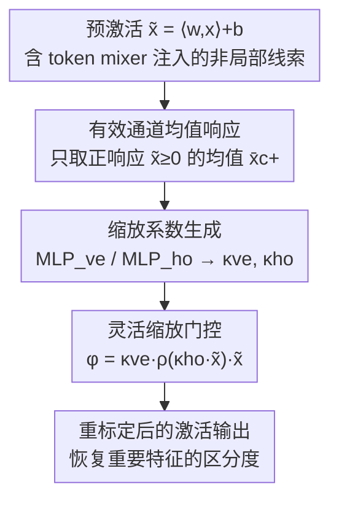

# Toward Principled Flexible Scaling for Self-Gated Neural Activation

**会议**: ICLR 2026  
**OpenReview**: [https://openreview.net/forum?id=XGODWn7HeJ](https://openreview.net/forum?id=XGODWn7HeJ)  
**代码**: https://github.com/SudongCAI/FleS  
**领域**: 优化 / 激活函数  
**关键词**: 自门控激活, 非局部张力, 收敛限制, 灵活缩放, 决策视角

## 一句话总结
这篇论文从决策（多准则评分）视角揭示了自门控激活函数在 Transformer 等已经建模了细粒度上下文的层里"用不上劲"的根因——门控函数饱和导致重要特征拿到几乎一样的门控权重（trivially discriminative gating weights），并提出 FleS：用符号敏感的通道统计量经小 MLP 生成"垂直 + 水平"两个自适应缩放系数，动态调节门控曲线的上界与陡度，在 Swin/PoolFormer/ResNet 上一致刷过一众 SOTA 激活函数（如 Swin-Min 上 71.4% vs GELU 68.7%）。

## 研究背景与动机

**领域现状**：激活函数是神经网络获得非线性表达能力的必需件。从 ReLU 这类刚性 0/1 整流，到 SiLU / GELU / Mish 这类"自门控"（self-gated）激活，再到 Swish / ACON / Meta-ACON 这类引入可学习边界、内容自适应、非局部线索的动态激活，主线一直是让激活曲线更"灵活"。自门控激活的统一形式是 $\phi(\tilde{x}) = \rho(\tilde{x})\,\tilde{x}$，其中 $\tilde{x} = \langle w, x\rangle + b$ 是预激活，$\rho(\cdot) \in (0,1)$ 是给每个特征打门控权重的加权函数。

**现有痛点**：这些 SOTA 动态激活在传统 CNN 上确实涨点，但放进 Transformer 层却"严重失效"。Transformer 本身已经用注意力在激活模块之外建模了细粒度的非局部依赖，此时激活再去引入一份非局部线索，两份非局部信息叠加反而互相抵消、收益骤降。作者把这个被忽视的现象命名为**非局部张力（non-local tension）**。

**核心矛盾**：作者从决策视角把单个神经元的"仿射→激活"流程类比成多准则决策里的灰色关联分析——滤波器 $w$ 是逼近理想模式 $w_A$ 的"理想方案"，特征 $x$ 是"候选方案"，通道是"决策准则"，预激活 $\tilde{x} = \|w\|\|x\|\cos\theta_{w,x} + b$ 是 $x$ 相对 $w_A$ 的重要性评分，$\rho(\cdot)$ 则是给这些评分做符号敏感再标定的"决策权重"。在这个透镜下，问题的根因暴露出来：**门控函数 $\rho$ 的饱和性**。当两个特征都很重要（$\tilde{x}_i, \tilde{x}_j$ 都很大）、即便 $\tilde{x}_i$ 显著大于 $\tilde{x}_j$，饱和的 sigmoid/ERF 会给它们几乎相同的门控权重，重要性差异被抹平。作者把它命名为**收敛限制（convergence limitation）**，并证明这是非局部张力的上游原因。

**本文目标**：(1) 把"为什么动态激活进不了 Transformer"从经验观察上升为可证明的机理；(2) 设计一个激活函数，在重要特征都被推到大值时仍能保持细粒度区分。

**切入角度**：既然 $\rho$ 有固定上界 $M$ 才是病根，那就别去固定 $\rho$ 的形状，而是给它配上**可自适应缩放的边界和陡度**，让门控曲线把"信息丰富的响应区间"重新拉开。

**核心 idea**：用一对从非局部统计线索生成的"垂直缩放 $\kappa_{ve}$（调上界）+ 水平缩放 $\kappa_{ho}$（调陡度）"系数来动态形变门控曲线，破解收敛限制。

## 方法详解

### 整体框架
FleS 的目标是：在一个标准自门控激活 $\phi(\tilde{x}) = \rho(\tilde{x})\tilde{x}$ 的基础上，引入两个自适应缩放系数，让门控函数 $\rho$ 的"高度（上界）"和"横向陡度"都能随当前层、当前通道的特征分布而动。原型形式（FleS-Proto）写作：

$$\phi(\tilde{x}) = \kappa_{ve}\,\rho(\kappa_{ho}\,\tilde{x})\,\tilde{x}$$

其中 $\kappa_{ve}$（vertical）整体抬高/压低门控权重的取值范围，$\kappa_{ho}$（horizontal）改变 $\rho$ 在横轴上的陡峭程度——把响应大的区间从饱和"平台"重新拽回有斜率的区域，从而恢复重要特征之间的区分度。两个系数都来自同一个**有符号、按通道统计**的非局部线索：每个通道只取**正响应**特征的均值（effective mean response），再归一化、经一对小 MLP 转成缩放系数。整个 pipeline 是"算通道有效响应 → MLP 转缩放系数 → 形变门控曲线 → 重标定特征贡献"。

### 关键设计

**1. 灵活双向缩放：把饱和门控曲线重新拉开**

针对"重要特征都被推到大值、门控权重却几乎一样"的收敛限制，FleS 不去改 $\rho$ 的解析形式，而是给它套上垂直、水平两个缩放旋钮。垂直系数 $\kappa_{ve}$ 把门控权重的上界 $M$ 变成可调，水平系数 $\kappa_{ho}$ 把输入按比例拉伸/压缩——后者是关键：当 $\tilde{x}_i, \tilde{x}_j$ 都落进 $\rho$ 的饱和平台时，$\kappa_{ho}$ 调节"陡度"，等价于把这两个点重新映射到 $\rho$ 仍有斜率的区段，于是 $\rho(\kappa_{ho}\tilde{x}_i)$ 和 $\rho(\kappa_{ho}\tilde{x}_j)$ 又能拉开差距。理论上这一点有支撑：作者证明了收敛限制定理（Theorem 3.1）——只要 $\lim_{\tilde{x}\to+\infty}\rho(\tilde{x}) = M > 0$，对任意 $\epsilon > 0$ 都存在阈值 $X$，使得所有 $\tilde{x}_i, \tilde{x}_j > X$ 都有 $|\rho(\tilde{x}_i) - \rho(\tilde{x}_j)| < \epsilon$。固定上界 = 必然饱和 = 重要特征区分度归零，所以"让上界和陡度可变"正是对症下药。值得一提，把 $\kappa_{ve}, \kappa_{ho}$ 都省掉时 FleS 退化为 SiLU，说明它是自门控激活的一个严格泛化。

**2. 有符号的有效通道均值响应：只听正特征的话**

缩放系数该由什么线索驱动？作者主张：非局部张力是**统计/群体**效应，由一组相对重要的特征共同触发，所以缩放必须基于"参考特征组"的相对关系，而不能逐个特征独立调。具体线索取每个通道 $c$ 上**非负响应**特征的均值：

$$\bar{x}_c^{+} = \mathrm{mean}_{\tilde{x}\in \mathcal{X}_c}\{\tilde{x}\mid \tilde{x}\geq 0\}$$

再做跨通道归一化 $\mu(\{\bar{x}_c^{+}\}) = \bar{x}_c^{+} / (\tfrac{1}{C}\sum_i \bar{x}_i^{+})$。为什么只取正响应？作者用 Proposition 4.1（相对再标定偏置）论证：在 sigmoid 型 $\rho$ 和 $\tilde{x}\sim N(\mu,\sigma)$ 假设下，负响应特征的期望贡献与正响应之比 $R(\mu,\sigma) = \frac{E(\rho(\tilde{x})|\tilde{x}<0)}{E(\rho(\tilde{x})|\tilde{x}>0)}$ 满足 $\lim_{\sigma\to\infty}R(\mu,\sigma) = 0$——分布越平展，正特征越主导贡献。换句话说，负响应特征若混进均值会"中和"掉正特征携带的有效信息，所以必须把它们隔离在外。这个设计也被梯度统计实测印证：训练中正响应位置的梯度幅度远大于负响应（stage1→4 的正负梯度比约 5.3×、7.9×、12.7×、13.8×，越深的层越不对称），优化信号本就压在正侧，缩放线索就该听正侧的。

**3. 用小 MLP 做"通道属性记录器"：让缩放在真实分布上可用**

FleS-Proto 直接用 $\kappa = \mathrm{softplus}(\alpha\,\mu(\{\bar{x}_c^{+}\}) + \gamma)$ 这种线性+softplus 映射生成系数（$\alpha$ 初始化为 $1\times10^{-3}$ 引入自适应性，$\gamma$ 初始化为 $0.6$ 让 $\kappa$ 初始接近 1.0 稳住早期训练，softplus 施加平滑的正约束）。但 Proto 有个致命依赖：它需要"干净的、按类别排好序"的统计区间才有效——在按类别排列的 non-shuffle 评估下 Swin-Micro 能飙到 85.2%，可一旦 batch 被 shuffle、通道统计不再类别纯净，准确率暴跌到 77.3%，甚至不如 vanilla 基线。为了让方法在真实场景（shuffle 的单类图、多类道路场景图）也能用，FleS 把系数生成换成一个轻量 MLP（默认通道压缩比 32）当"通道属性记录器"：$\kappa_{ve} = \mathrm{MLP}_{ve}(\bar{x}^{+})$，$\kappa_{ho} = \mathrm{MLP}_{ho}(\bar{x}^{+})$。MLP 的平移等变性让它能在复杂类别分布的有效通道均值向量 $\bar{x}^{+}\in\mathbb{R}^C$ 里"嗅出"有信息的规律，再自适应转成缩放系数；密集任务（如 COCO 检测）则在更细的邻域（如 9×15 patch）上算 $\bar{x}_c^{+}$。这一步是把"理论上漂亮的 Proto"落地成"任何识别任务都能插"的实用模型的关键。

### 损失函数 / 训练策略
FleS 不改训练目标，只替换激活函数。视觉骨干沿用标准的 Transformer/CNN 训练-评估配方（Swin/PoolFormer 用 300-epoch DeiT 式配方，Swin-Min 因资源缩到 120 epoch；ResNet 用标准 CNN 配方），在四张 A6000 上训练。$\alpha, \gamma$ 的初始化是稳定性关键：$\alpha$ 极小起步保证早期接近恒等门控，$\gamma=0.6$ 让缩放系数从 1.0 附近平滑展开。

## 实验关键数据

### 主实验
在已建模非局部上下文的 MetaFormer 骨干（Swin-Min / PoolFormer-S12）上对比各激活函数，这是 FleS 的主战场（ImageNet Top-1）：

| 骨干 | 激活 | #Params | Top-1(%) |
|------|------|---------|----------|
| Swin-Min (120ep) | GELU | 11.8M | 68.7 |
| Swin-Min | SMU | 11.8M | 68.9 |
| Swin-Min | IIEU | 13.4M | 69.5 |
| Swin-Min | AdaS | 13.7M | 69.7 |
| Swin-Min | Meta-ACON | 13.4M | 68.3 |
| Swin-Min | **FleS** | 13.0M | **71.4** |
| Swin-Min | **FleS-AdaS** | 14.1M | **73.0** |
| PoolFormer-S12 (300ep) | GELU | 11.9M | 77.2 |
| PoolFormer-S12 | IIEU | 14.3M | 78.6 |
| PoolFormer-S12 | **FleS** | 13.8M | **79.4** |

关键观察：FleS 相对 SOTA 激活的增益，比那些 SOTA 相对 GELU 基线的增益还要大；而 Meta-ACON / SMU 这类同样用非局部信息调边界的方法在 Transformer 层上几乎没能超过 GELU，恰好印证了非局部张力的存在与 FleS 的对症性。FleS 还能给更大的骨干涨点（Swin-M 78.7→80.3，Swin-T 81.3→82.3，ViT-B/16 79.7→80.7），并在纯 CNN 的 ResNet-50 上达到 80.1%（ReLU 基线 77.2%），证明插即用的通用性。

### 消融实验

| 配置 | 骨干 | Top-1(%) | 说明 |
|------|------|----------|------|
| GELU | Swin-Min | 68.7 | 基线 |
| FleS-DG | Swin-Min | 69.1 | 去掉通道统计线索，$\kappa=\mathrm{softplus}(\gamma)$ |
| FleS-P&N | Swin-Min | 69.8 | 正负响应一起平均算通道线索 |
| FleS (Full) | Swin-Min | **71.4** | 完整模型 |

### 关键发现
- **通道统计线索贡献最大**：去掉它（FleS-DG）从 71.4 掉到 69.1，但仍略高于 GELU——说明"缩放系数本身"有用，"用有效统计驱动缩放"才是大头。
- **正负分离是必要的**：把负响应也混进通道均值（FleS-P&N）只有 69.8，远低于只取正响应的 71.4，实证了 Proposition 4.1"负特征会中和正特征贡献"的分析。
- **Proto 对统计纯净度极度敏感**：non-shuffle 下 Swin-Micro 高达 85.2%，shuffle 下崩到 77.3%——这正是必须把系数生成换成 MLP（FleS 实用版）的动机。
- **梯度不对称随深度加剧**：正/负响应梯度幅度比从浅层 5.3× 升到深层 13.8×，且随训练推进从 3–9× 拉大到 6–15×，与"有符号、偏正侧"的线索设计自洽。

## 亮点与洞察
- **把"动态激活进不了 Transformer"从玄学变成定理**：收敛限制定理（固定上界 ⇒ 大响应区门控权重必然趋同）一句话讲清了为什么 Meta-ACON/SMU 在 Transformer 上失灵，这种"先证伪现有路线、再对症下药"的叙事很有说服力。
- **决策视角是真正的分析工具而非装饰**：把滤波器/特征/通道映射成理想方案/候选/准则，让"门控权重 = 决策权重"，由此自然推出"重要性评分差异不该被抹平"这一可操作的判据。
- **水平缩放 $\kappa_{ho}$ 是被低估的旋钮**：以往动态激活大多只调上界（垂直方向），而 FleS 指出调"陡度"才是把饱和点重新拉回有斜率区间的关键，这个洞察可迁移到任何带饱和门控的模块（如注意力的 softmax 温度、gating 网络）。
- **只听正特征**：用 softplus + 仅正响应均值把符号信息显式编码进统计线索，既有理论（Prop 4.1）又有梯度实测支撑，是个轻量却高效的设计 trick。

## 局限与展望
- **额外参数与统计依赖**：FleS 需要 MLP 记录器带来额外参数（虽然 FLOPs 增加可忽略），且依赖"有效通道均值响应"的质量；Proto 在 shuffle 下崩盘已暴露其对统计纯净度的脆弱，实用版靠 MLP 缓解但能否在极端长尾/多类混杂下稳健仍需更多验证。
- **理论假设的适用边界**：收敛限制定理和 Prop 4.1 建立在 $\rho$ 有固定正上界、$\tilde{x}$ 近似高斯等假设上，真实深层网络的预激活分布未必满足，结论是"motivating insight"而非严格保证（⚠️ 部分推导细节在附录，以原文为准）。
- **NLP 侧展开有限**：正文称在 GLUE 上验证并提出 FleS-SeqGate 变体，但主表集中在视觉，跨模态的系统对比还不充分。
- **改进思路**：把缩放系数生成从 channel-wise 扩展到 token/spatial 自适应，或与注意力温度联合学习，可能进一步缓解非局部张力。

## 相关工作与启发
- **vs Meta-ACON / SMU**：它们同样用非局部线索去重标定激活边界，但只调上界、且注入的是相对粗糙的非局部线索，在已建模上下文的 Transformer 层上引发非局部张力、收益受限；FleS 用有符号通道统计 + 双向（上界 & 陡度）缩放对症解决，因此能在 Transformer 上明显超过它们。
- **vs IIEU / AdaShift（Cai 2023/2024a）**：同属决策视角的自门控激活，IIEU 解决"特征评分错配（MFS）"、AdaShift 加自适应平移因子；FleS 进一步指出它们都没处理"非局部线索的矛盾使用"，补上了收敛限制这块拼图，且能与 AdaShift 叠加（FleS-AdaS 把 Swin-Min 从 69.7 推到 73.0）。
- **vs SiLU / GELU**：FleS 是它们的严格泛化——省掉两个缩放系数即退化为 SiLU；区别在于 FleS 让门控曲线随特征分布动态形变，而 SiLU/GELU 的门控曲线是静态的，在大响应区会饱和失去区分度。

## 评分
- 新颖性: ⭐⭐⭐⭐⭐ 首次把"动态激活在 Transformer 上失效"形式化为收敛限制/非局部张力，并给出有理论支撑的双向缩放解法。
- 实验充分度: ⭐⭐⭐⭐ 覆盖 Swin/PoolFormer/ViT/ResNet 多骨干 + 充分消融，但跨模态（NLP）主表略单薄。
- 写作质量: ⭐⭐⭐⭐ 决策视角自洽、定理与设计一一对应，但理论部分密度高、对读者门槛偏高。
- 价值: ⭐⭐⭐⭐⭐ 即插即用的激活函数，对所有用非局部 token mixer 的现代网络都有现成增益。

<!-- RELATED:START -->

## 相关论文

- [\[ICLR 2026\] Multi-Action Self-Improvement for Neural Combinatorial Optimization](multi-action_self-improvement_for_neural_combinatorial_optimization.md)
- [\[ICLR 2026\] Neural Multi-Objective Combinatorial Optimization for Flexible Job Shop Scheduling Problems](neural_multi-objective_combinatorial_optimization_for_flexible_job_shop_scheduli.md)
- [\[ICLR 2026\] Activation Function Design Sustains Plasticity in Continual Learning](activation_function_design_sustains_plasticity_in_continual_learning.md)
- [\[ICLR 2026\] Provable and Practical In-Context Policy Optimization for Self-Improvement](provable_and_practical_in-context_policy_optimization_for_self-improvement.md)
- [\[ICLR 2026\] Exploring Diverse Generation Paths via Inference-time Stiefel Activation Steering](exploring_diverse_generation_paths_via_inference-time_stiefel_activation_steerin.md)

<!-- RELATED:END -->
