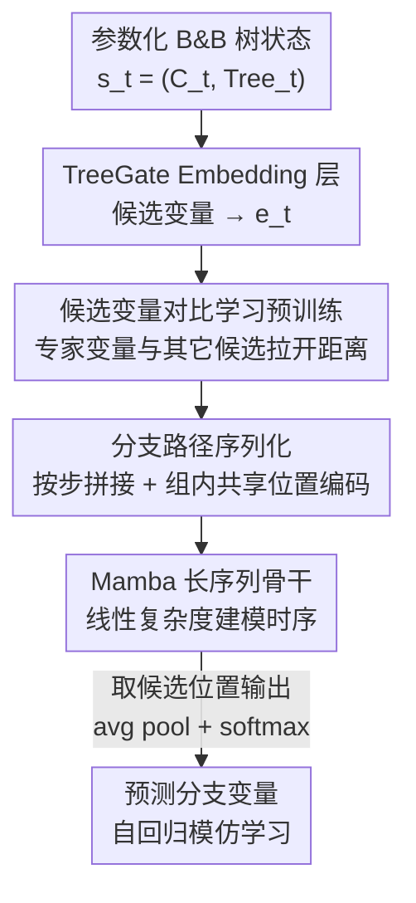

# Towards Better Branching Policies: Leveraging the Sequential Nature of Branch-and-Bound Tree

**会议**: ICLR 2026  
**OpenReview**: [https://openreview.net/forum?id=iQKzHeLDrN](https://openreview.net/forum?id=iQKzHeLDrN)  
**代码**: https://github.com/doctor-watson626/Mamba-Branching/  
**领域**: 组合优化 / 学习型分支策略  
**关键词**: 分支定界, MILP, 变量分支, Mamba, 对比学习, 模仿学习  

## 一句话总结
本文提出 Mamba-Branching：把分支定界（B&B）求解过程显式地建模成一条"从根节点到最优解节点"的分支路径序列，用线性复杂度的 Mamba 做超长序列建模、再用对比学习预训练候选变量的判别性 embedding，从而在异构 MILP 上超越所有已有神经分支策略，并在困难实例上以更快收敛超过 SCIP 默认的 relpscost 规则。

## 研究背景与动机

**领域现状**：混合整数线性规划（MILP）是 NP-hard 问题，实际求解几乎都靠分支定界（B&B）——不断挑一个取小数值的整数变量 $x_j$ 做分裂，添加 $x_j \le \lfloor b_j \rfloor$ 和 $x_j \ge \lfloor b_j \rfloor + 1$ 两个子节点，配合定界和剪枝逐步收敛。其中"选哪个变量分支"对求解效率影响巨大。近几年的学习型分支策略（GCNN、TreeGate、T-BranT）试图用神经网络替换启发式规则，并通过把 B&B 树参数化成实例无关特征来获得跨实例泛化能力。

**现有痛点**：这些方法几乎都忽略了 B&B 树展开本身的**序列性质**。TreeGate 只看当前节点的瞬时状态，完全丢掉历史；T-BranT 虽然保留了历史分支记录，却把它当成一张**无序图**用图注意力编码，没有显式刻画"先走了哪一步、再走哪一步"的时序顺序。这就像走迷宫时只看脚下当前格子、不回顾走过的路径，容易绕死路、做重复探索。

**核心矛盾**：作者的关键洞察是——从根节点到最优解节点的"分支路径"本质上是一个**序列化过程**，前面每一步的（参数化树状态 + 所选分支变量）都显著影响当前决策。要把这种序列性建模好，有两个硬骨头：(1) **超长序列**：每一步状态包含多个候选变量，序列长度随分支步数指数级增长，普通 Transformer 的二次复杂度扛不住；(2) **判别性 embedding**：B&B 同一步内的候选变量因共享约束和问题结构而特征高度相似，不像 NLP 里词与词天然可分，需要专门学一个能区分"该选哪个"的高判别性表示空间。

**本文目标 / 核心 idea**：把 B&B 视为路径感知的序列决策问题——用 Mamba（线性复杂度）解决超长序列建模，用对比学习预训练 embedding 层解决判别性，再用自回归模仿学习把整条分支路径喂给序列模型来预测下一步分支变量。

## 方法详解

### 整体框架

Mamba-Branching 沿用 Zarpellon 等人的参数化 B&B 树表示：每一步状态 $s_t = (C_t, \text{Tree}_t)$，其中 $C_t \in \mathbb{R}^{|C_t| \times 25}$ 是候选变量特征、$\text{Tree}_t \in \mathbb{R}^{61}$ 是树特征，经 TreeGate 网络得到候选变量 embedding $e_t \in \mathbb{R}^{|C_t| \times d}$——这套表示与具体实例无关，因此能统一处理异构 MILP。

整个训练分两阶段串行：**第一阶段对比学习**先单独预训练 TreeGate embedding 层，让"专家选中的变量"在 embedding 空间里和其它候选变量拉开距离；**第二阶段自回归模仿学习**把整条分支轨迹 $(s_0, a_0, \dots, s_T)$ 映射成 embedding，按步拼成"分支路径"序列、加上组内共享的位置编码，送进 Mamba 序列模型，只取候选变量位置对应的输出做平均池化 + softmax，以专家分支决策 $a_t$ 为标签做交叉熵模仿学习。推理时则用前几步的预测作为当前步输入，自回归地往下选。

### 关键设计

**1. 把 B&B 搜索建模成"分支路径"序列：补上历史时序这一维**

针对前面"现有方法要么丢历史、要么把历史当无序图"的痛点，本文把整条搜索轨迹显式定义成一个结构化序列 $S$。每一步 $t$ 被拆成它的所有候选变量 embedding 加上被选中的专家决策 embedding，构成一个组：

$$S = [\,\underbrace{e_0^1, \dots, e_0^{|C_0|}, e_0^{a_0}}_{|C_0|+1}, \dots, \underbrace{e_t^1, \dots, e_t^{|C_t|}, e_t^{a_t}}_{|C_t|+1}, \dots, \underbrace{e_T^1, \dots, e_T^{|C_T|}}_{|C_T|}\,]$$

这样既保留了步与步之间的**时序依赖**（inter-step），也保留了每步内候选变量之间的**相互关系**（intra-step）。为了让序列模型知道"哪些 embedding 属于同一步"，作者用一个可学习的位置编码矩阵 $E_{pos}$，给**同一步内的所有 embedding 赋相同的位置索引** $\text{pos} = [0,\dots,0, \dots, T,\dots,T]$，再逐元素相加 $S' = E_{pos} \oplus S$。这种"组内共享位置编码"是把无序候选集合组织成有序路径的关键——它和迷宫类比一致：顺序地回忆走过的路才能更好地决定当前怎么走。

**2. 候选变量对比学习预训练 embedding：让"该选的那个"在空间里最突出**

针对"同一步候选变量特征高度相似、难以区分"的痛点，作者先把 embedding 层从下游序列模型里拆出来单独预训练。理论上，有效分支要求 embedding 空间满足 Proposition 1：被选中变量的 embedding 与某个锚点的相似度，要比所有其它候选高出一个正间隔 $\delta$，即 $\text{sim}(e_t^a, e_t^m) \ge \max_{i \ne a} \text{sim}(e_t^i, e_t^m) + \delta$。

为近似满足这个条件，作者设计对比损失（$\text{sim}$ 取余弦相似度，锚点 $e_t^m$ 由候选 embedding 做 max-pooling 得到）：

$$\mathcal{L}_c(\gamma) = \frac{1}{T} \sum_t \Big( -\frac{e_t^m \cdot e_t^a}{\|e_t^m\|\|e_t^a\|} + \frac{1}{|C_t|-1} \sum_{i \ne a} \frac{e_t^m \cdot e_t^i}{\|e_t^m\|\|e_t^i\|} \Big)$$

直觉是：max-pooling 抽出一个全局显著特征当锚点，损失一边拉高锚点和专家变量的余弦相似度、一边压低锚点和其它候选的相似度，从而把专家变量的特征推向"全局最显著方向"，放大它与其它候选的差异。t-SNE 可视化（图 6）证实——加了对比学习后专家变量明显离群、可分；不加则塌缩进普通候选的分布里。

**3. Mamba 长序列骨干 + 自回归模仿学习：让超长路径既能建模又跑得快**

由于分支路径的实际输入长度是 $\sum_{t=0}^{T} |C_t| + T$，当步数 $T$ 或候选数 $|C_t|$ 一大就急剧膨胀，Transformer 的二次复杂度直接 OOM（实验里 Transformer-Branching 只能截到 $T=9$，而 Mamba 能吃到 $T=99$）。Mamba 相对序列长度是**线性复杂度**，这在"以加速求解为目标、推理时间至关重要"的场景里是决定性优势——如果分支策略本身推理太慢，就违背了加速的初衷。

训练用 relpscost（SCIP 默认规则）当专家收集示范轨迹，按自回归范式做模仿学习，联合优化 embedding 层和序列模型：

$$L(\theta, \gamma) = -\frac{1}{|D|} \sum_{\tau \in D} \sum_{(s_t, a_t) \in \tau} \log \pi_\theta(a_t \mid \tau_{0:t})$$

其中只取序列里候选变量位置的输出 $o_t$ 过平均池化 + softmax 得到变量概率分布。之所以选 relpscost 而非更强的 strong branching 当专家，是出于推理代价与可学习性的权衡（详见原文附录 C）。

### 损失函数 / 训练策略
两阶段优化：先用 $\mathcal{L}_c$ 单独预训练 embedding 层，再用模仿学习损失 $L(\theta, \gamma)$ 联合微调 embedding 层与 Mamba。数据收集时前 $r \in \{0,1,5,10,15\}$ 步用随机分支增强探索、之后切到 relpscost；用种子 $\{0,1,2,3\}$ 收集、种子 4 留作验证。训练时 Mamba 处理至多 $T=99$ 步，评估时所有模型在统一预算 $T=24$ 下自回归生成决策。

## 实验关键数据

### 主实验
在 MIPLIB + CORAL 构造的两个异构数据集（MILP-S 小规模、MILP-L 大规模）上评测，指标为节点数 Nodes、去偏后的 Fair Nodes、求解时间 Time，困难实例用 1 小时预算下的原始-对偶积分 PD Integral。所有结果取 5 个随机种子的几何均值。

| 方法 | MILP-S Fair Nodes | MILP-S Time | MILP-L Easy Time | MILP-L Difficult PD Integral |
|------|------|------|------|------|
| **Mamba-Branching** | **2091.54** | **111.78** | **123.79** | **12319.55** |
| TreeGate | 2180.04 | 113.85 | 145.44 | 14625.68 |
| T-BranT | 2715.16 | 165.59 | 210.27 | 13538.47 |
| Transformer-Branching | 3120.04 | 3153.66 | OOM | OOM |
| pscost（启发式） | 7308.23 | 209.30 | 183.36 | 17097.06 |
| relpscost（专家/上界） | 1227.25 | 82.51 | 68.43 | 12741.36 |

Mamba-Branching 是除 relpscost 外最好的策略，在所有神经分支策略里全面 SOTA。在 MILP-L 困难实例上，它的 PD Integral（12319.55）甚至**反超专家 relpscost**（12741.36），说明在相同时间预算内它能让原始/对偶界收敛最快。它在 MILP-L 上对前一最佳神经方法的求解时间提升（17%）也远大于 MILP-S（2%），且 MILP-L 测试实例更多（57 vs 8），统计意义上更可信。

### 消融实验
MILP-S 上对 Mamba-Branching-p（无 relpscost 根节点初始化的纯神经版本）做消融，指标为 Nodes（越小越好）：

| 配置 | Nodes | 说明 |
|------|------|------|
| Mamba-Branching-p（完整） | 2272 | 完整模型 |
| w/o CL（去对比学习预训练） | 3001 | embedding 判别性下降 |
| SL（对比学习换成监督预训练） | 4287 | 监督表示泛化不如对比学习 |
| w/o PE（去组内位置编码） | 3481 | 序列建模被破坏，明显变差 |
| Transformer-Branching-p | 5138 | 二次复杂度，仅能训 10 步历史 |
| GRU-Branching-p | 5684 | 换 GRU 做序列模型效果最差 |

### 关键发现
- **序列性是主因**：Mamba-Branching 在所有场景稳定超过 TreeGate（完全忽略历史）和 T-BranT（无序利用历史），印证"顺序回忆路径有助当前决策"的迷宫类比。
- **位置编码不可少**：去掉组内共享位置编码后性能大跌（2272→3481），直接验证序列建模才是性能来源。
- **对比学习 > 监督预训练**：把 CL 换成监督分类预训练（SL）反而更差（4287），说明对比学习诱导出的判别性 embedding 才能泛化到分支任务。
- **Mamba 不是可有可无**：换 Transformer 或 GRU 都明显变差；且 Transformer 推理单步耗时比 Mamba 高 1-2 个数量级（图 3），在"为省时间而加速"的场景里完全不可用。
- **为何能反超 relpscost**：relpscost 需要变量被 strong branching 选中足够多次才"可信"地切到 pscost，困难实例变量多、初始化耗时；而神经策略推理快，在困难实例上反占优势。

## 亮点与洞察
- **把"分支决策"重新定义为"路径序列预测"**：最 aha 的一点是用迷宫类比点破——以往方法都只看脚下当前状态，本文第一次把从根到最优解的整条路径当作有时序的序列建模，补上了被普遍忽略的历史维度。
- **组内共享位置编码**：用同一位置索引标记同一步的所有候选 embedding，把"无序候选集合 + 有序步骤"优雅地编码进同一条序列，是把集合-序列混合结构喂给序列模型的可复用 trick。
- **对比学习专门解决"候选高度相似"**：B&B 候选变量不像 NLP 词那样天然可分，先用对比损失把专家变量推向全局最显著方向，这个"判别性表示"思路可迁移到其它候选项高度同质的离散决策任务。
- **线性复杂度是刚需而非可选**：在以"加速求解"为目标的场景，序列模型本身的推理代价直接决定方法可行性，这让 Mamba 的线性复杂度从"锦上添花"变成"决定性"。

## 局限与展望
- **依赖模仿学习与专家数据**：作者承认收集 relpscost 专家示范轨迹很耗时，整套方法的上限也被专家（relpscost）部分限制。未来计划探索基于强化学习的分支策略，摆脱对专家数据的依赖。
- **易实例上仍逊于 relpscost**：在 MILP-L 的简单实例上 Mamba-Branching 仍不及精调过的 relpscost，优势主要体现在困难/异构实例。
- **统一评估预算 $T=24$ 的限制**：训练 $T=99$ 但评估时所有模型截到 $T=24$ 自回归生成，长程序列建模的全部收益在评估端可能未完全释放（自己发现的局限）。
- **专家选择的权衡**：选 relpscost 而非 strong branching 当专家是出于代价考虑，是否换更强专家 + 更强序列模型能进一步提升，文中未充分探索。

## 相关工作与启发
- **vs TreeGate（Zarpellon 2021）**：两者都用参数化 B&B 树做实例无关特征，但 TreeGate 只用当前瞬时状态、完全丢历史；本文显式把历史轨迹序列化建模，全面更优。
- **vs T-BranT（Lin 2022）**：T-BranT 保留了历史但当成**无序图**用图注意力编码；本文强调历史是**有序序列**，用 Mamba 显式建模时序，这是性能差距的根本来源。
- **vs Transformer-Branching（本文 baseline）**：同样做序列建模，但 Transformer 二次复杂度导致只能训 10 步历史、且推理慢，证明在长序列 + 时间敏感场景里 Mamba 的线性复杂度是必要条件而非可替换选项。
- **vs 第二范式（AdaSolver / MILP-Evolve）**：那类方法靠多样化训练实例提升泛化；本文走第一范式（参数化 B&B 树共享特征空间），两条路线互补。

## 评分
- 新颖性: ⭐⭐⭐⭐⭐ 首次把 B&B 的序列性显式建模成"分支路径"，并把 Mamba 引入学习型分支，视角清晰且有理论支撑。
- 实验充分度: ⭐⭐⭐⭐ 两规模异构数据集 + 同质辅助实验 + 多维消融，但训练 $T=99$/评估 $T=24$ 的口径差异略削弱长程结论。
- 写作质量: ⭐⭐⭐⭐⭐ 迷宫类比贯穿全文，动机—挑战—方法的逻辑链非常清楚。
- 价值: ⭐⭐⭐⭐ 在困难/异构 MILP 上反超 SCIP 默认规则，对组合优化求解器加速有实际意义。

<!-- RELATED:START -->

## 相关论文

- [\[ICLR 2026\] Hinge Regression Tree: A Newton Method for Oblique Regression Tree Splitting](hinge_regression_tree_a_newton_method_for_oblique_regression_tree_splitting.md)
- [\[ICLR 2026\] Birch SGD: A Tree Graph Framework for Local and Asynchronous SGD Methods](birch_sgd_a_tree_graph_framework_for_local_and_asynchronous_sgd_methods.md)
- [\[ICLR 2026\] Proving the Limited Scalability of Centralized Distributed Optimization via a New Lower Bound Construction](proving_the_limited_scalability_of_centralized_distributed_optimization_via_a_ne.md)
- [\[ICLR 2026\] From Sequential to Parallel: Reformulating Dynamic Programming as GPU Kernels for Large-Scale Stochastic Combinatorial Optimization](from_sequential_to_parallel_reformulating_dynamic_programming_as_gpu_kernels_for.md)
- [\[ICLR 2026\] Matched Data, Better Models: Target Aligned Data Filtering with Sparse Autoencoders](matched_data_better_models_target_aligned_data_filtering_with_sparse_autoencoder.md)

<!-- RELATED:END -->
