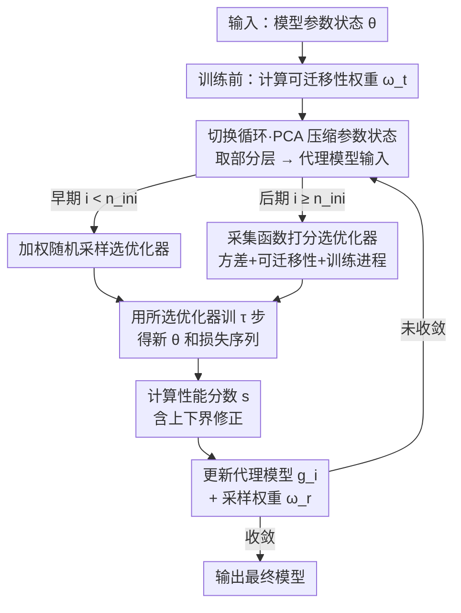

# Towards Dynamic Interleaving Optimizers

**会议**: ICLR 2026  
**OpenReview**: [https://openreview.net/forum?id=AII8ADdDHt](https://openreview.net/forum?id=AII8ADdDHt)  
**代码**: 待确认（作者承诺开源）  
**领域**: 优化器 / 训练动力学 / AutoML  
**关键词**: 动态优化器切换, 代理模型, 高斯过程, 采集函数, 可迁移性

## 一句话总结
DOIT 把"训练过程中该用哪个优化器"当成一个随训练状态变化的在线决策问题，用高斯过程代理模型预测每个优化器在当前参数状态下的短期收益、再用融合可迁移性与训练进程的采集函数挑选优化器，从而在多个优化器之间动态交替（interleave），相比单一/简单混合优化器收敛快 2%–10%、精度高 1%–3%。

## 研究背景与动机

**领域现状**：深度网络训练几乎都依赖单一静态优化器（如全程 SGD 或 AdamW），不同优化器各有所长——SGD 泛化好、常用于 head fine-tuning，Adam 收敛快、常用于 LoRA。为了兼顾两者，已有一类"混合优化器"（SWATS、Padam、AdaBound、AGD）尝试把 SGD 的泛化能力和自适应方法的快收敛拼起来。

**现有痛点**：静态优化器全程不变，既限制了模型质量也限制了收敛速度；想找到更好的优化器只能换着试，代价高昂。而现有的混合方法仅仅是"从 A 切到 B"这种**一次性的粗粒度切换**（典型如 SWATS 从 Adam 切到 SGD），既没有用上多个优化器各自的优势，也无法在训练中反复调整，导致模型质量不稳、收敛受限。

**核心矛盾**：近期研究发现，不同优化器不仅在**不同任务**上表现不同，更关键的是在**同一次训练的不同阶段（不同参数状态）**下也呈现出不同的优化方向与策略。论文用 Three-Hump Camel、Rosenbrock 等函数可视化（图 1、图 4）证明：多个优化器即便起点方向相似，几步之后路径就会发散——"不同优化器适合不同的训练状态"。静态与一次性切换方法都吃不到这种训练动态的红利。

**本文目标**：把优化器选择从"训练前选一次"升级为"训练中按当前参数状态反复选"，即细粒度地动态调度优化器类型。

**切入角度**：作者把它建模成一个**单次训练内**的动态超参优化问题——优化器类型 $o$、超参 $\lambda$、训练时长 $t$ 共同构成配置 $c=(o,\lambda,t)$，训练过程就是配置序列 $C=\{c_1,\dots,c_n\}$，目标是找最优 $C^*=\arg\min_C L(\theta_0,M,D,C)$。它和 SMBO/贝叶斯优化共享"代理模型 + 采集函数"的框架，但不同于 SMBO 找一个固定配置，DOIT 要的是优化器在全程中的**自适应协同**。

**核心 idea**：为每个候选优化器建一个高斯过程代理模型，用它预测"在当前参数状态下接着训会带来多少**短期**损失下降"，再用一个综合了方差、可迁移性、训练进程的采集函数打分，每个切换周期都选分最高的优化器，从而在多个优化器之间动态交替。

## 方法详解

### 整体框架

DOIT（Dynamic Optimizer Interleaving Training）把整段训练切成一系列长度为 $\tau$ 的"切换周期（switch cycle）"。训练开始前先算一次模型对当前任务的**可迁移性权重** $\omega_t$；之后每个周期内做四件事：压缩当前参数状态作为代理模型输入 → 用某个优化器实际训 $\tau$ 步 → 根据这 $\tau$ 步的损失轨迹算出一个性能分数 $s$ → 用 $s$ 更新该优化器对应的代理模型和采样权重。优化器的选择分两段：训练早期经验不足时用**加权随机采样**冷启动，攒够经验后切换为用**采集函数**算分、选分最高者。如此循环，就实现了优化器在训练中的动态交替。

### 关键设计

**1. 代理模型估计优化器的"短期"收益：用高斯过程 + 性能分数 s 而非最终精度**

DOIT 给每个候选优化器 $o_i$ 单独建一个高斯过程（GP）代理模型 $g_i$。选 GP 有三个理由：能随训练增量更新、能给出预测方差（用于后面探索/利用权衡）、作为概率模型可解释。代理模型的**输入** $VEC_i$ 不只像传统 SMBO 那样放超参 $\lambda$，还拼上了**当前参数状态 $\theta$** 的向量表示，这样才能学到"不同参数状态下优化器表现不同"。为压缩输入、降低代理模型训练成本，DOIT 用 PCA 逐层压缩参数，并只取一部分层（如分类层加少数隐层）；PEFT 场景下只看可训练参数（如 LoRA 的 $A$、$B$）。

代理模型的**输出**不是训练到收敛的最终损失/精度，而是反映"当前状态下接着训能带来多少即时收益"的性能分数 $s\in[-1,1]$。一个周期内训 $\tau$ 步得到损失序列 $l=\{l_1,\dots,l_\tau\}$，先算逐步相对下降 $\Delta l_i=\frac{l_{i-1}-l_i}{\max(l_i,l_{i-1})}$，得到均值 $\mu_\Delta$（利用）与方差 $\sigma_\Delta$（探索）。但只用 $\mu_\Delta+\alpha\sigma_\Delta$ 会丢掉"方差的方向"——图 6 中 $o_1$ 和 $o_3$ 的 $\mu_\Delta$、$\sigma_\Delta$ 相同，$o_3$ 却把损失降得更低。为此 DOIT 引入上下界 $\Delta_{\text{UPPER}}=\frac{l_0-\max(l)}{\max(l_0,\max(l))\times\tau}$、$\Delta_{\text{LOWER}}=\frac{l_0-\min(l)}{\max(l_0,\min(l))\times\tau}$，最终分数为

$$s=\tanh\!\Big(\tfrac{1}{3}\big(\mu_\Delta+\Delta_{\text{UPPER}}+\Delta_{\text{LOWER}}\big)+\alpha\sigma_\Delta\Big)$$

把"平均下降 + 能到的最好/最差边界 + 波动"一起编码进一个有界分数，恰好刻画了短期优化质量。

**2. 采集函数选优化器：把方差、可迁移性、训练进程三件事拧进一个打分**

直接用 $s$ 选优化器太"短视"，因为损失波动大、训练状态复杂。DOIT 借鉴贝叶斯优化的采集函数思路，但塞进了三层考量。第一层是经典的探索/利用权衡，借 GP 给出的均值 $s_\mu$ 与方差 $s_\sigma$ 写成 $ACQ=s_\mu+\alpha s_\sigma$。

第二层是**可迁移性**：作者的直觉是"预训练模型与下游任务越不相似（可迁移性越低），越需要大幅调整"，于是用 $(1-\omega_t)$ 作为方差项权重——可迁移性低就放大探索，$ACQ=s_\mu+(1-\omega_t)s_\sigma$。其中可迁移性 $\omega_t=\beta\,\omega_p+(1-\beta)\frac{1}{k}\sum_{i=1}^{k}\mathrm{sigmoid}(\omega_d^i)$，$\omega_p$ 是直接拿预训练模型测出的性能指标（如准确率），$\omega_d^i$ 是 LogME、LEEP 等基于输出/标签分布的可迁移性指标（用 sigmoid 归一到 $[0,1]$ 与 $\omega_p$ 对齐）。

第三层是**训练进程**：模型趋于稳定后只需更小幅度的微调，幅度大的优化器反而会扰动收敛。于是对方差项做周期性减半，$e=\mathrm{sigmoid}\!\big(s_\mu+(1-2^{-\lfloor i/n\rfloor}\cdot\omega_t)s_\sigma\big)$，其中 $i$ 是当前迭代、$n$ 是减半周期——越往后探索权重越衰减，自然从"激进试探"过渡到"稳健收尾"。每个周期选 $e$ 最高的优化器。

**3. 加权随机冷启动与切换循环：让代理模型有经验可学**

代理模型一开始没有数据，DOIT 用一段**加权随机初始化**冷启动：给每个优化器 $o_j$ 维护采样权重 $\omega_r[j]\in[0,1]$，初值都为 1（纯随机），每训完一段就把它更新为归一化后的性能分数 $\omega_r[j]=\max\!\big(\tfrac{1}{2}(s+1),\omega_{\min}\big)$，$\omega_{\min}$ 是下限阈值，保证表现好的优化器更容易被再采到、但表现差的也不会被彻底饿死。这比纯均匀随机能更快攒到高质量经验。攒够 $n_{ini}$ 步后，选择权就交给上面的采集函数。整个"压缩状态 → 选优化器 → 训 $\tau$ 步 → 算分 → 更新代理模型与权重"的循环串起来，就是 DOIT 的运转方式。

## 实验关键数据

### 主实验

数据集涵盖 6 个 CV 分类集（usps/mnist/stl10/cifar10/imagenet/imagenet-a）、2 个 NLP 集（mrpc/qqp），外加机器翻译 wmt14、回归 eunite、目标检测 coco；模型包括 ResNet18/152、MobileNetV2、ViT、RoBERTa、OPUS、TabNet、Faster R-CNN。基线为 9 个单优化器 + 4 个混合优化器（SWATS/Padam/AdaBound/AGD）+ 学习率调度器。DOIT 的优化器空间设为 [SGD, SGDM, Adagrad, RMSprop, Adam]，切换周期 $\tau=25$，初始步 $n_{ini}=50$，每组重复 5 次。

ViT 全量训练 / RoBERTa(LoRA) PEFT 的测试精度（%，节选）：

| 设置 | 数据集 | 最优基线 | DOIT |
|------|--------|----------|------|
| full | cifar10 | 97.58 (SGDM) | **98.04** |
| full | stl10 | 97.83 (SGD) | **98.21** |
| full | imagenet | 78.73 (SGD) | **79.98** |
| PEFT | mrpc | 86.52 (Adam) | **87.99** |
| PEFT | qqp | 83.47 (Adagrad) | **85.57** |

在复杂的不平衡数据集 imagenet-a 上提升更明显（DOIT 借动态适配关键鞍点）：

| 指标 | 最优基线 | DOIT |
|------|----------|------|
| acc@1 | 16.31 (Padam) | **18.47** |
| acc@3 | 31.76 (Padam) | **33.83** |
| acc@5 | 40.01 (Padam) | **41.32** |

跨模型/任务（表 4）同样全面领先：stl10 上 ResNet152 达 97.60（基线最高 96.66），wmt14 BLEU 28.68、eunite $R^2$ 73.12、coco AP50 59.21 均为最优。收敛性方面（图 8/9），DOIT 在时间和迭代数上都更快收敛，整体收敛快 2%–10%。

### 消融实验

论文对四类关键设计做了独立消融（图 12 及附录 F）：

| 维度 | 对照设置 | 结论 |
|------|----------|------|
| 优化器选择策略 | 随机切换 / 周期替换 vs DOIT | DOIT 更优 |
| 采集函数 | 去掉可迁移性 $\omega_t$ / 去掉训练进程减半 | 两项均有正贡献 |
| 初始选择 | 均匀随机 vs 加权随机 | 加权随机更好 |
| 参数压缩 | 随机投影 / UMAP vs PCA | PCA 最优 |

效率上，以 ResNet18@cifar10 为例，DOIT 各附加组件（可迁移性 0.3‰、代理模型 8.0‰、采集函数 1.5‰）相对前向/反向的 FLOPs 占比极小，额外开销 < 1%（图 10 实测 < 0.5%）。

### 关键发现
- **每个组件都掉点才说明缺一不可**：去掉可迁移性权重或训练进程减半都会损失收敛速度与精度，证明采集函数的三层设计不是堆砌。
- **切换行为可解释**（案例 hymenoptera/mnist）：DOIT 在收敛变慢（点 A）或检测到局部稳定（点 C）时触发切换，也会临时切换微调状态（点 B）。
- **选择偏好符合直觉且与 SWATS 一致**：早期偏好收敛快的 Adam，后期偏好更稳的 SGD；且随训练推进切换越来越少，大数据集（mnist）上偏好比小数据集（usps）更鲜明，因为代理模型能学到更多经验。
- **超参不敏感、低成本即可**：小数据集上 $n_{ini}$ 仅 10、切换步长约一个 epoch 的 10%、PCA 取 2 个主成分就能在有限时间内拿到好精度。

## 亮点与洞察
- **把优化器选择重构成"在线、状态相关"的 SMBO**：传统 HPO 把优化器当作训练前定一次的静态超参，DOIT 把参数状态 $\theta$ 喂进代理模型、用短期收益分数驱动，化静为动，这个视角迁移性很强。
- **性能分数 s 的上下界修正**很巧：单纯的 $\mu_\Delta+\alpha\sigma_\Delta$ 会忽略"方差方向"（同均值同方差却终点损失不同），用 $\Delta_{\text{UPPER}}/\Delta_{\text{LOWER}}$ 补上"能到多好/多差"的信息，是个可复用的轨迹打分 trick。
- **采集函数三因子的耦合方式有讲究**：可迁移性当方差项权重、训练进程对方差做指数减半，把"任务难度"和"训练阶段"分别接进探索强度，而不是简单加权求和。
- **几乎零额外开销**：附加组件 FLOPs 占比都在千分级，意味着这套"动态调度"基本免费，落地门槛低。

## 局限与展望
- **不继承优化器内部状态**：切换优化器时不传递动量等内部状态。作者在附录 G 指出简单继承收益不稳、甚至引入不稳定，把"多候选间稳健的跨优化器状态迁移"留作未来工作——这意味着每次切换都有一定"冷启动"代价。
- **优化器空间偏经典且需预设**：实验主要在 [SGD, SGDM, Adagrad, RMSprop, Adam] 上做，二阶优化器（L-BFGS/K-FAC/AdaHessian）和学习型优化器因落地难未纳入；空间需人工给定。
- **代理模型依赖参数压缩的代表性**：只取部分层 + PCA 压缩，若关键动态发生在未选层，代理模型可能失真；论文未深入分析层选择对不同架构的鲁棒性。
- **GP 在大优化器空间下的可扩展性**：每个优化器一个 GP，候选数变大时维护成本与样本效率如何，正文给的是小空间结论，外推需谨慎。

## 相关工作与启发
- **vs SWATS / Padam / AdaBound / AGD（混合优化器）**：它们做的是 SGD↔Adam 之间一次性或固定规则的过渡；DOIT 做的是基于实时参数状态、在多个优化器间反复交替的细粒度调度，因此在 qqp 等复杂数据上不像混合方法那样掉链子。
- **vs SMBO / 贝叶斯优化（HPO）**：共享"代理模型 + 采集函数"骨架，但 SMBO 只看超参、追求一个固定最优配置且静态调；DOIT 把参数状态和训练进程纳入、估计短期收益、追求全程的优化器协同。
- **vs 元学习 / 学习型优化器**：元学习关注跨任务适配，DOIT 聚焦单次训练内的调度；学习型优化器（如 meta-learned optimizer）因稳定性与分布外问题未纳入候选，DOIT 走的是"调度现成优化器"而非"学一个新优化器"的路线。

## 评分
- 新颖性: ⭐⭐⭐⭐ 把"训练中动态选优化器"系统化为状态相关的在线 SMBO，并设计了可迁移性/训练进程耦合的采集函数，视角新颖。
- 实验充分度: ⭐⭐⭐⭐ 覆盖 CV/NLP/翻译/回归/检测多任务、含全量与 PEFT、四维消融与案例研究，较充分；但优化器空间偏小、缺大模型规模验证。
- 写作质量: ⭐⭐⭐⭐ 假设—方法—消融逻辑清晰，图示丰富；部分公式（如 s 的上下界）需对照原文细读。
- 价值: ⭐⭐⭐⭐ 额外开销 < 1% 却稳定提升收敛与精度，几乎即插即用，工程价值明确。

<!-- RELATED:START -->

## 相关论文

- [\[ICLR 2026\] Fantastic Pretraining Optimizers and Where to Find Them](fantastic_pretraining_optimizers_and_where_to_find_them.md)
- [\[ICLR 2026\] $\mu$LO: Compute-Efficient Meta-Generalization of Learned Optimizers](mulo_compute-efficient_meta-generalization_of_learned_optimizers.md)
- [\[ICLR 2026\] A Convergence Analysis of Adaptive Optimizers under Floating-Point Quantization](a_convergence_analysis_of_adaptive_optimizers_under_floating-point_quantization.md)
- [\[ICLR 2026\] A Tale of Two Geometries: Adaptive Optimizers and Non-Euclidean Descent](a_tale_of_two_geometries_adaptive_optimizers_and_non-euclidean_descent.md)
- [\[ICLR 2026\] Incorporating Expert Priors into Bayesian Optimization via Dynamic Mean Decay](incorporating_expert_priors_into_bayesian_optimization_via_dynamic_mean_decay.md)

<!-- RELATED:END -->
