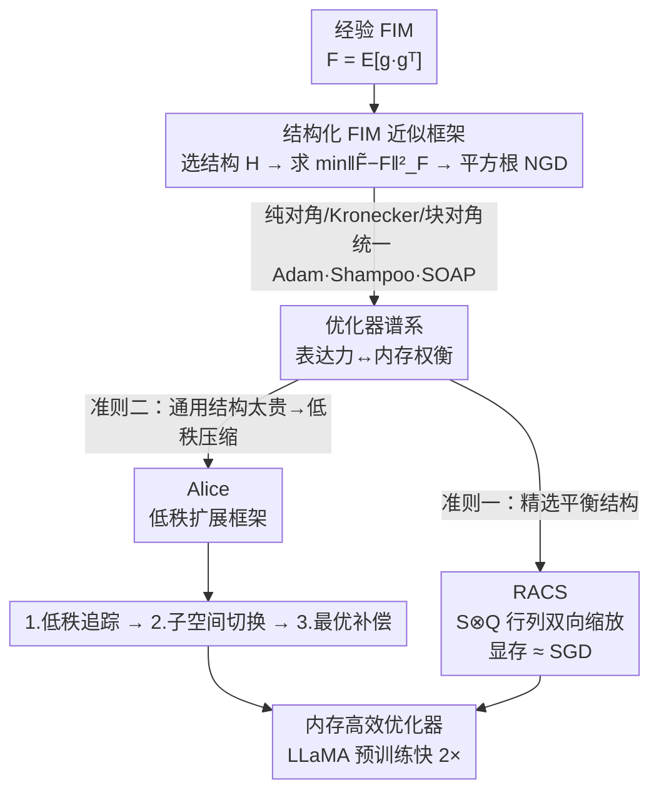

# Towards Efficient Optimizer Design for LLM via Structured Fisher Approximation with a Low-Rank Extension

**会议**: ICLR 2026  
**OpenReview**: [https://openreview.net/forum?id=KUFZXdem5R](https://openreview.net/forum?id=KUFZXdem5R)  
**代码**: 无  
**领域**: LLM效率 / 优化器设计  
**关键词**: Fisher 信息矩阵, 内存高效优化器, 自然梯度, 低秩扩展, LLaMA 预训练

## 一句话总结
把 Adam、Shampoo、SOAP 等一众优化器统一解释成「对 Fisher 信息矩阵 (FIM) 做不同结构假设下的 Frobenius 最优近似」，并据此给出两条设计准则——精选结构与低秩扩展——分别导出两个新的内存高效优化器 RACS 与 Alice，在 LLaMA 预训练（最大 1.3B）上比 Adam 收敛快 2 倍以上且几乎不增加显存。

## 研究背景与动机
**领域现状**：训练 LLM 主流靠自适应优化器（以 Adam 为代表）。但 Adam 要存一阶、二阶两个 EMA 状态，显存开销是参数量的 3 倍；像 Shampoo、SOAP 这类收敛更快（按训练步数算）的优化器显存还要再翻几倍——SOAP 的状态可达 SGD 的 7 倍。另一边，SGD 这种零状态的方法显存省，却训不动 LLM。

**现有痛点**：现有「内存高效」优化器的设计高度依赖直觉与试错（ad-hoc）：要么手动砍掉某个状态（如 Muon、SWAN），要么硬塞一个低秩投影（如 GaLore、Fira）。这些设计彼此孤立，缺乏一个统一原理来解释「为什么有效」、也无法系统性地推导新方法。

**核心矛盾**：结构假设的「一般性」（对 FIM 近似得越准、收敛越好）和「实际效率」（显存/计算开销越大）之间存在根本权衡。越通用的结构越逼近真实 FIM，但代价就是显存爆炸。

**本文目标**：(1) 找到一个能统一解释现有优化器的设计原理；(2) 在此原理下给出可操作的设计准则，造出既省显存又快收敛的新优化器。

**切入角度**：自然梯度下降 (NGD) 用 FIM 的逆来纠正局部几何。作者注意到，几乎所有高效优化器的预条件子，本质都是在「对 FIM 施加某种结构假设后求最优近似」。于是把 FIM 近似当作统一透镜：不同优化器 = 不同结构族 $\mathcal{H}$ 下 $\min_{\tilde F\in\mathcal{H}}\|\tilde F-F\|_F^2$ 的解。

**核心 idea**：用「结构化 FIM 近似」这把尺子统一度量所有优化器，再沿两条路造新优化器——要么挑一个一般性与效率平衡得好的结构（RACS），要么把通用结构的优化器做低秩压缩（Alice）。

## 方法详解

### 整体框架
全文的骨架是一个三步配方：**① 选一个结构族 $\mathcal{H}$ 去近似经验 FIM $F=\mathbb{E}[\vec g\,\vec g^\top]$；② 在 Frobenius 范数下求最优近似 $\tilde F^*=\arg\min_{\tilde F\in\mathcal{H}}\|\tilde F-F\|_F^2$；③ 用近似出的 $\tilde F$ 写出平方根 NGD 更新 $W\leftarrow W-\lambda\,\mathrm{Mat}(\tilde F^{-1/2}\nabla_\theta L)$。** 作者证明：当 $\mathcal{H}$ 取纯对角时还原 Adam，取 Kronecker 积 $R^{1/2}\otimes L^{1/2}$ 时还原 Shampoo，取共享特征空间的块对角时得到 OSOAP（Adam 的严格推广），再叠加 Kronecker 积则得到 SOAP——一张谱系图把所有优化器按「表达力 vs 内存」排好序。

在这张谱系图上，作者给出两条设计准则，各自落地成一个新优化器：**准则一**——直接在谱系里挑一个「一般性够用、但显存只有 SGD 量级」的结构，得到 RACS；**准则二**——对于显存太大的通用结构优化器（如 OSOAP），用一个三步低秩扩展框架（追踪→切换→补偿）压缩，得到 Alice。

### 关键设计

**1. 结构化 FIM 近似框架：把优化器设计变成「选结构 + 求最优近似」**

针对「现有高效优化器靠拍脑袋、彼此孤立、说不清为什么有效」这个痛点，作者把优化器设计形式化成一个可证明的三步流程。给定一层权重的向量化梯度 $\vec g=\mathrm{Vec}(G)$，经验 FIM 为 $F=\mathbb{E}[\vec g\,\vec g^\top]$，规模高达 $mn\times mn$ 无法直接求逆；于是限定在某个结构族 $\mathcal{H}$ 内求 Frobenius 最优近似：

$$\min_{\tilde F\in\mathcal{H}}\|\tilde F-F\|_F^2,\qquad W\leftarrow W-\lambda\,\mathrm{Mat}(\tilde F^{-1/2}\vec g).$$

不同的 $\mathcal{H}$ 解析解恰好就是现有优化器：取 $\mathcal{H}=\{\mathrm{Diag}_v(v)\}$ 时解为 $\tilde F^*=\mathrm{Diag}_v(\mathbb{E}[\vec g^2])$，配上一阶动量正好是 Adam；取 $\mathcal{H}=\{R^{1/2}\otimes L^{1/2}\}$ 并最小化一个上界，解为 $R^*=\frac1m\mathbb{E}[G^\top G],\,L^*=\frac1n\mathbb{E}[GG^\top]$，即 Shampoo；归一化/白化、Muon、LARS、LAMB 也都被收编成简单块对角结构的特例。更进一步，作者用「共享特征空间的块对角」$\mathcal{H}=\{\mathrm{DiagB}(U_fD_iU_f^\top)\}$ 推出 OSOAP（在被 $U_f$ 旋转过的空间里跑 Adam），再叠 Kronecker 积得到 SOAP。这套透镜的价值在于：它把「表达力 vs 内存」做成一根可比较的轴，让后续设计有据可依，而非碰运气。

**2. RACS：在谱系里精选一个「一般性够、显存却像 SGD」的结构**

针对准则一——通用结构虽准但太贵（SOAP 显存 $\approx$ SGD 的 7 倍），作者反其道而行，挑一个刚好推广「梯度归一化」、能同时缩放行与列的极简结构：

$$\mathcal{H}=\{S\otimes Q\},\quad S\in\mathbb{R}^{n\times n},\,Q\in\mathbb{R}^{m\times m}\ \text{均为正对角阵}.$$

最优解可由一个不动点迭代求出：$s=\mathrm{Diag}(\mathbb{E}[G^\top QG])/\|Q\|_F^2,\ q=\mathrm{Diag}(\mathbb{E}[GSG^\top])/\|S\|_F^2$，且该不动点收敛到 $\mathbb{E}[G^2]$ 的左右主奇异向量（差一个缩放）。对应的平方根 NGD 更新就是对梯度做行列双向缩放 $\mathrm{Mat}(\tilde F^{-1/2}\vec g)=Q^{-1/2}GS^{-1/2}$，作者称之为 Row and Column Scaled SGD (RACS)。实现上只跑 5 步不动点迭代近似，并借用 Fira 的 norm-growth limiter 稳定训练。它的妙处全在内存：只需存两个对角阵 $S,Q$ 和一个标量 limiter，显存开销仅 $m+n+1$——几乎和 SGD 一样，却能稳定训起 1B 模型。

**3. Alice：用「追踪→切换→补偿」三步把通用优化器低秩化**

针对准则二——有些通用结构（如 OSOAP）找不到现成的省显存结构，作者不放弃其潜力，而是提出一个通用低秩扩展框架，把全秩优化器转成低秩版，并用它把 OSOAP 压成 Alice。OSOAP 的关键状态是投影矩阵 $U_{f,t}=\mathrm{EVD}(\mathbb{E}[GG^\top])$，框架围绕它做三件事：

第一步**低秩追踪 (tracking)**：只保留前 $r$ 个特征向量 $U_t$，把状态投影成低秩 $\sigma_t=U_t^\top G_t,\ \tilde Q_{t+1}=\beta_3\tilde Q_t+(1-\beta_3)\sigma_t\sigma_t^\top$，需要时再重构 $Q_t\approx U_t\tilde Q_tU_t^\top$，把显存从 $m^2$ 降到 $r^2$。但这会丢掉补空间 $U_{c,t}$ 的信息。第二步**子空间切换 (switching)**：理论上 $Q_t$ 可分解为低秩重构项加一个衡量 $U_{c,t}$ 重要性的残差项，当残差占主导时补空间本应升为主基。作者据此反对「永远只留 top 特征向量」的惯例，故意把部分主特征向量替换成从补空间随机采样的基（Algorithm 1），逼优化器去探索别的方向。第三步**最优补偿 (compensation)**：低秩更新丢掉了 $U_{c,t}$ 那部分的参数更新，作者证明全秩更新可拆成低秩项 + 补空间项，而补空间项恰好是一个以 $\tilde F_c$ 为预条件子的 NGD——于是再次套用 FIM 透镜，用归一化的对角结构去近似 $\tilde F_c$，得到解析补偿 $C=U_cU_c^\top GS$，其中

$$\mathrm{Diag}(S)=\frac{\sqrt{m-r}}{\sqrt{\mathbb{E}[\mathbf 1_m^\top G^2-\mathbf 1_r^\top(U^\top G)^2]}}.$$

三步合起来就是 Alice（去掉追踪的变体叫 Alice-0）。有意思的是，GaLore 正好等价于「关掉追踪、切换、补偿」的 Alice，于是本框架顺带解释了 GaLore 为何有效——它其实是一个比 Adam 更强的优化器 (OSOAP) 的低秩版。作者还在连续时间设定下证明了 Alice 的收敛性。

### 损失函数 / 训练策略
方法不引入新损失，沿用标准预训练目标。训练全程 BF16（模型、参数、状态都用半精度）。RACS 用 5 步不动点迭代近似 $S,Q$；Alice 保留 top $r$ 基做低秩追踪，切换时保留 $l$ 个主基、其余 $r-l$ 从补基随机采样；RACS 与 Alice 均叠加 Fira 的 norm-growth limiter 稳定更新幅度。

## 实验关键数据

### 主实验
在 C4 数据集上预训练 LLaMA（60M/130M/350M/1.3B），评测困惑度 (Ppl，越低越好) 与优化器显存。括号内为「最后一层用 Adam 训练」的版本。

| 方法 | 60M Ppl | 130M Ppl | 350M Ppl | 1.3B Ppl | 1.3B 显存 |
|------|---------|----------|----------|----------|-----------|
| AdamW | 33.94 | 25.03 | 19.24 | 16.44 | 7.48G |
| GaLore | 38.91 | 27.18 | 21.11 | 16.60 | 4.25G |
| Fira | 33.77 | 25.21 | 18.93 | 15.14 | 4.25G |
| Apollo-svd | 31.26 | 22.84 | 16.67 | 14.10 | 4.43G |
| Muon | 31.6 | 24.59 | 19.30 | 16.08 | 5.23G |
| **RACS** | 30.25 | 22.67 | 16.51 | **13.52** | **2.98G** |
| **Alice-0** | 28.83 | 21.99 | 16.66 | 13.97 | 4.25G |
| **Alice** | **28.69** | **21.95** | 16.61 | 13.85 | 4.42G |

Alice 按训练步数算对 Adam 有 2.22×/2.00×/2.45×/**2.82×** 的加速；换算成墙钟时间的 effective TP，Alice/RACS 达到 123048/129817，而 Adam 仅 53588——墙钟时间也快 2 倍以上。RACS 以 SGD 量级显存（1.3B 仅 2.98G）拿到全场最低困惑度 13.52。

1B vs 7B 对比（Table 3）：用 Alice/RACS 训的 1B 模型在各 checkpoint 上一致优于用基线训的 7B 模型；跑 150K 步 8×A100，Apollo 要 15 天，Alice 只要 3.8 天。

### 消融实验
Alice 三步组件逐一加上去（350M，Table 4）：

| 配置 | Eval Ppl | 说明 |
|------|---------|------|
| 无追踪/切换/补偿 | 26.96 | 等价裸低秩（近 GaLore） |
| + 追踪 | 27.35 | 单加追踪反而略降（特征空间太稳） |
| + 追踪 + 切换 | 25.11 | 切换打破稳态，明显回升 |
| + 追踪 + 切换 + 补偿 | **21.95** | 补偿补回丢失更新，提升最大 |

### 关键发现
- **补偿是最大功臣**：从 25.11 降到 21.95，补偿步贡献最大；它把低秩丢掉的全秩更新以解析最优的方式补回，优于 Fira 的启发式补偿和无补偿基线。
- **追踪单独无益、需配切换**：只加追踪反而从 26.96 升到 27.35，因为低秩追踪会让特征空间过度稳定、困在旧主基；必须配合「子空间切换」强制探索补空间才有用。这也解释了 Alice-0（去掉追踪）能与 Alice 打平——追踪本身收益有限，去掉它更省显存。
- **切换策略优于随机基线**：相比从高斯采样、高斯混合、全基联合采样等替代方案，「从补空间采样」的切换策略以明显优势胜出。

## 亮点与洞察
- **一把尺子量遍所有优化器**：把 Adam/Shampoo/SOAP/Muon/GaLore 全部归约成「FIM 在不同结构族下的 Frobenius 最优近似」，让原本割裂的优化器设计有了统一坐标系——这是最让人「啊哈」的地方，也让「设计新优化器」从碰运气变成「在谱系里选结构」。
- **GaLore = 阉割版 Alice 的反推**：从框架反推出 GaLore 等价于关掉追踪/切换/补偿的 Alice，等于事后给 GaLore 的有效性一个原理性解释（它是更强优化器 OSOAP 的低秩版），这种「用新理论解释旧方法」的论证很漂亮。
- **挑战「永远留 top 特征向量」的惯例**：子空间切换故意把主特征向量换成随机补基，理论上由残差项主导性证明其合理，可迁移到任何需要低秩追踪 + 子空间探索的场景（如低秩自适应、PCA 在线估计）。
- **补偿步是 FIM 透镜的二次复用**：低秩丢掉的更新被证明仍是一个 NGD 形式，于是再套一层 FIM 近似求最优补偿——同一把尺子用了两次，方法自洽性强。

## 局限与展望
- 作者明确声明本文**不提供 LLM 优化器设计的完整/最终答案**，只是论证「结构化 FIM 近似」是一个有潜力的统一原理 + 两条示例准则；很多结论（如 RACS 的结构）「不总是容易找到」。
- 低秩扩展框架只在 OSOAP 上做了实例化得到 Alice，作者把推广到 SOAP 留作未来工作；收敛性也只在连续时间设定下证明，一般情形未解决。
- 实验全程 BF16、最大到 1.3B（1B vs 7B 那组也仅作内存高效基线对比，作者明确不声称 1B 能超 AdamW 训的 7B），混合精度训练、更大规模、下游任务（仅 GLUE 微调）覆盖有限。
- 自己的观察：RACS 困惑度甚至常优于显存更大的 Alice，论文未深究何时该用哪个；不动点只跑 5 步、limiter 等超参对稳定性的敏感度也没充分剖析。

## 相关工作与启发
- **vs Shampoo / SOAP**：它们用通用 Kronecker/块对角结构换来更准的 FIM 近似，代价是显存爆炸（SOAP $\approx$ 7× SGD）；本文用同一透镜解释它们，再用准则一/二造出显存小得多却收敛更快的 RACS/Alice。
- **vs GaLore / Fira**：GaLore 是 ad-hoc 低秩投影，本文证明它等价于阉割版 Alice，并指出其缺了切换与最优补偿；Fira 的补偿是启发式，本文的补偿是解析最优解，实验上明显更好。
- **vs Muon / SWAN / LARS / LAMB**：这些靠归一化/白化去状态，本文把它们统一收编为简单块对角结构的特例，还顺带从理论上补回原始 Muon 缺失的 $\sqrt n$ 系数。

## 评分
- 新颖性: ⭐⭐⭐⭐⭐ 用结构化 FIM 近似统一一众优化器，并据此系统化推导新方法，视角原创且解释力强。
- 实验充分度: ⭐⭐⭐⭐ LLaMA 60M–1.3B 全尺寸 + 充分消融 + 1B vs 7B 对比，但限 BF16、规模与下游任务覆盖有限。
- 写作质量: ⭐⭐⭐⭐ 谱系图与框架图清晰，理论推导严谨；但结构密集、符号繁多，需要一定优化理论背景。
- 价值: ⭐⭐⭐⭐⭐ 既给出可落地的高效优化器，又提供一套可持续衍生新优化器的设计原理，对 LLM 训练实用价值高。

<!-- RELATED:START -->

## 相关论文

- [\[ICLR 2026\] LoRA meets Riemannion: Muon Optimizer for Parametrization-independent Low-Rank Adapters](lora_meets_riemannion_muon_optimizer_for_parametrization-independent_low-rank_ad.md)
- [\[ICML 2026\] Memory-Efficient LLM Pretraining via Minimalist Optimizer Design](../../ICML2026/optimization/memory-efficient_llm_pretraining_via_minimalist_optimizer_design.md)
- [\[ICLR 2026\] Reducing Contextual Stochastic Bilevel Optimization via Structured Function Approximation](reducing_contextual_stochastic_bilevel_optimization_via_structured_function_appr.md)
- [\[ICLR 2026\] The Power of Small Initialization in Noisy Low-Tubal-Rank Tensor Recovery](the_power_of_small_initialization_in_noisy_low-tubal-rank_tensor_recovery.md)
- [\[ICLR 2026\] Trion: FFT-based Dynamic Subspace Selection for Low-Rank Adaptive Optimization of LLMs](trion_fft-based_dynamic_subspace_selection_for_low-rank_adaptive_optimization_of.md)

<!-- RELATED:END -->
