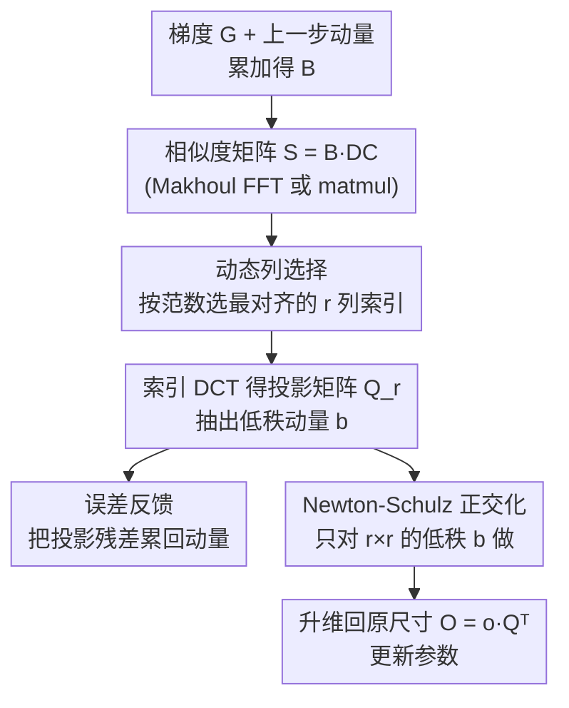

# Trion: FFT-based Dynamic Subspace Selection for Low-Rank Adaptive Optimization of LLMs

**会议**: ICLR 2026  
**OpenReview**: [https://openreview.net/forum?id=TkHjRwbMNl](https://openreview.net/forum?id=TkHjRwbMNl)  
**代码**: https://github.com/IST-DASLab/Trion  
**领域**: LLM效率 / 优化器 / 内存高效训练  
**关键词**: 低秩优化, DCT, 动态列选择, 优化器状态压缩, FFT

## 一句话总结
本文用一个**固定的离散余弦变换（DCT）正交矩阵 + 动态列选择**来替代 GaLore/Dion 等低秩优化器里昂贵的 SVD/QR 投影，每层只需存 $r$ 个整数索引而非完整投影矩阵，由此得到运行时与秩无关、内存最多降 25% 而精度不掉的两款优化器 Trion 与 DCT-AdamW。

## 研究背景与动机

**领域现状**：AdamW 是训练 LLM 的事实标准，但它要为每个参数维护两个动量 buffer，显存随模型规模线性膨胀。为了省下这块开销，出现了一条「低秩优化器」路线：GaLore 用 SVD 把梯度压到低维子空间里更新动量，后续的 LDAdam、FRUGAL、FIRA、Q-GaLore，以及最近基于动量正交化的 Muon、Dion，都沿用了「用矩阵分解求投影矩阵」这一核心套路。

**现有痛点**：这些方法的瓶颈都在 SVD/QR 分解本身。第一，分解要对**每一个线性层**单独做（有的每步做、有的每隔几步做），在大模型上计算量巨大；第二，求出的投影矩阵要**逐层显式存下来**，又吃掉一块显存；第三，像 Dion 用 QR 正交化、Muon 用 Newton-Schulz 迭代，它们的运行时还**随秩 $r$ 增长**，秩调大就更慢。

**核心矛盾**：低秩压缩本想省显存省时间，但「为每层动态求一个最优正交基」这件事本身既贵又占地方——投影质量（要贴合当前梯度）和投影代价（SVD/QR 太重）之间存在 trade-off。

**本文目标**：找一个**便宜、可移植、精度不掉**的替代品来顶替 SVD/QR 求出的正交矩阵，让它能插进各种内存高效优化器里。

**切入角度**：作者观察到——我们其实不必为每层**从零算**一个正交基。可以预先固定一个「万能」正交矩阵（DCT），然后针对每层的梯度，从它的列里**动态挑出最对齐的 $r$ 列**当投影矩阵。DCT 在 JPEG 图像压缩里早已证明能高效逼近能量集中的子空间，且它有 FFT 快速算法。

**核心 idea**：用「固定 DCT 矩阵 + 按对齐度动态选列」替代「逐层 SVD/QR」，把每层的投影矩阵存储从「一个稠密矩阵」压缩成「$r$ 个列索引」。

## 方法详解

### 整体框架

方法的核心是一个与具体优化器解耦的子例程——**动态列选择（Dynamic Column Selection）**：给定一个固定的 $n\times n$ 正交矩阵 $Q$（取 DCT）和当前层的梯度/动量矩阵 $G$，计算相似度矩阵 $S=GQ$，按列的 $\ell_1/\ell_2$ 范数排序，挑出最大的 $r$ 列索引，用这些索引去 $Q$ 里抽列就得到该层专属的投影矩阵 $Q_r$。整套流程只需一次矩阵乘 + 一次排序，DCT 矩阵全程只在训练开始时算一次、每张 GPU 存一份。

作者把这个子例程分别塞进两类主流优化器，得到两个独立优化器：**Trion**（改 Dion，用 DCT 选列替掉 Power-Iteration，再对低秩动量做 Newton-Schulz）和 **DCT-AdamW**（改 LDAdamW 一类低秩 AdamW，用 DCT 投影替掉 SVD，并可选 8-bit 量化误差反馈）。两者共享同一个「动态列选择」内核，区别只在外层优化器逻辑。

下图以 Trion 为例展示一个训练步的数据流：

### 关键设计

**1. 动态列选择：把"求投影矩阵"变成"挑列索引"**

这是替掉 SVD/QR 的关键一招，直击「逐层分解又贵又占显存」的痛点。给定固定正交矩阵 $Q\in\mathbb{R}^{n\times n}$ 和梯度 $G\in\mathbb{R}^{n\times n}$，先算相似度矩阵 $S=GQ$，它第 $i$ 列装的是 $G$ 各行与 $Q$ 第 $i$ 列的内积——即各列基向量与当前梯度的「对齐度」。然后按每列的 $\ell_1$ 或 $\ell_2$ 范数排序，取最大的 $r$ 个列索引 $i_t$，用它们去 $Q$ 里抽列就得到该层投影矩阵 $Q_r$，把梯度投到 $r$ 维：$g=GQ_r$。

它的妙处在于「动态」体现在**索引集合**上而非矩阵本身：每层从 $\binom{n}{r}$ 种可能的列组合里挑最贴合当前梯度的那组，所以投影会随训练中梯度的变化而变；但代价侧只需存 $r$ 个整数，而不是一个 $C\times r$ 的稠密投影矩阵。配合 GaLore 的标准做法（把矩阵较小的那一维压到 $r$，按层形状选左投影或右投影），整个模型在每张 GPU 上的额外显存就只剩「一份 $d_{model}\times d_{model}$ 的 DCT 矩阵 + 每层 $r$ 个索引」。第 4 节还从理论上论证了这种按对齐度选列能最小化投影误差。

**2. 用 DCT 当固定正交矩阵 + Makhoul FFT 算法加速对齐**

为什么固定矩阵选 DCT 而不是随便一个正交阵？因为 DCT 不仅在信号/图像压缩里被证明能很好地集中能量，更关键的是它有结构、能用快速算法算。本文用 DCT-II/III，矩阵元素 $Q_{ij}=\sqrt{2/n}\cdot\cos\frac{i(2j+1)\pi}{2n}$（第一行除以 $\sqrt 2$ 以保证 $Q^\top Q=I_n$ 正交），训练前一次性在 GPU 上物化。

算相似度矩阵 $S=GQ$ 本来要 $O(n^3)$ 的稠密矩乘，但因为 $Q$ 是 DCT，可以用 **Makhoul 的 N-point 算法**借助 FFT 在 $O(n^2\log n)$ 时间内完成。对大层而言，这能把算对齐的开销加速 $8\sim 50\times$（在低端/老一代 GPU 上尤其明显，因为它们的 tensor-core 弱、FFT 收益更突出；新卡 tensor-core 太快时 matmul 反而不输）。这一设计让 Trion 的运行时**与秩无关**——无论 $r$ 是 128 还是 512，选列开销几乎不变，而 Dion 因为 QR 的缘故运行时随 $r$ 增长。

**3. Trion：低秩动量 + Newton-Schulz，给 Dion 提速降存**

Dion 用 Power-Iteration 求低秩投影、再用 QR 正交化，运行时随秩增长。Trion 把这两步换成「DCT 动态列选择 + 对低秩动量做 Newton-Schulz」。具体每步：累加动量 $B_t=M_{t-1}+G_t$，算相似度 $S_t=B_t D_C$，选列得索引 $i_t$ 与投影矩阵 $Q_t=D_C[:,i_t]$，从 $S_t$ 直接抽出低秩动量 $b_t=S_t[:,i_t]$；投影残差 $\Delta_t=B_t-b_tQ_t^\top$ 通过 $M_t=\mu B_t+(1-\mu)\Delta_t$ 以**误差反馈**形式累回动量，避免被丢弃的方向信息流失。

最关键的一步是：Newton-Schulz **只作用在 $R\times r$ 的低秩动量 $b_t$ 上**，而非原始的 $R\times C$ 全尺寸动量 $B_t$，正交化后再 $O_t=o_tQ_t^\top$ 升维回去更新参数。这把 Newton-Schulz 的运算从全尺寸矩阵降到 $r\times r$，作者称这是首次用「动量的低秩近似」来降低 Newton-Schulz 的复杂度。在 DDP 下还能只在源 GPU 算更新、跨卡只通信低秩项 $o_t$（而非全尺寸正交矩阵），进一步省通信。

**4. DCT-AdamW：用两组索引替掉两个投影矩阵**

为了让动量 buffer 始终在「相同的低维子空间」里累加新梯度（这是 LDAdamW 保证一致性的做法），LDAdamW 必须**逐层存两个相邻的投影矩阵**来旋转动量，显存因此接近满秩 AdamW。DCT-AdamW 把这两个矩阵换成**两组 $r$ 个索引**，配合可选的 8-bit 量化误差反馈（实测 8-bit 是不掉点的最低分辨率）和 ZeRO-redundancy 技巧（一层只在一张 GPU 上更新再广播、收方不分配优化器状态），从而在保持子空间一致性的同时把显存大幅压下来。

### 损失函数 / 训练策略

方法不改训练目标，只换优化器内部的投影机制。Trion 沿用 Dion 的最优超参（学习率 $\eta=0.01$、权重衰减 $\lambda=0.01$），参数更新带形状缩放 $\theta_{t+1}=(1-\lambda\eta_t)\theta_t-\eta_t\max(1,\sqrt{R/C})O_t$。秩取 $r\in\{128,256,512\}$，对应秩比 $r/d\in\{1/16,1/8,1/4,1/2\}$。

## 实验关键数据

预训练在 C4 上从头训 Llama 350M/800M/1.3B，按 Chinchilla 最优（20 tokens/参数）、序列长 512、8×H100 DDP、全局 batch 512。

### 主实验：Trion vs Dion（PT，节选 rank 256）

| 模型 | 指标 | Trion | Dion | Muon(参考) |
|------|------|-------|------|-----------|
| 350M | Val PPL | 15.30 | 15.64 | 14.99 |
| 350M | Memory(GB) | 42.42 | 45.59 | 42.42 |
| 350M | Runtime | 1h53m | 2h3m | 1h52m |
| 800M | Val PPL | 12.22 | 12.42 | 12.05 |
| 800M | Memory(GB) | 67.45 | 71.75 | 67.45 |
| 1.3B | Val PPL | 11.28 | 11.47 | 11.13 |
| 1.3B | Memory(GB) | 63.62 | 68.58 | 63.64 |

Trion 在所有模型/所有秩上训练与验证 loss/PPL 都低于 Dion，显存约低 10%，且运行时几乎不随秩变化；Dion 的运行时则随秩明显增长。Trion 相对 Dion 提速：rank 128 约 2.5–4.5%、rank 256 约 4.5–9%、rank 512 约 8–18%（秩越大优势越大）。

### DCT-AdamW vs LDAdamW（Llama-800M，100 tokens/参数）

| 优化器 | Val PPL | Mem(GiB) | Time |
|--------|---------|----------|------|
| AdamW(满秩参考) | 11.73 | 73.72 | 1d13h22m |
| LDAdamW | 13.91 | 72.10 | 2d1h24m |
| DCT-AdamW | 13.69 | 57.82 | 1d15h17m |

DCT-AdamW 比 LDAdamW PPL 更低、显存从 72.10 降到 57.82 GiB、运行时快约 10h7m（≈25.75%）；相比满秩 AdamW 仅慢约 5%。LDAdamW 因要存两个投影矩阵，显存几乎和 AdamW 一样，而 DCT-AdamW 只存两组索引。

### 关键发现
- **投影更准是性能更好的根因**：作者直接测累加器 $B_t$ 与各优化器实际更新之间的 $\ell_2$ 投影误差（Llama-30M 首个 transformer block 各层），Trion 的投影误差持续低于 Dion，解释了为何 loss 更低。
- **运行时与秩解耦**是 Trion 相对 Dion 最大的工程优势，规模越大、秩越高，收益越显著。
- **省显存来自"存索引不存矩阵"**：把逐层稠密投影矩阵换成 $r$ 个整数，这是 10%（Trion）到 25%（DCT-AdamW）显存下降的来源。
- 作者也把 DCT 投影插进 FRUGAL/FIRA 替掉 SVD（Llama-800M / 16B tokens，附录 I），验证该子例程的可移植性。

## 亮点与洞察
- **「固定基 + 选列」替「逐层分解」**：最巧的地方是认识到投影矩阵不必逐层从头算——一个万能 DCT 矩阵 + 动态挑列就能逼近 SVD/QR，且把存储从矩阵降到索引。这种「预定义正交基 + 数据相关选择」的思路可迁移到任何需要逐层低秩投影的场景。
- **借 JPEG 的经验到优化器**：DCT 在图像压缩里是能量集中的老将，作者首次把它引入低秩自适应梯度优化，并用 Makhoul FFT 算法把对齐计算降到 $O(n^2\log n)$。
- **只对低秩动量做 Newton-Schulz**：把昂贵的正交化从全尺寸矩阵搬到 $r\times r$，是给 Muon/Dion 一类正交化优化器提速的通用 trick。
- **DDP 下只通信低秩项**：跨卡只传 $o_t$ 再本地 $O_t=o_tQ_t^\top$，因为 DCT 矩阵已在每卡复制，省通信带宽。

## 局限与展望
- 作者指出，本文实验模型的 embedding 维 $d$ 偏小，Makhoul FFT 相对 matmul 的运行时优势在 H100 这类新卡上看不太出来——FFT 的收益主要在老一代/低端 GPU 或更大的 $d$ 上才显著（附录 D/E）。这意味着「FFT 加速」这个卖点在主流大卡上当前更多是理论优势。
- 评测集中在 PT 的 PPL 与 FT 准确率（FT 在附录 K），缺少下游任务大规模验证。
- 用固定 DCT 基本质上限制了子空间的「字典」——当梯度的主方向恰好与所有 DCT 基都不太对齐时，选列逼近 SVD 的质量可能下降，论文未深入刻画这种最坏情况。
- FSDP 实现需要根据每层是左/右投影来决定分片方式，工程上不如 DDP 直接。

## 相关工作与启发
- **vs GaLore / LDAdamW（SVD 系）**：它们逐层做 SVD 求投影并显式存矩阵；本文用固定 DCT + 选列逼近，存储降到索引，免去每步/每几步的分解开销，DCT-AdamW 直接对标 LDAdamW 并省 25% 显存。
- **vs Dion（QR + Power-Iteration）**：Dion 运行时随秩增长且逐层存投影矩阵；Trion 用 DCT 选列（秩无关）+ 仅对低秩动量做 Newton-Schulz，loss 更低、显存更省、运行时几乎不随秩变。
- **vs Muon（Newton-Schulz 满尺寸正交化）**：Muon 要在 GPU 上物化全尺寸矩阵做迭代，难并行；Trion 先低秩再正交化，把 Newton-Schulz 降到 $r\times r$，作者称是首次用低秩近似降低 Newton-Schulz 复杂度。

## 评分
- 新颖性: ⭐⭐⭐⭐ 首次把 DCT/FFT 的「固定基 + 动态选列」引入低秩优化器状态压缩，思路简洁且可移植。
- 实验充分度: ⭐⭐⭐⭐ 覆盖 3 个 Llama 规模、多种秩、Trion/DCT-AdamW 两条线 + 投影误差分析，但模型偏小、缺下游任务。
- 写作质量: ⭐⭐⭐⭐ 动机清晰、算法伪代码完整，FFT 收益的适用条件也坦诚交代。
- 价值: ⭐⭐⭐⭐ 即插即用替换 SVD/QR，显存降 10–25%、运行时与秩解耦，对大规模高效训练实用。

<!-- RELATED:START -->

## 相关论文

- [\[ICLR 2026\] The Power of Small Initialization in Noisy Low-Tubal-Rank Tensor Recovery](the_power_of_small_initialization_in_noisy_low-tubal-rank_tensor_recovery.md)
- [\[ICLR 2026\] Towards Efficient Optimizer Design for LLM via Structured Fisher Approximation with a Low-Rank Extension](towards_efficient_optimizer_design_for_llm_via_structured_fisher_approximation_w.md)
- [\[ICLR 2026\] LoRA meets Riemannion: Muon Optimizer for Parametrization-independent Low-Rank Adapters](lora_meets_riemannion_muon_optimizer_for_parametrization-independent_low-rank_ad.md)
- [\[ICLR 2026\] Adaptive Acquisition Selection for Bayesian Optimization with Large Language Models](adaptive_acquisition_selection_for_bayesian_optimization_with_large_language_mod.md)
- [\[ICLR 2026\] Towards Dynamic Interleaving Optimizers](towards_dynamic_interleaving_optimizers.md)

<!-- RELATED:END -->
