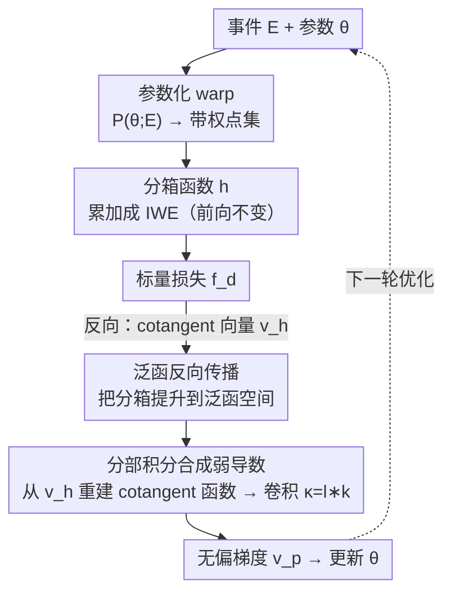

# Unbiased Gradient Estimation for Event Binning via Functional Backpropagation

**会议**: ICLR 2026  
**OpenReview**: [https://openreview.net/forum?id=BRj3HvQnSZ](https://openreview.net/forum?id=BRj3HvQnSZ)  
**代码**: https://github.com/chjz1024/EventFBP  
**领域**: 优化 / 梯度估计 / 事件相机视觉  
**关键词**: 事件相机, 分箱函数, 无偏梯度, 弱导数, 分部积分

## 一句话总结
针对事件相机把事件「分箱」成帧时分箱函数不连续、导致直接从原始事件学习时梯度有偏的问题，本文提出**泛函反向传播（FBP）**：把分箱函数提升到泛函空间，借助分部积分让 cotangent 函数自然浮现，再从采样到的 cotangent 向量重建它，从而合成**可证明无偏**、且能逼近长程有限差分的弱导数——前向输出完全不变，只改反向传播，就让 egomotion、光流、SLAM 等任务一致受益。

## 研究背景与动机

**领域现状**：事件相机以异步时空脉冲（event）编码高速动态场景。为了复用成熟的图像处理管线，主流做法是把不规则的事件「分箱（binning）」聚合成稠密帧——典型如把事件按运动参数 warp 后累加成 IWE（Image of Warped Events），再在 IWE 上构造锐度/对比度损失来反求运动参数。这套「Contrast Maximization」范式撑起了事件光流、定位、SLAM 等一大批工作。

**现有痛点**：分箱函数本质上是**不连续**的（一个事件落进某个 bin 是阶跃式的归属）。不连续意味着梯度在帧这一层被截断，于是绝大多数事件算法只能依赖「帧级特征」、放弃从原始事件端到端学习。少数想直接从原始事件学习的工作，则被迫给分箱套一个「平滑替身」（smooth binning），或者照搬脉冲神经网络里的 straight-through estimator（STE）、surrogate gradient（SG）。

**核心矛盾**：这些替身都是**启发式**的——平滑分箱改变了前向输出、破坏其物理含义；STE / SG 直接用一个拍脑袋的光滑形状替换真梯度。它们共同的硬伤是**梯度有偏**，没有任何无偏性保证，学习效率因此受限。问题的数学根源在于：对不连续函数求经典导数会冒出无法逐点计算的 Dirac delta，于是反向传播里那一步「warp 坐标对参数的梯度」算不出来。

**切入角度**：作者从泛函分析里的**弱导数（weak derivative）**出发观察到一件关键的事——弱导数的逐点值也许不可算（Dirac delta），但它的**积分是良定义的**，而且可以用**分部积分**来计算。也就是说，只要我们能在计算上对得上弱导数的积分，得到的梯度估计就能恢复无偏。

**核心 idea**：把分箱函数从「函数」提升到「泛函」，反向传播时它的导数自然以**积分 + cotangent 函数**的形式出现；用信号重建从离散的 cotangent 向量重建出连续的 cotangent 函数，再用分部积分把不可算的 Dirac delta 换成一次卷积，就解析地合成出无偏的弱导数。

## 方法详解

### 整体框架

把整个事件优化管线拆成前向、反向两条路。**前向**：一组事件 $E=\{e_i=(t_i,x_i,y_i,p_i)\}$ 经参数化变换 $P(\theta;E)$ warp 成带权点集，再过分箱函数 $h$ 累加成 IWE，最后由分箱值算出标量损失 $f_d$。前向这一路**完全不动**——分箱该怎么算还怎么算，输出逐字节不变。

问题全在**反向**。普通反向传播里，IWE 的 cotangent 向量 $v_{h_j}$ 要往回传到「warp 后坐标 $x_i'$」时，会撞上分箱函数的不连续，产生不可算的 Dirac delta。FBP 的做法是：把这一步从离散空间「抬」到泛函空间——离散的 cotangent 向量其实是连续 cotangent 函数 $v_h(\cdot)$ 在网格点上的**采样**（采样率随 bin 宽 $\Delta\to0$ 成立）；于是用信号重建从这些采样点把 $v_h(\cdot)$ 重建回来，再借分部积分把「与 Dirac delta 卷积」换成「与重建核·分箱核的卷积导数」卷积，得到无偏梯度 $v_p$ 去更新参数。

整条管线如下，左侧前向不变、右侧把原本断掉的反向用泛函路径接上：

### 关键设计

**1. 泛函反向传播：把分箱函数提升到泛函空间，让 cotangent 函数自然浮现**

普通反向传播在有限维上跑链式法则：$v J_{g\circ f}=(vJ_g)\cdot J_f$，其中 $v$ 是 cotangent 向量。本文的第一步是把这套链式法则推广到**无穷维的泛函**。一个泛函 $f$ 把整个函数 $u\in H(X)$ 映成另一个函数 $f[u]\in H(Y)$；按 Fréchet 导数与 Riesz 表示定理，它的导数由「导数核函数」$\frac{\delta f[u](y)}{\delta u(x)}$ 表示（定义 1）。于是泛函的链式法则（定理 1）不再是矩阵乘法，而是一个**积分变换**：

$$\frac{\delta g[f[u]](z)}{\delta u(x)}=\int_Y \frac{\delta g[f[u]](z)}{\delta f[u](y)}\,\frac{\delta f[u](y)}{\delta u(x)}\,dy.$$

当 $X,Y,Z$ 是有限集时积分退化成求和，这条式子就还原成熟悉的有限维链式法则——所以泛函链式法则是普通反向传播的严格推广。在这套框架下递归计算的不再是 cotangent 向量，而是 cotangent **函数** $v(\cdot)\in H(Z)$，作者把这个递归过程命名为 Functional Backpropagation（FBP）。这一步的意义是：它给「不连续分箱」找到了一个连续的栖身之所——只要在泛函空间里，分箱的导数就以积分（而非逐点 Dirac delta）的形式存在。

**2. 分部积分合成弱导数：从离散 cotangent 向量重建连续 cotangent 函数**

这是全文最核心的技术。1D 分箱函数定义为 $h_j(P)=\sum_i w_i' k\!\left(\frac{x_i'-j\Delta}{\Delta}\right)$，把 $j\Delta$ 换成连续变量 $x$ 就得到连续分箱 $h[P](x)$，二者之间存在一个采样泛函 $S$（在网格点取值）。要算 $\frac{\partial f_c}{\partial x_i'}$，泛函反向传播给出

$$v_{x_i'}=\int_{\mathbb{R}} v_h(x)\,\frac{\partial h(x)}{\partial x_i'}\,dx,\qquad v_h(x)=\sum_{j=1}^{W} v_{h_j}\,\delta(x-j\Delta).$$

也就是说，一次普通反向传播给出的，是被 cotangent 向量调制的一串 **Dirac 梳**（Dirac comb）——它正是连续 cotangent 函数 $v_h(\cdot)$ 的采样。固定 $W\Delta$、令 $\Delta\to0$，采样关系精确成立：$\lim_{\Delta\to0}\frac{1}{\Delta}v_{h_j}=v_h(j\Delta)$。既然 cotangent 函数本质上编码连续的运动流、天然光滑，就可以用**信号重建**把它从采样点恢复：把式中的 $\delta(\cdot)$ 换成一个重建核 $\frac1\Delta l(\frac\cdot\Delta)$，再做分部积分，得到合成的弱导数

$$\widetilde{\frac{\partial h_j}{\partial x_i'}}=w_i'\,\frac{\partial}{\partial x_i'}\,\kappa\!\left(\frac{x_i'-j\Delta}{\Delta}\right),\qquad \kappa(x)=(l*k)(x).$$

把它和形式导数 $\frac{\partial h_j}{\partial x_i'}=w_i'\frac{\partial}{\partial x_i'}k(\cdot)$ 对照，可以发现合成弱导数恰好等价于「卷积核 $\kappa=l*k$ 的代理梯度」。和 STE/SG 拍脑袋选光滑形状不同，这里的代理形状是由**重建核 $l$ 与真实分箱核 $k$ 的卷积**确定的——它捕捉了分箱的几何结构，因而能证明无偏，且对任意目标（光滑或非光滑）都具有有限阶精度地逼近**长程有限差分**，并自然推广到多维（每维各自把 $k_d$ 换成 $\kappa_d$）。

**3. 只改反向、前向不变的即插即用实现 + 重建核的选择**

理论虽密，落地却很轻：FBP **只修改反向传播里的梯度累加那一步**，把不连续的分箱核导数替换成合成的弱导数 $\kappa'(\cdot)$，前向分箱、forward-mode 的 JVP、backward-mode 的 VJP 全部沿用标准结构（算法 1 给了 2D 的 primal/JVP/VJP 三合一伪代码）。重建核 $l$ 的选择对应对 cotangent 函数光滑性的不同先验：Linear（三角核）假设最弱、Bicubic 假设 $C^2$ 光滑、Lanczos 假设带限。实验表明 Linear 核在精度/速度上取得最佳折中——高阶核更光滑却带来更高计算开销、精度收益递减，故全文余下实验都用 Linear 重建核。需要说明的是，重建并非万灵药：对二阶非线性较强的 Log-Likelihood 分数，三角重建核的二阶精度有限，效果会变得「看任务而定」，但框架本身支持通过更换 cotangent 重建约束来适配。

### 损失函数 / 训练策略
方法不引入新损失，而是套在已有的 Contrast Maximization 目标上。偏差分析里用了两类分数：方差分数 $\mathrm{Var}=\frac{1}{N_p}\sum_{i,j}(h_{i,j}-\mu_H)^2$ 与对数似然 $\mathrm{LL}=\sum_{i,j}\log\mathrm{NB}(h_{i,j}|r,p)$。优化器按核性质区分：rect/linear 核用 L-BFGS-B，gauss 核用 trust-ncg。IWE 分辨率 $200\times150$，分箱步长 $\Delta=0.01$，每包 $N_e=20000$ 个事件，JAX 实现。

## 实验关键数据

### 主实验

事件运动估计（ECD 数据集 8 条序列，旋转 + 平移）与两个下游任务：

| 任务 | 指标 | baseline | 本文(FBP) | 提升 |
|------|------|----------|-----------|------|
| 角速度估计 | RMS (°/s) | Raw 梯度 | Func 梯度 | RMS ↓10.3%，收敛 ↑1.66× |
| 线速度估计 | RMS (m/s) | Raw 梯度 | Func 梯度 | RMS ↑3.9%（任务奇异），收敛 ↑1.48× |
| egomotion 总体 | RMS / 收敛 | Raw | Func | RMS ↓3.2%，收敛 ↑1.57× |
| 光流 MotionPriorCMax | EPE↓ (DSEC) | 2.81 | **2.54** | ↓9.4% |
| 光流 | AE↓ / 3PE↓ | 8.96 / 14.5 | **8.33 / 13.3** | ↓0.63 / ↓1.2 |
| SLAM CMax-SLAM | RMS 轨迹误差 | baseline | Ours | ↓5.1% |

光流任务里作者把 MotionPriorCMax 原本用的 linear 分箱核换成 **rect 核 + FBP 梯度**重训，仍取得更低 EPE——说明在以前根本无法训练的不连续核上，FBP 让网络学到更鲜锐 IWE、更鲁棒的特征。（注：贡献列表写的是受控设置 3.7%，实验正文为 3.2%，以正文为准。）

### 消融实验

| 配置 | 关键指标 | 说明 |
|------|---------|------|
| Linear 重建核 | 精度/时间最优折中 | 全文采用 |
| Bicubic / Lanczos | 精度相近、耗时更高 | 高阶光滑收益递减 |
| STE 代理梯度 | 误差地板高（shapes Var 96.89） | 启发式、不稳定 |
| Sigmoid 代理梯度 | 优于 STE 但仍逊 FBP | 强行套光滑形状 |
| FBP (Ours) | 误差更低 + 收敛更快 | 分部积分捕捉分箱几何 |
| 计算开销 | ≈2× 标准 JVP | 用优化效率换回 |

### 关键发现
- **无偏性是真受益来源**：FBP 只改梯度、不改解空间，性能提升说明合成梯度提供了更有效的更新方向；方差分数下偏差被大幅压低（rect/gauss 这种不连续/有偏核改善最明显，连本就无偏的 linear 核也因更好逼近长程有限差分而进一步降偏）。
- **vs 启发式代理梯度**：在与 STE、Sigmoid 的对比中 FBP 误差地板与收敛时间都更优，验证「用分部积分导出的梯度」比「随手指定光滑形状」更贴合分箱几何。STE 在 shapes 序列上误差爆炸（96.89°/s），暴露启发式代理的不稳定。
- **代价与边界**：梯度计算约 2× 开销，但优化更快、迭代更少，整体净赚；对二阶非线性强的 LL 分数三角重建核精度有限，需按任务调整重建约束。

## 亮点与洞察
- **把「不可算的导数」变成「可算的卷积」**：核心 trick 是 lift 到泛函空间后，分部积分把与 Dirac delta 的卷积换成与重建核·分箱核卷积导数 $\kappa=l*k$ 的卷积——一步把数学上的奇异点工程化为一次普通卷积，优雅且可落地。
- **前向零改动、即插即用**：只动反向梯度累加，前向输出逐字节不变，意味着可以直接挂到现有 Contrast Maximization 管线、甚至 SOTA 光流网络上，不破坏其物理含义，这是它比 smooth binning 更可贵之处。
- **可迁移的视角**：「离散反向是连续 cotangent 函数的采样，可用信号重建恢复」这一观点，原则上能推广到神经形态计算里所有「不连续非线性 + 需要梯度」的场景（脉冲神经元、量化、阶跃归属），为 STE/SG 提供了一个带无偏保证的替代品。

## 局限与展望
- **重建核与任务耦合**：三角（Linear）重建核只有二阶精度，对 LL 这类二阶非线性强的分数偏差反而可能增大，作者承认「精确梯度估计应当 application-dependent」，需手工换重建约束。
- **计算开销翻倍**：合成梯度约为标准 JVP 的 ~2×（CPU 上大 $N_e$ 时甚至 3.68×），在对反向时间敏感的大规模训练里需权衡。
- **任务奇异性**：线速度估计因任务本身奇异性，RMS 反而略升 3.9%，说明更好的梯度方向不能消除任务病态。
- **验证范围**：实验集中在事件运动估计/光流/SLAM，方法虽声称对任意分箱函数通用，但在分类、检测等其他事件任务上的端到端收益尚待验证。

## 相关工作与启发
- **vs 平滑分箱（function relaxation）**：平滑分箱改变前向输出、可能破坏物理含义；FBP 前向完全不变，只在反向重建 cotangent 函数，是「不改输出却恢复可微」的路线。
- **vs STE / Surrogate Gradient（脉冲神经网络）**：STE/SG 用启发式光滑形状替换真梯度、无无偏保证、依赖经验选形；FBP 的代理形状由 $l*k$ 由数学推导确定，可证明无偏并逼近长程有限差分，实验上误差地板更低。
- **vs Contrast Maximization 系（CMax-SLAM、MotionPriorCMax）**：这些方法受限于分箱不可微、只能用特定可微核或帧级特征；FBP 作为可插拔的梯度模块，让它们能在以前训不动的不连续核（如 rect）上训练并提升精度。

## 评分
- 新颖性: ⭐⭐⭐⭐⭐ 用泛函分析 + 分部积分给「不连续分箱的无偏梯度」一个可计算的解析框架，视角新且扎实。
- 实验充分度: ⭐⭐⭐⭐ 偏差分析 + egomotion + 光流 + SLAM 三层验证，但任务集中在事件运动估计，规模偏小。
- 写作质量: ⭐⭐⭐⭐ 理论推导清晰、配图（Fig 1/2）把梯度偏差问题讲透，但泛函记号对一般读者门槛较高。
- 价值: ⭐⭐⭐⭐⭐ 给事件视觉「直接从原始事件学习」扫清了一个根本性障碍，且方法即插即用、可迁移到更广的不连续非线性场景。

<!-- RELATED:START -->

## 相关论文

- [\[ICLR 2026\] Multilevel Control Functional](multilevel_control_functional.md)
- [\[ICLR 2026\] Binomial Gradient-Based Meta-Learning for Enhanced Meta-Gradient Estimation](binomial_gradient-based_meta-learning_for_enhanced_meta-gradient_estimation.md)
- [\[ICLR 2026\] Riemannian Zeroth-Order Gradient Estimation with Structure-Preserving Metrics for Geodesically Incomplete Manifolds](riemannian_zeroth-order_gradient_estimation_with_structure-preserving_metrics_fo.md)
- [\[ICML 2025\] Revisiting Unbiased Implicit Variational Inference](../../ICML2025/optimization/revisiting_unbiased_implicit_variational_inference.md)
- [\[ICLR 2026\] On the Convergence Direction of Gradient Descent](on_the_convergence_direction_of_gradient_descent.md)

<!-- RELATED:END -->
