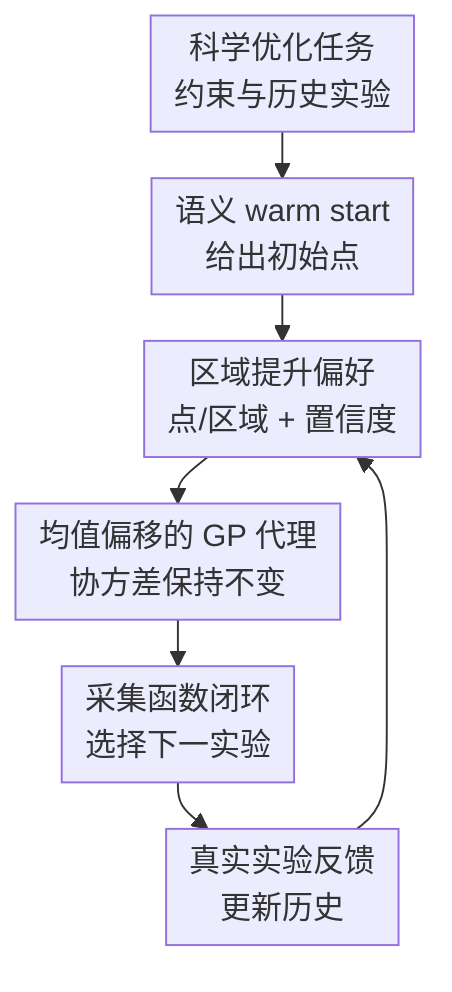

# Unleashing LLMs in Bayesian Optimization: Preference-Guided Framework for Scientific Discovery

**会议**: ICLR2026  
**OpenReview**: [https://openreview.net/forum?id=LktUOZayG9](https://openreview.net/forum?id=LktUOZayG9)  
**代码**: 暂未公开  
**领域**: 贝叶斯优化 / 科学发现  
**关键词**: 贝叶斯优化, 大语言模型偏好, 区域提升, 科学实验优化, 湿实验  

## 一句话总结
LGBO 把 LLM 对“哪里更值得试”的语义偏好持续转成 GP 代理模型的可控均值偏移，让 Bayesian optimization 在科学发现任务中既能借用领域知识加速冷启动，又不把最终选点权交给可能不稳定的 LLM。

## 研究背景与动机
**领域现状**：科学发现里的许多优化任务本质上都是昂贵黑盒优化：一次实验可能意味着合成材料、测量电池电解液、打印结构或跑色谱流程，成本高、反馈慢、真实目标函数不可解析。Bayesian optimization 因此常被用在自驱实验室和 AI for Science 场景中，用 GP 等代理模型估计目标函数，再通过 EI、UCB 或 qEI 这类采集函数选择下一次实验，在探索未知区域和利用高均值区域之间折中。

**现有痛点**：标准 BO 的一个老问题是冷启动慢。刚开始只有很少实验点时，GP 后验基本靠核函数外推，高维空间里尤其容易把预算浪费在没有物理意义的区域。LLM 看起来能补上这块，因为它可能从文献、化学常识、材料经验或任务描述里推断哪些区域更有希望；但已有 LLM+BO 方法通常只是让 LLM 做初始化，或者让 LLM 生成候选点后再交给 acquisition 过滤。这样 LLM 的作用要么只发生在最开始，要么只是候选生成器，真正的优化闭环仍然由标准 BO 主导。

**核心矛盾**：LLM 的知识很有用，但它的输出又粗糙、噪声大、可能随轮次漂移。若直接让 LLM 修改 acquisition function 或直接决定下一点，BO 的统计结构会被破坏；若只让 LLM 提几个候选点，它的偏好又会被 GP 和采集函数轻易覆盖。本文要解决的矛盾就是：如何把 LLM 的语义偏好嵌进 BO 的每一轮，同时保持 GP 后验和 acquisition 决策的稳定性。

**本文目标**：作者把问题拆成三步：第一，让 LLM 以点或区域的形式表达粗粒度偏好，而不是要求它给精确函数值；第二，把这种偏好转成一个数学上可处理的 GP prior/posterior 变换；第三，在每一轮 BO 中反复更新 LLM 偏好，使它随实验历史演化，而不是一次性 warm start。

**切入角度**：论文的关键观察是，LLM 更擅长说“高温低压附近可能更好”“某类配方比例更值得探索”这种区域级建议，而不是判断两个具体点的函数值谁大。于是作者不把 LLM 偏好写成点对比较，而是把它提升成对一个区域内函数值整体偏高的偏好，并利用 Gaussian measure 的指数线性 tilting 性质，把这件事等价为 GP 均值函数的平移。

**核心 idea**：用“区域提升偏好”把 LLM 的点/区域建议转成 GP 代理模型的均值偏移，让 LLM 在每轮 BO 中持续提供语义方向，而最终选点仍由标准采集函数完成。

## 方法详解
### 整体框架
LGBO 的输入是一个科学优化任务、已观测实验历史和参数约束，输出是下一轮要执行的实验点。它沿用标准 BO 的 GP 代理模型和采集函数，但在每一轮额外询问 LLM：根据背景知识、约束、历史结果和上一轮 reasoning，下一步更应该偏向哪个点或哪个区域；随后把这个建议转成区域提升项，平移 GP 的均值，再用 qEI 等 acquisition 在更新后的代理模型上选点。

这套框架最重要的边界是：LLM 不直接控制实验点。LLM 只提供偏好方向，偏好以可校准的均值偏移进入代理模型；不确定性、采集函数和真实实验反馈仍然维持 BO 的闭环结构。因此当 LLM 有知识时，搜索会更快靠近有希望区域；当 LLM 偏好较弱或错误时，模型仍能依靠 GP uncertainty 和 acquisition 的探索机制纠偏。

### 关键设计
**1. 区域提升偏好：把 LLM 的粗粒度建议变成 GP 可处理的先验信号**

这篇论文没有把 LLM 当成精确预测器，因为在科学优化里，LLM 很难可靠地说某个具体配方的目标值是多少。作者让 LLM 只输出两种受控格式：point mode 是一个点加置信度，region mode 是一个超矩形区域加置信度。对区域模式，系统在区域 $R \subseteq X$ 中构造 Sobol grid $G=\{x_g\}_{g=1}^G$，再用非负权重 $a_g$ 表示区域内各网格点的重要性；对点模式，则把权重设计成围绕该点平滑衰减的邻域平均。

偏好函数写成指数线性提升：$\rho(f)=\exp(\lambda a^\top F_G)$，其中 $F_G=[f(x_1),\ldots,f(x_G)]^\top$。这相当于鼓励被 LLM 指出的区域整体函数值更高，而不是硬性假设该区域一定包含最优点。这个设计很关键：它保留了 LLM “这个方向可能好”的软信息，也避免了 argmax 型偏好带来的不可处理后验。

**2. 均值偏移：只移动 GP 的均值，不破坏不确定性结构**

区域提升看起来像是在重写后验，但作者证明，对于 GP 而言，指数线性 lift 可以精确等价为均值函数平移，协方差核保持不变。若原始过程是 $f\sim GP(\mu,k)$，那么提升后的均值为 $\mu_\lambda(x)=\mu(x)+\lambda\sum_{g=1}^{G}a_g k(x,x_g)$，有限查询集上对应 $F_X\sim N(\mu_X+\lambda\Sigma_{XG}a,\Sigma_{XX})$。

这给 LGBO 带来一个很实用的接口：LLM 偏好不是另起炉灶的规则，也不是 acquisition 上的 ad-hoc 加分项，而是直接变成 GP surrogate mean 的一项 kernel-induced bump。靠近 LLM 偏好区域、且与核函数相关性高的点会被抬高均值；远离该区域的点影响较弱；协方差不变意味着探索项仍按数据和核结构计算，不会因为 LLM 说了某句话就虚假降低不确定性。

**3. 置信度校准：用 posterior variance 控制 LLM 偏好的力度**

如果 LLM 的偏好强度固定，很容易出现两个问题：在已知区域过度推高均值，导致过早 exploitation；或者在高不确定区域推力太小，无法帮助冷启动。作者用 LLM 输出的置信度 $c\in[0,1]$ 来定义 $\lambda$，并按区域函数量 $a^\top F_G$ 的后验方差归一化：$\lambda = c / \sqrt{a^\top \Sigma_{GG} a}$。

这个公式的直觉是把提升量校准到“$c$ 个标准差”的尺度。若某个区域已经被数据了解得比较充分，$a^\top \Sigma_{GG}a$ 小，实际新增偏移不会无脑放大；若某个区域还很不确定，偏好可以更明显地影响均值，引导 acquisition 去试有科学理由但数据尚少的区域。这样 LLM 的 confidence 不再是随口给的分数，而是被映射成和 GP 不确定性同量纲的偏移强度。

**4. 采集函数闭环：持续用 LLM 更新方向，但让 BO 保留最终决策权**

LGBO 每一轮都会重新训练 GP、总结实验历史，并把动态历史和上一轮 reasoning 一起喂给 LLM。LLM 产出点或区域后，系统把它转成 region-lifted preference，再在均值平移后的 surrogate 上运行 qEI 等采集函数。真实实验执行后，观测值加入数据集，下一轮再重复这个过程。

这个闭环和 LLAMBO 类方法的差别在于，LLM 不只是第一轮 warm start，也不只是每轮丢一批候选点。它的偏好被连续嵌入代理模型，但 acquisition function 仍然负责在偏好、均值和不确定性之间做最终折中。论文的理论分析也围绕这个设计展开：在固定 lift 的简化情形下，若偏好与目标函数对齐，有效 RKHS 半径会缩小，regret bound 更紧；若偏好误导，半径只增加一个与 lift 大小相关的常数项，最坏情形仍与标准 GP-UCB 同阶。

### 一个完整示例
假设要优化 Fe-Cr 氧化还原液流电池电解液，参数包括 HCl、Fe、Cr 和添加剂浓度，目标是综合考虑黏度、导电性和实际应用优先级的加权标量。标准 BO 在前几轮只有极少测量点时，GP 可能只看到某些离散浓度组合的结果，很难知道该往哪个化学区域试。

在 LGBO 中，LLM 会先根据电化学背景判断：过高金属离子浓度可能提高导电性但也会增加黏度，酸度和 Fe/Cr 比例会影响离子稳定性和反应动力学。它可以输出一个区域，例如 Fe 和 Cr 落在某个中高浓度范围、添加剂保持在较窄区间，并给出置信度。系统不会直接采这个区域中心点，而是在该区域内建网格，把区域偏好转成 GP 均值 bump。随后 qEI 会在“LLM 认为有化学意义的方向”和“GP 仍然不确定的地方”之间做选择。

几轮之后，如果真实实验发现某个浓度组合表现更好，LLM 的下一轮 reasoning 会看到最新历史，但 prompt 又要求它优先依据机理而非盲目贴近历史最优点。这样它可以收缩区域，也可以在机理上合理时偏离当前 best point。论文湿实验中，LGBO 在第 6 轮左右就达到已观测最佳值的 90%，而 GPBO 和已有 LLM 增强 BO 基线需要超过 10 轮，说明这种“软偏好 + acquisition 决策”的分工在实验预算稀缺时很有价值。

### 损失函数 / 训练策略
本文不是训练一个新的神经网络模型，因此没有传统意义上的 supervised loss。训练/优化策略主要是 BO 循环中的 GP 后验更新和 acquisition maximization：所有方法使用 Matérn-5/2 kernel 的 GP surrogate，GP 超参数每轮通过 marginal likelihood 重新优化，采集函数采用 log-qEI。

理论部分把 LGBO 的动态偏好简化为 fixed lift 分析。设 LLM 给出的区域偏好对应 $g(x)=\sum_i a_i k(x,x_i)$，提升项为 $\tau(x)=\lambda g(x)$，则可以在 residual label $y'_t=y_t-\tau(x_t)$ 上运行 GP-UCB。若原目标满足 $\|f-\mu\|_{H_k}\le B_0$，误导偏好下保守半径是 $B_{out}=B_0+\lambda\|g\|_{H_k}$；对齐偏好下有效半径可写成 $B_{in}=B_0\sqrt{1-c^2}$，其中 $c$ 衡量偏好方向和目标函数的 RKHS 对齐程度。这个结论不是完整刻画每轮自适应 LLM 的全部行为，但说明了 region-lifted preference 这个核心机制为什么能“坏时不至于太坏，好时明显加速”。

## 实验关键数据

### 主实验
论文用 dry benchmark 和 wet-lab 两类实验验证 LGBO。dry benchmark 来自已有科学数据集，可以离线查询 oracle 或插值 oracle；wet-lab 是真实 Fe-Cr 电解液实验，目标未知且有实验噪声，更接近实际自驱科学发现场景。需要注意，正文图多以曲线和热图呈现，论文没有为所有任务给出逐轮精确数值表，下面表格保留作者明确描述的相对结论和可读出的关键比较。

| 场景 | 任务 / 指标 | 对比方法 | LGBO 结果 | 主要结论 |
|------|-------------|----------|-----------|----------|
| Dry | LNP3 脂质纳米颗粒，多目标归一化求和 | GPBO, LLAMBO | 更快收敛，最终 objective 更高，跨 seed 更稳定 | GPBO 冷启动慢，LLAMBO 早期有帮助但较快 plateau |
| Dry | HPLC 色谱 peak area | GPBO, LLAMBO | 噪声较大但最终表现最高 | 在高噪声过程优化中仍能维持较窄优势 |
| Dry | Cross-barrel 结构 toughness | GPBO, LLAMBO | 达到最佳 toughness | 低维任务中 GPBO 已较强，但 LGBO 仍更好地围绕高性能区域探索 |
| Dry | Concrete compressive strength | GPBO, LLAMBO | 后期超过两类 baseline | LLM warm start 初期有利，连续偏好帮助逃离局部最优 |
| Wet | Fe-Cr 电池电解液综合目标 | GPBO, LLAMBO | 约第 6 轮达到已观测最佳值的 90% | 标准 BO 和已有 LLM 增强基线需要超过 10 轮 |
| Extended | COF Xe/Kr selectivity，14 维 | GPBO, LLAMBO, ColaLLM, BOPRO, CAKE | 最高或接近最高，COF 上最佳 | 高维科学搜索中 region-lifted preference 仍有扩展性 |

扩展实验还加入 ColaLLM、BOPRO 和 CAKE 等 LLM-BO 方法。作者在 Cross-barrel、LNP3、HPLC、Concrete 和 14 维 COF 上都观察到 LGBO 最高或接近最高，尤其在前 10 轮的样本效率和最终稳定性上更突出。COF 任务用 14 个孔结构、文本性质和元素组成特征优化 Xe/Kr selectivity，是论文中用来说明高维可扩展性的关键补充。

### 消融实验
| 配置 | 关键指标 | 说明 |
|------|---------|------|
| LGBO full | HPLC 上收敛更快、最终 peak area 更高 | 同时使用 LLM warm start 和每轮 region-lifted preference |
| Sobol 初始化的 LGBO | 仍优于 GPBO 和随机 lift | 去掉 LLM warm start 后，连续偏好仍贡献明显 |
| Random region lifting BO | 早期收敛慢，需要更多轮探索 | 说明提升机制本身不够，区域必须含有有效语义信息 |
| 不同 LLM backbone | 大模型和科学预训练模型稳定性更强 | Intern-S1 科学模型表现稳；Qwen3 Thinking 变体最终值可高但收敛更慢 |
| LLAMBO | 有相同 LLM 初始点但不持续嵌入偏好 | 说明提升不只是来自初始化，而是来自每轮持续偏好注入 |

### 关键发现
- LGBO 的核心收益来自“连续偏好嵌入”，不是只靠 LLM 给初始点；LLAMBO 和 LGBO 共享 LLM-suggested 初始化，但后者在多任务上明显更快。
- 随机区域提升不能复现 LGBO 的优势，甚至会拖慢早期收敛，说明 region lift 必须由有信息的语义偏好驱动。
- 在 Fe-Cr 湿实验中，LGBO 用约 6 轮达到 90% 已观测最佳值，这个结果比 dry benchmark 更有说服力，因为它不能依赖公开 benchmark 的记忆。
- 在 HPLC 这类高噪声任务上，所有方法曲线都会波动，但 LGBO 仍保持较高最终性能，说明偏好以均值偏移方式进入 surrogate 比直接让 LLM 选点更稳。
- COF 14 维扩展任务显示，方法不只适用于低维 toy optimization，也能应对更高维材料筛选问题。

## 亮点与洞察
- 把 LLM 输出限制为点/区域 + 置信度是很克制但有效的设计。它承认 LLM 不擅长给精确数值，却善于提供“哪个方向更有科学意义”的先验。
- 区域提升偏好和 GP 均值偏移之间的等价关系是本文最漂亮的地方。它让一个看似启发式的 LLM 偏好模块落到了标准 GP 结构里，避免了另写一套不稳定的 acquisition bonus。
- 置信度归一化把 LLM confidence 和 GP posterior variance 接到一起。这个细节让偏好强度随不确定性变化，而不是固定推力，降低了过早 exploitation 的风险。
- 框架保留 acquisition function 的最终控制权，适合科学发现这类“知识有用但不能盲信”的场景。LLM 可以把搜索推向更合理区域，但 BO 仍然负责基于数据和不确定性做实验选择。
- 这套思路可以迁移到其他 expensive black-box optimization：药物配方、材料组成、反应条件、机器人实验参数，甚至工程仿真调参，只要 LLM 能给出可审计的区域级先验，就有机会用类似 lift 机制嵌入代理模型。

## 局限与展望
- 理论分析采用 fixed lift 简化，而真实 LGBO 每轮都会根据历史自适应更新 LLM 偏好。这个证明能解释核心机制，但还不能完整覆盖动态、非平稳、可能自相矛盾的 LLM 序列。
- 实验主要和 GPBO、LLAMBO 以及若干 LLM-BO 方法比较，尚缺少与更多高维 BO、trust-region BO、multi-fidelity BO 或约束 BO 方法的系统对照。
- LLM prompt 设计对方法效果可能很敏感。论文给出模块化 prompt 和 anti-collapse 规则，但没有深入量化不同 prompt、不同 evidence hierarchy、不同 confidence calibration 对结果的影响。
- 当前框架假设 LLM 能输出合法点或超矩形区域。对于复杂离散结构、图结构分子、组合设计空间，region lift 的定义和 Sobol 网格离散可能需要重新设计。
- Wet-lab 只有 Fe-Cr 电解液一个真实任务，虽然很有价值，但还不足以说明所有实验科学领域都能稳定受益。后续最好在多种真实闭环实验上验证，包括失败偏好、测量漂移和安全约束场景。

## 相关工作与启发
- **vs 标准 GPBO**: GPBO 只依赖已观测数据和核函数，冷启动和高维空间中容易探索低价值区域；LGBO 在不改变 acquisition 决策框架的前提下加入 LLM 区域先验，因此样本效率更高。
- **vs LLAMBO**: LLAMBO 用 LLM warm start 和候选生成辅助 BO，但最终候选仍被标准 acquisition 过滤，LLM 语义信息容易被稀疏早期 GP 覆盖；LGBO 则把 LLM 偏好持续写入 surrogate mean。
- **vs ColaBO / ColaLLM**: ColaBO 类方法源自 human-in-the-loop preference，通常更适合稳定、一次性的专家偏好；LGBO 面向会随实验历史变化的 LLM 偏好，用均值偏移避免反复重权重导致的不稳定。
- **vs BOPRO**: BOPRO 把 LLM 作为 implicit Bayesian prior，通过 in-context 输入历史点推断趋势；LGBO 更强调把 LLM 输出结构化成可审计的点/区域，并用 GP 核函数明确传播这种偏好。
- **vs CAKE**: CAKE 让 LLM 辅助设计 kernel，偏向改变 BO 的相似性假设；LGBO 保持 kernel 和 covariance 结构不变，只在均值上注入语义偏好，两者未来也可能结合。

## 评分
- 新颖性: ⭐⭐⭐⭐⭐ 区域级 LLM 偏好到 GP 均值偏移的连接很清晰，比“LLM 生成候选点”更深入地嵌入 BO。
- 实验充分度: ⭐⭐⭐⭐ 覆盖 dry benchmark、扩展高维 COF 和一个 wet-lab 任务，但真实湿实验数量仍偏少。
- 写作质量: ⭐⭐⭐⭐ 方法叙述和理论动机清楚，图表多为曲线形式，部分实验缺少精确数值表导致复述时不够方便。
- 价值: ⭐⭐⭐⭐⭐ 对 AI for Science 的实验优化很有实用潜力，尤其适合预算少、但可利用领域知识的科学发现流程。

<!-- RELATED:START -->

## 相关论文

- [\[ICLR 2026\] Combinatorial Bandit Bayesian Optimization for Tensor Outputs](combinatorial_bandit_bayesian_optimization_for_tensor_outputs.md)
- [\[ICLR 2026\] BoGrape: Bayesian optimization over graphs with shortest-path encoded](bogrape_bayesian_optimization_over_graphs_with_shortest-path_encoded.md)
- [\[ICLR 2026\] Adaptive Acquisition Selection for Bayesian Optimization with Large Language Models](adaptive_acquisition_selection_for_bayesian_optimization_with_large_language_mod.md)
- [\[ICLR 2026\] Leveraging Discrete Function Decomposability for Scientific Design](leveraging_discrete_function_decomposability_for_scientific_design.md)
- [\[ICML 2025\] BOPO: Neural Combinatorial Optimization via Best-anchored and Objective-guided Preference Optimization](../../ICML2025/optimization/bopo_neural_combinatorial_optimization_via_best-anchored_and_objective-guided_pr.md)

<!-- RELATED:END -->
