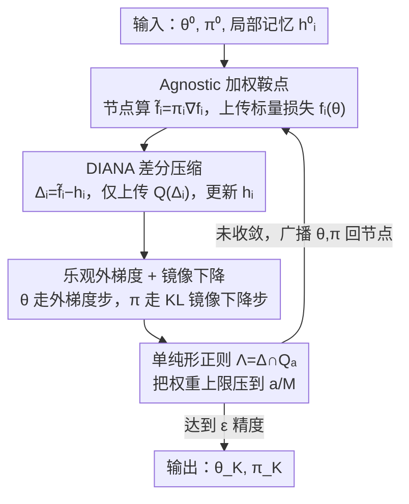

# Unlocking the Potential of Weighting Methods in Federated Learning through Communication Compression

**会议**: ICLR 2026  
**OpenReview**: [https://openreview.net/forum?id=zOWljZMbCm](https://openreview.net/forum?id=zOWljZMbCm)  
**代码**: 无  
**领域**: 联邦学习 / 分布式优化 / 通信压缩  
**关键词**: 加权联邦学习, 通信压缩, 鞍点问题, DIANA, 乐观外梯度

## 一句话总结
本文提出 ADI（Agnostic DIANA），把 DIANA 式的"差分压缩"嵌入到 agnostic 加权联邦学习的鞍点问题求解中，让"自动加权"与"通信压缩"两条原本互不兼容的路线第一次同时成立——既能用 $\min_\theta\max_\pi$ 的加权框架对抗数据异质性，又只需上传压缩后的差分向量与一个标量损失，从而打破通信瓶颈；理论上覆盖精确梯度、随机梯度与部分参与三种场景，实验在 CIFAR-10 异质划分上收敛优于纯压缩 baseline。

## 研究背景与动机

**领域现状**：联邦/分布式学习的标准目标是 $\min_\theta f(\theta)=\frac{1}{M}\sum_{i=1}^M f_i(\theta)$，对所有设备一视同仁。但各节点数据天然异质（数据量、类别分布、噪声水平都不同），于是出现了"加权方法"——把目标改写为 $\min_\theta \sum_i \pi_i f_i(\theta)$，给干净/独特数据的客户端大权重、给噪声客户端小权重。其中最优雅的一支是 **agnostic（对抗式）加权**：$\min_\theta \max_{\pi\in\Lambda} \sum_i \pi_i f_i(\theta)$，权重在训练中自动选出，且服务器只需额外知道各节点的标量损失 $f_i(\theta)$，几乎不增加通信。

**现有痛点**：加权方法迭代复杂度漂亮，却完全没碰联邦学习的另一大核心障碍——**通信瓶颈**。每轮要同步 $d$ 维的局部梯度/模型状态，这一步可能贵到抵消并行的全部收益。换句话说，加权方法只解决了"异质性"，没解决"通信成本"，因此单独拿到真实系统里并不可用。

**核心矛盾**：通信压缩（如 RandK / TopK / 量化）虽然能把上传成本砍下来，但它和 agnostic 加权"接不上"。一是 agnostic 加权本质是**鞍点问题（SPP）**而非经典最小化，绝大多数压缩算法（QSGD、EF21、MARINA、DASHA）都是为最小化设计的，分析无法直接搬过来；二是无偏压缩器的失真随输入范数缩放——在最优点附近直接压缩局部梯度会注入不可消除的噪声，导致理论上出现 irreducible variance 项、实践中在解附近剧烈震荡。

**本文目标**：回答一个具体问题——**能不能把基于加权的方法与通信压缩有效结合起来？** 即在鞍点框架内引入压缩，同时给出精确梯度、随机 oracle、部分参与三种场景的收敛保证。

**切入角度**：作者注意到 DIANA 的关键 trick——不压缩梯度本身，而是压缩"梯度估计与局部记忆状态的差分"。由于差分在最优点附近随步长一起趋零，压缩这个量不会带来不可消除的噪声。把这个机制移植进鞍点求解，就能既享受压缩的便宜、又不破坏收敛到精确解的性质。

**核心 idea**：用"DIANA 式差分压缩 + 乐观外梯度/镜像下降"求解 agnostic 加权鞍点问题，让压缩与加权同时生效，且全程不传输完整梯度。

## 方法详解

### 整体框架

ADI 求解的是 agnostic 加权鞍点问题 $\min_{\theta\in\mathbb{R}^d}\max_{\pi\in\Lambda}\sum_{i=1}^M \pi_i f_i(\theta)$，其中权重 $\pi$ 被约束在单纯形子集 $\Lambda\subseteq\Delta^{M-1}$ 上。每一轮迭代分"节点侧"和"服务器侧"两段：节点算出加权梯度 $\tilde f_i=\pi_i\nabla f_i(\theta)$，与本地记忆 $h_i$ 求差 $\Delta_i=\tilde f_i-h_i$，**只把压缩后的差分** $\hat\Delta_i=Q(\Delta_i)$ 和**标量损失** $f_i(\theta)$ 上传；服务器聚合差分得到关于 $\theta$ 的梯度估计 $g$、用各节点损失拼出关于 $\pi$ 的梯度估计 $p$，然后对 $\theta$ 做一步乐观外梯度更新、对 $\pi$ 做一步带 KL 散度的镜像下降，再把新的 $\theta$、$\pi_i$ 广播回去。整套设计的核心就是：让通信瓶颈所在的 $d$ 维上行向量始终是"被压缩的差分"，而决定权重的信息只是一个标量。

### 关键设计

**1. Agnostic 加权鞍点：用标量损失换自动加权**

加权方法的根本难点是"权重 $\pi_i$ 从哪来"。FedAvg 按数据量定权 $\pi_i=m_i/m$，训练前就固定，只管数量不管质量；后续动态加权方法要么靠梯度差异、要么靠分布散度，往往需要额外通信。本文采用 agnostic 形式 $\min_\theta\max_{\pi\in\Lambda}\sum_i\pi_i f_i(\theta)$，把"选权重"变成对 $\pi$ 的内层 $\max$：哪个客户端损失下降慢（数据更独特/更难），它的 $\pi_i$ 就会被自动抬高，从而把模型往高质量观测上拉、缓解数据失衡。最妙的是，这个机制对通信几乎免费——服务器只需知道每个节点的标量损失 $f_i(\theta)$，上传一个数远比上传压缩梯度还便宜。代价是：问题从经典最小化变成了鞍点问题，给算法设计和收敛分析都带来额外难度，这也是为什么不能直接套用已有压缩算法。

**2. DIANA 式差分压缩：把"压梯度"换成"压差分"，消掉不可消除项**

无偏压缩器满足 $\mathbb{E}[Q(x)]=x,\ \mathbb{E}\|Q(x)\|^2\le\omega\|x\|^2$，其失真随输入范数 $\|x\|$ 缩放。若直接压缩局部梯度，在最优点 $\theta^*$ 附近聚合梯度本应趋零，但压缩注入的噪声却不随之消失，造成实践震荡和理论上的 irreducible variance 项。ADI 借鉴 DIANA：节点不压梯度 $\tilde f_i$，而压它与本地记忆的差分 $\Delta_i^k=\tilde f_i^k-h_i^k$，上传 $\hat\Delta_i^k=Q(\Delta_i^k)$ 后更新 $h_i^{k+1}=h_i^k+\beta\hat\Delta_i^k$。由于各 $f_i$ 是 $L$-光滑的，临近两点的梯度差有界，算法逼近最优时步长变小、要压缩的差分也越来越细，于是局部状态 $h_i^k\to\nabla f_i(\theta^*)$、聚合估计 $h^k\to 0$，从而收敛到**精确最优**而非其邻域。作者特意论证了为何选 DIANA 作压缩底座而非 SOTA 的 DASHA 或 MASHA：DASHA 的分析建立在非凸最小化上、难以移植到 SPP；MASHA 虽在 SPP 下做了压缩，却要周期性传输完整梯度，严重限制实用性。以 DIANA 为底，ADI 既避开了"传完整梯度"，又拿到了消去 irreducible 项的好处。

**3. 乐观外梯度 + 镜像下降：θ 与 π 的双变量交替更新**

鞍点问题不能用朴素的 Descent-Ascent，那对很多简单目标都不收敛。ADI 对原变量 $\theta$ 用乐观（optimistic）外梯度：先做外推 $\hat g^k=(1+\alpha)g^k-\alpha g^{k-1}$，再 $\theta^{k+1}=\theta^k-\gamma_\theta\hat g^k$，每轮只需一次梯度评估却保持外梯度的稳定性。对权重 $\pi$，因为它被约束在单纯形子集 $\Lambda$ 上，用镜像下降（Mirror Descent）、取 KL 散度作 Bregman 散度：

$$\pi^{k+1}=\arg\min_{\pi\in\Lambda}\Big\{-\gamma_\pi\langle\hat p^k,\pi\rangle+D_{\mathrm{KL}}(\pi,\pi^k)\Big\}$$

其中内积前的负号正是来自 agnostic 目标里对 $\pi$ 取 $\max$。把 $\theta$ 的外梯度步与 $\pi$ 的镜像步合在一起，整体构成一步乐观外梯度法，恰好与 DIANA 的差分压缩兼容——后者本身类似方差缩减，二者叠加才使收敛分析中的随机性项被消去。

**4. 单纯形正则 $\Lambda=\Delta^{M-1}\cap Q_a^M$：防止权重塌到噪声客户端**

若让 $\Lambda=\Delta^{M-1}$ 完全自由，最优解会退化成 $\pi_{i_0}=1$、其余为 $0$，把全部权重压到损失最大的那个客户端身上。但损失大未必是"数据独特"，也可能是"噪声严重"——噪声客户端损失降得慢，权重反而被越推越高，最终模型过拟合到噪声。作者用 $\Lambda=\Delta^{M-1}\cap Q_a^M$ 约束，其中 $Q_a^M=\{x\in\mathbb{R}^M\mid 0\le x_i\le a/M\}$，$a\in[1,M]$。参数 $a$ 调节"灵活加权"与"强平均"的折中：$a=1$ 退回均等的标准目标 (1)，$a=M$ 则无额外约束。正则不仅是工程 trick，在理论里也起作用——它能让平方根项加速一个 $\sqrt{a/M}$ 因子。

### 损失函数 / 训练策略

ADI 在三类假设下给出收敛保证：各 $f_i$ 满足 $\tilde L$-Lipschitz（Assumption 1）、$L$-光滑（Assumption 2）、凸（Assumption 3）。收敛以凸-凹鞍点的标准 Gap 函数度量。**精确梯度**下（Theorem 1，取 $\alpha=1,\beta=1/\omega,\gamma_\pi=\gamma_\theta=\gamma\le\gamma_0$）有 $\mathbb{E}[\mathrm{Gap}(z_K)]\le \frac{V}{2\gamma K}$，达到 $\varepsilon$ 精度需

$$\mathcal{O}\!\left(\frac{1}{\varepsilon}\Big[\tilde L\omega^{3/2}+\tilde L M^{1/2}\omega+L\big(\sqrt{a\omega^3/M}+\omega\big)\Big]\right)$$

轮通信。**随机 oracle**下（Theorem 2，Assumption 5：无偏、方差 $\le\sigma^2$）多出一个由 oracle 随机性引入的不可消除项 $\gamma\frac{64a^2\omega^2}{M}\sigma^2$，最优步长相应变为 $\gamma=\min\{\gamma_0,\sqrt{VM/(128a^2\omega^2\sigma^2 K)}\}$。**部分参与**下（Corollary 4-5，节点以 $\eta\sim\mathrm{Bern}(p)$ 参与、上传 $\hat\Delta_i=\frac{\eta_i}{p}Q(\Delta_i)$）只需把压缩率 $\omega$ 按因子 $p$ 缩放即可保持无偏。作者还把凸假设松弛为 Minty 型 Assumption 4，将分析扩展到非凸设定（Corollary 2）。

## 实验关键数据

### 主实验

实验在 CIFAR-10 + ResNet-18 上做图像分类，客户端数 $M=10$，对比对象是只用压缩或只用加权的代表方法：ADI（无压缩）、DIANA、EF21。数据划分含 i.i.d.（各客户端样本量相同、类别均匀）与 non-i.i.d.（Dirichlet $\alpha=0.5$，样本量不均）两种异质度，压缩器用 RandK（$K=10\%,50\%$），均跑 10k 轮随机 oracle 并各自调参。由于加权方法与经典方法形式上解的是不同优化问题 (1) 与 (3)，损失不可直接比，故用准确率衡量。

| 设置 | 压缩器 | 对比基线 | ADI 表现 |
|------|--------|----------|----------|
| non-i.i.d. | Rand10% / Rand50% | DIANA, EF21 | 收敛速度与最终准确率均优于纯压缩基线，异质性越强优势越明显 |
| i.i.d.（同质） | Rand10% / Rand50% | DIANA, EF21 | 与基线相当（加权不损害同质场景） |
| ADI vs ADI(no comp.) | RandK | —— | 压缩仅轻微拖慢迭代收敛，却带来显著的通信比特节省 |

核心结论：加权机制在 non-i.i.d. 下对收敛起决定性作用，且压缩与加权"叠加"几乎不损失迭代效率；当压缩器取 identity 时，ADI 退化为求解问题 (4) 的乐观外梯度法，即一个独立的加权优化器。

### 消融实验

第二组实验（Figure 2）把同样的压缩基线额外加上一个启发式 descent-ascent 风格的 agnostic 加权（RandK $K=10\%$、non-i.i.d.），用来隔离"本文这套有原则的联合压缩-加权设计"到底贡献了多少。

| 方法 | 是否加权 | 现象 |
|------|----------|------|
| DIANA / EF21（原版） | 否 | 高异质下收敛较弱 |
| DIANA / EF21（启发式加权） | 是（朴素整合） | 各方法均有一致提升，但增益有限 |
| ADI（联合设计） | 是（有原则） | 在这些朴素整合之上取得最强增益 |

权重演化分析（Figure 3）显示：初始所有客户端权重相等，训练中权重迅速分化并各自收敛到稳定平台，揭示两个阶段——(i) 早期探索期权重剧烈调整；(ii) 后期稳定期一旦全局模型接近最优、权重几乎不再变。即加权主要作用于高梯度的瞬态阶段，恰是客户端贡献差异最具区分度之时。

## 局限与未来工作

- **理论保证随压缩单调劣化**：加权诱导的项会随压缩率提高而单调恶化收敛保证；只有当权重固定且 $\omega\le M$ 时，压缩才保证不增加通信复杂度——这与加权方法普遍理论保证偏弱（如 FedAvg 强凸下仅次线性）的现状一致。
- **依赖凸/光滑假设**：主结果建立在凸 + 光滑 + Lipschitz 假设上，虽用 Minty 型假设扩展到非凸，但仍未覆盖一般非光滑、强非凸的真实深度网络场景。
- **仅限无偏压缩器**：分析只针对无偏压缩算子（RandK 类），未涵盖 TopK 这类 contractive（有偏）压缩器，作者将其列为未来方向。
- **实验规模有限**：主文实验为 $M=10$、CIFAR-10 量级，更大规模与更细的加权-压缩交互研究放在附录。
- **未来方向**：将鞍点问题的加速方法适配进本框架，以及把分析扩展到 contractive 压缩算子。

<!-- RELATED:START -->

## 相关论文

- [\[ICLR 2026\] Enhancing Communication Compression via Discrepancy-aware Calibration for Federated Learning](enhancing_communication_compression_via_discrepancy-aware_calibration_for_federa.md)
- [\[AAAI 2026\] Personalized Federated Learning with Bidirectional Communication Compression via One-Bit Random Sketching](../../AAAI2026/optimization/personalized_federated_learning_with_bidirectional_communication_compression_via.md)
- [\[ICLR 2026\] LEGACY: A Lightweight Dynamic Gradient Compression Strategy for Distributed Deep Learning](legacy_a_lightweight_dynamic_gradient_compression_strategy_for_distributed_deep_.md)
- [\[ICLR 2026\] The Potential of Second-Order Optimization for LLMs: A Study with Full Gauss-Newton](the_potential_of_second-order_optimization_for_llms_a_study_with_full_gauss-newt.md)
- [\[ICLR 2026\] DeepAFL: Deep Analytic Federated Learning](deepafl_deep_analytic_federated_learning.md)

<!-- RELATED:END -->
